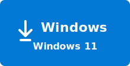

# ⬇️ Download the Discovery app

<table>
  <tr>
    <td align="center" width="320">
      <br>
      <a href="https://aka.ms/discovery/download/current"></a><br>
      <strong>User Installer</strong>
      <a href="https://aka.ms/discovery/download/current"><strong>x64</strong></a>
      <a href="https://aka.ms/downloads/arm64/current"><strong>Arm64</strong></a>
    </td>
    <td valign="middle">
      A self-contained Windows app - no SDK, no cloud setup. Current release: <strong>v0.15.4</strong>.<br>
      <sub>macOS and Linux are not supported yet. Windows x64 and Windows ARM64 installers are available today.</sub><br><br>
      🛠️ <a href="docs/discovery-app/install.md">Install guide</a> - setup, verification, and upgrade steps.
    </td>
  </tr>
</table>

**Previous release** — this repo keeps only the current and the immediately preceding version available for download.

| Version | Date | Platform | Installer |
| --- | --- | --- | --- |
| v0.15.3 _(previous)_ | 2026-06-22 | Windows x64 | [`Discovery-app-0.15.3-preview-win-x64.exe`](https://aka.ms/discovery/download/previous) |

---

# Microsoft Discovery community

Welcome to the **Microsoft Discovery community** — the public home for the Discovery platform, where users, partners, and the product team build together. Share what you've built, ask questions, file bugs, suggest ideas, and see what other Discovery users are doing across disciplines.

> **Microsoft Discovery is an extensible platform that brings together agentic orchestration, advanced reasoning, a graph-based knowledge foundation, and high-performance computing for accelerating scientific research and R&D workflows.**

Microsoft Discovery is offered in two complementary experiences: an enterprise-grade platform powered by Azure, and a local app with select features and capabilities. The two share the same core concepts and features.

| Experience | What it is | Where to start |
| --- | --- | --- |
| 🖥️ **Microsoft Discovery app** | A local-first Windows client for individual evaluation on a laptop. **Distributed from this repository.** | [`docs/discovery-app/`](docs/discovery-app/) — install, quickstart, feedback |
| ☁️ **Microsoft Discovery** | The cloud-hosted, team-scale experience on Azure. | [Microsoft Learn](https://learn.microsoft.com/en-us/azure/microsoft-discovery/) — full reference |

In addition, this repository hosts the **public Discovery Catalog** — the canonical metadata catalog of AI research **agents** and **starter kits** contributed by Microsoft and ecosystem partners. Agent code, container images, and model weights live in each contributor's own infrastructure; the metadata and documentation that describe them live here, where they are PR-reviewed, schema-validated, and surfaced to every Discovery user.

---

## 🧭 Core concepts

The canonical conceptual reference for both the app and the services is [Microsoft Discovery on Microsoft Learn](https://learn.microsoft.com/en-us/azure/microsoft-discovery/). The starting points most users want:

- [Microsoft Discovery & the Microsoft Discovery app](https://learn.microsoft.com/azure/microsoft-discovery/concept-discovery-and-discovery-app) - detailed comparison of Discovery experiences 
- [Discovery Agent concepts](https://learn.microsoft.com/azure/microsoft-discovery/concept-discovery-agent) — what an agent is and how it's invoked
- [Discovery Engine overview](https://learn.microsoft.com/azure/microsoft-discovery/concept-discovery-engine) — the cognition layer
- [Bookshelf and Knowledge Bases](https://learn.microsoft.com/azure/microsoft-discovery/concept-bookshelf-knowledge-bases) — how indexing and retrieval work
- [Tasks and investigations](https://learn.microsoft.com/azure/microsoft-discovery/concept-tasks-investigations) — the task-graph model

For an app-specific 15-minute hands-on tour, see [`docs/discovery-app/quickstart.md`](docs/discovery-app/quickstart.md).

---

## 📦 What's in this repository

| Surface | What it is | Best for |
| --- | --- | --- |
| 🤖 **[`agents/`](/agents/)** | Catalog of AI research agents (1P and 3P) surfaced in Discovery. Each entry contains a `metadata.yaml`, `agent.yaml`, `README.md`, and optional `tools/`. | Browsing what's available, or contributing a new agent. |
| 📑 **[`docs/`](/docs/)** | Documentation and pointers for both Microsoft Discovery and the Discovery app, including documentation for authoring guides and schemas. | Learning more about Discovery experiences and best practices. |
| 🎥 **[How to videos](/docs/how-to-videos/README.md)** | Curated how-to video content for Discovery workflows and onboarding. | Watching guided walkthroughs and quick task demos. |
| 🧰 **[`starter-kits/`](/starter-kits/)** | Catalog of starter kits — `kit.json` manifests that bundle one or more catalog agents into a launchable scenario. | Browsing pre-built workflows, or publishing a new kit. |
| 💬 **[Discussions](https://github.com/microsoft/discovery/discussions)** | Q&A, Ideas, Bugs, and Show-and-tell — the single place for everything from "how do I…?" to bug reports, ideas, and sharing what you've built. | Asking questions, suggesting ideas, sharing what you've built, and reporting bugs. |
| 🧪 **[`.github/skills/`](.github/skills/)** | Three Copilot skills auto-discovered by Copilot CLI and VS Code Copilot Chat — for browsing the catalog and deploying agents / starter kits to **Microsoft Discovery services** (cloud, via Microsoft Foundry). Not used by the local Discovery app today. | Researchers and developers integrating the catalog into a Microsoft Foundry workflow. |

---

## 🚀 Get started

### Install and use the Discovery app

The Microsoft Discovery app is a **self-contained Windows application** — no SDK, no cloud setup, no IT ticket. Download the latest release installer and follow the [Quickstart guide](docs/discovery-app/quickstart.md) to get started. 

**Have feedback?** See [`docs/discovery-app/feedback.md`](docs/discovery-app/feedback.md).

### Browse the catalog

- **Agents:** open the `agents/` directory — each folder is one agent with its own `README.md`.
- **Starter kits:** open the `starter-kits/` directory — each folder contains a single `kit.json` describing the bundled agents, sample prompts, and risk profile.
- **Programmatic access:** the same content is exposed as a single aggregated JSON in [`.auto-registry/agent-registry.json`](.auto-registry/agent-registry.json) and [`.auto-registry/starter-kit-registry.json`](.auto-registry/starter-kit-registry.json), regenerated automatically on every merge.

---

## 🤝 Contributing

All contributions — from Microsoft engineers and external partners — arrive via **pull request from a fork**. Direct pushes to `main` are not permitted.

| Type | Goes to | First read |
| --- | --- | --- |
| **New agent** | `agents/<agent-name>/` | [Agent authoring guide](docs/authoring-guides/agent-authoring-guide.md) |
| **New starter kit** | `starter-kits/<kit-name>/` | [Starter-kit authoring guide](docs/authoring-guides/starter-kit-authoring-guide.md) |
| **Documentation fix** | `docs/`, `README.md`, etc. | [`CONTRIBUTING.md`](CONTRIBUTING.md) |
| **Idea / feature request** | [Discussions → Ideas](https://github.com/microsoft/discovery/discussions/categories/ideas) | — |
| **Bug** | [Discussions → Bugs](https://github.com/microsoft/discovery/discussions/categories/bugs) | — |
| **Question** | [Discussions → Q&A](https://github.com/microsoft/discovery/discussions/categories/q-a) | — |
| **Something you built** | [Discussions → Show and tell](https://github.com/microsoft/discovery/discussions/categories/show-and-tell) | — |
| **Schema / workflow change** | PR against `docs/schemas/` or `.github/workflows/` — **Microsoft maintainers only**; open an Idea first. | [`CONTRIBUTING.md`](CONTRIBUTING.md) |

The full contributor contract is in [`CONTRIBUTING.md`](CONTRIBUTING.md). Every PR runs through an automated review that validates structure, schemas, policy, documentation, and secrets — failures are reported inline with rule IDs and remediation hints.

### Quick start for catalog contributors

```bash
# Fork microsoft/discovery on GitHub, then:
git clone https://github.com/<your-alias>/discovery.git
cd discovery
git remote add upstream https://github.com/microsoft/discovery.git

# Create a branch and add your agent (or starter-kit) folder
git checkout -b add-my-agent
mkdir agents/my-agent
# … author metadata.yaml, agent.yaml, README.md (see authoring guide)

# Push and open a PR targeting upstream/main
git push origin add-my-agent
```

---

## 🆘 Getting help

Everything community-facing goes to **[Discussions](https://github.com/microsoft/discovery/discussions)**, posted in the matching category:

- **Questions / how-to** → [Q&A](https://github.com/microsoft/discovery/discussions/categories/q-a)
- **Bugs** → [Bugs](https://github.com/microsoft/discovery/discussions/categories/bugs) (the Bug template prompts you for version, repro steps, logs)
- **Ideas** → [Ideas](https://github.com/microsoft/discovery/discussions/categories/ideas)
- **Show what you've built** → [Show and tell](https://github.com/microsoft/discovery/discussions/categories/show-and-tell)

For security-sensitive reports, follow [`SECURITY.md`](SECURITY.md) — **do not** open a public Discussion or issue for vulnerabilities.

---

## 🗂️ Repository layout

```text
discovery/
├── agents/
│   └── <agent-name>/                         ← flat catalog: one folder per agent
│       ├── metadata.yaml                     ← Discovery catalog contract (required)
│       ├── agent.yaml                        ← Prompt-agent definition (required)
│       ├── README.md                         ← Agent documentation (required)
│       └── tools/<tool-name>/                ← Discovery-managed tools (optional)
│           ├── tool.yaml
│           └── Dockerfile
├── starter-kits/
│   └── <kit-name>/                           ← flat catalog: one folder per kit
│       └── kit.json                          ← Starter-kit manifest (required, the only file allowed in the folder)
├── .auto-registry/                           ← Auto-generated catalog registries; do not edit by hand
│   ├── agent-registry.json                   ← Aggregated agent metadata from agents/*/
│   └── starter-kit-registry.json             ← Aggregated starter-kit metadata from starter-kits/*/
├── docs/
│   ├── discovery-app/                        ← End-user docs for the Discovery app
│   │   ├── install.md
│   │   ├── quickstart.md
│   │   └── feedback.md
│   ├── discovery-services/                   ← Pointer to Microsoft Learn (services live there)
│   ├── authoring-guides/                     ← How to author and submit catalog content
│   │   ├── agent-authoring-guide.md
│   │   └── starter-kit-authoring-guide.md
│   └── schemas/                              ← Canonical JSON schemas (*-schema.json)
├── utilities/                                ← Operator PowerShell scripts for Discovery services (resource-provider registration, RBAC, data-asset migration)
├── .github/
│   ├── skills/                               ← Copilot skills (auto-discovered)
│   │   ├── discovery-catalog/                ← Read-only catalog inventory
│   │   ├── discovery-services-agent-deployer/          ← Agent deployment to Microsoft Foundry
│   │   ├── discovery-services-starter-kit-deployer/    ← Starter-kit deployment to Microsoft Foundry
│   │   └── README.md                         ← Skill documentation
│   ├── DISCUSSION_TEMPLATE/                  ← Templates for Bugs / Ideas / Q&A / Show-and-tell
│   ├── workflows/                            ← Automated PR validation and registry pipelines
│   ├── scripts/                              ← Python validation and registry-builder scripts
│   ├── CODEOWNERS                            ← Maintainer assignments
│   └── pull_request_template.md
└── .vscode/                                  ← Editor settings: wires JSON Schemas to YAML/JSON files; recommends Copilot, PowerShell, Python, YAML, and markdownlint extensions
```

> The catalog uses a **flat layout** — there is no Microsoft-versus-partner folder split. The optional `party` field inside `metadata.yaml` and `kit.json` (`1p` for Microsoft-authored, `3p` for partner-contributed) drives PR labels and surfacing; it is not encoded in the folder path.

---

## ⚖️ Terms

This project follows the [Microsoft Open Source Code of Conduct](https://opensource.microsoft.com/codeofconduct/). To report a security vulnerability, see [`SECURITY.md`](SECURITY.md).

**Trademarks** — this project may contain trademarks or logos for projects, products, or services. Authorized use of Microsoft trademarks or logos is subject to and must follow [Microsoft's Trademark & Brand Guidelines](https://www.microsoft.com/en-us/legal/intellectualproperty/trademarks/usage/general). Use of Microsoft trademarks or logos in modified versions of this project must not cause confusion or imply Microsoft sponsorship. Any use of third-party trademarks or logos is subject to those third parties' policies.

Third-party agent entries in the catalog are governed solely by each partner's own terms — see the individual agent `README.md` for details.
