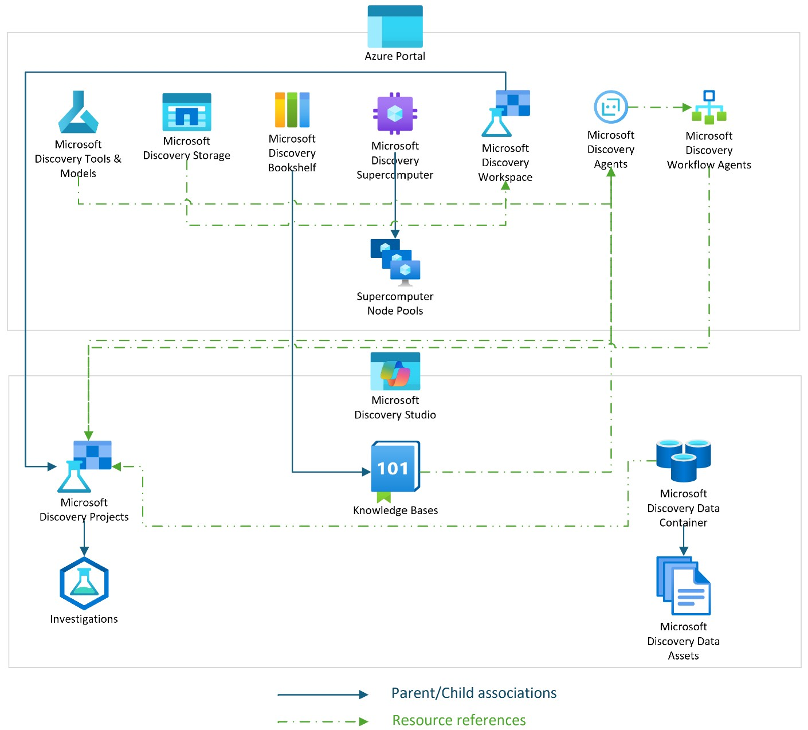

# Microsoft Discovery Resource Types

Microsoft Discovery is an integrated platform that supports the entire scientific discovery lifecycle—and parallel engineering design processes—from hypothesis generation to computational simulation to results analysis. This article outlines the new Azure resources introduced and managed by the platform, which are required for all user-initiated research and investigations.

## Workspace

A Workspace is a logical boundary that encapsulates all resources—such as projects, data, and compute—within a user or team's scope. Workspaces help organize and isolate projects, manage access, and provision infrastructure for scientific research and engineering projects. 

## Project

A Project is a child resource of a Workspace that groups related artifacts such as agents, tools, and models for a specific scientific goal, experiment or an engineering objective. Projects can be assigned dedicated compute capacity to run simulations or analyses. They help structure work by aligning resources under a common objective, enabling reproducibility and collaboration.

## Data Container

A Data Container is a storage abstraction that holds one or more Data Assets, backed by either Blob Storage or Network File System (NFS). It supports versioning, access control, and integration with the platform's compute infrastructure.

## Data Asset

A Data Asset, a child resource of a Data Container, refers to a file or a folder within a Data Container. It can be versioned or tagged with metadata. Integrated with Supercomputer, Data Assets are used as inputs or outputs for tools and models, and can be rendered in the UI or accessed programmatically.

## Supercomputer

A Supercomputer is a high-performance computing resource integrated with the Microsoft Discovery platform to execute large-scale containerized workloads. It supports diverse computational models using technologies such as Message Passing Interface (MPI) and Simple Linux Utility for Resource Management (SLURM).

## Nodepool

A Nodepool, a child resource of a Supercomputer, is a group of compute nodes within a Supercomputer cluster, configured for specific workloads or performance profiles. Nodepools are selected based on workload requirements such as GPU, memory or other resource needs and are allocated to specific projects.

## Bookshelf

A Bookshelf is a collection of artifacts known as Knowledge Bases (KB). Knowledge bases are used to ground user prommpts in tasks such as question answering, summarization, reasoning, and logical inference.

## Agent

A Microsoft Discovery Agent is a runtime AI assistant that executes tasks on behalf of a user, often as part of a user-defined workflow. Agents handle data operations and coordinate tool or model execution across compute environments.

## Tool

A Microsoft Discovery Tool is a containerized executable that performs a specific scientific or data-processing function. Tools are deployed and invoked by agents to run on the Supercomputer as part of a workflow.

## Model

A Microsoft Discovery Model is a trained, purpose-built machine learning or simulation model for a specific scientific or engineering task deployed by the platform. Models must be registered in the Azure AI Model Catalog and are invoked by agents as part of a workflow.
