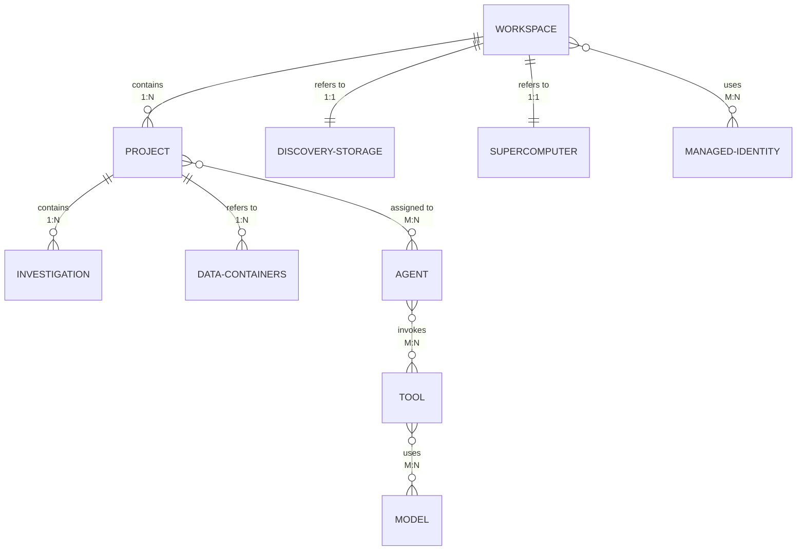
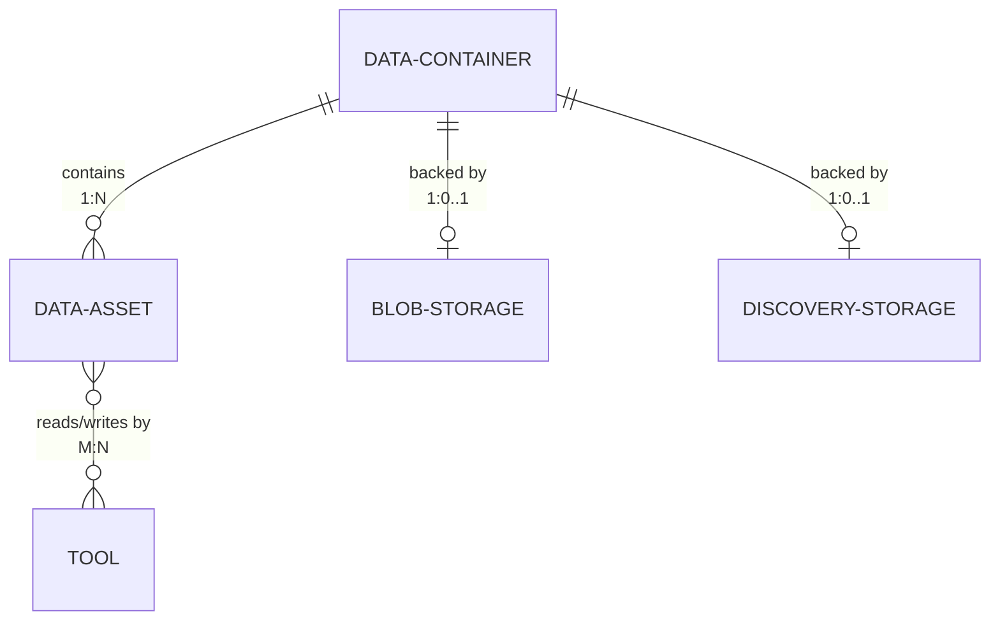
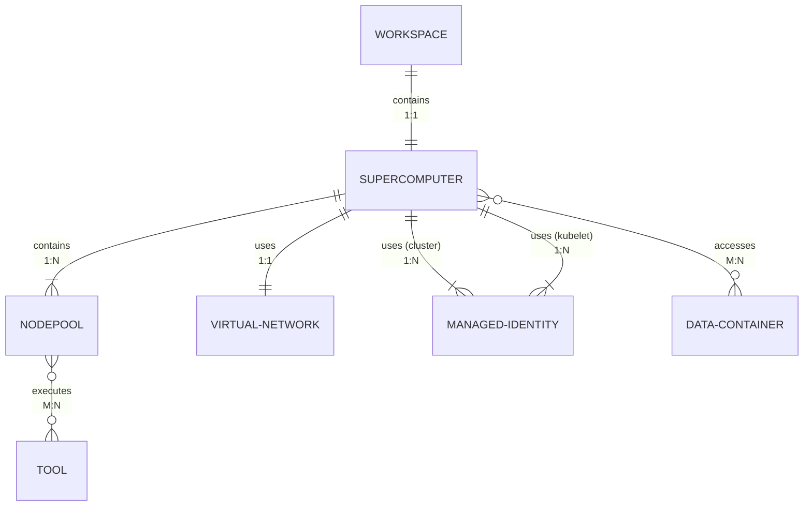
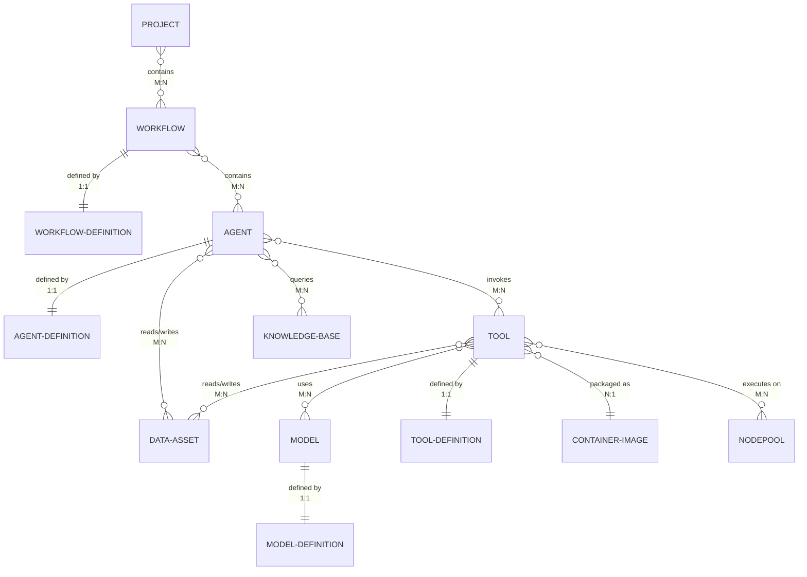
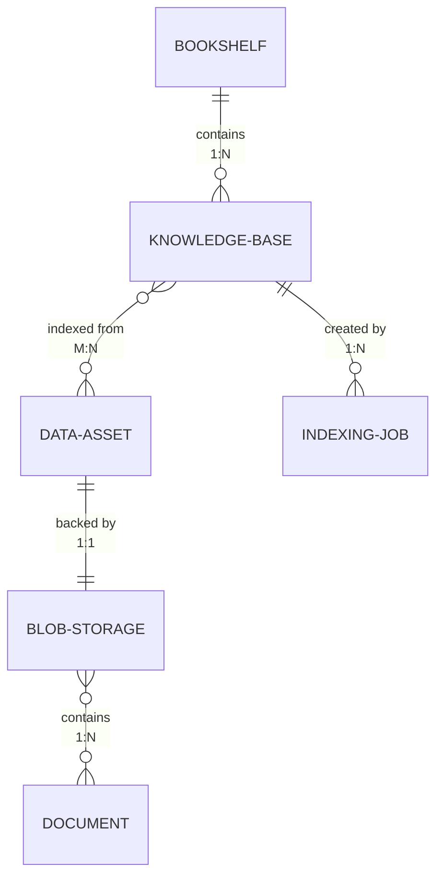
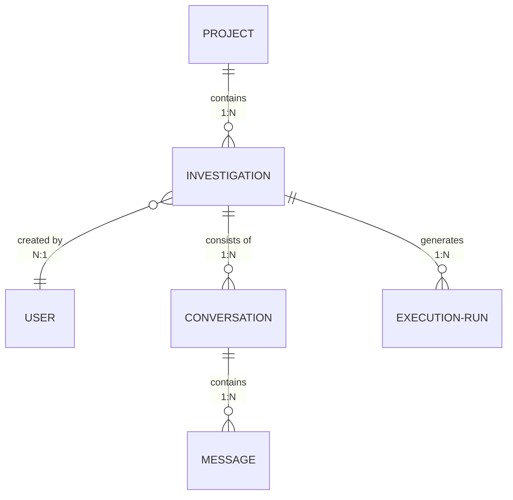
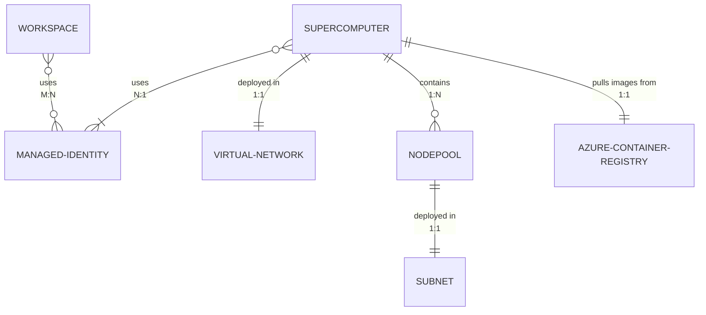
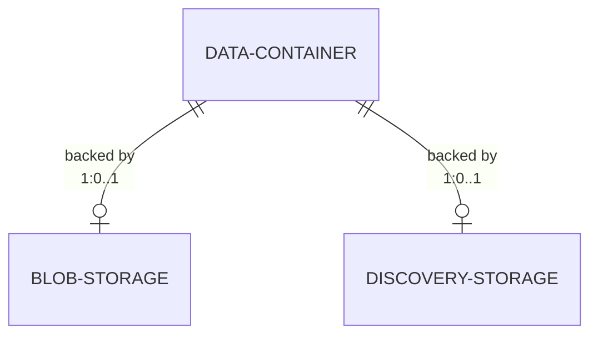

# Microsoft Discovery Resources Entity Relationship Diagrams

This document provides detailed entity relationship diagrams (ERDs) with cardinality for Microsoft Discovery resources, broken down into logical groupings for clarity.

## 1. Core Resource Hierarchy

This diagram shows the fundamental containment relationships starting from Workspace.

---

## 2. Storage and Data Management

This diagram illustrates the data storage architecture with Data Containers and Data Assets.

---

## 3. Supercomputer Resources

This diagram shows the Supercomputer and Nodepool relationships with infrastructure.

---

## 4. Agent, Tool, and Model Ecosystem

This diagram shows how Agents, Tools, and Models interact and are deployed.

---

## 5. Knowledge Management (Bookshelf)

This diagram illustrates the Bookshelf service and Knowledge Base architecture.

---

## 6. Investigation and User Interaction

This diagram shows how users interact with the platform through Investigations and Copilot.

---

## 7. External Azure Service Dependencies

This section shows how Discovery resources integrate with external Azure services.

### 7.1 Workspace and Supercomputer Dependencies

---

### 7.2 Storage Dependencies

---

---

## Resource Multiplicity Summary

| Parent Resource | Child Resource | Cardinality | Notes |
|----------------|----------------|-------------|-------|
| Workspace | Project | 1:N | One workspace contains many projects |
| Workspace | Discovery-Storage | 1:1 | One workspace refers to one discovery storage |
| Workspace | Supercomputer | 1:1 | One workspace has exactly one supercomputer |
| Workspace | Managed Identity | M:N | Workspace uses multiple managed identities |
| Project | Investigation | 1:N | One project contains many investigations |
| Project | Workflow | M:N | Projects can have multiple workflows; workflows can belong to multiple projects |
| Project | Data Container | 1:N | One project refers to many data containers |
| Project | Agent | M:N | Projects can use multiple agents; agents can be assigned to multiple projects |
| Workflow | Workflow-Definition | 1:1 | One workflow is defined by one workflow definition |
| Workflow | Agent | M:N | Workflows can contain multiple agents; agents can be in multiple workflows |
| Agent | Agent-Definition | 1:1 | One agent is defined by one agent definition |
| Agent | Tool | M:N | Agents can invoke multiple tools; tools can be invoked by multiple agents |
| Agent | Knowledge Base | M:N | Agents can query multiple KBs; KBs can be queried by multiple agents |
| Agent | Data Asset | M:N | Agents can access multiple data assets; data assets can be accessed by multiple agents |
| Tool | Tool-Definition | 1:1 | One tool is defined by one tool definition |
| Tool | Model | M:N | Tools can use multiple models; models can be used by multiple tools |
| Tool | Container Image | N:1 | Multiple tools are packaged as one container image |
| Tool | Nodepool | M:N | Tools can execute on multiple nodepools; nodepools can run multiple tools |
| Tool | Data Asset | M:N | Tools can read/write multiple data assets; data assets can be accessed by multiple tools |
| Model | Model-Definition | 1:1 | One model is defined by one model definition |
| Supercomputer | Nodepool | 1:N (min 1) | One supercomputer must have at least one nodepool |
| Supercomputer | Virtual Network | 1:1 | One supercomputer uses one virtual network |
| Supercomputer | Managed Identity | 1:N | One supercomputer uses multiple managed identities (cluster, kubelet) |
| Supercomputer | Data Container | M:N | Supercomputer accesses multiple data containers |
| Supercomputer | Azure Container Registry | 1:1 | One supercomputer pulls images from one ACR |
| Nodepool | Tool | M:N | Nodepools can execute multiple tools; tools can run on multiple nodepools |
| Nodepool | Subnet | 1:1 | One nodepool is deployed in one subnet |
| Data Container | Data Asset | 1:N | One container holds many data assets |
| Data Container | Blob Storage | 1:0..1 | One data container may be backed by one blob storage |
| Data Container | Discovery Storage | 1:0..1 | One data container may be backed by one discovery storage |
| Bookshelf | Knowledge Base | 1:N | One bookshelf contains many knowledge bases |
| Knowledge Base | Data Asset | M:N | Knowledge bases are indexed from multiple data assets |
| Knowledge Base | Indexing Job | 1:N | One KB is created by multiple indexing jobs |
| Data Asset | Blob Storage | 1:1 | One data asset is backed by one blob storage |
| Blob Storage | Document | 1:N | One blob storage contains many documents |
| Investigation | User | N:1 | Multiple investigations are created by one user |
| Investigation | Conversation | 1:N | One investigation can have multiple conversations |
| Investigation | Execution Run | 1:N | One investigation generates multiple execution runs |
| Conversation | Message | 1:N | One conversation contains many messages |
