# Quickstart: Get started with Microsoft Discovery

In this quickstart, you will complete all prerequisites to use Microsoft Discovery to:

- Create a workspace
- Create an agent and a workflow
- Explore Microsoft Discovery Studio
- Create a project
- Chat with copilot

## 1. Prerequisites

- You must have an **active [Azure subscription](https://portal.azure.com/)** that has been enabled for Microsoft Discovery by the event organizers.
- You need **sufficient permissions** in your Azure subscription to register resource providers and create resources. Specifically:
  - The **Owner** role is required to:
    - Assign the required roles to others (Platform Admins, Scientists and Engineers) who will manage and then use the Discovery resources
    - More details are covered [here](#1b-assign-roles-to-administrators-to-be-performed-by-subscription-owner)
- Ensure your subscription has the necessary **Azure Foundry, Azure OpenAI quotas, and VM SKU/quotas** in your chosen region. For details, see [Quotas and Limits](../4-how-to/2-onboarding-experience/b--quota-reservations.md).
- Ensure you have an existing **Resource Group** or [create new](https://learn.microsoft.com/azure/azure-resource-manager/management/manage-resource-groups-portal). **Note**: To create a resource group, the user needs to have "Contributor" role in the subscription.
- Prepare a **Virtual Network and subnets** for Storage, Workspace, and Supercomputer resources. See [Create a virtual network and subnets](#1c-create-a-virtual-network-and-subnets).
- Set up a **User Assigned Managed Identity (UAMI)** with the required Azure role assignments for Supercomputer, Workspace, and Azure Blob Storage resources. See [Create User Assigned Managed Identity (UAMI)](#1d-create-user-assigned-managed-identity-uami).
- Make sure Microsoft Discovery has the necessary permissions to access required resources in your subscription.
- As of now, Microsoft Discovery resources are supported only in 4 regions - East US, East US 2, Sweden Central and UK South. All the resources related to a single deployment should be created in same region for best results.

### 1a. Register resource provider (to be performed by Subscription Owner or Contributor)

To register a resource provider in your Azure subscription, you need to have a Contributor or higher privileged role (e.g., Owner) and follow the steps below:

1. Sign in to the [Azure Portal](https://portal.azure.com)
1. Navigate to Subscriptions and select your subscription
1. In the left-hand menu, select Resource Providers
1. Search for `Microsoft.Discovery`
1. Select the provider name and click Register.

> [!NOTE]
> You should also ensure that the following resource providers are already registered on this subscription. If not, please register these resource providers:
> `Microsoft.Network`
> `Microsoft.Compute`
> `Microsoft.Storage`
> `Microsoft.ManagedIdentity`
> `Microsoft.AlertsManagement`
> `Microsoft.Authorization`
> `Microsoft.CognitiveServices`
> `Microsoft.ContainerInstance`
> `Microsoft.ContainerRegistry`
> `Microsoft.ContainerService`
> `Microsoft.DocumentDB`
> `Microsoft.Features`
> `Microsoft.KeyVault`
> `Microsoft.MachineLearningServices`
> `Microsoft.NetApp`
> `Microsoft.OperationalInsights`
> `Microsoft.ResourceGraph`
> `Microsoft.Search`
> `Microsoft.Web`
> `Microsoft.Insights`
> `Microsoft.Resources`
> `Microsoft.Sql`
> `Microsoft.App`
> `Microsoft.Bing`

### 1b. Assign roles to Administrators (to be performed by Subscription Owner)

Assign following built-in roles to the users at desired scope (subscription or resource group):

- Microsoft Discovery Platform Administrator (Preview)
- Managed Identity Contributor
- Managed Identity Operator
- Storage Account Contributor
- Storage Blob Data Contributor
- Network Contributor
- ACRPush

Steps to assign roles:

1. Sign in to the [Azure Portal](https://portal.azure.com)
1. Navigate to Subscriptions and select your subscription
1. In the left-hand menu, select "Access control (IAM)"
1. Click "Add" and then select "Add role assignment"
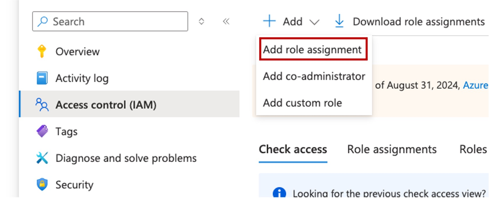
1. On "Add role assignment" blade, search for roles mentioned above, **one role at a time** and press "Next" button at the bottom of the window.
1. Once on "Members" tab, ensure you have selected "Assign access to" as "User, group, or service principal".
1. Then select "+Select members". This opens up a popup on right, where you need to select members to whom this permission needs to be assigned. Once done, select the "Next" button at bottom of the window.
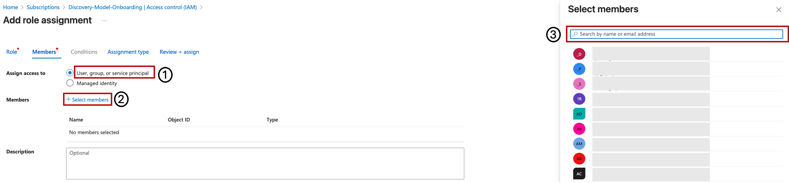
1. On "Conditions" tab, select "Allow user to assign all roles except privileged administrator roles Owner, UAA, RBAC (Recommended)" and then select "Next" at bottom of window.
1. On "Assignment Type" tab, select the configuration that best suits your organization and then select "Next" at bottom of window.
1. Finally, on "Review + assign" tab, verify all the information and select "Review + assign" button at the bottom.

Repeat the process for all the roles as mentioned in list above.

### 1c. Create a virtual network and subnets

1. Sign in to the [Azure Portal](https://portal.azure.com)
1. Search for `Virtual networks` and select it from the results
1. Click "Create" to start creating a new virtual network
1. Enter resource details such as Subscription, Resource Group, Name, and Region and click next
1. Configure IP addresses:
   - IPv4 address space: Enter your chosen CIDR block (e.g., `10.0.0.0/16`)
   - Add the following subnets
       - `storageSubnet` : `10.0.1.0/24`
       - `supercomputerNodepoolSubnet` : `10.0.2.0/24`
       - `aksSubnet` : `10.0.3.0/24`
       - `workspaceSubnet`: `10.0.4.0/24` # Don't create this subnet for eastus. The support will be added in upcoming release.
1. Review and create the virtual network
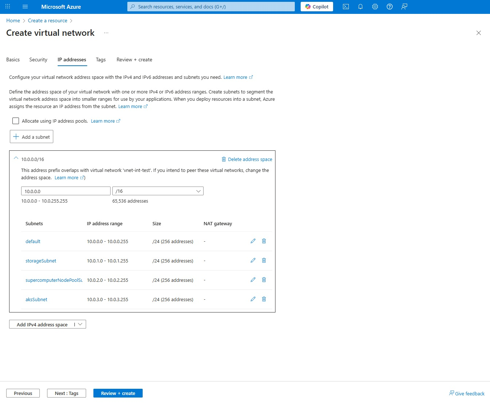
1. Click the virtual network you just created to enter the Virtual Network view in the portal, and in the left pane in the portal click "Subnets" under "Settings"
1. Click "storageSubnet" in the main view
1. In the flyout window "Edit subnet", scroll down to "Subnet Delegation", and search for `Microsoft.NetApp/volumes` and select it from the results
1. Click "Save"
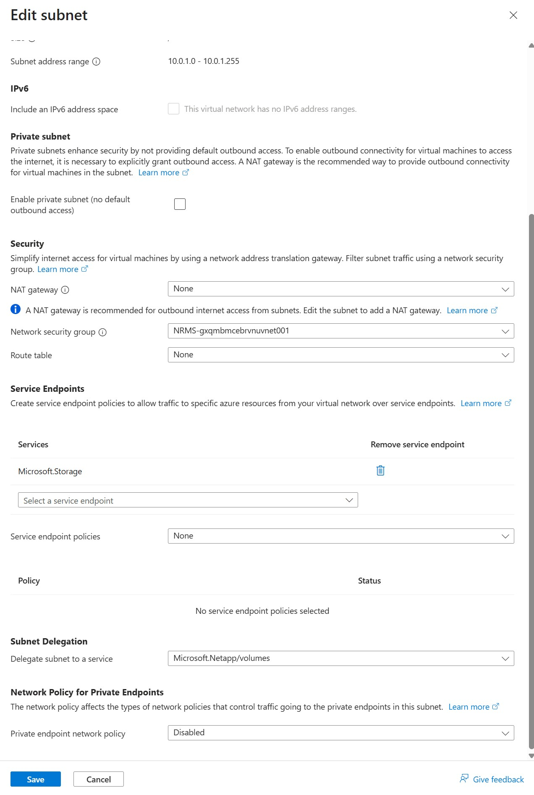
1. Under the subnets on virtual networks page, click "workspaceSubnet".
1. In the flyout window "Edit subnet", scroll down to "Subnet Delegation", and search for `Microsoft.App/environments` and select it from the results
1. Click "Save"

> **Note:** Network Security Groups (NSGs) are not specifically required for this step, but it's a general best practice depending on your organization policies to implement NSGs for each subnet in a virtual network.

### 1d. Create User Assigned Managed Identity (UAMI)

You can create different UAMI each with their own required permissions for specific resource access or you can create a single UAMI and provide all the necessary permissions for the platform. For this exercise, we will use a single UAMI, follow the steps below to create one:

1. Sign in to the [Azure Portal](https://portal.azure.com)
2. Search for `Managed Identities` and select it from the list
3. Click "Create"
4. Fill in the required details such as subscription, resource group, region, and name
5. Click "Review + Create" and then "Create"

Assign following built-in roles to the new User Assigned Managed Identity resource:

- Microsoft Discovery Platform Contributor (Preview)
- Storage Blob Data Contributor
- ACRPull

1. Navigate to Subscriptions and select your subscription
1. In the left-hand menu, select "Access control (IAM)"
1. Click "Add" and then select "Add role assignment"
1. On "Add role assignment" blade, search for roles mentioned above, **one role at a time** and press "Next" button at the bottom of the window.
1. Once on "Members" tab, ensure you have selected "Assign access to" as "Managed Identity".
1. Then select "+ Select members". This opens up a flyout window "Select managed identities" from right. Select your subscription, "User-assigned managed identity", and your own managed identity resource, and click "Select" at the bottom.
1. Finally, on "Review + assign" tab, verify all the information and select "Review+Assign" button at the bottom.

### 1e. Create an Azure Blob Storage Account

To store output data of your investigations, you will need to create a storage account or use an existing one with the following requirements:

- Create a container within the storage account named "discoveryoutputs" where the output files will be stored.
- The storage account must allow access from the Virtual Network used to create Supercomputer.
- The storage account must also allow access from your client public IP or local network to be able to access the output data.
- The storage account must have the correct CORS settings. You must have these origins allowed: `https://studio.discovery.microsoft.com`, `https://vscode.dev`, and `https://*.vscode-cdn.net`. For both, set the allowed operations to include "GET", "HEAD", "DELETE", and "PUT". This setting can be found under "Resource sharing (CORS) page under settings tab. Ensure value for `Allowed Headers` and `Exposed Headers` is set to "*", `Max Age` is set to '200'.
- The storage account must allow "Storage Blob Data Contributor" access to the UAMI that we created in the [previous step](#1d-create-user-assigned-managed-identity-uami)

To create a blob storage account, follow the steps below:

1. Sign in to the [Azure Portal](https://portal.azure.com)
1. Search for `Storage accounts` and select it from the results
1. Click "Create" to start creating a new storage account
1. Enter resource details such as Subscription, Resource Group, Name, and Region
1. Select Primary service as `Azure Blob Storage` and click the "Networking" tab
1. In the networking tab, in the public network access scope, select "Enable public access from selected virutal networks and IP addresses"
1. Select the Virtual Network and all the subnets that we created in [step 1c](#1c-create-a-virtual-network-and-subnets) except defaultSubnet which can be reserved for later usage if needed.
    > Ensure you add workspaceSubnet as well in order to allow workspace functions to access storage account for and performing data handling functions.
1. Select "Add your client IP address" if you are accessing data over internet or make sure your client can access the storage account and VNet either via private link or Site-to-Site VPN or ExpressRoute.
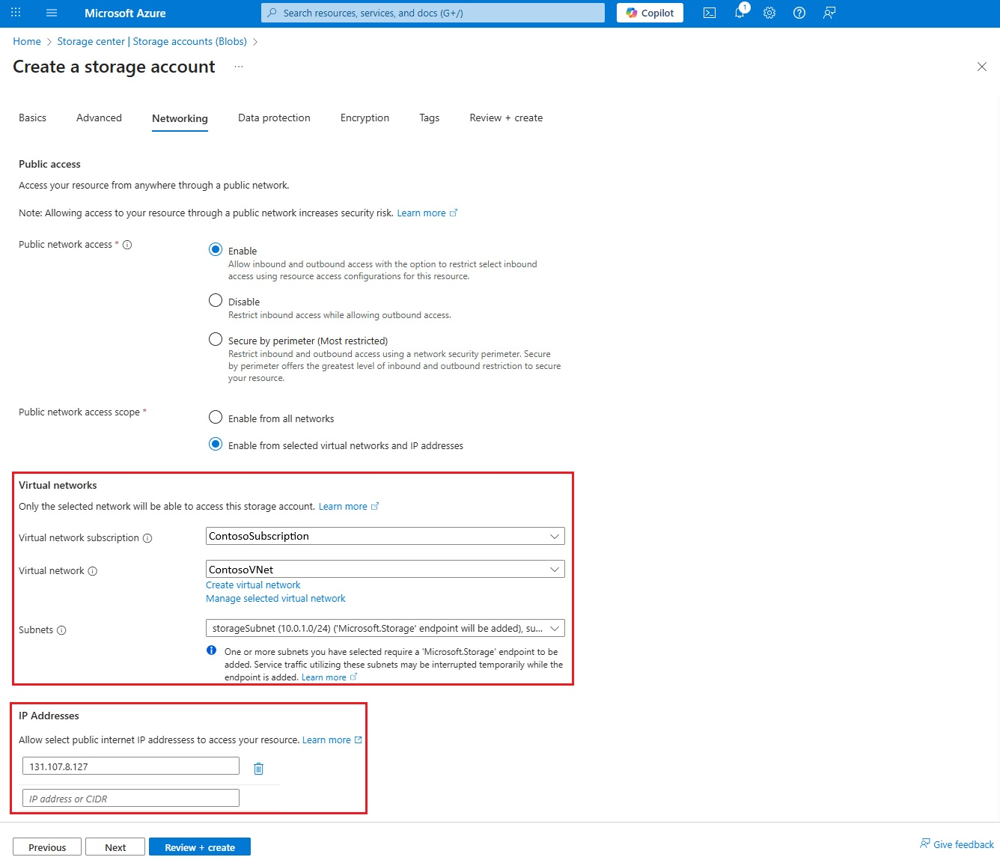

1. Click "Review + create" and click "Create"

> **Note:** Output data assets that are created within an investigation are stored in the storage account created above. To view and download the output files, your client/browser will need network access to the blob storage. Network access can be allowed via public internet, in which case, you can either open public access to all (less secure) or allow your client's public IP address in the storage networking and firewall settings. Otherwise, your client needs to have private access to the storage account configured either via Azure VPN or ExpressRoute.

#### Create container

1. Once the storage account is created, navigate to the resource overview page
1. In the left navigation pane, under "Data storage" tab, select Containers
1. Click "Add container" on top
1. Enter `discoveryoutputs` as the name and click "Create"
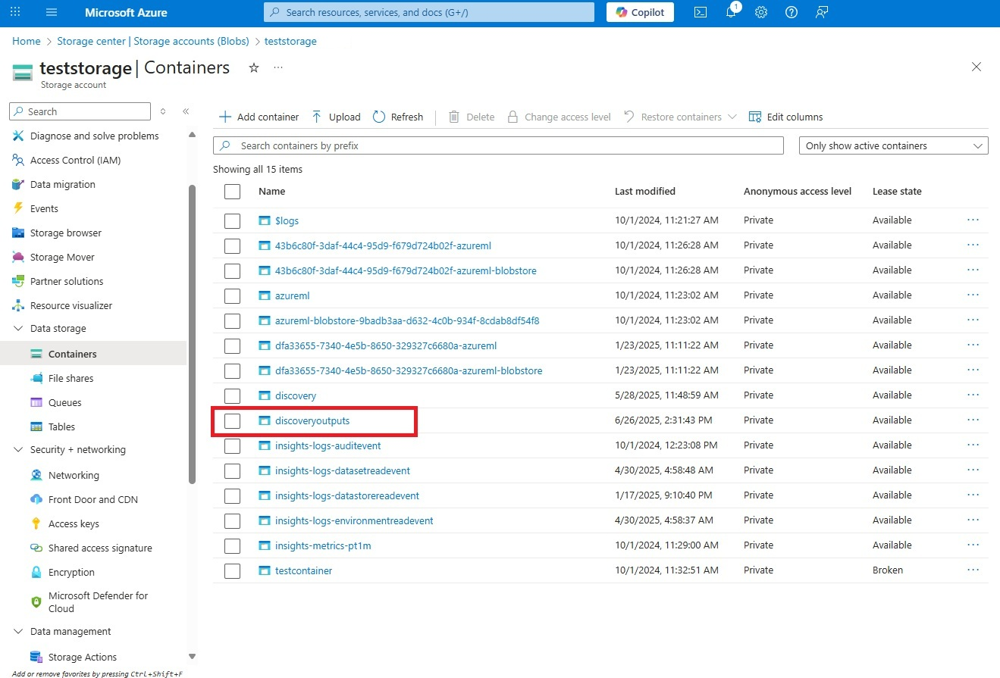

Output data from your investigations will be stored in the "discoveryoutputs" container.

#### Enable CORS and UAMI access

1. Select "Resource sharing (CORS)" under "Settings" tab
1. Under "Blob service" Allowed origins column, enter these two origins: `https://studio.discovery.microsoft.com` and `https://vscode.dev`. For both, set the allowed operations to include "GET", "HEAD", "DELETE", and "PUT". Set `Allowed Headers` and `Exposed Headers` to "*" and `Max Age` to '200'.
1. Click "Save" on top
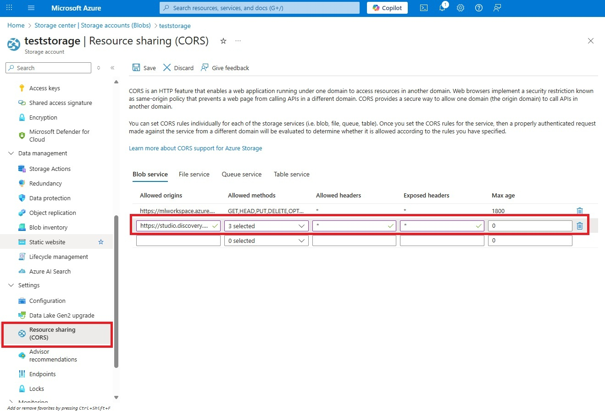

1. Navigate to "Access Control (IAM)" tab in the left navigation pane
1. Click Add -> Add role assignment
1. Search for `Storage Blob Data Contributor` role and select it and click Next
1. Under Members tab, select Assign access to "Managed Identity" and click "Select members"
1. Select your subscription, managed identity as "User-assigned managed identity"
1. Select the UAMI that we created in [step 1d](#1d-create-user-assigned-managed-identity-uami) and click Next
1. Click Review + assign to assign access to the UAMI
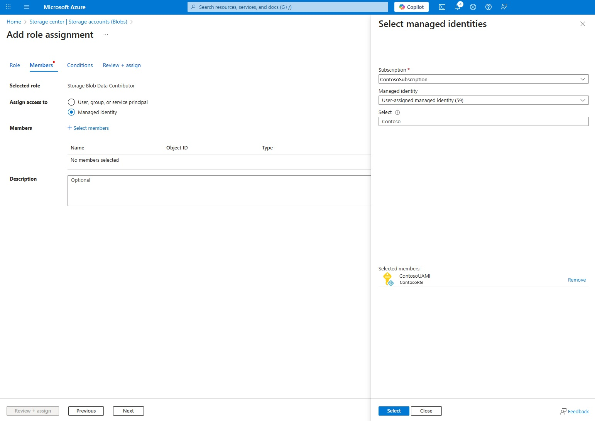

## 2. Create a shared storage

To set up a Microsoft Discovery workspace, one of the essential steps is to establish Microsoft Discovery Shared storage resource. This shared storage will be used to store and retrieve the data necessary for computational operations within the workspace.

To create a storage, follow the steps below:

1. Sign in to the [Azure Portal](https://portal.azure.com)
1. Search for `Microsoft Discovery Storages`

1. Select "Create" and enter the details such as Subscription ID, Resource Group name, Location, and Name.
1. Select Storage Kind as `Azure NetApp` and click next

1. Select the Virtual Network and Subnet that we created in [Step 1c](#1c-create-a-virtual-network-and-subnets) from the Networking tab
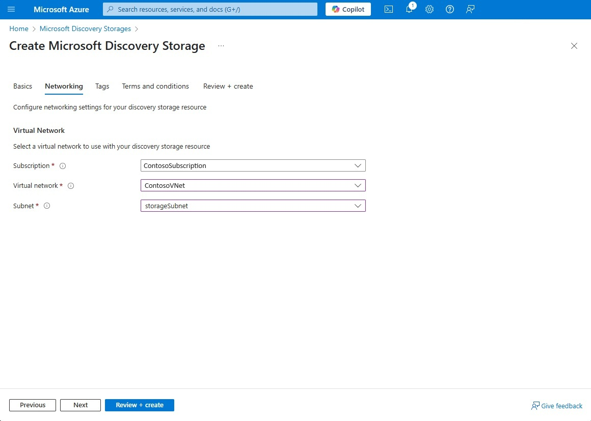
1. Review the Terms and Conditions and click "Create"
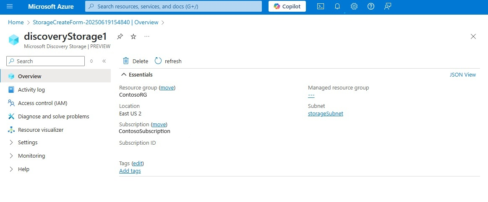

## 3. Create a supercomputer

To deploy and run scientific tools and index your data in Bookshelf as Knowledge Bases, you need to set up a supercomputer with associated node pools. Supercomputer and nodepools provide appropriate compute resources on a specific virtual network within customer subscription.

To create a supercomputer and node pool, follow the steps below:

1. Sign in to the [Azure Portal](https://portal.azure.com)
1. Search for `Microsoft Discovery Supercomputers`
1. Select "Create" and enter resource details such as Subscription ID, Resource Group name, Location, and Name and click next
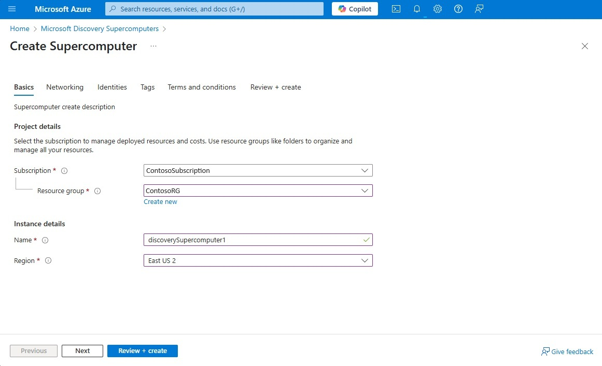
1. Select the Virtual Network and `aksSubnet` that we created in [Step 1c](#1c-create-a-virtual-network-and-subnets) from the Networking tab and click "Next"
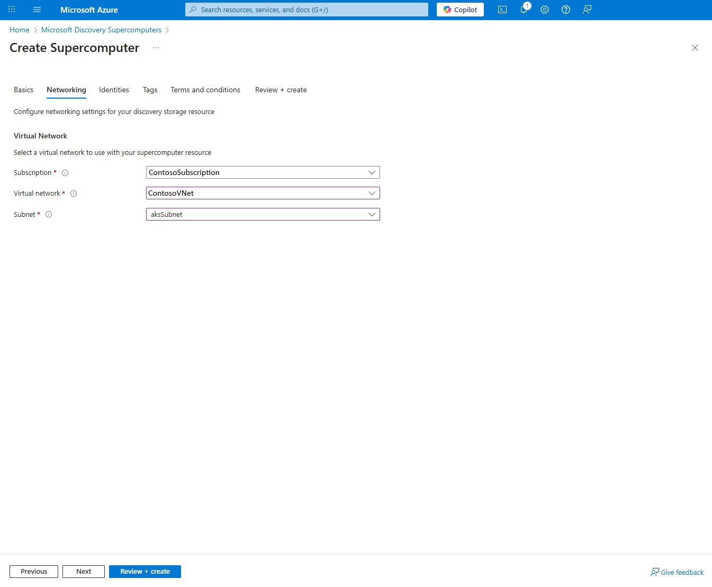
1. Add User Assigned Managed Identities (UAMI) that we created in [Step 1d](#1d-create-user-assigned-managed-identity-uami) for the cluster identity, kubelet identity, and workload identity. Supercomputer instances will use this user assigned managed identity to access data from your Azure resources.
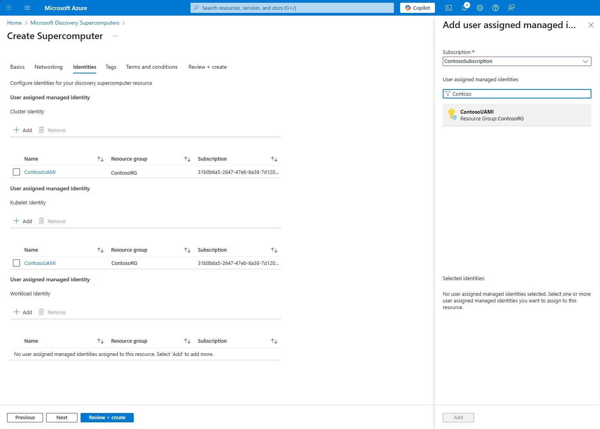
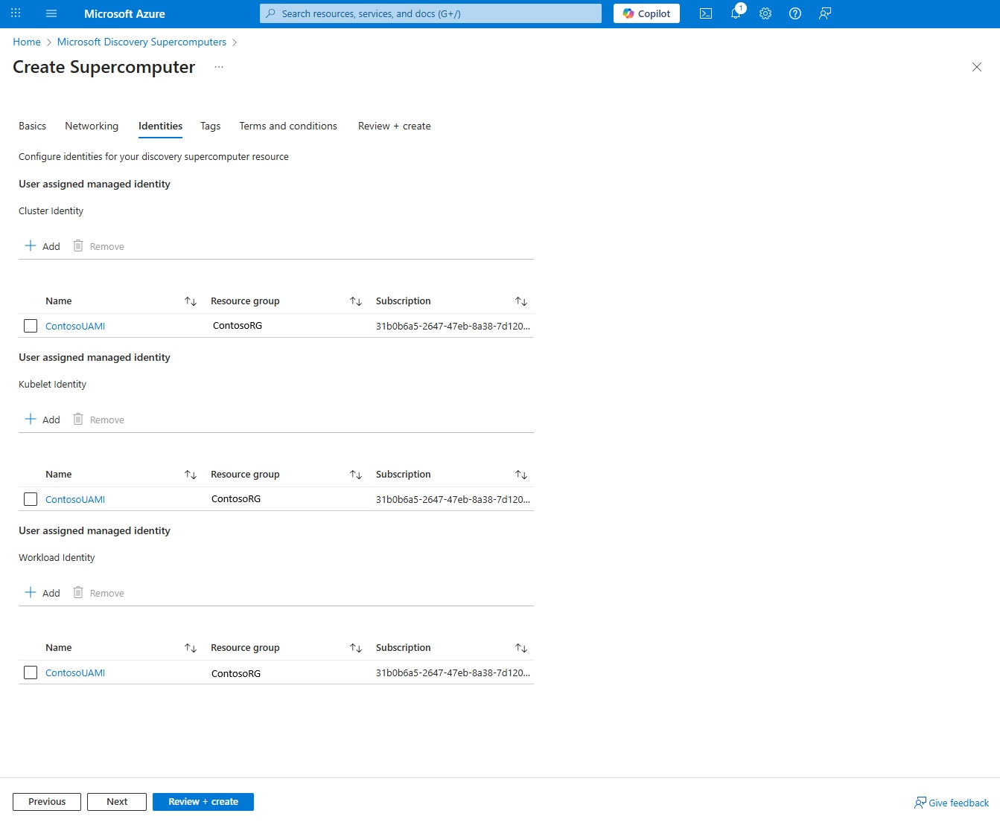
1. Review the Terms and Conditions and click "Create"
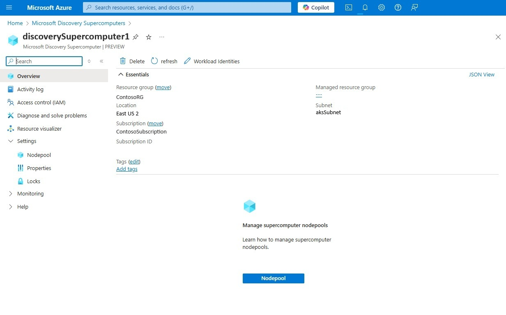

### 3a. Create Node Pools

Once your supercomputer is created, follow the steps below to create a node pool.

1. Open your Supercomputer resource that you just created in the Azure Portal
1. In the left-pane, select Nodepool under Settings tab and click "Create"
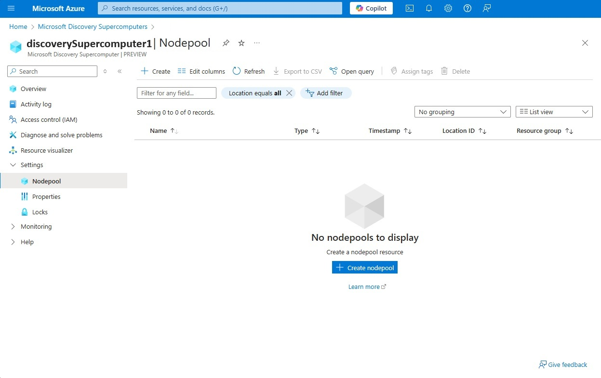
1. Enter the name and location for the nodepool resource and click next. (Note that nodepool names must be all lowercase, maximum 12 characters in length, must start with a letter, and can only contain letters and numbers)
1. In the Networking tab, select the Virtual Network and `supercomputerNodepoolSubnet` created in [Step 1c](#1c-create-a-virtual-network-and-subnets), this needs to be the same virtual network that was selected for the storage in [step 2](#2-create-a-shared-storage) and click next
1. In the VM configuration tab, select the Virtual Machine SKU to be used for the nodepool and click next. The selected SKU and quota should be available in the region where you deploy the nodepool
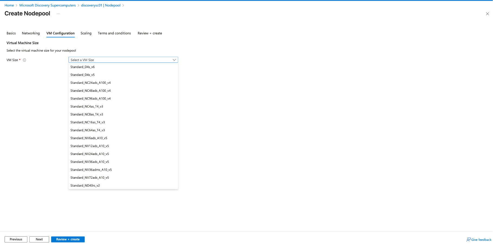
1. In the Scaling section, select the maximum node count that your nodepool can scale to
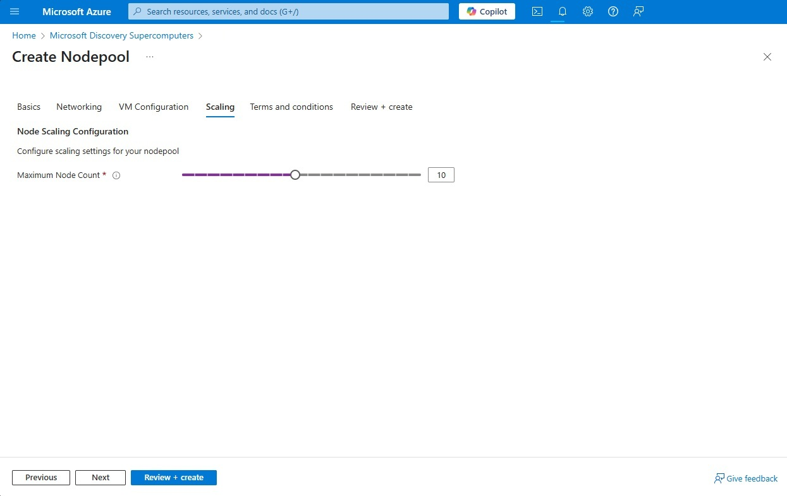
1. Review the Terms and Conditions and click Create

## 4. Create a workspace

A workspace is a collaborative environment where teams can manage large-scale scientific initiatives. You can create projects under workspaces, allowing researchers to organize experiments, analyze data, and leverage AI agents and tools within a shared space.

> **Note:** During the private preview, you can associate only one Supercomputer resource and one Microsoft Discovery Storage resource with one Workspace resource.

To create a workspace, follow the steps below:

> **Important:** Make sure your workspace name is globally unique and uses only lowercase letters.

1. Sign in to the [Azure Portal](https://portal.azure.com)
1. Search for `Microsoft Discovery Worksapces`
1. Select "Create" and enter essential details such as Subscription, Resource Group, Name, Region and click next
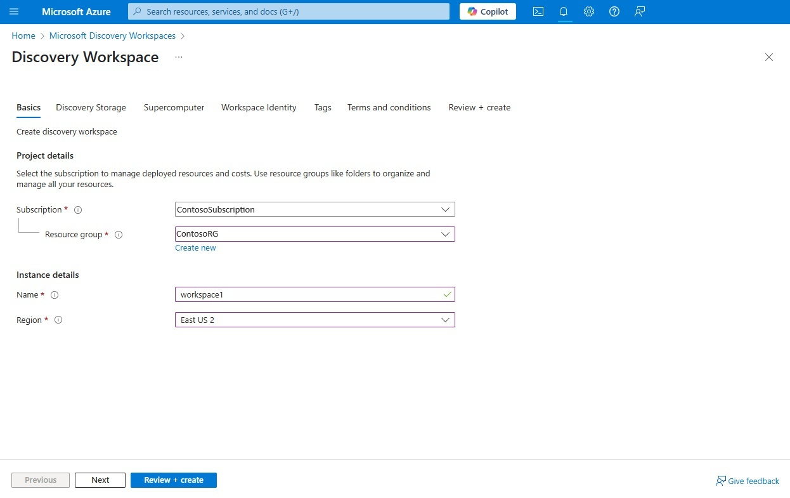
1. In the Discovery Storages tab, select "Add Discovery Storage" and select your subscription, resource group and the storage that we created in [Step 2](#2-create-a-shared-storage) and click next

1. In the Supercomputer tab, select "Add Supercomputer" and select your subscription, resource group and the supercomputer that we created in [Step 3](#3-create-a-supercomputer) and click next
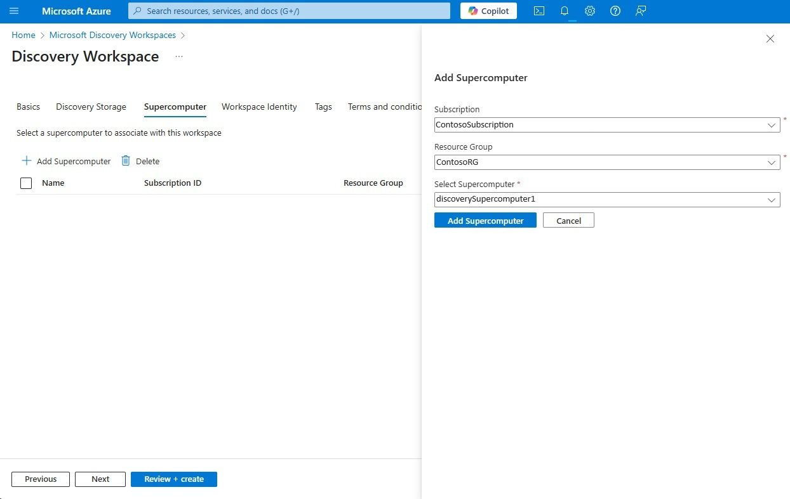
1. In the Workspace Identity tab, select Add under User Assigned Managed Identity (UAMI) and select the identity that we created in [step 1d](#1d-create-user-assigned-managed-identity-uami) to provide access to the workspace resource.
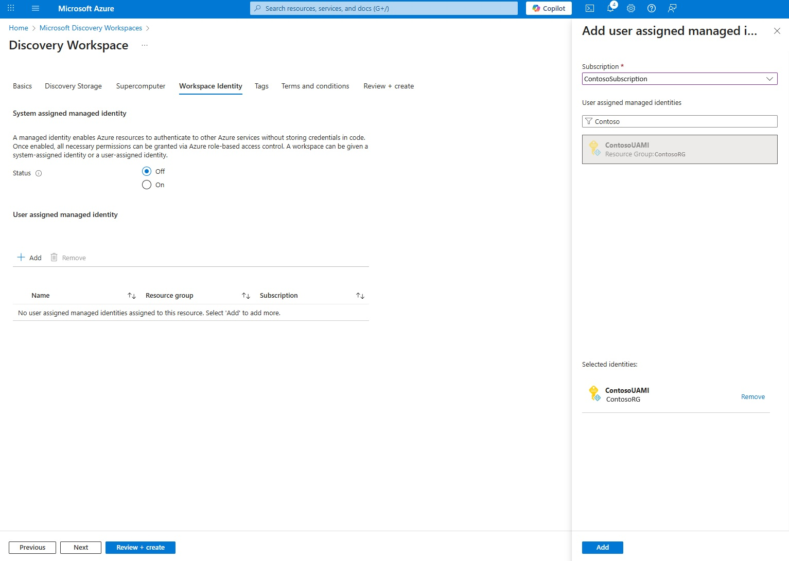
1. For faster responses to data handling functions, one needs to set tags on the workspace during its creation. The tag `WorkspaceSubnetId` with the value set to subnet's resource ID (Example value - /subscriptions/00000000-0000-0000-0000-000000000000/resourceGroups/test-wksp-rg/providers/Microsoft.Network/virtualNetworks/vnet-eastus/subnets/workspaceSubnet)
1. Review the Terms and Conditions and click Create
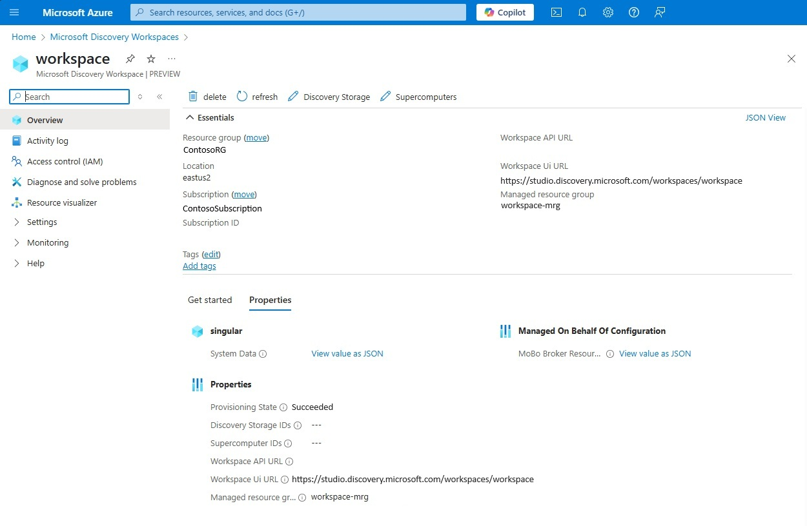

Once the workspace has been created, you can provide access to users via [Role Based Access Control (RBAC)](https://learn.microsoft.com/azure/role-based-access-control/quickstart-assign-role-user-portal). To create projects in a workspace, you will need to provide contributor access to the user.

> **Note:** You can create a project with agent templates or with your own agents and workflows. To create a project with agent templates, you can skip the next step and jump directly to [Create a project with templates](../4-how-to/7-projects/a--creating-project.md#create-a-project-with-templates)

## 5. Create an agent and a workflow

### Create an agent

Agents are autonomous intelligent systems that are workflow driven and designed to perform specific tasks on behalf of users or other systems. Agents are powered by LLMs and can utilize tools, models, and other agents to achieve the task. You can create an agent and associate them with a project.

To create an agent, follow the steps below:

#### Create the agent definition file

In this example, let's create a basic Chemistry Agent that answers questions on chemical properties of molecules and provides a plan to calculate any property.

1. Using any text editor, create an `agent-definition.json` file locally in your PC
1. Copy and paste the following sample agent definition content to the JSON file

```json
{
    "agent": {
        "name": "ChemistryAgent",
        "description": "You are a chemistry expert agent who can answer questions about chemical properties of molecules and provide high level plans for user's computational needs",
        "model": "azureml://registries/azure-openai/models/gpt-4o/versions/2024-11-20",
        "instructions": "You are a chemistry expert agent who can answer questions about chemical properties of molecules and provide high level plans for user's computational needs\n\nUser goal:\n\n{{userGoal}}\n\nNode pool context:\n{{nodePoolContext}}\n\nData handling context:\n{{dataHandlingContext}}",
        "top_p": 0,
        "temperature": 0,
        "response_format": "auto"
    },
    "extension": {
        "events": [],
        "inputs": [
        {
            "name": "userGoal",
            "type": "llm",
            "description": "The user query for which the response needs to be generated."
        }
        ],
        "outputs": [],
        "system_prompts": {}
    }
}
```

3. Save the file.

#### Create the agent resource

> **Important:** The agent name you enter in the portal must exactly match the name specified in the agent definition file.

1. Sign in to the [Azure Portal](https://portal.azure.com)
1. Search for `Microsoft Discovery Agents`
1. Select "Create" and enter essential details such as Subscription, Resource Group, Name, Region
1. For Model Name, enter `azureml://registries/azure-openai/models/gpt-4o/versions/2024-11-20`
1. In the Definition Content file, upload the `agent-definition.json` file that we created
1. In the Definition Content version, enter `2025-05-15-preview`
1. Click Next
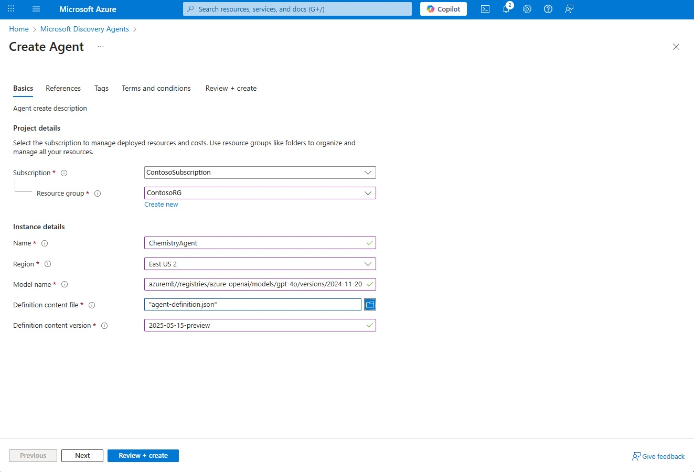
1. Skip the references tab for this exercise
1. Review and agree to the terms and conditions and click next
1. Click Create
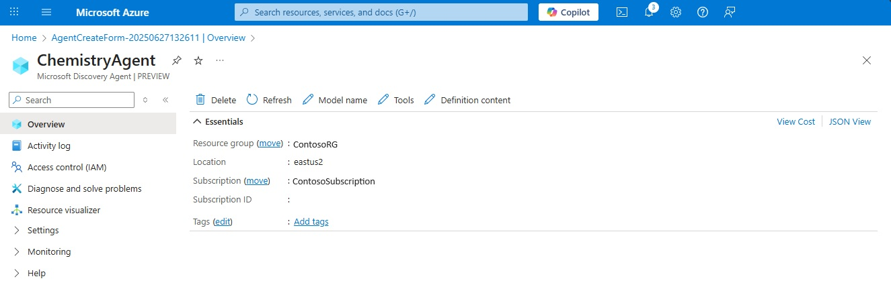

### Create a workflow

Workflows are special type of agents with type "workflow" that orchestrate the execution of multiple agents to complete complex tasks. Unlike individual agents that perform specific functions, workflow agents coordinate multi-agent programs and manage the flow between different agent components. Workflows are defined using the same agent specification but with additional orchestration capabilities.

#### Create the workflow definition file

In this example, let's create a basic Chemistry Workflow that utilizes the agent that we created in the previous step.

> **Note:** During the private preview, only workflows that meet the following conditions are supported:
> 
> - Use single-actor states
> - Have human-in-the-loop mode set to 'never'
> - Have streaming mode set to false
> 
> Additionally, ensure that the thread name remains consistent throughout the workflow.

1. Using any text editor, create an `workflow-definition.json` file locally in your PC
1. Copy and paste the following sample workflow definition content to the JSON file

```json
{
    "name": "ChemistryWorkflow",
    "states": [
        {
            "name": "StartState",
            "actors": [
                {
                    "agent": "ChemistryAgent",
                    "inputs": {
                        "userGoal": "userGoal",
                        "dataHandlingContext": "dataHandlingContext",
                        "messageId": "messageId",
                        "nodePoolContext": "nodePoolContext"
                    },
                    "thread": "MainThread",
                    "humanInLoopMode": "never",
                    "streamOutput": true
                }
            ],
            "isFinal": false
        },
        {
            "name": "EndState",
            "actors": [],
            "isFinal": true
        }
    ],
    "transitions": [
        {
            "from": "StartState",
            "to": "EndState"
        }
    ],
    "variables": [
        {
            "Type": "thread",
            "name": "MainThread"
        },
        {
            "Type": "userDefined",
            "name": "userGoal"
        },
        {
            "Type": "userDefined",
            "name": "nodePoolContext"
        },
        {
            "Type": "userDefined",
                    "name": "messageId"
        },
        {
            "Type": "userDefined",
            "name": "dataHandlingContext",
            "value": "In order to interact with data (inputs, outputs) you will utilize the following tools and guidelines. ## OBJECTIVE (Data Lifecycle Support) To support your primary task, you must also ensure that the data lifecycle is handled appropriately by executing the following capabilities. ## CAPABILITIES - **Preview Data**: Use the `PreviewData` tool to generate a preview of data located at a path. This path may be a file or a directory, but it must always be an absolute path. - **Promote Outputs**: Use `PromoteOutputsToDataAssets` to move validated files from a working directory into the `/outputs` directory. Only promote files that are complete and verified. - **Get Data Context**: Use `GetDataContext` to retrieve the current structure and metadata of a virtual directory. This helps determine the current state of data and decide on next actions. - **Update Data Description**: Use `UpdateDataDescription` to attach or modify the description of any directory or file that exists in the data context. Always provide meaningful, transformation-related metadata. ## GUIDELINES - To learn what data is available (and where), you MUST call the `GetDataContext` tool to retrieve the current state of the data. - Always operate using the most recent data context. - Preview data before updating descriptions or promoting to outputs. - Maintain consistency in metadata and file paths. - Avoid redundant promotions or updates unless the underlying data has changed. - Only call data handling tools when necessary. - Promoted data will be visible by the end user, so ensure you are only promoting data that is relevant to the user goal. - IMPORTANT: Always update the description of a virtualPath BEFORE promoting it to a data asset. This description will be available to the user once it is promoted, so ensure it is descriptive and readable.\nNote: For tools that have outputMounts and inputMounts as input parameters follow these guidelines: - outputMounts should be set to the absolute path of where the output data from the execution of a tool should be stored. - inputMounts should be an object mapping of the virtual mount path you want mounted to the ABSOLUTE path of where you want it to be located on the tool container\nWARNING: ALL DATA HANDLING PATHS ARE ABSOLUTE PATHS, NEVER PASS A RELATIVE PATH TO ANYTHING\nAn example of a data handle flow would be as follows: 1. Call some tool which generates output data in a file 'molecule.txt' in a directory called /app/outputs. This is what you would set as the outputMountPath 2. Use updatesDataDescription to add a description to the virtual directroy /app/outputs which says that the directory contains a file 'molecule.txt' 3. Tool two will mount the directory /app/outputs as the virtualPath parameter for the inputMounts parameter, and the absolute path of where the data is located in the tool container as the inputMountPath. inputMounts will be an array of these objects. - inputMounts: [{ virtualPath: '/step0/app/outputs', inputMountPath: '/app/inputs' }] - NOTICE, we did not specify a file path, we specified a directory path, this is because the tool will mount the entire directory and not just a file. 4. The tool will then generate a file 'molecule2.txt' in the /app/outputs directory, which is the outputMountPath. 5. You will then use the PreviewData tool to preview the data in the /app/outputs directory. 6. If the data is valid, you will then use the PromoteOutputsToDataAssets tool to promote the /app/outputs directory to the /outputs directory, which is where all final outputs"
        }
    ],
        "startstate": "StartState"

}
```

3. Save the file.

#### Create the workflow resource

> **Important:** The workflow name you enter in the portal must exactly match the name specified in the workflow definition file.

1. Sign in to the [Azure Portal](https://portal.azure.com)
1. Search for `Microsoft Discovery Workflows`
1. Select "Create" and enter essential details such as Subscription, Resource Group, Name, Region
1. In the Definition Content file, upload the `workflow-definition.json` file that we created
1. In the Definition Content version, enter `2025-05-15-preview`
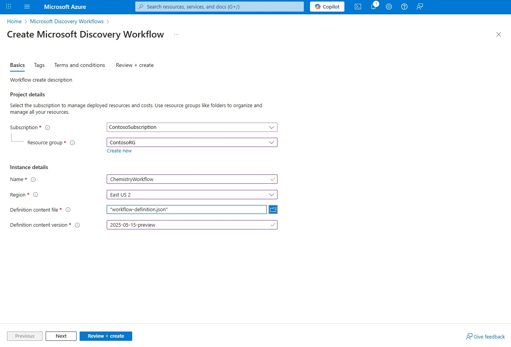
1. Click next
1. Review and agree to the terms and conditions and click next
1. Click Create
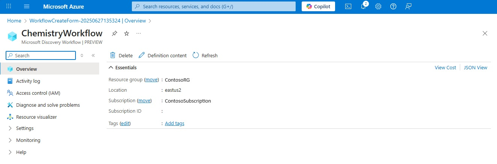

## 6. Log in to Microsoft Discovery Studio

Microsoft Discovery Studio is a secure, AI-powered research and development environment that enables scientists and engineers to accelerate innovation through autonomous agents, simulation workflows, and integrated data tools — all within a unified interface.

Once your infrastructure resources have been created, you can log in to [Microsoft Discovery Studio](https://studio.discovery.microsoft.com) directly via the URL. You can also find the URL in the Workspace overview page in the Azure Portal.
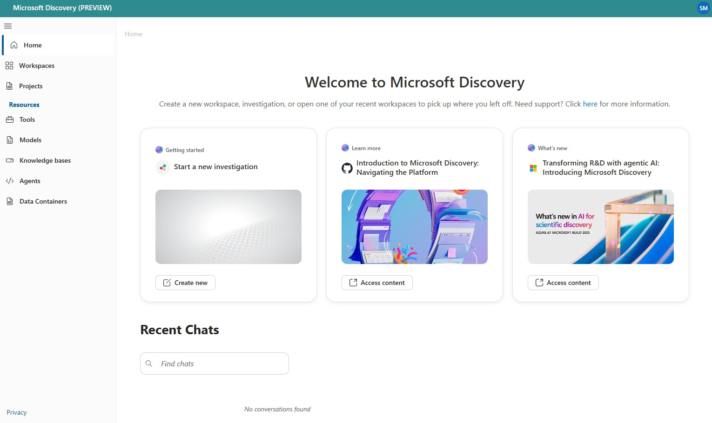

Once you open the Microsoft Discovery Studio, you must login with your Entra ID (work or school account) credentials from your organization. Studio supports Single Sign-On (SSO) with Entra ID so that you don't have to explicitly provide your credentials and authenticate if you've already logged in to any other service with your Entra ID in the same browser.

## 7. Create your data containers

Once you have logged in to the studio, you can now create data containers to be used in your project. Data containers are used to organize and manage data assets which are the files or directory of files stored within these containers.    

Data containers are used to store input and output data as data assets. Both inputs and outputs must use the same data container which is of type Azure Storage Blob that we created in [Step 1e](#1e-create-an-azure-blob-storage-account)

To create a data container, follow the steps below:

1. Login to [the Microsoft Discovery Studio](https://studio.discovery.microsoft.com/)
1. In the left navigation pane, select Data Containers  under the Resources section
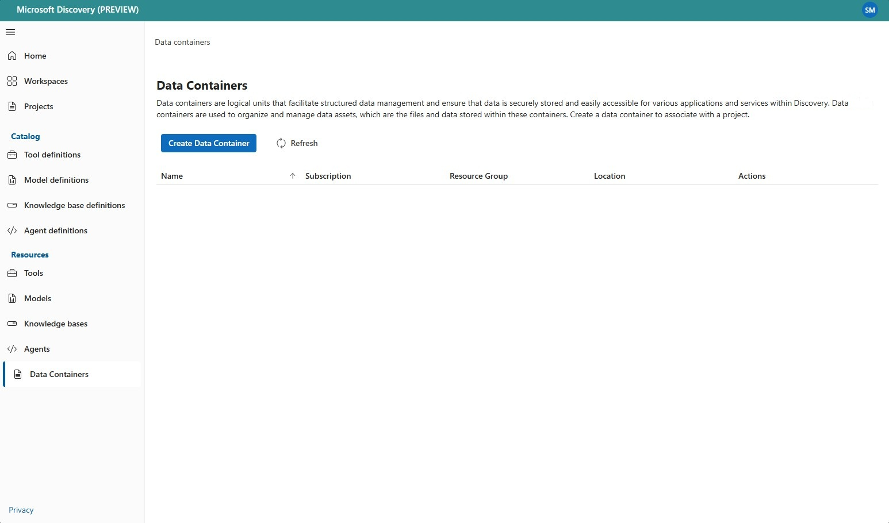
1. Select "Create Data Container"
1. Enter the details such as name, subscription, resource group, location. 
1. Select the Data Store Type as Azure Storage Blob and select the storage account that we created in [step 1e](#1e-create-an-azure-blob-storage-account) 
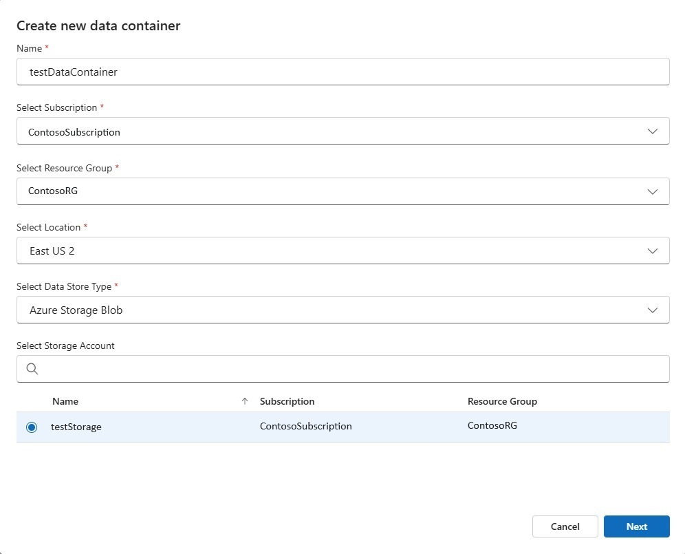
1. Click Next
1. To access the storage blob, select the managed identity that we created in [Step 1d](#1d-create-user-assigned-managed-identity-uami).
1. Click Create

> **Note:** Once you click create, the resource will initially be in the 'Accepted' state. Please refresh the page and wait until the 'Provisioning State' changes to 'Succeeded' before proceeding to the next step. This operation generally takes a few minutes to complete.

## 8. Create a project

Projects help you organize and manage scientific investigations within a Workspace. You can use projects to run experiments, analyze data, apply AI models, and track progress, all in a collaborative environment designed for scientific discovery. Projects also enable a functional boundary or container for access to your agents, tools, and data containers.

To create a project, follow the steps below:

> **Important**: Your project name must be all lowercase and no more than 12 characters long.

1. Login to [the Microsoft Discovery Studio](https://studio.discovery.microsoft.com/)
1. In the left navigation pane, select Projects. This will list all the existing projects across your Azure subscriptions and resource groups.
1. Click Create Project
1. Enter the details such as name and select the workspace under which the project should be created
1. Click Next
1. Select the agents to be added to the project. You must select at least one agent as the entry agent of type workflow and also select the dependent agents. For now, select the ChemistryAgent and ChemistryWorkflow that we created in [Step 5](#5-create-an-agent-and-a-workflow) and select the ChemistryWorkflow as the entry agent.

1. Click Next
1. Select the data containers that we created in the [previous step](#7-create-your-data-containers).
1. Click Create.

> **Note**: Only one data container of type Azure Storage Blob can be added to a project.

> **Note:** Once you click create, the resource will initially be in the 'Accepted' state. Please refresh the page and wait until the 'Provisioning State' changes to 'Succeeded' before proceeding to the next step. This operation generally takes 5-10 minutes to complete.

## 9. Create an investigation

Investigations are research studies within a project where you can chat with Copilot, make and run a computational analysis, get data-driven insights to answer scientific questions.

To create an investigation within a project, follow the steps below:

> **Important**: Your investigation name must be no more than 20 characters long.

1. Login to [the Microsoft Discovery Studio](https://studio.discovery.microsoft.com/)
1. In the left navigation pane, select Projects and from the list, select the project that we created in the [previous step](#8-create-a-project).
1. Your project should open in a new tab
1. In the left navigation pane undeer "Investigations" tab, select Create investigation button (+)
1. Provide a name and an optional description and click Create


## 10. Start a chat

Once your investigation is created, you can start a chat by following the steps below:

1. In the left navigation pane, select Projects
1. Select the project that we created in the [step 8](#8-create-a-project)
1. Select the investigation that we created in the [previous step](#9-create-an-investigation)
1. Enter a prompt and select send to get a response using the agents, data and knowledge that we have selected in this tutorial.
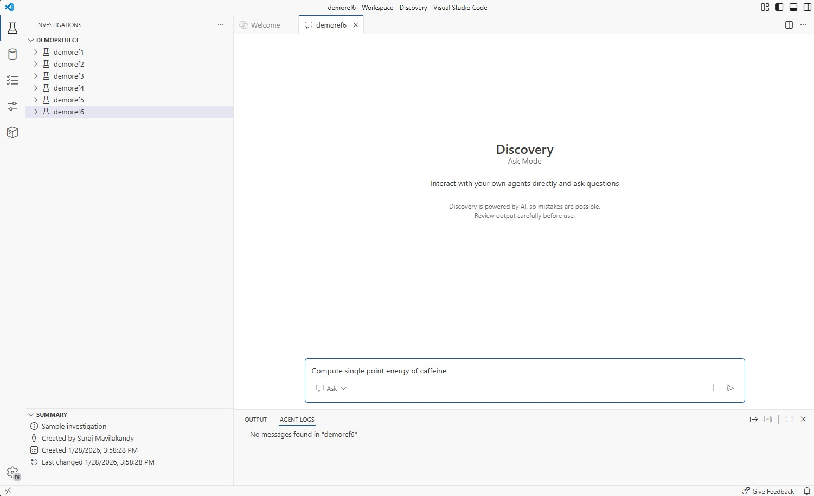

## Next step

- [Create a knowledge base in Bookshelf](../4-how-to/9-bookshelves-knowledgebases/)
- [Onboard tools, models, and agents](../4-how-to/6-tools-models-agents/)
