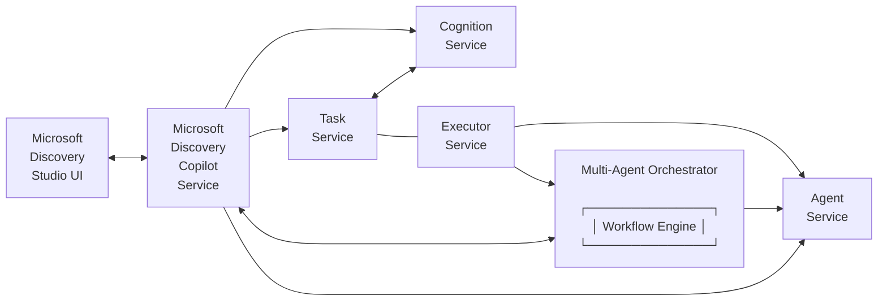

# Microsoft Discovery Copilot

## Overview

Microsoft Discovery Copilot service is one of the core components in the Microsoft Discovery platform. It supports the deployment of agents and workflow resources and enables the orchestration of multiple agents working together to achieve user's goals. Additionally, it provides the primary chat interface surfaced in Microsoft Discovery Studio, where you can use natural language (NL) to interact with the multi-agent system defined based on your specific use case whether a scientific research scenario or an engineering workflow.

## Architecture Overview

The Microsoft Discovery Copilot is designed as a scalable, cloud-native solution that orchestrates intelligent agents and workflows within the Microsoft Discovery ecosystem. The service architecture consists of several key components:

## Core Capabilities

### 1. Agent Definition and Deployment

The Microsoft Discovery Copilot provides comprehensive agent lifecycle management including agent definition, deployment orchestration, resource allocation, health monitoring.

### 2. Multi-Agent Orchestration with Workflow

Coordinates multiple agents to work collaboratively through intelligent task distribution, secure inter-agent communication, workflow coordination, result aggregation, and graceful error handling.

### 3. Natural Language Processing

Provides advanced natural language capabilities for user interaction including intent recognition, context awareness, multi-turn conversations.

### 4. Cognition 

Provides an ongoing reasoning process working with you to assign tasks, review work, and open new questions.

### 5. Tasks

Provides a way to organize your work over time, communicate intent, a way to measure success, and track progress.

## Integration with Discovery Studio

The Microsoft Discovery Copilot integrates seamlessly with Discovery Studio through:

- **Chat Interface**: Primary interaction point where users can use natural language to interact with the multi-agent system

More details on Agent and workflow onboarding flow are available in [quick start](../2-getting-started/quickstart.md) and  [create agents and workflows](../4-how-to/6-tools-models-agents/c--agent-deployment.md).

