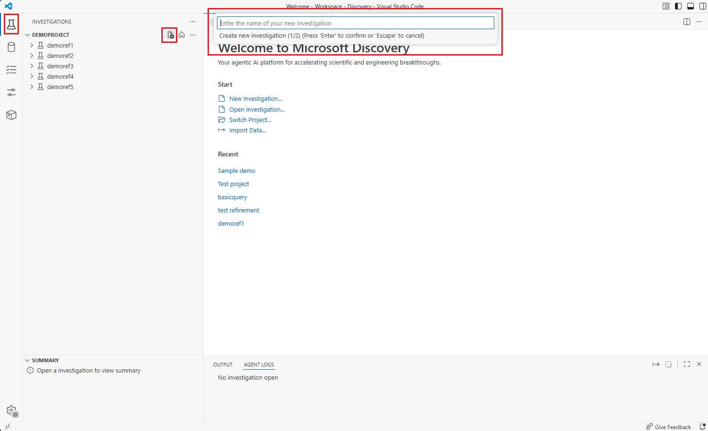
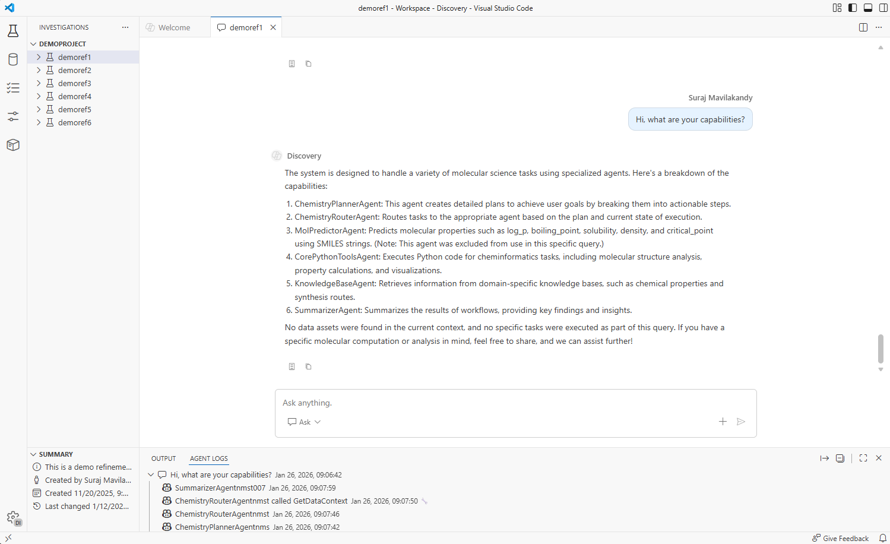
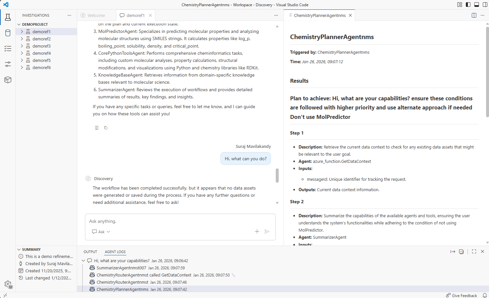
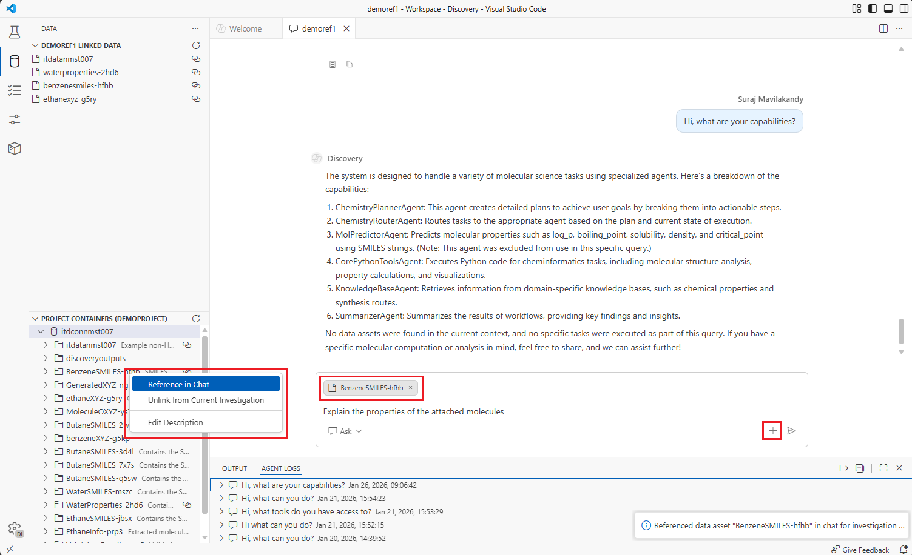
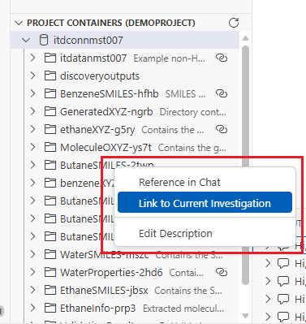
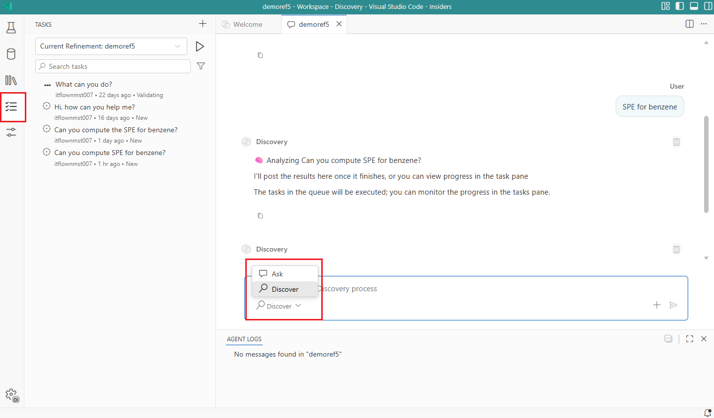
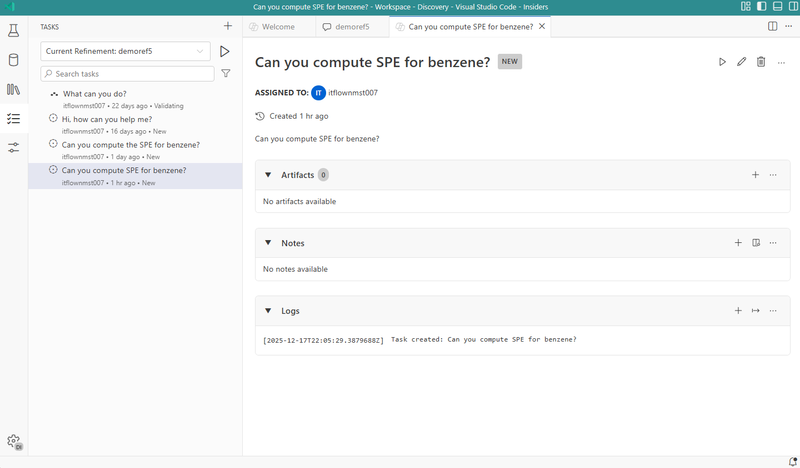
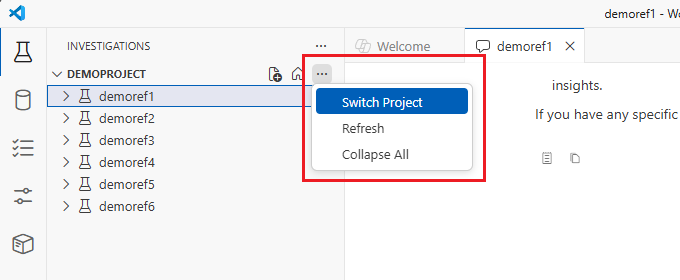
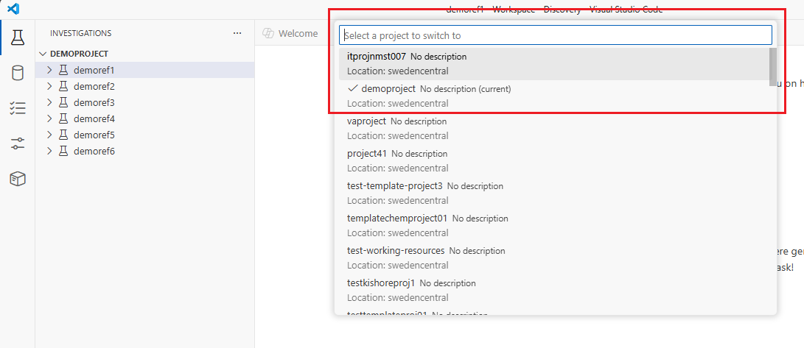

# Microsoft Discovery Studio v2

## Overview

Microsoft Discovery Studio v2 introduces a modern, streamlined interface designed specifically for scientists and researchers. It brings richer reasoning capabilities, improved workflow transparency, and a more intuitive environment for advanced scientific discovery. This also allows users to explore a new way of interacting with the platform with added functionality and control.

> [!NOTE]
> **Private Preview Access Required**: Discovery Studio v2 is available to participants in the Microsoft Discovery private preview program who can already access the platform. Features and interfaces may change based on user feedback and ongoing development.

## What is Discovery Studio v2?

Discovery Studio v2 is a specialized environment that offers:

- **New UX**: Introducing a new way of interacting with the platform with the new VSCode based user experience providing tabbed views, multi-pane layout, separate agent logs from chat window, and many more.
- **Parity with existing UX**: The new user interface provides 1:1 parity with existing features in the current user experience.
- **Customizability**: VSCode based user interface provides the ultimate customizability in terms of the UI layout. Make it your own by dragging and moving tabs to suit your style. It also supports hiding or showing panes and tabs that matter to you.
- **Introducing Artifacts**: Data tab provides a view of all the data available in the project and data that are linked to an investigation. Artifacts are data assets linked to an investigation. You can link and unlink a data asset manually to an investigation to provide context to Discovery Engine. Please note that the consumption of linked data by Discovery Engine is currently being implemented and won't be fully functional in this iteration.
- **Introducing Discover mode**: Explore Discovery Engine with Discover mode to collaborate on tackling complex, long-term scientific and engineering problems. You can switch to Discover mode directly from the chat text box and Ask mode retains the current experience where you can interact with your workflows and agents directly.

### Experimental features and known issues
- Linking data to an investigation: The UI allows users to link data assets to investigations, but it is not fully functional yet in the backend.

## Prerequisites

Before accessing the Discovery Studio v2, ensure you have:

- An existing Workspace and a Project (including dependent resources)
- Access to [Microsoft Discovery Studio](https://studio.discovery.microsoft.com)

> [!TIP]
> If you haven't completed the basic setup, follow the [Quickstart Guide](../../2-getting-started/quickstart.md) before accessing the preview experience.

## Accessing Discovery Studio v2

Microsoft Discovery Studio v2 is now accessible directly via existing Studio experience in the projects list pages:

- Navigate to Microsoft Discovery Studio: `https://studio.discovery.microsoft.com`
- Select your Workspace or select Projects tab in the left navigation pane
- In the list of projects, select a project and the v2 experience will be opened in a new tab by default

If you want to use the v1 experience, you can still do it by following the steps below:

- In the list of projects, click on the "..." actions button on the right against the project of your choice
- Select "Open Classic Experience"

> [!IMPORTANT]
> The preview environment uses the same authentication as the standard Discovery Studio but first time users might need to "allow" an authentication pop-up.

## Preview Features Overview

### New Design

The preview experience includes a new and improved design that is:

- **Based on VSCode web experience**: VSCode based experience on the web where users can engage with the platform features under one roof.
- **Multi-pane and tabbed view**: Customize your experience by opening multiple panes and tabs at once according to your style or keep it clean with just what you want to focus on.
- **Enhanced chat window**: It's the chat window that you know and love but now with agent logs that appear separately from your conversation. Agent logs now live in the bottom in its own separate pane.

### Investigations

Investigations have additional capabilities that include:

- **Artifacts**: Link data assets to your investigations to add data context for Discovery Engine. Note that while you can link data to an investigation now, the feature is not fully functional in the backend yet.
- **Tasks**: Tasks are consumed by Discovery Engine and can be assigned to an agent or human. In this iteration, tasks can only be manually created and assigned.
- **Switch between investigations**: You can work on multiple investigations at once by quickly switching between them using multiple tabs or dock them side-by-side to work on them parallely.

#### Interacting with investigations

- Investigations can be viewed in the left navigation pane by default.
- Create an investigation by clicking the "+" icon in the investigation pane next to the title bar
- Enter the name of the investigation and optionally a description and select the "check" button to create one.
- Expand an investigation in the tree view to find artifacts and tasks created under it.

#### Chat window and agent logs

- When an investigation is open, you can send messages to your agents using the chat window and get a response.
- Agent logs can be found in the bottom pane by default separated by each message. Expand the entry to see the logs grouped by agents.
- Click on a log entry to open a detailed view in a separate tab.

### Data and artifacts

Artifacts are your existing data assets with the ability to link them to an investigation:

- **View project data**: View all your project data under one roof with the data tab in the left pane, including the linked data assets.
- **Linked data assets (experimental)**: Data assets can be linked to an investigation to add data context to Discovery Engine. In this iteration, data assets can be manually linked and unlinked by the user.

#### Add data to chat

- Select the "data" tab in the left navigation pane.
- The top section shows the linked data to the active investigation and the bottom section shows all the data within your current project's data container which you can expand to show all the data assets.
- You can reference data assets to your chat window in two ways:
  - Right click on any data asset in the data tab (bottom pane) and select "Reference in chat" and it'll be added to your chat text input area (or)
  - Click on the "+" icon in the chat text input area and select "Upload attachment" on top and select the data asset that you would like to add to your message.

#### Link data to an investigation (Experimental)

- Select the "data" tab in the left navigation pane.
- The top section shows the linked data to the investigation tab that is open and the bottom section shows all the data within your current project's data container which you can expand to show all the data assets.
- You can link data assets to your investigation by:
  - Right click on any data asset in the data tab (bottom pane) and select "Link to Current Investigation". It will show up as a linked data in the top pane under the corresponding investigation.

#### Output data assets

Agent generated data assets are shown in the chat window like before and you can click on the data asset to open the visualizer for supported file types in the right pane.

### Tasks

Early access to Discovery Engine capabilities starting with manual task creation:

- **Tasks**: In this iteration, tasks can be created manually by a user and assign them to an agent or human for action.
- **Tasks view**: View all tasks for the investigations in your project under the tasks tab. Tasks can be started or stopped from this view, and click on a task to open the details in tabbed view.

#### Interacting with tasks

##### **Discover mode**

1. Once you open an investigation, in the chat input box, click on "Ask" button and select "Discover" in the dropdown to switch from Ask mode to Discover mode. 
1. Enter your prompt and you should see a task being created under the investigation and Discovery Engine will start automatically to execute the tasks in the queue.
1. Click the "Tasks" tab in the left navigation pane to view all your tasks grouped by the investigation name.
1. By default, you will see the tasks for the investigation that is open. However, you can select a different investigation from the dropdown menu.
1. Click on the task to view more details such as assignment, notes, and logs.
1. Once the task has been completed by the agent, you should be able to view the results in the chat and notes section of the task.

### Switch between projects

Once you open the preview experience, all your project assets are listed. You can switch to a different project within the same tab by:

- Click on the "..." option button next to the Project name in the investigations tab.
- Click on "Switch Project" andyou will be able to see a list of projects available in the workspace.
- Select a different project from the dropdown (top title bar).

## Common Gotchas and Troubleshooting

### Authentication and Access Issues

#### Issue: "Access Denied" when accessing preview environment

**Possible Causes:**

- Not authorized to access the project or workspace due to missing Azure role assignments

**Resolution:**

1. Check role assignments in Azure Portal (Access Control IAM)
2. Ensure you have at least **Microsoft Discovery Platform Contributor (Preview)** role on the Project that you are trying to access
3. Contact your administrator if access was recently requested

#### Issue: Features appear different or missing compared to documentation

**Possible Causes:**

- Preview features are enabled/disabled dynamically
- Documentation may reference features not yet deployed

**Resolution:**

1. Check relese notes / this documentation to make sure the features are deployed.
2. Refresh the browser and clear cache
3. Ensure there are no access issues
4. Report discrepancies through the feedback channels

### Data and Resource Access

#### Issue: Data containers or data assets not visible in preview environment

**Possible Causes:**

- Resource permissions not properly configured for the data resources
- Network connectivity issues to underlying Azure resources such as Azure Blob Storage

**Resolution:**

1. Verify resource exists and is properly provisioned in Azure Portal
2. Check permissions on all related resources and ensure access
3. Ensure network access and Storage Blob Data Contributor access is enabled for the underlying Azure Blob Storage account
4. Test access from standard Discovery Studio to make sure access is enabled

### Performance and Stability

#### Issue: Preview environment appears slower than standard environment

**Expected Behavior:**

- New features may not be fully optimized for performance and stability
- Allow a few seconds before the tab loads the data

**Mitigation:**

1. Use preview environment for testing and exploration, not production workloads
2. Report significant issues through feedback channels
3. Consider using standard environment for time-sensitive work

#### Issue: Preview features are intermittently unavailable

**Expected Behavior:**

- Preview features may be enabled/disabled during development cycles
- A/B testing may result in different users seeing different features due to caching behavior

**Mitigation:**

1. Try clearing browser cache and cookies and perform a full reload
1. If issue persists, contact engineering team via feedback channels

## Support and Resources

### Getting Help

- **Preview Documentation**: Check for preview-specific documentation and guides
- **Standard Documentation**: Reference main [Discovery documentation](../../README.md) for core platform concepts

### Troubleshooting

- Capture a browser trace to provide to the support teams wherever possible. You can follow the guidelines from the [documentation here](https://learn.microsoft.com/azure/azure-portal/capture-browser-trace).

## Next Steps

After successfully accessing the Discovery Studio Preview Experience:

1. **Explore New Features**: Systematically test each preview capability
2. **Compare with Standard Environment**: Understand differences and improvements
3. **Plan Integration**: Consider how new features fit into your research workflows
4. **Provide Feedback**: Share insights about feature usability and effectiveness

> [!TIP]
> Start with simple test cases in the preview environment before attempting complex research workflows. This approach helps identify potential issues early and builds confidence in new features.

---

*This guide is part of the Microsoft Discovery private preview documentation. Features and processes may change based on user feedback and ongoing development.*
