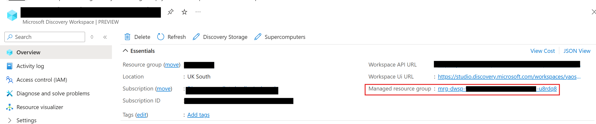
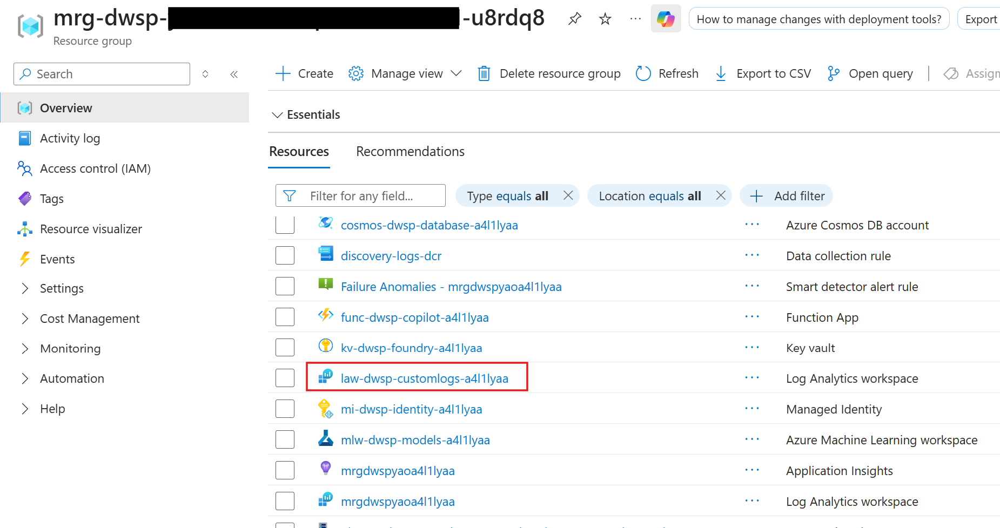
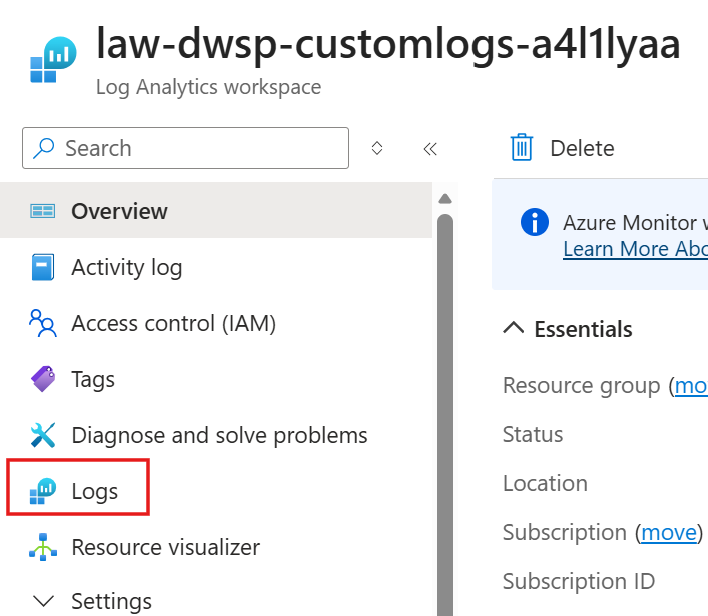

# Viewing Workspace, Supercomputer and Bookshelf Query Engine Data plane Logs

This guide walks you through accessing and querying data plane logs for your Microsoft Discovery resources by navigating to the Log Analytics workspace in the Managed Resource Group (MRG) against respective resource. These logs are essential for troubleshooting, monitoring data plane activities, and understanding system behavior.

>**Note:** Throughout this document, "Discovery Resource" refers to any of the following: Microsoft Discovery Workspace, Microsoft Discovery Supercomputer, or Microsoft Discovery Bookshelf.

## Workspace Logs

Microsoft Discovery Workspace logs provide detailed insights into:

- **Agent execution traces** - Track agent invocations, tool calls, and workflow steps
- **Error diagnostics** - Investigate failures and exceptions in investigations

All workspace logs for data plane activities are automatically collected and stored in a Log Analytics workspace that is provisioned within the workspace's Managed Resource Group (MRG).

## Supercomputer Logs

Microsoft Discovery Supercomputer logs provide detailed insights into:

- **Pod-level operations** - Monitor container health, restarts, and deployment status
- **Kubernetes events** - Investigate scheduling, resource allocation, and cluster-wide issues
- **Infrastructure health** - Track node readiness, resource pressure, and system component stability

All Supercomputer logs are automatically collected and stored in a Log Analytics workspace provisioned within the Supercomputer's Managed Resource Group (MRG). 

## Bookshelf Logs

Microsoft Discovery Bookshelf logs provide detailed insights into:

- **Query execution traces** - Track search operations, container lifecycles, and correlation flows
- **Performance metrics** - Monitor query latency and response times
- **Error diagnostics** - Investigate failures and exceptions in knowledge base interactions

All Bookshelf Query Engine logs are automatically collected and stored in a Log Analytics workspace provisioned within the Bookshelf's Managed Resource Group (MRG).

## Prerequisites

Before accessing logs, ensure you have:

- **A Microsoft Discovery resource** deployed in your Azure subscription
- **Appropriate permissions** reader role or higher on your subscription
- **Azure Portal access** with your Entra ID credentials

## Accessing Logs

### Step 1: Navigate to Your Discovery Resource 

1. **Sign in to the Azure Portal**
   - Navigate to [https://portal.azure.com](https://portal.azure.com)
   - Authenticate with your Entra ID credentials

2. **Open Your Discovery Resource**
   - In the Azure Portal search bar, type your resource name 
   - For example, to select your workspace, type **Microsoft Discovery Workspace** from the search results
   - The workspace Overview page will display

### Step 2: Locate the Managed Resource Group

On the Resource page, find the **Managed resource group** in the Essentials section:

1. **Identify the MRG Reference**
   - Look for the **"Managed resource group"** field in the Settings
   - The value will be in the format: 
      - `mrg-dwsp-<workspace name>-<unique id>` for Microsoft Discovery Workspace
      - `mrg-dscmp-<supercomputer-name>-<unique id>` for Microsoft Discovery Supercomputer
      - `mrg-dbksf-<bookshelf-name>-<unique id>` for Microsoft Discovery Bookshelf

2. **Navigate to the MRG**
   - Click on the managed resource group link or on top search bar look for that managed resource group name
   - This will open the resource group containing all infrastructure resources provisioned for your workspace

   **Example Discovery workspace overview page with Managed Resource Group details:**

    

### Step 3: Find the Log Analytics Workspace

Once you're in the Managed Resource Group view:

1. **Locate the Log Analytics Resource**
   - Scroll through the list of resources in the resource group
   - Look for a resource of type **"Log Analytics workspace"**
   - The name typically follows the pattern: `law-dwsp-customlogs-<uniqueId>` for Microsoft Discovery Workspace
   - You can use the **Type equals** filter and select "Log Analytics workspace" to filter the list

2. **Open the Log Analytics Workspace**
   - Click on the Log Analytics workspace resource name
   - This will open the Log Analytics workspace overview page

    **Example Microsoft Discovery Workspace Managed Resource Group:**

    

### Step 4: Access the Logs Query Interface

From the Log Analytics workspace:

1. **Navigate to Logs**
   - In the left navigation pane, click on **"Logs"**
   - A query editor window will open

2. **Close the Initial Pop-up**
   - If a "Queries" or "Get Started" pop-up appears, close it by clicking the **X** button
   - This will reveal the main query interface

    

>**Note:** You should be able to see similar Log Analytics workspace under Managed Resource Group associated to each Microsoft Discovery resource.

To dive deeper into the logs for Discovery resources, open respective Discovery resource page in the current directory.

## Additional Resources

- [Kusto Query Language (KQL) Reference](https://learn.microsoft.com/azure/data-explorer/kusto/query/)
- [Azure Monitor Log Analytics Tutorial](https://learn.microsoft.com/azure/azure-monitor/logs/log-analytics-tutorial)
- [Creating Alerts from Log Queries](https://learn.microsoft.com/azure/azure-monitor/alerts/alerts-create-log-alert-rule)
