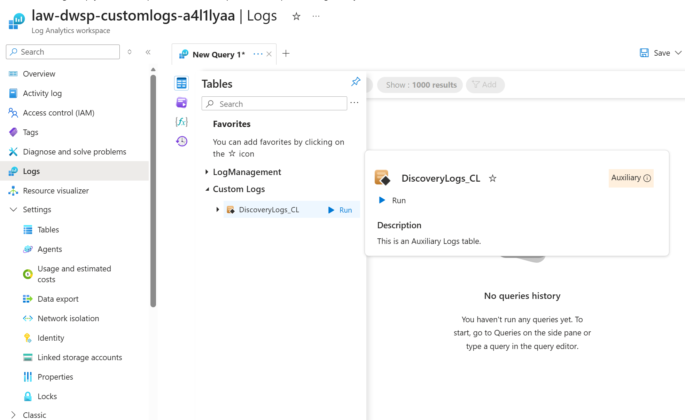
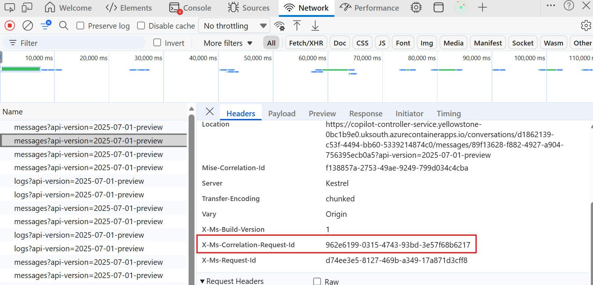
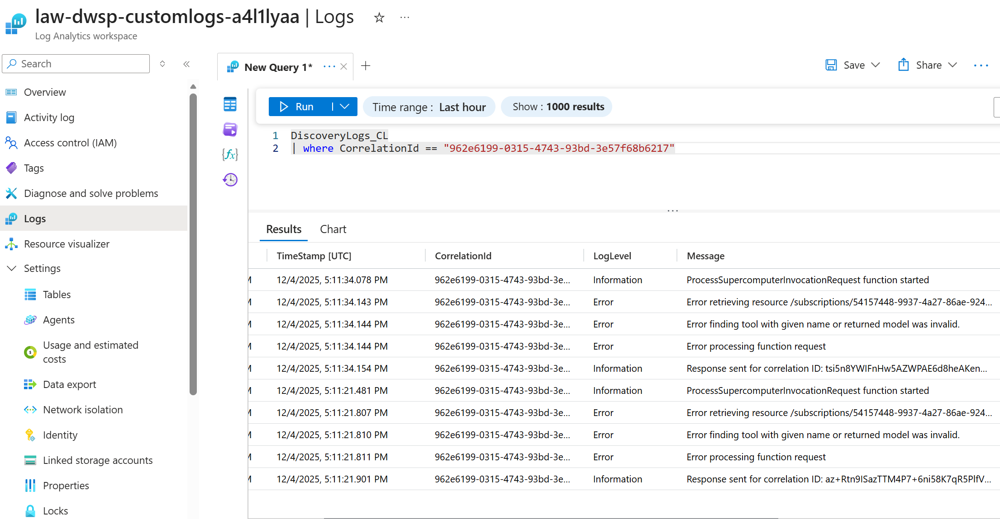

# Viewing Workspace Logs in Managed Resource Group

This guide walks you through accessing and querying logs for your Microsoft Discovery workspace by navigating to the Log Analytics workspace in the Managed Resource Group (MRG). 

## What are Workspace Logs?

Microsoft Discovery workspace logs provide detailed insights into:

- **Agent execution traces** - Track agent invocations, tool calls, and workflow steps
- **Error diagnostics** - Investigate failures and exceptions in investigations

All workspace logs are automatically collected and stored in a Log Analytics workspace that is provisioned within the workspace's Managed Resource Group (MRG).

>**Note:** Before proceeding any further, ensure you have followed instruction as in README [here](./README.md).

## Query Workspace Logs

1. **Open the Tables Panel**
   - In the left panel of the Logs interface, click on **"Tables"** tab
   - This displays all available log tables

2. **Locate Custom Logs**
   - Expand the **"Custom Logs"** section
   - Look for the table named **`DiscoveryLogs_CL`**
   - This table contains all Microsoft Discovery workspace logs

3. **Run the Default Query**
   - Click the **"Run"** button next to `DiscoveryLogs_CL`
   - This executes a basic query to retrieve recent log entries
   - Results will display in the results pane below

   

## Customizing Your Log Queries

After running the initial query, you can customize it to filter and analyze logs based on your specific needs.

### Basic Query Examples

#### View Recent Logs

```kql
DiscoveryLogs_CL
| take 100
```

#### Filter by Time Range

```kql
DiscoveryLogs_CL
| where TimeGenerated > ago(1h)
| order by TimeGenerated desc
```

#### Search for Specific Terms

```kql
DiscoveryLogs_CL
| where Message contains "error" or Message contains "exception"
| order by TimeGenerated desc
```

#### Filter by CorrelationId

```kql
DiscoveryLogs_CL
| where CorrelationId == "correlationId for your request"
| order by TimeGenerated desc
```

#### Filter by Message Id

```kql
DiscoveryLogs_CL
| where Message contains "message Id for your request"
| order by TimeGenerated desc
```

#### Analyze Error Patterns

```kql
DiscoveryLogs_CL
| where LogLevel == "Error"
| summarize ErrorCount = count() by ErrorType = tostring(split(Message, ":")[0])
| order by ErrorCount desc
```

### Querying Logs Using Correlation ID

When debugging specific requests or interactions in Discovery Studio, you can use the correlation ID to trace the complete request flow through the system. The correlation ID is a unique identifier that links all log entries related to a specific operation.

#### Step 1: Obtain the Correlation ID from Discovery Studio

To find the correlation ID for a specific request:

1. **Open Browser Developer Tools**
   - In Discovery Studio, open your browser's developer tools (typically F12)
   - Navigate to the **Network** tab

2. **Perform the Action**
   - Execute the action you want to debug (e.g. run an investigation)

3. **Locate the Messages API Call**
   - In the Network tab, look for API calls to the **messages** endpoint
   - Click on the request to view its details

4. **Extract the Correlation ID**
   - In the request details, look for the response headers
   - Find the **X-Ms-Correlation-Request-Id** header value
   - Copy this value for use in your log query

   

#### Step 2: Query Logs with the Correlation ID

Once you have the correlation ID, use it to filter logs in the Log Analytics workspace:

1. **Navigate to the Logs Query Interface**
   - Follow the steps in [Accessing Workspace Logs](#accessing-workspace-logs) to open the Log Analytics workspace

2. **Run the Correlation ID Query**
   - Enter the following KQL query, replacing the correlation ID with your value:

   ```kql
   DiscoveryLogs_CL
   | where CorrelationId == "962e6199-0315-4743-93bd-3e57f68b6217"
   | order by TimeGenerated desc
   ```

3. **Analyze the Results**
   - The query will return all log entries associated with that specific request
   - You can see the complete flow of the operation, including:
     - When the request started
     - Any errors that occurred during processing
     - Response details and completion status
   - Use the **TimeStamp** field to understand the chronological sequence of events

   

### Adjusting Time Range

To change the time range for your query:

1. **Use the Time Range Selector**
   - At the top of the query editor, find the time range dropdown
   - Select from preset ranges: Last 24 hours, Last 7 days, Last 30 days, etc.
   - Or choose **"Custom"** to specify exact start and end times

2. **Use KQL Time Filters**
   - Add `where TimeGenerated` clauses to your query:
     - `ago(1h)` - Last 1 hour
     - `ago(24h)` - Last 24 hours
     - `ago(7d)` - Last 7 days
     - `datetime(2025-11-01)` - Specific date

## Understanding Log Schema

The `DiscoveryLogs_CL` table contains the following common fields:

| Field Name | Description |
|------------|-------------|
| `TimeGenerated` | Timestamp when the log entry was ingested |
| `TimeStamp` | A more precise timestamp with millisecond precision and represents time when log entry was generated |
| `Message` | Primary log message content |
| `LogLevel` | Log level (Information, Warning, Error, etc.) |
| `CorrelationId` | Unique identifier for correlating requests  |

## Troubleshooting Common Issues

### No Data in DiscoveryLogs_CL Table

**Possible Causes:**
- Workspace is newly created and hasn't generated logs yet
- Time range is too narrow
- Logs are delayed (up to 5 seconds ingestion delay)

**Resolution:**
1. Expand time range to last 24 hours
2. Run a simple investigation to generate logs
3. Wait a few seconds and refresh the query

### Query Timeout or Performance Issues

**Possible Causes:**
- Query is too broad (large time range, no filters)
- Complex aggregations or joins

**Resolution:**
1. Reduce time range
2. Add filters to limit data volume
3. Use `take` or `limit` to restrict result set
4. Consider using summarization instead of raw data

## Related Documentation

- [Troubleshooting Guide](../1-overview/5-troubleshooting.md)
- [Agent Deployment](../6-tools-models-agents/c--agent-deployment.md)
- [Workspace Creation](../4-discovery-infra-resources/d--workspace-creation.md)
