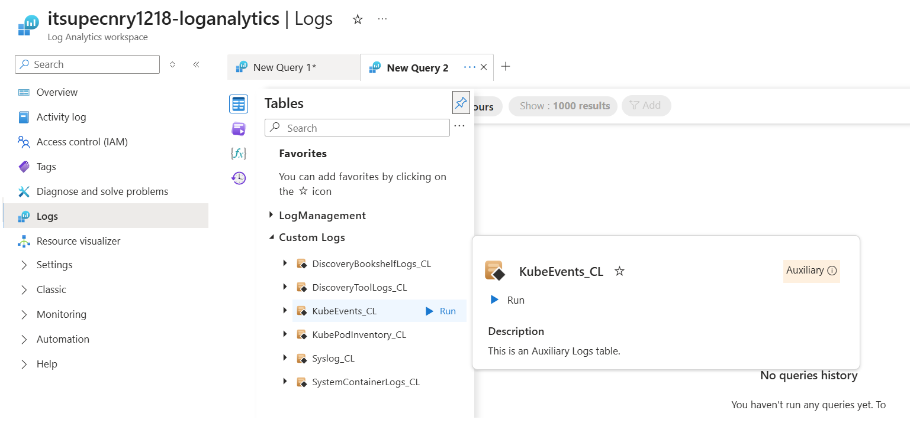
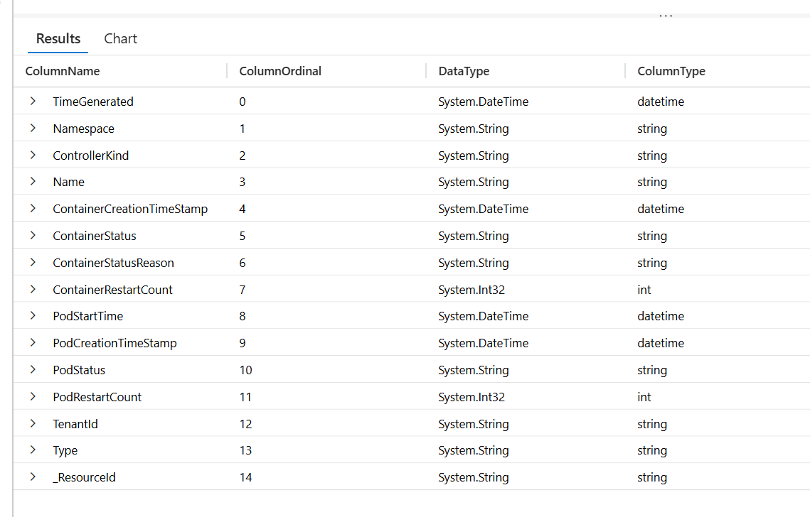
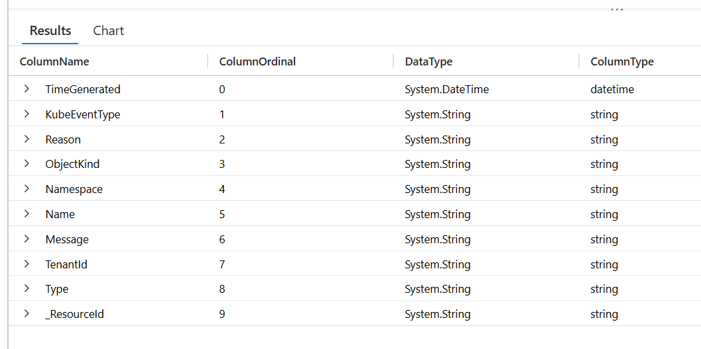
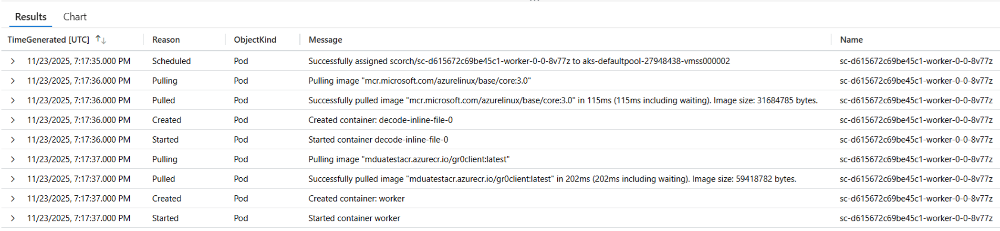

# Viewing Supercomputer Logs in Managed Resource Group

This guide walks you through accessing and querying logs for your Microsoft Discovery Supercomputer by navigating to Log Analytics for Supercomputer in the Managed Resource Group (MRG).

## What are Supercomputer Logs?

The Microsoft Discovery Supercomputer logs consist of platform syslogs and Kubernetes events for cluster‑level diagnostics, alongside container stdout/stderr application logs.

All logs are automatically collected and stored in a dedicated Log Analytics workspace provisioned within the Supercomputer’s Managed Resource Group (MRG). The following categories of logs are available in the Log Analytics workspace:

| Log Category | Log Analytics Table | Description | Primary Use |
|-------------|---------------------|-------------|-------------|
| Platform & Orchestration Logs | `KubePodInventory_CL` | Tracks pod creation, placement, and lifecycle state across the cluster | Cluster diagnostics, pod lifecycle analysis |
| Platform & Orchestration Logs | `KubeEvents_CL` | Captures Kubernetes events such as scheduling failures and volume mount or attachment errors | Identifying orchestration and scheduling issues |
| Platform & Orchestration Logs | `Syslog_CL` | Records OS‑level signals related to node health and underlying infrastructure issues | Infrastructure and node health troubleshooting |
| System Component Application Logs | `SystemContainerLogs_CL` | Logs from platform‑managed controllers and orchestration services | Diagnosing platform and execution issues |
| Tool Execution Application Logs | `DiscoveryToolLogs_CL` | Logs from tool containers, including execution output and failures | Tool debugging and user‑visible execution output |
| Bookshelf Indexing Job Logs | `DiscoveryBookshelfLogs_CL` | Logs from Bookshelf indexing jobs capturing execution behavior and failures | Bookshelf indexing troubleshooting and analysis |

>**Note:** Before proceeding any further, ensure you have followed instruction as in README [here](./README.md).

## Query Supercomputer Logs

1. **Open the Tables Panel**
   - In the left panel of the Logs interface, click on **"Tables"** tab
   - This displays all available log tables

2. **Locate Custom Logs**
   - Expand the **"Custom Logs"** section
   - Look for the table names (e.g **`KubeEvents_CL`**)

3. **Run the Default Query**
   - Click the **"Run"** button next to the table name
   - This executes a basic query to retrieve recent log entries
   - Results will display in the results pane below

   

### Queries to View Table Schemas

```kql
KubePodInventory_CL
| getschema
```

Result


```kql
KubeEvents_CL
| getschema
```
Result


### Basic Query Examples

In the examples below replace `tableName` with the name of your table (e.g. KubePodInventory_CL)

#### View Recent Logs

```kql
tableName
| take 100
```

#### Filter by Time Range

```kql
tableName
| where TimeGenerated > ago(1h)
| order by TimeGenerated desc
```

#### Search for Errors or Failures

```kql
tableName
| where * has "error" or * has "fail"
| order by TimeGenerated desc
```

### KubeEvents_CL Query Examples

#### Recent Pod Events

```kql
KubeEvents_CL
| where TimeGenerated > ago(1h)
| where ObjectKind == "Pod"
```

#### Find Nodes with warnings

```kql
KubeEvents_CL
| where ObjectKind == "Node"
| where KubeEventType == "Warning"
```

#### Events for Lifecycle of container

```kql
KubeEvents_CL 
| where ObjectKind == "Pod"
| where Name == "sc-d615672c69be45c1-worker-0-0-8v77z"
```

Result


### KubePodInventory_CL Query Examples

#### Pods in crash loop

```kql
KubePodInventory_CL
| where ContainerStatus  == 'waiting'
| where ContainerStatusReason == 'CrashLoopBackOff' or ContainerStatusReason == 'Error'
```

#### Pods in pending state

Check Pods that cannot be started and its pending time

```kql
KubePodInventory_CL
| where PodStatus == 'Pending'
| project PodCreationTimeStamp, Namespace, PodStartTime, PodStatus, Name, ContainerStatus
| summarize Start = any(PodCreationTimeStamp), arg_max(PodStartTime, Namespace) by Name
| extend PodStartTime = iff(isnull(PodStartTime), now(), PodStartTime)
| extend PendingTime = PodStartTime - Start
| project Name, Namespace, PendingTime
```

#### Find OOMKilled Pods

```kql
KubePodInventory_CL
| where ContainerStatusReason == "OOMKilled"
| order by TimeGenerated desc
```

### Adjusting Time Range

To change the time range for your query:

1. **Use the Time Range Selector**
   - At the top of the query editor, find the time range dropdown
   - Select from preset ranges: Last 24 hours, Last 7 days, Last 30 days, etc.
   - Or choose **"Custom"** to specify exact start and end times

2. **Use KQL Time Filters**
   - Add `where TimeGenerated` clauses to your query:
     - `ago(1h)` - Last 1 hour
     - `ago(24h)` - Last 24 hours
     - `ago(7d)` - Last 7 days
     - `datetime(2025-11-01)` - Specific date

## Troubleshooting Common Issues

### No Data in Tables

**Possible Causes:**

- Supercomputer is newly created and hasn't generated logs yet
- Time range is too narrow
- Logs are delayed (up to 5 seconds ingestion delay)

**Resolution:**

1. Expand time range to last 24 hours
2. Run a simple investigation to generate logs
3. Wait a few seconds and refresh the query

### Query Timeout or Performance Issues

**Possible Causes:**

- Query is too broad (large time range, no filters)
- Complex aggregations or joins

**Resolution:**

1. Reduce time range
2. Add filters to limit data volume
3. Use `take` or `limit` to restrict result set
4. Consider using summarization instead of raw data

## Related Documentation

- [Supercomputer Creation](../4-discovery-infra-resources/c--supercomputer.md)
- [AKS - KubePodInventory](https://learn.microsoft.com/en-us/azure/azure-monitor/reference/tables/kubepodinventory) / [sample queries](https://learn.microsoft.com/en-us/azure/azure-monitor/reference/queries/kubepodinventory)
- [AKS - KubeEvents](https://learn.microsoft.com/en-us/azure/azure-monitor/reference/tables/kubeevents) / [sample queries](https://learn.microsoft.com/en-us/azure/azure-monitor/reference/queries/kubeevents)
