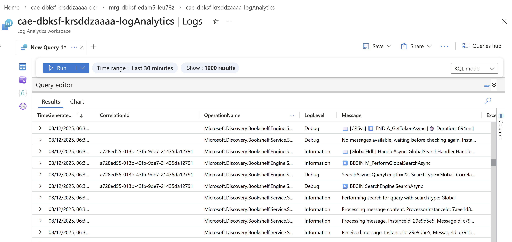

# Viewing Bookshelf Knowledgebase Query Logs in Managed Resource Group

This guide walks you through accessing and querying logs for your Microsoft Discovery bookshelf knowledgebase by navigating to the Log Analytics workspace in the Managed Resource Group (MRG). 

## What are Bookshelf Knowledgebase Query Logs?

Microsoft Discovery Bookshelf knowledgebase query logs provide detailed insights into:

- **Query execution traces** - Track query invocations and its execution.
- **Error diagnostics** - Investigate failures and exceptions in query execution from kb agent.

All knowledgebase query logs are automatically collected and stored in a Log Analytics workspace that is provisioned within the bookshelf's Managed Resource Group (MRG).

>**Note:** Before proceeding any further, ensure you have followed instruction as in README [here](./README.md).

## Query Bookshelf Knowledgebase Query Logs

1. **Open the Tables Panel**
   - In the left panel of the Logs interface, click on **"Tables"** tab
   - This displays all available log tables

2. **Locate Custom Logs**
   - Expand the **"Custom Logs"** section
   - Look for the table named **`DiscoveryLogs_CL`**
   - This table contains all Microsoft Discovery knowledgebase query logs

3. **Run the Default Query**
   - Click the **"Run"** button next to `DiscoveryLogs_CL`
   - This executes a basic query to retrieve recent log entries
   - Results will display in the results pane below

   

## Customizing Your Log Queries

After running the initial query, you can customize it to filter and analyze logs based on your specific needs.

### Basic Query Examples

#### View Recent Logs

```kql
DiscoveryLogs_CL
| take 100
```

#### Filter by Time Range

```kql
DiscoveryLogs_CL
| where TimeGenerated > ago(1h)
| order by TimeGenerated desc
```

#### Search for Specific Terms

```kql
DiscoveryLogs_CL
| where Message contains "error" or Message contains "exception"
| order by TimeGenerated desc
```

#### Analyze Error Patterns

```kql
DiscoveryLogs_CL
| where LogLevel == "Error"
| summarize ErrorCount = count() by ErrorType = tostring(split(Message, ":")[0])
| order by ErrorCount desc
```

## Troubleshooting Common Issues

### No Data in DiscoveryLogs_CL Table

**Possible Causes:**
- KB query container is newly created and hasn't generated logs yet
- Time range is too narrow
- Logs are delayed (up to 5 seconds ingestion delay)

**Resolution:**
1. Expand time range to last 24 hours
2. Run a simple query in Discovery Studio to generate logs.
3. Wait a few seconds and refresh the query

### Query Timeout or Performance Issues

**Possible Causes:**
- Query is too broad (large time range, no filters)
- Complex aggregations or joins

**Resolution:**
1. Reduce time range
2. Add filters to limit data volume
3. Use `take` or `limit` to restrict result set
4. Consider using summarization instead of raw data

## Related Documentation

- [Bookshelf Deployment](../9-bookshelves-knowledgebases/a--bookshelf-deployment.md)
- [KnowledgeBase Creation](../9-bookshelves-knowledgebases/c--knowledgebase-creation.md)
