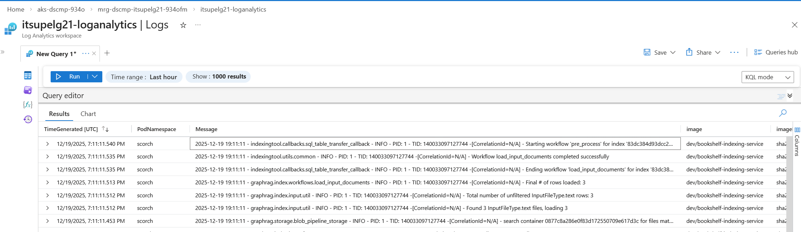
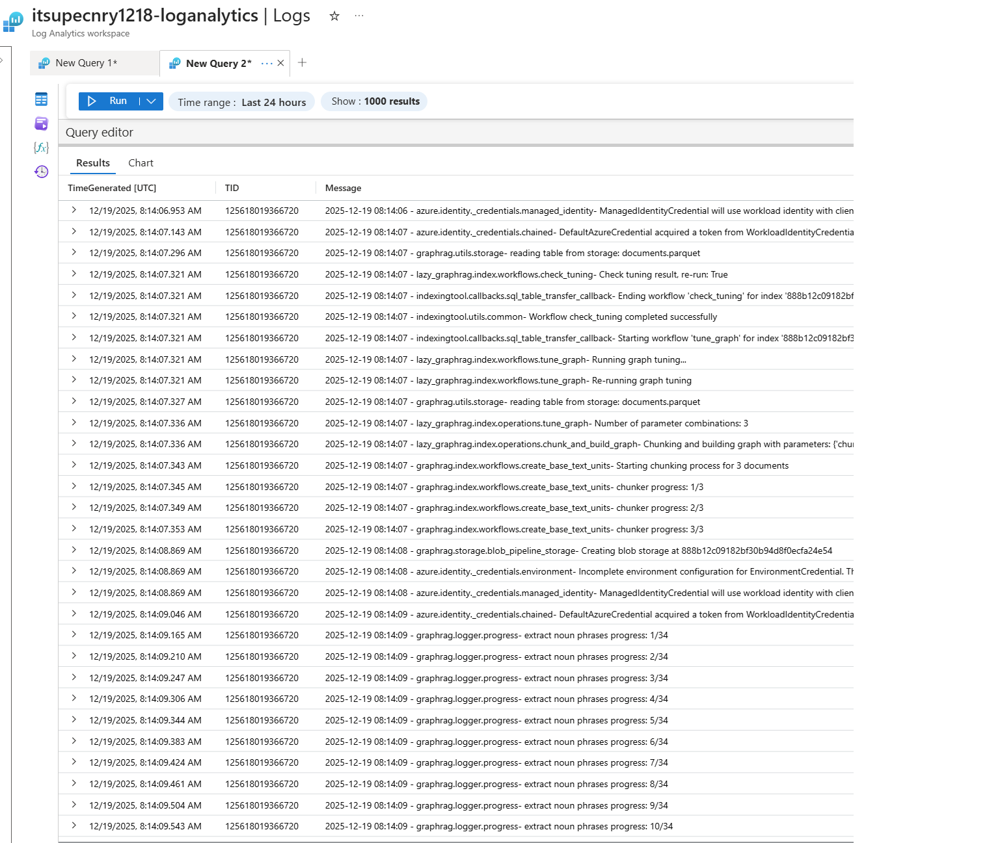

# Viewing Bookshelf Indexing Logs in Managed Resource Group

This guide walks you through accessing and querying logs for your Microsoft Discovery Bookshelf indexing jobs by navigating to the Log Analytics workspace in the Managed Resource Group (MRG).

## What are Bookshelf Indexing job Logs?

Microsoft Discovery Bookshelf indexing job logs provide detailed insights into:

- **Indexing job execution messages** - Capture the application stdout/stderr logs.
- **Error diagnostics** - Investigate failures and exceptions during indexing.

All Bookshelf indexing logs are automatically collected and stored in a Log Analytics workspace that is provisioned within the Supercomputer's Managed Resource Group (MRG).

>**Note:** Before proceeding any further, ensure you have followed instruction as in README [here](./README.md).

## Query Bookshelf Indexing Logs

1. **Navigate to the Supercomputer MRG**
   - Please refer to the section [Accessing logs](README.md#accessing-logs) for detailed instructions.

2. **Open the Tables Panel**
   - In the left panel of the Logs interface, click on **"Tables"** tab
   - This displays all available log tables

3. **Locate Custom Logs**
   - Expand the **"Custom Logs"** section
   - Look for the table named `DiscoveryBookshelfLogs_CL`
   - This table contains all Microsoft Discovery Bookshelf indexing logs

4. **Run the Default Query**
   - Click the **"Run"** button next to `DiscoveryBookshelfLogs_CL`
   - This executes a basic query to retrieve recent log entries
   - Results will display in the results pane below

   

## Customizing Your Log Queries

After running the initial query, you can customize it to filter and analyze logs based on your specific needs.

### Basic Query Examples

Below are some examples showing the usage of these Bookshelf indexing logs:

#### View Recent Logs

```kql
DiscoveryBookshelfLogs_CL
| take 100
```

#### Filter by Time Range

```kql
DiscoveryBookshelfLogs_CL
| where TimeGenerated > ago(1h)
| order by TimeGenerated desc
```

#### Search for Specific Terms

```kql
DiscoveryBookshelfLogs_CL
| where Message contains "error" or Message contains "exception"
| order by TimeGenerated desc
```

### View Indexing logs of a Knowledgebase

```kql
// Replace KnowledgeBase name
let knowledgeBaseName = "itkblgrcnry1218";

// Resolve Thread ID
let TargetTID = toscalar(
        DiscoveryBookshelfLogs_CL
        | where Message has "TID" and Message has knowledgeBaseName
        | extend TID = extract(@"TID[:\s-]+(\d+)", 1, Message)
        | where isnotempty(TID) | summarize any(TID)
    );

DiscoveryBookshelfLogs_CL
| extend TID = extract(@"TID[:\s-]+(\d+)", 1, Message)
| where TID == TargetTID
| project TimeGenerated, TID, Message
| order by TimeGenerated asc

```

Result


## Troubleshooting Common Issues

### No Data in DiscoveryBookshelfLogs_CL Table

**Possible Causes:**

- Indexing jobs have not been executed
- Time range is too narrow
- Logs are delayed (up to 5 seconds ingestion delay)

**Resolution:**

1. Expand time range to last 24 hours
2. Run a simple query in Discovery Studio to generate logs.
3. Wait a few seconds and refresh the query

### Query Timeout or Performance Issues

**Possible Causes:**

- Query is too broad (large time range, no filters)
- Complex aggregations or joins

**Resolution:**

1. Reduce time range
2. Add filters to limit data volume
3. Use `take` or `limit` to restrict result set
4. Consider using summarization instead of raw data

## Related Documentation

- [Bookshelf Deployment](../9-bookshelves-knowledgebases/a--bookshelf-deployment.md)
- [KnowledgeBase Creation](../9-bookshelves-knowledgebases/c--knowledgebase-creation.md)
