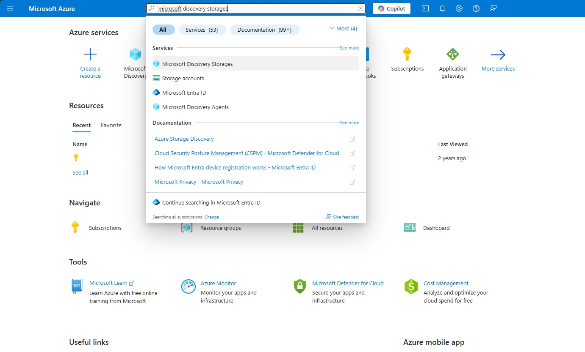
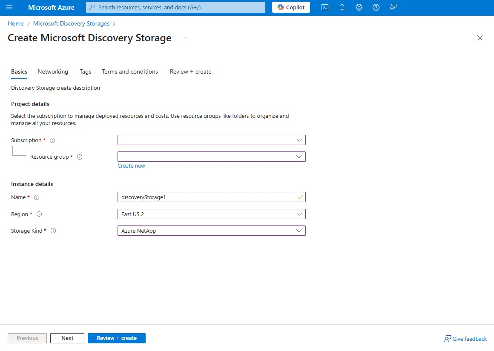

# Create a Microsoft Discovery Storage Resource

Microsoft Discovery Storage provides high-performance, scalable storage infrastructure for scientific computing workloads. Storage resources enable data persistence, sharing, and management across tools, models, and compute resources within your Microsoft Discovery environment.

## Overview

Microsoft Discovery Storage resources serve as the foundation for data management in your scientific workflows. They provide:

- **High-performance storage** for large-scale scientific datasets and high performance computing.
- **Data persistence** across tool executions and compute sessions
- **Shared access** to data across multiple tools and users
- **Integration** with DataContainers and DataAssets for organized data management
- **Network security** through virtual network integration

## Prerequisites

Before creating a Microsoft Discovery Storage resource, ensure you have:

- An active Azure subscription with Microsoft Discovery resource provider registered
- Sufficient permissions to create resources in your Azure subscription (Contributor or Owner role)
- Microsoft Discovery Platform Administrator role
- A configured virtual network with appropriate subnets:
  - Storage subnet (e.g., `10.0.1.0/24`) with proper delegation for storage services

## Step 1: Create the Storage Resource

### 1. Sign in to the Azure Portal

1. Navigate to [Azure Portal](https://portal.azure.com)
2. Sign in with your Azure credentials that have the necessary permissions

### 2. Navigate to Microsoft Discovery Storage

1. In the Azure Portal search bar, type `Microsoft Discovery Storage`
2. Select **Microsoft Discovery Storage** from the search results
3. You'll see the Microsoft Discovery Storage resource list page

### 3. Initialize Storage Creation

1. Click **Create** to start the storage resource creation process
2. This will open the "Create Microsoft Discovery Storage" wizard

### 4. Configure Basic Details

In the **Basics** tab, configure the following settings:

- **Subscription**: Select your Azure subscription
- **Resource Group**: Choose an existing resource group or create a new one
  - Consider using the same resource group as your other Microsoft Discovery resources for easier management
- **Region**: Select the Azure region for your storage resource
  - Choose the same region as your Supercomputer resources for optimal performance
- **Storage Name**: Enter a unique name for your storage resource
  - Name must be globally unique and follow Azure naming conventions
  - Use descriptive names like `contoso-research-storage` or `team-hpc-storage`

Click **Next: Networking** to proceed.

### 5. Configure Networking

In the **Networking** tab, configure network access:

- **Virtual Network**: Select the virtual network created in your prerequisites
  - This should be the same virtual network used for your Supercomputer resources
- **Subnet**: Choose the storage subnet with appropriate delegation
  - Select a subnet specifically configured for storage services
  - Ensure the subnet has the required delegation (e.g., `Microsoft.NetApp/volumes`)

> [!NOTE]: The virtual network and subnet must be properly configured to ensure connectivity between storage, compute, and other Microsoft Discovery resources.

> [!NOTE]: There can only be one subnet per vnet which is delegated to `Microsoft.NetApp/volumes`.
> If you are deploying multiple discovery storage resources to a connected set of resources, please use separate vnets with peering, or re-use the same subnet after checking address capacity etc. Refer to [Azure NetApp Files documentation](https://learn.microsoft.com/en-us/azure/azure-netapp-files/azure-netapp-files-network-topologies) for more information about network planning

Click **Next: Tags** to continue.

### 8. Add Tags (Optional)

In the **Tags** tab, add metadata tags for resource management:

- **Environment**: `Production`, `Development`, `Research`
- **Project**: Your project or team name
- **Owner**: Contact information for the resource owner

Tags help with resource organization, cost management, and governance.

Click **Next: Review + Create**.

### 9. Review and Create

In the **Review + Create** tab:

1. **Review Configuration**: Verify all settings are correct
    - Double-check the virtual network and subnet configuration
    - Confirm the UAMI and security settings
    - Validate the performance and redundancy choices
2. **Terms and Conditions**: Read and accept the terms
3. **Create Resource**: Click **Create** to deploy the storage resource

## Step 2: Monitor Deployment

### Deployment Progress

1. **Deployment Status**: Monitor the deployment progress in the Azure Portal
2. **Notifications**: Check the notification area for deployment updates
3. **Expected Time**: Storage deployment typically takes 5-15 minutes

### Verify Deployment

Once deployment completes:

1. **Navigate to Resource**: Click "Go to resource" from the deployment notification
2. **Check Status**: Verify the storage resource shows as "Running" or "Available"
3. **Review Configuration**: Confirm all settings were applied correctly

### Integration with Supercomputers

1. **Associate with Workspace**
   - When creating a Microsoft Discovery Workspace, select this storage resource
   - The storage will be available to all tools and compute resources in the workspace
2. **Verify Connectivity**
   - Ensure the storage subnet can communicate with supercomputer subnets

## Troubleshooting Common Issues

### Deployment Failures

**Network Configuration Issues**:
    - Verify virtual network and subnet settings
    - Check subnet delegation for storage services
    - Ensure network security group rules allow storage traffic

**Quota Limitations**:
    - Verify storage account quota in the selected region
    - Check subscription limits for storage resources

## Next Steps

After creating your Microsoft Discovery Storage resource:

1. **Create Data container & Data Asset Resources**: [Create Data Container & Data Asset Resources](b--data-containers-data-assets.md)
1. **Create Supercomputer Resources**: [Create a Supercomputer](c--supercomputer.md) that can access this storage
1. **Create a Workspace**: Create a Microsoft Discovery Workspace and associate your storage and compute resources
1. **Deploy Tools**: [Deploy scientific tools](../6-tools-models-agents/) that can access your stored data
1. **Create Projects**: [Create research projects](../7-projects/) within your workspace

## Additional Resources

- [Virtual Networks and Subnets for Microsoft Discovery](../3-basic-building-blocks/a--virtual-network-subnets.md)
