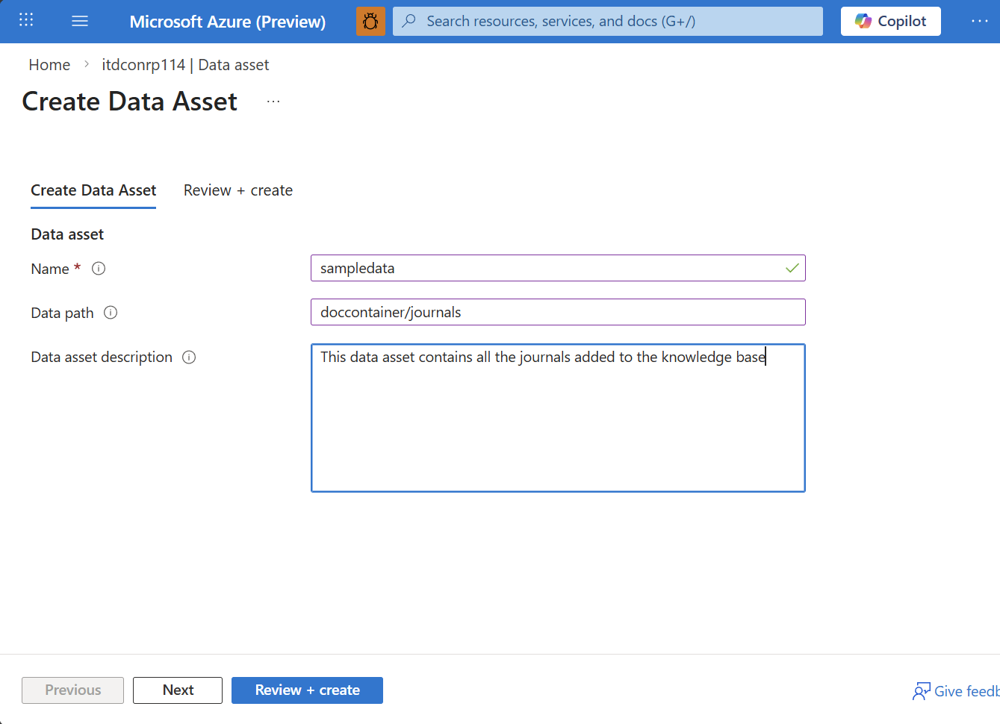

# Create Data Containers and Data Assets

Data Containers and Data Assets are fundamental components of the Microsoft Discovery platform that enable efficient data management, organization, and access for scientific workloads. Data Containers serve as logical repositories that organize and manage data assets, while Data Assets represent the actual files or datasets stored within these containers.

## Overview

Data management in Microsoft Discovery follows a hierarchical structure designed to support scientific research workflows:

- **Data Containers**: Logical storage boundaries that organize and manage collections of data assets
- **Data Assets**: Individual files, datasets, or directories containing scientific data
- **Storage Integration**: Seamless integration with Azure storage services for secure and scalable data access

### Key Benefits

#### Organized Data Management

- Logical grouping of related datasets and files
- Hierarchical organization supporting complex research projects
- Version control and metadata management capabilities

#### Flexible Storage Options

- Support for multiple Azure storage types (Blob Storage, Files, NetApp)
- Integration with existing enterprise storage infrastructure
- Cost-effective storage tiering and lifecycle management

#### Secure Access Control

- Integration with Azure RBAC and managed identities
- Network-level security with virtual network integration
- Compliance with enterprise security policies

#### Seamless Integration

- Native integration with Microsoft Discovery Supercomputers
- Automatic mounting and access from compute resources
- Support for scientific tools and workflow orchestration

## Prerequisites

Before creating data containers and data assets, ensure you have:

- An active Azure subscription with Microsoft Discovery resource provider registered
- Sufficient permissions to create and manage storage resources (Contributor or Owner role)
- A configured virtual network with appropriate subnets
- User Assigned Managed Identity (UAMI) with required permissions
- Understanding of your data storage and access requirements

### Required Storage Resources

You'll need the following storage resources configured:

#### Azure Storage Blob Account

- Network access configured for your virtual network. If you are using private link and have Hierarchical Namespaces (Datalake) enabled on your storage account, you must create private endpoints for both Blob and DFS endpoints. Refer to [Azure Storage documentation](https://learn.microsoft.com/en-us/azure/storage/common/storage-private-endpoints) for more details.
- CORS settings enabled for Microsoft Discovery Studio
- Container named "discoveryoutputs" for output storage

#### Microsoft Discovery Storage (Optional)

- Azure NetApp Files or other supported storage types
- Shared storage for computational workloads
- High-performance storage for intensive operations

## Data Container Types

Microsoft Discovery supports three types of data containers, each serving different purposes:

### 1. Azure Storage Blob Containers

**Primary Use**: Input and output data storage for investigations and computational tasks

**Characteristics:**

- Cost-effective for large datasets
- Excellent for archival and backup scenarios
- Supports hierarchical namespace for folder-like organization
- Integrates with Azure Data Lake features

**Best For:**

- Raw experimental data
- Processed results and outputs
- Reference datasets and databases
- Backup and archival storage

**Limitations for Supercomputer Usage:**

Blob storage is mounted to Discovery Supercomputer using the [blobfuse2 driver](https://github.com/Azure/azure-storage-fuse), which has behavioural differences to other network filesystems like NFS. All blob storages are mounted using File Cache mode, which is not optimal for all workloads.

- Files will not be uploaded to blob storage while they are still open in applications. Workflows depending on continual data streaming may not be suited to blob storage.
  - If you need to guarantee upload periodically, `fsync()` calls will force file upload. Using O_SYNC file descriptors is not recommended, especially with large files, as it will upload the blob on every write call.
- Blob storage data assets are cached locally before they can be used by applications. This means that the data asset must fit on the OS disk of the compute nodes, giving an estimated maximum size of 90GB for all blob storage data assets used by single job.
- Blob storage is not fully POSIX compliant as a filesystem. Refer to [blobfuse documentation](https://learn.microsoft.com/en-us/azure/storage/blobs/blobfuse2-known-issues) for limitations.

### 3. Microsoft Discovery Storage Containers

**Primary Use**: High-performance shared storage for computational workloads

**Characteristics:**

- Based on Azure NetApp Files or similar high-performance storage
- Low-latency access for compute-intensive tasks
- High throughput for parallel workloads
- Optimized for HPC scenarios

**Best For:**

- Active computational datasets
- Temporary working directories
- High-performance computing scratch space
- Real-time data processing

## Step-by-Step Guide: Creating Data Containers

### Step 1: Access Microsoft Discovery Studio

1. **Navigate to Microsoft Discovery Studio**
   - Open your web browser and go to [Microsoft Discovery Studio](https://studio.discovery.microsoft.com)
   - Sign in with your Azure AD credentials
   - Ensure you have access to the appropriate workspace

2. **Navigate to Data Containers**
   - In the left navigation pane, locate the **Resources** section
   - Click on **Data Containers** to view existing containers and create new ones

   

### Step 2: Create Azure Storage Blob Data Container

1. **Initialize Container Creation**
   - Click **Create Data Container** to start the creation process
   - This opens the data container creation wizard

2. **Configure Basic Settings**
   - **Name**: Enter a descriptive name for your data container (e.g., `experiment-outputs`, `reference-datasets`)
   - **Subscription**: Select your Azure subscription
   - **Resource Group**: Choose the resource group containing your storage resources
   - **Location**: Select the Azure region matching your other resources

3. **Select Data Store Type**
   - **Data Store Type**: Select **Azure Storage Blob**
   - **Storage Account**: Choose the Azure Storage Blob account created in prerequisites
   - Ensure the storage account has proper network configuration and CORS settings

   

4. **Configure Access and Security**
   - **Managed Identity**: Select the User Assigned Managed Identity (UAMI) for secure access
   > **Note:** Ensure the UAMI has "Storage Blob Data Contributor" access to the storage account

5. **Review and Create**
   - Review all configuration settings
   - Verify storage account compatibility and access permissions
   - Click **Create** to deploy the data container

### Step 3: Create Microsoft Discovery Storage Data Container

1. **Start New Container Creation**
   - From the Data Containers page, click **Create Data Container** again
   - Configure basic settings similar to the previous container

2. **Select Discovery Storage**
   - **Data Store Type**: Select **Discovery Storage**
   - **Discovery Storage Resource**: Choose the Microsoft Discovery Storage resource created earlier
   - This provides high-performance shared storage for computational workloads

3. **Configure Identity and Access**
   - **Managed Identity**: Select the same UAMI used for other resources
   - Ensure the identity has appropriate permissions for the Discovery Storage resource

4. **Complete Creation**
   - Review configuration settings
   - Click **Create** to deploy the Discovery Storage data container

### Step 4: Verify Data Container Deployment

1. **Check Container Status**
   - Return to the Data Containers page
   - Verify both containers appear in the list with "Running" or "Succeeded" status
   - Note the container names for use in project configuration

2. **Test Connectivity**
   - Verify the containers are accessible from your network
   - Check that managed identity permissions are properly configured
   - Confirm storage accounts are reachable from compute resources

## Managing Data Assets

### Understanding Data Assets

Data Assets are the actual files, datasets, or directories stored within Data Containers. They represent the scientific data that researchers work with during investigations and computational tasks.

**Data Asset Types:**

- **Files**: Individual documents, scripts, or data files
- **Directories**: Folder structures containing multiple files and subdirectories

### Creating and Organizing Data Assets

1. **Upload Data Through Studio**
   - Navigate to your data container in Microsoft Discovery Studio
   - Use the web interface to create a data asset and upload files

2. **Direct Storage Access**
   - Use Azure Storage Explorer or Azure CLI for bulk uploads
   - Mount storage accounts as network drives for large file transfers
   - Utilize Azure Data Factory for automated data ingestion

3. **Programmatic Access**
   - Use Azure SDKs and APIs for automated data management
   - Integrate with existing data pipelines and ETL processes
   - Implement custom data processing workflows

### Create and upload files to data assets in Discovery Studio

#### Create a data asset with single file upload

In Microsoft Discovery Studio, follow the steps below:

1. Navigate to Data tab in the left navigation pane.
1. Select your data container from the list, or see [create a data container section](#step-by-step-guide-creating-data-containers) if you do not have one.
1. Select "Create Data Asset"
1. Enter name of the data asset
1. Select the data asset type. Select "file" since you are uploading a single file to the data asset.
1. Select "Select file" button to upload a single file from your local storage.
1. Select "Create" to create the data asset


#### Create a data asset with multiple files

1. Navigate to Data tab in the left navigation pane.
1. Select your data container from the list, or see [create a data container section](#step-by-step-guide-creating-data-containers) if you do not have one.
1. Select "Create Data Asset"
1. Enter name of the data asset
1. Select the data asset type. Select "folder" since you are uploading multiple files to the data asset.
1. Select "Create".
1. Once the data asset is created, select the data asset name to open it
1. Select "Add Data" and choose all the files from your local storage that should be added to the data asset.


> **Note**: Microsoft Discovery Studio only allows uploading of new files to data asset and does not support nested folder structure.

### Add from existing Azure Blob Storage Container to Data Asset

If you have nested folder structure or need to add existing files and folders in Azure Blob Storage Container to a Data Asset, follow the steps below:

1. Navigate to the Azure Portal (https://portal.azure.com)
1. Select the Azure Storage Account referenced in the data container
1. Upload your files and folders in a blob container
1. Navigate to the Microsoft Discovery Data Container in the Azure Portal
1. Select Data Assets in the navigation tab
1. Select "Create data asset"
1. Enter the name fo the data asset and an optional description
1. In the "path" field, enter the file/folder path within your Azure blob storage container in this format: `containerName/folderName/fileName`. For example, if you have a nested folder structure, to point the data asset to the root directory, you should enter: `doccontainer/journals/`.



> **Note:** Add the trailing slash to the path to indicate that it's a folder / directory. If it's a file name, add the file name with extension.

#### Alternative option

You can also create a data asset from the Microsoft Discovery Studio of type "folder" and navigate to the folder's location in the Azure Storage Blob Container and upload files or folders within to create a nested folder structure.

1. Navigate to Studio and follow [Create a data asset with multiple files](#create-a-data-asset-with-multiple-files)
1. Navigate to the Azure Portal
1. Select the Azure Storage Account referenced in the data container
1. Open the "discovery-studio" blob container
1. Select the folder which we created in step 1, the name of the folder is the same as the data asset name
1. Upload your files and folders which will be listed in the Studio as well

### Data Asset Metadata and Organization

**Naming Conventions:**

- Use descriptive, consistent naming patterns
- Include version information and timestamps
- Consider hierarchical folder structures for organization

**Metadata Management:**

- Add descriptions explaining data content and purpose
- Include provenance information (source, creation date, processing history)
- Tag assets with relevant keywords for search and discovery

**Version Control:**

- Implement versioning strategies for evolving datasets
- Use timestamp-based or semantic versioning schemes
- Maintain change logs for important datasets

## Integration with Projects

### Associating Data Containers with Projects

When creating Microsoft Discovery projects, you must associate data containers to provide data access:

1. **Project Creation Requirements**
   - One Azure Storage Blob data container (required)
   - One Microsoft Discovery Storage data container (required for computational workloads)
   - Additional containers as needed for specific use cases

2. **Container Selection During Project Setup**
   - Select containers during the project creation process
   - Ensure containers are in the same region as compute resources
   - Verify proper permissions and network connectivity

3. **Data Access Within Projects**
   - Data containers become available to all project resources
   - Compute instances can mount and access storage automatically
   - Tools and workflows can read/write data seamlessly

### Data Flow in Scientific Workflows

**Input Data Management:**

- Store reference datasets and experimental data in appropriate containers
- Organize input data with clear folder structures and metadata
- Ensure data quality and validation before use in computations

**Processing and Computation:**

- Use high-performance Discovery Storage for active computational data
- Implement data staging strategies for large datasets
- Monitor storage performance during intensive workloads

**Output and Results Management:**

- Automatically save results to designated output containers
- Implement data lifecycle policies for temporary vs. permanent data
- Archive completed experiments for future reference

## Best Practices

### Data Organization

**Hierarchical Structure:**

```text
/project-name/
├── inputs/
│   ├── reference-data/
│   ├── experimental-data/
│   └── configuration/
├── working/
│   ├── intermediate-results/
│   └── temporary-files/
└── outputs/
    ├── final-results/
    ├── visualizations/
    └── reports/
```

**Metadata Standards:**

- Use consistent metadata schemas across projects
- Include data lineage and processing history
- Implement data quality indicators and validation status

### Security and Compliance

**Access Control:**

- Use managed identities for service-to-service access
- Implement least-privilege access principles
- Regular review and audit of access permissions

**Data Protection:**

- Enable encryption at rest and in transit
- Implement data classification and handling policies
- Use Azure Policy for compliance enforcement

**Backup and Recovery:**

- Implement regular backup schedules for critical data
- Test recovery procedures periodically
- Use geo-redundant storage for important datasets

### Performance Optimization

**Storage Selection:**

- Use appropriate storage types for different data access patterns
- Consider performance vs. cost trade-offs
- Implement data tiering for lifecycle management

**Data Transfer:**

- Use high-bandwidth connections for large data transfers
- Implement parallel transfer strategies for bulk operations
- Consider data compression for network-intensive scenarios

**Monitoring and Optimization:**

- Monitor storage performance and utilization
- Implement alerting for capacity and performance thresholds
- Regular optimization of data organization and access patterns

## Troubleshooting Common Issues

### Container Creation Failures

**Permission Issues:**

- Verify managed identity has required storage permissions
- Check Azure RBAC role assignments
- Ensure service principal configurations are correct

**Network Connectivity:**

- Verify virtual network and subnet configurations. If you are using private link and have Hierarchical Namespaces (Datalake) enabled on your storage account, you must create private endpoints for both Blob and DFS endpoints. Refer to [Azure Storage documentation](https://learn.microsoft.com/en-us/azure/storage/common/storage-private-endpoints) for more details.
- Check Network Security Group rules
- Test connectivity from compute resources to storage

**Storage Account Configuration:**

- Verify CORS settings for Studio access
- Check firewall and network access rules

### Data Access Problems

**Mount Failures:**

- Verify storage account network accessibility to Discovery resources consuming it.
- Check managed identity permissions. The Supercomputer kubelet identity requires Storage Blob Data Reader/Contributor permissions for input/output mounting respectively.
- Test manual mounting from compute instances

**Performance Issues:**

- Monitor storage account metrics and limits
- Check network bandwidth and latency
- Consider storage type optimization. See above for limitations with Azure Blob Storage.

**Data Synchronization:**

- Implement proper data synchronization strategies
- Monitor for concurrent access conflicts
- Use appropriate locking mechanisms where needed

## Cost Management

### Storage Cost Optimization

**Tiering Strategies:**

- Use appropriate access tiers (Hot, Cool, Archive) based on usage patterns
- Implement automated lifecycle management policies
- Regular review and optimization of storage usage

**Monitoring and Budgeting:**

- Set up cost alerts and budgets for storage resources
- Monitor usage patterns and identify optimization opportunities
- Use Azure Cost Management for detailed cost analysis

**Data Retention Policies:**

- Implement clear data retention and deletion policies
- Automate cleanup of temporary and intermediate data
- Balance compliance requirements with cost optimization

## Next Steps

After successfully creating your data containers and understanding data asset management:

1. **Create Projects**: [Set up Microsoft Discovery projects](../7-projects/) that utilize your data containers
2. **Data Ingestion**: Develop strategies for loading your scientific data into the containers
3. **Workflow Integration**: Configure tools and workflows to access and process your data
4. **Monitoring Setup**: Implement monitoring and alerting for data storage and access

## Additional Resources

- [Azure Storage Documentation](https://learn.microsoft.com/azure/storage/)
- [Azure NetApp Files Documentation](https://learn.microsoft.com/azure/azure-netapp-files/)
- [Microsoft Discovery Studio User Guide](../)
- [Data Security and Compliance](../../7-security-and-governance/)
