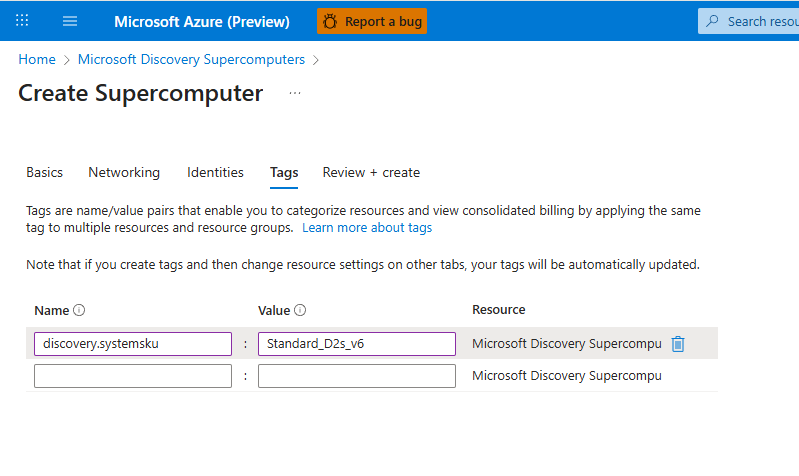

# Create a Supercomputer Resource

Microsoft Discovery Supercomputers provide the computational infrastructure needed to deploy and run scientific tools, as well as index your data in Bookshelf as Knowledge Bases. Supercomputers and their associated node pools deliver appropriate compute resources on a specific virtual network within your customer subscription.

## Prerequisites

Before creating a supercomputer resource, ensure you have:

- An active Azure subscription with Microsoft Discovery resource provider registered
- Sufficient permissions to create resources in your Azure subscription (Contributor or Owner role)
- Microsoft Discovery Platform Administrator role
- A configured virtual network with appropriate subnets:
  - `supercomputer-nodepool-subnet` (e.g., `10.0.2.0/24`)
  - `aks-subnet` (e.g., `10.0.3.0/24`)
- A User Assigned Managed Identity (UAMI) with required permissions
- Sufficient VM SKU quota in your preferred region

## Step 1: Create the Supercomputer Resource

1. **Sign in to the Azure Portal**
   - Navigate to [Azure Portal](https://portal.azure.com)
   - Sign in with your Azure credentials

2. **Navigate to Microsoft Discovery Supercomputers**
   - In the search bar, type `Microsoft Discovery Supercomputers`
   - Select the service from the search results

3. **Initialize Resource Creation**
   - Click **Create** to start the creation process

4. **Configure Basic Details**
   - **Subscription**: Select your Azure subscription
   - **Resource Group**: Choose an existing resource group or create a new one
   - **Location**: Select the Azure region for your supercomputer
   - **Name**: Enter a unique name for your supercomputer resource
   - Click **Next** to proceed

   

5. **Configure Networking**
   - **Virtual Network**: Select the virtual network created in the prerequisites
   - **Subnet**: Choose the `aks-subnet`
   - Click **Next** to continue

6. **Configure Identity Management**
   - **User Assigned Managed Identity (UAMI)**: Add the UAMI created in the prerequisites
   - Configure the following identity roles:
     - **Cluster Identity**: Select your UAMI
     - **Kubelet Identity**: Select your UAMI
     - **Workload Identity**: Select your UAMI

   > **Note**: Supercomputer instances will use this user assigned managed identity to access data from your Azure resources.

   

7. **Tags**
   
    There may be instances when your subscription does not have sufficient quota for the default VM SKU Standard_DS4_v6, and you need to select an alternative VM SKU for your node pool. In such cases, use the following tags:

   - **Name**: discovery.systemsku
   - **Value**: Standard_D2s_v6 (or any other VM SKU that you want to use)

   

8. **Review and Create**
   - Review all configuration settings
   - Read and accept the Terms and Conditions
   - Click **Create** to deploy the supercomputer resource

   

## Step 2: Create Node Pools

After your supercomputer is successfully created, you need to create node pools to provide the actual compute resources.

1. **Navigate to Your Supercomputer Resource**
   - In the Azure Portal, navigate to your newly created supercomputer resource

2. **Access Node Pool Configuration**
   - In the left navigation pane, select **Nodepool** under the **Settings** section
   - Click **Create** to add a new node pool

   

3. **Configure Basic Node Pool Settings**
   - **Name**: Enter a descriptive name for the node pool
   - **Location**: Select the same location as your supercomputer
   - Click **Next** to continue

4. **Configure Node Pool Networking**
   - **Virtual Network**: Select the same virtual network used for the supercomputer
   - **Subnet**: Choose the appropriate subnet for the node pool
   - Click **Next** to proceed

   > **Important**: The virtual network must be the same as the one selected for the storage resource to ensure proper connectivity.

5. **Configure Virtual Machine Settings**
   - **Virtual Machine SKU**: Select the appropriate VM size for your workload requirements, for addtional guidance please refer to [Workload Types and VM SKU Recommendations](e--tool-invocations-workloads.md#workload-types-and-vm-sku-recommendations)
   - Ensure the selected SKU has sufficient quota available in your region
   - Click **Next** to continue

   

6. **Configure Scaling Options**
   - **Maximum Node Count**: Set the maximum number of nodes your node pool can scale to
   - This determines the upper limit of compute resources available for your workloads

   

7. **Review and Create Node Pool**
   - Review all node pool configuration settings
   - Read and accept the Terms and Conditions
   - Click **Create** to deploy the node pool

## Post-Creation Configuration

After successfully creating your supercomputer and node pools:

1. **Verify Resource Status**
   - Check that both the supercomputer and node pools show as "Running" or "Succeeded" status
   - Monitor the deployment progress in the Azure Portal

2. **Associate with Workspace**
   - When creating a Microsoft Discovery Workspace, you can associate this supercomputer resource
   - Only one supercomputer can be associated with a workspace during private preview

3. **Configure Access Control**
   - Set up appropriate Role-Based Access Control (RBAC) for team members
   - Ensure users have the necessary permissions to deploy workloads to the supercomputer

## Troubleshooting Common Issues

### Deployment Failures

- **Insufficient Quota**: Ensure you have sufficient VM quota in the selected region
- **Network Configuration**: Verify virtual network and subnet configurations are correct
- **Identity Permissions**: Confirm the UAMI has the required permissions

### Performance Considerations

- **Node Pool Sizing**: Choose VM SKUs that match your computational requirements
- **Scaling Limits**: Set appropriate maximum node counts based on your workload patterns
- **Regional Availability**: Select regions with good availability for your chosen VM SKUs

## Next Steps

After creating your supercomputer resource:

1. Create a Microsoft Discovery Workspace and associate your supercomputer
2. [Create Projects](../7-projects/) within your workspace
3. [Deploy Tools and Models](../6-tools-models-agents/) to your supercomputer
4. [Index Data in Bookshelf](../9-bookshelves-knowledgebases/) using supercomputer resources

## Security Considerations

- **Network Isolation**: Supercomputers operate within your virtual network boundaries
- **Identity Management**: Use managed identities for secure access to Azure resources
- **Access Control**: Implement least-privilege access principles for supercomputer resources
- **Monitoring**: Enable Azure Monitor and logging for operational insights
