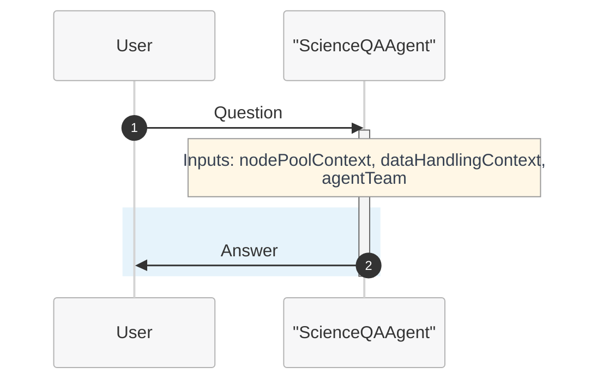

# Tutorial 1: Single Agent - Response Generation (Q&A)

This tutorial demonstrates how to create a simple single agent that can respond to questions and generate answers using Microsoft Discovery.

## Overview

In this tutorial, you'll learn to:
- Create a basic agent definition for Q&A scenarios
- Configure agent parameters for optimal response generation
- Use context variables for enhanced responses
- Test and validate your agent

## Prerequisites

- Access to Microsoft Discovery platform
- Basic understanding of YAML syntax
- Familiarity with AI model concepts (temperature, top_p)

## Step 1: Basic Agent Structure

Let's start by creating a simple Q&A agent that can answer general questions about molecular science:

```yaml
agent:
  name: ScienceQAAgent
  description: A general Q&A agent for molecular science questions
  model: azureml://registries/azure-openai/models/gpt-4o/versions/2024-11-20
  instructions: |-
    You are an AI agent specialized in molecular science and chemistry.
    
    The user goal is: {{userGoal}}
    
    Your role is to provide accurate, helpful answers to questions about:
    - Molecular structures and properties
    - Chemical reactions and mechanisms
    - Computational chemistry concepts
    - Research methodologies in molecular science
    
    Guidelines:
    - Provide clear, concise answers
    - Use scientific terminology appropriately
    - When uncertain, acknowledge limitations
    - Structure your responses logically
    
    Agent team:
    {{agentTeam}}

    Node pool context: 
    {{nodePoolContext}}

    Data handling context: 
    {{dataHandlingContext}}
  top_p: 0.1
  temperature: 0.3
  response_format: auto


extension:
  events: []
  inputs: 
    - name: userGoal
      type: llm
      description: The user request for which the plan needs to be generated.
    - name: agentTeam
      type: llm
      description: The team of agents that will be involved in the workflow.
  outputs: []
  system_prompts: {}
```

## Step 2: Understanding Key Parameters

### Model Selection
- **`model`**: We use GPT-4o for balanced performance and cost
- For more complex reasoning, consider GPT-o3-mini

### Response Control Parameters
- **`temperature: 0.3`**: Low temperature for more deterministic, factual responses
- **`top_p: 0.1`**: Low diversity to focus on most likely tokens for accuracy
- **`response_format: auto`**: Allows flexible response formatting

### Context Variables
- **`{{agentTeam}}`**: Provides information about other agents in multi-agent scenarios
- **`{{nodePoolContext}}`**: Computational resource hints
- **`{{dataHandlingContext}}`**: Data processing guidelines

## Step 3: Enhanced Instructions for Better Responses

For more sophisticated Q&A, enhance the instructions:

```yaml
instructions: |-
You are an AI agent specialized in science research.
Your role is to provide accurate, helpful answers to questions about science research relevant query.

The user goal is:
{{userGoal}}
Guidelines:
- Use your pre-trained data to address user's questions
- Try to be helpful and friendly in your response
- Try to breakdown user's question and answer them systemetially
- Provide clear, concise answers
- Use scientific terminology appropriately
- Structure your responses logically
  
  Agent team:
  {{agentTeam}}

  Node pool context: 
  {{nodePoolContext}}

  Data handling context: 
  {{dataHandlingContext}}
```

## Step 4: Creating a Simple Workflow Agent

Now that you have a working Q&A agent, let's create a simple workflow that uses this agent. A workflow agent orchestrates multiple agents to complete complex tasks. In this case, we'll create a minimal workflow with two states:

1. **Question Answering State**: Uses our Q&A agent to process user queries
2. **End State**: Terminates the workflow

### Simple Workflow Definition



```yaml
name: ScienceQAWorkflow
states:
- name: QuestionAnswering
  actors:
    - agent: ScienceQAAgent
      inputs:
        userGoal: userGoal
        dataHandlingContext: dataHandlingContext
        messageId: messageId
        nodePoolContext: nodePoolContext
        agentTeam: agentTeam
        workflowContext: workflowContext
      thread: MainThread
      humanInLoopMode: onNoMessage
      streamOutput: true
      maxTurn: 50
      maxTransientErrorRetries: 3
      maxRateLimitRetries: 3
  isFinal: false
- name: End
  actors: []
  isFinal: true

transitions:
- from: QuestionAnswering
  to: End

variables:
- Type: thread
  name: MainThread
- Type: userDefined
  name: dataHandlingContext
  value: "
    # Workflow Context:
    You are a specialized Q&A agent focused on answering questions about molecular science and chemistry.
    Your primary role is to provide accurate, helpful responses to user queries using your knowledge and understanding.
    
    ## Workflow specific rules and guidelines
    - Provide clear, concise answers to user questions
    - Use scientific terminology appropriately
    - When uncertain, acknowledge limitations rather than guessing
    - Structure your responses logically with proper explanations
    - Focus on accuracy and educational value in your responses
    "
- Type: userDefined
  name: dataHandlingContext
  value: "
    GUIDELINES:
    
    **Definitions**
    - **Virtual path**: System-assigned absolute namespace for passing data between steps (e.g., `/step0/app/outputs`). Not the container's real filesystem path.
    - **Container path**: Absolute path inside the tool container (e.g., `/app/outputs`). Used only in `outputMounts` and `inputMountPath`.
    - **Mapping**: Tool reads/writes container (mount) path -> system maps to virtual path. Pass **virtual path** downstream, not container path.
    - **Implicit extension**: If `/step0/app/outputs` exists, `/step0/app/outputs/reports` is valid (assuming 'reports' exists in the data pointed to by `/step0/app/outputs`.  Make extension explicit by giving the implicit path a description.
    -**No shortening virtual paths**: Implied 'shortening' is disallowed (So if you had `/step0/app/outputs/reports` as the only item in the context, shortening it to just `/step0/app/outputs` would not be valid).
    ---
    
    **Global Rules**
    1. ALL paths must be ABSOLUTE. Never use relative paths.
    2. Retrieve current data context before any action.
    3. Preview data before updating descriptions.
    4. Update virtualPath description **before** promoting to data asset (or description won't propagate).
    5. Remember to promote data asset after updating description.
    
    ---
    
    **Tool Mount Rules**
    - `outputMounts` = absolute container path where tool stores outputs.  Only directories are permitted.
    - `inputMounts` = array of `{ virtualPath: <virtual path>, inputMountPath: <absolute container path> }`. Files or directories are permitted. The mount path will be of the type (file/directory) that is keyed by the virtual path given.
    
      ---
      
      **Example Flow**
      1. Tool writes `molecule.txt` to `/app/outputs` (container path).
      2. System maps to virtual path `/step0/app/outputs`.
      3. Update description for `/step0/app/outputs`.
      4. Next tool mounts `/step0/app/outputs` as `virtualPath`; `inputMountPath = /app/inputs`.
      ```json
      inputMounts: [ { virtualPath: /step0/app/outputs, inputMountPath: /app/inputs } ]
      ```
      5. Tool produces `step1/app/outputs`
      6. Update description of `step1/app/outputs`
      7. Promote `step1/app/outputs` as data asset"
- Type: userDefined
  name: agentTeam
  value: |-
    Agent team composition:
    1. ScienceQAAgent - Specialized in answering molecular science and chemistry questions
       Capabilities: Provides accurate answers about molecular structures, chemical reactions, computational chemistry concepts, and research methodologies

startstate: QuestionAnswering
```

### Understanding Workflow Components

#### States:
- **QuestionAnswering**: The active state where the Q&A agent processes user queries
  - `actors`: Specifies which agent(s) to use in this state
  - `streamOutput: true`: Enables real-time response streaming
  - `maxTurn: 1`: Limits the agent to one response before transitioning
  - `isFinal: false`: Indicates this is not the terminal state

- **End**: The terminal state that concludes the workflow
  - `actors: []`: No agents needed in the end state
  - `isFinal: true`: Marks this as the final state

#### Transitions:
- Defines how the workflow moves between states
- In our simple case: QuestionAnswering → End (automatic transition after agent response)

#### Variables:
- **Thread Variables**: `MainThread` maintains conversation context
- **Context Variables**: Provide runtime information to agents
  - `nodePoolContext`: Computational resource hints
  - `dataHandlingContext`: Data processing guidelines  
  - `agentTeam`: Information about available agents

### Benefits of Workflow Agents:
- **Orchestration**: Coordinate multiple agents for complex tasks
- **State Management**: Track progress through multi-step processes
- **Context Sharing**: Pass information between different agents
- **Scalability**: Easy to add more states and agents as needs grow

## Step 5: Onboarding and Usage

1. **Save** your agent definition as `science-qa-agent.yaml`
2. **Convert YAML to JSON** using the definition content creator tool:
   ```bash
   python utils/definition-content-creator.py science-qa-agent.yaml --json --output science-qa-agent.json
   ```
   This tool converts your YAML definition to the JSON format required by the Microsoft Discovery platform.
3. **Create ARM resources** through Azure portal using the generated JSON file
4. **Onboard** the agent through Microsoft Discovery platform

### For Q&A Agents:
- Focus on clear, accurate responses
- Test with domain-specific questions
- Validate response consistency
- Monitor performance metrics

## Step 6: Testing Your Agent

> **📋 Project Setup Required**: Before testing your workflow agent, you'll need to create a project in Microsoft Discovery. Follow the [Creating a Project guide](../../7-projects/a--creating-project.md) for step-by-step instructions on setting up your project environment.

### Sample Questions to Test:

1. **Basic Concept**: "What is the difference between ionic and covalent bonds?"
2. **Applied Knowledge**: "How does molecular polarity affect solubility?"
3. **Research Methods**: "What computational methods are used for protein folding prediction?"
4. **Problem Solving**: "Why might a drug molecule have poor bioavailability?"

### Expected Response Characteristics:
- Clear, structured answers
- Scientific accuracy
- Appropriate depth for the question
- Professional tone

## Step 7: Best Practices

### For Q&A Agents:
- Use lower temperature (0.2-0.4) for factual accuracy
- Keep instructions focused and specific
- Include context variables for future extensibility
- Test with diverse question types

### Common Pitfalls to Avoid:
- Overly high temperature leading to inconsistent answers
- Vague instructions that don't guide the model effectively
- Missing context variables that limit future workflow integration

## Step 8: Next Steps

After mastering basic Q&A agents, consider:
- Adding knowledge base integration (Tutorial 2)
- Incorporating specialized tools (Tutorial 3)
- Creating multi-agent workflows for complex queries

## Step 9: Troubleshooting

**Problem**: Responses are too verbose
**Solution**: Add instruction "Keep responses concise and focused"

**Problem**: Responses lack scientific accuracy
**Solution**: Lower temperature and add domain-specific guidelines

**Problem**: Agent doesn't handle edge cases well
**Solution**: Add examples of edge cases in instructions

---

**Continue to [Tutorial 2: Single Agent with Knowledge Base](d--tutorial-02-single-agent-kb.md)**