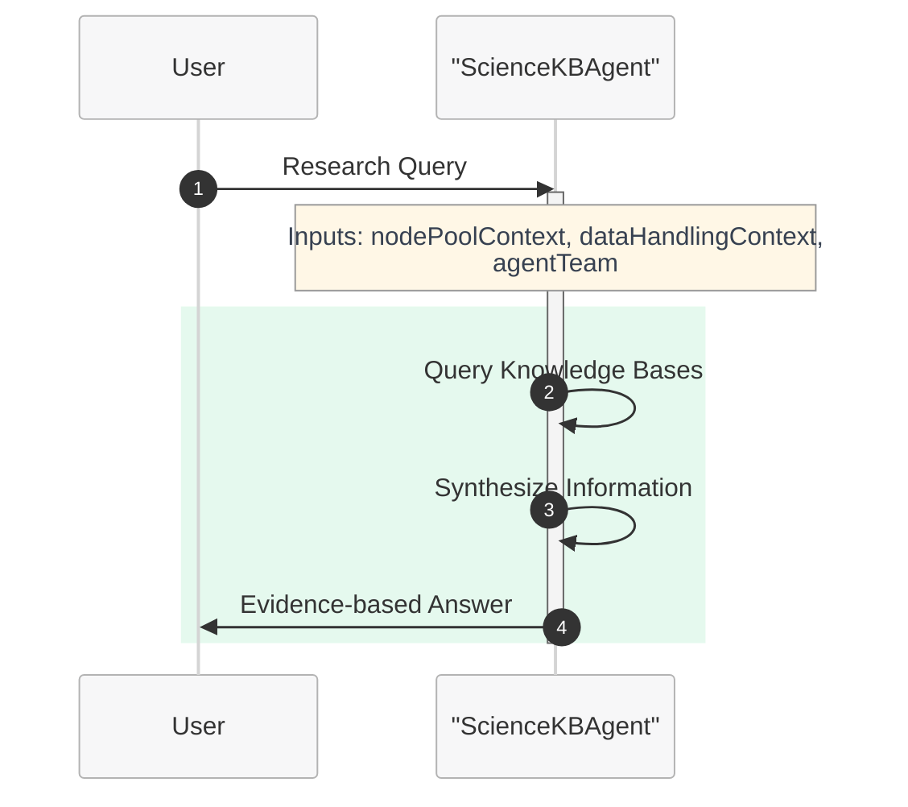

# Tutorial 2: Single Agent with Knowledge Base - Response Generation

This tutorial demonstrates how to create a single agent that leverages knowledge bases to provide enhanced, domain-specific responses using Microsoft Discovery.

## Overview

In this tutorial, you'll learn to:
- Integrate knowledge base tools with your agent
- Configure agents to query and utilize external knowledge sources
- Handle knowledge base responses effectively
- Test and validate your knowledge base agent

## Prerequisites

- Completion of [Tutorial 1: Single Agent Q&A](c--tutorial-01-single-agent-qa.md)
- Access to Microsoft Discovery platform
- Basic understanding of YAML syntax
- Understanding of retrieval-augmented generation concepts

## Step 1: Knowledge Base Integration Architecture

### Understanding the Flow:
In Microsoft Discovery, each knowledge base is accessed through a tool that shares the same name as the knowledge base. The tool name IS the knowledge base name. Each tool has a description that explains what that specific knowledge base contains and what types of queries it handles.

1. User asks a question
2. Agent analyzes the query to determine what type of information is needed
3. Agent reviews available knowledge base tools (where tool names = knowledge base names)
4. Agent selects appropriate knowledge base tool(s) based on names and descriptions
5. Agent executes the selected tool to search that specific knowledge base
6. Agent retrieves pertinent information
7. Agent synthesizes response using retrieved knowledge
8. Agent provides enhanced, fact-based answer with proper knowledge base attribution

## Step 2: Creating Knowledge Base Prerequisites

Before creating an agent that uses knowledge bases, you need to set up the knowledge base infrastructure:

#### Prerequisites for Knowledge Base Integration:
1. **Create a Bookshelf**: Container for your indexed Knowledgebases
2. **Upload Documents**: Add proprietary documents to a Discovery DataAsset
3. **Create Knowledgebase**: Create Knowledgebase in the bookshelf in Studio portal

> **📖 For Complete Setup Instructions**: See the detailed [Bookshelf and Knowledgebase Deployment Guide](../../9-bookshelves-knowledgebases/a--bookshelf-deployment.md) for step-by-step instructions on creating storage accounts, bookshelves, indexing knowledgebases, and integrating them with agents.

## Step 3: Basic Agent with Knowledge Base

Here's an agent definition that integrates with molecular science knowledge bases:

```yaml
agent:
  name: ScienceKBAgent
  description: |-
    Molecular science agent with access to specialized knowledge bases for 
    enhanced research and analysis capabilities.
  model: azureml://registries/azure-openai/models/gpt-4o/versions/2024-11-20
  instructions: |-
    You are an AI agent specialized in molecular science with access to comprehensive knowledge bases.
    
    The user goal is: {{userGoal}}
    
    ## Your Capabilities:
    - Access to scientific literature knowledge bases
    - Research methodology knowledge bases
    - Experimental protocol repositories
    - Domain-specific research databases
    
    ## Research Process:
    1. **Query Analysis**: Understand what information is needed
    2. **Knowledge Retrieval**: Search relevant knowledge bases using available tools
    3. **Information Synthesis**: Combine retrieved information with your knowledge
    4. **Response Generation**: Provide comprehensive, evidence-based answers
    
    ## Guidelines:
    - Always search knowledge bases when handling specific research questions
    - Cite sources when using retrieved information
    - Combine multiple sources for comprehensive answers
    - Distinguish between your training knowledge and retrieved information
    
    ## Knowledge Base Tool Selection:
    - Each knowledge base is accessed through a tool that has the same name as the knowledge base
    - Tool names directly correspond to knowledge base names (e.g., "LiteratureSearchKB" tool accesses the "LiteratureSearchKB" knowledge base)
    - Read tool descriptions to understand what each knowledge base contains
    - Select tools based on both the tool/knowledge base name and description relevance
    - Use knowledge base tools only when their name and description match your information needs
    - Multiple different knowledge bases may be needed for comprehensive answers
    - Preview retrieved information before incorporating into responses
    
    Agent team:
    {{agentTeam}}

    Node pool context: 
    {{nodePoolContext}}

    Data handling context: 
    {{dataHandlingContext}}
  top_p: 0
  temperature: 0
  response_format: auto


extension:
  events: []
  inputs: 
    - name: userGoal
      type: llm
      description: The user request for which the plan needs to be generated.
    - name: workflowContext
      type: llm
      description: The context of the molecular workflow.
    - name: agentTeam
      type: llm
      description: The team of agents that will be involved in the workflow.
  outputs: []
  system_prompts: {}
```

## Step 4: Enhanced Instructions for Knowledge Base Integration

For more sophisticated knowledge base utilization:

```yaml
instructions: |-
  You are an expert molecular science researcher with access to specialized knowledge bases.
  
  ## Knowledge Base Tool Selection:
  
  ### Understanding Tool Names and Descriptions:
  Each knowledge base is accessed through a tool that shares the same name:
  - Tool name = Knowledge base name (direct correspondence)
  - Tool description explains what that specific knowledge base contains
  - Tool description covers what domain or subject area the knowledge base specializes in
  - Tool description indicates what kinds of queries the knowledge base is optimized for
  - Tool description specifies what format the information will be returned in
  
  ### Knowledge Base Selection Process:
  1. **Query Analysis**: Determine what type of information is needed
  2. **Name & Description Review**: Review available tool names and descriptions
  3. **Knowledge Base Selection**: Choose knowledge bases whose names and descriptions match your requirements
  4. **Multi-KB Strategy**: Use multiple knowledge bases when comprehensive coverage is needed
  
  ## Knowledge Base Strategy:
  
  ### When to Use Knowledge Bases:
  - Recent research findings or publications
  - Experimental procedures and protocols
  - Comparative analysis between research studies
  - Regulatory or safety information
  - Domain-specific technical documentation
  
  ### Knowledge Base Workflow:
  1. **Assess Query**: Determine if external knowledge is needed
  2. **Select Sources**: Choose appropriate knowledge bases
  3. **Retrieve Information**: Use tools to gather relevant data
  4. **Validate Results**: Check consistency and relevance
  5. **Synthesize Response**: Combine retrieved and existing knowledge
  
  ### Response Structure with KB Information:
  1. **Direct Answer**: Start with the key finding
  2. **Supporting Evidence**: Include retrieved information with sources
  3. **Context**: Provide background from your training knowledge
  4. **Limitations**: Note any gaps or uncertainties
  
  ## Quality Guidelines:
  - Always attribute information to specific sources
  - Distinguish between retrieved facts and analytical insights
  - Indicate confidence levels based on source quality
  - Suggest additional research directions when appropriate
  
  Agent team:
  {{agentTeam}}

  Node pool context: 
  {{nodePoolContext}}

  Data handling context: 
  {{dataHandlingContext}}
```

## Step 5: Example Knowledge Base Interaction Pattern

### Scenario: User asks about recent research findings

**User Query**: "What are the latest developments in renewable energy storage technologies?"

**Agent Process**:
1. Recognize this requires recent research and literature information
2. Review available knowledge base tools (where tool names = knowledge base names)
3. Identify knowledge base tool named something like "LiteratureSearchKB" or "RenewableEnergyResearchKB"
4. Execute the knowledge base tool to access that specific knowledge base
5. Retrieve recent research findings from the selected knowledge base
6. Synthesize response with context and knowledge base attribution

**Example Tool Selection**:
- **Query Type**: Recent research findings
- **Knowledge Base Selected**: Based on tool name (e.g., "LiteratureSearchKB") and description
- **Tool Executed**: The tool with the same name as the selected knowledge base
- **Alternative**: If multiple relevant knowledge bases exist, may use several for comprehensive coverage

**Expected Response Structure**:
```
## Recent Developments in Renewable Energy Storage

Based on literature research knowledge base:

### Battery Technologies:
- **Solid-state batteries**: Recent breakthroughs in lithium-metal anodes
- **Source**: Literature Search Knowledge Base - Journal Articles 2024

### Grid-scale Storage:
- **Flow batteries**: Improved vanadium redox systems
- **Compressed air**: Advanced adiabatic systems
- **Source**: Renewable Energy Research Knowledge Base

### Analysis:
The field is rapidly evolving with focus on safety, energy density, and cost reduction...

### Research Trends:
- Increased focus on sustainable materials
- Integration with smart grid technologies
- Economic viability studies
```

## Step 6: Knowledge Base Tool Examples

### Understanding Tool Names and Descriptions
The tool name is the knowledge base name. Here are examples of knowledge base tools you might encounter:

**Example Knowledge Base Tools (Tool Name = Knowledge Base Name):**
- **LiteratureSearchKB**: "Searches recent scientific publications and research papers across multiple scientific domains. Returns abstracts, citations, and key findings from peer-reviewed journals."
- **ProtocolRepositoryKB**: "Retrieves step-by-step experimental procedures and research methodologies. Contains validated protocols with detailed instructions and best practices."
- **SafetyDatabaseKB**: "Provides hazard data, handling protocols, and regulatory information for laboratory and research environments."
- **TechnicalStandardsKB**: "Accesses technical standards, specifications, and regulatory guidelines across various industries and research domains."

### Knowledge Base Selection Examples:
- **Query**: "Latest research on quantum computing applications" → Use **LiteratureSearchKB** knowledge base
- **Query**: "Standard protocols for cell culture" → Use **ProtocolRepositoryKB** knowledge base
- **Query**: "Safety guidelines for laboratory equipment" → Use **SafetyDatabaseKB** knowledge base
- **Query**: "IEEE standards for wireless communication" → Use **TechnicalStandardsKB** knowledge base

## Step 7: Advanced Knowledge Base Configuration

### Multiple Knowledge Base Access

```yaml
instructions: |-
  You have access to multiple specialized knowledge bases:
  
  ## Available Knowledge Sources:
  - **Literature Knowledge Base**: Recent publications and research papers
  - **Protocol Repository**: Step-by-step experimental procedures
  - **Safety Knowledge Base**: Hazard information and handling protocols
  - **Technical Standards DB**: Industry standards and specifications
  
  ## Selection Strategy:
  - **Literature KB**: For recent discoveries, review articles, methodology
  - **Protocol KB**: For experimental procedures, research methods
  - **Safety KB**: For handling, storage, disposal information
  - **Standards KB**: For technical specifications and regulatory guidelines
  
  ## Multi-Source Integration:
  1. Query relevant Knowledgebases based on question type
  2. Cross-reference information across sources
  3. Highlight agreements and discrepancies
  4. Provide comprehensive, multi-faceted responses
```

## Step 8: Creating a Workflow with Knowledge Base Agent

Now that you have a working knowledge base agent, let's create a simple workflow that orchestrates this agent. This workflow will have two states to handle knowledge base queries:

1. **Knowledge Research State**: Uses our KB agent to process queries requiring external knowledge
2. **End State**: Terminates the workflow

### Knowledge Base Workflow Definition



```yaml
name: ScienceKBWorkflow
states:
- name: KnowledgeResearch
  actors:
    - agent: ScienceKBAgent
      inputs:
        userGoal: userGoal
        dataHandlingContext: dataHandlingContext
        messageId: messageId
        nodePoolContext: nodePoolContext
        agentTeam: agentTeam
        workflowContext: workflowContext
      thread: MainThread
      humanInLoopMode: onNoMessage
      streamOutput: true
      maxTurn: 50
      maxTransientErrorRetries: 3
      maxRateLimitRetries: 3
  isFinal: false
- name: End
  actors: []
  isFinal: true

transitions:
- from: KnowledgeResearch
  to: End

variables:
- Type: thread
  name: MainThread
- Type: userDefined
  name: workflowContext
  value: "
    # Workflow Context:
    You are apart of a team of AI agents working together
    
    ## Workflow specific rules and guidlines
    - *Important* You should only perform actions which have been assigned to you in the plan.
    - If there is a tool available that can accomplish your step, you should use it, making sure to follow the instructions to use it precisely.
    - It is ok to not know the answer, if you don't know the answer to something or you have no tools to accomplish the given task, you may respond accordingly.
    - *Important* you should never hallucinate any tool invocations.
    "
- Type: userDefined
  name: dataHandlingContext
  value: "
    GUIDELINES:
    
    **Definitions**
    - **Virtual path**: System-assigned absolute namespace for passing data between steps (e.g., `/step0/app/outputs`). Not the container's real filesystem path.
    - **Container path**: Absolute path inside the tool container (e.g., `/app/outputs`). Used only in `outputMounts` and `inputMountPath`.
    - **Mapping**: Tool reads/writes container (mount) path -> system maps to virtual path. Pass **virtual path** downstream, not container path.
    - **Implicit extension**: If `/step0/app/outputs` exists, `/step0/app/outputs/reports` is valid (assuming 'reports' exists in the data pointed to by `/step0/app/outputs`.  Make extension explicit by giving the implicit path a description.
    -**No shortening virtual paths**: Implied 'shortening' is disallowed (So if you had `/step0/app/outputs/reports` as the only item in the context, shortening it to just `/step0/app/outputs` would not be valid).
    ---
    
    **Global Rules**
    1. ALL paths must be ABSOLUTE. Never use relative paths.
    2. Retrieve current data context before any action.
    3. Preview data before updating descriptions.
    4. Update virtualPath description **before** promoting to data asset (or description won't propagate).
    5. Promote only final outputs for end user; intermediate results don't need promotion.
    
    ---
    
    **Tool Mount Rules**
    - `outputMounts` = absolute container path where tool stores outputs.  Only directories are permitted.
    - `inputMounts` = array of `{ virtualPath: <virtual path>, inputMountPath: <absolute container path> }`. Files or directories are permitted. The mount path will be of the type (file/directory) that is keyed by the virtual path given.
    
      ---
      
      **Example Flow**
      1. Tool writes `molecule.txt` to `/app/outputs` (container path).
      2. System maps to virtual path `/step0/app/outputs`.
      3. Update description for `/step0/app/outputs`.
      4. Next tool mounts `/step0/app/outputs` as `virtualPath`; `inputMountPath = /app/inputs`.
      ```json
      inputMounts: [ { virtualPath: /step0/app/outputs, inputMountPath: /app/inputs } ]
      ```
      5. Tool produces `step1/app/outputs`
      6. Update description of `step1/app/outputs`
      7. Promote `step1/app/outputs`"
- Type: userDefined
  name: agentTeam
  value: |-
    Agent team composition:
    1. ScienceKBAgent - Specialized in knowledge base research and literature analysis
       Capabilities: Accesses multiple knowledge bases including literature databases, protocol repositories, safety information, and technical standards. Provides evidence-based answers with proper source attribution.

startstate: KnowledgeResearch
```

### Workflow Benefits for Knowledge Base Agents:
- **Knowledge Orchestration**: Coordinate multiple knowledge base queries
- **Research Workflow**: Structure complex research processes
- **Source Integration**: Manage multiple knowledge sources systematically
- **Extensibility**: Easy to add validation or summarization states

## Step 9: Onboarding

To onboard your knowledge base-enhanced agent:

1. **Save** your agent definition as `science-kb-agent.yaml`
2. **Convert YAML to JSON** using the definition content creator tool:
   ```bash
   python utils/definition-content-creator.py science-kb-agent.yaml --json --output science-kb-agent.json
   ```
3. **Save** your workflow definition as `science-kb-workflow.yaml`
4. **Convert workflow YAML to JSON**:
   ```bash
   python utils/definition-content-creator.py science-kb-workflow.yaml --json --output science-kb-workflow.json
   ```
5. **Create ARM resources** through Azure portal for both agent and workflow using the generated JSON files
6. **Onboard** both agent and workflow through Microsoft Discovery platform

### Adding Knowledgebase to Your Agent

When creating an agent that needs to access proprietary documents or specialized knowledge bases, you can integrate indexed Knowledgebases from the Discovery Bookshelf service:

#### Adding Knowledgebase During Agent Creation:
- In the agent creation interface, you'll see an option to select indexed Knowledgebases
- Choose the relevant Knowledgebase(s) that contain the domain-specific information your agent needs
- The agent will automatically gain access to query this proprietary knowledge alongside other knowledge base tools

#### Benefits:
- **Proprietary Data Access**: Query your organization's specific documents and knowledge
- **Grounding Skills**: Agents can provide answers based on your indexed content
- **Contextual Responses**: Combine general knowledge with your specialized information

> **📖 For Complete Setup Instructions**: See the detailed [Bookshelf and Knowledgebase Deployment Guide](../../9-bookshelves-knowledgebases/a--bookshelf-deployment.md) for step-by-Step instructions on creating storage accounts, bookshelves, indexing knowledgebases, and integrating them with agents.

## Step 10: Testing Your Knowledge Base Agent

> **📋 Project Setup Required**: Before testing your workflow agent, you'll need to create a project in Microsoft Discovery. Follow the [Creating a Project guide](../../7-projects/a--creating-project.md) for step-by-step instructions on setting up your project environment.

### Test Scenarios:

1. **Literature Research**: "What are the latest developments in artificial intelligence ethics?"
2. **Methodology Question**: "What are the standard protocols for conducting user experience research?"
3. **Safety Information**: "What are the safety requirements for working with high-voltage equipment?"
4. **Technical Standards**: "What are the current IEEE standards for network security?"

### Validation Checklist:
- [ ] Agent searches appropriate knowledge bases
- [ ] Retrieved information is relevant and accurate
- [ ] Sources are properly cited
- [ ] Response combines retrieved and existing knowledge
- [ ] Limitations and uncertainties are acknowledged

## Step 11: Best Practices for KB-Enhanced Agents

### Knowledge Base Selection:
- Choose databases relevant to your domain
- Ensure knowledge bases are current and authoritative
- Consider multiple complementary sources

### Query Optimization:
- Use specific, targeted queries
- Iterate searches if initial results are insufficient
- Validate retrieved information quality

### Response Quality:
- Always cite sources for retrieved information
- Distinguish between factual data and interpretations
- Provide context for non-expert users

## Step 12: Common Challenges and Solutions

### Challenge: Information Overload
**Solution**: Implement filtering and ranking strategies in instructions

### Challenge: Conflicting Information
**Solution**: Acknowledge discrepancies and explain possible reasons

### Challenge: Outdated Information
**Solution**: Check publication dates and note when information might be superseded

## Step 13: Multi-Knowledge Base Integration

### Response Time:
- Use targeted queries to reduce search time
- Implement caching strategies where appropriate
- Balance comprehensiveness with efficiency

### Accuracy:
- Cross-reference multiple sources
- Include confidence indicators
- Provide source quality assessments

## Next Steps

After mastering knowledge base integration:
- Explore tool integration (Tutorial 3)
- Learn multi-agent orchestration
- Implement specialized domain workflows

## Troubleshooting

**Problem**: Agent doesn't use knowledge bases
**Solution**: Add explicit instructions to query knowledge bases for specific question types

**Problem**: Retrieved information is irrelevant
**Solution**: Refine search queries and add result validation steps

**Problem**: Response lacks source attribution
**Solution**: Emphasize citation requirements in instructions

---

**Continue to [Tutorial 3: Single Agent with Tools](e--tutorial-03-single-agent-tools.md)**