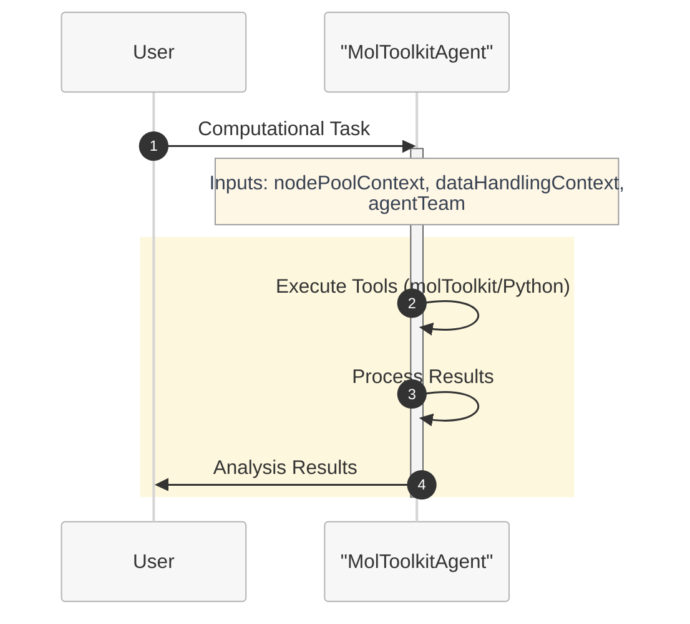

# Tutorial 3: Single Agent with Tools

This tutorial demonstrates how to create a single agent that uses computational tools to perform complex tasks and analyses using Microsoft Discovery.

## Overview

In this tutorial, you'll learn to:
- Integrate computational tools with your agent
- Configure tool execution and data handling
- Implement tool-based workflows
- Handle tool outputs and error scenarios
- Create agents that can perform computational tasks

## Prerequisites

- Completion of [Tutorial 2: Single Agent with Knowledge Base](d--tutorial-02-single-agent-kb.md)
- Understanding of computational chemistry tools
- Basic knowledge of Python and molecular formats (SMILES)
- Access to Microsoft Discovery computational resources

## Step 1: Understanding Tool Integration

### Tool Categories:
1. **Computational Chemistry Tools**: cheminformatics, molecular dynamics simulators
2. **Data Processing Tools**: File manipulation, format conversion
3. **Analysis Tools**: Statistical analysis, visualization
4. **Custom Tools**: Domain-specific computational tools

### Tool Execution Flow:
1. Agent receives task requiring computation
2. Agent plans tool usage strategy
3. Agent executes tools with appropriate parameters
4. Agent processes tool outputs
5. Agent synthesizes results into user response

## Step 2: Tool Creation and Agent Integration

### Prerequisites: Create Required Tools

Before creating an agent that uses computational tools, you need to create and deploy the tools that your agent will use. The agent will reference these tools during creation.

> **📋 Tool Creation Required**: Tools must be created and deployed before they can be used by agents. Follow the comprehensive tool creation guide in [../tools-publishing/](../tools-publishing/) which covers:
> 
> - **[Identify Tool Functionalities](../tools-publishing/a--identify-tool-functionalities-and-dependencies.md)**: Define what your tool needs to accomplish
> - **[Writing Action Scripts](../tools-publishing/b--writing-action-scripts.md)**: Create the executable scripts for your tool
> - **[Generate Docker File](../tools-publishing/c--generate-docker-file.md)**: Containerize your tool for deployment
> - **[Create and Publish Tools](../tools-publishing/d--create-validate-publish-tools-to-acr.md)**: Deploy tools to Azure Container Registry
> - **[Create Tool Definition](../tools-publishing/e--create-tool-definition.md)**: Define the tool interface and configuration
>
> **Important**: When creating your agent in the Microsoft Discovery platform, you'll need to **select the tools** that your agent can use. Only pre-created and deployed tools will be available for selection during agent creation.

### Agent Definition with Tool Integration

Here's an agent that uses molToolkit for comprehensive cheminformatics tasks:

```yaml
agent:
  name: MolToolkitAgent
  description: |-
    Molecular analysis agent that uses molToolkit for
    comprehensive cheminformatics tasks and molecular property calculations.
  model: azureml://registries/azure-openai/models/gpt-4o/versions/2024-11-20
  instructions: |-
    You are an AI agent specialized in molecular analysis using computational tools.

    The user goal is: {{userGoal}}

    ## Your Capabilities:
    - Execute Python code with molToolkit for molecular manipulation
    - Generate and optimize 3D molecular conformers
    - Calculate molecular properties and descriptors (MW, LogP, TPSA, etc.)
    - Perform drug-likeness analysis (Lipinski, QED, Veber, etc.)
    - Convert between molecular formats (SMILES, SDF, XYZ, PDB, MOL2)
    
    ## Workflow Process:
    1. **Task Analysis**: Understand the computational requirements
    2. **Tool Planning**: Determine which tools and methods to use
    3. **Execution**: Run computational tools with proper parameters
    4. **Result Processing**: Analyze and interpret tool outputs
    5. **Response Generation**: Provide clear results and insights

    ## Tool Usage Guidelines:
    - Always plan your approach before executing tools
    - Include error handling in your computational scripts
    - Use appropriate molToolkit functions for molecular tasks
    - Print clear results and intermediate steps
    - Handle different molecular input formats gracefully
    
    ## Data Handling:
    - Check data context for available molecular data
    - Preview data assets before processing
    - Save important results to output directories
    - Update data descriptions for generated files
    
    Agent team:
    {{agentTeam}}

    Node pool context: 
    {{nodePoolContext}}

    Data handling context: 
    {{dataHandlingContext}}
  top_p: 0
  temperature: 0
  response_format: auto

extension:
  events: []
  inputs:
    - name: userGoal
      type: llm
      description: The user request for computational analysis
    - name: agentTeam
      type: llm
      description: The team of agents in the workflow
  outputs: []
  system_prompts: {}
```

## Step 3: Advanced Tool Integration Instructions

For more sophisticated tool usage:

```yaml
instructions: |-
  You are an expert computational chemist with access to powerful molecular analysis tools.
  
  ## Tool Strategy Framework:
  
  ### Pre-Execution Planning:
  1. **Requirement Analysis**: What computational task is needed?
  2. **Tool Selection**: Which tools are most appropriate?
  3. **Parameter Planning**: What inputs and settings to use?
  4. **Output Planning**: What results to expect and how to process them?
  
  ### Execution Best Practices:

  #### For molToolkit Operations:
  - Always validate SMILES strings using validate_smiles() before processing
  - Handle multiple conformers appropriately with generate_conformers()
  - Use try/except blocks for error handling
  - Clear print statements for result tracking

  #### For Molecular Property Calculations:
  - Calculate multiple descriptors when relevant
  - Compare results against known values when possible
  - Report units and conditions clearly
  - Note any limitations or assumptions
  
  #### For Structure Generation:
  - Generate appropriate numbers of conformers
  - Optimize geometries when needed
  - Export in requested formats (XYZ, SDF, etc.)
  - Validate generated structures
  
  ### Error Handling Strategy:
  1. **Input Validation**: Check inputs before tool execution
  2. **Graceful Failures**: Provide clear error messages
  3. **Alternative Approaches**: Try different methods if initial approach fails
  4. **Partial Results**: Report what succeeded even if some steps failed
  
  ### Result Interpretation:
  - Provide context for numerical results
  - Compare to literature values when appropriate
  - Explain significance of findings
  - Suggest follow-up analyses
  
  ## Code Quality Standards:
  ```python
  # Example structure for molToolkit operations
  try:
      from molecular_utils import (
          validate_smiles, calculate_molecular_weight,
          calculate_logp, calculate_drug_likeness
      )

      # Input validation
      is_valid, error = validate_smiles(smiles)
      if not is_valid:
          print(f"Error: Invalid SMILES string: {smiles} - {error}")
          return

      # Main computation
      mw = calculate_molecular_weight(smiles)
      logp = calculate_logp(smiles)
      drug_likeness = calculate_drug_likeness(smiles, method="ALL")

      # Clear result reporting
      print(f"Molecular Weight: {mw:.2f} g/mol")
      print(f"LogP: {logp:.2f}")
      print(f"Drug-likeness: {drug_likeness}")

  except Exception as e:
      print(f"Computation failed: {str(e)}")
  ```
  
  Agent team:
  {{agentTeam}}

  Node pool context: 
  {{nodePoolContext}}

  Data handling context: 
  {{dataHandlingContext}}
```

## Step 4: Creating a Workflow with Tool-Enabled Agent

Now that you have a working tool-enabled agent, let's create a workflow that orchestrates computational tasks. This workflow will manage tool execution and result processing:

1. **Computational Analysis State**: Uses our tool agent to perform computational tasks
2. **End State**: Terminates the workflow

### Tool-Based Workflow Definition



```yaml
name: MolToolkitWorkflow
states:
- name: ComputationalAnalysis
  actors:
    - agent: MolToolkitAgent
      inputs:
        userGoal: userGoal
        dataHandlingContext: dataHandlingContext
        messageId: messageId
        nodePoolContext: nodePoolContext
        agentTeam: agentTeam
        workflowContext: workflowContext
      thread: MainThread
      humanInLoopMode: onNoMessage
      streamOutput: true
      maxTurn: 50
      maxTransientErrorRetries: 3
      maxRateLimitRetries: 3
  isFinal: false
- name: End
  actors: []
  isFinal: true

transitions:
- from: ComputationalAnalysis
  to: End

variables:
- Type: thread
  name: MainThread
- Type: userDefined
  name: workflowContext
  value: "
    # Workflow Context:
    You are apart of a team of AI agents working together
    ## Workflow specific rules and guidlines
    - *Important* You should only perform actions which have been assigned to you in the plan.
    - If there is a tool available that can accomplish your step, you should use it, making sure to follow the instructions to use it precisely.
    - It is ok to not know the answer, if you don't know the answer to something or you have no tools to accomplish the given task, you may respond accordingly.
    - *Important* you should never hallucinate any tool invocations.
    "
- Type: userDefined
  name: dataHandlingContext
  value: "
    GUIDELINES:
    
    **Definitions**
    - **Virtual path**: System-assigned absolute namespace for passing data between steps (e.g., `/step0/app/outputs`). Not the container's real filesystem path.
    - **Container path**: Absolute path inside the tool container (e.g., `/app/outputs`). Used only in `outputMounts` and `inputMountPath`.
    - **Mapping**: Tool reads/writes container (mount) path -> system maps to virtual path. Pass **virtual path** downstream, not container path.
    - **Implicit extension**: If `/step0/app/outputs` exists, `/step0/app/outputs/reports` is valid (assuming 'reports' exists in the data pointed to by `/step0/app/outputs`.  Make extension explicit by giving the implicit path a description.
    -**No shortening virtual paths**: Implied 'shortening' is disallowed (So if you had `/step0/app/outputs/reports` as the only item in the context, shortening it to just `/step0/app/outputs` would not be valid).
    ---
    
    **Global Rules**
    1. ALL paths must be ABSOLUTE. Never use relative paths.
    2. Retrieve current data context before any action.
    3. Preview data before updating descriptions.
    4. Update virtualPath description **before** promoting to data asset (or description won't propagate).
    5. Promote only final outputs for end user; intermediate results don't need promotion.
    
    ---
    
    **Tool Mount Rules**
    - `outputMounts` = absolute container path where tool stores outputs.  Only directories are permitted.
    - `inputMounts` = array of `{ virtualPath: <virtual path>, inputMountPath: <absolute container path> }`. Files or directories are permitted. The mount path will be of the type (file/directory) that is keyed by the virtual path given.
    
      ---
      
      **Example Flow**
      1. Tool writes `molecule.txt` to `/app/outputs` (container path).
      2. System maps to virtual path `/step0/app/outputs`.
      3. Update description for `/step0/app/outputs`.
      4. Next tool mounts `/step0/app/outputs` as `virtualPath`; `inputMountPath = /app/inputs`.
      ```json
      inputMounts: [ { virtualPath: /step0/app/outputs, inputMountPath: /app/inputs } ]
      ```
      5. Tool produces `step1/app/outputs`
      6. Update description of `step1/app/outputs`
      7. Promote `step1/app/outputs`"
- Type: userDefined
  name: agentTeam
  value: |-
    Agent team composition:
    1. MolToolkitAgent - Specialized in computational molecular analysis
       Capabilities: Executes molToolkit tools for molecular manipulation, generates and optimizes 3D conformers, calculates molecular properties (MW, LogP, TPSA), performs drug-likeness analysis, and handles molecular format conversions. Includes comprehensive error handling and result validation.

startstate: ComputationalAnalysis
```

### Workflow Benefits for Tool-Enabled Agents:
- **Computational Orchestration**: Manage complex tool execution sequences
- **Resource Management**: Coordinate computational resource usage
- **Error Recovery**: Handle tool failures and retry strategies
- **Result Processing**: Structure output handling and validation
- **Scalability**: Easy to add parallel processing or specialized tool states

## Step 5: Onboarding

To onboard your tool-enhanced agent:

1. **Save** your agent definition as `moltoolkit-agent.yaml`
2. **Convert YAML to JSON** using the definition content creator tool:
   ```bash
   python utils/definition-content-creator.py moltoolkit-agent.yaml --json --output moltoolkit-agent.json
   ```
3. **Save** your workflow definition as `moltoolkit-workflow.yaml`
4. **Convert workflow YAML to JSON**:
   ```bash
   python utils/definition-content-creator.py moltoolkit-workflow.yaml --json --output moltoolkit-workflow.json
   ```
5. **Create ARM resources** through Azure portal for both agent and workflow using the generated JSON files, remember to add the tool you created to the Agent when create the Agent resource.

## Step 6: Testing Your Tool-Enhanced Agent

> **📋 Project Setup Required**: Before testing your workflow agent, you'll need to create a project in Microsoft Discovery. Follow the [Creating a Project guide](../../7-projects/a--creating-project.md) for step-by-step instructions on setting up your project environment.

### Test Scenarios:

1. **Basic Calculation**: "Calculate the molecular weight of aspirin (CC(=O)OC1=CC=CC=C1C(=O)O)"
2. **Structure Generation**: "Generate 5 conformers of caffeine"
3. **Property Comparison**: "Compare LogP and TPSA values of these molecules"
4. **Format Conversion**: "Convert this SMILES to XYZ coordinates"
5. **Drug-likeness Analysis**: "Check Lipinski's Rule of Five compliance for this compound"

### Validation Checklist:
- [ ] Agent correctly interprets computational requests
- [ ] Appropriate tools are selected and executed
- [ ] Tool parameters are set correctly
- [ ] Results are processed and interpreted properly
- [ ] Errors are handled gracefully
- [ ] Output data is properly managed

## Step 7: Advanced Tool Integration Patterns

### Sequential Tool Usage:
```yaml
instructions: |-
  ## Multi-Step Computational Workflows:
  
  ### Pattern 1: Structure -> Properties -> Analysis
  1. Generate/optimize molecular structure
  2. Calculate molecular properties
  3. Analyze and interpret results
  
  ### Pattern 2: Data -> Processing -> Visualization
  1. Load molecular dataset
  2. Process with computational tools
  3. Generate analysis visualizations
  
  ### Pattern 3: Comparison Workflows
  1. Process multiple molecular inputs
  2. Calculate comparable properties
  3. Generate comparative analysis
```

### Tool Chaining Example:
```python
# Step 1: Structure optimization
optimized_mol = optimize_geometry(input_mol)

# Step 2: Property calculation
properties = calculate_properties(optimized_mol)

# Step 3: Analysis
analysis_results = analyze_druglikeness(properties)

# Step 4: Report generation
generate_report(analysis_results)
```

## Step 8: Performance Optimization

### Computational Efficiency:
- Use appropriate computational methods for task complexity
- Implement caching for repeated calculations
- Parallelize independent operations when possible
- Monitor resource usage

### Error Recovery:
- Implement fallback methods for failed calculations
- Provide partial results when full analysis fails
- Log errors for debugging

## Step 9: Best Practices Summary

### Tool Selection:
- Choose the most appropriate tool for each task
- Consider computational cost vs. accuracy trade-offs
- Use validated, well-established tools

### Code Quality:
- Include comprehensive error handling
- Use clear variable names and comments
- Validate inputs before processing
- Provide informative output messages

### Data Management:
- Follow proper data mounting procedures
- Maintain clear file organization
- Update data descriptions consistently
- Handle different input formats gracefully

## Troubleshooting

**Problem**: Tool execution fails
**Solution**: Check input validation, error handling, and tool availability

**Problem**: Results are inconsistent
**Solution**: Verify tool parameters and computational settings

**Problem**: Data handling errors
**Solution**: Review data mounting and path specifications

**Problem**: Performance issues
**Solution**: Optimize computational parameters and consider tool alternatives

## Next Steps

After mastering tool integration:
- Learn workflow orchestration with multiple agents
- Explore specialized computational domains
- Implement custom tool development
- Study advanced multi-agent coordination patterns

---

**Congratulations!** You've completed the single agent tutorial series. You're now ready for more advanced multi-agent workflows and specialized applications.