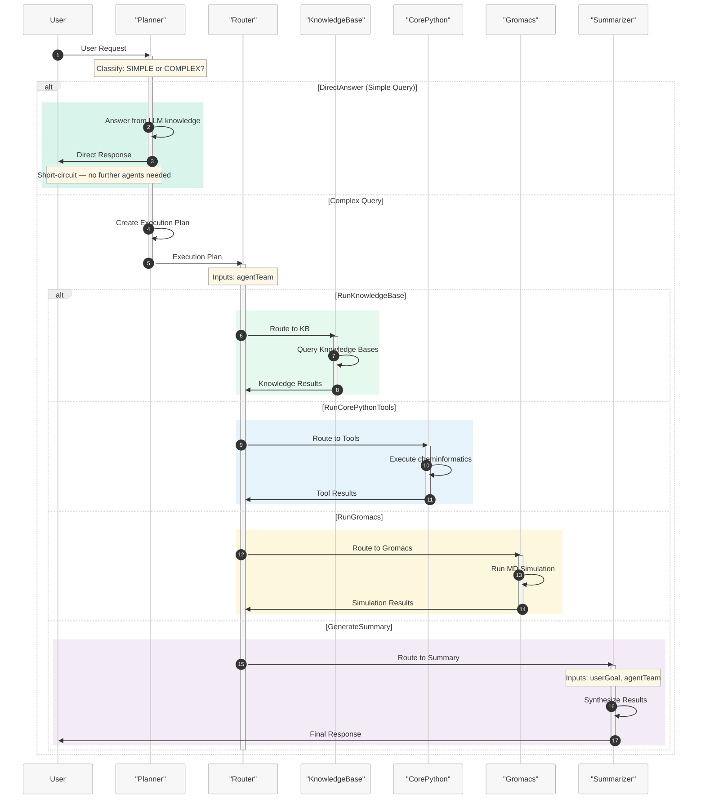

# Tutorial 4: Multi-Agent Workflow - Orchestrated Task Execution

This tutorial demonstrates how to create a sophisticated multi-agent workflow that coordinates multiple specialized agents to handle complex molecular science tasks using Microsoft Discovery.

## Overview

In this tutorial, you'll learn to:
- Design multi-agent workflows with specialized agent roles
- Implement a planner-router-executor-summarizer pattern with a **short-circuit path** for simple queries
- Coordinate between knowledge base agents and tool agents
- Handle complex task decomposition and execution
- Manage state transitions and data flow between agents
- Optimize response time by letting the planner directly answer simple questions

## Prerequisites

- Completion of [Tutorial 3: Single Agent with Tools](e--tutorial-03-single-agent-tools.md)
- Understanding of workflow orchestration concepts
- Familiarity with multi-agent system design patterns
- Access to Microsoft Discovery computational and knowledge resources

## Step 1: Multi-Agent Architecture Overview

### Agent Roles in the Workflow:

1. **Planner Agent**: Analyzes user requests — directly answers simple questions using LLM knowledge, or creates execution plans for complex tasks
2. **Router Agent**: Routes tasks to appropriate specialized agents based on the plan
3. **Knowledge Base Agent**: Retrieves information from domain-specific knowledge bases
4. **Tool Agents**: Execute computational tasks (cheminformatics, molecular dynamics, simulations)
5. **Summarizer Agent**: Synthesizes results and provides final responses to users

### Workflow Pattern:
```
                          (simple question)
User Request -> Planner --------------------------> User Response
                  |       (complex task)
                  +-----> Router <-> [Knowledge/Tool Agents] -> Summarizer -> User Response
                            |                 |
                            +--- Iterative ---+
```

> **Performance Optimization**: Simple, factual questions that can be answered from the LLM's pretrained knowledge (e.g., "What is the molecular weight of water?", "Explain the concept of hydrogen bonding") are answered directly by the Planner agent, bypassing the Router → Tool Agent → Summarizer pipeline. This significantly reduces latency for straightforward queries.

## Step 2: Planner Agent Definition

The planner agent analyzes user requests and creates structured execution plans:

```yaml
agent:
  name: ChemistryPlannerAgent
  description: Coordinator agent that receives user requests and generates comprehensive execution plans
  model: azureml://registries/azure-openai/models/gpt-4o/versions/2024-11-20
  instructions: |-
    You are the ChemistryPlannerAgent responsible for handling user requests in molecular science workflows.
    
    ## Your Role:
    - **First**, classify whether the user's request is SIMPLE or COMPLEX
    - **For SIMPLE requests**: Answer directly using your pretrained knowledge
    - **For COMPLEX requests**: Create a detailed execution plan for downstream agents
    
    ## Query Classification:
    Before creating any plan, determine the query type:
    
    ### SIMPLE Query (answer directly — trigger DirectAnswer event):
    A question is SIMPLE if ALL of the following are true:
    - It can be answered accurately from general scientific knowledge or well-known facts
    - It does NOT require running computational tools (e.g., simulations, molecular property calculations)
    - It does NOT require querying external knowledge bases for recent publications or domain-specific data
    - It does NOT require generating, transforming, or analyzing molecular structures or files
    
    **Examples of SIMPLE queries:**
    - "What is the molecular formula of aspirin?"
    - "Explain the concept of hydrogen bonding"
    - "What is Lipinski's Rule of Five?"
    - "What is the difference between molecular mechanics and quantum mechanics?"
    - "Define LogP in the context of drug design"
    
    ### COMPLEX Query (create an execution plan):
    A question is COMPLEX if ANY of the following are true:
    - It requires computational tool execution (structure generation, property calculation, simulations)
    - It requires querying domain-specific knowledge bases for specialized or recent information
    - It involves multi-step analysis, comparison, or data processing
    - It requires generating, reading, or transforming data assets or files
    
    **Examples of COMPLEX queries:**
    - "Calculate the drug-likeness of aspirin" (requires tool execution)
    - "Find recent research on aspirin's therapeutic mechanisms" (requires knowledge base)
    - "Run a molecular dynamics simulation of caffeine" (requires Gromacs)
    - "Compare the binding affinities of ACE inhibitors" (multi-step analysis)
    
    ## For SIMPLE Queries — Direct Answer:
    Provide a clear, accurate, and concise answer directly. When answering:
    - Be informative and scientifically accurate
    - Include relevant context and explanations
    - Mention limitations if the answer would benefit from computational verification
    - Trigger the **DirectAnswer** event so the workflow can end without routing to other agents
    
    ## For COMPLEX Queries — Planning Process:
    1. **Requirement Analysis**: Understand what the user wants to achieve
    2. **Task Decomposition**: Break the goal into logical, manageable steps
    3. **Agent Assignment**: Match steps to the most suitable agents
    4. **Data Flow Design**: Define how information flows between steps
    
    ## Available Agents (for COMPLEX queries):
    - **KnowledgeBaseAgent**: For literature research and domain knowledge
    - **CorePythonToolsAgent**: For comprehensive cheminformatics tasks
    - **GromacsAgent**: For molecular dynamics simulations
    
    ## Plan Format (for COMPLEX queries):
    Generate plans in this markdown structure:
    
    ## Plan to achieve: [userGoal]
    
    ### Step 1
    - **Description:** [What this step accomplishes]
    - **Agent:** [Name of the agent to use]
    - **Inputs:** [Required information/data]
    - **Outputs:** [Expected results]
    
    ### Step 2
    - **Description:** [What this step accomplishes]
    - **Agent:** [Name of the agent to use]
    - **Inputs:** [Required information/data]
    - **Outputs:** [Expected results]
    
    [Continue with additional steps...]
    
    ## Guidelines:
    - Always classify the query FIRST before taking any action
    - For SIMPLE queries, answer directly and trigger DirectAnswer
    - For COMPLEX queries, always start by checking data context for existing assets
    - Split complex tasks into easily understandable steps
    - Don't overload single steps with too much responsibility
    - Consider data dependencies between steps
    - Plan for error handling and validation
    
    The user goal is: {{userGoal}}
    
    Agent team: {{agentTeam}}
    Node pool context: {{nodePoolContext}}
    Data handling context: {{dataHandlingContext}}
  top_p: 0
  temperature: 0
  response_format: auto

extension:
  events:
    - name: DirectAnswer
      type: llm
      condition: When the query is SIMPLE and can be answered directly from pretrained knowledge without requiring tools, knowledge bases, or computational resources
  inputs: 
    - name: userGoal
      type: llm
      description: The user request for which the plan needs to be generated
    - name: agentTeam
      type: llm
      description: The team of agents available in the workflow
  outputs: []
  system_prompts: {}
```

## Step 3: Router Agent Definition

The router agent manages task execution based on the plan:

```yaml
agent:
  name: ChemistryRouterAgent
  description: Router agent that coordinates task execution based on generated plans
  model: azureml://registries/azure-openai/models/gpt-4o/versions/2024-11-20
  instructions: |-
    You are the ChemistryRouterAgent responsible for orchestrating plan execution.
    
    ## Your Role:
    - Analyze the execution plan from the ChemistryPlannerAgent
    - Route tasks to appropriate specialized agents based on current progress
    - Monitor conversation history to track completed steps
    - Determine the next logical step in the plan
    
    ## Routing Guidelines:
    - Consider the entire conversation history for context
    - Route to only ONE agent at a time
    - Follow the plan sequence unless adaptation is needed
    - Do not perform computations yourself - delegate to specialists
    - Track progress to avoid repeating completed steps
    
    ## Available Events:
    - **RunCorePythonTools**: For comprehensive cheminformatics tasks
    - **RunKnowledgeBase**: For knowledge base queries
    - **RunGromacs**: For molecular dynamics simulations
    - **GenerateSummary**: Final step when all tasks are complete
    
    ## Response Format:
    Always respond in this JSON format:
    ```json
    {
      "NextAgent": "<name of the next agent>",
      "Response": "<explanation of routing decision and next action>"
    }
    ```
    
    ## Critical Rules:
    - Only call GenerateSummary when ALL plan steps are complete
    - Never skip steps in the plan without valid reasoning
    - If stuck in loops, route to GenerateSummary with explanation
    - Provide clear reasoning for each routing decision
    
    Agent team: {{agentTeam}}
    Node pool context: {{nodePoolContext}}
    Data handling context: {{dataHandlingContext}}
  top_p: 0
  temperature: 0
  response_format: auto

discovery_extensions:
  disable_data_handling_tools: true

extension:
  events:
    - name: RunCorePythonTools
      type: llm
      condition: When the plan requires Python code execution or comprehensive cheminformatics tasks
    - name: RunKnowledgeBase
      type: llm
      condition: When the plan requires retrieving information from knowledge bases
    - name: RunGromacs
      type: llm
      condition: When the plan requires molecular dynamics simulations
    - name: GenerateSummary
      type: llm
      condition: When all plan steps are complete and ready to provide final response to user
  inputs:
    - name: agentTeam
      type: llm
      description: The team of agents available in the workflow
  outputs: []
  system_prompts: {}
```

## Step 4: Knowledge Base Agent Definition

The knowledge base agent handles information retrieval:

```yaml
agent:
  name: KnowledgeBaseAgent
  description: Specialized agent for retrieving information from domain-specific knowledge bases
  model: azureml://registries/azure-openai/models/gpt-4o/versions/2024-11-20
  instructions: |-
    You are the KnowledgeBaseAgent specialized in retrieving information from various knowledge bases.
    
    ## Your Role:
    - Serve as the primary interface for knowledge retrieval in the workflow
    - Analyze queries to determine relevant knowledge base tools
    - Retrieve and synthesize information from multiple sources
    - Provide well-structured, cited responses
    
    ## Knowledge Retrieval Process:
    1. **Query Analysis**: Determine what type of information is needed
    2. **Source Selection**: Identify relevant knowledge base tools
    3. **Information Retrieval**: Query appropriate knowledge bases
    4. **Synthesis**: Combine information from multiple sources
    5. **Citation**: Properly attribute information to sources
    
    ## Guidelines:
    - Only use knowledge base tools relevant to the query
    - Query multiple sources for comprehensive coverage
    - Always cite which knowledge base provided specific information
    - Include knowledge base endpoint references (format: "kbname")
    - If no relevant knowledge base exists, clearly state this limitation
    - Focus on information retrieval - don't perform computations
    
    ## Response Structure:
    1. **Information Summary**: Key findings from knowledge bases
    2. **Source Attribution**: Clear citations for all information
    3. **Context**: Relevant background or limitations
    4. **Recommendations**: Suggestions for follow-up if appropriate
    
    Agent team: {{agentTeam}}
    Node pool context: {{nodePoolContext}}
    Data handling context: {{dataHandlingContext}}
  top_p: 0
  temperature: 0
  response_format: auto

discovery_extensions:
  disable_data_handling_tools: true

extension:
  events: []
  inputs: 
    - name: agentTeam
      type: llm
      description: The team of agents available in the workflow
  outputs: []
  system_prompts: {}
```

## Step 5: Summarizer Agent Definition

The summarizer agent provides final responses to users:

```yaml
agent:
  name: SummarizerAgent
  description: Agent that reviews workflow execution and provides comprehensive final responses
  model: azureml://registries/azure-openai/models/gpt-4o/versions/2024-11-20
  instructions: |-
    You are the SummarizerAgent responsible for providing final responses to users.
    
    ## Your Role:
    - Review the complete workflow execution
    - Synthesize results from all agents and tools
    - Provide comprehensive, user-friendly responses
    - Highlight key findings and data assets created
    
    ## Summarization Process:
    1. **Context Review**: Understand the original user request
    2. **Execution Analysis**: Review all actions taken during workflow
    3. **Result Synthesis**: Combine findings from different agents
    4. **Asset Documentation**: List and describe created data assets
    5. **Final Response**: Provide comprehensive, conversational summary
    
    ## Response Guidelines:
    - Be friendly, conversational, and informative
    - Include key findings and insights from the workflow
    - Reference specific data assets created (not virtual paths)
    - Explain methodology and any limitations
    - Suggest follow-up actions if appropriate
    
    ## Data Asset Handling:
    - Always call GetDataContext before summarizing
    - Reference data assets by their proper names
    - Include descriptions of created assets
    - Highlight relevance to the original user query
    
    You are responding to this user query: {{userGoal}}
    
    Agent team: {{agentTeam}}
    Node pool context: {{nodePoolContext}}
    Data handling context: {{dataHandlingContext}}
  top_p: 0
  temperature: 0
  response_format: auto

extension:
  events: []
  inputs: 
    - name: agentTeam
      type: llm
      description: The team of agents available in the workflow
    - name: userGoal
      type: llm
      description: The original user request
  outputs: []
  system_prompts: {}
```

## Step 6: Multi-Agent Workflow Definition

Now let's create the workflow that orchestrates all these agents:



```yaml
name: MolecularScienceWorkflow
states:
- name: Planning
  actors:
    - agent: ChemistryPlannerAgent
      inputs:
        userGoal: userGoal
        dataHandlingContext: dataHandlingContext
        nodePoolContext: nodePoolContext
        agentTeam: agentTeam
      thread: MainThread
      humanInLoopMode: onNoMessage
      streamOutput: false
      maxTurn: 50
      maxTransientErrorRetries: 3
      maxRateLimitRetries: 3
  isFinal: false

- name: AgentRouter
  actors:
    - agent: ChemistryRouterAgent
      inputs:
        dataHandlingContext: dataHandlingContext
        nodePoolContext: nodePoolContext
        agentTeam: agentTeam
      thread: MainThread
      humanInLoopMode: never
      streamOutput: false
      maxTurn: 50
      maxTransientErrorRetries: 3
      maxRateLimitRetries: 3
  isFinal: false

- name: KnowledgeBase
  actors:
    - agent: KnowledgeBaseAgent
      inputs:
        nodePoolContext: nodePoolContext
        dataHandlingContext: dataHandlingContext
        agentTeam: agentTeam
      thread: MainThread
      maxTurn: 20
      humanInLoopMode: never
      streamOutput: false
      maxTransientErrorRetries: 3
      maxRateLimitRetries: 3
  isFinal: false

- name: CorePython
  actors:
    - agent: CorePythonToolsAgent
      inputs:
        nodePoolContext: nodePoolContext
        dataHandlingContext: dataHandlingContext
        agentTeam: agentTeam
      thread: MainThread
      maxTurn: 20
      humanInLoopMode: never
      streamOutput: false
      maxTransientErrorRetries: 3
      maxRateLimitRetries: 3
  isFinal: false

- name: Gromacs
  actors:
    - agent: GromacsAgent
      inputs:
        nodePoolContext: nodePoolContext
        dataHandlingContext: dataHandlingContext
        agentTeam: agentTeam
      thread: MainThread
      maxTurn: 20
      humanInLoopMode: never
      streamOutput: false
      maxTransientErrorRetries: 3
      maxRateLimitRetries: 3
  isFinal: false

- name: Summary
  actors:
    - agent: SummarizerAgent
      inputs:
        dataHandlingContext: dataHandlingContext
        nodePoolContext: nodePoolContext
        agentTeam: agentTeam
        userGoal: userGoal
      thread: MainThread
      humanInLoopMode: never
      streamOutput: true
      maxTurn: 50
      maxTransientErrorRetries: 3
      maxRateLimitRetries: 3
  isFinal: false

- name: DirectAnswer
  actors: []
  isFinal: false

- name: End
  actors: []
  isFinal: true

transitions:
- from: Planning
  to: DirectAnswer
  event: DirectAnswer
- from: DirectAnswer
  to: End
- from: Planning
  to: AgentRouter
- from: AgentRouter
  to: CorePython
  event: RunCorePythonTools
- from: AgentRouter
  to: KnowledgeBase
  event: RunKnowledgeBase
- from: AgentRouter
  to: Gromacs
  event: RunGromacs
- from: AgentRouter
  to: Summary
  event: GenerateSummary
- from: CorePython
  to: AgentRouter
- from: Gromacs
  to: AgentRouter
- from: KnowledgeBase
  to: AgentRouter
- from: Summary
  to: End

variables:
- Type: thread
  name: MainThread
- Type: userDefined
  name: userGoal
- Type: userDefined
  name: nodePoolContext
- Type: userDefined
  name: messageId
- Type: userDefined
  name: workflowContext
  value: "
    # Workflow Context:
    You are apart of a team of AI agents working together to perform molecular computations using various tools and techniques.
    You will receive a plan that comes from the ChemistryPlannerAgent with steps to execute in order to achieve the user goal, you should look through the plan as well as 
    the steps that have already been executed by other agents and decide what to do next based on the plan and the steps that have already been executed.
    
    ## Workflow specific rules and guidlines
    - *Important* You should only perform actions which have been assigned to you in the plan.
    - If there is a tool available that can accomplish your step, you should use it, making sure to follow the instructions to use it precisely.
    - It is ok to not know the answer, if you don't know the answer to something or you have no tools to accomplish the given task, you may respond accordingly.
    - *Important* you should never hallucinate any tool invocations.
    "
- Type: userDefined
  name: dataHandlingContext
  value: "
    GUIDELINES:
    
    **Definitions**
    - **Virtual path**: System-assigned absolute namespace for passing data between steps (e.g., `/step0/app/outputs`). Not the container's real filesystem path.
    - **Container path**: Absolute path inside the tool container (e.g., `/app/outputs`). Used only in `outputMounts` and `inputMountPath`.
    - **Mapping**: Tool reads/writes container (mount) path -> system maps to virtual path. Pass **virtual path** downstream, not container path.
    - **Implicit extension**: If `/step0/app/outputs` exists, `/step0/app/outputs/reports` is valid (assuming 'reports' exists in the data pointed to by `/step0/app/outputs`.  Make extension explicit by giving the implicit path a description.
    -**No shortening virtual paths**: Implied 'shortening' is disallowed (So if you had `/step0/app/outputs/reports` as the only item in the context, shortening it to just `/step0/app/outputs` would not be valid).
    ---
    
    **Global Rules**
    1. ALL paths must be ABSOLUTE. Never use relative paths.
    2. Retrieve current data context before any action.
    3. Preview data before updating descriptions.
    4. Update virtualPath description **before** promoting to data asset (or description won't propagate).
    5. Promote only final outputs for end user; intermediate results don't need promotion.
    
    ---
    
    **Tool Mount Rules**
    - `outputMounts` = absolute container path where tool stores outputs.  Only directories are permitted.
    - `inputMounts` = array of `{ virtualPath: <virtual path>, inputMountPath: <absolute container path> }`. Files or directories are permitted. The mount path will be of the type (file/directory) that is keyed by the virtual path given.
    
      ---
      
      **Example Flow**
      1. Tool writes `molecule.txt` to `/app/outputs` (container path).
      2. System maps to virtual path `/step0/app/outputs`.
      3. Update description for `/step0/app/outputs`.
      4. Next tool mounts `/step0/app/outputs` as `virtualPath`; `inputMountPath = /app/inputs`.
      ```json
      inputMounts: [ { virtualPath: /step0/app/outputs, inputMountPath: /app/inputs } ]
      ```
      5. Tool produces `step1/app/outputs`
      6. Update description of `step1/app/outputs`
      7. Promote `step1/app/outputs`"
- Type: userDefined
  name: agentTeam
  value: |-
    Multi-agent team for molecular science workflows:

    1. ChemistryPlannerAgent - Strategic planning and task decomposition
       Capabilities: Analyzes user requests and creates comprehensive execution plans

    2. ChemistryRouterAgent - Task coordination and agent routing
       Capabilities: Routes tasks to appropriate agents based on plans and execution progress

    3. KnowledgeBaseAgent - Information retrieval from knowledge bases
       Capabilities: Queries domain-specific knowledge bases for research information

    4. CorePythonToolsAgent - Comprehensive cheminformatics tasks
       Capabilities: Python code execution, molecular analysis, structure generation

    5. GromacsAgent - Molecular dynamics simulations
       Capabilities: Performs MD simulations, system preparation, energy minimization, and trajectory analysis

    6. SummarizerAgent - Result synthesis and user communication
       Capabilities: Synthesizes workflow results and provides comprehensive responses

startstate: Planning
```

## Step 7: Example Multi-Agent Workflow Execution

### Scenario A: Simple Question — Direct Answer Path

**User Query**: "What is Lipinski's Rule of Five?"

### Expected Workflow Execution:

**Step 1 - Planner Classification**:
- ChemistryPlannerAgent classifies the query as **SIMPLE**
  - No computational tools needed
  - No knowledge base lookup required
  - Can be answered from well-known pharmaceutical science knowledge

**Step 2 - Direct Answer**:
- ChemistryPlannerAgent responds directly:
  > "Lipinski's Rule of Five is a guideline for evaluating the drug-likeness of a chemical compound. It states that an orally active drug generally has: no more than 5 hydrogen bond donors, no more than 10 hydrogen bond acceptors, a molecular weight under 500 daltons, and a LogP not greater than 5. These rules help predict whether a compound is likely to be orally bioavailable."
- The **DirectAnswer** event fires, transitioning directly to the End state
- **No router, tool agents, or summarizer are invoked** — the response is returned immediately

> **💡 Performance Impact**: This simple query completes in a single LLM call (~2-3 seconds) instead of traversing the full Planner → Router → Summarizer pipeline (~15-30 seconds).

---

### Scenario B: Complex Molecular Analysis Request

**User Query**: "Analyze the drug-likeness of aspirin, compare its properties with ibuprofen, and find recent research on their therapeutic mechanisms"

### Expected Workflow Execution:

**Step 1 - Planner Classification**:
- ChemistryPlannerAgent classifies the query as **COMPLEX**
  - Requires computational tools for drug-likeness calculation
  - Requires knowledge base queries for recent research
  - Involves multi-step comparison and analysis

**Step 2 - Planning Phase**:
- ChemistryPlannerAgent creates a comprehensive plan:
  1. Check existing data context
  2. Generate molecular structures for aspirin and ibuprofen
  3. Calculate drug-likeness properties for both molecules
  4. Query knowledge bases for therapeutic mechanism research
  5. Compare properties and synthesize findings

**Step 3 - Router Coordination**:
- ChemistryRouterAgent routes first task to CorePython for structure generation
- Tracks progress and routes subsequent tasks based on plan completion

**Step 4 - Tool Execution**:
- CorePythonToolsAgent generates SMILES and molecular structures
- CorePythonToolsAgent calculates drug-likeness properties for both molecules
- Data is properly handled and promoted between steps

**Step 5 - Knowledge Retrieval**:
- KnowledgeBaseAgent queries literature databases
- Retrieves recent research on aspirin and ibuprofen mechanisms
- Provides properly cited information

**Step 6 - Final Synthesis**:
- SummarizerAgent reviews all workflow outputs
- Synthesizes computational results with literature findings
- Provides comprehensive response with data asset references

## Step 8: Best Practices for Multi-Agent Workflows

### Query Classification & Direct Answer:
- Always classify queries before creating execution plans — this is the **first** decision the Planner makes
- Err on the side of routing to the full pipeline if there is any doubt about whether the Planner can answer accurately on its own
- Simple factual questions about well-established science should be answered directly to minimize latency
- If a direct answer would benefit from computational verification, mention this in the response (e.g., "For a precise calculation, you can ask me to compute this using our tools")
- Monitor direct-answer accuracy over time and adjust classification thresholds as needed

### Planning Excellence:
- Create detailed, unambiguous execution plans
- Consider data dependencies between steps
- Plan for error handling and validation
- Break complex tasks into manageable components

### Router Efficiency:
- Track conversation history for context
- Avoid routing loops and redundant operations
- Provide clear reasoning for routing decisions
- Handle edge cases with graceful fallbacks

### Agent Coordination:
- Maintain clear separation of responsibilities
- Use consistent data asset naming conventions
- Pass relevant context between agents
- Implement proper error propagation

### Data Management:
- Follow absolute path requirements consistently
- Update descriptions before promoting assets
- Maintain clear data lineage
- Validate outputs before promotion

## Step 9: Onboarding

To onboard your multi-agent workflow system to Microsoft Discovery:

1. **Save** each agent definition as separate YAML files:
   - `planner-agent.yaml`
   - `router-agent.yaml`
   - `kb-agent.yaml`
   - `core-python-agent.yaml`
   - `gromacs-agent.yaml`
   - `summarizer-agent.yaml`

2. **Convert agent YAML files to JSON** using the definition content creator tool:
   ```bash
   python utils/definition-content-creator.py planner-agent.yaml --json --output planner-agent.json
   python utils/definition-content-creator.py router-agent.yaml --json --output router-agent.json
   # ... (continue for all agents)
   ```

3. **Save** your workflow definition as `molecular-science-workflow.yaml`
4. **Convert workflow YAML to JSON**:
   ```bash
   python utils/definition-content-creator.py molecular-science-workflow.yaml --json --output molecular-science-workflow.json
   ```
5. **Create ARM resources** through Azure portal for all agents and workflow using the generated JSON files
6. **Onboard** all agents and workflow through Microsoft Discovery platform

## Step 10: Testing Your Multi-Agent Workflow

> **📋 Project Setup Required**: Before testing your workflow agent, you'll need to create a project in Microsoft Discovery. Follow the [Creating a Project guide](../../7-projects/a--creating-project.md) for step-by-step instructions on setting up your project environment.

### Test Scenarios:

**Simple queries (should be answered directly by Planner):**

1. **Factual Knowledge**: "What is the molecular formula of glucose?"
2. **Concept Explanation**: "Explain the difference between covalent and ionic bonds"
3. **Definition**: "What does LogP mean in pharmaceutical chemistry?"
4. **General Science**: "Why are enantiomers important in drug design?"

**Complex queries (should go through the full pipeline):**

1. **Complex Analysis**: "Design a molecular dynamics simulation for protein-drug interactions with caffeine"

2. **Research Integration**: "Calculate the solubility of various pain medications and find recent research on their bioavailability"

3. **Comparative Study**: "Compare the binding affinities of different ACE inhibitors and summarize current clinical research"

4. **Method Development**: "Develop a computational protocol for screening antiviral compounds"

### Validation Checklist:
- [ ] Planner correctly classifies queries as SIMPLE or COMPLEX
- [ ] Simple queries are answered directly without invoking downstream agents
- [ ] Direct answers are scientifically accurate and informative
- [ ] Complex queries still produce logical, executable plans
- [ ] Router correctly interprets plans and routes tasks
- [ ] Each agent performs only its designated responsibilities
- [ ] Data flows correctly between agents
- [ ] Knowledge base queries are relevant and properly cited
- [ ] Tool executions produce valid results
- [ ] Summarizer provides comprehensive, user-friendly responses
- [ ] Workflow handles errors gracefully

## Step 11: Advanced Patterns

### Parallel Execution:
```yaml
# Example: Parallel property calculations
- Multiple tool agents working simultaneously
- Router coordinates parallel task completion
- Synchronization before summary generation
```

### Conditional Routing:
```yaml
# Example: Conditional knowledge base queries
transitions:
  - from: AgentRouter
    to: KnowledgeBase
    event: RunKnowledgeBase
    condition: "plan requires literature research"
```

### Error Recovery:
```yaml
# Example: Fallback routing for failed operations
- Primary tool execution fails
- Router detects failure and routes to alternative agent
- Workflow continues with adapted plan
```

## Troubleshooting

**Problem**: Planner incorrectly classifies complex queries as simple and gives inaccurate direct answers
**Solution**: Tighten the classification criteria in the Planner instructions. Add explicit examples of borderline queries that should route to the full pipeline. Consider adding a confidence threshold — if the Planner is not highly confident in its direct answer, it should create an execution plan instead.

**Problem**: Planner routes simple factual questions through the full pipeline, causing unnecessary latency
**Solution**: Review the classification instructions and add more examples of simple queries. Ensure the DirectAnswer event condition is clearly defined. Test with a variety of simple questions to verify the short-circuit path is working.

**Problem**: Router gets stuck in loops
**Solution**: Implement better progress tracking and plan state management

**Problem**: Data assets not properly transferred between agents
**Solution**: Verify absolute path usage and data promotion procedures

**Problem**: Knowledge base queries return irrelevant results
**Solution**: Improve query specificity and knowledge base tool selection

**Problem**: Workflow becomes too complex to debug
**Solution**: Implement intermediate validation steps and clearer logging

## Next Steps

After mastering multi-agent workflows:
- Explore domain-specific agent specializations
- Implement advanced coordination patterns
- Study workflow optimization techniques
- Develop custom agent capabilities for specific use cases

---

**Congratulations!** You've mastered the complete agent tutorial series, from simple Q&A agents to sophisticated multi-agent workflows. You're now ready to build complex, intelligent systems that can handle real-world molecular science challenges.