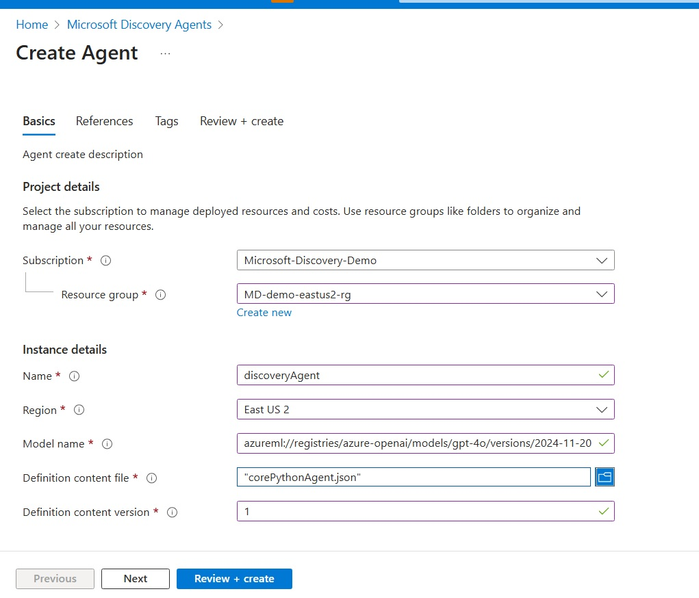
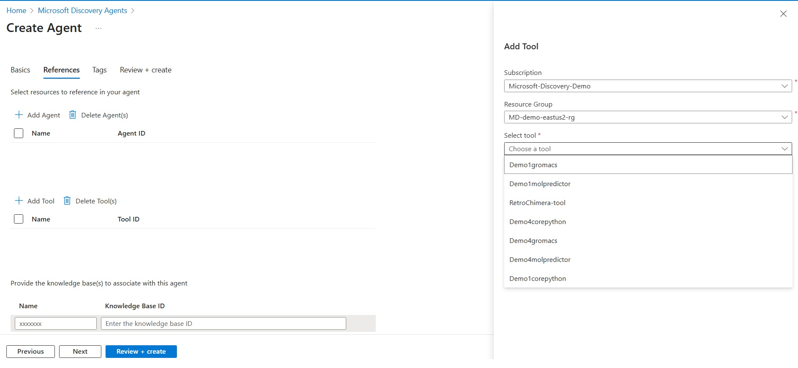
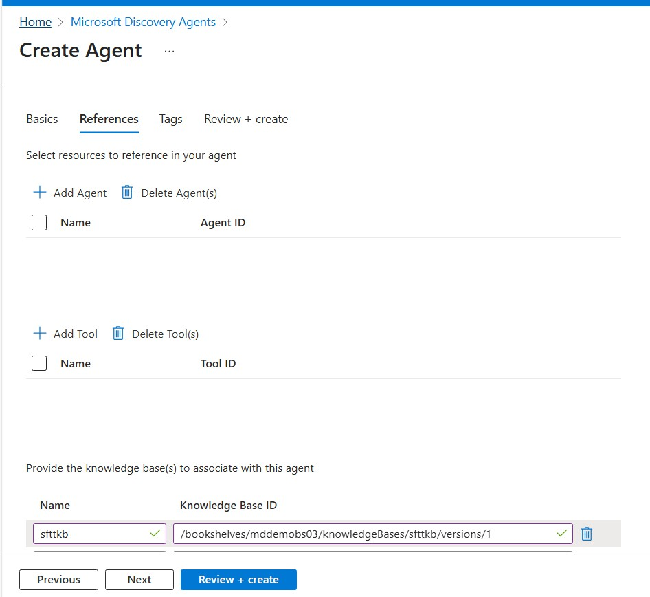
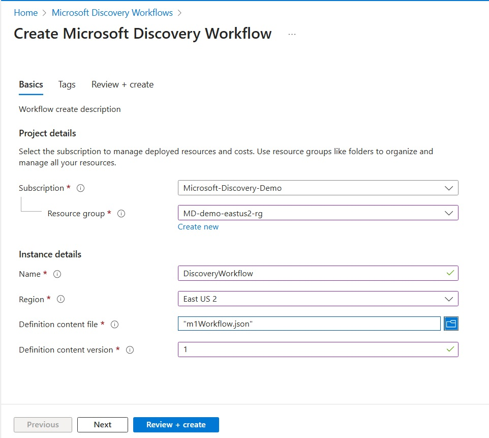

# Agent Deployment Guide for Microsoft Discovery

This comprehensive guide walks you through deploying intelligent agents and workflows in Microsoft Discovery, covering both Azure Portal experience and ARM template deployment approaches. Agents in Microsoft Discovery are autonomous AI systems that leverage large language models to perform specific scientific research tasks, integrate with tools and models, and orchestrate complex multi-step workflows.

## Agent Deployment Overview

Microsoft Discovery agents are autonomous intelligent systems powered by large language models that can perform specific tasks, integrate with scientific tools and models, and collaborate with other agents to complete complex research workflows.

### Agent Types Supported

Microsoft Discovery supports several types of agents:

- **Specialized Research Agents**: Perform individual tasks and integrate with specific scientific tools or models (e.g., chemistry analysis, molecular dynamics)
- **Workflow Agents**: Orchestrate multiple agents to complete complex multi-step research processes
- **Other functional Agents**: handle the overall planning, resource allocation, and decision-making processes that determine which agents should be activated and in what sequence

### Agent vs Workflow Resources

- **Agents**: Individual AI entities that perform specific functions using tools and models. Both Scientific agents and other functional agents lie under this category
- **Workflows**: Special type of agents that orchestrate the execution of multiple agents to complete complex tasks, defined with state machines and actor coordination

> **Assumption**: This guide assumes your agent and workflow definitions are already created following the [Publisher Guide for Agents](agents-publishing/). If your definitions are not yet created, please follow that guide first to understand agent specification requirements.

## Prerequisites

Before deploying agents in Microsoft Discovery, ensure you have the following:

### 1. Platform Prerequisites

- **Active Azure subscription** with Microsoft Discovery resource provider registered
- **Sufficient permissions** to create and manage Microsoft Discovery resources

### 2. Agent Definition Requirements

- **Agent definition files** created in YAML format following the specification schema
- **Model access** configured for the AI models your agents will use (typically Azure OpenAI models)
- **Tool dependencies** identified and deployed (if agents reference specific tools)
- **Workflow orchestration** defined (for workflow agents with multi-agent coordination)

### 3. Model and Tool Dependencies

- **AI Models**: Access to appropriate language models (Azure OpenAI, Azure ML models)
- **Tools**: Pre-deployed tool resources that agents will utilize
- **Environment Variables**: Configuration for external service integrations
- **Compute Resources**: Sufficient quota for agent execution and tool utilization

### 4. Resource Group Organization

Agents and related resources can be organized in resource groups following these patterns:

- **Development**: `contoso-discovery-dev-rg`
- **Testing**: `contoso-discovery-test-rg`  
- **Production**: `contoso-discovery-prod-rg`

Each resource group should contain the complete set of related resources for that environment:

```text
contoso-discovery-prod-rg/
├── contoso-chemistry-workspace-prod
├── chemistry-model-v1-prod
├── chemistry-tool-client-prod
├── chemistry-agent-prod
├── chemistry-workflow-prod
└── supporting-infrastructure
```

### 5. Azure Quota Requirements

Ensure sufficient quota in your target region for:

- **Azure OpenAI quota** for language model inference
- **VM SKUs** for tool execution and compute requirements
- **Container compute resources** for agent runtime environments
- See [Quotas and Limits](../../5-management/resource-limits.md) for detailed requirements

## Agent Deployment via Azure Portal

### Step 1: Navigate to Agent Creation

1. **Sign in to the Azure Portal**
   - Navigate to [https://portal.azure.com](https://portal.azure.com)
   - Authenticate with your Azure credentials

2. **Access Microsoft Discovery Agents**
   - In the Azure Portal search bar, type "Microsoft Discovery Agents"
   - Select **Microsoft Discovery Agents** from the search results
   - Click **"Create"** to start the agent deployment process

### Step 2: Configure Basic Agent Settings

Configure the fundamental agent properties:

- **Subscription**: Select the Azure subscription containing your Discovery workspace
- **Resource Group**: Choose the resource group for organizing your agent resources
  - **Recommended**: Use environment-specific resource groups (dev, test, prod)
- **Agent Name**: Enter a descriptive name for your agent resource
  - **Format**: `{purpose}-{agent-type}-{version}` (e.g., `chemistry-analyzer-agent-v1`)
- **Region**: Select the Azure region where your workspace is deployed
  - **Important**: Must match your workspace region for optimal performance

### Step 3: Configure Model Settings

- **Model Name**: Specify the AI model for your agent
  `azureml://registries/azure-openai/models/gpt-4o/versions/2024-11-20`

### Step 4: Upload Agent Definition

1. **Prepare Agent Definition File**
   - Create a YAML file defining your agent configuration
   - **For Specialized Research Agents**, use this template structure:

   ```yaml
   agent:
     name: chemistry-analysis-agent
     description: Agent specialized in chemical analysis and molecular properties
     model: azureml://registries/azure-openai/models/gpt-4o/versions/2024-11-20
     instructions: |-
       You are an expert chemistry analysis agent with deep knowledge of molecular properties.
       
       Your capabilities include:
       - Molecular structure analysis
       - Chemical property calculations
       - Integration with cheminformatics tools and molecular analysis libraries
       
       When given a task:
       1. Analyze the chemical context and requirements
       2. Select appropriate computational tools
       3. Execute the analysis workflow
       4. Provide clear, scientific explanations of results
       
       Node pool context: 
       {{nodePoolContext}}
       
       Data handling context: 
       {{dataHandlingContext}}
     top_p: 0
     temperature: 0
   ```

   - **For Planning Agents**, use this template structure:

   ```yaml
   agent:
     name: science-planner-agent
     description: Agent that creates comprehensive research plans and coordinates workflows
     model: azureml://registries/azure-openai/models/gpt-4o/versions/2024-11-20
     instructions: |-
       You are a scientific planning agent responsible for breaking down complex research goals into actionable steps.
       
       Your responsibilities:
       - Analyze user research objectives
       - Create detailed experimental plans
       - Identify required tools and resources
       - Coordinate with specialist agents
       - Monitor progress and adapt plans
       
       Node pool context: 
       {{nodePoolContext}}
       
       Data handling context: 
       {{dataHandlingContext}}
     top_p: 0.1
     temperature: 0.2
   ```

2. **Convert YAML to JSON**

   Use the utility for [definition content creator](../../utils/README.md) to generate a JSON file from your YAML definition.

3. **Upload Definition**
   - **Definition Content File**: Upload your agent definition JSON file (converted from YAML)
   - **Definition Content Version**: Enter `2025-05-15-preview`

### Step 5: Configure Tool References (Optional)

If your agent references specific tools:

1. **Add Tool References**
   - In the References tab, add tool resources your agent will use
   - Click on Add tool, You can select the tool from a drop down list with 

2. **Configure Tool Integration**
   - Ensure your agent definition includes instructions for tool usage
   - Verify tool permissions and access configurations

### Step 6: Configure Knowledge Base References (Optional)

If your agent needs to access domain-specific knowledge bases:

1. **Add Knowledge Base References**
   - In the References tab, add knowledge base resources your agent will use
   - Click on **Add knowledge base** 

2. **Configure Knowledge Base Details**
   - **Knowledge Base ID**: Enter the knowledge base reference ID using the format:
     ```
     /bookshelves/{bookshelfName}/knowledgeBases/{knowledgeBaseName}/versions/{version}
     ```
     For example: `/bookshelves/chemistry-research/knowledgeBases/molecular-properties/versions/v1.0`
   
   - **Name**: Provide a descriptive name for the knowledge base reference
     For example: `chemistry-knowledge-base` or `molecular-properties-kb`

3. **Knowledge Base Integration Guidelines**
   - Ensure your agent definition includes instructions for knowledge base usage
   - Verify the knowledge base is deployed and accessible in your workspace
   - Test knowledge retrieval functionality during agent validation

> **Note**: Currently, knowledge base configuration requires manual entry of the reference ID and name. Dropdown-based selection from available knowledge bases will be provided in future releases.

### Step 7: Review and Create

1. **Review Configuration**
   - Verify all agent settings are correct
   - Confirm model access and tools selected
   - Check region and subscription alignment

2. **Create Agent Resource**
   - Click **"Review + create"**
   - Review the terms and conditions
   - Click **"Create"** to deploy the agent resource

The agent deployment typically takes 5-10 minutes depending on the complexity of the definition and tool dependencies.

## Workflow Deployment via Azure Portal

Workflows are special types of agents that orchestrate multiple agents to complete complex multi-step tasks.

### Step 1: Navigate to Workflow Creation

1. **Access Microsoft Discovery Workflows**
   - In the Azure Portal search bar, type "Microsoft Discovery Workflows"
   - Select **Microsoft Discovery Workflows** from the search results
   - Click **"Create"** to start the workflow deployment process

### Step 2: Configure Basic Workflow Settings

Configure the fundamental workflow properties:

- **Subscription**: Select the Azure subscription containing your Discovery workspace
- **Resource Group**: Choose the resource group for organizing your workflow resources
- **Workflow Name**: Enter a descriptive name for your workflow resource
  - **Format**: `{research-area}-{workflow-purpose}-{version}` (e.g., `bio-research-workflow-v1`)
- **Region**: Select the Azure region matching your workspace

### Step 3: Upload Workflow Definition

> **Note:** In private preview, the platform support workflows where states have a single actor, human in the loop mode is 'never', and streaming mode is false.

1. **Prepare Workflow Definition File**
   - Create a YAML file defining your workflow orchestration
   - **For Multi-Agent Workflows**, use this template structure:

   ```yaml
   name: BiologyResearchWorkflow
   states:
   - name: Planning
     actors:
       - agent: sciencePlannerAgent
     isFinal: false
   - name: AgentRouter
     actors:
       - agent: scienceRouterAgent
     isFinal: false
   - name: Execution
     actors:
       - agent: gromacsAgent
     isFinal: false
   - name: Summary
     actors:
       - agent: summarizerAgent
     isFinal: false
   - name: End
     actors: []
     isFinal: true

   transitions:
   - from: Planning
     to: AgentRouter
   - from: AgentRouter
     to: Execution
     event: RunExecution
   - from: AgentRouter
     to: Summary
     event: GenerateSummary
   - from: Execution
     to: AgentRouter
   - from: Summary
     to: End

   variables:
   - Type: thread
     name: MainThread
   - Type: userDefined
     name: userGoal
   - Type: userDefined
     name: nodePoolContext
   - Type: userDefined
     name: messageId
   - Type: userDefined
     name: dataHandlingContext
     value: |-
       In order to interact with data (inputs, outputs) you will utilize the following tools and guidelines for data lifecycle support.
   - Type: userDefined
     name: workflowContext
     value: "You are part of a team of AI agents working together to perform biological research computations using various tools and techniques."
   - Type: userDefined
     name: agentTeam
     value: |-
       Here are the list of agents and their descriptions:
       1. sciencePlannerAgent - Creates comprehensive research plans and coordinates workflows
       2. scienceRouterAgent - Makes intelligent routing decisions based on plan and current progress
       3. gromacsAgent - Performs molecular dynamics simulations and analyses
       4. summarizerAgent - Summarizes results and provides final reports

   startstate: Planning
   id: wf_biology_research_example
   ```

2. **Convert and Upload**
   - Convert YAML to JSON using the [definition content creator](../../utils/README.md)
   - Upload the JSON definition file
   - Set Definition Content version, e.g.`2025-05-15-preview`

### Step 4: Configure Agent Dependencies

1. **Reference Required Agents**
   - Ensure all agents referenced in the workflow are already deployed
   - Verify agent resource IDs and availability
   - Configure proper permissions for agent coordination

### Step 5: Review and Create Workflow

1. **Validate Workflow Configuration**
   - Review state transitions and actor configurations
   - Confirm agent dependencies are satisfied
   - Check workflow logic and execution paths

2. **Create Workflow Resource**
   - Click **"Review + create"**
   - Review the terms and conditions
   - Click **"Create"** to deploy the workflow resource

## Agent Deployment via ARM Templates

For automated deployments and infrastructure-as-code scenarios, use the Microsoft Discovery ARM templates.

### ARM Template Overview

The agents ARM template creates agent resources with proper model and tool dependencies.

The ARM template deployment process creates configured agent resources:

```text
1. Agent Resource (Microsoft.Discovery/agents)
   ├── Model Integration: References specified AI models
   ├── Tool Dependencies: Links to required tool resources
   └── Definition Content: Parsed agent behavior and instructions

2. Workflow Resource (Microsoft.Discovery/workflows)
   ├── Agent Orchestration: Coordinates execution of multiple agents
   ├── State Machine Logic: Defines workflow states, transitions, and actors
   └── Definition Content: Parsed workflow orchestration and logic
```

### Infrastructure Deployment

For comprehensive infrastructure deployment instructions, use the Azure CLI or create custom ARM templates based on your requirements.

This approach allows you to deploy both Agents and Workflow resources as needed.

## Post-Deployment Configuration

### 1. Verify Resource Creation

After deployment, verify all resources are created successfully:

```bash
# List agent resources
az resource list --resource-type "Microsoft.Discovery/agents" --output table

# List workflow resources
az resource list --resource-type "Microsoft.Discovery/workflows" --output table
```

## Next Steps

After successfully deploying your agents:

1. **[Create Projects](../7-projects/)** - Organize research using your deployed agents
2. **[Run Investigations](../8-investigations/)** - Test agent functionality in research workflows

## Related Documentation

- [Microsoft Discovery Agents Overview](../../3-concepts/agents.md)
- [Publisher Guide for Agents](agents-publishing/)
