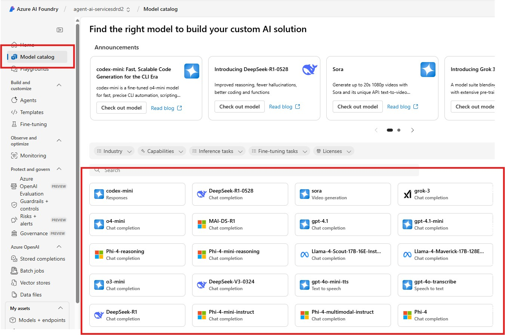
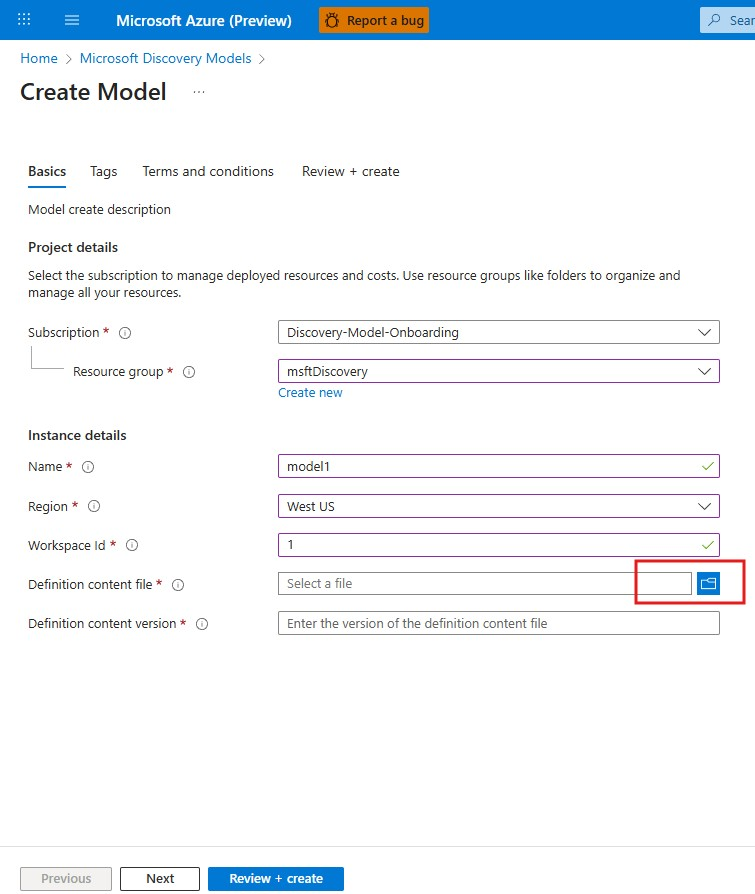

# Use Microsoft models in Microsoft Discovery

## Introduction and Purpose

The Microsoft Discovery platform empowers customers to integrate machine learning (ML) models that are available in the Azure ML catalog into a secure environment for scientific investigations and research. This guide provides a step-by-step process for registering a Microsoft AI/ML model available in the ML Catalog with Microsoft Discovery.

By following this guide, customers can:

* Seamlessly register models from the Azure ML Catalog for use within Microsoft Discovery.

* Leverage Microsoft models to enhance the effectiveness and outcomes of scientific research.

## Prerequisite

The AI/ML model must be available in the Azure ML/ Azure Foundry catalog. If the model in not available in the catalog, you can follow the instuctions in the [***Bring Your Own (BYO) models to Microsoft Discovery***](../../byo-models/bring-your-own-model.md) document to bring your own model to Microsoft Discovery



## Process Overview

The steps to bring Microsoft AI/ML model available in the ML Catalog into the Microsoft Discovery platform service are listed below: 

1. Create the following definition files

    **Modeldefinition.yaml**

```yaml
name: model1
description: Description of Model.
version: "1.0.0"
category: Machine Learning model
license: MIT
infra:
  - name: worker
    infra_type: maap
    image:
      model_id: azureml://registries/azureml/models/model1/versions/1
    compute:
      vm_skus: Standard_NC40ads_H100_v5
      pool_type: static
      pool_size: 1
```

2. **Convert YAML to JSON**

    Use the utility for [definition content creator](../../../../../utils/README.md) to generate a JSON file. The converted file would be Modeldefinition.json

3. Create the model ARM resource using the JSON definition file by following the steps below:

    1. Login to the Azure Portal and search for ***Microsoft Discovery Models***
    2. Click ***Create***
    3. Enter the required information
    4. Select the *Definition content file* (Modeldefinition.json file you created in the previous step)

    5. Create ***Review + create*** and then ***create***

4. Once the model ARM resource is created, please create a Model Tool Client by following the steps in the link in the "Next steps" section.

## Conclusion

By following the steps outlined in this document, customers can integrate their machine learning models into the ***Microsoft Discovery Platform*** environment, ensuring that the models are accessible for use within the platform.

## Next steps

Create the model client tool (action-based tool) by following the steps in this documents in this [folder.](../../../6-tools-models-agents/tools-publishing/) You can see a sample in this [folder.](../../../../6-solutions/tools-and-models/RetroChimera/)
