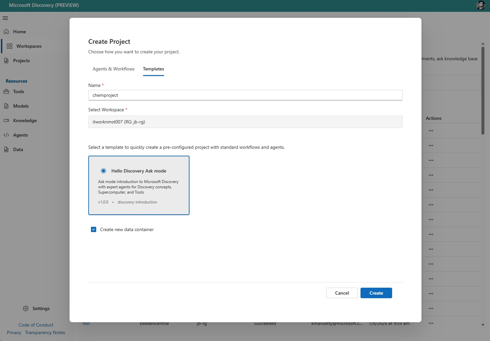
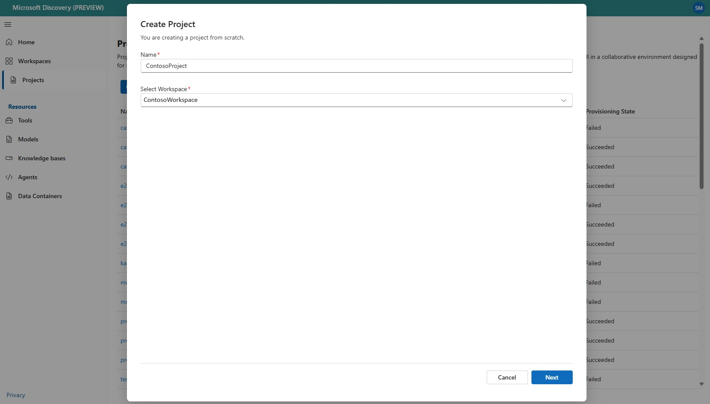
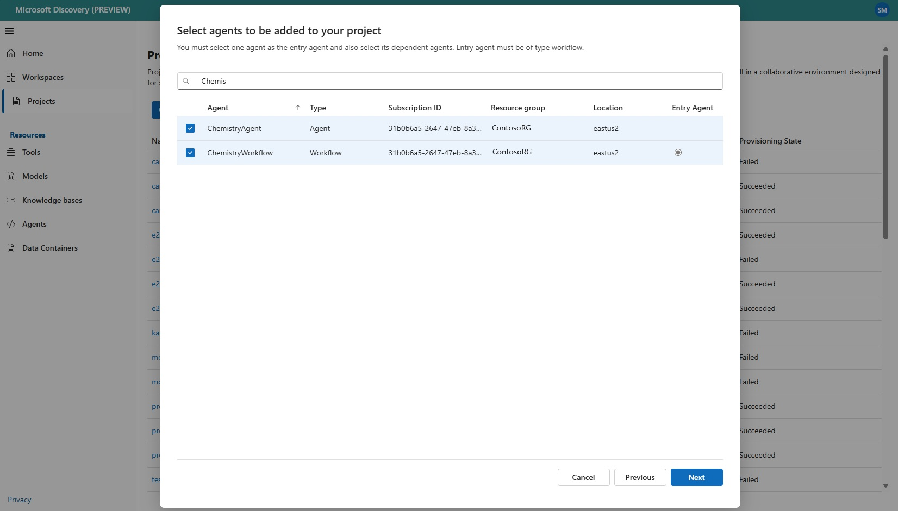

# Project Creation Guide for Microsoft Discovery

This comprehensive guide walks you through creating a project in Microsoft Discovery, which helps you organize and manage scientific investigations within a workspace.

## What is a Microsoft Discovery Project?

A Microsoft Discovery project enables you to:

- Organize and manage scientific investigations
- Run scientific experiments, analyze data, apply AI models, and track progress, all in a collaborative environment designed for scientific discovery
- Serves as a functional boundary for your agents, data containers, tools, and models.

## Prerequisites

Before creating a project, ensure you have completed the following steps:

- Create a Microsoft Discovery workspace
- Create agents and workflows
- Create data containers
- You need to have Microsoft Discovery Platform Administrator role or Contributor on the subscription or resource group where you are trying to create the project

> **Note:** If you are creating a project with an available template, you don't need to create your own agents, workflows, and data containers.

## Creating a Microsoft Discovery Project

You can create a project with agent templates or with your own agents and workflows.

### Create a project with templates

Microsoft Discovery provides sample templates for agents and workflows so you can start using the platform straightaway. 

> **Note:** Templates provide sample agents and workflows for your testing, however, for your own use cases, you can create your own agents with customized capabilities.

#### Step 1: Navigate to Microsoft Discovery Studio

1. Log in to Studio
   - Navigate to [Microsoft Discovery Studio](https://studio.discovery.microsoft.com)
   - Authenticate with your Entra ID credentials

2. Access Microsoft Discovery Projects
   - In the left navigation pane, select the Projects tab. This will list all the existing projects across your Azure subscriptions and resource groups.
   - Click "Create Project" to start the project creation process

#### Step 2: Select a template

1. Select "Templates" tab

1. Enter the basic details:
    - Name: Enter a name for the project
    - Select workspace: Select an existing workspace under which the project will be created. If you select create project within a workspace page, it will auto-select the workspace.

1. Select a template from the template gallery

> **Note:** For more details on the templates which are supported in Microsoft Discovery, see [Project Templates](c--project-templates.md)

#### Step 3: Create or select a data container

##### If you would like to create a new data container automatically:

1. Select the checkbox "Create new data container".

1. Select Create to create the project.

##### If you would like to select an existing data container:

1. Uncheck the checkbox "Create new data container".

1. Select Next to proceed

1. Select the data container of type Azure Blob Storage to be added to the project.

1. Click Create.

### Create a project with your own agents and workflows

#### Step 1: Navigate to Microsoft Discovery Studio

1. Log in to Studio
   - Navigate to [Microsoft Discovery Studio](https://studio.discovery.microsoft.com)
   - Authenticate with your Entra ID credentials

2. Access Microsoft Discovery Projects
   - In the left navigation pane, select the Projects tab. This will list all the existing projects across your Azure subscriptions and resource groups.
   - Click "Create Project" to start the project creation process

#### Step 2: Configure Basic Settings

Enter the basic details:

- Name: Enter a name for the project
- Select workspace: Select an existing workspace under which the project will be created

Click "Next" to proceed to agent selection.

#### Step 3: Select agents

- Select the agent of type workflow to be added. Studio auto-selects the agents which are part of the workflow.
- Verify if all the agents which are part of the workflow are selected, if not, manually select the agents
- Select the workflow as "Entry Agent"

> **Note:** You must select one agent as the entry agent and also select its dependent agents. Entry agent must be of type workflow. For example, if you select the ChemistryAgent and ChemistryWorkflow, select the ChemistryWorkflow as the entry agent.

Click "Next" to proceed to data container selection.

#### Step 4: Select data container

1. Select the data container of type Azure Blob Storage to be added to the project.
1. Click Create.

> **Note:** Only one data container of type Azure Storage Blob must be added to a project.

#### Step 4: Create the project

1. Click **Create** to start project creation.
1. Once your project is created, it will show up in the project list page.