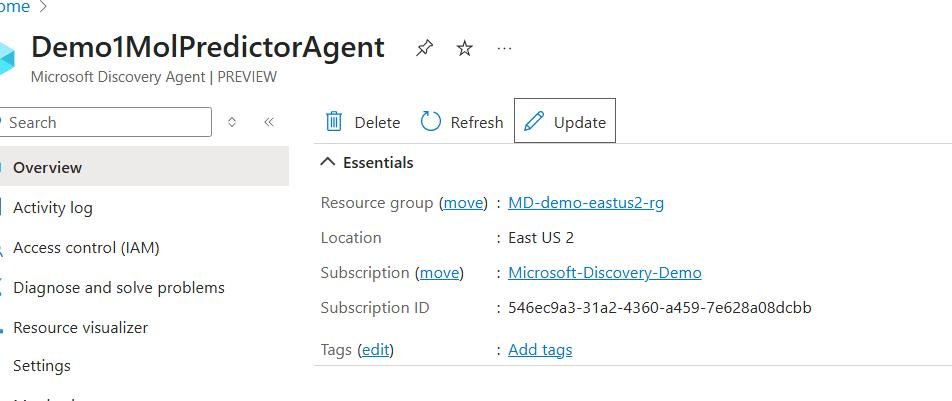
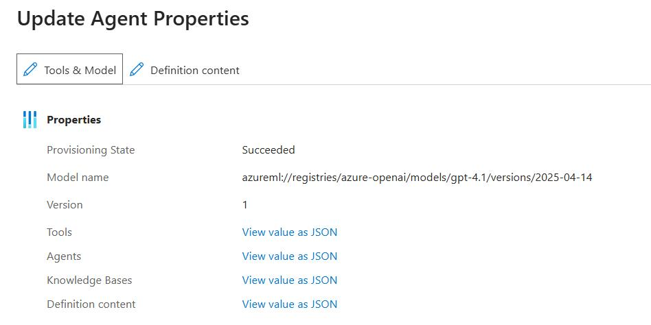
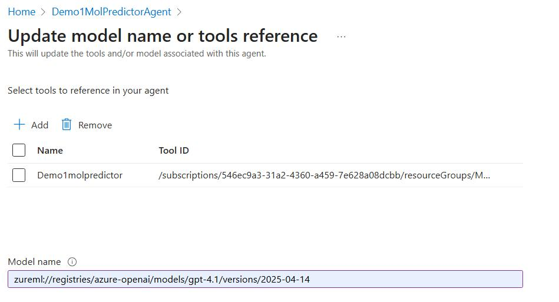
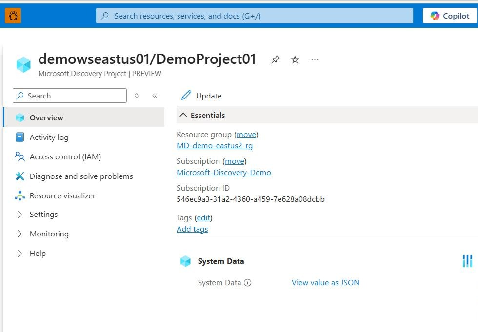
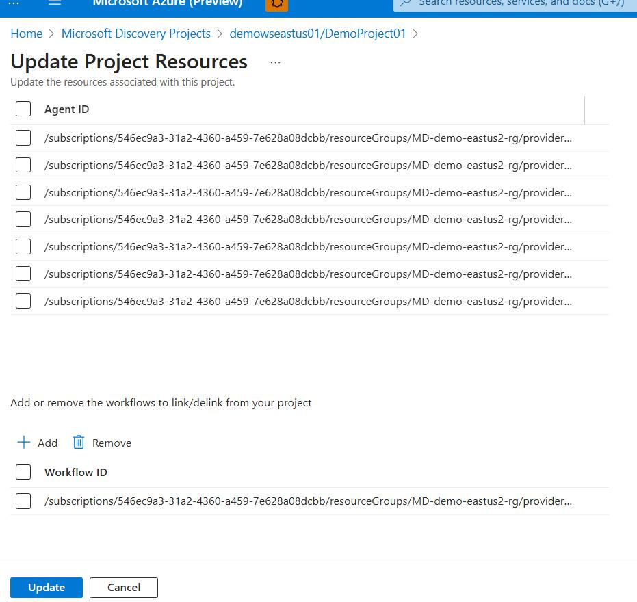
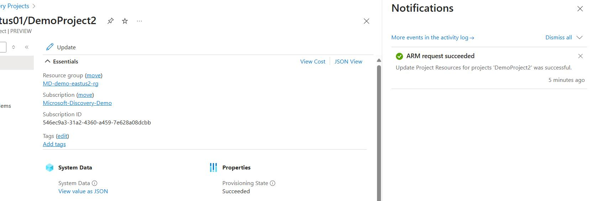

# Manual Project Update Guide

## Overview

When users make updates to tools and agents, they need to manually apply those changes to the linked projects through the Azure portal. This document provides step-by-step guidance for this process.

## Prerequisites

- Access to Azure Portal
- Appropriate permissions for the control plane resources [Role Assignment](../../2-getting-started/quickstart.md#1f-assign-roles-to-microsoft-discovery-service)
- Knowledge of your agent/tool and project resource locations

## Update Procedures

### Step 1: Update the Agent/Tools Control Plane Resource

#### 1.1 Navigate to the Control Plane Resource

1. Go to the Azure Portal
2. Locate the control plane resource for your agent/tool

#### 1.2 Initiate the Update Process

1. Click on the **Update** button in the Azure portal

#### 1.3 Configure the Updates

You have two options for updating:
- Update tool/models for the agent
- Update the definition content directly

**Example:** In the screenshot below, the model version was updated to GPT-4.1

#### 1.4 Apply Changes

Click the **Update** button to apply the changes to the agent/tool.

### Step 2: Apply Changes to the Discovery Project

#### 2.1 Navigate to the Project Control Plane Resource

After updating the agent/tool, navigate to your control plane resource created for the discovery project in the Azure portal.

#### 2.2 Access Project Update Options

Click on the **Update** button in the Azure portal.

#### 2.3 Configure Project Updates

From this interface, you can:
- Add or remove agents
- Update workflow configurations for the project
- Apply changed agents/tools to the running project

Simply click the **Update** button to apply the modified agent/tool to your running project.

#### 2.4 Verify Successful Update

You should see confirmation that the project resource was updated successfully in the event log.

## Summary

This manual update process ensures that changes made to agents and tools are properly propagated to their associated projects. The two-step process involves:

1. **Updating the agent/tool control plane resource** with new configurations or models
2. **Applying those changes to the discovery project** through the project's control plane resource

### Important Note on Change Application Timing

Changes have different application timings depending on their type:

**Changes Applied When Project is Updated:**
- Changes applied to AI agents or workflow configurations will only take effect when the user updates the project (Step 2)

**Changes Applied Immediately:**
- Other changes that are not applied to agents will be applied immediately after the user applies the change to tools/agents (Step 1)

**Examples of Immediate Changes:**
- **Tool Definition Changes:**
  - Computer resource configurations
  - Infrastructure type settings
  - Image ACR configurations
  - Pool size adjustments
  - Code environment settings

- **Agent Definition Changes:**
  - Any configuration under `discovery_extensions` will be applied immediately, such as:
    - `plan_confirmation` 
    - `tool_confirmation` 

## Best Practices

- Always verify updates in the event log after completion
- Ensure you have the necessary permissions before starting the update process