# Bookshelf and Knowledge Base deployment guide

Discovery Bookshelf service enables graph-based knowledge search of your proprietary documents, such as text files, PDFs, and other formats. The key components of the Bookshelf service are the Bookshelf resource and Knowledge Bases (KBs) within each Bookshelf. A KB contains a vector database and knowledge graph of your indexed artifacts. The KB can then be used with a Discovery agent as a grounding skill for various scenarios, including question answering, summarization, and reasoning.  

**When to use the Bookshelf**
The Bookshelf is great for reasoning over your curated, proprietary data. Knowledge Bases are especially effective when their scoped contents are thematically related and directly applicable to your Discovery worflow. For using data in a tool call or otherwise directly using data in Discovery, creating a Knowledge Base is often not necessary. 

This document provides a step-by-step guide to create a Knowledge Base that can be used as a grounding skill for Discovery agents:

1. **Set Up a Storage Account**: Upload the proprietary documents you want to index in this storage account.
1. **Create a Discovery Storage, Discovery Supercomputer and Nodepool**: Select an appropriate VM size for the nodepool, which will handle the indexing operation of the Knowledge Base.
1. **Create a Discovery Workspace**: Associate the discovery storage, supercomputer and nodepool with the workspace.
1. **Create a Discovery Bookshelf Resource**: This will serve as the container for your Knowledge Base.
1. **Create a Discovery Datacontainer Resource**: Use the storage account to create a data container, which serves as a logical abstraction for different data storage types.
1. **Add a Discovery Data asset Resource**: Create a discovery data asset of type "Folder" within the data container, designating it as the location for uploading proprietary documents to be indexed. Upload all documents for indexing into this data asset folder.
1. **Add a Discovery Knowledgebase Resource**: Include a data asset in the Knowledge Base that contains the documents to be indexed
1. **Create a Discovery Project Resource**: A Discovery project is required to perform the indexing operation on the supercomputer.
1. **Index the Knowledge Base**: Generate a knowledge graph and vector database to enable grounding data for Discovery agents.

> [!NOTE]
> Encrypted, password-protected, or sensitivity-labeled files are not supported for indexing. Any unsupported file type will be skipped during indexing. 
>

## Prerequisites

Before creating a knowledgebase with Bookshelf service, ensure you have completed the following:

### 1. Prerequisites

Ensure that you have completed steps **1a** to **4** in the [Quickstart: Get started with Microsoft Discovery](../../2-getting-started/quickstart.md) before starting with the Bookshelf service.

- The Azure blob storage account that you create in step 1e will be used to upload your prioritary data.
- Ensure the nodepools you create in step 3a align to the size of Bookshelf deployment you intend to create (see the Bookshelf Resources section below).

### 2. Azure Quota Requirements & Bookshelf Resources

Ensure sufficient quota in your target region for:

- **Azure OpenAI Instance** As of release 2.1, the Bookshelf service uses the following Azure OpenAI (AOAI) model configurations for search enrichment. Ensure that the required quota is allocated **per Bookshelf** instance

  #### **GPT-4.1**

    | Configuration               | Value      | Notes                              |
    |-----------------------------|------------|------------------------------------|
    | **Version**                 | 2025-04-14 | Latest stable version |
    | **Deployment Type**         | Standard   | Local data zone deployment        |
    | **Default TPM (Tokens Per Minute)** | 100,000 | Minimum required capacity per Bookshelf |
    | **Recommended TPM (Tokens Per Minute)** | 1,000,000 |                                    |
    | **Default RPM (Requests Per Minute)** | 1,000     | TPM/1000                     |
    | **Recommended RPM (Requests Per Minute)** | 4,000    | TPM/1000                     |

  > [!NOTE]
  > Bookshelf deployments created prior to 2.1 using GPT-4o will continue to be supported. Similarly, the default AOAI model will continue to evolve. Please keep an eye on Discovery release notes for information on deprecation timelines and upgrade recommendations. 
  >

  #### **Text-Embedding-3-Small Model**

    | Configuration               | Value      | Notes                              |
    |-----------------------------|------------|------------------------------------|
    | **Version**                 | 1          | Consistent with Copilot service   |
    | **Dynamic Quota**           | Enabled    | Automatic scaling based on bandwidth availability |
    | **Default TPM (Tokens Per Minute)** | 50,000 | Minimum required capacity per Bookshelf |
    | **Recommended TPM (Tokens Per Minute)** | 2,000,000 |                                    |
    | **Default RPM (Requests Per Minute)** | 30,000    | TPM/(1000/6)                     |
    | **Recommended RPM (Requests Per Minute)** | 42,000    | TPM/(1000/6)                     |

For best performance, we **strongly** recommend allocating the "Recommended" TPM quotas for Text-embedding-3-small and GPT 4.1 specified in the Bookshelf [quota reservation documentation](https://github.com/microsoft/discovery/blob/main/4-how-to/2-onboarding-experience/b--quota-reservations.md).

## Bookshelf Resources 

By default, each Knowledge Base can index up 500MB of text data. This is a "Medium"-sized Bookshelf deployment. To deploy a "Small"-sized Bookshelf which supports a KB of up to 200MB, specify the following tag at Bookshelf creation time:

> ```indexSize = small```
>
> 

The resources and costs associated with Small and Medium (default)-sized Bookshelves - which are automatically allocated at deployment time - are as follows:

  |Area      |Resource                            |Small (200MB text)             | Medium - default (500MB text) |Notes                      |
  |----------|------------------------------------|-------------------------------|-------------------------------|---------------------------|
  |Indexing |Text-embedding-3-small (on-demand) |50K TPM |50K TPM |Default TPM set at Bookshelf creation. Costs are variable | 
  |Indexing |Supercomputer nodepool |Standard_D48s_v6 (192GB) |Standard_D128s_v6 (512 GB) | |
  |Search |Azure Container App dedicated profile |E4 with vCPU, 32GB Memory |E8 with vCPU, 64GB Memory |Created at Bookshelf deployment, **always on** |
  |Search |AzureSQL DB |Standard Gen 5 (4 vCores) |Standard Gen 5 (4 vCores) | Created at Bookshelf deployment, **always on** |
  |Search |GPT 4.1 (on demand) |100K TPM |100K TPM |Default TPM set at Bookshelf creation. Costs are variable |

## Create a Discovery Bookshelf

A Bookshelf contains indexed Knowledge Bases which can be used as grounding data for Discovery agents. Currently, one KB is supported per Bookshelf. Supporting multiple KBs per Bookshelf will be supported in future releases.

> **Note:** The Azure OpenAI instance quota described in [Azure Quota Requirements](#2-azure-quota-requirements) applies to each Bookshelf resource individually. If the required quota is not available in the region where you are creating the Bookshelf, the deployment will fail.

> **Note:** Starting in 2.1, only one KB per Bookshelf is supported for all newly deployed Bookshelves. However, there is no limit on the number of Bookshelf resources that can be deployed. This is a known limitation that will be addressed in future releases. 

To create a Bookshelf, follow the steps below:

1. Sign in to the [Azure Portal](https://portal.azure.com)
2. Search for `Microsoft Discovery Bookshelves`
3. Select "Create" and enter essential details such as Subscription, Resource Group, Name, Region and click next
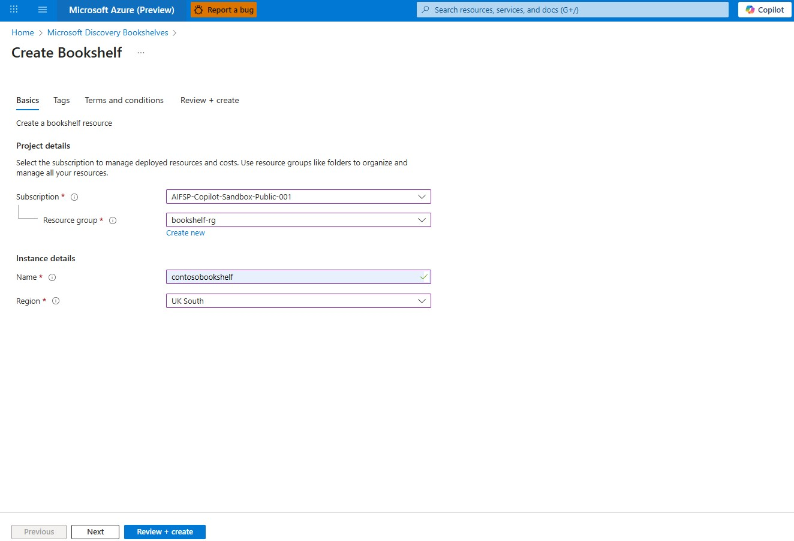
4. Review the Terms and Conditions and click Create
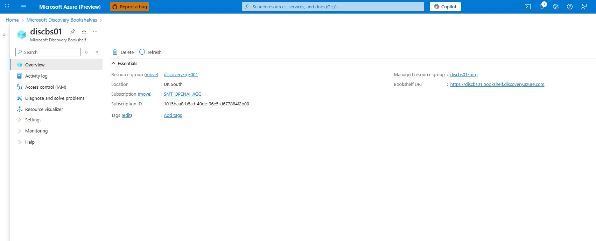

### Step 5: Create a Discovery DataContainer resource
To create a discovery data container resource using the storage account created in [Step 1](#step-1-setup-an-azure-storage-account-to-upload-proprietary-data), follow the steps [Log in to Microsoft Discovery Studio](../../2-getting-started/quickstart.md#6-log-in-to-microsoft-discovery-studio) and [Create your data containers](../../2-getting-started/quickstart.md#7-create-your-data-containers)

### Step 6: Add a Discovery Data asset resource and upload your proprietary data
Create a discovery data asset of type "Folder" within the data container, designating it as the location for uploading proprietary documents to be indexed. Upload all documents for indexing into this data asset folder
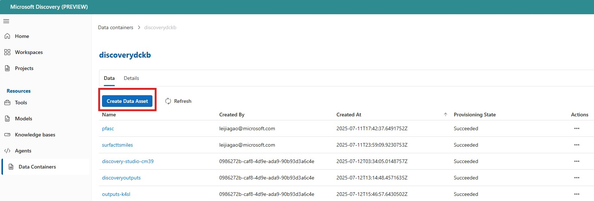
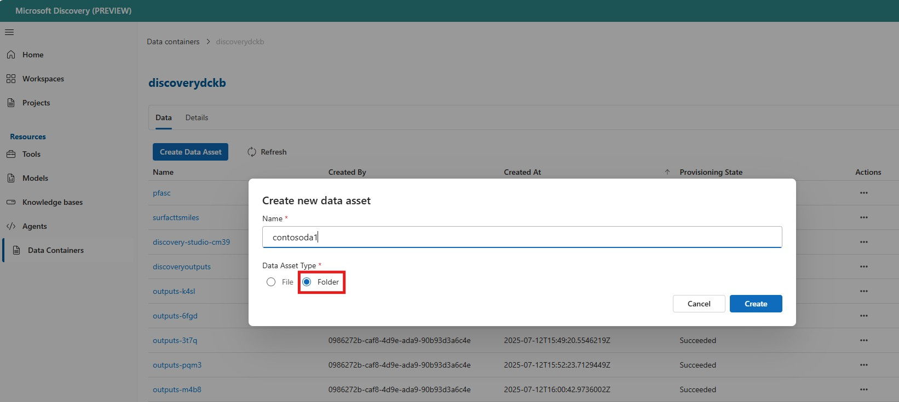
After the data asset is created, you can upload the proprietary data to the data asset.
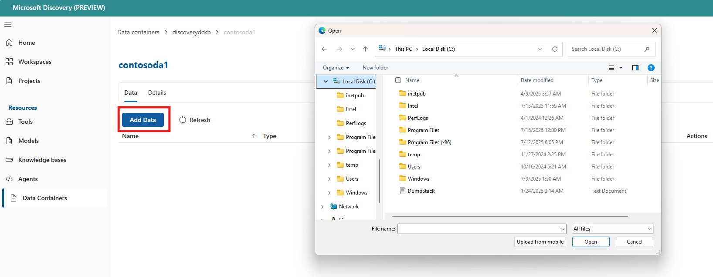

### Step 7: Create a Knowledge Base 
1. Create a Knowledge Base by selecting the Bookshelf created in [step 3](#step-3-create-a-discovery-bookshelf). Provide detailed descriptions for both the agent and for human users. The copilot instruction field should detail how and when agents should use the KB, and the description field is for human use.
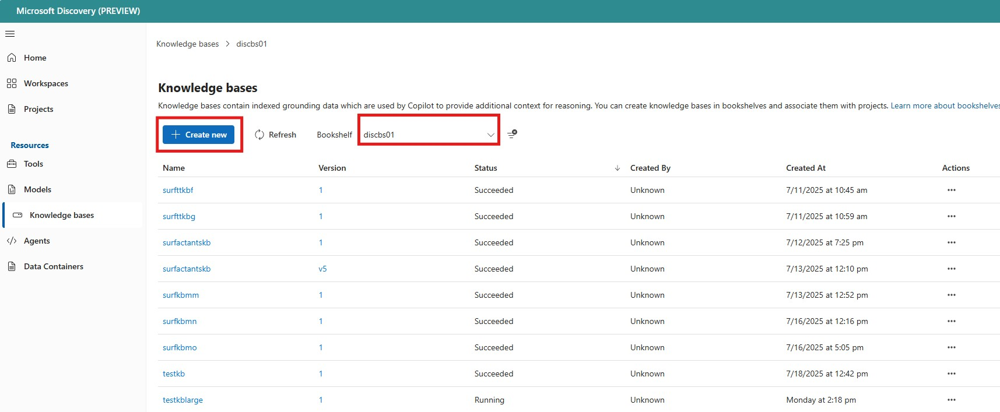
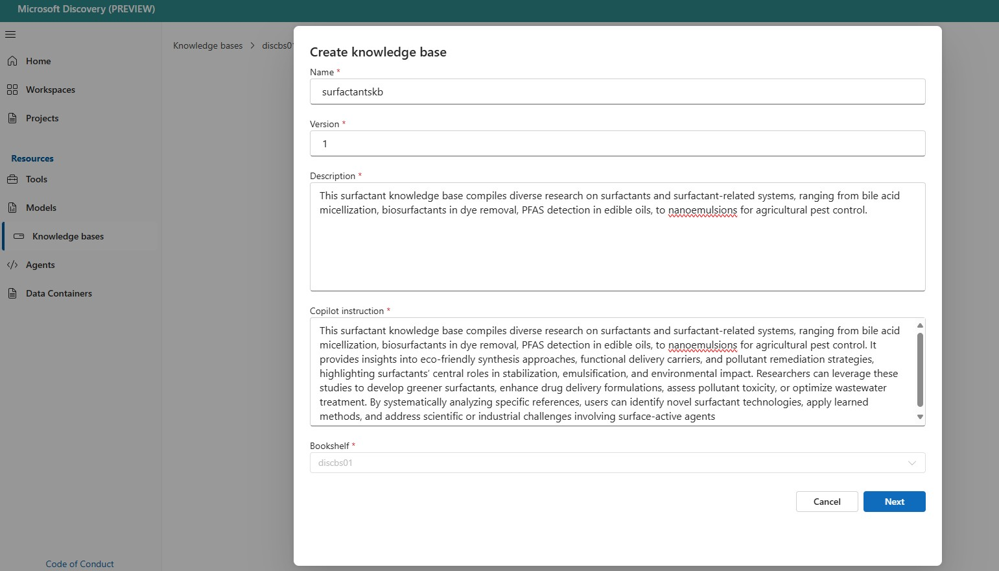

2. Use the data container created in [step 4.](#step-4-create-a-discovery-datacontainer-resource) and the data asset created in [step5.](#step-5-add-a-discovery-dataasset-resource-and-upload-your-proprietary-data) to create the KB. You are now ready to index the KB. 
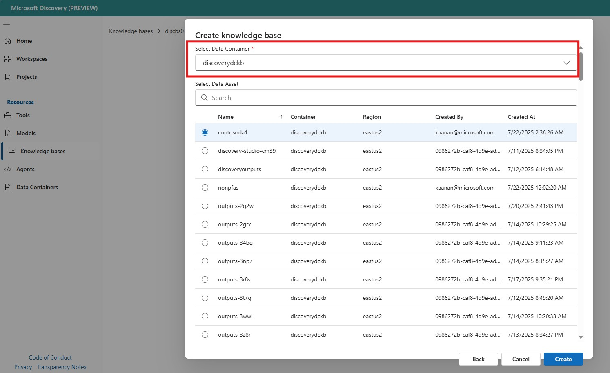

### Step 8: Create a Discovery Project 
Before you index a Knowledge Base on the supercomputer you will need a **Discovery Project**. To create a project follow the steps in [Create a project](../../2-getting-started/quickstart.md#8-create-a-project)

### Step 9: Index a Knowledge Base
1. To Index a Knowledge Base, select the **Bookshelf** -> select the **Knowledgebase** to be indexed with the status **NotStarted** 
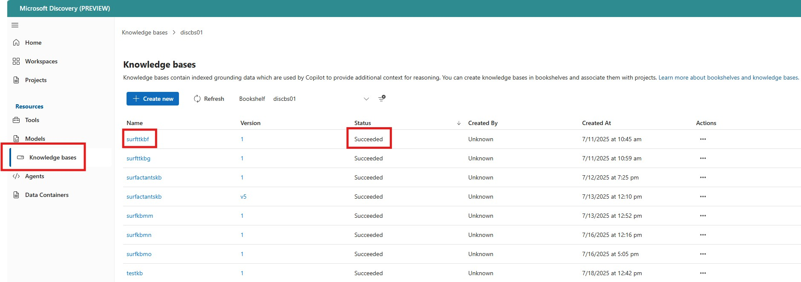

2. Click the **Index** button
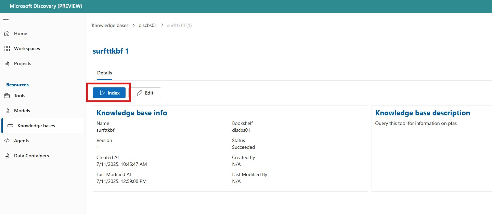

3. Select the **storage account** created in [Step1](#step-1-setup-an-azure-storage-account-to-upload-proprietary-data), the discovery nodepool created in [Step2](#step-2-create-a-discovery-supercomputer-and-nodepool) and the **project** created in [Step 8](#step-1-setup-an-azure-storage-account-to-upload-proprietary-data), click the start indexing button.
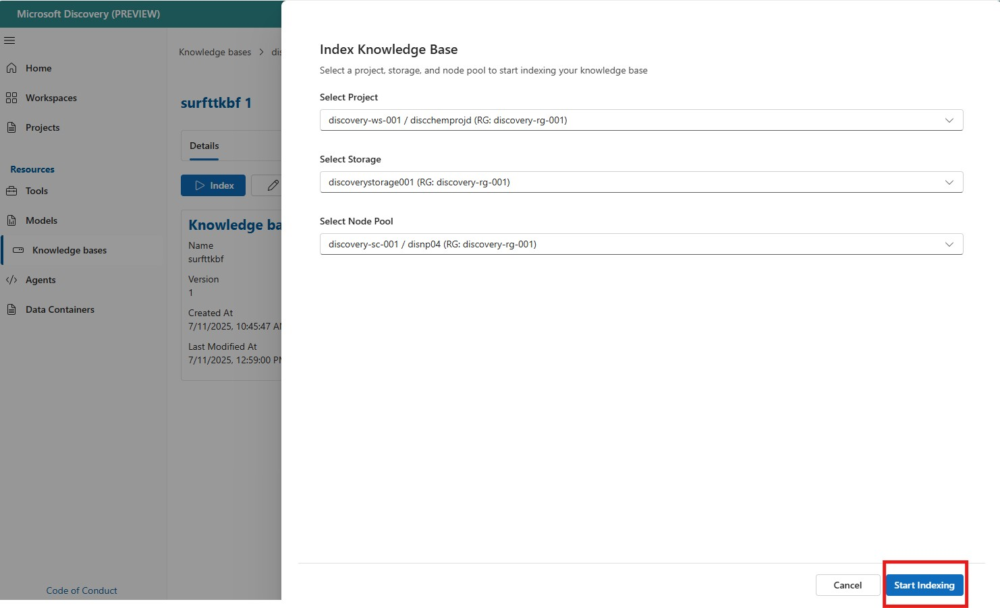

4. The time required for indexing will vary based on the availability of supercomputer and Azure OpenAI resources.
Once the indexing has started, you will see the status of the Knowledge Base changes to **Running**. After the indexing operation is complete you will see the KB status changes to **Succeeded**.
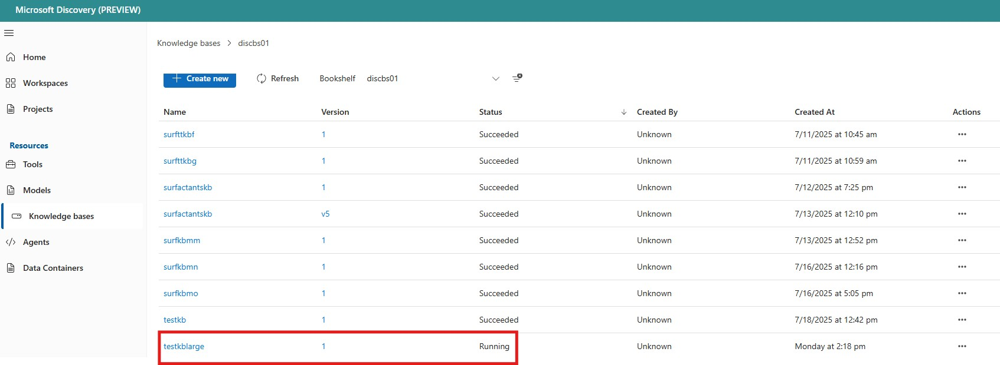
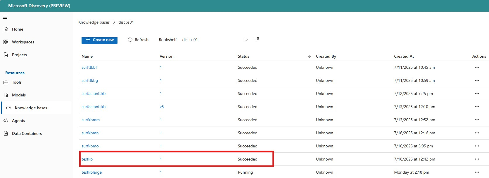


## Use the indexed Knowledge Base in a project
1. You can now add the indexed Knowledge Base to an agent and use it as a grounding skill for the agent. For detailed instructions on creating an agent, see the guide here: [Create Agent](../6-tools-models-agents/c--agent-deployment.md)
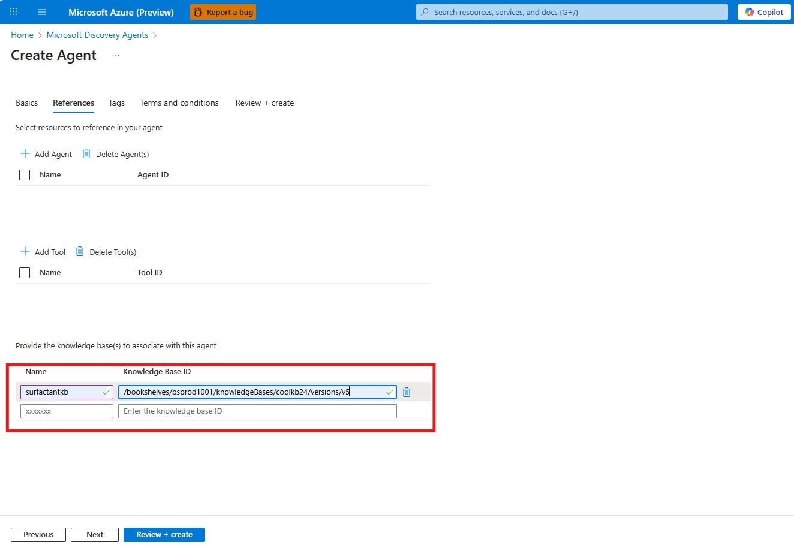

2. After creating a project with the new agent, you can query the Knowledge Base. To confirm the KB got queried, the log below should be visible in agent log.
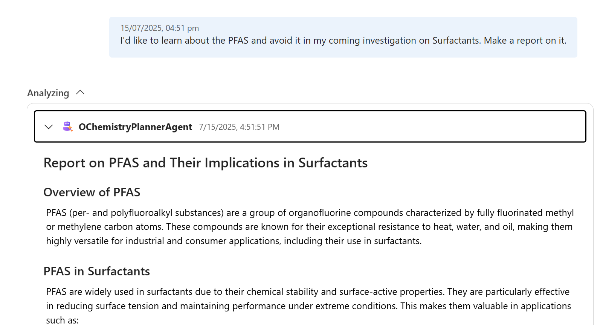


## Best Practices & Workarounds

### Best Practices

The Bookshelf is an evolving feature. Over the course of future releases, we will improve the costs and time associated with creating Bookshelf deployments and indexing and searching over KBs. We will also support incremental indexing and will take advantage of newer GPT models. Currently, for the best performance and to minimize costs of re-deployment, re-indexing, re-enrichment, or search, we recommend the following best practices:

- Limit each Knowledge Base to Small or Medium (default)-sized deployments
- Ensure each KB's content is thematically coherent and directly applicable to your Discovery workflow 
- See the [Known Limitations](https://github.com/microsoft/discovery/blob/main/1-overview/6-known-limitations.md) documentation for additional detail.
  

### Workaround Steps for "queue_access_forbidden" Issue

If you encounter a "queue_access_forbidden" error when accessing the Knowledge Base from a different project than the one used for creation and indexing, follow these steps:
Below is an example of the error you will see in Discovery Studio:
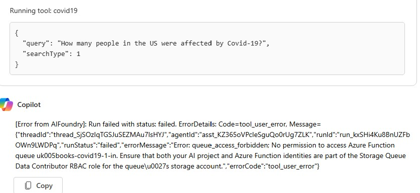

1. **Identify the Correct Storage Account**: Go to the resource group (MRG) containing your Bookshelf's storage account (e.g., uk005books bookshelf storage).
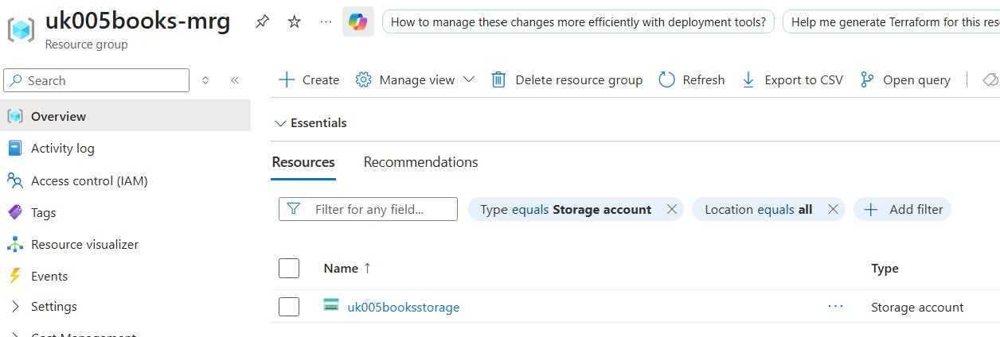
2. **Assign Storage Queue Data Contributor Role**: In the storage account, navigate to IAM and add a role assignment for "Storage Queue Data Contributor".
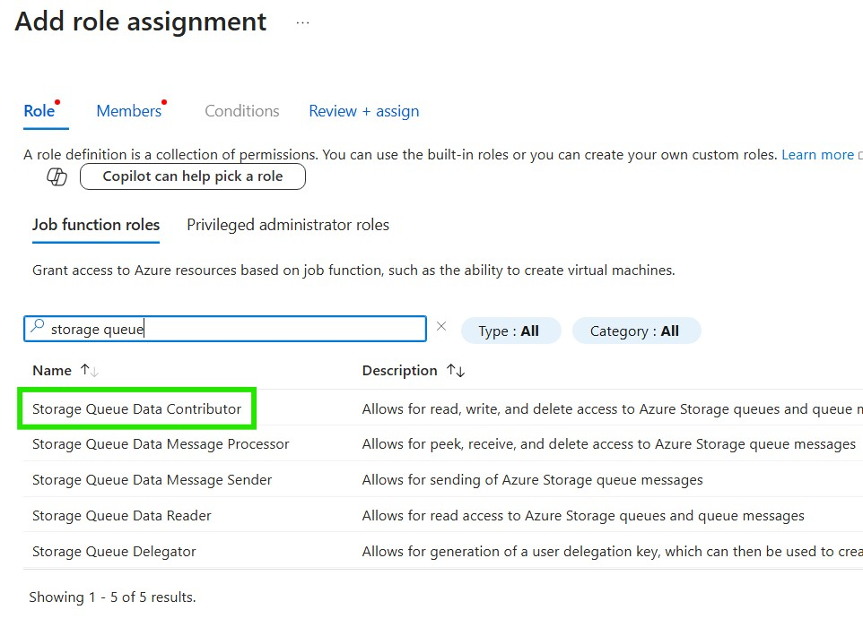
3. **Select the Correct Managed Identity**: When assigning the role, ensure you select the managed identity associated with your AI Foundry project (not your personal UAMI). This is typically the system-assigned identity for the specific AI Foundry project (e.g., uk005proj01).
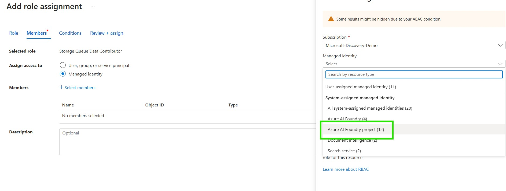

4. **Confirm Role Assignment**: Assign the role and wait a few minutes for permissions to propagate.
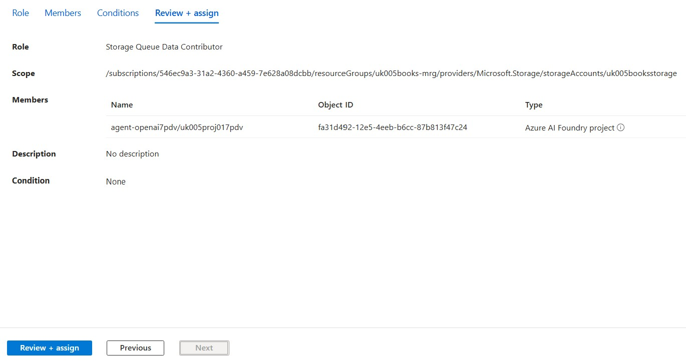
5. **Retry the Operation**: After the role is assigned, retry your query or operation to confirm the issue is resolved.
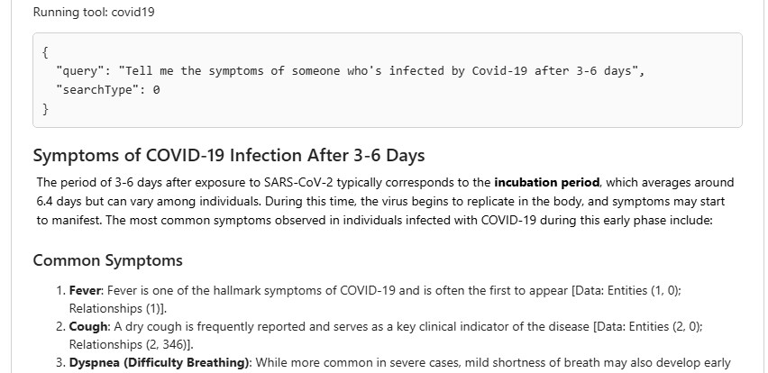

