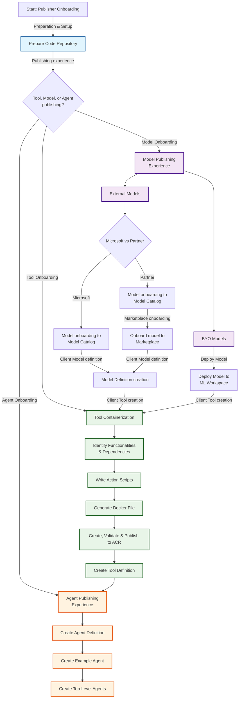
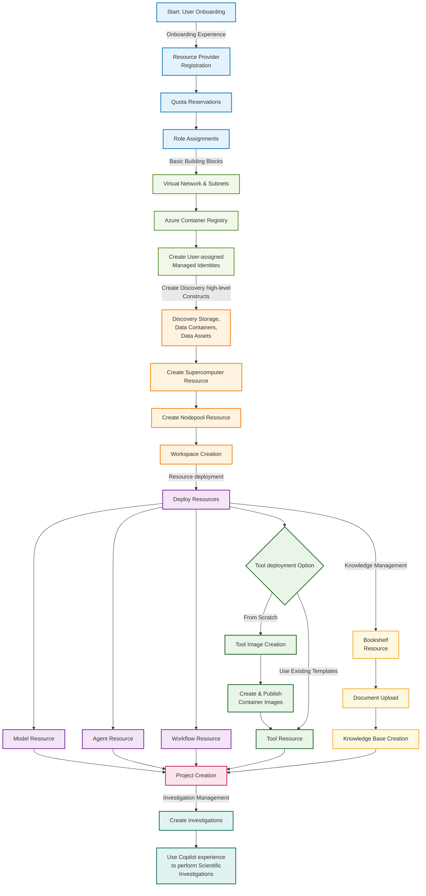

# Microsoft Discovery Platform Guide

## Overview

Microsoft Discovery is a powerful platform that enables advanced research and development workflows through integrated tools, models, and intelligent agents. This guide provides step-by-step instructions for both publishing components to the platform and using the platform for research initiatives.

## Who This Guide Is For

### Publishers
- Independent Software Vendors (ISVs)
- Technology partners
- Organizations developing tools, models, and agents
- Developers looking to extend the platform capabilities

### Users
- Researchers and data scientists
- Academic institutions
- Organizations conducting computational research
- Teams requiring high-performance computing workflows

## Table of Contents

### For Publishers
1. [Preparation and Setup](1-prep-work/)
   - [Prepare Code Repository](1-prep-work/a--prepare-code-repo.md)
2. [Models](6-tools-models-agents/models-publishing/)
   - [Bring Your Own Models (BYO)](6-tools-models-agents/models-publishing/byo-models/)
   - [External Models](6-tools-models-agents/models-publishing/external-models/)
   - [Tool Client Publishing](6-tools-models-agents/models-publishing/tool-client-publish/)
3. [Tools](6-tools-models-agents/tools-publishing/)
   - [Identify Tool Functionalities and Dependencies](6-tools-models-agents/tools-publishing/a--identify-tool-functionalities-and-dependencies.md)
   - [Writing Action Scripts](6-tools-models-agents/tools-publishing/b--writing-action-scripts.md)
   - [Generate Docker File](6-tools-models-agents/tools-publishing/c--generate-docker-file.md)
   - [Create, Validate, and Publish Tools to ACR](6-tools-models-agents/tools-publishing/d--create-validate-publish-tools-to-acr.md)
   - [Create Tool Definition](6-tools-models-agents/tools-publishing/e--create-tool-definition.md)
4. [Agents](6-tools-models-agents/agents-publishing/)
   - [Create Agent Definition](6-tools-models-agents/agents-publishing/a--create-agent-definition.md)
   - [Model Selection and Prompting Guide](6-tools-models-agents/agents-publishing/b--model-selection-and-prompting-guide.md)
   - [Tutorial 1: Single Agent QA](6-tools-models-agents/agents-publishing/c--tutorial-01-single-agent-qa.md)
   - [Tutorial 2: Single Agent KB](6-tools-models-agents/agents-publishing/d--tutorial-02-single-agent-kb.md)
   - [Tutorial 3: Single Agent Tools](6-tools-models-agents/agents-publishing/e--tutorial-03-single-agent-tools.md)
   - [Tutorial 4: Multi-Agent Workflow](6-tools-models-agents/agents-publishing/f--tutorial-04-multi-agent-workflow.md)

### For Users
1. [Onboarding Experience](2-onboarding-experience/)
   - [Resource Provider Registration](2-onboarding-experience/a--rp-registration.md)
   - [Quota Reservations](2-onboarding-experience/b--quota-reservations.md)
   - [Role Assignments](2-onboarding-experience/c--role-assignments.md)
   - [Resource naming guidelines](2-onboarding-experience/d--resource-naming.md)
2. [Basic Building Blocks](3-basic-building-blocks/)
   - [Virtual Network & Subnets](3-basic-building-blocks/a--virtual-network-subnets.md)
   - [Azure Container Registry Creation](3-basic-building-blocks/b--acr-creation.md)
   - [Managed Identities](3-basic-building-blocks/c--managed-identities.md)
3. [Supercomputer & Storage Creation](4-discovery-infra-resources/)
4. [Tool Image Creation](5-tool-image/)
   - [Create and Publish Container Images](5-tool-image/a--create-and-publish-container-image.md)
5. [Tools, Models & Agents Creation](6-tools-models-agents/)
   - [Model Deployment](6-tools-models-agents/a--model-deployment.md)
   - [Tool Deployment](6-tools-models-agents/b--tool-deployment.md)
   - [Agent Deployment](6-tools-models-agents/c--agent-deployment.md)
   - [Updating Tool/Model/Agent Resources](6-tools-models-agents/d--updating-tool-model-agent-resource.md)
6. [Project Creation](7-projects/)
   - [Creating Projects](7-projects/a--creating-project.md)
   - [Updating Projects](7-projects/b--updating-project.md)
7. [Creating and Running Investigations](8-investigations/)
   - [Creating Investigations](8-investigations/a--creating-investigation.md)
   - [Running Sample Scenarios](8-investigations/b--running-a-sample-scenario.md)
8. [Bookshelf & Knowledge Base Creation](9-bookshelves-knowledgebases/)
   - [Bookshelf Deployment](9-bookshelves-knowledgebases/a--bookshelf-deployment.md)
   - [Document Upload](9-bookshelves-knowledgebases/b--document-upload.md)
   - [Knowledge Base Creation](9-bookshelves-knowledgebases/c--knowledgebase-creation.md)

## High-level Platform Flow

### Publisher Flow

### User Flow

## Detailed Guide Sections

### For Publishers

#### 1. Preparation and Setup
Get your development environment ready and prepare your code repository for publishing.

- **Repository Setup**: Setting up Git repositories and structure best practices
- **Version Control**: Version control strategies and documentation requirements
- **Environment Configuration**: Development environment prerequisites

#### 2. Models Integration
Learn how to integrate and publish different types of models on the Microsoft Discovery platform.

- **Bring Your Own Models (BYO)**: Custom model integration, validation, and performance optimization
- **External Models**: Third-party model integration, API connections, and security practices
- **Tool Client Publishing**: Client library development and SDK integration

#### 3. Tools Development
Comprehensive guide to creating, containerizing, and publishing computational tools.

- **Planning**: Functionality analysis, requirements gathering, and dependency mapping
- **Development**: Script development, input/output handling, and error management
- **Containerization**: Docker strategies, multi-stage builds, and security considerations
- **Publishing**: Azure Container Registry integration and validation workflows
- **Configuration**: Tool metadata specification and interface definitions

#### 4. Agents Creation
Build intelligent agents that orchestrate complex workflows and integrate multiple tools.

- **Architecture**: Agent design, capability definitions, and integration patterns
- **Development**: Step-by-step agent creation, testing, and debugging
- **Orchestration**: Complex workflow management and multi-agent coordination

### For Users

#### 1. Onboarding Experience
Essential first steps to get started with Microsoft Discovery platform.

- **Resource Provider Registration**: Setting up Azure subscriptions and registering required resource providers
- **Quota Management**: Understanding and requesting appropriate compute quotas for your research needs
- **Security Setup**: Configuring role-based access control and permissions for team collaboration

#### 2. Basic Building Blocks
Core infrastructure components required for Microsoft Discovery platform operations.

- **Network Configuration**: Virtual network setup, subnet configuration, and network security considerations
- **Container Management**: Azure Container Registry setup for managing custom tool images
- **Identity Management**: Managed identity configuration for secure resource access and authentication

#### 3. Supercomputer & Storage Creation
High-performance computing infrastructure setup for intensive computational workloads.

- **Compute Resources**: Provisioning and configuring high-performance compute clusters
- **Storage Solutions**: Setting up scalable storage systems for data management and workflow persistence
- **Performance Optimization**: Best practices for compute and storage performance tuning

#### 4. Tool Image Creation
Development and deployment of custom computational tools.

- **Containerization**: Docker image creation, optimization, and security scanning
- **Registry Management**: Publishing and versioning container images in Azure Container Registry
- **Tool Integration**: Preparing tools for integration with Microsoft Discovery workflows

#### 5. Tools, Models & Agents Creation
Deployment and management of computational resources on the platform.

- **Model Integration**: Deploying machine learning models and AI services
- **Tool Orchestration**: Setting up computational tools and managing dependencies
- **Agent Configuration**: Creating intelligent agents for workflow automation
- **Resource Management**: Updating and maintaining deployed resources

#### 6. Project Creation
Organizing research initiatives and managing collaborative workspaces.

- **Project Structure**: Best practices for organizing research projects and data
- **Team Collaboration**: Setting up shared workspaces and access controls
- **Resource Allocation**: Assigning compute and storage resources to projects

#### 7. Creating and Running Investigations
Managing research workflows and computational experiments.

- **Investigation Design**: Planning and structuring research investigations
- **Workflow Execution**: Running complex computational workflows and managing dependencies
- **Results Management**: Collecting, analyzing, and sharing research outcomes

#### 8. Bookshelf & Knowledge Base Creation
Building and managing organizational knowledge repositories.

- **Document Management**: Organizing and indexing research documents and publications
- **Knowledge Discovery**: Creating searchable knowledge bases for research acceleration
- **Content Integration**: Connecting knowledge bases with active research workflows

## Getting Started

### For Publishers
1. Start with [Preparation and Setup](1-prep-work/) to configure your development environment
2. Choose your publishing path: [Models](6-tools-models-agents/models-publishing/), [Tools](6-tools-models-agents/tools-publishing/), or [Agents](6-tools-models-agents/agents-publishing/)
3. Follow the step-by-step guides for your chosen component type
4. Test and validate your components before publishing

### For Users
1. Begin with the [Onboarding Experience](2-onboarding-experience/) to set up your account and permissions
2. Configure [Basic Building Blocks](3-basic-building-blocks/) for your infrastructure
3. Set up [Supercomputer & Storage](4-discovery-infra-resources/) for your computational needs
4. Create [Projects](7-projects/) and start [Investigations](8-investigations/)

## Important Notes

⚠️ **Private Preview**: This documentation is for Microsoft Discovery private preview participants only. Features and processes may change based on feedback.

🔒 **Security**: Always follow security best practices when developing, publishing, or managing research data and computational resources.

📊 **Performance**: Consider compute efficiency, resource optimization, and cost management in all developments and research workflows.

🔄 **Updates**: This guide is regularly updated. Check for the latest version before starting new projects or research initiatives.

💡 **Best Practices**: Follow established research data management, software development, and computational workflow best practices throughout your journey.

🤝 **Community**: Engage with the Microsoft Discovery community for support, feedback, and collaboration opportunities.

## Support and Resources

- **Documentation**: Comprehensive guides and API references
- **Community Forums**: Connect with other publishers and users
- **Technical Support**: Direct assistance for platform-specific issues
- **Best Practices**: Industry standards and Microsoft recommendations
- **Training Materials**: Workshops, tutorials, and certification programs

---

*This guide serves as your comprehensive resource for both contributing to and leveraging the Microsoft Discovery platform. Whether you're publishing innovative tools or conducting groundbreaking research, these resources will help you maximize the platform's potential.*