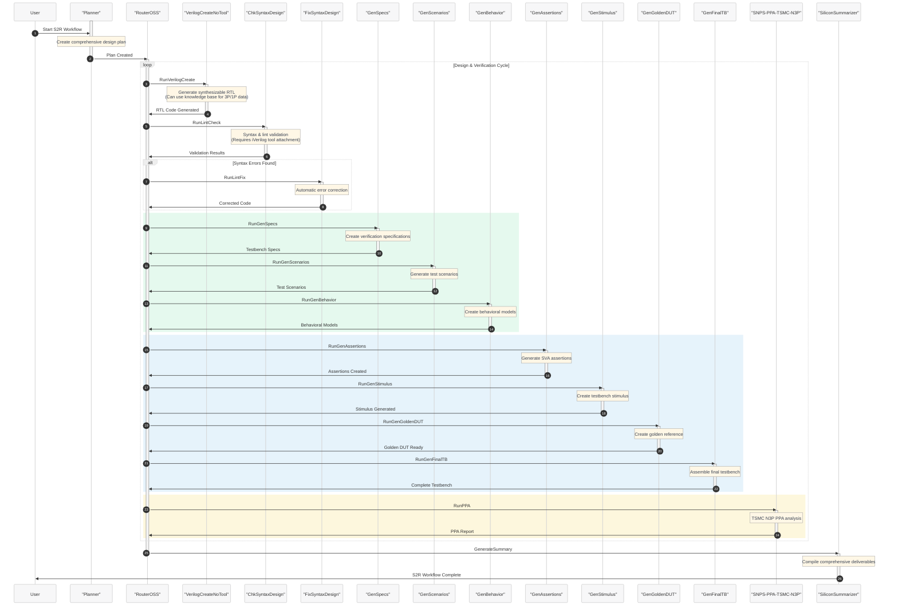

# Silicon Spec-to-RTL (S2R) Design and Verification Workflow

This sample provides a comprehensive Silicon-to-RTL workflow that orchestrates 14 specialized AI agents to automate the entire process from specifications to verified RTL implementations. The S2R workflow combines design creation, syntax validation, comprehensive verification, and PPA analysis to deliver production-ready silicon designs with complete testbench environments.

The workflow is designed for chip designers and verification engineers working with Verilog RTL designs who need automated, intelligent assistance throughout the design and verification process.

## Workflow Overview

The S2R workflow operates as a sophisticated state machine with intelligent routing capabilities, ensuring systematic progression through design and verification phases:

1. **Planning Phase**: Creates comprehensive execution plan for the entire workflow
2. **Intelligent Routing**: RouterOSS agent analyzes progress and routes to appropriate specialized agents
3. **RTL Creation**: VerilogCreateNoTool generates synthesizable Verilog RTL from specifications
4. **Syntax Validation**: ChkSyntaxDesign performs comprehensive syntax and lint checking
5. **Error Correction**: FixSyntaxDesign automatically corrects identified issues
6. **Verification Specification**: GenSpecs creates detailed testbench specifications
7. **Test Scenario Generation**: GenScenarios develops comprehensive test cases and patterns
8. **Behavioral Modeling**: GenBehavior creates reference behavioral models
9. **Assertion Development**: GenAssertions generates SystemVerilog assertions (SVA)
10. **Stimulus Generation**: GenStimulus creates comprehensive testbench stimulus
11. **Golden DUT Creation**: GenGoldenDUT develops golden reference models
12. **Final Testbench Assembly**: GenFinalTB integrates all components into complete testbench
13. **PPA Analysis**: SNPS-PPA-TSMC-N3P estimates Power, Performance, and Area metrics
14. **Summary Generation**: SiliconSummarizer compiles comprehensive deliverables
15. **Completion**: Workflow terminates with complete design and verification environment

## Agent Ecosystem

The workflow coordinates 14 specialized agents organized into functional categories:

### Design Creation & Validation Agents
- **Planner**: Creates comprehensive execution plans and coordinates workflow
- **RouterOSS**: Intelligent routing hub that analyzes progress and directs workflow execution
- **VerilogCreateNoTool**: RTL code generation specialist for synthesizable Verilog design
  > **Note**: A knowledge base can be attached to VerilogCreateNoTool agent for 3rd-party (3P) and 1st-party (1P) data-driven Verilog RTL creation, enabling access to proprietary design libraries, IP blocks, and company-specific design patterns.
- **ChkSyntaxDesign**: Comprehensive syntax and lint validator with industry standards compliance
  > **Note**: The iVerilog tool needs to be attached to the ChkSyntaxDesign agent in order for the syntax checking tool to be executed. The iVerilog tool source files can be found in the tool-artifacts directory.
- **FixSyntaxDesign**: Intelligent code corrector that preserves design intent

### Verification Agents
- **GenSpecs**: Verification specification architect creating detailed testbench requirements
- **GenScenarios**: Test scenario designer developing comprehensive verification patterns
- **GenBehavior**: Reference model creator for behavioral implementations
- **GenAssertions**: Formal verification specialist generating SystemVerilog assertions
- **GenStimulus**: Testbench stimulus generator for comprehensive input patterns
- **GenGoldenDUT**: Golden reference DUT creator for verification comparison
- **GenFinalTB**: Final testbench integrator assembling complete verification environment

### Analysis & Reporting Agents
- **SNPS-PPA-TSMC-N3P**: TSMC N3P process PPA estimation specialist
- **SiliconSummarizer**: Results compilation and deliverable organization specialist



## Key Features

### Intelligent Multi-Agent Orchestration
- **RouterOSS Coordination**: Central routing hub that analyzes workflow progress and intelligently directs task execution
- **Conditional Workflow Progression**: State transitions based on agent decisions, results, and validation outcomes
- **Automated Error Handling**: Syntax validation and correction loops ensure clean, synthesizable RTL

### Comprehensive Verification Environment
- **Complete Testbench Pipeline**: Automated generation from specifications to final integrated testbench
- **SystemVerilog Assertions**: Formal verification properties for robust design validation
- **Golden Reference Models**: Behavioral models for verification comparison and expected behavior validation
- **Comprehensive Stimulus Generation**: Thorough input pattern coverage for all test scenarios

### Advanced Technology Integration
- **TSMC N3P Process Optimization**: Specialized PPA analysis for advanced FinFET technology
- **Industry-Standard Compliance**: Verilog coding standards and synthesis tool compatibility
- **iVerilog Integration**: Automated syntax validation using industry-standard tools

# Creating a Project Based on This Sample

## Prerequisites

- Ensure you have deployed Workspace and Supercomputer resources as described in the [Quickstart Guide](/docs/3-getting-started)
- Ensure you have the [necessary permissions](/docs/3-getting-started/quickstart.md#1b-assign-roles-to-administrators-to-be-performed-by-subscription-owner) to create and manage resources in your Azure subscription
- Access to container registry for tool image deployment
- Understanding of Verilog RTL design and SystemVerilog verification methodologies


## Publish the Specialized Tool Images

See [Creating and publishing a container image](/docs/4-in-depth-tutorials/5-tool-image/a--create-and-publish-container-image.md) for instructions on creating and publishing container images.

Build and publish Docker images for the specialized silicon tools:
- **iVerilog Tool**: For syntax validation and compilation checking

Push all images to your Azure Container Registry (ACR) with appropriate versioning and tags.

## Publish the Specialized Tools

See [Creating and publishing a tool](/docs/4-in-depth-tutorials/6-tools-models-agents/b--tool-deployment.md) for instructions on creating and publishing tools.

Deploy the following specialized tools referenced by the silicon agents:
- **iVerilog Tool**: Syntax validation and compilation services

## Publish the Silicon Agents

See [Creating and publishing an agent](/docs/4-in-depth-tutorials/6-tools-models-agents/c--agent-deployment.md) for instructions on creating and publishing agents.

Deploy all silicon workflow agents from the `agent-definitions/` directory:

### Core Workflow Agents
- [Planner](agent-definitions/Planner.yaml)
- [RouterOSS](agent-definitions/RouterOSS.yaml)
- [SiliconSummarizer](agent-definitions/SiliconSummarizer.yaml)

### Design Creation & Validation Agents
- [VerilogCreateNoTool](agent-definitions/VerilogCreateNoTool.yaml)
- [ChkSyntaxDesign](agent-definitions/ChkSyntaxDesign.yaml)
- [FixSyntaxDesign](agent-definitions/FixSyntaxDesign.yaml)

### Verification Agents
- [GenSpecs](agent-definitions/GenSpecs.yaml)
- [GenScenarios](agent-definitions/GenScenarios.yaml)
- [GenBehavior](agent-definitions/GenBehavior.yaml)
- [GenAssertions](agent-definitions/GenAssertions.yaml)
- [GenStimulus](agent-definitions/GenStimulus.yaml)
- [GenGoldenDUT](agent-definitions/GenGoldenDUT.yaml)
- [GenFinalTB](agent-definitions/GenFinalTB.yaml)

### Analysis Agents
- [SNPS-PPA-TSMC-N3P](agent-definitions/SNPS-PPA-TSMC-N3P.yaml)

## Deploy the S2R Workflow

Deploy the main S2R workflow definition:
- [S2R Workflow](S2R.yaml)

Ensure all agent names in the workflow definition match the deployed agent resource names in your Azure environment.

## Create a Silicon S2R Project

See [Creating a project](/docs/4-in-depth-tutorials/7-projects/a--creating-project.md) for instructions on creating a project.

1. Create a project named 'Silicon-S2R-Workflow'
2. Add all published silicon agents to the project
3. Select the data container created above for design assets
4. Configure the project with appropriate compute resources for RTL synthesis and verification

## Submit a Design Request to the S2R Workflow

Once the project shows as 'Succeeded', you can create a new investigation and submit design requests to the S2R workflow.

Example design requests:
```
Create a 32-bit RISC-V ALU with support for arithmetic, logical, and shift operations. Include comprehensive verification with SystemVerilog assertions and full testbench coverage.
```

```
Design a configurable FIFO buffer with parameterizable depth and width. Generate complete verification environment including corner case testing and formal property verification.
```

```
Implement a clock domain crossing (CDC) synchronizer with proper metastability handling. Include assertions for timing verification and comprehensive testbench for all crossing scenarios.
```

The workflow will automatically:
1. Generate synthesizable Verilog RTL from your specifications
2. Validate syntax and correct any issues
3. Create comprehensive verification specifications
4. Generate complete testbench environments with stimulus and assertions
5. Provide TSMC N3P process PPA analysis
6. Deliver organized, production-ready design and verification deliverables

## Workflow Deliverables

Upon completion, the S2R workflow provides:

### RTL Design Artifacts
- **Synthesizable Verilog Code**: Clean, validated RTL meeting industry coding standards
- **Syntax Validation Reports**: Comprehensive lint and syntax checking results
- **Design Documentation**: Detailed module descriptions and interface specifications

### Verification Environment
- **Complete SystemVerilog Testbench**: Integrated verification environment ready for simulation
- **Test Scenarios and Stimulus**: Comprehensive input patterns covering all functional cases
- **SystemVerilog Assertions (SVA)**: Formal properties for design validation
- **Golden Reference Models**: Behavioral implementations for verification comparison
- **Coverage Analysis**: Functional and code coverage requirements and mapping

### Analysis Reports
- **PPA Analysis**: Power, performance, and area estimates for TSMC N3P process
- **Timing Analysis**: Critical path identification and frequency targets
- **Technology Recommendations**: Process-specific optimization guidance

### Comprehensive Documentation
- **Workflow Summary**: Complete execution trace and results compilation
- **Design Specifications**: Detailed requirements and architectural decisions
- **Verification Plan**: Comprehensive testing strategy and coverage goals
- **Implementation Guide**: Steps for physical implementation and further optimization

## Advanced Features

### Intelligent Error Recovery
The workflow includes sophisticated error handling and correction capabilities:
- Automatic syntax error detection and correction
- Design intent preservation during error fixes
- Iterative validation and correction cycles
- Comprehensive error reporting and resolution tracking

### Scalable Agent Coordination
The RouterOSS agent provides intelligent coordination:
- Dynamic workflow progression based on current state
- Conditional routing to appropriate specialized agents  
- Parallel execution optimization where possible
- Comprehensive state management and transition logic

### Technology-Specific Optimization (based on public information)
- Advanced FinFET technology characteristics integration
- Process-specific power and performance optimization
- Area estimation with routing and logic considerations
- Technology node recommendations for optimal PPA

## Best Practices for Chip Designers

### Design Specification Guidelines
- Provide clear, detailed functional requirements
- Include timing and performance constraints
- Specify interface protocols and data formats
- Define verification objectives and coverage goals

### Workflow Optimization
- Start with well-defined specifications to minimize iteration
- Review intermediate outputs for design intent validation
- Leverage PPA feedback for architectural optimization
- Use generated assertions in formal verification flows

### Integration Recommendations
- Integrate generated RTL with existing design flows
- Use generated testbenches as baseline for further verification
- Leverage behavioral models for system-level verification
- Apply PPA guidance in physical implementation planning
