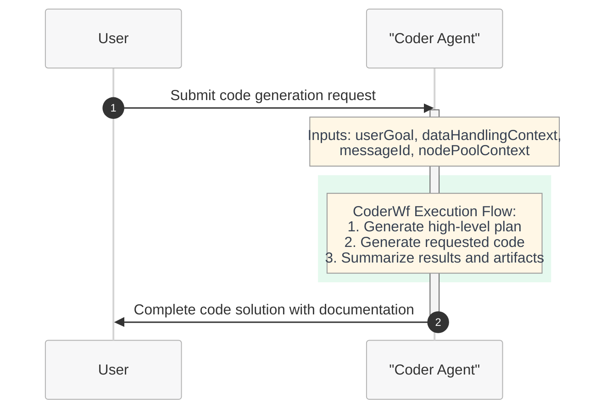
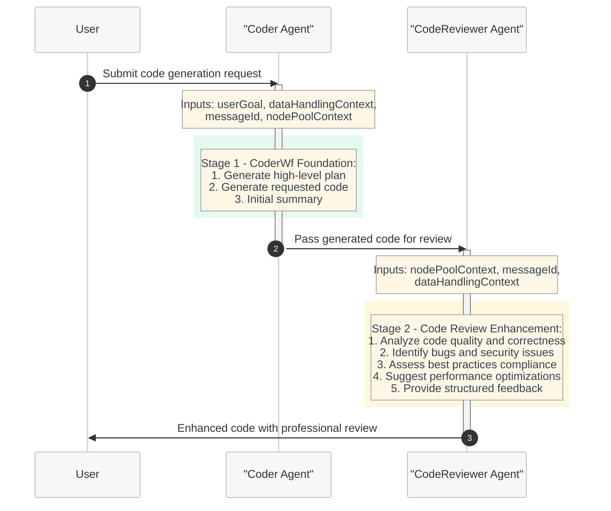
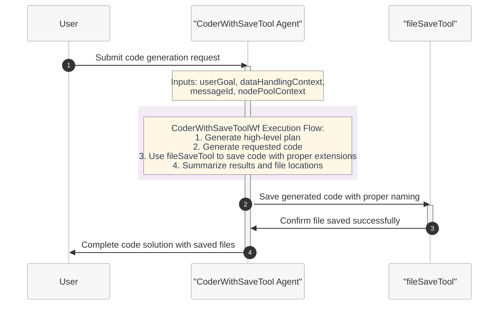

# Silicon Code Generation and Review Workflow - Quickstart Guide

This quickstart guide demonstrates how to use the Microsoft Discovery platform for silicon design code generation and review workflows. This example showcases comprehensive multi-language code generation workflows that combine automated code creation with professional code review for silicon design applications.

## Overview

The silicon code generation and review workflows are designed to help hardware engineers, silicon designers, and software developers generate high-quality code across multiple programming languages while ensuring code quality through automated review processes. These workflows leverage specialized agents to provide comprehensive code generation and quality assurance pipelines for silicon design, hardware description languages, and supporting software development.

## Workflow Architecture

The silicon code generation system provides three distinct workflows that demonstrate different approaches to code generation and file management:

1. **CoderWf**: A foundational single-agent workflow for direct code generation
2. **CoderAndReviewerWf**: An enhanced two-agent workflow that extends CoderWf by adding automated code review
3. **CoderWithSaveToolWf**: A specialized single-agent workflow that extends CoderWf with automatic file saving capabilities

### Workflow 1: CoderWf - Foundational Code Generation

The CoderWf workflow provides a streamlined, single-agent approach to code generation. This workflow serves as the foundation for silicon design code creation.

**CoderWf Characteristics:**
- **Single Agent**: Uses only the Coder agent
- **Direct Output**: Immediate code generation without review
- **Fast Execution**: Streamlined process for rapid development
- **Foundation**: Serves as the base for more complex workflows

### Workflow 2: CoderAndReviewerWf - Enhanced Code Generation with Review

The CoderAndReviewerWf workflow builds upon CoderWf by adding a dedicated code review stage. It uses the same Coder agent from CoderWf and extends the process with the CodeReviewer agent.

**CoderAndReviewerWf Characteristics:**
- **Two-Stage Process**: Extends CoderWf with dedicated review stage
- **Enhanced Quality**: Professional code review and quality assurance
- **Comprehensive Analysis**: Bug detection, security assessment, performance optimization
- **Production Ready**: Suitable for high-quality, production-grade code

### Workflow 3: CoderWithSaveToolWf - Code Generation with File Management

The CoderWithSaveToolWf workflow provides a specialized approach to code generation with built-in file saving capabilities. This workflow uses an enhanced version of the Coder agent that automatically saves generated code with proper file extensions and naming conventions.

**CoderWithSaveToolWf Characteristics:**
- **Single Enhanced Agent**: Uses CoderWithSaveTool agent with built-in file management
- **Automatic File Saving**: Code is automatically saved with appropriate file extensions
- **Proper Naming**: Files are saved with meaningful names based on content and language
- **File Management**: Integrates fileSaveTool for reliable file operations
- **Complete Solution**: Generates and persists code for immediate use

## Workflow Components

### Workflow 1: CoderWf - Foundation Workflow

**CoderWf** serves as the foundational code generation workflow, providing a streamlined single-agent approach for silicon design code creation.

#### Single Agent Architecture
- **Coder Agent**: The core multi-language code generation specialist
- **Direct Execution**: Immediate code generation without intermediate processing
- **Complete Solution**: Generates code with integrated data handling and documentation
- **Foundation Role**: Serves as the building block for more complex workflows

#### CoderWf Process Flow
1. **Planning Phase**: Analyzes user requirements and creates execution plan
2. **Generation Phase**: Produces high-quality code across multiple languages
3. **Summary Phase**: Documents the generated solution and artifacts

### Workflow 2: CoderAndReviewerWf - Enhanced Workflow

**CoderAndReviewerWf** builds directly upon CoderWf by adding a dedicated code review stage, creating a comprehensive two-agent quality assurance pipeline.

#### Two-Agent Architecture
- **Stage 1 - Coder Agent**: Identical functionality to CoderWf foundation
- **Stage 2 - CodeReviewer Agent**: Professional code analysis and quality enhancement
- **Sequential Processing**: Code flows from generation to review for comprehensive quality assurance
- **Enhanced Output**: Combines generated code with professional review insights

#### CoderAndReviewerWf Process Flow
1. **Foundation Generation**: Leverages complete CoderWf functionality (plan → generate → summarize)
2. **Quality Analysis**: CodeReviewer agent analyzes the generated code
3. **Professional Review**: Comprehensive assessment including:
   - Code quality and structure analysis
   - Bug detection and security vulnerability identification  
   - Best practices compliance verification
   - Performance optimization recommendations
   - Documentation and maintainability review

### Workflow 3: CoderWithSaveToolWf - File Management Workflow

**CoderWithSaveToolWf** provides a specialized code generation workflow with built-in file management capabilities, extending the foundational approach with automatic file saving and organization.

#### Enhanced Single Agent Architecture
- **CoderWithSaveTool Agent**: Enhanced version of the Coder agent with file management capabilities
- **fileSaveTool Integration**: Built-in tool for reliable file saving operations
- **Automatic File Management**: Generates and saves code with proper naming conventions
- **Extension Awareness**: Saves files with appropriate extensions based on programming language

#### CoderWithSaveToolWf Process Flow
1. **Planning Phase**: Analyzes user requirements and creates execution plan
2. **Generation Phase**: Produces high-quality code across multiple languages
3. **File Management Phase**: Automatically saves generated code using fileSaveTool
4. **Summary Phase**: Documents the generated solution, file locations, and artifacts

## Supported Programming Languages

All three workflows support comprehensive multi-language code generation:

### Hardware Description Languages
- **Verilog**: RTL design, synthesis-ready code
- **SystemVerilog**: Advanced verification and design constructs
- **VHDL**: Hardware modeling and simulation (through general capabilities)

### General Purpose Languages
- **Python**: Algorithm development, test automation, scripting
- **JavaScript**: Web interfaces, automation scripts
- **C/C++**: System programming, performance-critical applications
- **Java**: Cross-platform applications, enterprise software

### Configuration and Documentation
- **JSON**: Configuration files, data exchange
- **YAML**: Configuration management, workflow definitions
- **XML**: Structured data, configuration files
- **Markdown**: Documentation, technical writing

## Agent Specifications

### Shared Foundation: Coder Agent

The CoderWf and CoderAndReviewerWf workflows utilize the same Coder agent as their foundation, ensuring consistency in code generation capabilities across the workflow ecosystem.

**Purpose**: Multi-language code generation specialist for silicon design workflows
**Model**: GPT-4o (2024-11-20) - Advanced language model for sophisticated code generation
**Used In**: CoderWf (standalone) and CoderAndReviewerWf (Stage 1)

**Key Features**:
- Deterministic output (temperature: 0, top_p: 0) for consistent code generation
- Three-step structured approach: plan → generate → summarize
- Integrated data handling and lifecycle management
- Hardware description language expertise with synthesis-ready output
- Adherence to industry coding standards (PEP 8, C++ standards, etc.)

### Enhanced Agent: CoderWithSaveTool Agent

The CoderWithSaveToolWf workflow uses an enhanced version of the Coder agent with built-in file management capabilities through the integrated fileSaveTool.

**Purpose**: Multi-language code generation with automatic file saving and management
**Model**: GPT-4o (2024-11-20) - Advanced language model for sophisticated code generation with file operations
**Used In**: CoderWithSaveToolWf (standalone with file management)

**Key Features**:
- All capabilities of the foundational Coder agent
- Built-in fileSaveTool integration for automatic file saving
- Proper file extension handling (.py, .js, .v, .sv, .c, .cpp, .java, .json, .yaml, .xml, .md)
- Meaningful file naming based on code content and programming language
- File location tracking and documentation in summary outputs

**Enhanced Capabilities**:
- **File Management**: Automatically saves generated code to `/app/outputs` directory
- **Extension Intelligence**: Selects appropriate file extensions based on programming language
- **Naming Conventions**: Creates meaningful filenames (e.g., 'design.v', 'script.py', 'config.yaml')
- **Location Tracking**: Documents file locations in summary for easy access

**Capabilities**:
- High-level planning before code execution
- Multi-language syntax validation and best practices
- Data handling integration for file management
- Real-time streaming output for progress monitoring

### Enhancement Agent: CodeReviewer Agent

The CodeReviewer agent is exclusively used in CoderAndReviewerWf to extend the foundational code generation with professional quality assurance.

**Purpose**: Specialized code analysis and review for quality assurance enhancement
**Model**: GPT-4o (2024-11-20) - Advanced language model for sophisticated analysis
**Used In**: CoderAndReviewerWf only (Stage 2)

**Key Features**:
- Lower temperature (0.4) for consistent, reliable reviews
- Focused sampling (top_p: 0.8) for deterministic evaluation
- Structured feedback with actionable recommendations
- Multi-language code analysis capabilities

**Review Capabilities**:
- **Code Quality Analysis**: Structure, readability, maintainability assessment
- **Syntactical Correctness**: Language-specific syntax validation
- **Bug Detection**: Logic errors, runtime issues, potential failures
- **Security Assessment**: Vulnerability identification, unsafe practices
- **Performance Review**: Optimization opportunities, efficiency improvements
- **Best Practices**: Industry standards, coding conventions compliance
- **Documentation Review**: Code comments, inline documentation quality

### Workflow-Agent Relationship

| Workflow | Agents Used | Purpose |
|----------|-------------|---------|
| **CoderWf** | Coder Agent (standalone) | Direct code generation for rapid development |
| **CoderAndReviewerWf** | Coder Agent + CodeReviewer Agent | Enhanced code generation with quality assurance |
| **CoderWithSaveToolWf** | CoderWithSaveTool Agent (standalone) | Code generation with automatic file saving and management |

## Getting Started

### Prerequisites

Before using these silicon code generation workflows, complete the setup steps outlined in the [main quickstart guide](../../../../2-getting-started/quickstart.md):

1. **Prerequisites**: Register resource providers, assign roles, create virtual network and subnets, and set up User Assigned Managed Identity (UAMI)
2. **Create a shared storage**: Set up Microsoft Discovery Shared storage for code generation operations
3. **Create a supercomputer**: Deploy supercomputer with node pools for running code generation agents
4. **Create a workspace**: Establish a collaborative environment for managing silicon design initiatives

### Required Tools

The CoderWithSaveToolWf workflow requires the fileSaveTool from the tool-artifacts for automatic file saving functionality:

| Tool | Description | Purpose | Usage |
|------|-------------|---------|-------|
| **fileSaveTool** | Intelligent file saving with automatic extension detection | Automatically saves generated code with proper file extensions and meaningful names | Used by CoderWithSaveTool agent for reliable file management operations |

**fileSaveTool Capabilities**:
- **Automatic Extension Detection**: Determines appropriate file extensions based on code content (.py, .v, .sv, .c, .cpp, etc.)
- **Intelligent Naming**: Creates meaningful filenames based on code purpose and content
- **Error Handling**: Robust error handling for file operations with detailed feedback
- **Path Management**: Handles file paths and directory creation as needed
- **Content Validation**: Ensures code content integrity during save operations

### Workflow Setup

Once you have completed the prerequisites, follow these steps to set up and use the silicon code generation workflows:

1. **Prepare your input**: Define your code generation requirements. Examples include:
   - Hardware description language modules (Verilog controllers, SystemVerilog testbenches)
   - Python automation scripts for silicon design flows
   - Configuration files for EDA tools
   - Documentation and technical specifications

2. **Create agents**: Deploy the code generation agents required for silicon workflows. For detailed guidance, see [Agents creation guide](../../../../4-how-to/6-tools-models-agents/c--agent-deployment.md):
   - **Coder Agent**: Multi-language code generation specialist
   - **CoderWithSaveTool Agent**: Enhanced code generation specialist with file management capabilities
   - **CodeReviewer Agent**: Code quality analysis and review specialist

3. **Create workflow**: Configure the appropriate workflow based on your requirements:

   **For CoderWf (Foundation Workflow):**
   - Single-agent workflow using only the Coder agent
   - Direct code generation without review
   - Ideal for rapid prototyping and development
   
   **For CoderAndReviewerWf (Enhanced Workflow):**
   - Two-agent workflow that builds on CoderWf foundation
   - Adds CodeReviewer agent for comprehensive quality assurance
   - Same Coder agent as CoderWf plus professional review capabilities
   - Recommended for production-quality code

   **For CoderWithSaveToolWf (File Management Workflow):**
   - Single-agent workflow using the enhanced CoderWithSaveTool agent
   - Automatic file saving with proper extensions and naming conventions
   - Integrates fileSaveTool for reliable file management operations
   - Perfect for scenarios requiring immediate file persistence and organization
   
   For detailed guidance, see [Workflow creation guide](../../../../4-how-to/6-tools-models-agents/).

4. **Create a project**: Set up a project in your workspace to organize and execute your code generation tasks. Projects provide the execution environment for running workflows and managing computational resources. For detailed guidance, see [Project creation guide](../../../../4-how-to/7-projects/).

5. **Define your goal**: Specify what code you need with a detailed prompt
6. **Choose your workflow**: Select CoderWf for simple generation, CoderAndReviewerWf for generation with review, or CoderWithSaveToolWf for generation with automatic file saving
7. **Test your prompt in investigation**: The system will generate code according to your specifications
8. **Review results**: Get high-quality code with optional professional review and quality assessment

## Example Queries

### Verilog/SystemVerilog Design
- "Create a 32-bit RISC-V ALU module in Verilog with full arithmetic and logic operations"
- "Generate a SystemVerilog testbench for a FIFO controller with randomized test vectors"
- "Design a Verilog state machine for an elevator controller with safety interlocks"

### Python Development
- "Create a Python script to parse synthesis reports and extract timing violations"
- "Generate a Python class for managing EDA tool flows with error handling and logging"
- "Write Python automation for running regression tests on RTL designs"

### Configuration and Documentation
- "Generate a YAML configuration file for a continuous integration pipeline for silicon design"
- "Create JSON schemas for design configuration management"
- "Write comprehensive Markdown documentation for a hardware IP block"

### Multi-Language Projects
- "Create a complete verification environment with Verilog DUT, SystemVerilog testbench, and Python analysis scripts"
- "Generate a hardware-software co-design project with C firmware and Verilog hardware"

## Workflow Selection Guide

### Choose CoderWf (Foundation Workflow) when:
- **Rapid Development**: Need fast, direct code generation without review overhead
- **Prototyping**: Creating proof-of-concepts or experimental code
- **Learning/Education**: Educational purposes or learning new languages/concepts
- **Simple Tasks**: Straightforward code generation with external quality control
- **Iterative Development**: Quick iterations where review happens externally
- **Resource Optimization**: Minimal computational resources required

**CoderWf Benefits:**
- Fastest execution time
- Lowest resource utilization
- Direct, immediate results
- Foundation for other workflows
- Streamlined single-agent process

### Choose CoderAndReviewerWf (Enhanced Workflow) when:
- **Production Code**: Developing code for production silicon design systems
- **Quality Assurance**: Comprehensive code review and quality validation required
- **Safety-Critical Systems**: High-reliability or safety-critical applications
- **Team Standards**: Ensuring adherence to coding standards and best practices
- **Learning Enhancement**: Automated feedback for improving coding skills
- **Security Sensitive**: Code requiring security vulnerability assessment
- **Performance Critical**: Applications where performance optimization is crucial

**CoderAndReviewerWf Benefits:**
- Professional-grade code quality
- Comprehensive bug detection
- Security vulnerability identification
- Performance optimization suggestions  
- Best practices enforcement
- Educational feedback for developers
- Production-ready output

### Choose CoderWithSaveToolWf (File Management Workflow) when:
- **Automated File Management**: Need automatic file saving with proper extensions and naming
- **Batch Code Generation**: Generating multiple files that need to be saved systematically
- **Integration Workflows**: Part of larger automation pipelines requiring file output
- **Rapid Deployment**: Need generated code immediately saved for subsequent processing
- **Organized Output**: Require structured file organization with meaningful names
- **Streamlined Development**: Combine generation and file management in single workflow

**CoderWithSaveToolWf Benefits:**
- Automatic file saving with intelligent naming
- Proper file extension detection and application
- Streamlined workflow with built-in file management
- Reduced manual file handling overhead
- Organized output structure
- Integration-ready file generation

### Workflow Evolution Path

Organizations typically follow this evolution path:

1. **Start with CoderWf**: Learn the platform, develop initial prototypes
2. **Graduate to CoderAndReviewerWf**: As requirements mature and quality becomes critical
3. **Adopt CoderWithSaveToolWf**: For automated file management and integration workflows
4. **Hybrid Approach**: Use appropriate workflow based on specific requirements:
   - CoderWf for experimentation and rapid prototyping
   - CoderAndReviewerWf for production-quality code requiring review
   - CoderWithSaveToolWf for automated file generation and management needs

### Resource Considerations

| Aspect | CoderWf | CoderAndReviewerWf | CoderWithSaveToolWf |
|--------|---------|-------------------|-------------------|
| **Execution Time** | Fast (single agent) | Moderate (two sequential agents) | Fast (single enhanced agent) |
| **Compute Resources** | Lower | Higher | Lower-Moderate |
| **Output Quality** | Good | Excellent | Good |
| **Review Depth** | None | Comprehensive | None |
| **File Management** | Manual | Manual | Automatic |
| **Best For** | Development/Prototyping | Production/Quality-Critical | Automation/Integration |

This workflow demonstrates the power of automated code generation and review in silicon design, providing engineers with comprehensive toolsets for creating high-quality, standards-compliant code across multiple programming languages while ensuring professional-grade quality assurance.