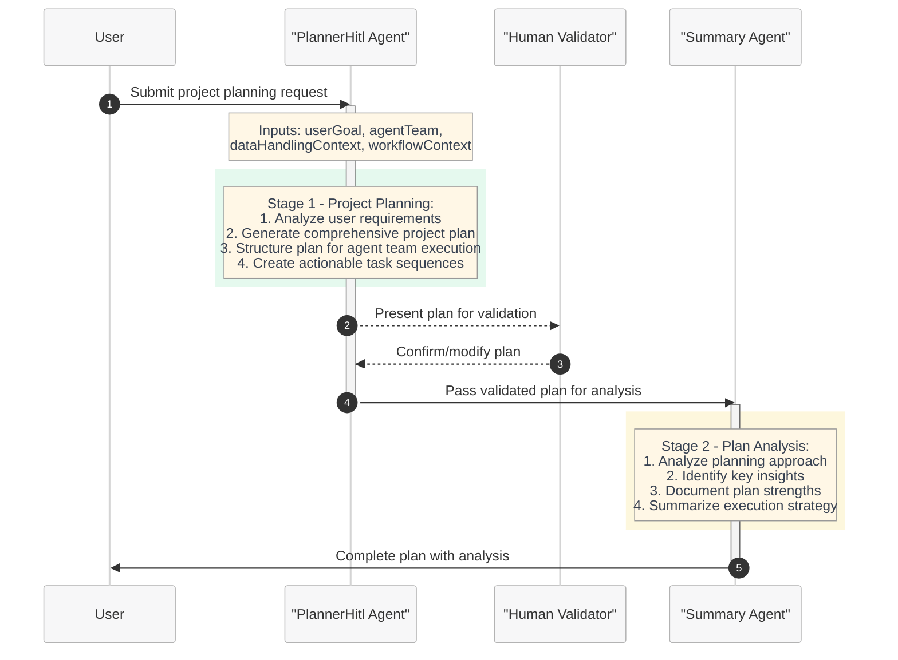

# Silicon Planning and Human-in-the-Loop Workflow - Quickstart Guide

This quickstart guide demonstrates how to use the Microsoft Discovery platform for silicon design planning workflows with human-in-the-loop capabilities. This example showcases comprehensive planning workflows that enable intelligent project coordination and user validation before execution.

## Overview

The silicon planning workflow is designed to help hardware engineers, silicon designers, and project managers create comprehensive project plans through intelligent AI coordination with human oversight. This workflow leverages specialized planning agents with human-in-the-loop confirmation to provide structured, actionable plans for silicon design projects while maintaining human control over the planning process.

## Workflow Architecture

The silicon planning system provides a sophisticated workflow that combines AI planning capabilities with human validation:

**PlannerHitlWf**: A comprehensive three-stage planning workflow with human-in-the-loop validation

### Workflow: PlannerHitlWf - Comprehensive Planning with Human Validation

The PlannerHitlWf workflow provides an intelligent planning approach with built-in human validation capabilities. This workflow serves as the foundation for silicon design project coordination.

**PlannerHitlWf Characteristics:**
- **Human-in-the-Loop**: Built-in plan validation and confirmation capabilities
- **Three-Stage Process**: Planning → Summary → Completion with human oversight
- **Agent Team Coordination**: Plans for specialized agent teams (5-agent system)
- **Comprehensive Planning**: Structured approach to project coordination and execution
participant User
participant Coder as "Coder Agent"
participant Reviewer as "CodeReviewer Agent"
User->>Coder: Submit code generation request
activate Coder
note over Coder: Inputs: userGoal, dataHandlingContext, messageId, nodePoolContext
rect rgba(46, 204, 113, 0.12)
note over Coder: Stage 1 - CoderWf Foundation: 1. Generate high-level plan 2. Generate requested code 3. Initial summary
end
Coder->>Reviewer: Pass generated code for review
deactivate Coder
activate Reviewer
note over Reviewer: Inputs: nodePoolContext, messageId, dataHandlingContext
rect rgba(241, 196, 15, 0.14)
note over Reviewer: Stage 2 - Code Review Enhancement: 1. Analyze code quality and correctness 2. Identify bugs and security issues 3. Assess best practices compliance 4. Suggest performance optimizations 5. Provide structured feedback
end
Reviewer->>User: Enhanced code with professional review
deactivate Reviewer

**CoderAndReviewerWf Characteristics:**
- **Two-Stage Process**: Extends CoderWf with dedicated review stage
- **Enhanced Quality**: Professional code review and quality assurance
- **Comprehensive Analysis**: Bug detection, security assessment, performance optimization
- **Production Ready**: Suitable for high-quality, production-grade code

## Workflow Components

### PlannerHitlWf - Comprehensive Planning Workflow

**PlannerHitlWf** provides an intelligent planning workflow with human-in-the-loop validation, creating comprehensive project plans for silicon design and development projects.

#### Three-Stage Architecture
- **Stage 1 - PlannerHitl Agent**: Intelligent planning with human validation capabilities
- **Stage 2 - Summary Agent**: Plan analysis and insight generation  
- **Stage 3 - Completion**: Finalized plan ready for execution by specialized agents
- **Human Integration**: Built-in plan confirmation and validation process

#### PlannerHitlWf Process Flow
1. **Planning Phase**: PlannerHitl agent analyzes user requirements and creates comprehensive project plans
2. **Human Validation**: Plan confirmation through discoveryExtensions.planConfirmation 
3. **Summary Phase**: Summary agent analyzes the validated plan and provides insights
4. **Completion**: Finalized plan with analysis ready for specialized agent execution

### Agent Team Coordination

The planning workflow coordinates a simplified 5-agent team designed for accessibility:

1. **Planner**: Master coordinator and strategic planner
   - Breaks down complex user goals into manageable tasks
   - Creates step-by-step execution plans with proper sequencing
   - Coordinates overall project strategy and resource allocation

2. **Designer**: Creative design and architecture specialist
   - Transforms requirements into concrete design solutions
   - Creates system architectures and technical specifications
   - Develops user interfaces and experience designs

3. **Developer**: Implementation and coding expert
   - Writes high-quality, efficient code in multiple languages
   - Implements designs according to specifications
   - Integrates different system components

4. **QualityChecker**: Validation and review specialist
   - Reviews all work products for accuracy and completeness
   - Identifies errors, inconsistencies, and improvement opportunities
   - Validates that solutions meet original requirements

5. **TestReporter**: Verification and communication expert
   - Creates and executes comprehensive test plans
   - Validates functionality under various scenarios
   - Documents results and generates final reports
## Human-in-the-Loop Planning Features

The PlannerHitlWf workflow emphasizes human control and validation throughout the planning process:

### Plan Confirmation Capabilities
- **discoveryExtensions.planConfirmation**: Built-in plan validation mechanism
- **Human Oversight**: Users can review, modify, and approve plans before execution
- **Iterative Refinement**: Plans can be adjusted based on human feedback
- **Quality Assurance**: Human validation ensures plans meet business requirements

### Planning Scope and Applications
The planning workflow is designed for various project types:

#### Silicon Design Projects
- RTL design planning and coordination
- Verification strategy development  
- Tool integration and workflow planning
- Design review and validation processes

#### General Development Projects  
- Software architecture planning
- System integration coordination
- Quality assurance strategy development
- Testing and validation planning

## Supported Planning Domains

The planning workflow provides comprehensive coverage across multiple domains:

### Project Management
- **Task Decomposition**: Breaking complex goals into manageable tasks
- **Resource Planning**: Agent coordination and resource allocation
- **Timeline Development**: Sequencing and dependency management
- **Risk Assessment**: Identifying potential issues and mitigation strategies

### Technical Planning
- **Architecture Design**: System and component architecture planning
- **Implementation Strategy**: Code development and integration planning  
- **Quality Assurance**: Testing and validation strategy development
- **Documentation Planning**: Technical writing and documentation coordination

## Agent Specifications

### PlannerHitl Agent - Central Coordination Agent

The PlannerHitl agent serves as the central coordinator for multi-agent workflows, providing intelligent planning with human oversight capabilities.

**Purpose**: Multi-domain planning specialist with human-in-the-loop validation
**Model**: GPT-4o (2024-11-20) - Advanced language model for sophisticated planning coordination
**Discovery Extensions**: plan_confirmation enabled for human validation

**Key Features**:
- Human-in-the-loop plan validation through discoveryExtensions.planConfirmation
- Multi-step plan creation with clear agent assignments and task sequencing
- Knowledge base integration for research-based planning queries
- Structured markdown plan output format for clarity and actionability
- Agent team coordination across 5 specialized roles (Planner, Designer, Developer, QualityChecker, TestReporter)
- Data handling tool integration when appropriate for data-driven planning

**Planning Capabilities**:
- **Requirements Analysis**: Deep understanding of user goals and project constraints
- **Task Decomposition**: Breaking complex projects into manageable, sequenced tasks
- **Agent Assignment**: Intelligent matching of tasks to appropriate specialized agents
- **Resource Allocation**: Planning for compute resources and timeline management
- **Risk Assessment**: Identifying potential issues and planning mitigation strategies

### Summary Agent - Plan Analysis Specialist

The Summary agent provides comprehensive analysis and insights about generated plans, enhancing the planning workflow with analytical depth.

**Purpose**: Plan analysis and insight generation specialist
**Integration**: Works seamlessly with PlannerHitl output to provide comprehensive plan documentation
**Output**: Enhanced plan documentation with analysis, insights, and execution recommendations

### Workflow-Agent Relationship

| Workflow | Agents Used | Purpose |
|----------|-------------|---------|
| **PlannerHitlWf** | PlannerHitl Agent + Summary Agent | Comprehensive planning with human validation and analysis |

## Getting Started

### Prerequisites

Before using the silicon planning workflow, complete the setup steps outlined in the [main quickstart guide](../../../../2-getting-started/quickstart.md):

1. **Prerequisites**: Register resource providers, assign roles, create virtual network and subnets, and set up User Assigned Managed Identity (UAMI)
2. **Create a shared storage**: Set up Microsoft Discovery Shared storage for planning operations
3. **Create a supercomputer**: Deploy supercomputer with node pools for running planning agents
4. **Create a workspace**: Establish a collaborative environment for managing silicon design planning initiatives

### Workflow Setup

Once you have completed the prerequisites, follow these steps to set up and use the silicon planning workflow:

1. **Prepare your planning requirements**: Define your project planning needs. Examples include:
   - Silicon design project coordination and task planning
   - Multi-agent workflow orchestration planning
   - Design verification strategy and test planning
   - Tool integration and automation planning
2. **Create agents**: Deploy the planning agents required for silicon workflows. For detailed guidance, see [Agents creation guide](../../../../4-how-to/6-tools-models-agents/c--agent-deployment.md):
   - **PlannerHitl Agent**: Central coordination agent with human-in-the-loop capabilities
   - **Summary Agent**: Plan analysis and insight generation specialist

3. **Create workflow**: Configure the PlannerHitlWf workflow for comprehensive planning with human validation:
   - Three-stage workflow: ProjectPlanning → Summarize → End
   - Built-in human-in-the-loop validation through discoveryExtensions.planConfirmation
   - Coordinates 5-agent specialized team (Planner, Designer, Developer, QualityChecker, TestReporter)
   - Provides comprehensive project plans with analysis and insights
   
   For detailed guidance, see [Workflow creation guide](../../../../4-how-to/6-tools-models-agents/).

4. **Create a project**: Set up a project in your workspace to organize and execute your planning tasks. Projects provide the execution environment for running workflows and managing computational resources. For detailed guidance, see [Project creation guide](../../../../4-how-to/7-projects/).

5. **Define your planning goal**: Specify what project or initiative you need planned with a detailed description
6. **Execute the workflow**: Run PlannerHitlWf with human-in-the-loop validation
7. **Validate the plan**: Review and confirm the generated plan through the human validation interface
8. **Review analysis**: Get comprehensive plan analysis and insights from the Summary agent

## Example Planning Queries

### Silicon Design Project Planning
- "Plan a complete 32-bit RISC-V processor design project including RTL development, verification, and testing phases"
- "Create a comprehensive plan for migrating a legacy silicon design to a new process node"
- "Plan a verification strategy for a complex SoC design with multiple IP blocks and interfaces"

### Multi-Agent Workflow Coordination
- "Plan a hardware-software co-design project requiring coordination between RTL, firmware, and software teams"
- "Create a plan for automated regression testing across multiple silicon design projects"
- "Plan the integration of multiple EDA tools into a unified design flow"

### Design Verification and Testing
- "Plan a comprehensive verification strategy for a high-speed interface controller"
- "Create a test plan for silicon bring-up and characterization of a new chip design"
- "Plan the development of a reusable verification IP library for common interfaces"

### Process and Methodology Planning
- "Plan the implementation of a continuous integration system for silicon design flows"
- "Create a plan for standardizing design review processes across multiple silicon projects"
- "Plan the adoption of new EDA tools and methodologies in an existing design environment"

## Planning Workflow Benefits

### Choose PlannerHitlWf when you need:
- **Human Oversight**: Critical projects requiring human validation and approval
- **Comprehensive Planning**: Detailed, multi-phase project coordination
- **Agent Team Coordination**: Complex projects requiring multiple specialized roles
- **Risk Management**: Projects where planning validation prevents costly mistakes  
- **Stakeholder Alignment**: Plans that need review and approval from multiple parties
- **Quality Assurance**: Planning processes that must meet strict quality standards
- **Documentation**: Comprehensive planning documentation with analysis and insights

**CoderWf Benefits:**
- Fastest execution time
- Lowest resource utilization
- Direct, immediate results
- Foundation for other workflows
- Streamlined single-agent process

### Choose CoderAndReviewerWf (Enhanced Workflow) when:
- **Production Code**: Developing code for production silicon design systems
- **Quality Assurance**: Comprehensive code review and quality validation required
- **Safety-Critical Systems**: High-reliability or safety-critical applications
- **Team Standards**: Ensuring adherence to coding standards and best practices
- **Learning Enhancement**: Automated feedback for improving coding skills
- **Security Sensitive**: Code requiring security vulnerability assessment
- **Performance Critical**: Applications where performance optimization is crucial

**CoderAndReviewerWf Benefits:**
- Professional-grade code quality
- Comprehensive bug detection
- Security vulnerability identification
- Performance optimization suggestions  
- Best practices enforcement
- Educational feedback for developers
- Production-ready output

### Workflow Evolution Path

Organizations typically follow this evolution path:

1. **Start with CoderWf**: Learn the platform, develop initial prototypes
2. **Graduate to CoderAndReviewerWf**: As requirements mature and quality becomes critical
3. **Hybrid Approach**: Use CoderWf for experimentation, CoderAndReviewerWf for production

### Resource Considerations

| Aspect | CoderWf | CoderAndReviewerWf |
|--------|---------|-------------------|
| **Execution Time** | Fast (single agent) | Moderate (two sequential agents) |
| **Compute Resources** | Lower | Higher |
| **Output Quality** | Good | Excellent |
| **Review Depth** | None | Comprehensive |
| **Best For** | Development/Prototyping | Production/Quality-Critical |

This workflow demonstrates the power of automated code generation and review in silicon design, providing engineers with comprehensive toolsets for creating high-quality, standards-compliant code across multiple programming languages while ensuring professional-grade quality assurance.