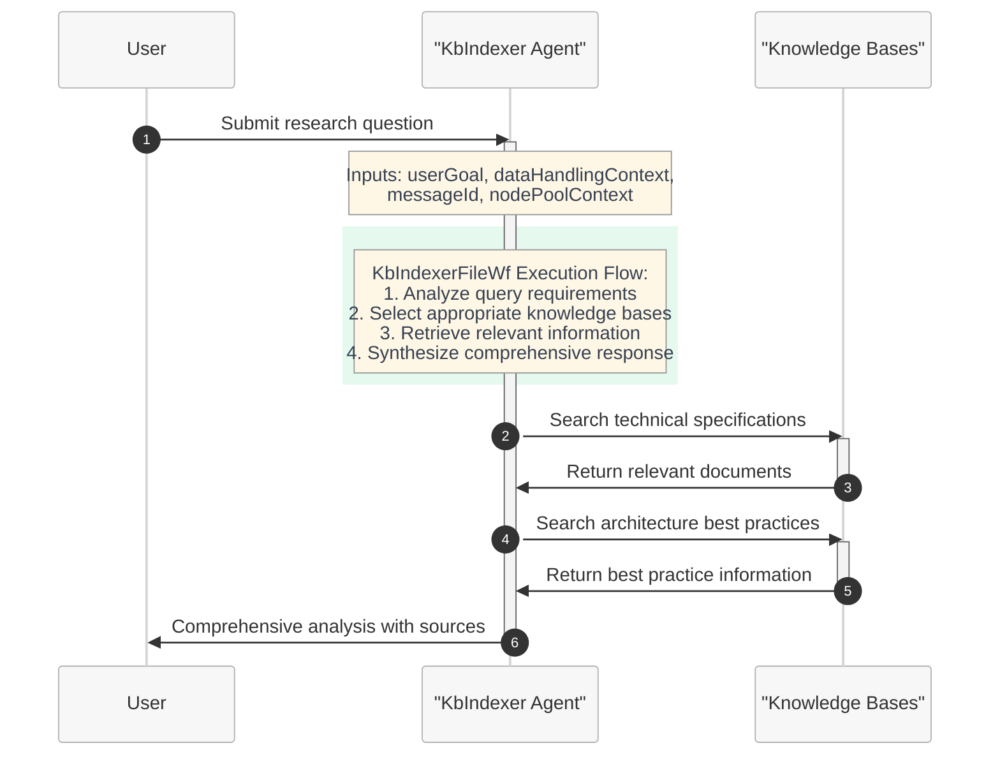

# Knowledge Base Analyzer Workflow - Quickstart Guide

This quickstart guide demonstrates how to use the Microsoft Discovery platform for knowledge base analysis workflows. This example showcases how to leverage specialized AI agents to search, analyze, and extract insights from comprehensive knowledge bases for enhanced research and analysis capabilities.

## Overview

The Knowledge Base Analyzer workflow is designed to help researchers, engineers, and analysts effectively search and analyze knowledge base content to answer questions and provide insights. This workflow leverages a specialized agent with access to technical specification knowledge bases and architecture best-practices databases for comprehensive research support.

## Workflow Architecture

The Knowledge Base Analyzer system provides a streamlined single-agent workflow that demonstrates efficient knowledge retrieval and analysis:

**KbIndexerFileWf**: A foundational workflow for knowledge base search and analysis using the KbIndexer agent.

### Workflow: KbIndexerFileWf - Knowledge Base Analysis

The KbIndexerFileWf workflow provides a streamlined approach to knowledge base analysis and question answering. This workflow serves as an essential tool for research and information retrieval from specialized knowledge bases.

**KbIndexerFileWf Characteristics:**
- **Single Agent**: Uses only the KbIndexer agent
- **Knowledge Base Access**: Direct integration with technical and architecture knowledge bases
- **Intelligent Search**: Analyzes queries to select optimal knowledge sources
- **Sourced Results**: Provides attributions and references for all retrieved information

## Workflow Components

### KbIndexerFileWf - Foundation Workflow

**KbIndexerFileWf** serves as the foundational knowledge base analysis workflow, providing comprehensive research capabilities through specialized knowledge base access.

#### Single Agent Architecture
- **KbIndexer Agent**: Specialized knowledge base analysis and search agent
- **Direct Execution**: Immediate knowledge retrieval and analysis
- **Multi-Source Integration**: Access to multiple specialized knowledge bases
- **Comprehensive Coverage**: Technical specifications and architecture best practices

#### KbIndexerFileWf Process Flow
1. **Query Analysis Phase**: Determines what type of information is needed from the user goal
2. **Knowledge Base Selection Phase**: Chooses appropriate knowledge bases based on query requirements
3. **Information Retrieval Phase**: Searches selected knowledge bases for relevant content
4. **Validation Phase**: Checks consistency and relevance of retrieved information
5. **Synthesis Phase**: Combines retrieved knowledge with analytical insights

## Supported Knowledge Domains

The workflow provides access to specialized knowledge bases covering:

### Technical Specifications
- **Component Documentation**: Detailed technical specifications and implementation guides
- **API References**: Comprehensive programming interfaces and usage patterns
- **Standards and Protocols**: Industry standards and communication protocols
- **Implementation Details**: Low-level technical implementation information

### Architecture Best Practices
- **Design Patterns**: Proven architectural patterns and their applications
- **Performance Optimization**: Best practices for system performance and efficiency
- **Security Guidelines**: Security architecture principles and implementation strategies
- **Scalability Patterns**: Patterns for building scalable and maintainable systems

### Research and Publications
- **Recent Findings**: Latest research publications and experimental results
- **Comparative Analysis**: Studies comparing different approaches and technologies
- **Experimental Procedures**: Detailed methodologies and protocols
- **Regulatory Information**: Compliance requirements and safety guidelines

## Agent Specifications

### KbIndexer Agent

**Purpose**: AI agent with specialized knowledge base access for enhanced research and analysis capabilities  
**Model**: GPT-4o (2024-11-20) - Advanced language model for sophisticated knowledge synthesis  
**Used In**: KbIndexerFileWf (standalone)

**Key Features**:
- **Knowledge Base Integration**: Direct access to technical specification and architecture databases
- **Intelligent Tool Selection**: Analyzes query requirements to choose optimal knowledge sources
- **Multi-Source Strategy**: Can combine information from multiple knowledge bases for comprehensive coverage
- **Source Attribution**: Always provides specific source citations and references
- **Quality Assessment**: Indicates confidence levels based on source quality and consistency

**Core Capabilities**:
- Access to technical specification knowledge bases
- Architecture best-practices databases integration
- Query analysis and knowledge base selection
- Information validation and consistency checking
- Response synthesis with source attribution

**Knowledge Base Strategy**:
1. **Query Assessment**: Determines if external knowledge is needed
2. **Source Selection**: Chooses appropriate knowledge bases based on content and domain
3. **Information Retrieval**: Uses specialized tools to gather relevant data
4. **Validation**: Checks consistency and relevance of retrieved information
5. **Synthesis**: Combines retrieved and existing knowledge into comprehensive responses

## Workflow Configuration

### State Configuration

The workflow consists of two primary states:

1. **KbIndexerWfEntryState**: The main processing state where the KbIndexer agent performs knowledge base analysis
2. **End**: Terminal state indicating successful completion

### Variable Configuration

Essential workflow variables include:

- **userGoal**: The user's research question or analysis request
- **nodePoolContext**: Compute resource allocation context for agent execution
- **messageId**: Unique identifier for tracking message flow and analysis sessions
- **dataHandlingContext**: Comprehensive data lifecycle management capabilities and guidelines
- **MainThread**: Primary execution thread for workflow processing

### Data Handling Context

The workflow includes comprehensive data handling guidelines that ensure:
- Proper virtual path management for data flow between workflow steps
- Absolute path requirements for all file operations
- Container path mapping for tool integration
- Data asset promotion guidelines for end-user deliverables

## Use Cases

### Research and Development
- **Literature Review**: Comprehensive analysis of recent research publications
- **Technology Assessment**: Evaluation of different technical approaches and solutions
- **Best Practice Discovery**: Finding proven patterns and methodologies for specific domains
- **Regulatory Compliance**: Understanding requirements and guidelines for specific industries

### Technical Documentation
- **API Research**: Finding detailed documentation and usage examples for specific APIs
- **Implementation Guidance**: Discovering best practices for technical implementations
- **Troubleshooting Support**: Accessing known solutions and debugging approaches
- **Standards Compliance**: Understanding industry standards and compliance requirements

### Architecture and Design
- **Pattern Discovery**: Finding appropriate design patterns for specific use cases
- **Performance Optimization**: Accessing best practices for system performance improvement
- **Security Analysis**: Understanding security implications and best practices
- **Scalability Planning**: Finding patterns and approaches for building scalable systems

## Getting Started

### Prerequisites
- Access to Microsoft Discovery platform
- Appropriate permissions for knowledge base access
- Understanding of your research domain and specific information needs

### Basic Usage

1. **Formulate Your Question**: Clearly define what information you need from the knowledge bases
2. **Submit Your Query**: Provide your research question as the userGoal input
3. **Review Results**: Analyze the comprehensive response with source attributions
4. **Follow Up**: Use the insights to inform your research or development activities

### Best Practices

- **Be Specific**: Provide detailed and specific questions for better knowledge retrieval
- **Domain Awareness**: Understand which knowledge domains are relevant to your query
- **Source Verification**: Always review the provided source attributions for credibility
- **Iterative Approach**: Use initial results to refine follow-up questions for deeper analysis

## Expected Outputs

The KbIndexer agent provides structured responses that include:

1. **Direct Answer**: Clear response to the primary research question
2. **Supporting Evidence**: Detailed information retrieved from knowledge bases with source citations
3. **Context**: Background information from training knowledge to enhance understanding
4. **Limitations**: Clear indication of any gaps, uncertainties, or areas requiring additional research
5. **Confidence Indicators**: Assessment of result quality based on source reliability and consistency

## Integration and Extensibility

The Knowledge Base Analyzer workflow is designed to integrate seamlessly with other Discovery platform workflows:

- **Research Pipeline Integration**: Can be used as a research step in larger workflows
- **Decision Support**: Provides evidence-based information for technical decision making
- **Documentation Enhancement**: Supports comprehensive documentation creation with authoritative sources
- **Continuous Learning**: Results can inform and enhance other workflow components

This workflow represents a foundational capability for knowledge-driven research and analysis within the Microsoft Discovery platform ecosystem.
