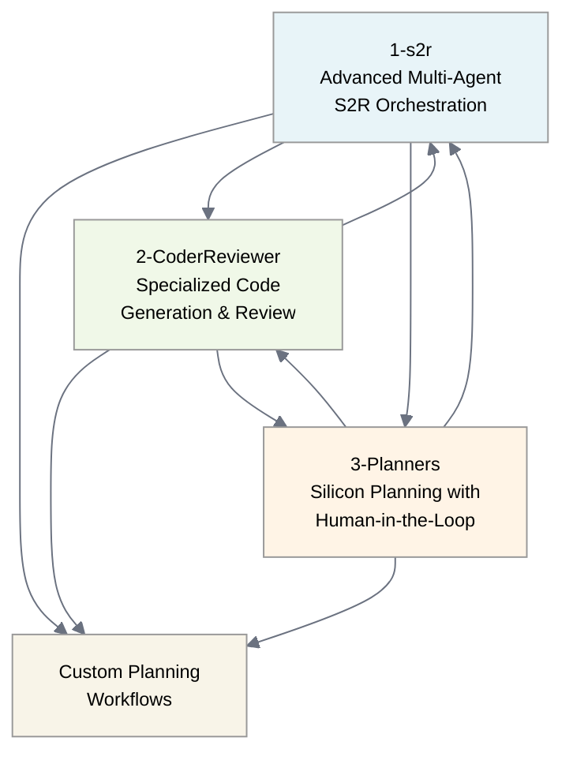

# Silicon Design Sample Scenarios - Overview

This directory contains sample scenarios demonstrating Microsoft Discovery platform capabilities for silicon design and hardware engineering workflows. Each sub-directory represents a specific use case targeting different personas and complexity levels within the silicon design ecosystem.

## Available Sample Scenarios

### 1-s2r - Silicon-to-RTL (S2R) Advanced Multi-Agent Orchestration
**Target Persona:** Senior silicon architects, experienced hardware design teams, and advanced automation engineers
**Use Case:** Comprehensive silicon design workflows with sophisticated multi-agent coordination and complex system orchestration

**What's Included:**
- Advanced multi-agent workflow orchestration for complete silicon design flows
- Sophisticated agent definitions handling complex design-to-manufacturing pipelines
- Comprehensive workflow templates for end-to-end silicon realization
- Advanced data assets supporting complete S2R design methodologies
- Professional tool artifacts for enterprise-grade silicon design automation

**Best For:**
- Complete silicon-to-RTL design flow automation
- Enterprise-scale silicon design projects with multiple design domains
- Complex multi-disciplinary workflows spanning design, verification, and manufacturing
- Advanced system-level integration and optimization
- Sophisticated design methodology implementation
- Large-scale silicon design teams requiring coordinated multi-agent systems

**Skills Required:** Expert-level silicon design knowledge, advanced workflow orchestration experience, multi-agent system expertise

---

### 2-CoderReviewer - Specialized Code Generation and Review
**Target Persona:** Software developers, verification engineers, and code-focused silicon design team members
**Use Case:** Specialized multi-language code generation with targeted automated quality assurance and file management for silicon design workflows

**What's Included:**
- **CoderWf**: Foundational single-agent code generation workflow
- **CoderAndReviewerWf**: Enhanced two-agent workflow with automated code review
- **CoderWithSaveToolWf**: Specialized single-agent workflow with automatic file saving capabilities
- **Coder Agent**: Multi-language code generation specialist (Verilog, SystemVerilog, Python, C++, JavaScript, JSON, YAML, XML, Markdown)
- **CoderWithSaveTool Agent**: Enhanced code generation agent with built-in file management through fileSaveTool integration
- **CodeReviewer Agent**: Specialized code analysis and quality assurance
- **fileSaveTool**: Intelligent file saving tool with automatic extension detection and meaningful naming
- Comprehensive documentation with three-workflow architecture and file management capabilities

**Best For:**
- Specialized code generation for silicon design projects with automatic file management
- Targeted automated code review and quality assurance workflows
- Multi-language development within larger silicon workflows requiring file persistence
- Code quality enforcement in development teams with integrated file operations
- Educational code generation examples and learning with immediate file output
- Rapid prototyping of code components for silicon design with organized file structure

**Skills Required:** Strong programming experience, code quality best practices, silicon design software development

---

### 3-Planners - Silicon Planning with Human-in-the-Loop Validation
**Target Persona:** Project managers, silicon design team leads, and workflow coordinators
**Use Case:** Comprehensive project planning workflows with human-in-the-loop validation for silicon design and development projects

**What's Included:**
- **PlannerHitlWf**: Comprehensive planning workflow with built-in human validation capabilities
- **PlannerHitl Agent**: Central coordination agent with human-in-the-loop plan confirmation
- **Summary Agent**: Plan analysis and insight generation specialist
- **5-Agent Team Coordination**: Plans for simplified specialized agent teams (Planner, Designer, Developer, QualityChecker, TestReporter)
- **Human Validation**: Built-in plan confirmation through discoveryExtensions.planConfirmation
- **Comprehensive Documentation**: Planning workflow architecture with human oversight capabilities

**Best For:**
- Silicon design project coordination and strategic planning
- Multi-agent workflow orchestration with human oversight
- Design verification strategy and comprehensive test planning
- Tool integration and automation planning workflows
- Complex project management requiring structured, validated plans
- Educational demonstrations of planning capabilities with accessible agent descriptions

**Skills Required:** Project management experience, silicon design workflow knowledge, multi-agent system coordination understanding

---

## Choosing the Right Scenario

### Start with 1-s2r if you:
- Need comprehensive silicon-to-RTL workflow orchestration
- Work with complex multi-agent coordination systems
- Require end-to-end silicon design flow automation
- Manage enterprise-scale silicon design projects
- Need sophisticated design methodology implementation
- Want to understand advanced multi-agent workflow patterns

### Move to 2-CoderReviewer when you:
- Focus specifically on code generation and quality assurance
- Need targeted multi-language code development capabilities with file management
- Require automated code review for development workflows
- Work primarily with software aspects of silicon design
- Want streamlined code generation with automatic file saving and organization
- Need educational examples for code generation workflows with integrated file operations

### Choose 3-Planners when you:
- Need comprehensive project planning with human oversight
- Require structured planning workflows with validation capabilities
- Focus on project coordination and strategic planning
- Want to demonstrate planning capabilities with accessible agent descriptions
- Need human-in-the-loop validation for critical project decisions
- Work with multi-agent team coordination and resource planning

## Getting Started

1. **Prerequisites**: Complete the platform setup outlined in the [main Discovery quickstart guide](../../../2-getting-started/quickstart.md)
2. **Choose Your Scenario**: Select the appropriate sub-directory based on your experience level and use case requirements
3. **Follow the Quickstart**: Each sub-directory contains its own detailed quickstart guide with specific setup instructions
4. **Expand and Customize**: Use these samples as starting points for your own silicon design workflows

## Progression Path

The scenarios are designed to support different levels of workflow complexity and specialization:

Choose your starting point based on your specific needs:
- **1-s2r** for comprehensive silicon-to-RTL workflows requiring advanced multi-agent coordination
- **2-CoderReviewer** for specialized code generation with quality assurance and file management
- **3-Planners** for project planning workflows with human validation and oversight

All scenarios can serve as foundations for custom enterprise workflows based on your specific requirements.

## Support and Resources

- **Documentation**: Each sub-directory contains comprehensive quickstart guides
- **Examples**: Sample queries and use cases provided in each scenario
- **Community**: Leverage the broader Discovery platform community for silicon design best practices
- **Extension**: These scenarios serve as templates for creating custom silicon design workflows