# Hackathon QuickStart: Silicon Code Generation, Review and HITL Planning Workflows

## Silicon Design Sample Scenarios 
1.	**Specialized Code Generation and Review**
- Target Persona: Software developers, verification engineers, and code-focused silicon design team members
- Use Case: Specialized multi-language code generation with targeted automated quality assurance and file management for silicon design workflows
- Lab Includes:
    -	**CoderWf**: Foundational single-agent code generation workflow
    -	**CoderAndReviewerWf**: Enhanced two-agent workflow with automated code review
    -	**CoderWithSaveToolWf**: Specialized single-agent workflow with automatic file saving capabilities
    -	**Coder Agent**: Multi-language code generation specialist (Verilog, SystemVerilog, Python, C++, JavaScript, JSON, YAML, XML, Markdown)
    -	**CoderWithSaveTool Agent**: Enhanced code generation agent with built-in file management through fileSaveTool integration
    -	**CodeReviewer Agent**: Specialized code analysis and quality assurance
    -	**fileSaveTool**: Intelligent file saving tool with automatic extension detection and meaningful naming

2.	**Silicon Planning with Human-in-the-Loop Validation**
- Target Persona: Project managers, silicon design team leads, and workflow coordinators 
- Use Case: Comprehensive project planning workflows with human-in-the-loop validation for silicon design and development projects
- Lab Includes:
    -	**PlannerHitlWf**: Comprehensive planning workflow with built-in human validation capabilities
    -	**PlannerHitl Agent**: Central coordination agent with human-in-the-loop plan confirmation
    -	**Summary Agent**: Plan analysis and insight generation specialist
    -	**Human Validation**: Built-in plan confirmation through Discovery Extensions 

**Prerequisites**
- Before you begin, complete these foundational setup steps:
    -	**Register Resource Providers**: Ensure all necessary Azure/Microsoft resource providers are registered for your subscription.
    -	**Assign Roles**: Grant required permissions to team members (e.g., Contributor, Owner).
    -	**Create Virtual Network & Subnets**: Set up a secure network environment for agent communication.
    -	**Set Up User Assigned Managed Identity (UAMI)**: Configure identity for secure resource access.
    -	**Create Shared Storage**: Provision Microsoft Discovery Shared Storage for code and artifacts.
    -	**Deploy Supercomputer & Node Pools**: Launch compute resources for running code generation agents.
    -	**Create Workspace**: Establish a collaborative workspace for your hackathon team.

**Reference**: See the main [quickstart](../../../2-getting-started/quickstart.md) guide instructions for full setup details.
- **For the purposes of these Labs, all IT adminstrative pre-requisites have already been completed, and all Azure resources needed for the exercises have been deployed and configured.**  
________________________________________
# Lab 1. Code Generation 
## Step 1: Create Agents
-	Agents are located here: discovery/6-solutions/domain-scenarios/silicon/2-CoderReviewer/agent-definitions at [GitHub repo](https://github.com/microsoft/discovery)

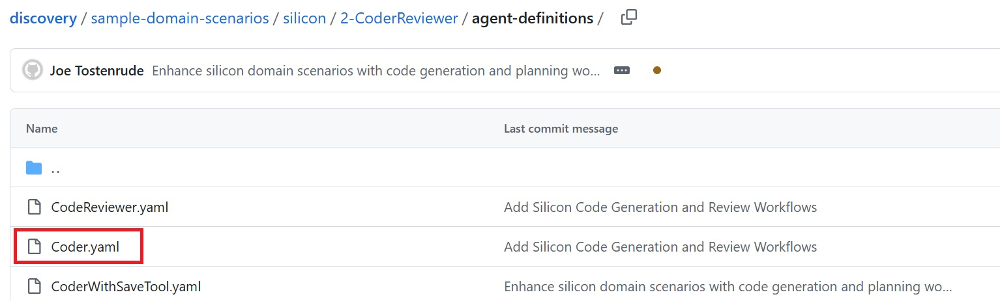  
 
-	Copy URL
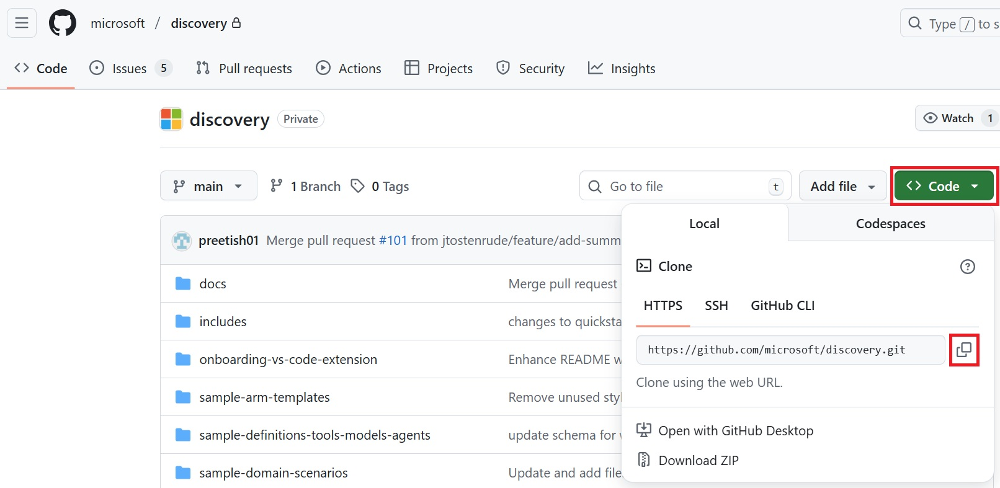
 
-	Open VS Code
    -	Type > in the top search bar
    -	Select Git: Clone
    -	Paste the URL 
    
        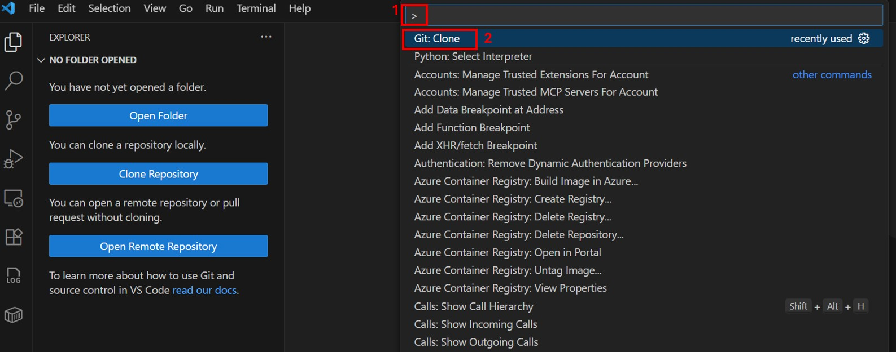  

        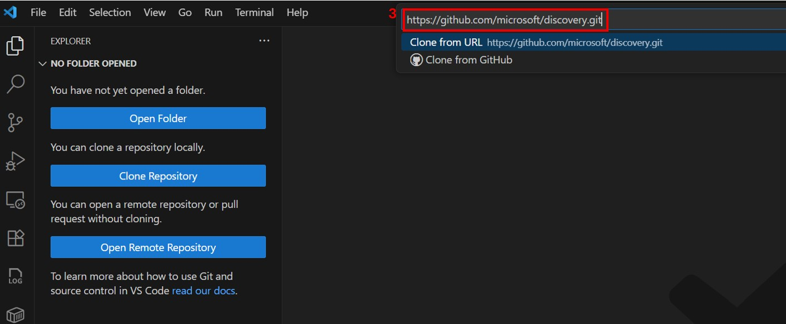  

-	Navigate to the directory **/discovery/6-solutions/domain-scenarios/silicon/2-CoderReviewer** in Visual Studio Code terminal
-	run **python .\utils\update-names.py --suffix "XX”** (where 'XX' is their participant ID #).  This will update agent/workflows names by appending XX and will update the json file names themselves the same way, allowing for a unique definition file for each participant. 

- Go to the [Azure portal](https://portal.azure.com/) and search for Microsoft Discovery Agents.
        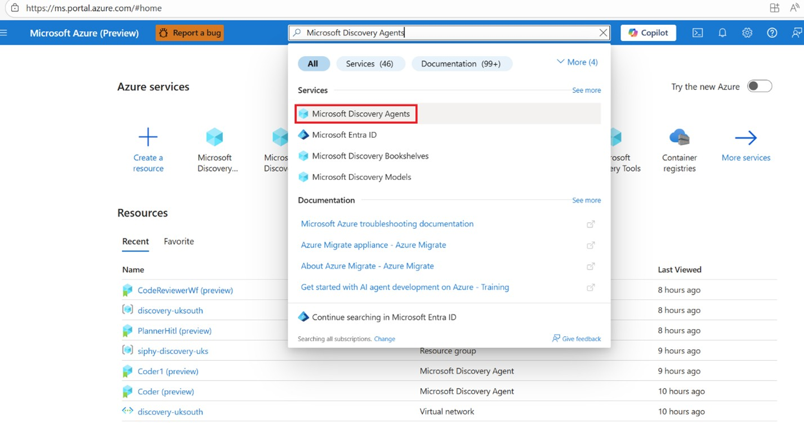  

-	Click on “Create” 
        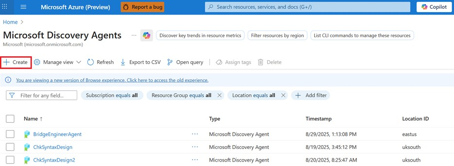  

 
-	This will take you to a create agent page. Specify the following:
    -	Resource Group: **discovery-uksouth**
    -	Agent name: **CoderXX (for each participant XX is their unique participant ID)**
    -	Region: **UK South**
    -	Model name: **azureml://registries/azure-openai/models/gpt-4o/versions/2024-11-20**
    -	Definition content file: Navigate to the **discovery/6-solutions/domain-scenarios/silicon/2-CoderReviewer/jsonFiles** folder in your cloned repo directory, and upload the **“CoderXX-agent-definition”** json file.
    -	Definition content version: Any number will do (type **“1”** for example)

**Make sure that the Agent name under Instance details matches exactly the name specified in the json**

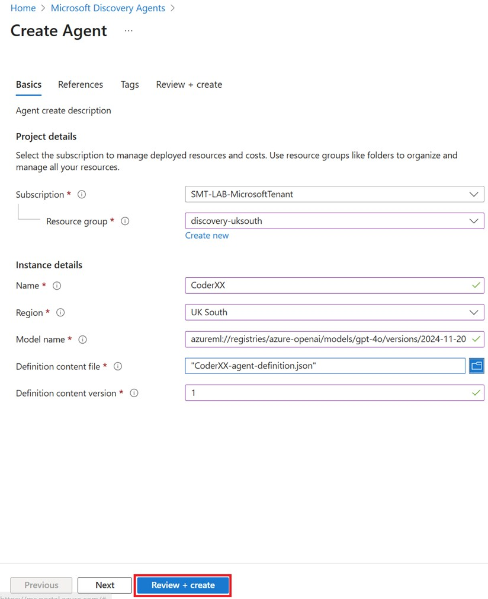  

-   Select “Review and Create” and go through the resource creation flow. 

-   Once the agent is successfully deployed, you will see a confirmation page like this:

## Step 2: Create Workflow
-   Go to the Azure portal and search for Microsoft Discovery Workflow.

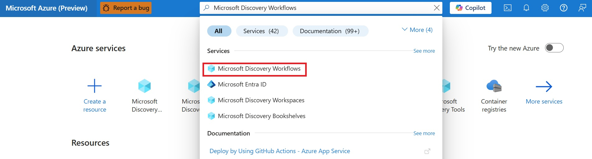  

-   Click on “Create”
        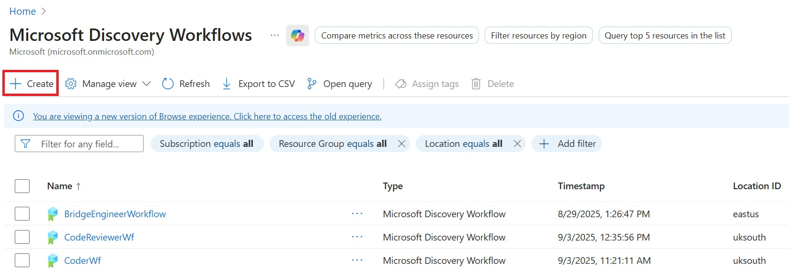 

This will take you to a create workflow page. Specify the following:
-   Resource Group: **discovery-uksouth**
-   Workflow name: **CoderWfXX (for each participant XX is their unique participant ID)**
-   Region: **UK South**
-   Definition content file: Navigate to the **discovery/6-solutions/domain-scenarios/silicon/2-CoderReviewer/jsonFiles** folder in your cloned repo directory, and upload the **“CoderWfXX-workflow-definition”** json file.
-   Definition content version: Any number will do (type **“1”** for example)
 
**Make sure that the Workflow name under Instance details matches exactly the name specified in the json**

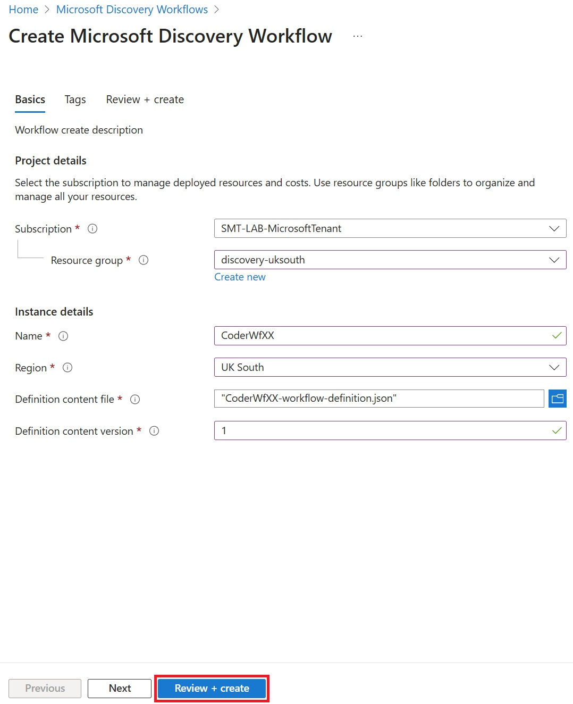  

-   Select “Review and Create” and go through the resource creation flow. 
-   Once the workflow is successfully deployed, you will see a confirmation page like this:

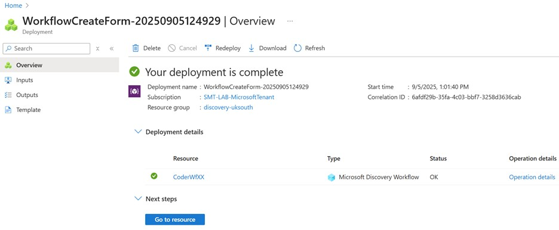

## Step 3: Create Project

-   Go to the Microsoft Discovery Studio portal [Home - Microsoft Discovery](https://studio.discovery.microsoft.com/) and click on “Projects”

    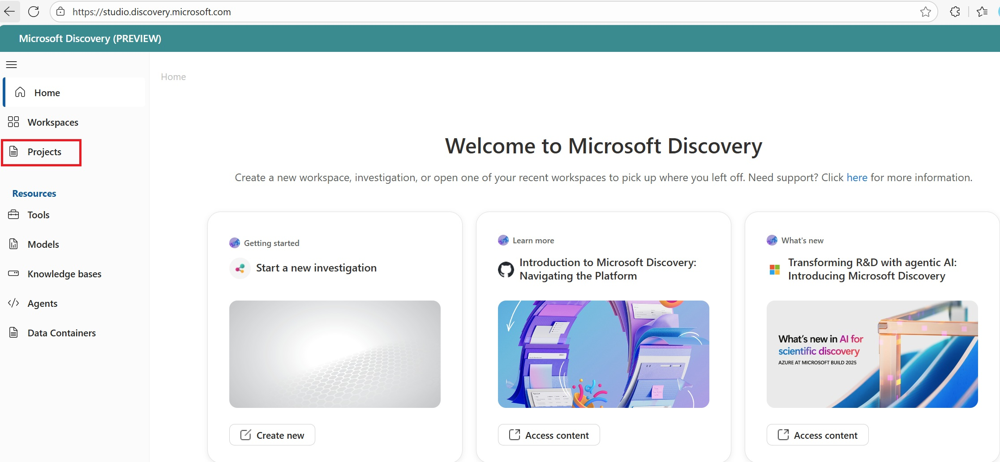

-   Select “Create Project”

    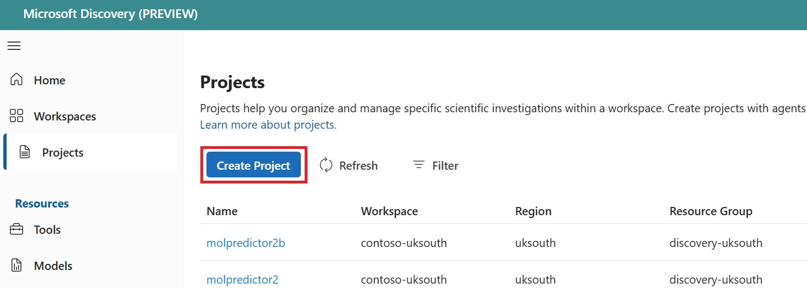
 
- In the pop-up window, specify the Project Name and Workspace to deploy into
    - Name: **CoderXX**
    - Workspace: Select **contoso-uksouth** from the drop-down menu
    - Select “Next”

    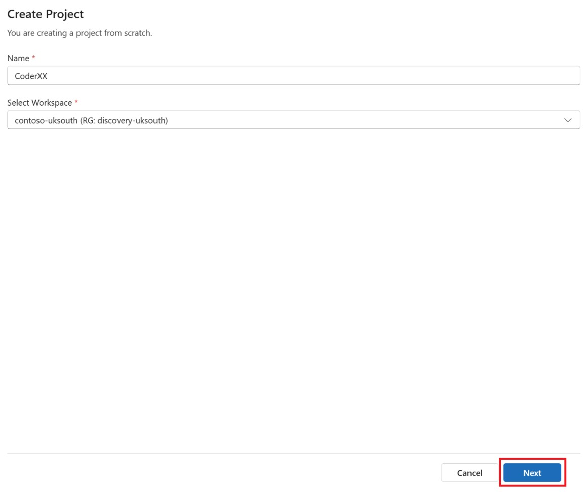 

- Workflow and Agent selection
    - Step 1: Select the Workflow **“CoderWfXX”**. It will automatically select the associated agent **“CoderXX”** from the json definition. 
    - Step 2: Check the Entry Agent box specified in **CoderWfXX** workflow line to specify that the **“CoderXX”** agent is the entry level agent for that workflow
    - Step 3: Select “Next”

    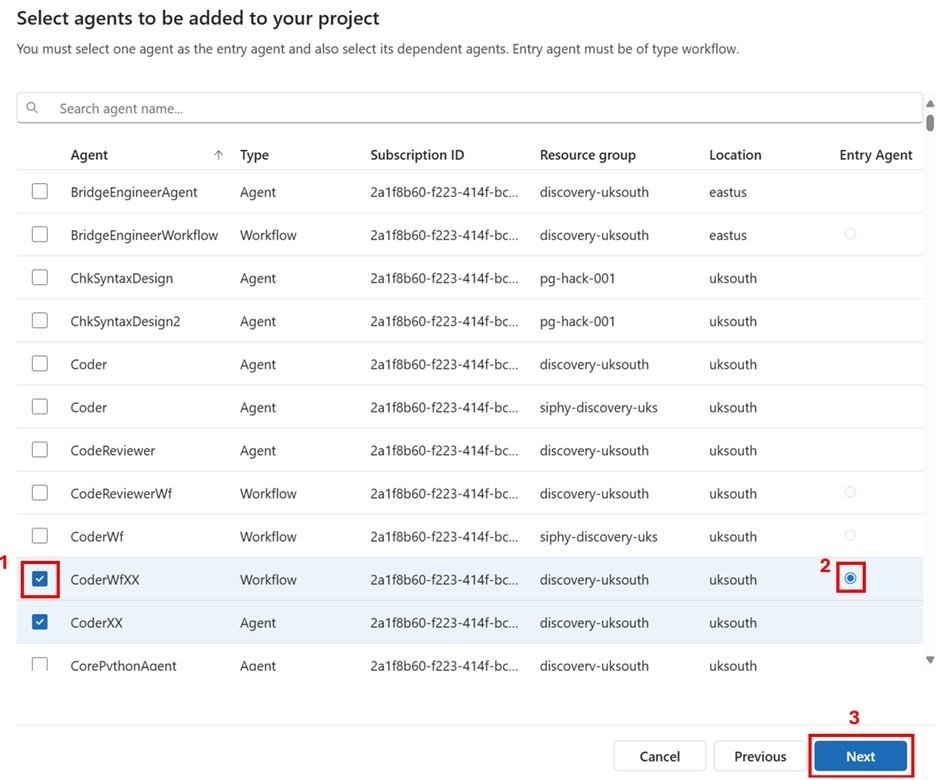 
 
- Select the Data Container to be added to the project
    - Step 1: Select **contoso-uksouth-data**
    - Step 2: Select “Create”

     

- Once the project creation is successful you will see the provisioning state change from “Accepted” to “Succeeded”. Typically, it takes 10-15 minutes to deploy a project.

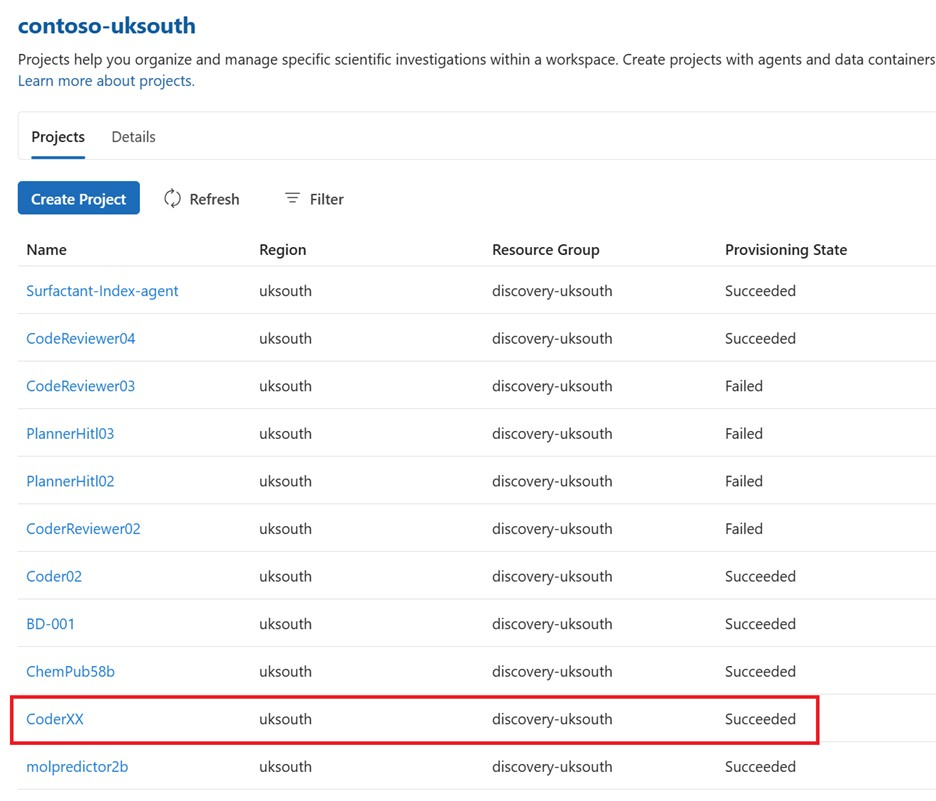 

- Click on the deployed project CoderXX

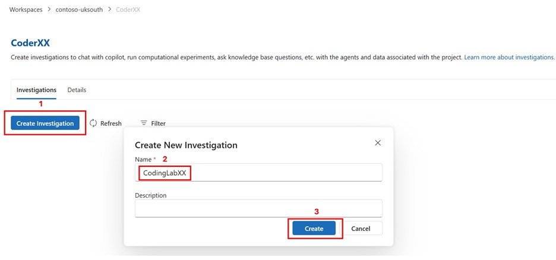 
 
- Select “Create Investigation”, name your investigation, and hit create.
- Click on the Investigation resource created, and you will be taken to a Discovery natural language interface. Here you can prompt Discovery Copilot to interact with the Coder agent. See example below.

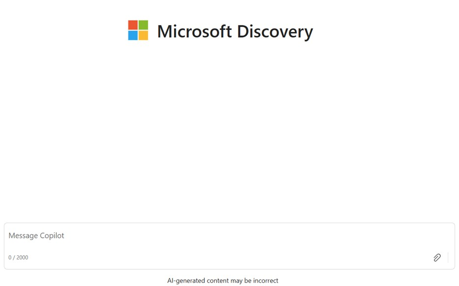   
 
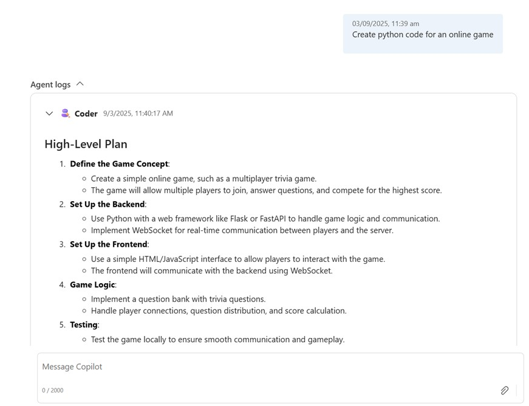   
 
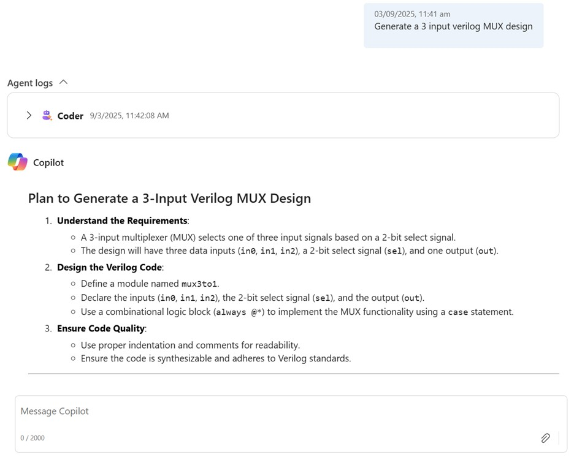 

- Some other example prompts to try out:
    - Verilog/SystemVerilog: 
        - “Create a 32-bit RISC-V ALU module in Verilog with full arithmetic and logic operations.”
        - “Generate a SystemVerilog testbench for a FIFO controller with randomized test vectors.”
    - Python: 
        - “Write Python automation for running regression tests on RTL designs.”
    -  Config/Docs: 
        - “Generate a YAML configuration file for a continuous integration pipeline for silicon design.”

----------------------------------------------------------------------------------------------------------------
#	Lab 2: Code Generation & Review 
## Step 1: Create Agents
- Agents are located here: discovery/6-solutions/domain-scenarios/silicon/2-CoderReviewer/agent-definitions at [GitHub repo](https://github.com/microsoft/discovery)

- Since we already defined and deployed the Coder agent, we will focus on adding the CodeReviewer agent.

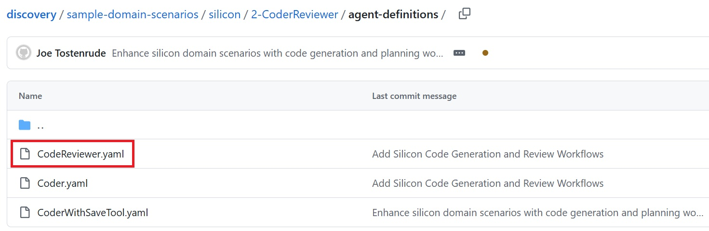 

- Go to the [Azure portal](https://portal.azure.com/) and search for Microsoft Discovery Agents.
          

-	Click on “Create” 
          

 
-	This will take you to a create agent page. Specify the following:
    -	Resource Group: **discovery-uksouth**
    -	Agent name: **CodeReviewerXX (for each participant XX is their unique participant ID)**
    -	Region: **UK South**
    -	Model name: **azureml://registries/azure-openai/models/gpt-4o/versions/2024-11-20**
    -	Definition content file: Navigate to the discovery/6-solutions/domain-scenarios/silicon/2-CoderReviewer/jsonFiles folder in your cloned repo directory, and upload the **“CodeReviewerXX-agent-definition”** json file.
    -	Definition content version: Any number will do (type **“1”** for example)

**Make sure that the Agent name under Instance details matches exactly the name specified in the json**

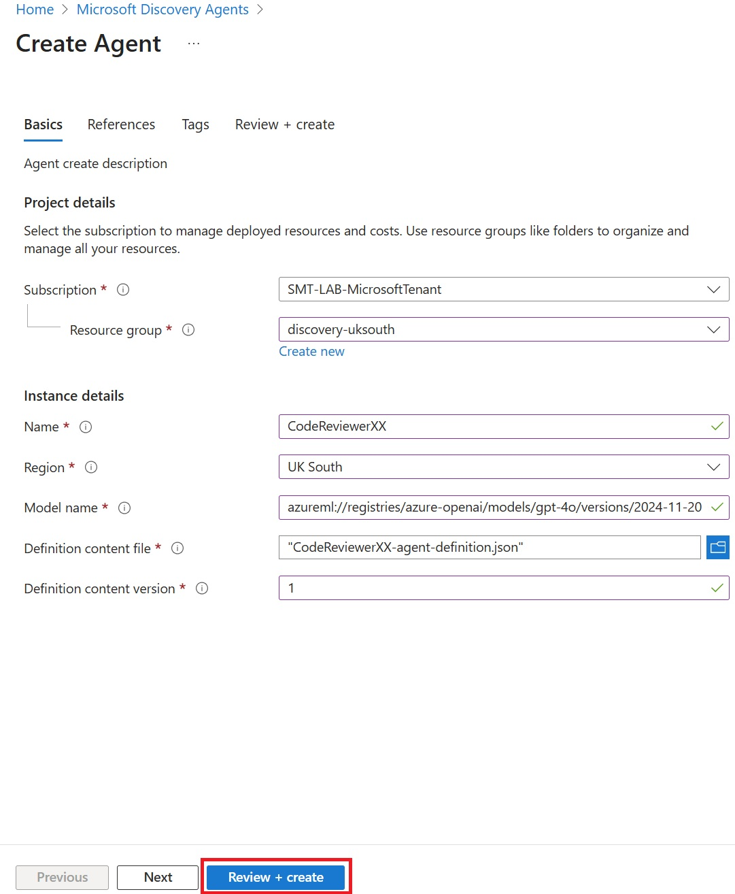  

- Select “Review and Create” and go through the resource creation flow. 

- Once the agent is successfully deployed, you will see a confirmation page like this:

 
## Step 2: Create Workflow

-   Go to the Azure portal and search for Microsoft Discovery Workflow.

  

-   Click on “Create”
         

This will take you to a create workflow page. Specify the following:
-   Resource Group: **discovery-uksouth**
-   Workflow name: **CoderAndReviewerWfXX (for each participant XX is their unique participant ID)**
-   Region: **UK South**
-   Definition content file: Navigate to the **discovery/6-solutions/domain-scenarios/silicon/2-CoderReviewer/jsonFiles** folder in your cloned repo directory, and upload the **“CoderAndReviewerWfXX-workflow-definition”** json file.
-   Definition content version: Any number will do (type **“1”** for example)
 
**Make sure that the Workflow name under Instance details matches exactly the name specified in the json**

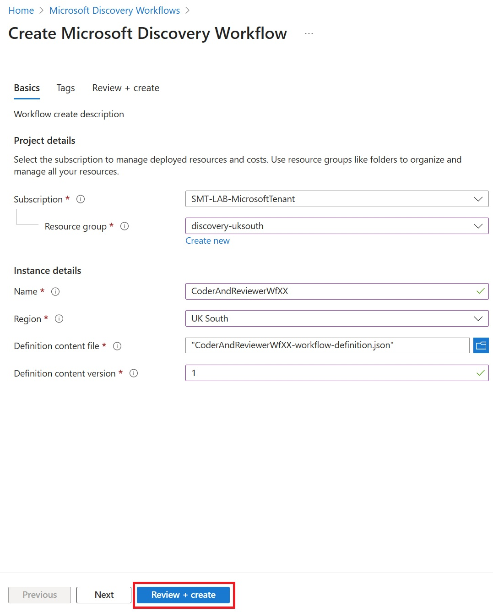  

-   Select “Review and Create” and go through the resource creation flow. 
-   Once the workflow is successfully deployed, you will see a confirmation page like this:

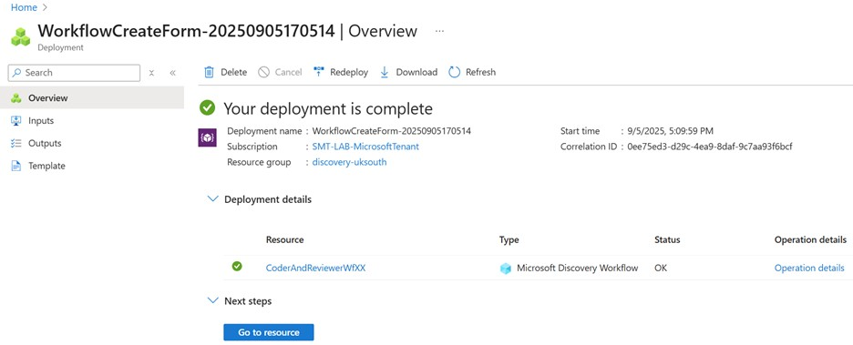

 

## Step 3: Create Project

-   Go to the Microsoft Discovery Studio portal [Home - Microsoft Discovery](https://studio.discovery.microsoft.com/) and click on “Projects”

-   Select “Create Project”

 
- In the pop-up window, specify the Project Name and Workspace to deploy into.
    - Name: **CoderReviewerXX**
    - Workspace: Select **contoso-uksouth** from the drop-down menu
    - Select “Next”
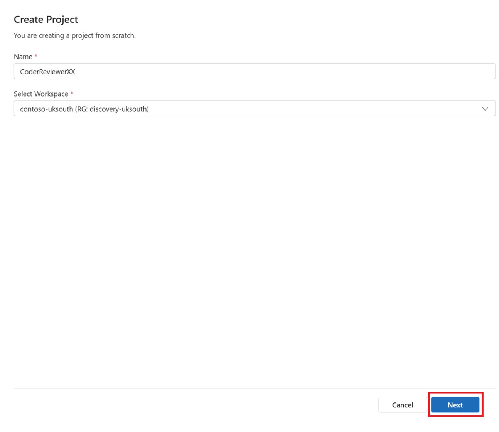 

- Workflow and Agent selection
    - Step 1: Select the Workflow **“CoderAndReviewerWfXX”**. It will automatically select the associated agents **“CoderXX”** and **"CodeReviewerXX"** from the json definition. 
    - Step 2: Check the Entry Agent box specified in **"CoderAndReviewerWfXX"** workflow line 
    - Step 3: Select “Next”

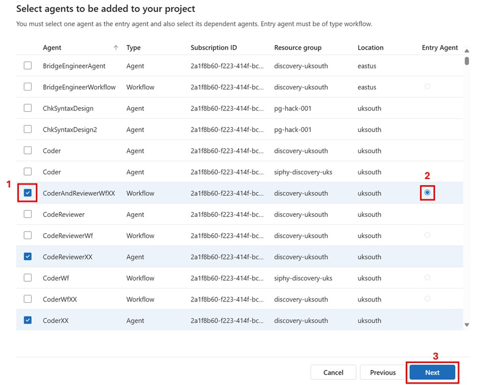 
 
- Select the Data Container to be added to the project
    - Step 1: Select contoso-uksouth-data
    - Step 2: Select “Create”

 

- Once the project creation is successful you will see the provisioning state change from “Accepted” to “Succeeded”. Typically, it takes 10-15 minutes to deploy a project.

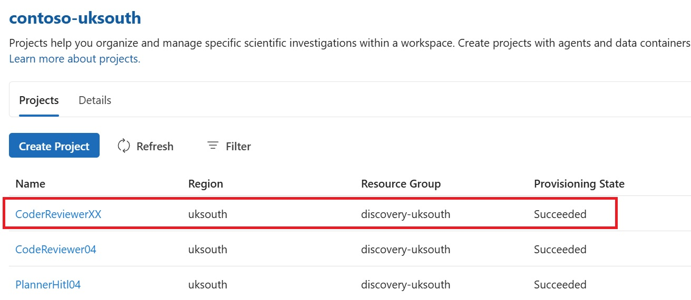 

- Click on the deployed project **CoderReviewerXX**

- Select **“Create Investigation”**, name your investigation, and hit create.

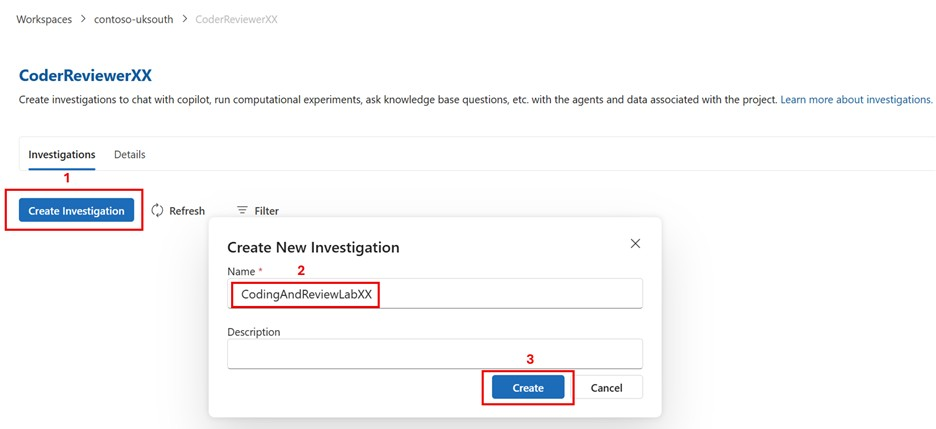 
 

- Click on the Investigation resource created, and you will be taken to a Discovery natural language interface. Here you can prompt Discovery Copilot to interact with the Coder and the CodeReviewer agents. You could use similar prompts as in the earlier coding agent lab. 

   
 
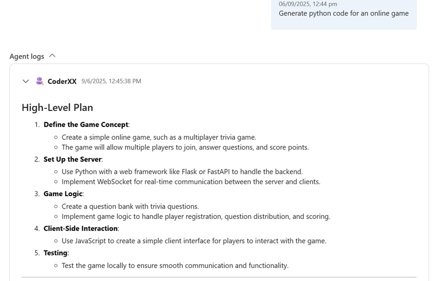   
 
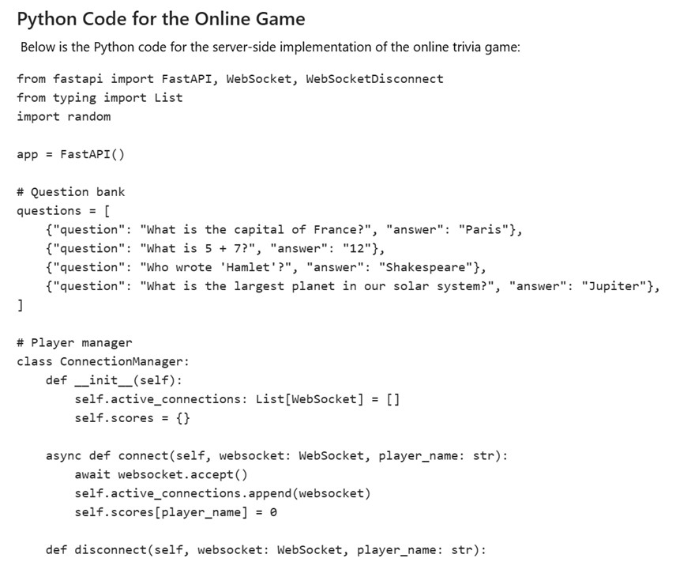   

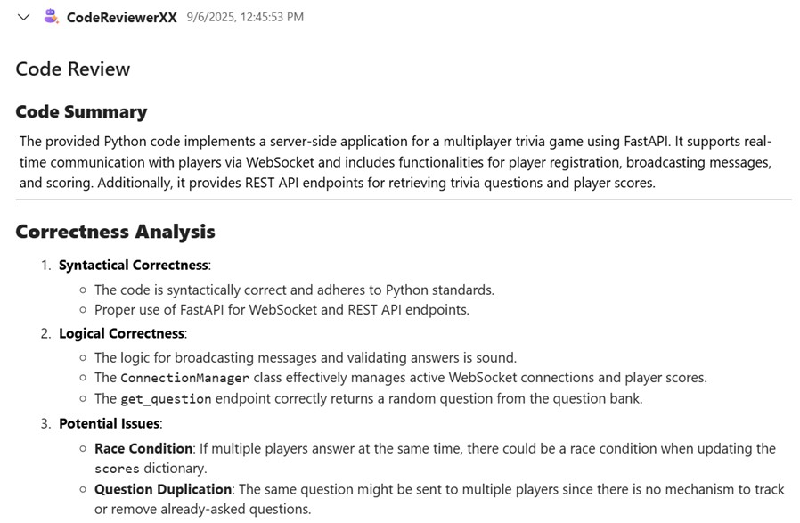   
 
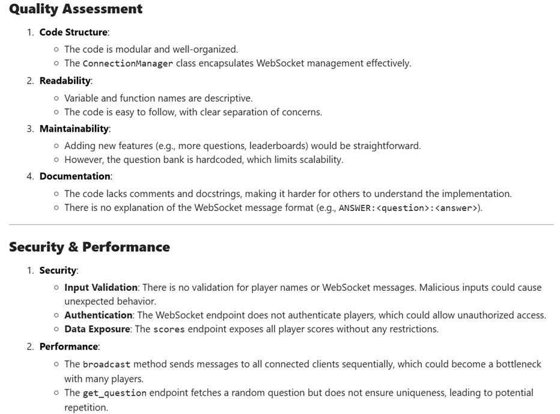    
 
 
  
----------------------------------------------------------------------------------------------------------------
# Lab 3. Code Generation with Tool
## Step 1: Create Agents

- In this lab, we will focus on the CodeWithSaveTool agent, and add a tool when deploying the agent in Azure.

-	Agents are located here: discovery/6-solutions/domain-scenarios/silicon/2-CoderReviewer/agent-definitions at [GitHub repo](https://github.com/microsoft/discovery)

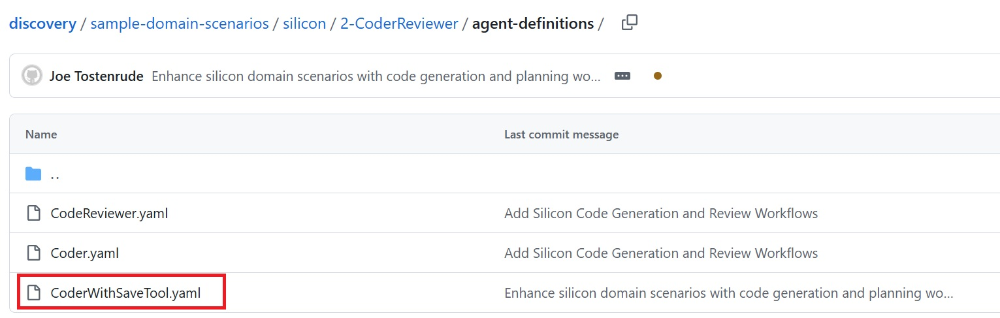  

- Go to the [Azure portal](https://portal.azure.com/) and search for Microsoft Discovery Agents.
          

-	Click on “Create” 
          

 
-	This will take you to a create agent page. Specify the following:
    -	Resource Group: **discovery-uksouth**
    -	Agent name: **CodeWithSaveToolXX (for each participant XX is their unique participant ID)**
    -	Region: **UK South**
    -	Model name: **azureml://registries/azure-openai/models/gpt-4o/versions/2024-11-20**
    -	Definition content file: Navigate to the discovery/6-solutions/domain-scenarios/silicon/2-CoderReviewer/jsonFiles folder in your cloned repo directory, and upload the **"CodeWithSaveToolXX-agent-definition”** json file.
    -	Definition content version: Any number will do (type **“1”** for example)

**Make sure that the Agent name under Instance details matches exactly the name specified in the json**

  

- Select “Next” and go to the References page. 
    1.	Click on “Add Tool”
    2.	Select the correct resource group: discovery-uksouth
    3.	From the drop down menu under Select Tool, add the tool FileSaverTool
    4.	Click on “Add Tool”

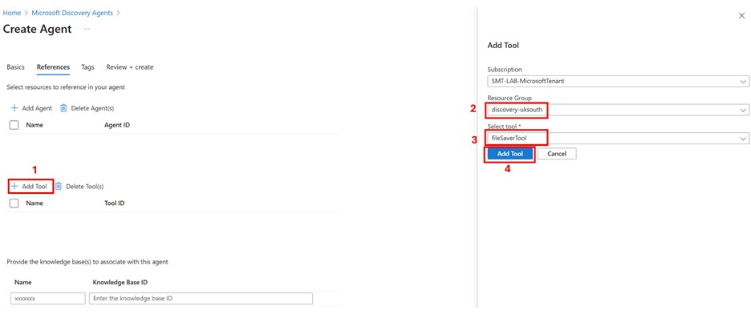  

-   Select “Review and Create” and deploy the agent
-   Once the agent is successfully deployed, you will see a confirmation page like this:

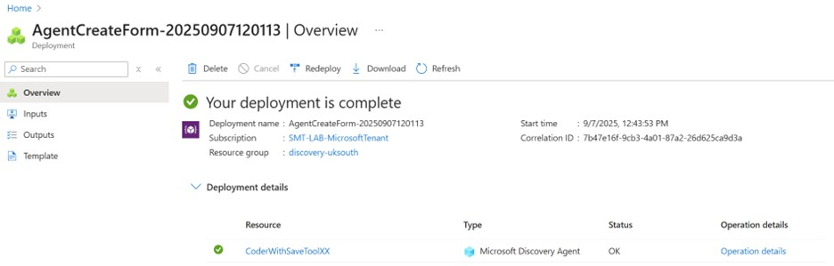
 
## Step 2: Create Workflow
-   Go to the Azure portal and search for Microsoft Discovery Workflow.

  

-   Click on “Create”
         

- This will take you to a create workflow page. Specify the following:
    -   Resource Group: **discovery-uksouth**
    -   Workflow name: **CoderWithSaveToolWfXX (for each participant XX is their unique participant ID)**
    -   Region: **UK South**
    -   Definition content file: Navigate to the discovery/6-solutions/domain-scenarios/silicon/2-CoderReviewer/jsonFiles folder in your cloned repo directory, and upload the **“CoderWithSaveToolWfXX-workflow-definition”** json file.
-   Definition content version: Any number will do (type **“1”** for example)
 
**Make sure that the Workflow name under Instance details matches exactly the name specified in the json**

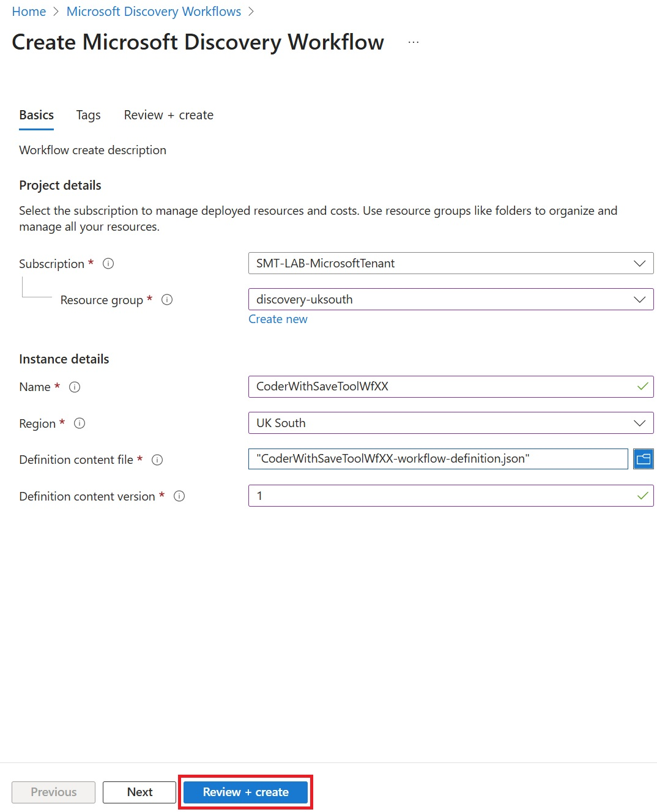  

-   Select “Review and Create” and go through the resource creation flow. 
-   Once the workflow is successfully deployed, you will see a confirmation page like this:

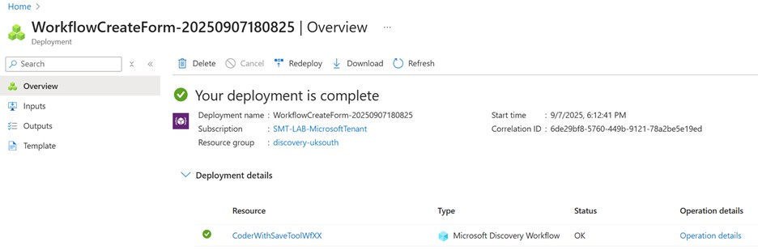

## Step 3: Create Project

-   Go to the Microsoft Discovery Studio portal [Home - Microsoft Discovery](https://studio.discovery.microsoft.com/) and click on “Projects”

-   Select “Create Project”

 
- In the pop-up window, specify the Project Name and Workspace to deploy into.
    - Name: **CoderWithToolXX**
    - Workspace: Select **contoso-uksouth** from the drop-down menu
    - Select “Next”
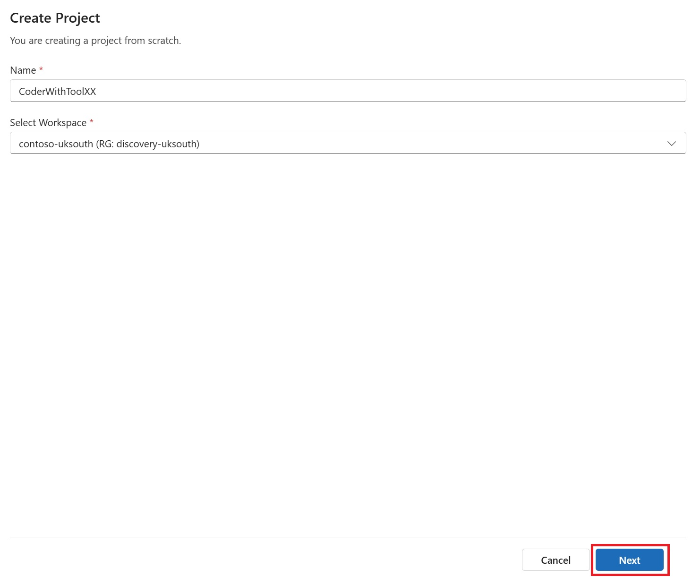 

- Workflow and Agent selection
    - Step 1: Select the Workflow **“CoderWithSaveToolWfXX”**. It will automatically select the associated agent **“CoderWithSaveToolXX”** from the json definition. 
    - Step 2: Check the Entry Agent box specified in **"CoderWithSaveToolWfXX"** workflow line 
    - Step 3: Select “Next”

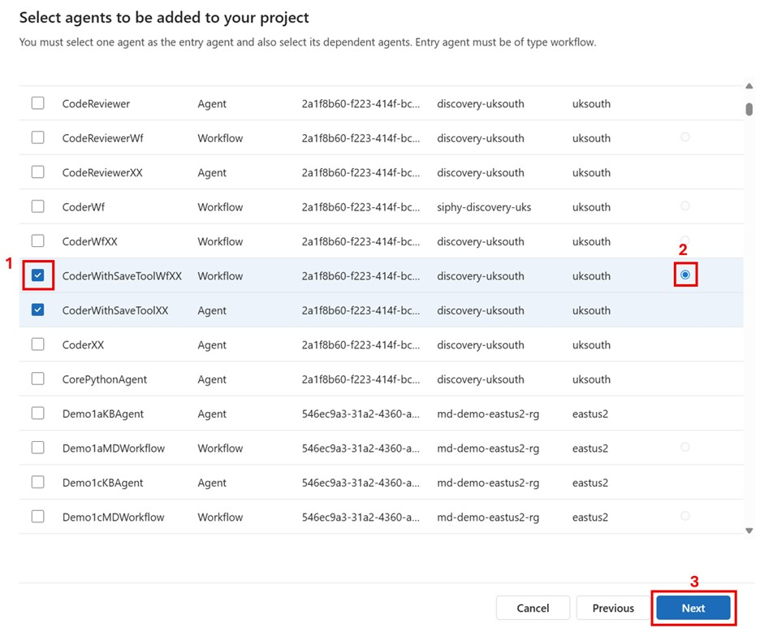 
 
- Select the Data Container to be added to the project
    - Step 1: Select **contoso-uksouth-data**
    - Step 2: Select “Create”

 

- Once the project creation is successful you will see the provisioning state change from “Accepted” to “Succeeded”. Typically, it takes 10-15 minutes to deploy a project.

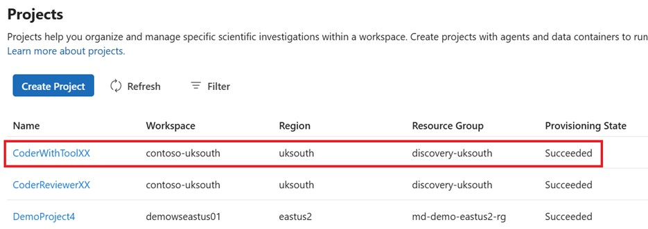 

- Click on the deployed project **CoderWithToolXX**

- Select “Create Investigation”, name your investigation, and hit create.

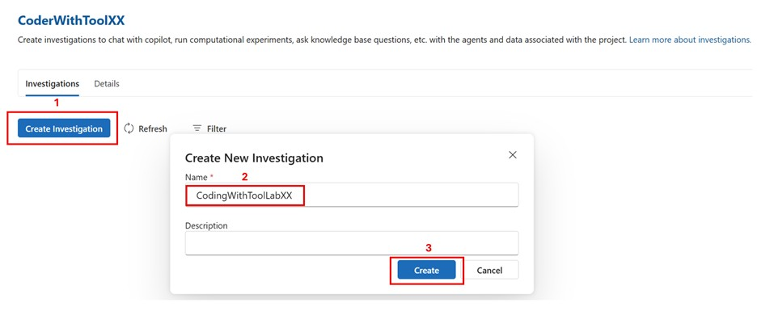 
 

- Click on the Investigation resource created, and you will be taken to a Discovery natural language interface. Here you can prompt Discovery Copilot to interact with the Coder and the CodeReviewer agents. You could use similar prompts as in the earlier coding agent lab. 

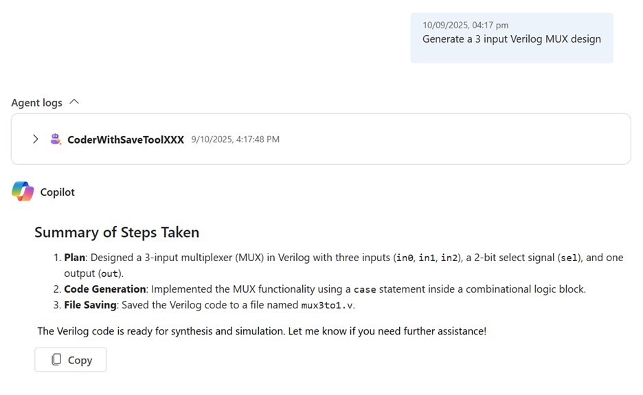 
 
Here the agent generates the Verilog code for a multiplexer and saves it to a file.

To find the file, goto the "Data" tab under "Resources", and select the Data Container used in the project.

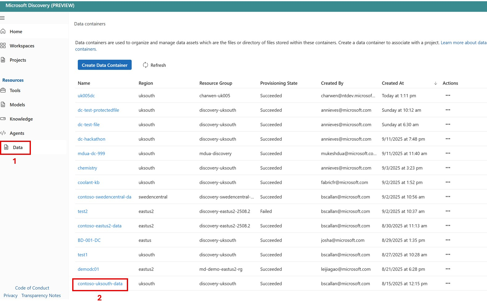

The file is saved under a generic name **output-####**

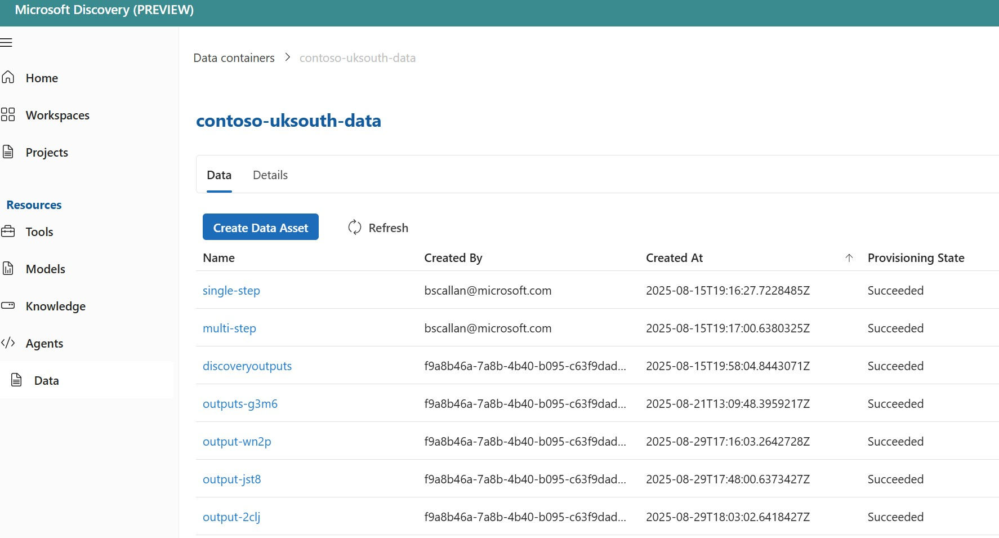

________________________________________
# Lab 4. Planner agent with HITL
## Step 1: Create Planner Agent

-	Agents are located here: discovery/6-solutions/domain-scenarios/silicon/3-Planner/agent-definitions at [GitHub repo](https://github.com/microsoft/discovery)

    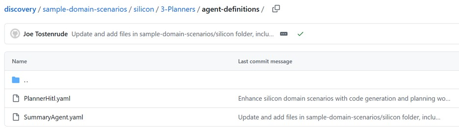  
 
-	Navigate to the directory /discovery/6-solutions/domain-scenarios/silicon/3-Planner 
-	run **python .\utils\update-names.py --suffix "XX”** (where 'XX' is their participant ID #).  This will update agent/workflows names by appending XX and will update the json file names themselves the same way, allowing for a unique definition file for each participant. 

Go to the [Azure portal](https://portal.azure.com/) and search for Microsoft Discovery Agents.
          

-	Click on “Create” 
          

 
-	This will take you to a create agent page. Specify the following:
    -	Resource Group: **discovery-uksouth**
    -	Agent name: **PlannerHitlXX (for each participant XX is their unique participant ID)**
    -	Region: **UK South**
    -	Model name: **azureml://registries/azure-openai/models/gpt-4o/versions/2024-11-20**
    -	Definition content file: Navigate to the discovery/6-solutions/domain-scenarios/silicon/3-Planner/jsonFiles folder in your cloned repo directory, and upload the **“PlannerHitlXX-agent-definition”** json file.
    -	Definition content version: Any number will do (type **“1”** for example)

**Make sure that the Agent name under Instance details matches exactly the name specified in the json**

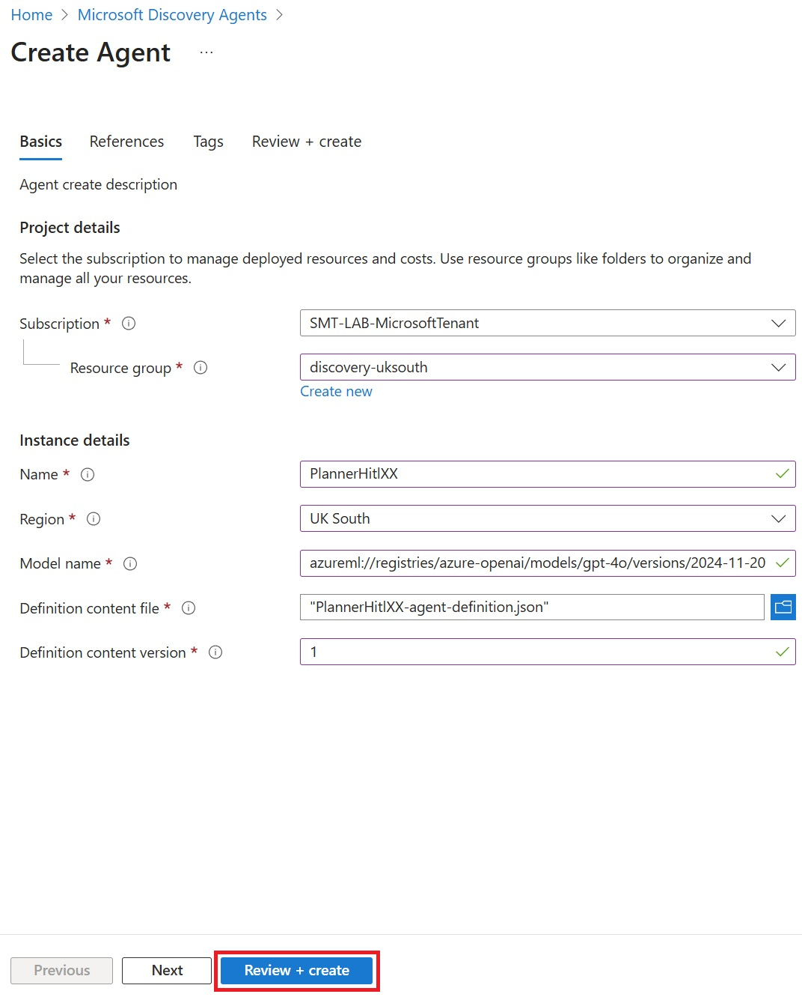  

-   Select “Review and Create” and go through the resource creation flow. 

-   Once the agent is successfully deployed, you will see a confirmation page like this:

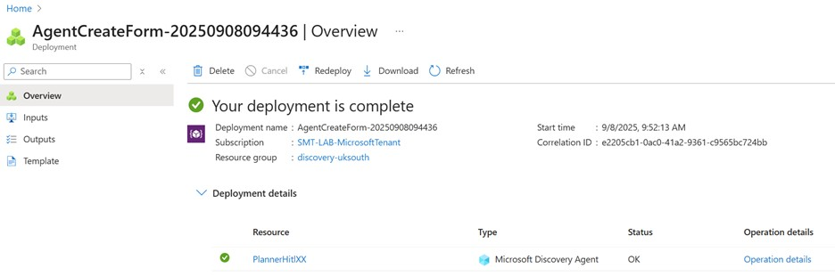	

## Step 2: Create Summary Agent

Go to the [Azure portal](https://portal.azure.com/) and search for Microsoft Discovery Agents.
          

-	Click on “Create” 
          

 
-	This will take you to a create agent page. Specify the following:
    -	Resource Group: **discovery-uksouth**
    -	Agent name: **SummaryAgentXX (for each participant XX is their unique participant ID)**
    -	Region: **UK South**
    -	Model name: **azureml://registries/azure-openai/models/gpt-4o/versions/2024-11-20**
    -	Definition content file: Navigate to the discovery/6-solutions/domain-scenarios/silicon/3-Planner/jsonFiles folder in your cloned repo directory, and upload the **“SummaryAgentXX-agent-definition”** json file.
    -	Definition content version: Any number will do (type **“1”** for example)

**Make sure that the Agent name under Instance details matches exactly the name specified in the json**

  

-   Select “Review and Create” and go through the resource creation flow. 

-   Once the agent is successfully deployed, you will see a confirmation page like this:

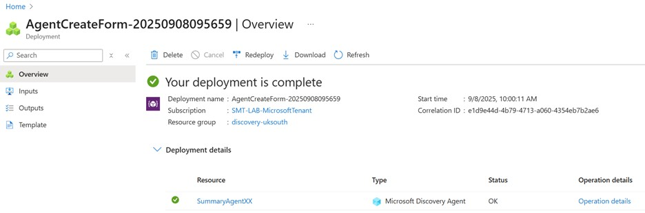	

## Step 3: Create Workflow

-   Go to the Azure portal and search for Microsoft Discovery Workflow.

  

-   Click on “Create”
         

This will take you to a create workflow page. Specify the following:
-   Resource Group: **discovery-uksouth**
-   Workflow name: **CoderWithSaveToolWfXX (for each participant XX is their unique participant ID)**
-   Region: **UK South**
-   Definition content file: Navigate to the discovery/6-solutions/domain-scenarios/silicon/2-CoderReviewer/jsonFiles folder in your cloned repo directory, and upload the **“CoderWithSaveToolWfXX-workflow-definition”** json file.
-   Definition content version: Any number will do (type **“1”** for example)
 
**Make sure that the Workflow name under Instance details matches exactly the name specified in the json**

  

-   Select “Review and Create” and go through the resource creation flow. 
-   Once the workflow is successfully deployed, you will see a confirmation page like this:

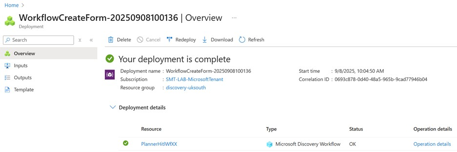

 

## Step 4: Create Project

-   Go to the Microsoft Discovery Studio portal [Home - Microsoft Discovery](https://studio.discovery.microsoft.com/) and click on “Projects”

-   Select “Create Project”

 
- In the pop-up window, specify the Project Name and Workspace to deploy into.
    - Name: **PlannerHitlXX**
    - Workspace: Select **contoso-uksouth** from the drop-down menu
    - Select “Next”
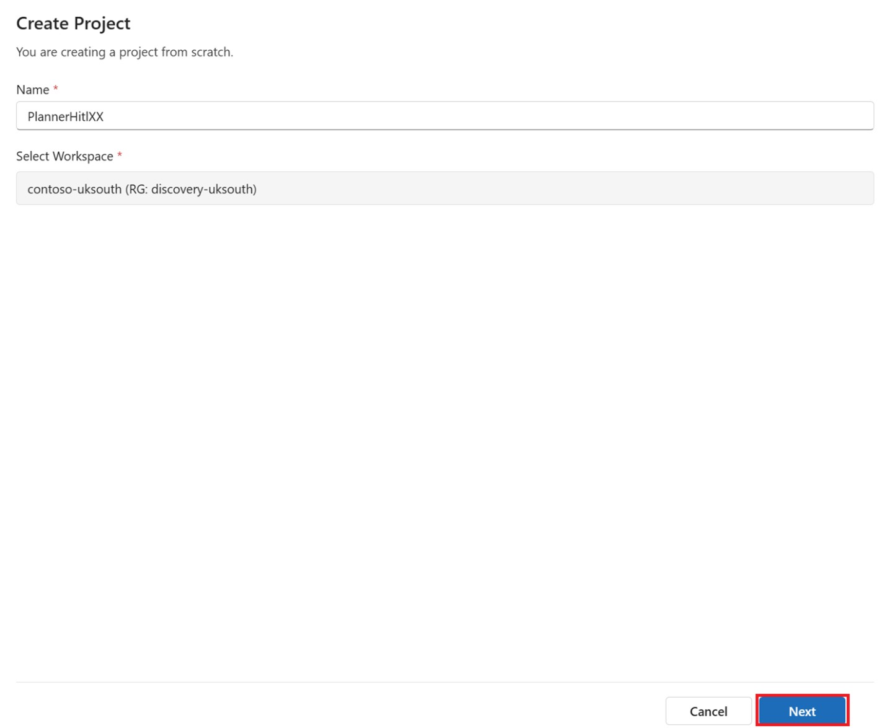 

- Workflow and Agent selection
    - Step 1: Select the Workflow **“PlannerHitlWfXX”**. It will automatically select the associated agents **“PlannerWithHitlXX”** and **"SummaryAgentXX"** from the json definition. 
    - Step 2: Check the Entry Agent box specified in **"PlannerHitlWfXX"** workflow line 
    - Step 3: Select “Next”

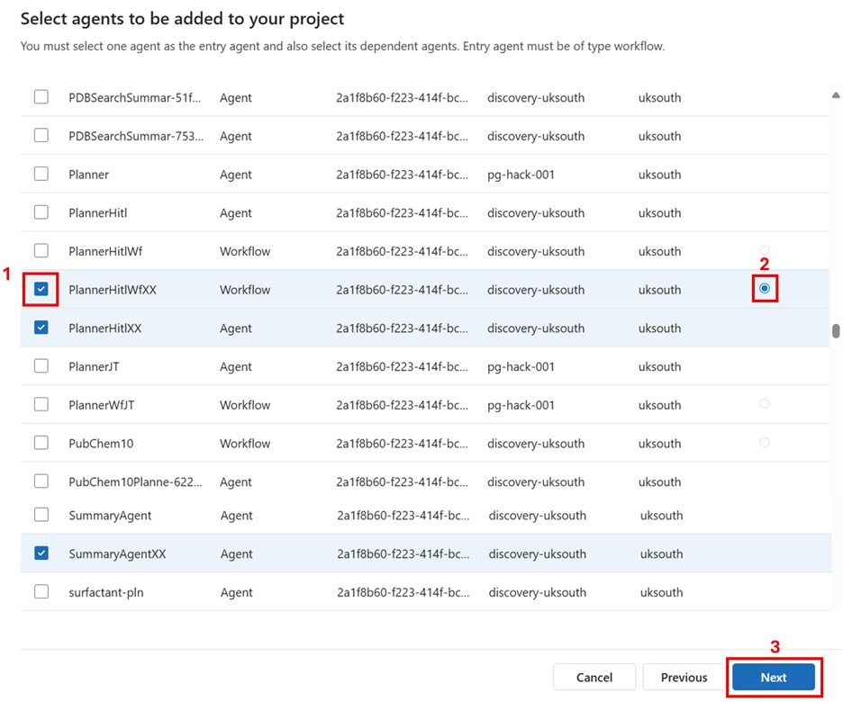 
 
- Select the Data Container to be added to the project
    - Step 1: Select **contoso-uksouth-data**
    - Step 2: Select “Create”

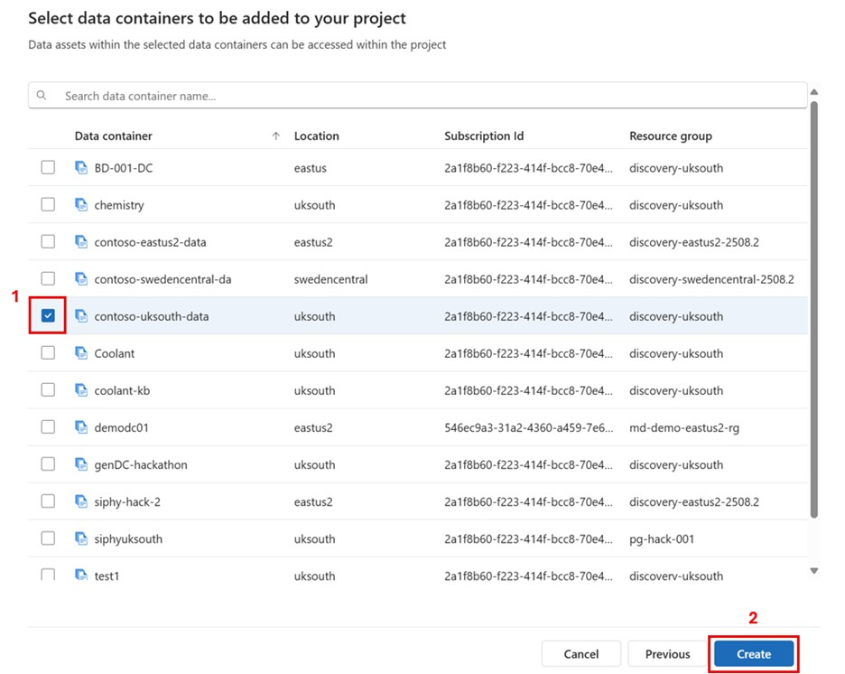 

- Once the project creation is successful you will see the provisioning state change from “Accepted” to “Succeeded”. Typically, it takes 10-15 minutes to deploy a project.

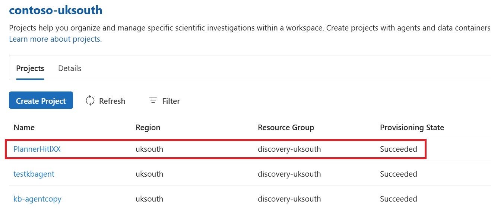 

- Click on the deployed project **PlannerHitlXX**

- Select “Create Investigation”, name your investigation, and hit create.

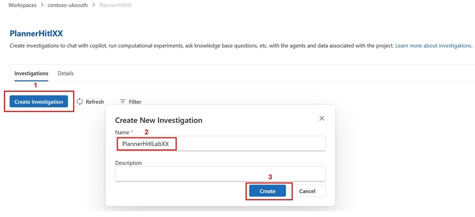 
 

- Click on the Investigation resource created, and you will be taken to a Discovery natural language interface. Here you can prompt Discovery Copilot to interact with the Coder agent. See example below.
     
    - Make sure you’re adding the line **“Make sure to confirm your plan”** to the main prompt 
    - Copilot generates a plan based on the input prompt and waits for HITL confirmation to proceed 

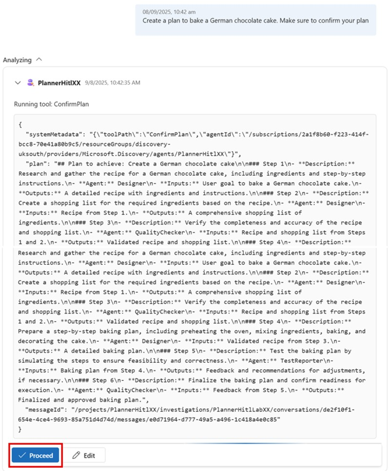 
 
 
- Select “Proceed” to continue with the plan execution. Copilot will produce a step-by-step plan.
    - You can also select “Edit” if you choose to modify the plan (e.g. remove the last two steps)

- Additional prompt to try out: “Create a 3-story elevator controller Verilog state machine.” Copilot will generate the code. 
    - In the next iteration, append the line “Make sure to confirm your plan" to the initial prompt, to invoke HITL confirmation.
