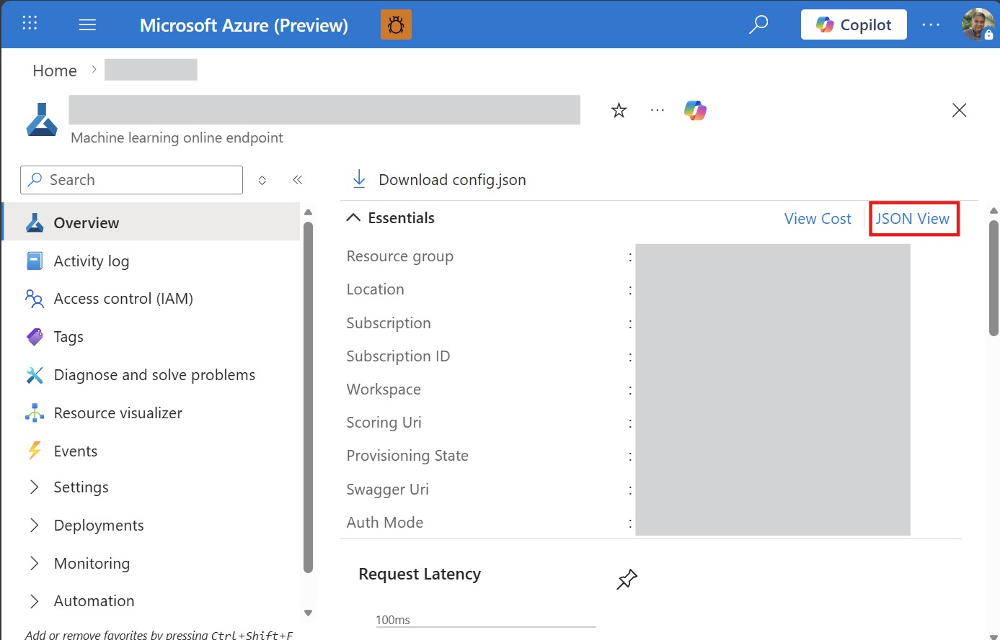

# Skala Model, Client Tool, & Agent Deployment Guide

This guide provides step-by-step instructions for deploying the Skala client tool and its associated agent to the Microsoft Discovery platform.

## Overview


Skala is a neural network-based exchange-correlation functional for density functional theory (DFT), developed by Microsoft Research AI for Science. It leverages deep learning to predict exchange-correlation energies from electron density features, achieving chemical accuracy for atomization energies and strong performance on broad thermochemistry and kinetics benchmarks, all at a computational cost similar to semi-local DFT.

Trained on a large, diverse dataset—including coupled cluster atomization energies and public benchmarks—Skala uses scalable message passing and local layers to learn both local and non-local effects. The model has about 276,000 parameters and matches the accuracy of leading hybrid functionals. Code and documentation are available at https://github.com/microsoft/skala.

## Prerequisites

- [Azure CLI](https://docs.microsoft.com/en-us/cli/azure/install-azure-cli) installed
- [Docker](https://www.docker.com/get-started) installed
- Access to an Azure subscription
- A working deployment of the Skala model in Azure Machine Learning Studio (see [https://ml.azure.com](https://ml.azure.com))
- Azure Container Registry (ACR) with appropriate permissions
- Completed platform onboarding (see [user guide](../../../2-getting-started/quickstart.md))
- Assign the managed identity used in your Discovery workspace the Azure AI User role


## Deployment Steps

### Step 1: Edit the skala-env.json file 

In the skala-env.json file, replace the URL setting with the actual target URI of your Skala model deployment in Azure Machine Learning. This can be found in the Azure Portal under the "Machine learning online endpoint" -> "JSON View". Copy the Resource ID.



### Step 2: Login to your Azure Container Registry

> Replace `mycontainerregistry` with your actual ACR name

```bash
az login
az acr login --name mycontainerregistry
```

### Step 3: Build & Push the Docker Image

Use the provided Dockerfile to build the tool image:

> Replace `mycontainerregistry` with your actual ACR name

```bash
docker build -t "mycontainerregistry.azurecr.io/skala-client:latest" .

docker push "mycontainerregistry.azurecr.io/skala-client:latest"
```


### Step 4: Update Tool Definition

Edit the tool definition file (`Skala-Tool.yaml`) and update the ACR path in the image section:  

> Replace `mycontainerregistry` with your actual ACR name

```yaml
infra:
    - name: worker
    infra_type: container
    image:
        acr: mycontainerregistry.azurecr.io/skala-client:latest
```

### Step 5: Convert YAML to JSON

Use the provided utility to convert YAML definitions to JSON format required by the platform:

#### 5.1 **Convert the tool definition**:

```bash
python3 ../../utils/definition-content-creator.py Skala-Tool.yaml --output Skala-Tool.json --json
```

#### 5.2 **Convert the agent definition**:

```bash
python3 ../../utils/definition-content-creator.py Skala-Agent.yaml --output Skala-Agent.json --json
```
#### 5.3 **Convert the workflow definition**:

```bash
python3 ../../utils/definition-content-creator.py Skala-Workflow.yaml --output Skala-Workflow.json --json
```

### Step 6: Deploy Platform Resources

#### 6.1 Create Tool Resource

Deploy the Skala tool to the Discovery platform using the generated JSON definition. This creates the computational environment for running biomedical literature retrieval operations.

> Be sure to include the skala-env.json file that was updated in Step 1 above with the endpoint information specific to your deplyment.

```json
{
"MODEL_ENDPOINT": "/subscriptions/<your subscription id>/resourceGroups/<your workspace-mrg>/providers/Microsoft.MachineLearningServices/workspaces/<your Azure Machine Learning workspace>/onlineEndpoints/<your Skala endpoint>"
}
```

> **Reference**: See [Tool Deployment Guide](../../../4-how-to/6-tools-models-agents/b--tool-deployment.md) for detailed steps

#### 6.2 Create Agent Resource

Deploy the Skala agent using the agent JSON definition. This creates the AI agent that can perform literature search and citation analysis tasks.

> **Reference**: See [Agent Deployment Guide](../../../4-how-to/6-tools-models-agents/c--agent-deployment.md) for detailed steps

#### 6.3 Create Workflow Resource

Create a workflow that utilizes the Skala agent to calculate the total energy of the target molecule. You can use the provided file (Skala-Workflow) for testing as a single step workflow.

#### 6.4 Create Project Resource

Set up a project to use the Skala workflow & agent.

> **Reference**: See [Project Creation Guide](../../../4-how-to/7-projects/a--creating-project.md) for detailed steps

#### 6.6 Create an Investigation

Create a project investigation that utilizes the Skala agent and workflow for calculating the total energy.

> **Reference**: See [Creating Investigations Guide](../../../4-how-to/8-investigations/a--creating-investigation.md) for detailed steps

#### 6.8 Run an investigation

Type "help" in the chat box and then press the "Enter" key or click "Send" and additional information will be returned about the tool and detailed examples of different prompts that can be used.
