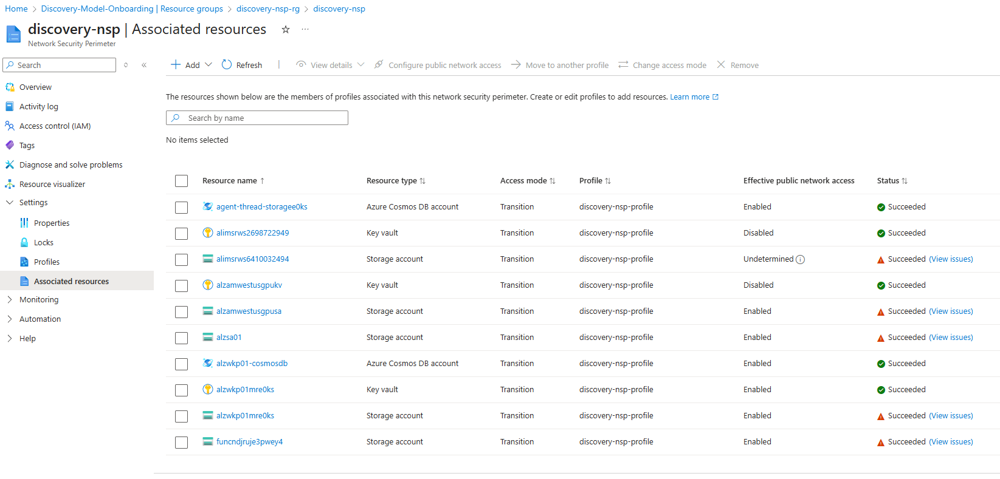

# Security Context


All MSFT service teams are required to protect access to critical data by restricting public exposure to their PaaS resources like Storage Accounts, Key Vaults, SQL DB servers and Cosmos DB accounts, preventing the use of stolen or leaked credentials from untrusted network locations to meet **SFI Protect Networks - NS2.2.1 Secure PaaS Resources** requirements.

To achieve the end goal, KPI is formulated into multiple phases to facilitate incremental progress in different waves. Starting with Wave 3, services will migrate resources from unrestricted configurations into standard controls maintaining existing connectivity preventing accidental outages, primarily using Network Security Perimeter (NSP) in transition mode (formerly learning mode).

Network Security Perimeters are an Azure security feature that provides network-level isolation and access control for PaaS services. The script sets up a centralized security boundary and brings multiple resources under this protection, operating in "Learning" mode initially to understand traffic patterns before enforcing stricter policies.

## Purpose
This script automates the setup of Azure Network Security Perimeters (NSP) and associates various Azure resources with them for enhanced security.

It also ensures that newly created PaaS resources are compliant by assigning Azure Policy to enforce NSP association automatically.

> [!NOTE]
> The script is currently for use only by Microsoft service teams and should not be used by external customers or partners.

## Main Functions

The *CreateNSPPoliciesAndRemediate.ps1* script performs the following functions:

### 1. Initialization
* The script automatically connects to Azure and prompts you to select the appropriate subscription ID
* Installs and imports required Azure PowerShell modules (Az.Accounts, Az.Storage, Az.Resources, Az.ManagedServiceIdentity etc.)

### 1. NSP Infrastructure Creation

* Creates a dedicated resource group called discovery-nsp-rg if it doesn't exist
* Creates a Network Security Perimeter named discovery-nsp
* Creates an NSP profile named discovery-nsp-profile
* Creates a User Assigned Managed Identity (nsp-MI) with Contributor permissions

### 2. Policy Management
Creates and assigns four Azure Policy definitions that automatically associate resources with the NSP:

* Key Vault Policy - Associates Key Vaults with NSP
* SQL Server Policy - Associates SQL Servers with NSP
* Storage Account Policy - Associates Storage Accounts with NSP
* Cosmos DB Policy - Associates Cosmos DB accounts with NSP
### 3. Resource Discovery

* Scans the specified resource groups for the following Azure services:
  * Cosmos DB accounts
  * SQL Servers
  * Key Vaults
  * Storage Accounts

### 4. Resource Association

* Associates all discovered resources with the NSP profile
* Creates associations with names like sql-[servername]-assoc, cdb-[accountname]-assoc, etc.
* Sets the access mode to "Learning" for each association

## Usage

You need to be an **Owner** of the subscription and need **PowerShell 7** or higher. You can get it [here ]( https://learn.microsoft.com/en-us/powershell/scripting/install/installing-powershell-on-windows?view=powershell-7.5). Also, ensure that the **"policy-definitions"** sub-folder is also present.

* Clone the [Discovery](https://github.com/discovery) repository to you computer or just download the [security-policies](../security-policies/) folder.
* Connects to Azure and select the appropriate subscription ID
  * Connect-AzAccount
* Switch to the **discovery/security** folder (e.g. C:\github\discovery\security>)
You need **PowerShell 7** or higher. The script can be run in two modes.

The script can be run in two modes:

#### 1. Subscription Level: To create and assign NSP at the subscription level to prevent any new resources from being out of compliance.

SubscriptionId: Your Azure subscription ID

Example:
```powershell
PowerShell -ExecutionPolicy Bypass -File .\CreateNSPPoliciesAndRemediate.ps1 -SubscriptionId "11111111-2222-3333-4444-555555555555"
```

#### 2. Resouce Group Level: To mitigate existing resources and to assign NSP at the subscription level to prevent any new resources from being out of compliance.

SubscriptionId: Your Azure subscription ID
ResourceGroups: Array of resource group names to scan

Example:
```powershell
.\CreateNSPPoliciesAndRemediate.ps1 -SubscriptionId "11111111-2222-3333-4444-555555555555" -ResourceGroups "rg-app1","rg-app2","rg-data"
```

## Verification (Optional)

You can login to the [Azure Portal](https://portal.azure.com/) and navigate to the **discovery-nsp-rg** Resource Group in the appropriate subscription and look for the **discovery-nsp** Network Security Perimeter. Look for *Associated resources* under *Settings* to verify that the NSP got created and associated to resources.

