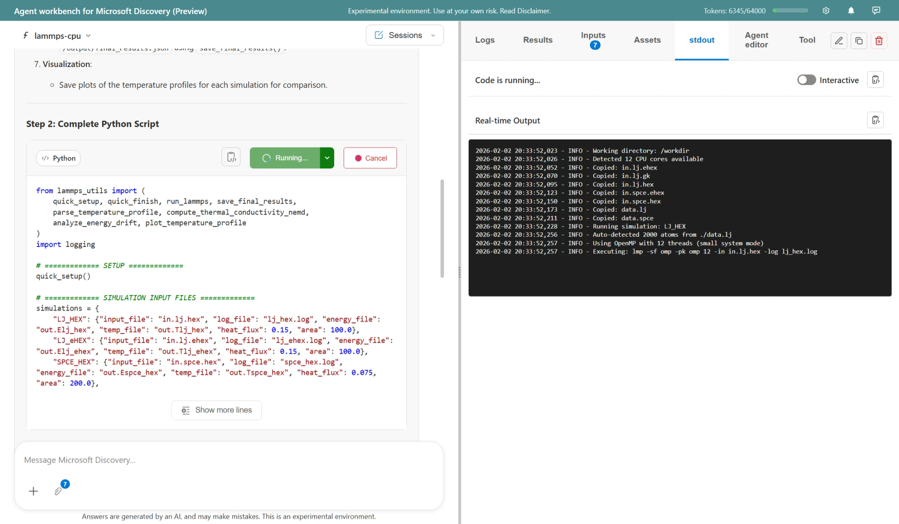

# Microsoft Discovery Agent Workbench

**IMPORTANT NOTE:** The Microsoft Discovery Agent Workbench (the "Workbench") and associated resources are provided as part of the Microsoft Discovery Preview. The Workbench is provided "as is" to support your use of Microsoft Discovery, including your development and testing of agents for specific scenarios. You are responsible for carefully testing agent behavior in the context of your Microsoft Discovery use case(s).

---

## What is the Agent Workbench?

The Agent Workbench is a comprehensive development environment for creating, testing, and publishing Microsoft Discovery agents. It provides a web-based interface that streamlines the entire agent lifecycle—from initial creation to production deployment—without requiring deep knowledge of the underlying platform APIs.

The workbench runs locally on your machine or in GitHub Codespaces, and connects to your own Azure OpenAI endpoints and Discovery resources. No data is processed or stored in Microsoft tenants.



---

## Quick Start

```bash
# Windows
start_web_app.bat

# Linux / macOS
./start_web_app.sh
```

Then open **http://localhost:8050** and configure your Azure settings.

For detailed setup instructions, see the **[Setup Guide](./doc/README_SetupGuide.md)**.

---

## Core Capabilities

### Agent Development

| Capability | Description |
|------------|-------------|
| **No-Code Agent Creation** | Generate agent definitions from your documentation and source code using AI assistance |
| **Visual YAML Editor** | Edit agent, tool, and workflow definitions with syntax validation and inline documentation |
| **Workflow Designer** | Create multi-step workflows that chain agents together with visual diagram generation |
| **Template Library** | Start from pre-built templates for common agent patterns (planners, routers, summarizers) |

### Testing & Validation

| Capability | Description |
|------------|-------------|
| **Local Container Execution** | Build and run tool containers locally to test agent-tool interactions before deployment |
| **Interactive Chat Testing** | Validate agent behavior through a conversational interface with real-time feedback |
| **Script Execution** | Run generated Python scripts directly and view outputs in the integrated viewer |
| **Schema Validation** | Ensure definitions conform to Discovery platform requirements before publishing |

### Session Management

| Capability | Description |
|------------|-------------|
| **Multi-Session Workspaces** | Create and manage multiple isolated environments, each preserving its own conversation history and context |
| **Agent-Specific Isolation** | Switch between different agents within a session, with each agent maintaining separate input/output files and UI state |
| **Persistent State** | All conversations, files, build outputs, and logs are automatically saved and restored when switching sessions or agents |
| **Session selector** | Quick-access dropdown shows all active sessions with creation time, current agent, and message count |

### Deployment & Publishing

| Capability | Description |
|------------|-------------|
| **One-Click Publishing** | Publish tools and agents directly to your Discovery workspace from the UI |
| **ACR Integration** | Build and push container images to Azure Container Registry with progress streaming |
| **Supercomputer Execution** | Submit jobs to the Discovery Supercomputer and monitor progress, logs, and results |
| **Profile Management** | Switch between multiple Azure configurations for different projects or environments |

### Documentation & Discovery Q&A

| Capability | Description |
|------------|-------------|
| **Intelligent Q&A** | Ask questions about Microsoft Discovery and get context-aware answers from the documentation |
| **Hybrid Search** | Documentation retrieval uses BM25 + semantic search for accurate results |
| **Offline Support** | Bundle documentation locally for offline or air-gapped environments |

---

## Interfaces

### Web Interface

The primary interface at **http://localhost:8050** provides:

- Session manager for handling multiple isolated conversations and runs
- Agent browser and editor with multi-tab support
- Chat interface for testing and Discovery Q&A
- Docker build console with streaming logs
- Supercomputer job monitoring dashboard
- Settings and profile management

### MCP Server (VS Code / GitHub Copilot)

Alongside the browser, the workbench includes an **[MCP Server Companion](./mcp-server/README.md)** that exposes the same capabilities through VS Code or GitHub Copilot Chat. Use natural language to:
- Submit and monitor Supercomputer jobs
- Publish agents and tools to Discovery
- Organize scripts, inputs, and outputs
- Validate definitions against schemas

---

## Supported Agent Types

| Type | Purpose |
|------|---------|
| **Tool Agents** | Wrap scientific tools (e.g., molecular dynamics, cheminformatics) with LLM-generated Python code |
| **Knowledge Base Agents** | Query vector databases and bookshelves for retrieval-augmented generation |
| **Workflow Agents** | Orchestrate multi-step workflows by routing requests to specialized agents |

---

## Documentation

| Document | Description |
|----------|-------------|
| **[Setup Guide](./doc/README_SetupGuide.md)** | Prerequisites, configuration, and Azure settings |
| **[User Guide](./doc/README_UserGuide.md)** | Detailed walkthrough of features and workflows |
| **[Visualization Extensions](./doc/README_Visualization_Extensions.md)** | File visualization system and creating custom viewers |
| **[MCP Server](./mcp-server/README.md)** | VS Code / Copilot integration setup and usage |

---

## Requirements

- **Python 3.9+** (auto-installed by startup script)
- **Docker Desktop** (for local container builds)
- **Azure OpenAI endpoint** (for agent generation and testing)
- **Discovery workspace** (for publishing and Supercomputer access)

### WebGPU Support (Optional)

The MD Trajectory Viewer extension uses **WebGPU** for high-performance molecular dynamics visualization when available. It automatically falls back to WebGL (Three.js) if WebGPU is not supported. See the **[Visualization Extensions Guide](./doc/README_Visualization_Extensions.md)** for details on all supported file types and how to create custom viewers.

**Browser Compatibility:**
- ✅ Chrome/Edge 113+ (Windows x64/macOS with Intel/AMD/NVIDIA GPUs)
- ✅ Chrome 113+ (macOS with Apple Silicon)
- ⚠️ Limited support on Windows ARM (Qualcomm Snapdragon/Adreno)

**Enabling WebGPU on Snapdragon/ARM Systems:**

If you're running on a Qualcomm Snapdragon system (e.g., Surface Pro X, Snapdragon X Elite laptops) and want to enable WebGPU:

1. Navigate to `edge://flags/#enable-unsafe-webgpu` in Microsoft Edge
2. Set to **Enabled**
3. Restart the browser

---

## Known Limitations

- AI-assisted generation works best with GPT-4o and model-router deployments
- Mermaid diagram generation for complex workflows may require multiple attempts
- Agent source files must be located in the configured directories to load properly

---

## Release Notes

See the [notepad](./prompts/notepad.md) for the latest changes and feature updates.
