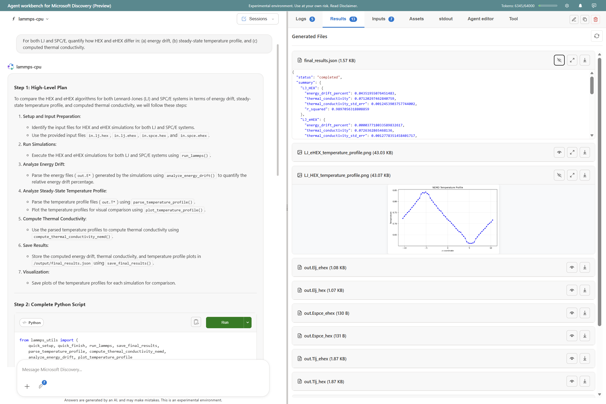

# Agent Workbench User Guide

This guide explains how to use the Microsoft Discovery Agent Workbench to develop, test, and publish agents.  


---

## Interface Overview

The workbench has three main areas:

| Area | Purpose |
|------|---------|
| **Left Panel** | Chat interface for testing agents and asking Discovery questions |
| **Center Panel** | Agent browser and selector |
| **Right Panel** | YAML editor, Docker console, and publishing tools |

---

## Working with Agents

### Loading an Existing Agent

1. Use the **dropdown** at the top-left to select an agent
2. The agent's definition loads in the right panel tabs:
   - **Agent** — Main agent configuration
   - **Tool** — Tool definition and Dockerfile
   - **Entry** — Workflow/entry point configuration (if applicable)

### Creating a New Agent

#### From Documentation or Source Code

1. Click **New Agent** or use the generation wizard
2. Upload your tool's documentation, README, or source files
3. The LLM generates:
   - Agent definition (YAML)
   - Tool definition (YAML)
   - Dockerfile
4. Review and edit the generated files
5. Save to your configured agent directory

#### From a Template

1. Select a template type:
   - **Tool Agent** — Wraps a scientific tool
   - **Knowledge Base Agent** — RAG over vector stores
   - **Workflow Agent** — Orchestrates multiple agents
   - **Planner / Router / Summarizer** — Specialized orchestration patterns
2. Customize the generated definition

---

## Testing Agents Locally

### Building the Tool Container

1. Select your agent from the dropdown
2. Go to the **Tool** tab in the right panel
3. Click **Build & Start**
4. Watch the build progress in the console
5. Once complete, the container runs locally

**Note**: The container uses `/input` as the default mount point for input files and `/output` for output files.

### Interactive Chat Testing

1. With the container running, use the **left panel chat**
2. Ask questions that invoke the tool
3. The agent generates Python code to call the tool
4. Click **Run** to execute the code
5. View results in the output area  

The LLM endpoint is provides in the system context information about where the input and output directories are mounted inside the container. It uses this information to generate code that reads from `/input` and writes to `/output`.

---

## Interactive Debugging Mode

The workbench supports **interactive debugging sessions** with full VS Code integration for both local Docker containers and Supercomputer jobs.

### Enabling Interactive Mode

**Option 1: First-Time Prompt**
- When you run code for the first time, a dialog asks if you want to start an interactive debugging session
- Choose "Start Interactive Session" to enable interactive mode for that run
- Check "Don't ask me again" to remember your preference

**Option 2: Toggle Switch**
- Use the **Interactive Mode** toggle at the top of the page
- Enable it before running code to start an interactive session

### What is Interactive Mode?

Interactive mode provides:
- **Full VS Code environment** in your browser or desktop client
- **Real-time debugging** with breakpoints and variable inspection
- **Live code editing** directly in the execution environment
- **File system access** to view inputs, outputs, and intermediate files
- **Session persistence** — sessions stay active for 30 minutes (configurable)

### Using Interactive Mode Locally (Docker)

1. **Start Session**:
   - Enable Interactive Mode toggle or accept the first-time prompt
   - Click **Run** on any code block
   - Wait for tunnel setup (shows connection details when ready)

2. **Connect**:
   - **Browser**: Click the provided `vscode.dev/tunnel/...` link
   - **Desktop**: Copy and run the `code --remote tunnel+...` command
   - Authenticate with GitHub (one-time per tunnel name)

3. **Debug**:
   - Your workspace is at `/workspace` (or `/tmp/workspace` for restricted containers)
   - Scripts are in `/workspace/scripts`
   - Input files at `/workspace/input` (mapped to `/input` in the container)
   - Output files at `/workspace/output` (mapped to `/output` in the container)
   - **Note**: The `/workspace/input` and `/workspace/output` folders in the workspace are symlinks to the container's `/input` and `/output` directories, ensuring seamless file access between the host and container.
   - Set breakpoints, inspect variables, edit code

4. **Close Session**:
   - Click the **Cancel** button to end the session
   - Or let it timeout after 30 minutes

**Tunnel Naming**: Local Docker sessions use tunnel names like `loc-moltoolkit` (based on agent name).

### Using Interactive Mode on Supercomputer

1. **Start Session**:
   - Enable Interactive Mode toggle
   - Submit code to run on Supercomputer
   - Wait for job to start and tunnel to be established

2. **Connect**:
   - Connection details appear in the execution output
   - Same process as local: browser link or desktop command
   - Authenticate with GitHub if needed

3. **Debug**:
   - Your workspace reflects the Supercomputer environment
   - Access mounted data assets, inputs, and outputs
   - Debug directly on the compute node

4. **Close Session**:
   - Click the **Cancel** button to terminate the job
   - Session closes automatically when job completes or times out

**Tunnel Naming**: Supercomputer sessions use tunnel names like `rmt-moltoolkit` (based on tool name).

### Troubleshooting Interactive Mode

| Issue | Solution |
|-------|----------|
| **Connection fails** | Click "Reset Tunnel" button to clear tunnel state and try again |
| **Workspace path issues** | Check session logs for the actual workspace path (`/workspace` or `/tmp/workspace`) |
| **Auth code not working** | Ensure you're logged into GitHub and the code hasn't expired (10 minutes) |
| **Tunnel name conflicts** | Local (`loc-`) and remote (`rmt-`) prefixes prevent collisions between environments |
| **Session not closing** | Use the Cancel button; it properly closes both local and remote sessions |

### Managing Preferences

- **First-time prompt preference** is saved to browser localStorage
- **Persists across sessions** — won't ask again if you checked "Don't ask me again"
- **Reset preference**: Clear browser data for the workbench site
- **Toggle always available** — Turn interactive mode on/off anytime regardless of preference

### Pre-installing Tunnel Requirements (optional)

To speed up interactive session startup, you can pre-install the VS Code CLI in your tool's Docker image.

**For Debian/Ubuntu-based images:**

```dockerfile
# Install dependencies and VS Code CLI
RUN apt-get update && apt-get install -y \
    curl \
    ca-certificates \
    && rm -rf /var/lib/apt/lists/*

# Download and install VS Code CLI (x64)
RUN curl -Lk 'https://code.visualstudio.com/sha/download?build=stable&os=cli-alpine-x64' \
    --output vscode_cli.tar.gz \
    && tar -xf vscode_cli.tar.gz -C /usr/local/bin \
    && rm vscode_cli.tar.gz \
    && chmod +x /usr/local/bin/code
```

**For Alpine-based images:**

```dockerfile
# Install dependencies
RUN apk add --no-cache \
    curl \
    ca-certificates \
    libstdc++ \
    libgcc

# Download and install VS Code CLI (x64)
RUN curl -Lk 'https://code.visualstudio.com/sha/download?build=stable&os=cli-alpine-x64' \
    --output vscode_cli.tar.gz \
    && tar -xf vscode_cli.tar.gz -C /usr/local/bin \
    && rm vscode_cli.tar.gz \
    && chmod +x /usr/local/bin/code
```

**For RHEL/CentOS/Fedora-based images:**

```dockerfile
# Install dependencies
RUN yum install -y \
    curl \
    ca-certificates \
    && yum clean all

# Download and install VS Code CLI (x64)
RUN curl -Lk 'https://code.visualstudio.com/sha/download?build=stable&os=cli-alpine-x64' \
    --output vscode_cli.tar.gz \
    && tar -xf vscode_cli.tar.gz -C /usr/local/bin \
    && rm vscode_cli.tar.gz \
    && chmod +x /usr/local/bin/code
```

**Notes:**
- The `code` binary must be in `/usr/local/bin` or on the system PATH
- For ARM64 architecture, use `cli-alpine-arm64` instead of `cli-alpine-x64`
- Verify installation with: `docker run --rm <your-image> code --version`


<video controls src="Workbench_Build_Tool.mp4" title="Build and Run Tool"></video>

### Example: Testing ChEMBL Agent

```
You: Find high-affinity compounds for ABL1

Agent: I'll search the ChEMBL database for ABL1 inhibitors...
[Generated Python code appears]

[Click Run]

Output: Found 247 compounds with IC50 < 100nM...
```

---

## Editing Agent Definitions

### YAML Editor

The right panel provides a syntax-aware editor for:

| Tab | Content |
|-----|---------|
| **Agent** | Agent metadata, instructions, model configuration |
| **Tool** | Tool name, description, parameters, execution settings |
| **Dockerfile** | Container build instructions |
| **Environment** | Environment variables for the container |

### Validation

- **Real-time syntax checking** highlights errors as you type
- **Schema validation** ensures compatibility with the Discovery platform
- **Save** writes changes to disk; **Validate** checks without saving

---

## Publishing to Discovery

### Publishing a Tool

1. Ensure the tool container builds successfully
2. Go to **Tool** tab → Click **Publish**
3. The workbench:
   - Builds the Docker image
   - Pushes to your Azure Container Registry
   - Registers the tool in your Discovery workspace
4. Monitor progress in the console

### Publishing an Agent

1. Validate the agent definition (errors block publishing)
2. Click **Publish to Discovery**
3. Select the target workspace and project
4. Confirm the publish operation

### Profile Management

Switch between different Azure configurations:

1. Click the **profile icon** in the header
2. Select an existing profile or create a new one
3. Each profile stores:
   - Azure subscription/resource group
   - ACR and OpenAI settings
   - Supercomputer configuration

---

## Running on the Supercomputer

### Submitting a Job

1. Configure Supercomputer settings (see [Setup Guide](./README_SetupGuide.md))
2. In the chat, request a computation that requires the Supercomputer
3. The agent generates a script and offers to submit it
4. Click **Submit to Supercomputer**

### Monitoring Jobs

- **Status** — View running, queued, completed, or failed jobs
- **Logs** — Stream logs in real-time while the job runs
- **Cancel** — Stop a running or queued job
- **Results** — Download outputs when complete

---

## Asking Questions About Discovery

The workbench includes an intelligent Q&A system for Microsoft Discovery documentation.

### How to Use

1. In the chat, ask any question about Discovery:
   - "How do I create a supercomputer?"
   - "What is a bookshelf?"
   - "How do I configure ACR authentication?"
2. The system retrieves relevant documentation and generates an answer


---

## Workflow Agents

### Creating a Workflow

1. Create a **Workflow Agent** that orchestrates other agents
2. Define the workflow steps:
   - Which agents to call
   - Input/output dependencies
   - Conditional routing logic
3. Use the **Diagram** button to visualize the workflow (Mermaid format)

### Agents

| Pattern | Use Case |
|---------|----------|
| **Planner** | Creates an overall step by step plan (e.g., Prep → Dock → Analyze) |
| **Router** | Select the best agent based on query intent |
| **Functional agent** | Performs specific tasks within the workflow |
| **Summarizer** | Review the final results and provides summary to user |

---

## File Management

### Inputs Folder

Upload input files for testing:

1. Go to **Inputs** tab
2. Drag-and-drop files or click **Upload**
3. Files are available to the tool container at `/inputs`

**Note**: These files are mapped to `/input` in the container.

### Outputs Folder

View generated results:

1. Go to **Outputs** tab
2. Preview or download files
3. Output location: `/outputs` in the container

**Note**: These files are mapped to `/output` in the container.

### Viewing Result Files

The workbench includes an extensible visualization system that automatically renders files based on their type:

| File Type | Visualization |
|-----------|---------------|
| `.pdb`, `.sdf`, `.mol2`, `.cif` | 3D molecular structure viewer |
| `.xyz`, `.lammpstrj`, `.gsd` | MD trajectory player with playback controls |
| `.png`, `.jpg`, `.gif`, `.svg` | Image viewer with zoom/pan |
| `.json`, `.csv`, `.xml`, `.yaml` | Formatted display with syntax highlighting |
| `.txt`, `.log`, `.out` | Text preview |
| `.html` | Sandboxed web content |

**To view a file:**
- **Preview** — Click any file in the Results or Logs panel
- **Full View** — Click the file header or "View" button for an expanded modal with full interactive controls

**Molecular viewer controls:**
- **Rotate** — Left-click + drag
- **Zoom** — Scroll wheel
- **Pan** — Right-click + drag

For trajectory playback, use `Space` to play/pause, arrow keys for frame navigation.

See the **[Visualization Extensions Guide](./README_Visualization_Extensions.md)** for the complete list of supported formats and developer documentation on creating custom viewers.

---

## Tips & Best Practices

| Tip | Details |
|-----|---------|
| **Start with a sample agent** | Build and test `ChEMBL` first to verify your setup |
| **Validate before publishing** | Catches errors that block deployment |
| **Test locally first** | Faster iteration than Supercomputer submissions |
| **Check nodepool compatibility** | Tool recommendations should match available SKUs |

---

## Known Limitations

- **Agent file paths** — Agents must be in the directories configured in settings
- **Mermaid diagrams** — Complex workflows may need multiple generation attempts
- **AI accuracy varies** — Review and edit generated definitions before publishing

---

## Next Steps

- **[Setup Guide](./README_SetupGuide.md)** — Configuration and prerequisites
- **[Visualization Extensions](./README_Visualization_Extensions.md)** — File viewers and creating custom extensions
- **[MCP Server](../mcp-server/README.md)** — VS Code / GitHub Copilot integration
- **[Main README](../README.md)** — Overview and quick start
