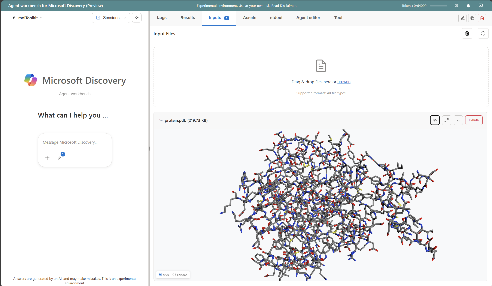

# Visualization Extensions Guide

This guide explains the Agent Workbench's visualization extensibility system—both from an **end-user perspective** (using visualizations) and a **developer perspective** (creating new extensions for specific file formats).



---

## Overview

The Agent Workbench includes a modular visualization extension system that automatically renders files based on their type. When you view a file in the Results or Logs panel, the system:

1. Identifies the file extension (e.g., `.pdb`, `.xyz`, `.json`)
2. Finds the best matching visualization extension
3. Renders an interactive preview or full-screen view

The system supports molecular structures, trajectories, images, structured data, and more—with the ability to add custom extensions for any file format.

---

## End-User Guide

### Viewing Files

Files are automatically visualized when you:

- **Click a file** in the Results panel → Shows a preview
- **Click "View" or the file header** → Opens full-screen modal with interactive controls

### Supported File Types

| Category | File Types | Viewer Features |
|----------|-----------|-----------------|
| **Molecular Structures** | `.pdb`, `.sdf`, `.mol2`, `.cif`, `.xyz` | 3D rotation, zoom, multiple styles |
| **MD Trajectories** | `.xyz` (multi-frame), `.lammpstrj`, `.gsd`, `.xtc`, `.trr` | Playback, frame navigation, analysis tools |
| **GROMACS/Simulation** | `.gro`, `.mmcif`, `.mmtf`, `.top`, `.prmtop` | Structure visualization |
| **Images** | `.png`, `.jpg`, `.jpeg`, `.gif`, `.svg` | Zoom, pan |
| **Structured Data** | `.json`, `.csv`, `.xml`, `.yaml` | Formatted display, syntax highlighting |
| **Text/Logs** | `.txt`, `.log`, `.out`, `.dat`, `.cfg` | Text preview with scroll |
| **Web Content** | `.html`, `.htm` | Sandboxed rendering |

### Preview vs Full View

| Mode | Description |
|------|-------------|
| **Preview** | Compact inline view within the file list. Limited interactivity. |
| **Full View** | Expanded modal with full interactive controls. Press `Escape` to close. |

### Molecular Viewer Controls

For 3D molecular viewers (XYZ, PDB, 3DMol, NGL):

| Action | Control |
|--------|---------|
| **Rotate** | Left-click + drag |
| **Zoom** | Scroll wheel |
| **Pan** | Right-click + drag |

### Trajectory Playback Controls

For MD trajectory viewer (multi-frame XYZ, LAMMPS trajectories):

| Key | Action |
|-----|--------|
| `Space` | Play/Pause |
| `←` `→` | Previous/Next frame |
| `Home` | First frame |
| `End` | Last frame |
| `[` `]` | Adjust playback speed |
| `S` | Toggle stick/sphere rendering |
| `L` | Toggle loop mode |

### Smart Extension Selection

When multiple extensions support a file type, the system automatically chooses the best one:

- **Large XYZ files** (>500 atoms or multiple frames) → MD Trajectory Viewer with WebGPU acceleration
- **Small XYZ files** (single frame, few atoms) → Standard XYZ Viewer
- **PDB/CIF files** → 3DMol Viewer with protein visualization

This happens automatically based on file content analysis.

---

## Developer Guide: Creating New Extensions

This section explains how to create a new visualization extension for custom file formats.

### Architecture Overview

```
HTML File (agent_web.html)
    │
    ├── Base Scripts Loaded
    │   ├── base-extension.js      (Base class)
    │   ├── extension-registry.js  (Central registry)
    │   ├── extension-manager.js   (Render lifecycle)
    │   └── extension-styles.css   (Shared styles)
    │
    └── Extensions Auto-Register
        ├── default-text-extension.js
        ├── xyz-extension.js
        ├── 3dmol-extension.js
        ├── image-extension.js
        ├── html-extension.js
        ├── ngl-extension.js
        └── md-trajectory-extension.js
```

### Step 1: Create the Extension Class

Create a new file `extensions/my-viewer/my-extension.js`:

```javascript
/**
 * My Custom Viewer Extension
 * Visualizes .myformat files
 */
class MyExtension extends BaseExtension {
    constructor() {
        super('My Viewer', ['.myformat', '.myf'], {
            hasPreview: true,     // Can render inline preview
            hasFullView: true,    // Can render full modal view
            interactive: true,    // Supports user interaction
            resizable: true,      // Handles container resize
            priority: 0           // Priority for file type conflicts
        });

        // Track viewers by container for cleanup
        this.viewers = new Map();
    }

    /**
     * Return folder path for icon and styles
     */
    getExtensionFolder() {
        return 'extensions/my-viewer';
    }

    /**
     * Check if this extension should handle the file
     * Can inspect content for smart decisions
     */
    async canHandle(filename, content) {
        const ext = '.' + filename.split('.').pop().toLowerCase();
        if (!this.supportedTypes.includes(ext)) {
            return false;
        }

        // Optional: Validate file content
        try {
            return this.validateFormat(content);
        } catch (e) {
            return false;
        }
    }

    /**
     * Load external libraries (called once before first render)
     */
    async initialize() {
        if (typeof MyLibrary === 'undefined') {
            await this.loadLibrary();
        }
        await super.initialize();
        return true;
    }

    /**
     * Render compact inline preview
     */
    async renderPreview(container, filename, content, options = {}) {
        const width = options.width || 300;
        const height = options.height || 200;

        try {
            container.innerHTML = '';
            const viewer = this.createViewer(container, content, {
                width, height, mode: 'preview'
            });

            this.viewers.set(container, viewer);
            return { success: true };
        } catch (error) {
            this.createErrorDisplay(`Preview failed: ${error.message}`, container);
            return { success: false, error: error.message };
        }
    }

    /**
     * Render expanded full-screen view
     */
    async renderFullView(container, filename, content, options = {}) {
        const width = options.width || 800;
        const height = options.height || 600;

        try {
            container.innerHTML = '';
            const viewer = this.createViewer(container, content, {
                width, height, mode: 'fullview', interactive: true
            });

            this.viewers.set(container, viewer);
            this.addControlPanel(container, viewer);

            return { success: true };
        } catch (error) {
            this.createErrorDisplay(`Full view failed: ${error.message}`, container);
            return { success: false, error: error.message };
        }
    }

    /**
     * Handle container resize events
     */
    onResize(width, height) {
        // Update canvas or rendering dimensions
        for (const [container, viewer] of this.viewers) {
            if (viewer.resize) {
                viewer.resize(width, height);
            }
        }
    }

    /**
     * Clean up all resources
     */
    async cleanup() {
        for (const [container, viewer] of this.viewers) {
            if (viewer.dispose) viewer.dispose();
        }
        this.viewers.clear();
        await super.cleanup();
    }

    // Helper methods
    async loadLibrary() {
        return new Promise((resolve, reject) => {
            const script = document.createElement('script');
            script.src = 'https://cdn.example.com/my-library.js';
            script.onload = resolve;
            script.onerror = reject;
            document.head.appendChild(script);
        });
    }

    createViewer(container, content, options) {
        // Implementation specific to your visualization
        return { dispose: () => {} };
    }

    addControlPanel(container, viewer) {
        const panel = document.createElement('div');
        panel.className = 'my-viewer-controls';
        panel.innerHTML = `<button>Option</button>`;
        container.appendChild(panel);
    }

    validateFormat(content) {
        // Validate file format
        return true;
    }
}

// Auto-register when script loads
if (typeof extensionRegistry !== 'undefined') {
    extensionRegistry.register(new MyExtension());
}
```

### Step 2: Create Directory Structure

```
extensions/my-viewer/
├── my-extension.js      # Main extension code
├── my-styles.css        # Extension-specific styles (optional)
├── icon.svg             # 16x16 icon for file list
└── README.md            # Documentation (optional)
```

### Step 3: Create the Icon

Create `extensions/my-viewer/icon.svg`:

```svg
<svg width="16" height="16" viewBox="0 0 16 16" xmlns="http://www.w3.org/2000/svg">
    <rect x="2" y="2" width="12" height="12" rx="2" fill="#4A90D9"/>
    <text x="8" y="11" text-anchor="middle" fill="white" font-size="8">M</text>
</svg>
```

### Step 4: Add Styles (Optional)

Create `extensions/my-viewer/my-styles.css`:

```css
.my-viewer-container {
    width: 100%;
    height: 100%;
    position: relative;
    background: #1e1e1e;
}

.my-viewer-controls {
    position: absolute;
    bottom: 8px;
    left: 50%;
    transform: translateX(-50%);
    padding: 8px 16px;
    background: rgba(0, 0, 0, 0.7);
    border-radius: 4px;
    display: flex;
    gap: 8px;
}

.my-viewer-controls button {
    padding: 4px 12px;
    border: none;
    border-radius: 3px;
    background: #4A90D9;
    color: white;
    cursor: pointer;
}

.my-viewer-controls button:hover {
    background: #357ABD;
}
```

### Step 5: Register in HTML

Add to `agent_web.html`:

```html
<!-- Extension system core (already present) -->
<script src="extensions/base-extension.js"></script>
<script src="extensions/extension-registry.js"></script>
<script src="extensions/extension-manager.js"></script>

<!-- Your new extension -->
<script src="extensions/my-viewer/my-extension.js"></script>
<link rel="stylesheet" href="extensions/my-viewer/my-styles.css">
```

---

## Extension API Reference

### BaseExtension Properties

| Property | Type | Description |
|----------|------|-------------|
| `name` | string | Display name of the extension |
| `supportedTypes` | string[] | File extensions handled (e.g., `['.pdb', '.cif']`) |
| `capabilities` | object | Feature flags (see below) |
| `initialized` | boolean | Whether `initialize()` has been called |

### Capabilities Object

```javascript
{
    hasPreview: true,    // Can render preview mode
    hasFullView: true,   // Can render full modal view
    interactive: false,  // Supports user interaction
    resizable: true,     // Handles container resize events
    priority: 0          // Priority (-100 to 100, higher wins)
}
```

### Required Methods

| Method | Description |
|--------|-------------|
| `canHandle(filename, content)` | Return `true` if extension should handle this file |
| `renderPreview(container, filename, content, options)` | Render inline preview |
| `renderFullView(container, filename, content, options)` | Render full modal view |

### Optional Methods

| Method | Description |
|--------|-------------|
| `initialize()` | Load libraries, set up resources (called once) |
| `cleanup()` | Dispose resources, stop animations |
| `onResize(width, height)` | Handle container resize |
| `getExtensionFolder()` | Return path to extension folder for icon |
| `getMenuItems(filename, content)` | Provide custom context menu items |

### Utility Methods (Inherited)

| Method | Description |
|--------|-------------|
| `createErrorDisplay(message, container)` | Show error UI in container |
| `createLoadingDisplay(container, message)` | Show loading spinner |
| `getMetadata()` | Return extension metadata |

---

## Advanced Patterns

### Pattern 1: Content-Based Extension Selection

Use `canHandle()` to inspect file content and decide whether to handle it:

```javascript
async canHandle(filename, content) {
    if (!filename.endsWith('.xyz')) return false;

    // Large trajectories go to this extension
    const atomCount = parseInt(content.split('\n')[0]);
    const frameCount = this.countFrames(content);

    return frameCount > 1 || atomCount > 500;
}
```

### Pattern 2: Per-Container Resource Management

Track resources by container to avoid interference between multiple views:

```javascript
constructor() {
    super('My Viewer', ['.xyz']);
    this.renderers = new Map();  // container → renderer
}

async renderPreview(container, filename, content, options) {
    const renderer = new MyRenderer(container);
    this.renderers.set(container, renderer);
    return { success: true };
}

async cleanup() {
    for (const [container, renderer] of this.renderers) {
        renderer.dispose();
    }
    this.renderers.clear();
}
```

### Pattern 3: Lazy Library Loading

Load heavy libraries only when first needed:

```javascript
async initialize() {
    if (typeof THREE === 'undefined') {
        const script = document.createElement('script');
        script.src = 'https://cdnjs.cloudflare.com/ajax/libs/three.js/r128/three.min.js';
        document.head.appendChild(script);

        // Wait for library to load
        while (typeof THREE === 'undefined') {
            await new Promise(r => setTimeout(r, 50));
        }
    }
    await super.initialize();
}
```

### Pattern 4: Responsive Canvas Sizing

Handle dynamic container resizing:

```javascript
createCanvas(container) {
    const canvas = document.createElement('canvas');
    canvas.style.width = '100%';
    canvas.style.height = '100%';
    canvas.style.display = 'block';
    container.appendChild(canvas);
    return canvas;
}

onResize(width, height) {
    for (const [container, renderer] of this.renderers) {
        const canvas = container.querySelector('canvas');
        canvas.width = width;
        canvas.height = height;
        renderer.setSize(width, height);
    }
}
```

---

## Debugging Extensions

### Browser Console Commands

```javascript
// List all registered extensions
extensionRegistry.getAllExtensions()

// Get registry statistics
extensionRegistry.getStats()

// Find extensions for a file type
extensionRegistry.getExtensionsForType('.pdb')

// Test extension selection
await extensionRegistry.findExtension('test.xyz', fileContent)

// Manually render a file
await extensionManager.renderFile(
    document.getElementById('preview'),
    'test.json',
    '{"key": "value"}',
    'preview'
)
```

### Common Issues

| Issue | Cause | Solution |
|-------|-------|----------|
| Extension not found | Script not loaded or registration failed | Check `<script>` tags in HTML, check console for errors |
| Icon not showing | Wrong path in `getExtensionFolder()` | Return correct relative path |
| Canvas too small | CSS not set to 100% | Use `width: 100%; height: 100%;` |
| Multiple viewers interfere | Shared state between containers | Use Map to track by container |
| Animation continues after close | Missing cleanup | Call `cancelAnimationFrame()` in `cleanup()` |
| Wrong extension used | `canHandle()` too permissive | Add content validation or adjust priority |

---

## File Type to Extension Mapping

The registry maps file extensions to viewers:

```
.pdb  → [3DMol Viewer, NGL Viewer]
.xyz  → [MD Trajectory Viewer (priority:10), XYZ Viewer (priority:0)]
.json → [Default Text Viewer]
.png  → [Image Viewer]
```

When multiple extensions handle a file type:
1. Sort by priority (highest first)
2. Call `canHandle()` on each until one returns `true`
3. Use that extension

---

## Existing Extensions Reference

| Extension | File Types | Key Features |
|-----------|-----------|--------------|
| **Default Text** | `.txt`, `.log`, `.json`, `.csv`, `.xml`, `.yaml`, `.md` | Syntax highlighting, table rendering |
| **XYZ Viewer** | `.xyz` | 3D molecules with Three.js, CPK colors |
| **3DMol Viewer** | `.pdb`, `.sdf`, `.mol2`, `.cif` | Protein visualization, multiple styles |
| **NGL Viewer** | `.gro`, `.mmcif`, `.mmtf`, `.dcd`, `.xtc`, `.trr` | Advanced molecular graphics |
| **MD Trajectory** | `.xyz`, `.lammpstrj`, `.gsd`, `.h5md` | WebGPU rendering, playback, analysis |
| **Image Viewer** | `.png`, `.jpg`, `.gif`, `.svg` | Zoom, pan |
| **HTML Viewer** | `.html`, `.htm` | Sandboxed iframe rendering |

Source code location: `utils/agent-workbench/extensions/`

---

## Summary

The visualization extension system provides:

- **Zero-configuration usage** — Extensions auto-discover files by extension
- **Smart routing** — Priority + content inspection ensures the right viewer
- **Resource isolation** — Per-container tracking prevents memory leaks
- **Responsive design** — ResizeObserver handles dynamic sizing
- **Easy extensibility** — Clear interface for creating new extensions

To add a new extension:
1. Extend `BaseExtension`
2. Implement `canHandle()`, `renderPreview()`, `renderFullView()`
3. Create folder with `icon.svg` and optional styles
4. Add auto-registration code
5. Include in `agent_web.html`
