# Combined Documentation for Microsoft Discovery
_Generated: 2025-12-31 16:32:29_

## Table of Contents
- [README.md](#readmemd)
- [SECURITY.md](#securitymd)
- [1-overview/1-microsoft-discovery-overview.md](#1-overview1-microsoft-discovery-overviewmd)
- [1-overview/2-resource-types.md](#1-overview2-resource-typesmd)
- [1-overview/3-discovery-resources-relationship-diagrams.md](#1-overview3-discovery-resources-relationship-diagramsmd)
- [1-overview/4-faq.md](#1-overview4-faqmd)
- [1-overview/5-troubleshooting.md](#1-overview5-troubleshootingmd)
- [2-getting-started/quickstart.md](#2-getting-startedquickstartmd)
- [3-concepts/agents.md](#3-conceptsagentsmd)
- [3-concepts/bookshelf.md](#3-conceptsbookshelfmd)
- [3-concepts/cognition.md](#3-conceptscognitionmd)
- [3-concepts/copilot.md](#3-conceptscopilotmd)
- [3-concepts/engine.md](#3-conceptsenginemd)
- [3-concepts/models.md](#3-conceptsmodelsmd)
- [3-concepts/supercomputer.md](#3-conceptssupercomputermd)
- [3-concepts/tasks.md](#3-conceptstasksmd)
- [3-concepts/tools.md](#3-conceptstoolsmd)
- [4-how-to/README.md](#4-how-toreadmemd)
- [4-how-to/1-prep-work/a--prepare-code-repo.md](#4-how-to1-prep-worka-prepare-code-repomd)
- [4-how-to/10-discovery-studio-preview-experience/a--preview-experience.md](#4-how-to10-discovery-studio-preview-experiencea-preview-experiencemd)
- [4-how-to/11-debug-issues/README.md](#4-how-to11-debug-issuesreadmemd)
- [4-how-to/11-debug-issues/a-workspace-logs.md](#4-how-to11-debug-issuesa-workspace-logsmd)
- [4-how-to/11-debug-issues/b-supercomputer-logs.md](#4-how-to11-debug-issuesb-supercomputer-logsmd)
- [4-how-to/11-debug-issues/c-bookshelf-query-logs.md](#4-how-to11-debug-issuesc-bookshelf-query-logsmd)
- [4-how-to/2-onboarding-experience/a--rp-registration.md](#4-how-to2-onboarding-experiencea-rp-registrationmd)
- [4-how-to/2-onboarding-experience/b--quota-reservations.md](#4-how-to2-onboarding-experienceb-quota-reservationsmd)
- [4-how-to/2-onboarding-experience/c--role-assignments.md](#4-how-to2-onboarding-experiencec-role-assignmentsmd)
- [4-how-to/2-onboarding-experience/d--resource-naming.md](#4-how-to2-onboarding-experienced-resource-namingmd)
- [4-how-to/3-basic-building-blocks/a--virtual-network-subnets.md](#4-how-to3-basic-building-blocksa-virtual-network-subnetsmd)
- [4-how-to/3-basic-building-blocks/b--acr-creation.md](#4-how-to3-basic-building-blocksb-acr-creationmd)
- [4-how-to/3-basic-building-blocks/c--managed-identities.md](#4-how-to3-basic-building-blocksc-managed-identitiesmd)
- [4-how-to/4-discovery-infra-resources/a--discovery-storage.md](#4-how-to4-discovery-infra-resourcesa-discovery-storagemd)
- [4-how-to/4-discovery-infra-resources/b--data-containers-data-assets.md](#4-how-to4-discovery-infra-resourcesb-data-containers-data-assetsmd)
- [4-how-to/4-discovery-infra-resources/c--supercomputer.md](#4-how-to4-discovery-infra-resourcesc-supercomputermd)
- [4-how-to/4-discovery-infra-resources/d--workspace-creation.md](#4-how-to4-discovery-infra-resourcesd-workspace-creationmd)
- [4-how-to/4-discovery-infra-resources/e--tool-invocations-workloads.md](#4-how-to4-discovery-infra-resourcese-tool-invocations-workloadsmd)
- [4-how-to/5-tool-image/a--create-and-publish-container-image.md](#4-how-to5-tool-imagea-create-and-publish-container-imagemd)
- [4-how-to/6-tools-models-agents/a--model-deployment.md](#4-how-to6-tools-models-agentsa-model-deploymentmd)
- [4-how-to/6-tools-models-agents/b--tool-deployment.md](#4-how-to6-tools-models-agentsb-tool-deploymentmd)
- [4-how-to/6-tools-models-agents/c--agent-deployment.md](#4-how-to6-tools-models-agentsc-agent-deploymentmd)
- [4-how-to/6-tools-models-agents/d--updating-tool-model-agent-resource.md](#4-how-to6-tools-models-agentsd-updating-tool-model-agent-resourcemd)
- [4-how-to/6-tools-models-agents/agents-publishing/a--create-agent-definition.md](#4-how-to6-tools-models-agentsagents-publishinga-create-agent-definitionmd)
- [4-how-to/6-tools-models-agents/agents-publishing/b--model-selection-and-prompting-guide.md](#4-how-to6-tools-models-agentsagents-publishingb-model-selection-and-prompting-guidemd)
- [4-how-to/6-tools-models-agents/agents-publishing/c--tutorial-01-single-agent-qa.md](#4-how-to6-tools-models-agentsagents-publishingc-tutorial-01-single-agent-qamd)
- [4-how-to/6-tools-models-agents/agents-publishing/d--tutorial-02-single-agent-kb.md](#4-how-to6-tools-models-agentsagents-publishingd-tutorial-02-single-agent-kbmd)
- [4-how-to/6-tools-models-agents/agents-publishing/e--tutorial-03-single-agent-tools.md](#4-how-to6-tools-models-agentsagents-publishinge-tutorial-03-single-agent-toolsmd)
- [4-how-to/6-tools-models-agents/agents-publishing/f--tutorial-04-multi-agent-workflow.md](#4-how-to6-tools-models-agentsagents-publishingf-tutorial-04-multi-agent-workflowmd)
- [4-how-to/6-tools-models-agents/models-publishing/byo-models/bring-your-own-model.md](#4-how-to6-tools-models-agentsmodels-publishingbyo-modelsbring-your-own-modelmd)
- [4-how-to/6-tools-models-agents/models-publishing/external-models/1a-microsoft-offered/a-microsoft-model-onboarding-to-catalog.md](#4-how-to6-tools-models-agentsmodels-publishingexternal-models1a-microsoft-offereda-microsoft-model-onboarding-to-catalogmd)
- [4-how-to/6-tools-models-agents/models-publishing/external-models/1a-microsoft-offered/b-microsoft-model-onboarding-to-discovery.md](#4-how-to6-tools-models-agentsmodels-publishingexternal-models1a-microsoft-offeredb-microsoft-model-onboarding-to-discoverymd)
- [4-how-to/6-tools-models-agents/models-publishing/external-models/2-common/model-definition.md](#4-how-to6-tools-models-agentsmodels-publishingexternal-models2-commonmodel-definitionmd)
- [4-how-to/6-tools-models-agents/models-publishing/tool-client-publish/a--tool-client-overview.md](#4-how-to6-tools-models-agentsmodels-publishingtool-client-publisha-tool-client-overviewmd)
- [4-how-to/6-tools-models-agents/models-publishing/tool-client-publish/b--tool-client-script.md](#4-how-to6-tools-models-agentsmodels-publishingtool-client-publishb-tool-client-scriptmd)
- [4-how-to/6-tools-models-agents/models-publishing/tool-client-publish/c--tool-client-publish.md](#4-how-to6-tools-models-agentsmodels-publishingtool-client-publishc-tool-client-publishmd)
- [4-how-to/6-tools-models-agents/tools-publishing/a--identify-tool-functionalities-and-dependencies.md](#4-how-to6-tools-models-agentstools-publishinga-identify-tool-functionalities-and-dependenciesmd)
- [4-how-to/6-tools-models-agents/tools-publishing/b--writing-action-scripts.md](#4-how-to6-tools-models-agentstools-publishingb-writing-action-scriptsmd)
- [4-how-to/6-tools-models-agents/tools-publishing/c--generate-docker-file.md](#4-how-to6-tools-models-agentstools-publishingc-generate-docker-filemd)
- [4-how-to/6-tools-models-agents/tools-publishing/d--create-validate-publish-tools-to-acr.md](#4-how-to6-tools-models-agentstools-publishingd-create-validate-publish-tools-to-acrmd)
- [4-how-to/6-tools-models-agents/tools-publishing/e--create-tool-definition.md](#4-how-to6-tools-models-agentstools-publishinge-create-tool-definitionmd)
- [4-how-to/6-tools-models-agents/tools-publishing/f--inline-files-support-for-action-based-tools.md](#4-how-to6-tools-models-agentstools-publishingf-inline-files-support-for-action-based-toolsmd)
- [4-how-to/6-tools-models-agents/tools-publishing/g--output_mount_configuration.md](#4-how-to6-tools-models-agentstools-publishingg-output_mount_configurationmd)
- [4-how-to/7-projects/a--creating-project.md](#4-how-to7-projectsa-creating-projectmd)
- [4-how-to/7-projects/b--updating-project.md](#4-how-to7-projectsb-updating-projectmd)
- [4-how-to/8-investigations/a--creating-investigation.md](#4-how-to8-investigationsa-creating-investigationmd)
- [4-how-to/8-investigations/b--running-a-sample-scenario.md](#4-how-to8-investigationsb-running-a-sample-scenariomd)
- [4-how-to/9-bookshelves-knowledgebases/a--bookshelf-deployment.md](#4-how-to9-bookshelves-knowledgebasesa-bookshelf-deploymentmd)
- [4-how-to/9-bookshelves-knowledgebases/b--document-upload.md](#4-how-to9-bookshelves-knowledgebasesb-document-uploadmd)
- [4-how-to/9-bookshelves-knowledgebases/c--knowledgebase-creation.md](#4-how-to9-bookshelves-knowledgebasesc-knowledgebase-creationmd)
- [5-management/billing.md](#5-managementbillingmd)
- [5-management/cost-management.md](#5-managementcost-managementmd)
- [5-management/resource-limits.md](#5-managementresource-limitsmd)
- [7-security-and-governance/microsoft-discovery-security-best-practices.md](#7-security-and-governancemicrosoft-discovery-security-best-practicesmd)
- [7-security-and-governance/Microsoft_Discovery_FAQ.md](#7-security-and-governancemicrosoft_discovery_faqmd)
- [7-security-and-governance/security-policies/README.md](#7-security-and-governancesecurity-policiesreadmemd)
- [8-release-notes/2511.3 Release Notes.md](#8-release-notes25113-release-notesmd)
- [includes/create-model-definition.md](#includescreate-model-definitionmd)

#readmemd

## README.md
Source: README.md (local)

# Microsoft Discovery Documentation (Private Preview)

Welcome to the official documentation repository for Microsoft Discovery, currently in private preview. Microsoft Discovery is an enterprise-grade platform designed to accelerate research and development through advanced AI, high-performance computing, and integrated knowledge management, including a cognitive layer capable of selecting fast or slow reasoning to decompose problems into manageable tasks, while learning from agent and tool outputs to improve decision making. 

> **Important:** This documentation is intended exclusively for participants in the Microsoft Discovery private preview program. Content and features are subject to change based on user feedback and ongoing development. Participants are expected to review all associated [legal documentation](#broken-link-7-security-and-governance-) to ensure a clear understanding of their responsibilities and the program's terms.

## Table of Contents

1. [Overview](#broken-link-1-overview-)
   - [Microsoft Discovery Overview](#1-overview1-microsoft-discovery-overviewmd)
   - [FAQ](#broken-link-1-overview-2-FAQ)
   - [Troubleshooting](#broken-link-1-overview-3-troubleshooting)
2. [Getting Started](#broken-link-2-getting-started-)
   - [Quickstart](#2-getting-startedquickstartmd)
3. [Concepts](#broken-link-3-concepts-)
   - [Resource Types](#broken-link-3-concepts-resource-types)
   - [Bookshelf](#3-conceptsbookshelfmd)
   - [Supercomputer](#3-conceptssupercomputermd)
   - [Copilot](#3-conceptscopilotmd)
   - [Cognition](#3-conceptscognitionmd)
   - [Engine](#3-conceptsenginemd)
   - [Agents](#3-conceptsagentsmd)
   - [Tools](#3-conceptstoolsmd)
   - [Models](#3-conceptsmodelsmd)
   - [Tasks](#3-conceptstasksmd)
4. [How-to Tutorials](#4-how-toreadmemd)
   - [Preparation and Setup](#broken-link-4-how-to-1-prep-work-)
   - [Onboarding Experience](#broken-link-4-how-to-2-onboarding-experience-) 
   - [Basic Building Blocks](#broken-link-4-how-to-3-basic-building-blocks-)
   - [Supercomputer & Storage Creation](#broken-link-4-how-to-4-supercomputers-storages-)
   - [Tool Image Creation](#broken-link-4-how-to-5-tool-image-)
   - [Tools, Models & Agents](#broken-link-4-how-to-6-tools-models-agents-)
   - [Projects](#broken-link-4-how-to-7-projects-)
   - [Investigations](#broken-link-4-how-to-8-investigations-)
   - [Bookshelves & Knowledge Bases](#broken-link-4-how-to-9-bookshelves-knowledgebases-)
5. [Management](#broken-link-5-management-)
   - [Resource Limits](#5-managementresource-limitsmd)
   - [Billing](#5-managementbillingmd)
   - [Cost Management](#5-managementcost-managementmd)
6. [Science Use Cases](#broken-link-6-solutions-use-cases-)
   - [Chemistry/Material Science](#broken-link-6-solutions-use-cases-chemistry)
   - [Biology/Pharma/Life Sciences](#broken-link-6-solutions-use-cases-biopharma)
   - [Silicon/Semiconductor](#broken-link-6-solutions-use-cases-silicon)
7. [Utilities](#broken-link-utils-)
   - [Validate and Deploy Infrastructure Scripts](#broken-link-utils-validate-and-deploy-infra-scripts-)
   - [Discovery Onboarding Validation](#broken-link-utils-validation-script-)
   - [Definition Content Creator](utils/definition-content-creator.py)
   - [VS Code Extension](#broken-link-utils-vs-code-extension-)
8. [Sample Tools and Models](#broken-link-6-solutions-)
   - [Tools and Models](#broken-link-6-solutions-tools-and-models-)
     - [RDKit Tool](#broken-link-6-solutions-tools-and-models-rdkit-tool-)
     - [GROMACS](#broken-link-6-solutions-tools-and-models-gromacs-)
     - [RetroChimera](6-solutions/tools-and-models/RetroChimera)
     - [Mol Toolkit](#broken-link-6-solutions-tools-and-models-molToolkit-)
     - [Mol Predictor Tool](#broken-link-6-solutions-tools-and-models-molPredictorTool-)
     - [PDB Search](#broken-link-6-solutions-tools-and-models-pdbSearch-)
     - [PubChem](#broken-link-6-solutions-tools-and-models-pubChem-)
     - [PubMed](#broken-link-6-solutions-tools-and-models-pubMed-)
     - [ChEMBL](#broken-link-6-solutions-tools-and-models-chembl-)
     - [BindingDB](#broken-link-6-solutions-tools-and-models-bindingdb-)
     - [Clinical Trials](#broken-link-6-solutions-tools-and-models-clinicalTrials-)
     - [HL Gap](#broken-link-6-solutions-tools-and-models-hlGap-)
     - [KB Agent](#broken-link-6-solutions-tools-and-models-kbAgent-)
     - [File Saver](#broken-link-6-solutions-tools-and-models-fileSaver-)
   - [Domain Scenarios](#broken-link-6-solutions-domain-scenarios-)
     - [Chemistry Scenarios](#broken-link-6-solutions-domain-scenarios-chemistry-)
     - [Silicon Scenarios](#broken-link-6-solutions-domain-scenarios-silicon-)
9. [Security and Governance](#broken-link-7-security-and-governance-)
   - [Security Best Practices](#7-security-and-governancemicrosoft-discovery-security-best-practicesmd)
   - [Security Policies](#7-security-and-governancesecurity-policiesreadmemd)
   - [Security Reporting](#securitymd)
   - [Microsoft Discovery FAQ](#7-security-and-governancemicrosoft_discovery_faqmd)
   - [Microsoft Discovery Code of Conduct](7-security-and-governance/Microsoft%20Discovery%20Code%20of%20Conduct%202025-06-25.pdf)
   - [Private Preview Agreement](7-security-and-governance/Microsoft%20Discovery%20Private%20Preview%20Agreement%20-%20Final%206.12.25.pdf)
   - [Transparency Notes](7-security-and-governance/Transparency%20Note%20for%20Microsoft%20Discovery%20-%202025-06-19.pdf)

## Quick Links

- **New to Discovery?** Start with the [Quickstart Guide](#2-getting-startedquickstartmd)
- **Ready to Deploy?** Use the [Infrastructure Deployment Scripts](#broken-link-utils-validate-and-deploy-infra-scripts-)
- **Building Tools?** Check out the [Publisher Guide](#4-how-toreadmemd)
- **Need Examples?** Browse [Sample Tools and Models](#broken-link-6-solutions-tools-and-models-)
- **VS Code User?** Try the [Discovery VS Code Extension](#broken-link-utils-vs-code-extension-)

## Support and Feedback

For assistance or to provide feedback during the private preview, please contact your Microsoft representative or use the designated feedback channels provided to you.

## Repository Structure

This repository is organized as follows:

- **`1-overview/`** - Platform overview, FAQ, and troubleshooting
- **`2-getting-started/`** - Getting started guide and quickstart
- **`3-concepts/`** - Core components and concepts
- **`4-how-to/`** - In-depth tutorials and how-to guides
- **`5-management/`** - Management center documentation
- **`6-solutions/`** - Sample tools, models, and domain-specific scenarios
- **`7-security-and-governance/`** - Security best practices, policies, and legal documentation
- **`utils/`** - Utility scripts and tools for deployment and development
- **`includes/`** - Shared documentation components and media files

#securitymd

## SECURITY.md
Source: SECURITY.md (local)

<!-- BEGIN MICROSOFT SECURITY.MD V1.0.0 BLOCK -->

## Security

Microsoft takes the security of our software products and services seriously, which
includes all source code repositories in our GitHub organizations.

**Please do not report security vulnerabilities through public GitHub issues.**

For security reporting information, locations, contact information, and policies,
please review the latest guidance for Microsoft repositories at
[https://aka.ms/SECURITY.md](#broken-link-https:--aka.ms-SECURITY).

<!-- END MICROSOFT SECURITY.MD BLOCK -->

#1-overview1-microsoft-discovery-overviewmd

## 1-overview/1-microsoft-discovery-overview.md
Source: 1-overview/1-microsoft-discovery-overview.md (local)

# Microsoft Discovery overview

Microsoft Discovery is an enterprise-grade research and development (R&D) platform that combines artificial intelligence (AI), high-performance computing (HPC), and advanced knowledge management to accelerate innovation across scientific and engineering domains. The platform empowers organizations to automate complex workflows, integrate proprietary data, and leverage multi-agent systems to drive breakthrough discoveries.

> [!NOTE]
> Microsoft Discovery is currently in **private preview**. Features and capabilities are subject to change. For access, contact your Microsoft representative.

## What is Microsoft Discovery?

Microsoft Discovery provides an integrated environment where researchers and engineers can:

- **Accelerate research workflows** through autonomous AI agents that handle literature review, hypothesis generation, simulation, and analysis
- **Connect distributed knowledge** using Graph Retrieval-Augmented Generation (GraphRAG) to index proprietary data alongside public scientific resources
- **Execute computational tasks** on scalable HPC infrastructure designed for scientific and engineering workloads
- **Collaborate seamlessly** within secure, enterprise-grade workspaces with role-based access control

The platform supports the entire R&D lifecycle—from initial knowledge exploration through experimental design, execution, and validation—in domains including chemistry, materials science, biology, pharmaceuticals, semiconductor design, and engineering simulation.

## Key capabilities

### 🤖 Intelligent multi-agent orchestration

Microsoft Discovery uses specialized AI agents that work together to solve complex research challenges. These [agents](#broken-link-..-3-concepts-agents) can:

- Operate domain-specific tools and models (GROMACS, SPICE, RDKit, and more)
- Coordinate multi-step workflows across different scientific domains
- Adapt reasoning strategies from quick heuristics to deep analysis
- Learn from execution outcomes to improve decision-making

> [!TIP]
> Start with pre-built agents for common scientific tasks, then customize or create your own agents for domain-specific needs. See [how to deploy agents](#broken-link-..-4-how-to-6-tools-models-agents-c--agent-deployment) to get started.

### 🧠 Discovery Engine with cognitive layer

The [Discovery Engine](#broken-link-..-3-concepts-engine) provides an ongoing reasoning process that works collaboratively with you on ambitious, long-duration research:

- **Adaptive cognition**: Selects between fast and slow reasoning patterns based on task complexity
- **Task decomposition**: Breaks down complex objectives into manageable subtasks
- **Continuous learning**: Improves decision-making by analyzing agent and tool outputs
- **Autonomous execution**: Works in the background on multi-day research initiatives

The cognitive layer enables intelligent routing of research challenges, determining which agents, tools, and data sources to use at each step.

### 📚 Bookshelf knowledge management

[Bookshelf](#broken-link-..-3-concepts-bookshelf) transforms your documents—including text, PDFs, Word files, PowerPoint presentations, and Excel spreadsheets—into queryable knowledge bases using advanced GraphRAG technology:

- **Graph-based retrieval**: Creates knowledge graphs that capture entity relationships, providing more accurate context than traditional RAG
- **Incremental indexing**: Add new documents without reprocessing the entire corpus
- **Agent integration**: Any agent can query your knowledge bases for grounded, traceable insights
- **Engineering support**: Index hardware specifications, simulation reports, design documents, and technical literature

> [!IMPORTANT]
> Unlike traditional vector-only approaches, Bookshelf's GraphRAG implementation captures semantic relationships between entities, leading to higher-quality responses for complex queries.

### 💬 Natural language interaction

Interact with the platform through [Microsoft Discovery Copilot](#broken-link-..-3-concepts-copilot), a conversational interface that:

- Understands research intent expressed in natural language
- Orchestrates multi-agent workflows transparently
- Maintains context across multi-turn conversations
- Provides real-time visibility into agent execution

Access Copilot through **Microsoft Discovery Studio**, a web-based interface for managing projects, investigations, and data.

### ⚡ High-performance compute infrastructure

Execute computationally intensive workloads on Azure-hosted [supercomputers](#broken-link-..-3-concepts-supercomputer):

- Scalable node pools with GPU and CPU options
- Secure virtual network integration
- Managed identity-based access control
- Integrated storage for input/output data

### 🔧 Extensible architecture

Microsoft Discovery's open architecture supports:

- **Bring your own models** (BYOM): Integrate custom AI models alongside Azure OpenAI
- **Custom tools**: Package domain-specific scientific software as containerized tools
- **Third-party integrations**: Connect to public databases (PubChem, PubMed, ChEMBL, BindingDB, Clinical Trials)
- **Flexible workflows**: Define sophisticated multi-agent orchestrations for your specific R&D processes

## Platform architecture

Microsoft Discovery is built on several core components:

| Component | Description | Learn more |
|-----------|-------------|------------|
| **Workspaces** | Collaborative environments for organizing projects and resources | [Resource types](#broken-link-2-resource-types) |
| **Projects** | Containers for investigations with defined agents, tools, and data | [Creating projects](#broken-link-..-4-how-to-7-projects-a--creating-project) |
| **Investigations** | Research studies where you interact with Copilot and analyze results | [Creating investigations](#broken-link-..-4-how-to-8-investigations-a--creating-investigation) |
| **Agents** | AI assistants that execute tasks using tools and models | [Agents concept](#broken-link-..-3-concepts-agents) |
| **Tools** | Containerized scientific software and utilities | [Tools concept](#broken-link-..-3-concepts-tools) |
| **Models** | AI models for reasoning and specialized tasks | [Models concept](#broken-link-..-3-concepts-models) |
| **Bookshelf** | Knowledge base creation and query service | [Bookshelf concept](#broken-link-..-3-concepts-bookshelf) |
| **Supercomputers** | HPC resources for executing computational workloads | [Supercomputer concept](#broken-link-..-3-concepts-supercomputer) |

## Industry applications

Microsoft Discovery accelerates innovation across multiple domains:

### Chemistry and materials science
- Molecular property prediction and optimization
- Retrosynthesis planning
- Materials discovery and characterization
- Reaction pathway analysis

**Learn more**: [Chemistry use cases](#broken-link-..-6-solutions-use-cases-chemistry) | [Chemistry scenarios](#broken-link-..-6-solutions-domain-scenarios-chemistry-)

### Biology and pharmaceuticals
- Drug target identification
- Protein structure analysis
- Binding affinity prediction
- Literature-based hypothesis generation

**Learn more**: [Biopharma use cases](#broken-link-..-6-solutions-use-cases-biopharma)

### Silicon and semiconductors
- Circuit simulation and verification
- Design rule checking
- Performance optimization
- Process variation analysis

**Learn more**: [Silicon use cases](#broken-link-..-6-solutions-use-cases-silicon) | [Silicon scenarios](#broken-link-..-6-solutions-domain-scenarios-silicon-)

### General engineering
- Simulation workflow automation
- Design space exploration
- Technical documentation analysis
- Multi-physics optimization

## Security and compliance

Microsoft Discovery runs on Azure's trusted cloud platform with:

- **Enterprise security**: Virtual network isolation, managed identities, role-based access control (RBAC)
- **Data sovereignty**: Resources deployed in your Azure subscription with full control over data location
- **Compliance**: Built-in support for regulatory requirements in highly regulated industries
- **Transparency**: Detailed logging and auditing of all agent actions and data access

> [!IMPORTANT]
> Review the [security best practices](#broken-link-..-7-security-and-governance-microsoft-discovery-security-best-practices) and [Microsoft Discovery FAQ](#broken-link-..-7-security-and-governance-Microsoft-Discovery-FAQ) before deploying to production environments.

## Getting started

Ready to explore Microsoft Discovery? Follow these steps:

1. **Review prerequisites**: Ensure you have an enabled Azure subscription and necessary permissions
2. **Complete the quickstart**: Deploy your first workspace, agents, and investigation
3. **Explore sample tools**: Try pre-built scientific tools and agents
4. **Build custom solutions**: Create domain-specific agents and workflows

> ➡️ **Next Step**
> [Start with the quickstart guide](#broken-link-..-2-getting-started-quickstart)

## Additional resources

### Documentation
- [Concepts](#broken-link-..-3-concepts-resource-types) - Understand core platform components
- [How-to guides](#broken-link-..-4-how-to-README) - Step-by-step tutorials for common tasks
- [Sample tools and models](#broken-link-..-6-solutions-tools-and-models-) - Pre-built components you can use immediately

### Deployment and utilities
- [Infrastructure deployment scripts](#broken-link-..-utils-validate-and-deploy-infra-scripts-) - Automate resource provisioning
- [Agent Workbench](#broken-link-..-utils-agent-workbench-) - Test and debug agents locally, and facilitate their deployment to Microsoft Discovery
- [Validation tools](#broken-link-..-utils-validation-script-) - Verify your deployment configuration

Note that the VS Code Extension has been retired and is no longer supported at this point.

### Community and support
- [FAQ](#broken-link--.1-overview-4-faq) - Frequently asked questions
- [Troubleshooting guide](#1-overview5-troubleshootingmd) - Common issues and solutions
- **Private preview support**: Contact your Microsoft representative for assistance

---

## What makes Microsoft Discovery unique?

Unlike traditional scientific computing platforms or standalone AI tools, Microsoft Discovery provides:

✅ **Unified environment**: No context switching between knowledge management, computation, and AI interaction  
✅ **Transparent AI**: Full visibility into agent reasoning, tool execution, and data provenance  
✅ **Enterprise-ready**: Built on Azure with compliance, security, and governance from day one  
✅ **Domain-agnostic**: Applicable across scientific and engineering disciplines with extensible architecture  
✅ **Collaborative**: Shared workspaces enable team-based research with appropriate access controls

> [!TIP]
> Microsoft Discovery is designed for complex, multi-faceted research challenges that benefit from autonomous AI assistance over hours or days, not simple one-off queries. Use the Discovery Engine for ambitious goals like "identify novel drug candidates with optimized binding affinity and reduced toxicity" rather than "what is the molecular weight of aspirin?"

## Next steps

Explore the platform by diving into these key topics:

- [Understand Discovery concepts](../3-concepts)
- [Deploy your first workspace](#broken-link-..-2-getting-started-quickstart)
- [Learn about agents and workflows](#broken-link-..-3-concepts-agents)
- [Create a knowledge base](../4-how-to/9-bookshelves-knowledgebases)
- [Review security best practices](#broken-link-..-7-security-and-governance-microsoft-discovery-security-best-practices)

#1-overview2-resource-typesmd

## 1-overview/2-resource-types.md
Source: 1-overview/2-resource-types.md (local)

# Microsoft Discovery Resource Types

Microsoft Discovery is an integrated platform that supports the entire scientific discovery lifecycle—and parallel engineering design processes—from hypothesis generation to computational simulation to results analysis. This article outlines the new Azure resources introduced and managed by the platform, which are required for all user-initiated research and investigations.


## Workspace

A Workspace is a logical boundary that encapsulates all resources—such as projects, data, and compute—within a user or team's scope. Workspaces help organize and isolate projects, manage access, and provision infrastructure for scientific research and engineering projects. 

## Project

A Project is a child resource of a Workspace that groups related artifacts such as agents, tools, and models for a specific scientific goal, experiment or an engineering objective. Projects can be assigned dedicated compute capacity to run simulations or analyses. They help structure work by aligning resources under a common objective, enabling reproducibility and collaboration.

## Data Container

A Data Container is a storage abstraction that holds one or more Data Assets, backed by either Blob Storage or Network File System (NFS). It supports versioning, access control, and integration with the platform's compute infrastructure.

## Data Asset

A Data Asset, a child resource of a Data Container, refers to a file or a folder within a Data Container. It can be versioned or tagged with metadata. Integrated with Supercomputer, Data Assets are used as inputs or outputs for tools and models, and can be rendered in the UI or accessed programmatically.

## Supercomputer

A Supercomputer is a high-performance computing resource integrated with the Microsoft Discovery platform to execute large-scale containerized workloads. It supports diverse computational models using technologies such as Message Passing Interface (MPI) and Simple Linux Utility for Resource Management (SLURM).

## Nodepool

A Nodepool, a child resource of a Supercomputer, is a group of compute nodes within a Supercomputer cluster, configured for specific workloads or performance profiles. Nodepools are selected based on workload requirements such as GPU, memory or other resource needs and are allocated to specific projects.

## Bookshelf

A Bookshelf is a collection of artifacts known as Knowledge Bases (KB). Knowledge bases are used to ground user prommpts in tasks such as question answering, summarization, reasoning, and logical inference.

## Agent

A Microsoft Discovery Agent is a runtime AI assistant that executes tasks on behalf of a user, often as part of a user-defined workflow. Agents handle data operations and coordinate tool or model execution across compute environments.

## Tool

A Microsoft Discovery Tool is a containerized executable that performs a specific scientific or data-processing function. Tools are deployed and invoked by agents to run on the Supercomputer as part of a workflow.

## Model

A Microsoft Discovery Model is a trained, purpose-built machine learning or simulation model for a specific scientific or engineering task deployed by the platform. Models must be registered in the Azure AI Model Catalog and are invoked by agents as part of a workflow.

#1-overview3-discovery-resources-relationship-diagramsmd

## 1-overview/3-discovery-resources-relationship-diagrams.md
Source: 1-overview/3-discovery-resources-relationship-diagrams.md (local)

# Microsoft Discovery Resources Entity Relationship Diagrams

This document provides detailed entity relationship diagrams (ERDs) with cardinality for Microsoft Discovery resources, broken down into logical groupings for clarity.

## 1. Core Resource Hierarchy

This diagram shows the fundamental containment relationships starting from Workspace.

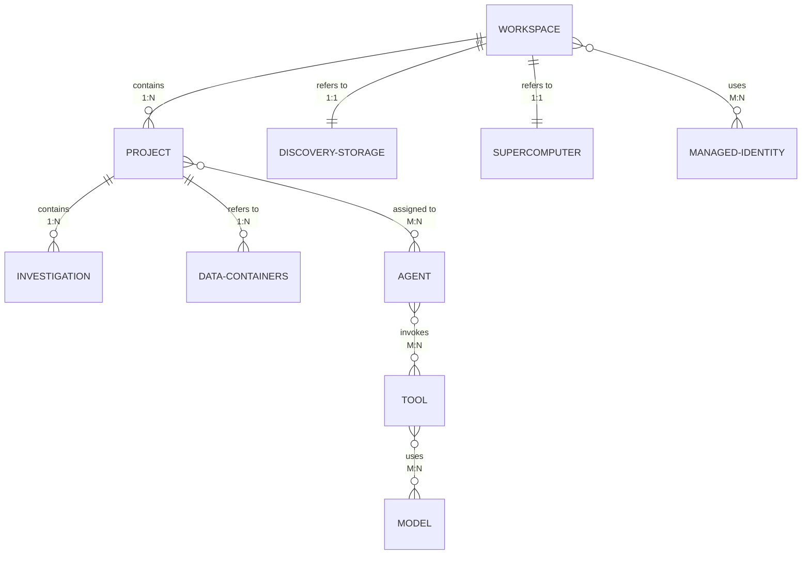

---

## 2. Storage and Data Management

This diagram illustrates the data storage architecture with Data Containers and Data Assets.

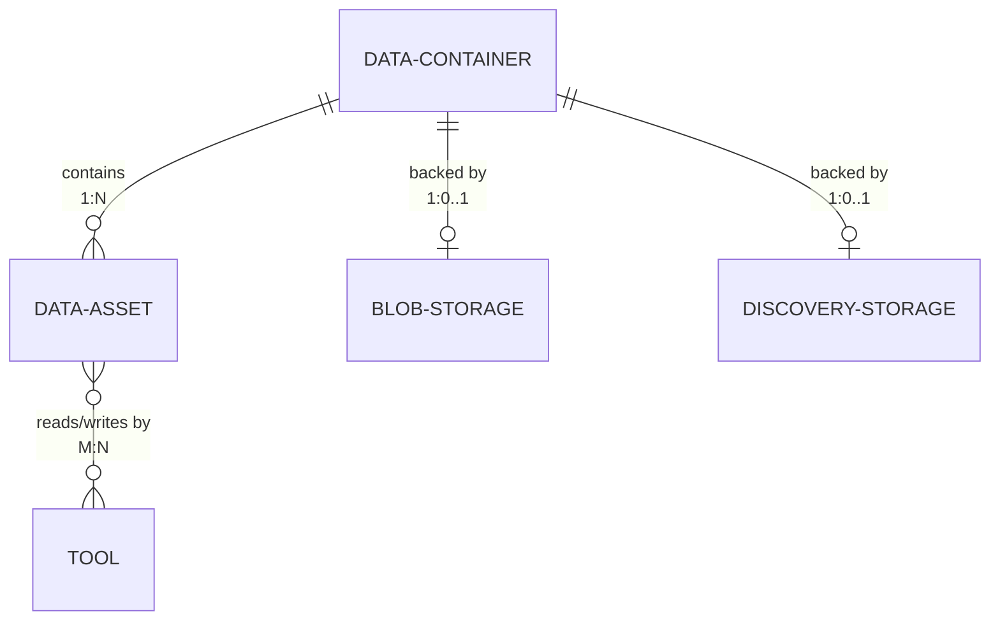

---

## 3. Supercomputer Resources

This diagram shows the Supercomputer and Nodepool relationships with infrastructure.

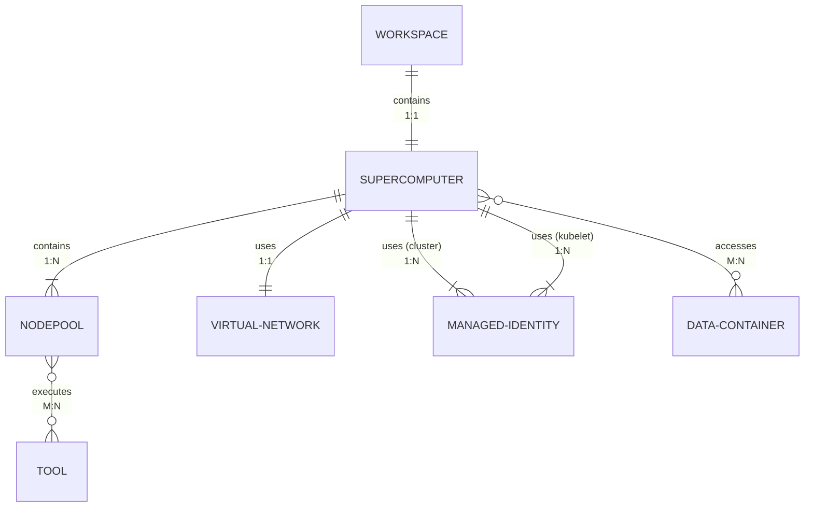

---

## 4. Agent, Tool, and Model Ecosystem

This diagram shows how Agents, Tools, and Models interact and are deployed.

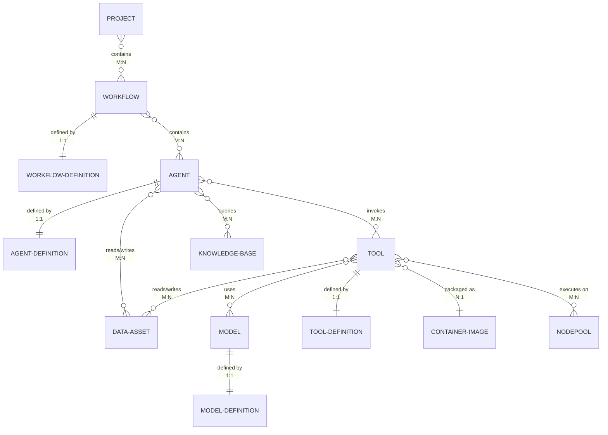

---

## 5. Knowledge Management (Bookshelf)

This diagram illustrates the Bookshelf service and Knowledge Base architecture.

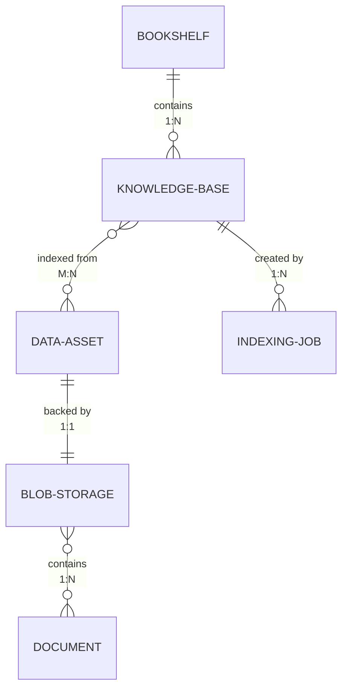

---

## 6. Investigation and User Interaction

This diagram shows how users interact with the platform through Investigations and Copilot.

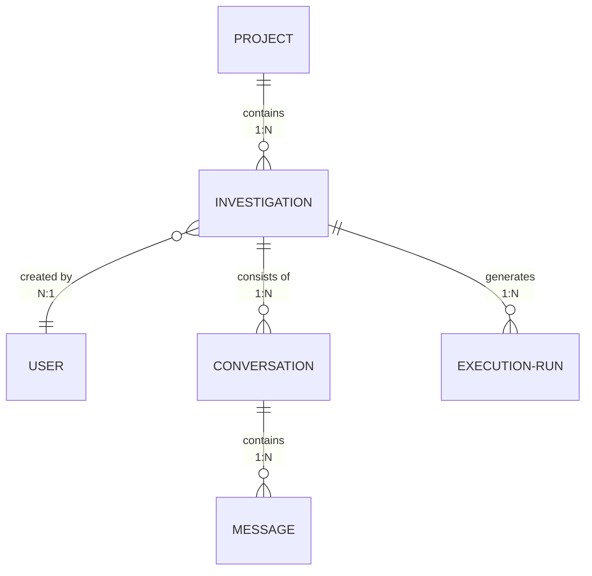

---

## 7. External Azure Service Dependencies

This section shows how Discovery resources integrate with external Azure services.

### 7.1 Workspace and Supercomputer Dependencies

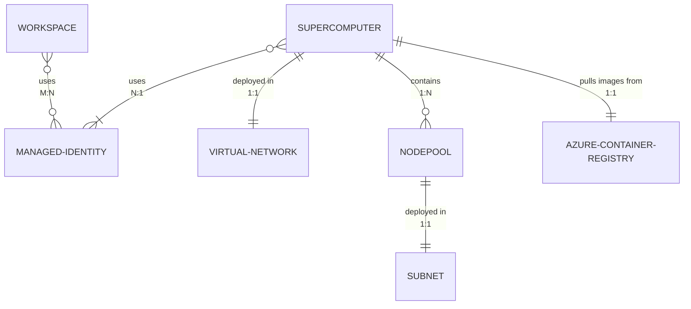

---

### 7.2 Storage Dependencies

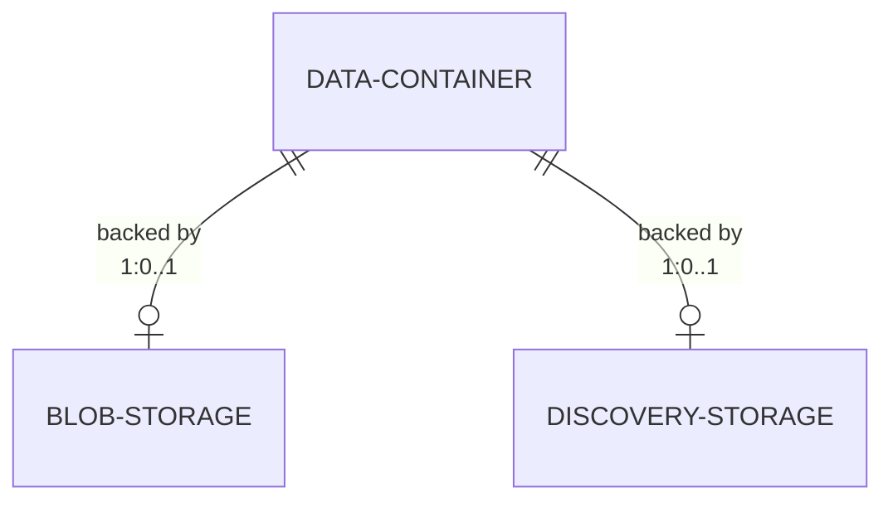

---


---

## Resource Multiplicity Summary

| Parent Resource | Child Resource | Cardinality | Notes |
|----------------|----------------|-------------|-------|
| Workspace | Project | 1:N | One workspace contains many projects |
| Workspace | Discovery-Storage | 1:1 | One workspace refers to one discovery storage |
| Workspace | Supercomputer | 1:1 | One workspace has exactly one supercomputer |
| Workspace | Managed Identity | M:N | Workspace uses multiple managed identities |
| Project | Investigation | 1:N | One project contains many investigations |
| Project | Workflow | M:N | Projects can have multiple workflows; workflows can belong to multiple projects |
| Project | Data Container | 1:N | One project refers to many data containers |
| Project | Agent | M:N | Projects can use multiple agents; agents can be assigned to multiple projects |
| Workflow | Workflow-Definition | 1:1 | One workflow is defined by one workflow definition |
| Workflow | Agent | M:N | Workflows can contain multiple agents; agents can be in multiple workflows |
| Agent | Agent-Definition | 1:1 | One agent is defined by one agent definition |
| Agent | Tool | M:N | Agents can invoke multiple tools; tools can be invoked by multiple agents |
| Agent | Knowledge Base | M:N | Agents can query multiple KBs; KBs can be queried by multiple agents |
| Agent | Data Asset | M:N | Agents can access multiple data assets; data assets can be accessed by multiple agents |
| Tool | Tool-Definition | 1:1 | One tool is defined by one tool definition |
| Tool | Model | M:N | Tools can use multiple models; models can be used by multiple tools |
| Tool | Container Image | N:1 | Multiple tools are packaged as one container image |
| Tool | Nodepool | M:N | Tools can execute on multiple nodepools; nodepools can run multiple tools |
| Tool | Data Asset | M:N | Tools can read/write multiple data assets; data assets can be accessed by multiple tools |
| Model | Model-Definition | 1:1 | One model is defined by one model definition |
| Supercomputer | Nodepool | 1:N (min 1) | One supercomputer must have at least one nodepool |
| Supercomputer | Virtual Network | 1:1 | One supercomputer uses one virtual network |
| Supercomputer | Managed Identity | 1:N | One supercomputer uses multiple managed identities (cluster, kubelet) |
| Supercomputer | Data Container | M:N | Supercomputer accesses multiple data containers |
| Supercomputer | Azure Container Registry | 1:1 | One supercomputer pulls images from one ACR |
| Nodepool | Tool | M:N | Nodepools can execute multiple tools; tools can run on multiple nodepools |
| Nodepool | Subnet | 1:1 | One nodepool is deployed in one subnet |
| Data Container | Data Asset | 1:N | One container holds many data assets |
| Data Container | Blob Storage | 1:0..1 | One data container may be backed by one blob storage |
| Data Container | Discovery Storage | 1:0..1 | One data container may be backed by one discovery storage |
| Bookshelf | Knowledge Base | 1:N | One bookshelf contains many knowledge bases |
| Knowledge Base | Data Asset | M:N | Knowledge bases are indexed from multiple data assets |
| Knowledge Base | Indexing Job | 1:N | One KB is created by multiple indexing jobs |
| Data Asset | Blob Storage | 1:1 | One data asset is backed by one blob storage |
| Blob Storage | Document | 1:N | One blob storage contains many documents |
| Investigation | User | N:1 | Multiple investigations are created by one user |
| Investigation | Conversation | 1:N | One investigation can have multiple conversations |
| Investigation | Execution Run | 1:N | One investigation generates multiple execution runs |
| Conversation | Message | 1:N | One conversation contains many messages |

#1-overview4-faqmd

## 1-overview/4-faq.md
Source: 1-overview/4-faq.md (local)

## Microsoft Discovery FAQ

**Q: How does Microsoft Discovery ensure consistent and scientifically reproducible results from agent-driven workflows?**  
A: We are developing a feature to capture the series of computations within a workflow, reducing variability by not interacting directly with LLMs. Human oversight allows scientists to approve or edit plans, validate results, and ensure convergence to a predetermined goal.

**Q: What is the rigorous vetting process for supporting the scientific validity, performance, and ethical considerations of models within the AI Foundry Catalog?**  
A: AI Foundry, the leading marketplace for AI models and agents, subjects each publisher to rigorous vetting, including Responsible AI and security considerations.

**Q: What is the expected effort for tool publishers to provide the "comprehensive documentation" required for consistently accurate dynamic code generation, especially for complex scientific tools?**  
A: Better documentation helps LLMs gain better context. We are building tools to allow users to easily build agents with documentation and sample codes. Our GitHub repository has example agents with full documentation and can serve as a great starting point.

**Q: What level of granular visibility and control is offered to HPC administrators or expert users for fine-tuning job scheduling, resource allocation, and optimizing performance? How can customers achieve detailed cost transparency for different Nodepool types and scaling behaviors?**  
A: As of private preview, customers do not have fine grain control over HPC resources. Debugging, monitoring, and troubleshooting can be done on the Azure portal but not through Microsoft Discovery. We are working on a roadmap for direct access to supercomputing resources.

**Q: How robust is Bookshelf in handling highly ambiguous scientific queries, contradictions, or subtle nuances prevalent in scientific literature?**  
A: Bookshelf uses GraphRAG which outperforms standard RAG by introducing a structured, relationship-aware approach to retrieval, enabling deeper reasoning and richer context. It uses knowledge graphs to maintain explicit entity relationships, making it ideal for reasoning.

**Q: How does the platform support collaborative development, version control, and shared access to complex multi-agent workflows defined through the Copilot for research teams?**  
A: Multiple people can work on one investigation within a project, publishing workflows and agents. We are working on version control for agents. LLMs understand domain specifics well, and agents with access to your Knowledge Base augment the base-trained LLMs.

**Q: Is Microsoft Discovery primarily an offline optimization and prediction platform, or are there capabilities for direct, real-time, closed-loop process control of physical scientific or manufacturing equipment?**  
A: Discovery is an online platform with human oversight. Researchers can change, edit, and kick off runs as needed. We are thinking about extending Microsoft Discovery to digital twins and lab automation using natural language, giving researchers more access to lab processes.

**Q: In what order should Discovery resources be deleted?** 
A: To avoid deletion issues due to backreferences, Discovery resources should always be deleted in the following order:
- Investigations
- Project
- Workspace
- Discovery Storage
- Workflow
- Knowledge Base
- Bookshelf
- Agent
- Tools
- Node Pool
- Supercomputer
- Data Asset
- Data Container
- Storage / VNETs

**Q: Getting AuthorizationFailed errors when creating Discovery Storage and Supercomputer**

A: If you're hitting errors like the one below when creating a Discovery Storage or Supercomputer:

{
    "status": "Failed",
    "error": {
        "code": "AuthorizationFailed",
        "message": "The client '<ANONYMIZED_EMAIL>' with object id '<ANONYMIZED_OBJECT_ID>' does not have authorization to perform action 'Microsoft.Discovery/locations/operationStatuses/read' over scope '/subscriptions/<ANONYMIZED_SUBSCRIPTION_ID>/providers/Microsoft.Discovery/locations/<ANONYMIZED_LOCATION>/operationStatuses/<ANONYMIZED_OPERATION_ID>' or the scope is invalid. If access was recently granted, please refresh your credentials."
    }
}

It's likely because you did not activate your "Eligible time-bound assignments". To resolve this, follow these steps:

- Go to the Azure Portal: https://portal.azure.com/
- Navigate to your Subscription or Resource Group where you're creating the Discovery resources.
- Click on "Access control (IAM)" in the left-hand menu.
- Click on "Eligible assignments" or "Time-bound assignments" (the exact wording may vary).
- Activate any eligible assignments related to your user account.
- Refresh your credentials or sign out and sign back in to the Azure Portal.
- Retry creating the Discovery resources.

**Q: 
What are the distinct roles of Discovery Storages and Azure Blob Storage in Microsoft Discovery?**

A: They have two distinct roles:

- **Discovery Storages**: A workspace-level shared storage resource you provision via Microsoft Discovery Storages in the Azure portal. 
Provides high‑performance, POSIX‑compatible shared storage for computational workloads executed by the Supercomputer and its node pools—i.e., the compute plane attached to the same VNet/subnets.

- **Azure Blob Storage**: An object store that holds input/output data assets for investigations and projects. It’s created/configured as a standard Azure Storage Account (with a container named discoveryoutputs), then added in Discovery Studio as a Data Container of type Azure Storage Blob for your project. Serves as the data lifecycle boundary for projects—organizing inputs to analyses and outputs produced by investigations. Discovery Studio uses this Blob container to persist and publish data assets (ingress/egress, browsing, downloading).

#1-overview5-troubleshootingmd

## 1-overview/5-troubleshooting.md
Source: 1-overview/5-troubleshooting.md (local)

# Troubleshooting #

**Q:
Why do I get “Error: Invalid JSON provided for args” when passing agent-created JSON to a tool in Microsoft Discovery?**

This error usually happens because the JSON string for `tool_args` is HTML-encoded, which causes parsing failures. To fix this, make sure to use HTML escaping when passing the arguments. See [HTML Escaping](https://handlebarsjs.com/guide/#html-escaping) for more details.

```
python main.py --server {{server_url}} call-tool {{tool_name}} --args '{{{tool_args}}}'
```

**Q:
Why am I getting “Failed to fetch investigations list for {workspace name} / {project name}. 403 Forbidden”**

You need to be granted with Discovery Contributor role at the subscription level.

**Q:
While creating a new data asset in Microsoft Discovery, I encounter the following error:
"Error uploading or creating data asset. This request is not authorized to perform this operation using this permission."**

1. Locate the storage account for the region
2. In the Storage account, open Security + Networking > Either
- "Enable for all networks" for Public network access
- "Resource settings:" > View > IPv4 > Add your public internet IP address

**Q:
When opening a data asset produced by an investigation, I get “You don't have permission to access this storage blob resource”**

1. draft


**Q:
When trying to open a project, I am getting "Failed to fetch investigations list for {workspace} / {project}.(500) undefined"**

You may have set the NSP Access mode to Enforced. Follow these steps:
1. Go to discovery workspace resource overview page.
1. Click on Managed Resource Group link.
1. Within that Resource Group, there will a Cosmos DB named <workspaceName>-cosmosdb, click on that.
1. From <workspaceName>-cosmosdb, Go to Networking Page> click on "Network Security Perimeter" tab, there will be a property called Access Mode which can be Enforced or Transition.

**Q:
Getting "Error: queue_access_forbidden; No permission to access Azure Function queue <queue_name>" when agent queries Knowledge Base.**

Follow these steps:
1. Navigate in Azure Portal to your bookshelf
1. Open the MRG
1. Identify the Correct Storage Account: Go to the Bookshelf resource group (MRG) containing storage account.
1. Assign Storage Queue Data Contributor Role:
   - In the storage account, navigate to IAM and add a role assignment for "Storage Queue Data Contributor".
   - Select Managed Identity > Select Members
   - Managed identity > Azure AI Foundry project
   - Filter by your project name
   - Select the Correct Managed Identity: When assigning the role, ensure you select the managed identity associated with your AI Foundry project (not your personal UAMI). This is typically the system-assigned identity for the specific AI Foundry project.
1. Confirm Role Assignment: Assign the role and wait a few minutes for permissions to propagate.

**Q:
What are the known issues when creating knowledge bases in Microsoft Discovery?**

These are some known issues:
- Kb's Data asset pointing to a file instead of folder. This use case is not supported yet
- Office files (used for indexing) with confidentiality settings enabled.

**Q:
The response to my investigation query results in "Error: Message ID is malformed or missing."**

This issue is still under investigation. Try the query again.

**Q: When directly submitting jobs to the Supercomputer, jobs remain in 'Running' state without starting execution.**
This issue may happen if there is a mismatch between the tool definition not requiring any GPU and the nodepool selected requiring GPU resources. To resolve this, ensure that the tool definition matches the nodepool requirements. For example, if the nodepool includes GPUs, make sure the tool is defined to utilize GPU resources.

**Q: Error: JSON deserialization for type 'AgentFunctions.Service.Models.ToolInvocationRequestMessage' was missing required properties including: 'MessageId'.**

TBD

**Q: I get "[Error from AIFoundry]: Run failed with status: failed. ErrorDetails: Code=server_error, Message=Server error from AI Foundry" when running an investigation.**

- Agent instructions must be less than 30,000 characters. Check your agent definition and reduce the length of the instructions section if it exceeds this limit.
- Publish the updated agent and project, and try again.

**Q: When asking a question in my investigation, I get "Rate limit is exceeded. Try again in 5 seconds."**

- Increase Quota in AI Foundry
      - Go to Workspace → AI Foundry → Management Center.
      - Raise TPM/RPM for the model (default is often 200K TPM).
      - For hackathon or shared environments, request higher quota or switch to Provisioned Throughput for guaranteed bandwidth. [Agent crea...: ACN/MSFT | Teams], [Agent crea...: ACN/MSFT | Teams]

- Enable Retry in Workflow
      - In Discovery workflows, set maxRateLimitRetries in the agent definition.
      - Default is 3; increase if needed (though some versions may not honor this—check AI Foundry release notes).

**Q: While creating a knowledge base, I encounter "Failed to create knowledge base / Failed to fetch"**

Make sure your knowledge base name follows these rules:

- Permitted Characters: Lowercase letters, digits, and hyphens. 
- Length Requirements: 3 to 12 characters. 
- Pattern: Must start with a letter; dashes can be applied as word separators. 
- Examples: ai-project, adhesives01 

**Q: What are the restrictions on resource names in Microsoft Discovery?**

All resource types in the Microsoft Discovery Platform must adhere to these foundational principles: 
   - Uniqueness: Resource names must be unique within their scope (subscription, or resource group for control plane and parent control plane resource for data plane). 
   - Predictability: Naming patterns should be consistent, facilitating automation and integration. 
   - Character Set: Names must only use alphanumerical characters and shouldn’t start with a number. 
   - Case Sensitivity: Unless otherwise stated, resource names are case-insensitive but must be entered and stored in lower case for consistency. 
   - Length Constraints: Each resource type defines its own minimum and maximum length; exceeding those constraints should show a proper error message when the validation fails. For some discovery resources where we create corresponding resources in the backend in a different RP, we add a unique GUID as suffix so that length must also be taken into consideration while defining the limits. 
   - No Spaces or Special Characters: Resource names cannot include whitespaces and special characters except `-` (hyphen) unless stated otherwise. 
   - No Consecutive Separators: Multiple dashes, underscores, or other separators must not appear consecutively.

**Agent**
  - Permitted Characters: Uppercase or Lowercase letters, digits, and dashes. 
  - Length Requirements: 3 to 24 characters. 
  - Pattern: Must start and end with a letter; dashes can separate words. 
  - Examples: search-agent, crawler-agent 

**Workflow**
  - Permitted Characters: Uppercase or Lowercase letters (a-z), digits (0-9), dashes (-). 
  - Length Requirements: 3 to 24 characters. 
  - Pattern: Must begin with a letter, can include digits, dashes, and end with a letter or digit. 
  - Examples: chemistry-workflow, etlWorkflow

**Project**
  - Permitted Characters: Lowercase letters, digits, and hyphens. 
  - Length Requirements: 3 to 12 characters. 
  - Pattern: Must start with a letter; dashes can be applied as word separators. 
  - Examples: ai-project, adhesives01

**Knowledge Base**
  - Permitted Characters: Lowercase letters, digits, and hyphens.
  - Length Requirements: 3 to 12 characters.
  - Pattern: Must start with a letter; dashes can be applied as word separators.
  - Examples: ai-project, adhesives01

**Q: When creating a project, I am getting "Failed to create project.(403 AuthorizationFailed) "**
 - Make sure you are granted with "Microsoft Discovery Platform Administrator (Preview)"

 **Q: Getting "Issue while attempting to preview the data asset" or "failed to authenticate azstorage credentials with error [BlockBlob::TestPipeline : [AuthorizationFailure]"**
 - Make sure that the subnet selected for the Supercomputer is in the list of subnets allowed in the Azure storage account.

 **Q: When deploying a tool, trying to create a Supercomputer or create a Discovery Storage, I am getting an "AuthorizationFailed" error.**

 Your error may look like this:
 ```
{
    "status": "Failed",
    "error": {
        "code": "AuthorizationFailed",
        "message": "The client '<REDACTED_EMAIL>' with object id '<REDACTED_OBJECT_ID>' does not have authorization to perform action 'Microsoft.Discovery/locations/operationStatuses/read' over scope '/subscriptions/<REDACTED_SUBSCRIPTION_ID>/providers/Microsoft.Discovery/locations/<REDACTED_LOCATION>/operationStatuses/<REDACTED_OPERATION_ID>' or the scope is invalid. If access was recently granted, please refresh your credentials."
    }
}
 ```

 - Make sure you are granted with "Reader" role at the subscription level.

#2-getting-startedquickstartmd

## 2-getting-started/quickstart.md
Source: 2-getting-started/quickstart.md (local)

# Quickstart: Get started with Microsoft Discovery

In this quickstart, you will complete all prerequisites to use Microsoft Discovery to:

- Create a workspace
- Create an agent and a workflow
- Explore Microsoft Discovery Studio
- Create a project
- Chat with copilot

## 1. Prerequisites

- You must have an **active [Azure subscription](#broken-link-https:--portal.azure.com-)** that has been enabled for Microsoft Discovery by the event organizers.
- You need **sufficient permissions** in your Azure subscription to register resource providers and create resources. Specifically:
  - The **Owner** role is required to:
    - Assign the required roles to others (Platform Admins, Scientists and Engineers) who will manage and then use the Discovery resources
    - More details are covered [here](#1b-assign-roles-to-administrators-to-be-performed-by-subscription-owner)
- Ensure your subscription has the necessary **Azure Foundry, Azure OpenAI quotas, and VM SKU/quotas** in your chosen region. For details, see [Quotas and Limits](#broken-link-..-4-how-to-2-onboarding-experience-b--quota-reservations).
- Ensure you have an existing **Resource Group** or [create new](https://learn.microsoft.com/azure/azure-resource-manager/management/manage-resource-groups-portal). **Note**: To create a resource group, the user needs to have "Contributor" role in the subscription.
- Prepare a **Virtual Network and subnets** for Storage, Workspace, and Supercomputer resources. See [Create a virtual network and subnets](#1c-create-a-virtual-network-and-subnets).
- Set up a **User Assigned Managed Identity (UAMI)** with the required Azure role assignments for Supercomputer, Workspace, and Azure Blob Storage resources. See [Create User Assigned Managed Identity (UAMI)](#1d-create-user-assigned-managed-identity-uami).
- Make sure Microsoft Discovery has the necessary permissions to access required resources in your subscription.
- As of now, Microsoft Discovery resources are supported only in 4 regions - East US, East US 2, Sweden Central and UK South. All the resources related to a single deployment should be created in same region for best results.

### 1a. Register resource provider (to be performed by Subscription Owner or Contributor)

To register a resource provider in your Azure subscription, you need to have a Contributor or higher privileged role (e.g., Owner) and follow the steps below:

1. Sign in to the [Azure Portal](https://portal.azure.com)
1. Navigate to Subscriptions and select your subscription
1. In the left-hand menu, select Resource Providers
1. Search for `Microsoft.Discovery`
1. Select the provider name and click Register.

> [!NOTE]
> You should also ensure that the following resource providers are already registered on this subscription. If not, please register these resource providers:
> `Microsoft.Network`
> `Microsoft.Compute`
> `Microsoft.Storage`
> `Microsoft.ManagedIdentity`
> `Microsoft.AlertsManagement`
> `Microsoft.Authorization`
> `Microsoft.CognitiveServices`
> `Microsoft.ContainerInstance`
> `Microsoft.ContainerRegistry`
> `Microsoft.ContainerService`
> `Microsoft.DocumentDB`
> `Microsoft.Features`
> `Microsoft.KeyVault`
> `Microsoft.MachineLearningServices`
> `Microsoft.NetApp`
> `Microsoft.OperationalInsights`
> `Microsoft.ResourceGraph`
> `Microsoft.Search`
> `Microsoft.Web`
> `Microsoft.Insights`
> `Microsoft.Resources`
> `Microsoft.Sql`
> `Microsoft.App`
> `Microsoft.Bing`

### 1b. Assign roles to Administrators (to be performed by Subscription Owner)

Assign following built-in roles to the users at desired scope (subscription or resource group):

- Microsoft Discovery Platform Administrator (Preview)
- Managed Identity Contributor
- Managed Identity Operator
- Storage Account Contributor
- Storage Blob Data Contributor
- Network Contributor
- ACRPush

Steps to assign roles:

1. Sign in to the [Azure Portal](https://portal.azure.com)
1. Navigate to Subscriptions and select your subscription
1. In the left-hand menu, select "Access control (IAM)"
1. Click "Add" and then select "Add role assignment"

1. On "Add role assignment" blade, search for roles mentioned above, **one role at a time** and press "Next" button at the bottom of the window.
1. Once on "Members" tab, ensure you have selected "Assign access to" as "User, group, or service principal".
1. Then select "+Select members". This opens up a popup on right, where you need to select members to whom this permission needs to be assigned. Once done, select the "Next" button at bottom of the window.

1. On "Conditions" tab, select "Allow user to assign all roles except privileged administrator roles Owner, UAA, RBAC (Recommended)" and then select "Next" at bottom of window.
1. On "Assignment Type" tab, select the configuration that best suits your organization and then select "Next" at bottom of window.
1. Finally, on "Review + assign" tab, verify all the information and select "Review + assign" button at the bottom.

Repeat the process for all the roles as mentioned in list above.

### 1c. Create a virtual network and subnets

1. Sign in to the [Azure Portal](https://portal.azure.com)
1. Search for `Virtual networks` and select it from the results
1. Click "Create" to start creating a new virtual network
1. Enter resource details such as Subscription, Resource Group, Name, and Region and click next
1. Configure IP addresses:
   - IPv4 address space: Enter your chosen CIDR block (e.g., `10.0.0.0/16`)
   - Add the following subnets
       - `storageSubnet` : `10.0.1.0/24`
       - `supercomputerNodepoolSubnet` : `10.0.2.0/24`
       - `aksSubnet` : `10.0.3.0/24`
       - `workspaceSubnet`: `10.0.4.0/24` # Don't create this subnet for eastus. The support will be added in upcoming release.
1. Review and create the virtual network

1. Click the virtual network you just created to enter the Virtual Network view in the portal, and in the left pane in the portal click "Subnets" under "Settings"
1. Click "storageSubnet" in the main view
1. In the flyout window "Edit subnet", scroll down to "Subnet Delegation", and search for `Microsoft.NetApp/volumes` and select it from the results
1. Click "Save"

1. Under the subnets on virtual networks page, click "workspaceSubnet".
1. In the flyout window "Edit subnet", scroll down to "Subnet Delegation", and search for `Microsoft.App/environments` and select it from the results
1. Click "Save"

> **Note:** Network Security Groups (NSGs) are not specifically required for this step, but it's a general best practice depending on your organization policies to implement NSGs for each subnet in a virtual network.

### 1d. Create User Assigned Managed Identity (UAMI)

You can create different UAMI each with their own required permissions for specific resource access or you can create a single UAMI and provide all the necessary permissions for the platform. For this exercise, we will use a single UAMI, follow the steps below to create one:

1. Sign in to the [Azure Portal](https://portal.azure.com)
2. Search for `Managed Identities` and select it from the list
3. Click "Create"
4. Fill in the required details such as subscription, resource group, region, and name
5. Click "Review + Create" and then "Create"

Assign following built-in roles to the new User Assigned Managed Identity resource:

- Microsoft Discovery Platform Contributor (Preview)
- Storage Blob Data Contributor
- ACRPull

1. Navigate to Subscriptions and select your subscription
1. In the left-hand menu, select "Access control (IAM)"
1. Click "Add" and then select "Add role assignment"
1. On "Add role assignment" blade, search for roles mentioned above, **one role at a time** and press "Next" button at the bottom of the window.
1. Once on "Members" tab, ensure you have selected "Assign access to" as "Managed Identity".
1. Then select "+ Select members". This opens up a flyout window "Select managed identities" from right. Select your subscription, "User-assigned managed identity", and your own managed identity resource, and click "Select" at the bottom.
1. Finally, on "Review + assign" tab, verify all the information and select "Review+Assign" button at the bottom.

### 1e. Create an Azure Blob Storage Account

To store output data of your investigations, you will need to create a storage account or use an existing one with the following requirements:

- Create a container within the storage account named "discoveryoutputs" where the output files will be stored.
- The storage account must allow access from the Virtual Network used to create Supercomputer.
- The storage account must also allow access from your client public IP or local network to be able to access the output data.
- The storage account must have the correct CORS settings. You must have these two origins: `https://studio.discovery.microsoft.com` and `https://vscode.dev`. For both, set the allowed operations to include "GET", "HEAD", "DELETE", and "PUT". This setting can be found under "Resource sharing (CORS) page under settings tab. Ensure value for `Allowed Headers` and `Exposed Headers` is set to "*", `Max Age` is set to '200'.
- The storage account must allow "Storage Blob Data Contributor" access to the UAMI that we created in the [previous step](#1d-create-user-assigned-managed-identity-uami)

To create a blob storage account, follow the steps below:

1. Sign in to the [Azure Portal](https://portal.azure.com)
1. Search for `Storage accounts` and select it from the results
1. Click "Create" to start creating a new storage account
1. Enter resource details such as Subscription, Resource Group, Name, and Region
1. Select Primary service as `Azure Blob Storage` and click the "Networking" tab
1. In the networking tab, in the public network access scope, select "Enable public access from selected virutal networks and IP addresses"
1. Select the Virtual Network and all the subnets that we created in [step 1c](#1c-create-a-virtual-network-and-subnets) except defaultSubnet which can be reserved for later usage if needed.
    > Ensure you add workspaceSubnet as well in order to allow workspace functions to access storage account for and performing data handling functions.
1. Select "Add your client IP address" if you are accessing data over internet or make sure your client can access the storage account and VNet either via private link or Site-to-Site VPN or ExpressRoute.


1. Click "Review + create" and click "Create"

> **Note:** Output data assets that are created within an investigation are stored in the storage account created above. To view and download the output files, your client/browser will need network access to the blob storage. Network access can be allowed via public internet, in which case, you can either open public access to all (less secure) or allow your client's public IP address in the storage networking and firewall settings. Otherwise, your client needs to have private access to the storage account configured either via Azure VPN or ExpressRoute.

#### Create container

1. Once the storage account is created, navigate to the resource overview page
1. In the left navigation pane, under "Data storage" tab, select Containers
1. Click "Add container" on top
1. Enter `discoveryoutputs` as the name and click "Create"


Output data from your investigations will be stored in the "discoveryoutputs" container.

#### Enable CORS and UAMI access

1. Select "Resource sharing (CORS)" under "Settings" tab
1. Under "Blob service" Allowed origins column, enter these two origins: `https://studio.discovery.microsoft.com` and `https://vscode.dev`. For both, set the allowed operations to include "GET", "HEAD", "DELETE", and "PUT". Set `Allowed Headers` and `Exposed Headers` to "*" and `Max Age` to '200'.
1. Click "Save" on top


1. Navigate to "Access Control (IAM)" tab in the left navigation pane
1. Click Add -> Add role assignment
1. Search for `Storage Blob Data Contributor` role and select it and click Next
1. Under Members tab, select Assign access to "Managed Identity" and click "Select members"
1. Select your subscription, managed identity as "User-assigned managed identity"
1. Select the UAMI that we created in [step 1d](#1d-create-user-assigned-managed-identity-uami) and click Next
1. Click Review + assign to assign access to the UAMI


## 2. Create a shared storage

To set up a Microsoft Discovery workspace, one of the essential steps is to establish Microsoft Discovery Shared storage resource. This shared storage will be used to store and retrieve the data necessary for computational operations within the workspace.

To create a storage, follow the steps below:

1. Sign in to the [Azure Portal](https://portal.azure.com)
1. Search for `Microsoft Discovery Storages`

1. Select "Create" and enter the details such as Subscription ID, Resource Group name, Location, and Name.
1. Select Storage Kind as `Azure NetApp` and click next

1. Select the Virtual Network and Subnet that we created in [Step 1c](#1c-create-a-virtual-network-and-subnets) from the Networking tab

1. Review the Terms and Conditions and click "Create"


## 3. Create a supercomputer

To deploy and run scientific tools and index your data in Bookshelf as Knowledge Bases, you need to set up a supercomputer with associated node pools. Supercomputer and nodepools provide appropriate compute resources on a specific virtual network within customer subscription.

To create a supercomputer and node pool, follow the steps below:

1. Sign in to the [Azure Portal](https://portal.azure.com)
1. Search for `Microsoft Discovery Supercomputers`
1. Select "Create" and enter resource details such as Subscription ID, Resource Group name, Location, and Name and click next

1. Select the Virtual Network and `aksSubnet` that we created in [Step 1c](#1c-create-a-virtual-network-and-subnets) from the Networking tab and click "Next"

1. Add User Assigned Managed Identities (UAMI) that we created in [Step 1d](#1d-create-user-assigned-managed-identity-uami) for the cluster identity, kubelet identity, and workload identity. Supercomputer instances will use this user assigned managed identity to access data from your Azure resources.


1. Review the Terms and Conditions and click "Create"


### 3a. Create Node Pools

Once your supercomputer is created, follow the steps below to create a node pool.

1. Open your Supercomputer resource that you just created in the Azure Portal
1. In the left-pane, select Nodepool under Settings tab and click "Create"

1. Enter the name and location for the nodepool resource and click next. (Note that nodepool names must be all lowercase, maximum 12 characters in length, must start with a letter, and can only contain letters and numbers)
1. In the Networking tab, select the Virtual Network and `supercomputerNodepoolSubnet` created in [Step 1c](#1c-create-a-virtual-network-and-subnets), this needs to be the same virtual network that was selected for the storage in [step 2](#2-create-a-shared-storage) and click next
1. In the VM configuration tab, select the Virtual Machine SKU to be used for the nodepool and click next. The selected SKU and quota should be available in the region where you deploy the nodepool

1. In the Scaling section, select the maximum node count that your nodepool can scale to

1. Review the Terms and Conditions and click Create

## 4. Create a workspace

A workspace is a collaborative environment where teams can manage large-scale scientific initiatives. You can create projects under workspaces, allowing researchers to organize experiments, analyze data, and leverage AI agents and tools within a shared space.

> **Note:** During the private preview, you can associate only one Supercomputer resource and one Microsoft Discovery Storage resource with one Workspace resource.

To create a workspace, follow the steps below:

> **Important:** Make sure your workspace name is globally unique and uses only lowercase letters.

1. Sign in to the [Azure Portal](https://portal.azure.com)
1. Search for `Microsoft Discovery Worksapces`
1. Select "Create" and enter essential details such as Subscription, Resource Group, Name, Region and click next

1. In the Discovery Storages tab, select "Add Discovery Storage" and select your subscription, resource group and the storage that we created in [Step 2](#2-create-a-shared-storage) and click next

1. In the Supercomputer tab, select "Add Supercomputer" and select your subscription, resource group and the supercomputer that we created in [Step 3](#3-create-a-supercomputer) and click next

1. In the Workspace Identity tab, select Add under User Assigned Managed Identity (UAMI) and select the identity that we created in [step 1d](#1d-create-user-assigned-managed-identity-uami) to provide access to the workspace resource.

1. For faster responses to data handling functions, one needs to set tags on the workspace during its creation. The tag `WorkspaceSubnetId` with the value set to subnet's resource ID (Example value - /subscriptions/00000000-0000-0000-0000-000000000000/resourceGroups/test-wksp-rg/providers/Microsoft.Network/virtualNetworks/vnet-eastus/subnets/workspaceSubnet)
1. Review the Terms and Conditions and click Create


Once the workspace has been created, you can provide access to users via [Role Based Access Control (RBAC)](https://learn.microsoft.com/azure/role-based-access-control/quickstart-assign-role-user-portal). To create projects in a workspace, you will need to provide contributor access to the user.

## 5. Create an agent and a workflow

### Create an agent

Agents are autonomous intelligent systems that are workflow driven and designed to perform specific tasks on behalf of users or other systems. Agents are powered by LLMs and can utilize tools, models, and other agents to achieve the task. You can create an agent and associate them with a project.

To create an agent, follow the steps below:

#### Create the agent definition file

In this example, let's create a basic Chemistry Agent that answers questions on chemical properties of molecules and provides a plan to calculate any property.

1. Using any text editor, create an `agent-definition.json` file locally in your PC
1. Copy and paste the following sample agent definition content to the JSON file

```json
{
    "agent": {
        "name": "ChemistryAgent",
        "description": "You are a chemistry expert agent who can answer questions about chemical properties of molecules and provide high level plans for user's computational needs",
        "model": "azureml://registries/azure-openai/models/gpt-4o/versions/2024-11-20",
        "instructions": "You are a chemistry expert agent who can answer questions about chemical properties of molecules and provide high level plans for user's computational needs\n\nUser goal:\n\n{{userGoal}}\n\nNode pool context:\n{{nodePoolContext}}\n\nData handling context:\n{{dataHandlingContext}}",
        "top_p": 0,
        "temperature": 0,
        "response_format": "auto"
    },
    "extension": {
        "events": [],
        "inputs": [
        {
            "name": "userGoal",
            "type": "llm",
            "description": "The user query for which the response needs to be generated."
        }
        ],
        "outputs": [],
        "system_prompts": {}
    }
}
```

3. Save the file.

#### Create the agent resource

> **Important:** The agent name you enter in the portal must exactly match the name specified in the agent definition file.

1. Sign in to the [Azure Portal](https://portal.azure.com)
1. Search for `Microsoft Discovery Agents`
1. Select "Create" and enter essential details such as Subscription, Resource Group, Name, Region
1. For Model Name, enter `azureml://registries/azure-openai/models/gpt-4o/versions/2024-11-20`
1. In the Definition Content file, upload the `agent-definition.json` file that we created
1. In the Definition Content version, enter `2025-05-15-preview`
1. Click Next

1. Skip the references tab for this exercise
1. Review and agree to the terms and conditions and click next
1. Click Create


### Create a workflow

Workflows are special type of agents with type "workflow" that orchestrate the execution of multiple agents to complete complex tasks. Unlike individual agents that perform specific functions, workflow agents coordinate multi-agent programs and manage the flow between different agent components. Workflows are defined using the same agent specification but with additional orchestration capabilities.

#### Create the workflow definition file

In this example, let's create a basic Chemistry Workflow that utilizes the agent that we created in the previous step.

> **Note:** During the private preview, only workflows that meet the following conditions are supported:
> 
> - Use single-actor states
> - Have human-in-the-loop mode set to 'never'
> - Have streaming mode set to false
> 
> Additionally, ensure that the thread name remains consistent throughout the workflow.

1. Using any text editor, create an `workflow-definition.json` file locally in your PC
1. Copy and paste the following sample workflow definition content to the JSON file

```json
{
    "name": "ChemistryWorkflow",
    "states": [
        {
            "name": "StartState",
            "actors": [
                {
                    "agent": "ChemistryAgent",
                    "inputs": {
                        "userGoal": "userGoal",
                        "dataHandlingContext": "dataHandlingContext",
                        "messageId": "messageId",
                        "nodePoolContext": "nodePoolContext"
                    },
                    "thread": "MainThread",
                    "humanInLoopMode": "never",
                    "streamOutput": true
                }
            ],
            "isFinal": false
        },
        {
            "name": "EndState",
            "actors": [],
            "isFinal": true
        }
    ],
    "transitions": [
        {
            "from": "StartState",
            "to": "EndState"
        }
    ],
    "variables": [
        {
            "Type": "thread",
            "name": "MainThread"
        },
        {
            "Type": "userDefined",
            "name": "userGoal"
        },
        {
            "Type": "userDefined",
            "name": "nodePoolContext"
        },
        {
            "Type": "userDefined",
                    "name": "messageId"
        },
        {
            "Type": "userDefined",
            "name": "dataHandlingContext",
            "value": "In order to interact with data (inputs, outputs) you will utilize the following tools and guidelines. ## OBJECTIVE (Data Lifecycle Support) To support your primary task, you must also ensure that the data lifecycle is handled appropriately by executing the following capabilities. ## CAPABILITIES - **Preview Data**: Use the `PreviewData` tool to generate a preview of data located at a path. This path may be a file or a directory, but it must always be an absolute path. - **Promote Outputs**: Use `PromoteOutputsToDataAssets` to move validated files from a working directory into the `/outputs` directory. Only promote files that are complete and verified. - **Get Data Context**: Use `GetDataContext` to retrieve the current structure and metadata of a virtual directory. This helps determine the current state of data and decide on next actions. - **Update Data Description**: Use `UpdateDataDescription` to attach or modify the description of any directory or file that exists in the data context. Always provide meaningful, transformation-related metadata. ## GUIDELINES - To learn what data is available (and where), you MUST call the `GetDataContext` tool to retrieve the current state of the data. - Always operate using the most recent data context. - Preview data before updating descriptions or promoting to outputs. - Maintain consistency in metadata and file paths. - Avoid redundant promotions or updates unless the underlying data has changed. - Only call data handling tools when necessary. - Promoted data will be visible by the end user, so ensure you are only promoting data that is relevant to the user goal. - IMPORTANT: Always update the description of a virtualPath BEFORE promoting it to a data asset. This description will be available to the user once it is promoted, so ensure it is descriptive and readable.\nNote: For tools that have outputMounts and inputMounts as input parameters follow these guidelines: - outputMounts should be set to the absolute path of where the output data from the execution of a tool should be stored. - inputMounts should be an object mapping of the virtual mount path you want mounted to the ABSOLUTE path of where you want it to be located on the tool container\nWARNING: ALL DATA HANDLING PATHS ARE ABSOLUTE PATHS, NEVER PASS A RELATIVE PATH TO ANYTHING\nAn example of a data handle flow would be as follows: 1. Call some tool which generates output data in a file 'molecule.txt' in a directory called /app/outputs. This is what you would set as the outputMountPath 2. Use updatesDataDescription to add a description to the virtual directroy /app/outputs which says that the directory contains a file 'molecule.txt' 3. Tool two will mount the directory /app/outputs as the virtualPath parameter for the inputMounts parameter, and the absolute path of where the data is located in the tool container as the inputMountPath. inputMounts will be an array of these objects. - inputMounts: [{ virtualPath: '/step0/app/outputs', inputMountPath: '/app/inputs' }] - NOTICE, we did not specify a file path, we specified a directory path, this is because the tool will mount the entire directory and not just a file. 4. The tool will then generate a file 'molecule2.txt' in the /app/outputs directory, which is the outputMountPath. 5. You will then use the PreviewData tool to preview the data in the /app/outputs directory. 6. If the data is valid, you will then use the PromoteOutputsToDataAssets tool to promote the /app/outputs directory to the /outputs directory, which is where all final outputs"
        }
    ],
        "startstate": "StartState"

}
```

3. Save the file.

#### Create the workflow resource

> **Important:** The workflow name you enter in the portal must exactly match the name specified in the workflow definition file.

1. Sign in to the [Azure Portal](https://portal.azure.com)
1. Search for `Microsoft Discovery Workflows`
1. Select "Create" and enter essential details such as Subscription, Resource Group, Name, Region
1. In the Definition Content file, upload the `workflow-definition.json` file that we created
1. In the Definition Content version, enter `2025-05-15-preview`

1. Click next
1. Review and agree to the terms and conditions and click next
1. Click Create


## 6. Log in to Microsoft Discovery Studio

Microsoft Discovery Studio is a secure, AI-powered research and development environment that enables scientists and engineers to accelerate innovation through autonomous agents, simulation workflows, and integrated data tools — all within a unified interface.

Once your infrastructure resources have been created, you can log in to [Microsoft Discovery Studio](https://studio.discovery.microsoft.com) directly via the URL. You can also find the URL in the Workspace overview page in the Azure Portal.


Once you open the Microsoft Discovery Studio, you must login with your Entra ID (work or school account) credentials from your organization. Studio supports Single Sign-On (SSO) with Entra ID so that you don't have to explicitly provide your credentials and authenticate if you've already logged in to any other service with your Entra ID in the same browser.

## 7. Create your data containers

Once you have logged in to the studio, you can now create data containers to be used in your project. Data containers are used to organize and manage data assets which are the files or directory of files stored within these containers.    

Data containers are used to store input and output data as data assets. Both inputs and outputs must use the same data container which is of type Azure Storage Blob that we created in [Step 1e](#1e-create-an-azure-blob-storage-account)

To create a data container, follow the steps below:

1. Login to [the Microsoft Discovery Studio](#broken-link-https:--studio.discovery.microsoft.com-)
1. In the left navigation pane, select Data Containers  under the Resources section

1. Select "Create Data Container"
1. Enter the details such as name, subscription, resource group, location. 
1. Select the Data Store Type as Azure Storage Blob and select the storage account that we created in [step 1e](#1e-create-an-azure-blob-storage-account) 

1. Click Next
1. To access the storage blob, select the managed identity that we created in [Step 1d](#1d-create-user-assigned-managed-identity-uami).
1. Click Create

> **Note:** Once you click create, the resource will initially be in the 'Accepted' state. Please refresh the page and wait until the 'Provisioning State' changes to 'Succeeded' before proceeding to the next step. This operation generally takes a few minutes to complete.

## 8. Create a project

Projects help you organize and manage scientific investigations within a Workspace. You can use projects to run experiments, analyze data, apply AI models, and track progress, all in a collaborative environment designed for scientific discovery. Projects also enable a functional boundary or container for access to your agents, tools, and data containers.

To create a project, follow the steps below:

> **Important**: Your project name must be all lowercase and no more than 12 characters long.

1. Login to [the Microsoft Discovery Studio](#broken-link-https:--studio.discovery.microsoft.com-)
1. In the left navigation pane, select Projects. This will list all the existing projects across your Azure subscriptions and resource groups.
1. Click Create Project
1. Enter the details such as name and select the workspace under which the project should be created
1. Click Next
1. Select the agents to be added to the project. You must select at least one agent as the entry agent of type workflow and also select the dependent agents. For now, select the ChemistryAgent and ChemistryWorkflow that we created in [Step 5](#5-create-an-agent-and-a-workflow) and select the ChemistryWorkflow as the entry agent.

1. Click Next
1. Select the data containers that we created in the [previous step](#7-create-your-data-containers).
1. Click Create.

> **Note**: Only one data container of type Azure Storage Blob can be added to a project.

> **Note:** Once you click create, the resource will initially be in the 'Accepted' state. Please refresh the page and wait until the 'Provisioning State' changes to 'Succeeded' before proceeding to the next step. This operation generally takes 5-10 minutes to complete.

## 9. Create an investigation

Investigations are research studies within a project where you can chat with Copilot, make and run a computational analysis, get data-driven insights to answer scientific questions.

To create an investigation within a project, follow the steps below:

> **Important**: Your investigation name must be no more than 20 characters long.

1. Login to [the Microsoft Discovery Studio](#broken-link-https:--studio.discovery.microsoft.com-)
1. In the left navigation pane, select Projects and from the list, select the project that we created in the [previous step](#8-create-a-project).
1. Select Create investigation
1. Provide a name and a description and click Create


## 10. Chat with Copilot

Once your investigation is created, you can start a chat with Copilot by following the steps below:

1. In the left navigation pane, select Projects
1. Select the project that we created in the [step 8](#8-create-a-project)
1. Select the investigation that we created in the [previous step](#9-create-an-investigation)
1. You can provide any prompt to Copilot to get a response using the agents, data and knowledge that we have selected in this tutorial. There are some suggested prompts to get you started right away.


## Next step

- [Create a knowledge base in Bookshelf](#broken-link-..-4-how-to-9-bookshelves-knowledgebases-)
- [Onboard tools, models, and agents](#broken-link-..-4-how-to-6-tools-models-agents-)

#3-conceptsagentsmd

## 3-concepts/agents.md
Source: 3-concepts/agents.md (local)

# Microsoft Discovery Agents

This documentation provides an overview of the AI agents concept available in Microsoft Discovery, including their types and usage with different user scenarios.

## Agents Overview

### What are Agents in Microsoft Discovery?

A Microsoft Discovery Agent is a runtime AI assistant that executes tasks on behalf of a user, often as part of a user-defined workflow. Agents handle data operations and coordinate tool or model execution across compute environments.

Agents are implemented using reasoning engines, grounding skills, and action skills. The agents' behavior is programmed using instructions (prompts) provided in natural language, enabling sophisticated scientific reasoning and engineering,  and decision-making.

## Agent Types

The agents in Microsoft Discovery could be used for varying purposes:

- **Specialized Research Agents:** These agents are designed for operation of specific scientific tools or models in Microsoft Discovery. An example of a specialized research agent is a molecular dynamics analysis agent that uses GROMACS tools for protein folding studies.  Another example of a specialized agent is one for engineering simulation, such as a circuit analysis agent that uses SPICE tools to verify integrated circuit designs.

- **Workflow Agents:** Workflow agent can be thought of as a top-level agent that orchestrates the overall flow. It's a multi-agent program that orchestrates the execution of multiple agents to complete complex research tasks. Workflows enable researchers and engineers to create sophisticated, multi-step research processes that can adapt and respond to different scenarios, making the Microsoft Discovery platform particularly powerful for complex R&D operations. Generally a workflow agent is defined using:
  - **Variables**: To model data flow between agents throughout the research process
  - **Transitions**: To model control flow between agents based on research outcomes
  - **States**: To bind the agents and configure their behaviors for specific scientific operations

- **Other functional Agents:**  They handle the overall planning, resource allocation, and decision-making processes that determine which agents should be activated and in what sequence. Some functional agents are valuable for managing multi-step research processes that require coordination between different scientific and engineering domains. An example could be a research planning agent that coordinates literature review, experimental design, and result analysis across multiple scientific domains.

For any of the agent types mentioned above, developers need to provide agent definitions that specify the AI model to use, behavioral instructions, tool integrations, and workflow configurations. This ensures that agents can operate effectively within the Microsoft Discovery platform's secure and high-performance environment.

#3-conceptsbookshelfmd

## 3-concepts/bookshelf.md
Source: 3-concepts/bookshelf.md (local)

# Microsoft Discovery Bookshelf
Microsoft Discovery includes Bookshelf, a service that enables customers to convert their data—such as text, Word, and PDF documents—into a structured collection of artifacts known as a Knowledge Base (KB). This KB can then be queried to support various use cases, including question answering, summarization, reasoning, and logical inference.

This capability is equally useful for engineering documentation; for example, an ASIC design team could index their hardware specifications or simulation result reports, ensuring the knowledge base covers engineering design content as well as scientific literature. 

Bookshelf leverages an advanced technique called Graph Retrieval-Augmented Generation (GraphRAG) to transform customer data and generate responses to queries. Unlike traditional RAG methods, GraphRAG not only creates an indexed vector database of the source content but also constructs a knowledge graph that captures entity relationships within the data. Research from Microsoft has demonstrated that GraphRAG delivers more accurate grounding information, leading to higher-quality responses compared to standard RAG techniques.

## Features
### Indexing
Bookshelf supports indexing of documents stored in Azure Blob Storage. Supported file formats include:

* Text (.txt)
* PDF (.pdf)
* Word (.docx)
* PowerPoint (.pptx)
* Excel (.xlsx)

The artifacts of the indexing, e.g., knowledge graphs, vector databases, collectively known as Knowledge Base (KB), will be stored in an Azure SQL DB in your subscription. 

Bookshelf supports incremental indexing. When you add additional documents to an existing KB, Bookshelf will index the new documents only and augment the existing artifacts of the KB.

### Query
Bookshelf provides the query function that can be invoked by any agent running on the Microsoft Discovery platform, including your own agent.

#3-conceptscognitionmd

## 3-concepts/cognition.md
Source: 3-concepts/cognition.md (local)

# Microsoft Discovery Cognition

> ⚠️ **Lab Feature - Coming Soon** ⚠️  
> This feature is currently in the lab and is coming soon!

Cognition provides an ongoing reasoning process on the work you are performing and acts cooperatively with you to assign tasks, review work, open new questions, and otherwise continue moving forward in the direction you set for this effort.

Cognition is enabled by turning on "Discovery Mode."  Cognition works off of the task list you create either by manually adding tasks or by asking the universal chat for a high-level objective while in Discovery Mode.

When cognition is on you will see activity begin happening autonomously, this is cognition working on your behalf and taking action to further your goals.  Feel free to engage by reviewing work, providing feedback, modifying sub-tasks or otherwise collaborating on what needs to be done.  If you are working towards a part of the broader objective, cognition will see your work too and build on top of it.

#3-conceptscopilotmd

## 3-concepts/copilot.md
Source: 3-concepts/copilot.md (local)

# Microsoft Discovery Copilot

## Overview

Microsoft Discovery Copilot service is one of the core components in the Microsoft Discovery platform. It supports the deployment of agents and workflow resources and enables the orchestration of multiple agents working together to achieve user's goals. Additionally, it provides the primary chat interface surfaced in Microsoft Discovery Studio, where you can use natural language (NL) to interact with the multi-agent system defined based on your specific use case whether a scientific research scenario or an engineering workflow.

## Architecture Overview

The Microsoft Discovery Copilot is designed as a scalable, cloud-native solution that orchestrates intelligent agents and workflows within the Microsoft Discovery ecosystem. The service architecture consists of several key components:
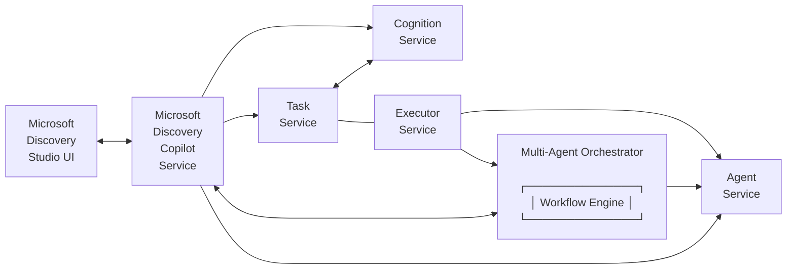

## Core Capabilities

### 1. Agent Definition and Deployment

The Microsoft Discovery Copilot provides comprehensive agent lifecycle management including agent definition, deployment orchestration, resource allocation, health monitoring.

### 2. Multi-Agent Orchestration with Workflow

Coordinates multiple agents to work collaboratively through intelligent task distribution, secure inter-agent communication, workflow coordination, result aggregation, and graceful error handling.

### 3. Natural Language Processing

Provides advanced natural language capabilities for user interaction including intent recognition, context awareness, multi-turn conversations.

### 4. Cognition 

Provides an ongoing reasoning process working with you to assign tasks, review work, and open new questions.

### 5. Tasks

Provides a way to organize your work over time, communicate intent, a way to measure success, and track progress.

## Integration with Discovery Studio

The Microsoft Discovery Copilot integrates seamlessly with Discovery Studio through:

- **Chat Interface**: Primary interaction point where users can use natural language to interact with the multi-agent system

More details on Agent and workflow onboarding flow are available in [quick start](#broken-link-..-2-getting-started-quickstart) and  [create agents and workflows](#broken-link-..-4-how-to-6-tools-models-agents-c--agent-deployment).

#3-conceptsenginemd

## 3-concepts/engine.md
Source: 3-concepts/engine.md (local)

# Microsoft Discovery Engine

> ⚠️ **Lab Feature** ⚠️  
> This feature is currently in the lab and is coming soon!

Microsoft Discovery Engine is a feature within Discovery that acts and behaves like a colleague you can converse with, delegate to, cooperatively plan with, and hand off tasks to when working on ambitious long-duration work.  The Discovery Engine is organized and driven by the purpose of the work you want to accomplish, using the rest of Discovery as resources to accomplish it.

## When to use the Discovery Engine
Problems that are multi-faceted, have open-ended solutions, and will take a long time to solve are all ideal uses of the Discovery Engine.  The engine is designed to work alongside you, providing leverage to the ideas and investigations you wish to pursue and reacting to your feedback at all levels of detail.  When you enable the Discovery Engine there is a background cognition process that starts interpreting tasks and acting autonomously on your behalf. Much like a colleague, this process will find and follow paths of opportunity, and is best interacted with over a period of hours and days rather than interactively.

For example, a big-picture goal like this would make a good basis for using the Discovery Engine: 

> "Identify the existing drugs that treat [disease name] and their activation pathways. From this, use each active compound as the basis for an evolutionary study of different variants that have higher protein binding affinity and projected lower immune response. For the candidates that appear most promising, plan the retrosynthesis pathway for formulation in the lab."

Conversely, relatively simple queries where a rapid response is desired are less ideal.  For example, this request would not be a good candidate for the full engine:

> "What is the reduction potential of [chemical]?"

## Engine Components
The two main components of the Engine are Cognition and Tasks.  These two components work in tandem with cognition maintaining awarenss and continually managing the work to be done while Tasks organizes and captures our intent and work progress.

### [Cognition](#broken-link-cognition)

The cognition system is an AI system that runs continuously while enabled. This system has been guided to behave with scientific and engineering rigor and maintain focus on both the long-term project objectives and the current working details. The cognition system picks which data, agents, and knowledge to use to make progress on the overall effort and manages their execution through tasking and direct interactions.  Cognition is capable of performing both narrow topical reasoning and longer-term project tracking, allowing for work to persist over several days of effort if there are many steps, complex tool interactions, or feedback from physical experimentation.

Cognition can currently be enabled and disabled manually using the "Discover Mode".

### [Tasks](#broken-link-tasks)

The task system captures the key information to organize your work and make your intent accessible to the Discovery Engine for AI-driven assistance.  Additionally the tasks system provides an asynchronous interaction to work with these AI systems by focusing on why the work is important, how it should be done, and allowing feedback at all levels of the project work.

Tasks provide an alternative primary interaction to chat, allowing you to focus on the intent and major outcomes independently from the ongoing execution of a specific activity.

#3-conceptsmodelsmd

## 3-concepts/models.md
Source: 3-concepts/models.md (local)

# Microsoft Discovery Models

Microsoft Discovery platform is an Azure-based platform designed to accelerate scientific research, science and engineering by leveraging artificial intelligence (AI), high-performance computing (HPC), and future quantum computing capabilities. The platform aims to provide a user-friendly and adaptive experience driven by a conversational AI agent, alongside a curated set of specialized AI models, agents, and tools. Powered by cloud-native and hybrid HPC solutions for inferencing and simulations, this technology targets high-value tasks with a primary focus on concrete scientific use cases.

This document offers a detailed overview of Machine Learning (ML) and AI models in Microsoft Discovery along with the core concepts.

## Models Overview

### What are Models in Microsoft Discovery?

Models in Microsoft Discovery are specialized AI and ML components that drive intelligent analysis, prediction, and reasoning within scientific and engineering workflows. They serve as foundational building blocks that power agent-driven computation, scientific data interpretation, hypothesis generation, and decision-making across the research and development lifecycle.

Customers can either leverage pre-integrated models available in the AI Foundry Catalog or onboard their own models to tailor the platform to their specific needs.

### Supported Deployment

AI Foundry catalog is a hub for discovering, evaluating, customizing, and deploying AI models at scale. It serves as a central repository for foundation models curated by Microsoft and Partner Model Providers. Microsoft Discovery currently supports only Managed Compute (MaaP) deployments.

- **Managed Compute (MaaP)** based model deployment allows users to deploy and manage their own models on dedicated compute resources within Azure ML Workspace. This approach provides greater flexibility and control over the model environment, enabling custom configurations, dependency management, and integration with enterprise data sources.

## Core Concepts

This section outlines the foundational concepts that underpin models in the Microsoft Discovery platform. Understanding these core elements is essential for effectively navigating, building, and operating within the system.

### Model Resource

A Model Resource in the Microsoft Discovery platform is a logical representation of an AI/ML model associated with Microsoft Discovery project. It is created and managed through the Azure Portal.

This resource stores essential metadata—such as the model definition and the associated Discovery workspace ID—which links to the underlying machine learning workspace used for deployment. By centralizing this information, the model resource helps standardize and streamline model deployment across the Discovery platform.

Each model resource includes references to:

1. Model Definition
2. Model Image(s)
3. Model Catalog (AI Foundry)

### Model Definition

Model Definitions in Microsoft Discovery are declarative YAML-based configuration files that describe how models should be deployed, configured, and managed within the platform. They provide a standardized structure for defining model metadata, infrastructure requirements, and deployment parameters—ensuring consistent, reproducible deployments across various environments.

These definitions form the backbone of scalable and governed model deployment in Microsoft Discovery, enabling teams to manage complex AI workloads with efficiency and consistency.

Once authored by the model publisher, a model definition becomes a required input for creating a model resource in Microsoft Discovery.

### Model Images

Model Images provide a standardized method for packaging and distributing machine learning models. Typically delivered as containerized artifacts (e.g., Docker images), they bundle the model code, dependencies, and runtime environment needed for inference or training. This containerized approach ensures consistency, portability, and reproducibility across various deployment environments.

The following type of model images are supported:

- **Container Images:** Models can be packaged as Docker container images, encapsulating all necessary code, dependencies, and runtime environments for execution. This method ensures consistent behavior across different environments and streamlines deployment, scaling, and integration within the Microsoft Discovery platform. Containerized models are especially well-suited for complex workloads with custom dependencies or scenarios that require fine-grained control over the execution environment.

- **MLFlow Models Images:** AI Foundry also supports models packaged in the MLflow format—a widely adopted open-source standard for managing the full machine learning lifecycle. MLflow models can be easily logged, versioned, and deployed, making them well-suited for conventional ML workflows. Microsoft Discovery can natively interpret MLflow artifacts, simplifying onboarding and deployment for teams already leveraging MLflow in their development pipelines.

### Model Catalog (AI Foundry)

AI Foundry Model Catalog serves as a centralized repository for scientific models, making it easy for researchers and teams to discover, evaluate, and onboard models relevant to their domain. It provides detailed metadata, versioning, and documentation for each model, enabling informed decision-making and streamlined integration into research workflows.

Researchers can browse and search the Model Catalog using filters such as scientific domain, model type, or performance metrics. Each model entry includes detailed documentation, usage instructions, and deployment options.

While several models are readily available in the catalog, organizations interested in publishing their own models and making them publically accessible should contact Microsoft for publishing support.

Example addition: ASIC design verification models can be integrated to accelerate timing analysis or power estimation workflows.

#3-conceptssupercomputermd

## 3-concepts/supercomputer.md
Source: 3-concepts/supercomputer.md (local)

# Microsoft Discovery Supercomputer

Microsoft Discovery’s high-performance computing backbone comprises a Supercomputer and its Nodepools, which together empower advanced simulations, large-scale data processing. The Supercomputer brings massively parallel compute power into the Discovery platform, allowing researchers and engineers to run complex experiments or design simulations that were once impractical or time-prohibitive. Integrated with Discovery’s AI agents and tools, this HPC infrastructure accelerates innovation. In essence, the Supercomputer and its Nodepools deliver cloud-scale computational might on demand, so scientists can iterate faster from hypothesis to insight.

## Supercomputer & Nodepool Overview

The Microsoft Discovery Supercomputer provides massive parallel computing capabilities, enabling thousands of CPU/GPU cores to tackle scientific problems in tandem. Researchers and engineers interact with the HPC resources through natural language via Discovery Copilot; the platform’s AI agents schedule workloads to the appropriate nodepools automatically, hiding complexity.

### What is the Microsoft Discovery Supercomputer?

The Microsoft Discovery Supercomputer is a virtual high-performance computing cluster dedicated to the Discovery platform. It acts as the compute engine for running intensive R&D workloads – from simulating physical phenomena and chemical reactions to running complex computation workflows– all within a secure, enterprise-controlled environment. The Supercomputer aggregates cloud-based HPC resources (like Azure’s powerful GPU and CPU instances) under one resource, making massive parallelism available for Discovery Agents and Tools. Researchers do not need specialist HPC skills to use it; through the Discovery Copilot interface, they can simply describe their experiment or analysis in natural language, and the platform will harness the Supercomputer’s power to execute it.

Key capabilities of the Supercomputer in Microsoft Discovery include:

**Massive Parallel Compute:** It can run many computations concurrently, drastically shortening time to results for large-scale experiments or engineering analyses.

**Enterprise-Grade Security & Compliance:** As part of the enterprise environment, the Supercomputer ensures that proprietary data and models remain in a controlled, isolated compute environment. All HPC jobs run within the organization’s Azure boundary, inheriting compliance and security policies. All the data, including intermediate computational data remains in customer subscription.

**Scalability:** The Supercomputer can scale its capacity depending on the workload. It is not a fixed piece of hardware, but a cloud-managed cluster that can grow by adding more Nodepools/nodes or shrink when demand is low, optimizing resource usage.

In summary, the Microsoft Discovery Supercomputer is the high-octane engine of the platform, bringing Azure’s supercomputing capabilities to scientists’ and engineers fingertips without requiring them to manage HPC infrastructure.

### What are Nodepools in Microsoft Discovery?

Nodepools are the fundamental units of compute within the Supercomputer. A Nodepool represents a group of compute nodes in the cluster with a common configuration. If the Supercomputer is analogous to an entire research lab’s computing center, each Nodepool is like a dedicated room full of identical servers, can be  assigned to specific types of tasks or projects. Nodepools allow fine-grained control of the Supercomputer’s resources by categorizing and scaling them according to workload needs.

Each Nodepool is defined by several key attributes:

**Hardware Profile (VM Size):** The type of Azure VM that all nodes in the pool use. For instance, a Nodepool might consist of GPU-accelerated VMs (such as NC-series VMs with NVIDIA A100 GPUs) for heavy AI computations, or CPU-only VMs for data preprocessing tasks. Microsoft Discovery supports a range of Azure HPC VM SKUs for nodepools (e.g., Standard\_NC series for GPU, ND series for GPU with more memory, etc.) . This means you can tailor Nodepools to the specific computational intensity of your workload. For example, a “GPU Nodepool” could use Standard_NC48ads_A100_v4 VMs (each with multiple A100 GPUs) for simulation, while a “CPU Nodepool” might use general-purpose VMs for lighter tasks.

**Number of Nodes (Capacity):** How many VM instances the Nodepool contains. This can typically be configured as a scalable range, with a minimum and maximum node count. Discovery’s Nodepools support auto-scaling; you might set a minNodeCount (which can even be 0 for purely on-demand pools) and a maxNodeCount to allow elasticity. For instance, a nodepool could scale from 0 up to 10 nodes depending on the current workload. When no jobs are running, it can scale down to zero to save cost, and when a big job arrives, it will scale out up to 10 nodes as needed.

**Networking and Location:** All nodes in a pool are attached to a specified virtual network subnet (more on this in the artifacts section) so they can communicate with other platform services (like storage) and with the Supercomputer’s orchestration system. Nodepools exist within the same Azure region and network as the Supercomputer, ensuring low-latency interconnect for MPI tasks or data sharing between nodes if needed.

**Purpose / Workload Assignment:** In practice, each Nodepool can be used to separate different types of workloads. For example, one nodepool might be designated for running simulation tools (with high-end GPUs), another for data cleaning and transformation tasks (with high-memory CPU nodes), and another for visualization or interactive analysis (perhaps smaller, faster-launch VMs).

By splitting the Supercomputer into multiple Nodepools, Microsoft Discovery ensures flexibility and efficiency. You get the benefit of a multi-purpose supercomputer that can concurrently handle diverse workloads – all optimized, without one job starving others for resources. Nodepools, in essence, are how the Discovery Supercomputer adapts to different kinds of science: whether it's crunching numbers for a physics simulation or rendering a complex 3D visualization, or running an intensive circuit simulation, there’s a nodepool ready for the job.

## Nodepool Configurations and Types

Not all scientific workloads are the same, so Nodepools in Microsoft Discovery are designed to be configurable to meet various needs. Generally, we classify nodepools along two axes: hardware type and scaling behavior. Understanding these types will help in setting up the right nodepools for your research environment.

**Hardware-Oriented Nodepool Types:** Depending on the nature of computation, you may configure nodepools with different hardware profiles:

- **GPU-Accelerated Nodepools:** These pools use VMs equipped with GPUs (Graphics Processing Units), ideal for massively parallel tasks like deep learning model training, molecular dynamics simulations, or any algorithms benefiting from GPU acceleration. For instance, a GPU nodepool might use Azure’s NC-series VMs with NVIDIA A100 GPUs for maximum throughput on matrix computations. Such nodepools excel at tasks in computational chemistry, genomics (e.g., DNA sequence analysis), image processing, and so on.

- **CPU-Optimized Nodepools:** These pools consist of high-CPU VMs (no GPUs). They are well-suited for workloads that scale with CPU cores or require large memory but don't benefit from GPUs. Examples include data parsing, statistical analysis, or running legacy scientific code that isn't GPU-aware. CPU nodepools are typically cheaper per hour than GPU pools and can be useful for preprocessing data before feeding it into GPU-intensive steps, or for running control logic and orchestration tasks.

- **High-Memory or Specialized Nodepools:** In some cases, tools might need machines with extra large memory (for in-memory data mining or handling very large datasets), or other specialized hardware (like FPGA or high-bandwidth networking for MPI clusters). Microsoft Discovery can support such specialization by choosing VM sizes that match those needs (for example, ND-series VMs for large GPU memory, or specialized NIC configurations for tightly-coupled simulations). Each nodepool is homogeneous, meaning all nodes have identical specs, to ensure predictable performance for jobs assigned there.

By mixing these hardware-specific nodepools under one supercomputer, an organization can support a diverse set of R&D activities on the same platform. For instance, a pharmaceutical company might maintain one GPU nodepool for AI-driven drug molecule generation, another GPU nodepool with different GPUs for simulation of those molecules, and a CPU nodepool for processing experimental data – all orchestrated by the Discovery platform. Similarly, an electronics engineering team could set up a GPU nodepool for electromagnetic simulations and a CPU nodepool for design verification tasks, illustrating the platform's flexibility beyond traditional scientific domains.

### Scaling and Availability Types

- **Auto-scaling (On-Demand) Nodepools:** These pools are configured with a minimum node count of 0, meaning they have no running nodes when idle, and they automatically provision nodes when work arrives. This is a cost-effective setup for workloads that are burst-y or infrequent – you don’t pay for idle compute. When a researcher’s task is submitted, the platform will spin up the necessary VMs (up to the defined maxNodeCount) in that pool, run the jobs, then scale them back down. Auto-scaling nodepools ensure you have elastic capacity: always enough for the job, but no waste when there’s no work.

- **Persistent (Always-On) Nodepools:** In contrast, some nodepools might be configured with a minNodeCount greater than 0 (even equal to the max, for a fixed-size pool). These guarantee that a certain level of compute is always available. This is useful for mission-critical or latency-sensitive tasks – for example, if you have an interactive analysis tool or a real-time data processing pipeline, you’d want at least one node always running to handle requests immediately, without waiting for a VM to boot. Persistent pools trade a bit of cost efficiency for readiness and throughput consistency. You might use this type for a nodepool servicing a web-based science application or continuously running background simulations.

In summary, Nodepools are highly configurable to match your research computing needs. When planning your Discovery environment, you’ll decide on the types and numbers of nodepools by considering questions like: Do we need GPUs, CPUs, or both? How much baseline capacity should we keep running? Should each lab have its own pool or use common pools? The platform supports all these models, giving IT departments control over resource allocation and giving scientists and engineers the freedom to run experiments or design iterations without worrying about the underlying machine details.

## Supercomputer and Nodepool Artifacts & Requirements

Deploying a Microsoft Discovery Supercomputer and its nodepools requires setting up certain artifacts and configurations in advance. These are the pieces that ensure the HPC environment can operate smoothly within your enterprise infrastructure. The artifacts include networking setups, identity assignments, container images for tools, and resource definitions. Below we detail each of these requirements and how they fit into the overall deployment.

### Network Infrastructure

Because the Discovery Supercomputer runs in your Azure environment, you must provide networking details so that the HPC cluster can integrate with your enterprise network and security controls. Specifically:

Virtual Network and Subnets: The Supercomputer needs an Azure Virtual Network (VNet) for all its nodes to reside in. Within this VNet, typically two subnets are used: one for the Supercomputer’s internal orchestration and management components (often called the system subnet), and another for the compute nodes (the nodepool subnet(s)). When creating the supercomputer resource, you’ll supply a subnetId for the system subnet. Each Nodepool resource will likewise require a subnetId indicating which subnet its VMs should join. It’s recommended (and by default, expected) that the system subnet and nodepool subnets are part of the same VNet so that the Supercomputer’s control plane can coordinate the nodes. In fact, the system subnet should have connectivity to the child NodePool subnets.  This ensures that management traffic (like scheduling commands, health checks, etc.) flows unimpeded between the head node and the worker nodes.

**Note:** The subnets must have adequate IP addresses (/24) for the planned number of nodes and should be configured according to your organization’s network security policies (NSGs, firewalls). If your experiments need access to on-prem resources or internet, those network paths should be enabled similar to how you’d configure any Azure VMs in that VNet.

#### Networking for Data Access

If external API calls are part of your workflow (though often in research computing, data is internal), internet egress may be required. Generally, because the supercomputer lives in your VNet, you have full control of its network traffic: you can enforce that all traffic stays within company network boundaries for compliance, or open specific egress as needed.

### Security and Identity

Enterprise environments require strict access control. The Discovery Supercomputer uses Azure Managed Identities to securely interact with other Azure services on your behalf and to manage the provisioning of VMs:

**Cluster Identity:** When deploying the Supercomputer resource, you will assign a User-Assigned Managed Identity to act as the Cluster Identity. This identity is used by the control plane of the supercomputer to perform Azure operations (like creating VMs for nodepools, mounting storage, etc.) within your subscription. It needs sufficient IAM roles, for example the ability to read the nodepool subnet or attach network interfaces, and to pull container images from your registry. The cluster identity essentially runs the supercomputer’s management service in your subscription.

**Node (Kubelet) Identity:** In addition to the cluster identity, the Supercomputer requires a second managed identity often referred to as the kubelet identity (since under the hood, it’s akin to an AKS cluster’s kubelet identity). This identity is given to the VM instances (nodes) themselves, allowing each node to, for example, access Azure Container Registry (to fetch tool container images) or other Azure resources as needed. For security, the kubelet identity is typically granted more limited scope – but it must be granted the Managed Identity Operator role on the Cluster Identity. This specific requirement allows the node VMs to indirectly use the cluster identity’s privileges for certain operations (without exposing full credentials). It’s a layered security approach - one identity for control plane, one for the node plane, with clear separation of duties.

**Workload Identities:** The Discovery platform also allows specifying workload identities – additional user-assigned identities that tools or agents can use when running on the supercomputer. This is particularly useful if a tool container needs to call an external SaaS API or another Azure service (like querying a Cosmos DB with managed identity). Instead of baking secrets into the tool, you can attach a managed identity to the workload through the platform. The supercomputer resource can be configured with a set of such identities and they are made available as federated credentials to workloads on the nodes.

**Image Registry Credentials:** Typically, container images for your tools will be stored in an Azure Container Registry (ACR) or another registry. The supercomputer’s identities should have pull access to these registries. Often, you can use an ACR that trusts the supercomputer’s managed identity (using AAD authentication) rather than managing docker credentials manually. Ensuring this connectivity means any tool defined in Discovery can be seamlessly launched on the nodepool with its image pulled securely.

**Managed Resource Group:** A noteworthy artifact is that when you create a Supercomputer resource, the platform will automatically create a managed resource group in your subscription to hold the actual Azure resources (like the VM scale sets, etc.) that underpin the supercomputer. This managed RG is usually named by the service (and shown as a property of the supercomputer) and is read-only to you; it exists so Microsoft’s service can lifecycle manage the low-level pieces without cluttering your own resource group. You do not manually create resources in there – any needed VM or storage for the cluster is handled by the Discovery resource provider. Just be aware it exists and ensure your subscription has quota for those resources (e.g., enough cores of the chosen VM sizes). The managed RG approach ensures that all the complex infra (VM scale sets for nodepools, NICs, network configs, etc.) is isolated and doesn’t interfere with your other Azure assets – deletion of the supercomputer resource will clean up that RG automatically.

### Tool Container Images and Software Environment

While “Tools” themselves are covered in separate documentation, it’s worth noting the relationship between tool artifacts and the supercomputer/nodepool environment:

**Container Images:** All computational work executed on the Nodepools runs inside container images. These images package the scientific software, libraries, and any custom code needed for a given tool or task. For example, if you have a tool for genome sequencing, its Docker image might include the genomic analysis binaries and Python libraries. These images must be built to be compatible with the node OS (e.g., Linux images if the node VMs are running Linux, which is the default in Discovery). During deployment of a tool or execution of a task, the platform will pull the required image onto the node from the registry. If you are bringing your own tools, you need to provide the container images as described in the Tools documentation (including any GPU drivers or HPC libraries your tool needs – though note, the base VM image on nodepools will already have necessary GPU drivers/CUDA libraries if it’s a GPU SKU).

**Node OS and Drivers:** Microsoft Discovery’s nodepools use Azure’s HPC-optimized VM images, which come pre-configured with appropriate NVIDIA drivers and HPC SDKs when needed. This means when your container requests access to a GPU, the host has the driver ready. The containers should ideally use CUDA libraries matching the host driver version. Microsoft often provides base container images or guidelines to ensure compatibility. As an artifact, ensure you know the Ubuntu (or other OS) version that the nodepool VMs run, and use a compatible base image for your containers.

**Tool Definitions:** Each tool integrated into Discovery has a tool definition (JSON/YAML) that the control plane uses to know how to deploy it – for code environment tools, it might include a runtime specification; for action-based tools, it lists scripts to run. These definitions aren’t specific to the supercomputer per se, but the supercomputer will reference them when scheduling work. For example, a tool definition might specify it needs a GPU – the scheduler will then place that tool’s run onto a GPU-capable nodepool. In effect, the Nodepool’s characteristics must align with tool requirements. When registering a new tool, you may indicate in its definition what kind of node (GPU/CPU, how much memory, etc.) it needs, which helps the platform choose the correct nodepool.

### Summary of Key Artifacts

To clarify the various artifacts and their roles, the table below summarizes them:

**Step 1:** Create the Supercomputer (Control Plane)

An IT administrator deploys a new **Supercomputer** resource via Azure Portal, CLI, or ARM template. In this step, you choose a name, region, link the required network subnet and assign the managed identities.

**Step 2:** Provisioning of HPC Cluster (Data Plane)

Once the control plane resource is created, the Discovery service automatically sets up the **data plane**: it creates a managed resource group and deploys the necessary Azure resources for the cluster. This includes allocating an internal orchestrator (which could be based on Azure Kubernetes Service or similar HPC scheduler), configuring the system subnet, and preparing the cluster’s baseline environment. This step is handled by Azure asynchronously – when complete, your Supercomputer resource status will transition to `Succeeded`, indicating the HPC cluster is ready.

**Step 3:** Define Nodepools (Control Plane)

Next, you create one or more **Nodepool** resources associated with the Supercomputer. For each Nodepool, you specify the supercomputer it belongs to, the VM size (e.g., GPU type), the node subnet, and scaling parameters (min/max nodes). Each nodepool you add appears under the Supercomputer in Azure Portal. The Discovery service will then provision the corresponding VM Scale Set or VM pool in the managed resource group (data plane). Initially, nodepools can be created with 0 nodes (if auto-scale) or with the minimum nodes running. Over time, you can add more nodepools or adjust their sizes to match your workload needs.

**Step 4:** Deploy Tools & Agents (Control Plane)

With the infrastructure in place, you or tool providers register **Tools** and perhaps custom **Agents** into the Discovery platform (often done via the Discovery Studio interface or CLI). Each tool’s definition includes the container image location and any resource requirements (like “needs GPU”). These tools are now available for use via the Copilot or programmatically, but they don’t “live” on the nodes yet – they are registered in the Discovery catalog, waiting to be invoked.

**Step 5:** Execution on Nodepools (Data Plane)

When a researcher initiates an experiment – say, asking the Copilot to run a simulation or an agent automatically kicking off a workflow – the **Discovery orchestration** kicks in. In addtion jobs can be submitted on the nodepool by the user by directly invoking the data-plane APIs.

**Step 6:** Job Monitoring and Completion

The Supercomputer’s control plane monitors the running jobs on the nodepools. This might involve a job queue, logging, and health checks from the orchestrator (e.g., Kubernetes control plane) back to the Discovery service. As jobs run, researchers can get status updates via Copilot (since the agents are tracking progress). When a job finishes, the results (files, data) can be saved to the designated storage (which could be one of the linked Storage resources in Discovery) and the container terminates. The platform may then spin down idle nodes if using auto-scaling.

**Step 7:** Iteration and Scaling

At this point, the heavy lifting is done – the researcher reviews results, maybe asks follow-up questions, leading to new runs. The Nodepools will dynamically scale as per demand. Administrators can always adjust Nodepool sizes or add new nodepools if projects grow. The separation of concerns is clear: scientists focus on the experiments, while IT ensures the Supercomputer and Nodepools remain healthy and cost-efficient.

**Step 8:** Management and Decommission

If the Supercomputer is no longer needed, deleting the Supercomputer resource will automatically clean up all nodepools and associated VMs in the managed resource group. The control plane (ARM resources) goes away, and the data plane cluster is torn down accordingly. This lifecycle management is handled in a governed manner – for instance, deletions are a long-running operation with proper status monitoring and confirmations to avoid accidental loss.

## Integration with Microsoft.Discovery/Storages

The Microsoft Discovery platform provides seamless integration between Supercomputers and Azure HPC storage resources through the Microsoft.Discovery/Storages resource type. For high-performance computing workloads that require fast, scalable file storage, Azure NetApp Files (ANF) offers an optimal solution.

### Azure NetApp Files Integration

Azure NetApp Files provides enterprise-grade, high-performance file storage for scientific computing workloads. When integrated with Microsoft Discovery Supercomputers, it enables:

- Ultra-low latency for I/O-intensive HPC applications
- Scalable storage performance that can match compute capabilities
- Support for various protocols (NFSv3, NFSv4.1) that scientific applications require
- Enterprise-grade data protection and snapshots

The Microsoft.Discovery/Storages resource with Azure NetApp Files can be deployed and linked to your Supercomputer during job submission, making it available to all workloads running on the nodepools.

### DataContainers and Data Assets Integration

Beyond the storage infrastructure itself, Microsoft Discovery provides structured ways to manage scientific data through DataContainers and Data assets. These components form a crucial part of the tool execution pipeline on the supercomputer.

#### DataContainers

DataContainers in Microsoft Discovery represent logical data stores that abstract the underlying storage technology details, providing researchers with a consistent interface regardless of whether the data is stored in Azure Blob Storage, or Discovery Storage. Key aspects of DataContainers include:

- **Storage Abstraction**: DataContainers provide a unified way to access data across different storage types
- **Access Control**: They include credential management for secure access to the underlying storage

- **Integration Point**: They serve as the integration layer between storage resources and research tools

DataContainers are created as Microsoft.Discovery.DataContainer resources and linked to specific storage accounts or volumes:

#### Data Assets

Data assets represent the actual files, datasets, or collections within DataContainers. They provide:

- **Contextual Organization**: Data assets help organize research data by experiment, project, or scientific domain
- **Provenance**: Information about data origins and transformations
- **Metadata Management**: DataAssets support descriptive metadata to improve discoverability and organization
- **Tool Input/Output**: Structured mechanism for tools to consume and produce data

Data assets typically include metadata that describes their contents, format, and relationships to other assets, making them discoverable and usable in scientific workflows.

#### Supercomputer Data-Plane API for Tool Execution

The integration of DataContainers and Data assets with the supercomputer's data-plane API provides a powerful mechanism for tool execution in scientific workflows:

1. **Tool Invocation with Data References**: When a tool is invoked, it can reference specific Data assets as inputs:
2. **Data-Plane Execution**: The supercomputer's data-plane API handles:
   - Resolving data references to actual storage locations
   - Mounting or accessing the required data for the tool
   - Scheduling the tool on appropriate nodepools
   - Managing authentication between the tool and data sources
   - Capturing outputs to the specified locations
3. **Containerized Execution**: When the tool runs on the supercomputer, it receives the input data paths as environment variables or configuration files, and the containerized environment has the necessary access to read and write data.

#3-conceptstasksmd

## 3-concepts/tasks.md
Source: 3-concepts/tasks.md (local)

# Microsoft Discovery Tasks

> ⚠️ **Lab Feature** ⚠️  
> This feature is currently in the lab and is coming soon!

Tasks are the primary way to communicate **why** something is important in discovery. Use tasks to organize your work over time, communicate intent and how to measure success, and to track progress (whether the work is done by you, your colleague, or an AI assistant).  Tasks are composable so you can start with a high-level objective and add sub-tasks to progressively detail out work.  Adding tasks to iterate through ideas is a good idea as well, there is no limit to how much you can expand out the work required and this is all helpful for organizing and managing your work.

## Structure of a Task
A task is meant to be completely representitive of one "to-do item."  In it you want to capture what the aim is, why it's important and how you know you are done.  To help think about how tasks work, here is a table explaining the purpose of each field:

| Field                     | Description                       |
|---------------------------|-----------------------------------|
| Id                        | A unique identifier that distinguishes this task from all other tasks in the system. |
| Title                     | A concise, descriptive name that summarizes what the task is intended to accomplish. |
| Priority                  | The relative importance or urgency level of this task compared to other tasks in the queue. |
| Description               | A detailed explanation of what needs to be done, including context, objectives, and any specific requirements. |
| Validation Requirements   | The specific criteria, tests, or conditions that must be met to consider the task successfully completed. |
| Comments                  | Additional notes, observations, or communications from team members regarding the task's progress or details. |
| Status                    | The current state of the task (e.g., not started, in progress, completed, blocked, cancelled). |
| Execution History         | A chronological record of all actions taken, attempts made, and progress updates throughout the task's lifecycle. |
| Result                    | The final outcome, deliverables, or artifacts produced upon completion of the task. |
| Data Assets               | References to datasets, files, models, or other digital resources that are either inputs to or outputs from this task. |
| Parent                    | The higher-level task or objective that this task is a component or sub-task of. |
| Depends on                | Other tasks that must be completed before this task can begin or be fully executed. |
| Related to                | Other tasks that share similar objectives, resources, or context but are not direct dependencies. |
| Assigned to               | The person, team, or AI agent responsible for executing and completing this task. |

## Getting Started
You don't need to fill out all of the details of a task to get started, a `Title` and `Description` are enough! If you do want to provide some additional context, the next most important piece of information is to provide `Validation Requirements` as this will communicate a specific meaning of what success means to you.  `Comments`, `Parent`, `Related`, and `Depends` relationships, and `Assigned To` fields are also quite useful when defining a task as this will help control and indicate how to approach the task as part of your overall goals.

#3-conceptstoolsmd

## 3-concepts/tools.md
Source: 3-concepts/tools.md (local)

# Microsoft Discovery Tools

Microsoft Discovery brings together advanced AI and high-performance computing to accelerate research and development. Its core components—tools, models, and agents—form an integrated ecosystem that supports every stage of the scientific process, including knowledge mining, hypothesis generation, execution, simulation, analysis, and design.

This documentation provides a comprehensive overview of Microsoft Discovery tools, explaining their types, required artifacts, and deployment processes within the platform's enterprise-grade R&D environment.

## Tools Overview

### What are Tools in Microsoft Discovery?

Tools in Microsoft Discovery are specialized functionalities that enable specific scientific or engineering operations, data processing, or interactions with external systems. They enhance the capabilities of AI models and agents by providing them with additional capabilities to perform complex research and development tasks that would otherwise be difficult or impossible within a standard computing environment.

Within the Microsoft Discovery platform, various scientific tools serve distinct yet complementary purposes, enabling researchers and engineers to execute a broad spectrum of R&D workflows efficiently and securely.

- **Computational tools** are fundamental in scientific research, providing the necessary algorithms and high-performance computing capabilities to solve complex mathematical problems, simulate physical phenomena or engineering systems, and analyze large scientific datasets.
- **Data Processing tools** are essential for managing and refining data collected from various research sources. They allow scientists and engineers to extract relevant information, remove noise, and preprocess data for further analysis within the Discovery platform.
- **Simulation tools** help model and simulate physical, chemical, or biological processes and complex engineered systems using the platform's Supercomputer resources. These tools are crucial for experiments that cannot be conducted in real-time due to constraints such as time, cost, or safety concerns.
- **Visualization tools** are indispensable for interpreting scientific data or engineering design data, and communicating findings effectively. These tools transform raw research data into graphical representations like charts, graphs, and 3D models, making it easier to identify patterns, trends, and anomalies.

Microsoft Discovery supports both **Open-source** and **Proprietary** tools integration. In either case, to deploy a tool to the platform, you need to package the tool in a container image and provide appropriate tool definitions (covered in subsequent sections) to deploy them on the Microsoft Discovery platform.

## Tool Types

The scientific tools in Microsoft Discovery can be classified into the following tool types:

- **Code Environment:** A code environment-based tool enables the Microsoft Discovery Copilot to generate and run code dynamically in a specified programming language compatible with the tool's container image. This approach works best for tools with comprehensive documentation covering usage patterns and syntax, allowing Copilot to create code dynamically. Both open-source and proprietary tools can use this approach if the publisher provides sufficient contextual information for the language model to generate appropriate code. Documentation should include sample code examples and instructions for submitting tasks to the tool.

- **Action-based:** This type is most appropriate when tool publishers wish to expose specific predefined functions rather than enabling dynamic code generation. It's particularly suitable for proprietary tools where publishers may prefer not to provide extensive documentation but instead include pre-built action scripts within the container image. The Microsoft Discovery Copilot is made aware of these exposed actions and can invoke them based on the research scenario at hand.

- **Combined Code Environment and Action-based:** Some tools may benefit from a hybrid approach, where certain operations use well-defined actions with scripts embedded into container images, while others use a code environment where scripts are dynamically generated through the platform's AI capabilities.

For any of the tool types mentioned above, publishers must provide a container image that packages all required dependencies and tool binaries. For action-based tools, publishers additionally need to include scripts (for pre-defined actions) within the container image.

An example of a code environment-based tool is RDKit, an open-source cheminformatics tool with comprehensive usage documentation. Conversely, an example of an action-based tool could be a proprietary scientific simulation tool brought in by research partners.

As a publisher, you may also want to integrate SaaS tools that expose OpenAPI endpoints. For such SaaS tools or models with OpenAPI endpoints, Microsoft Discovery recommends creating a client container image that leverages the User Assigned Managed Identity (UAMI) supplied during workspace creation to make secure OpenAPI calls within the platform's environment.

**Why use a client container for SaaS services or models with OpenAPI endpoints?**

Within the Microsoft Discovery platform, a client container approach offers several advantages for SaaS integration:

- Enables seamless scientific data integration, allowing for efficient handling and transformation of research data assets.
- Supports long-running scientific operations by managing complex computational tasks within the tool container, rather than relying solely on HTTP requests.
- Facilitates extensive scientific data processing that may not be practical within standard HTTP payloads, especially when orchestrated by Discovery Agents.
- Provides a unified and secure environment for integrating external tools with other services or tools in the Microsoft Discovery platform.
- Manages job batching and submission logic to the OpenAPI endpoint, improving reliability and scalability for scientific workflows.

## Tool Artifacts

### Tool Images

During the private preview, the Microsoft Discovery platform supports container-based tool images. Whether tools are provided by Microsoft, independent software vendors (ISVs), or customers through Bring Your Own (BYO) scenarios, integrating these containerized images into the enterprise-grade Microsoft Discovery environment is essential for creating streamlined scientific computing workflows.

Tool publishers must provide container images that include all necessary scientific libraries, binaries, SDKs, and dependencies for the tool to operate independently within the high-performance computing environment. This containerized approach ensures consistent performance across research workflows and eliminates dependency conflicts across different computing environments.

### Tool Definition

Tool definitions in Microsoft Discovery describe the purpose and capabilities of a scientific tool, outlining the actions it can perform—whether through predefined scripts, a code environment, or both. Each tool definition includes infrastructure specifications for all supported container images, ensuring compatibility across different computing environments within the platform. For example, a molecular dynamics tool like GROMACS may require multiple container images, some optimized for various high-performance computing (HPC) scenarios and others designed to run on standard compute resources.

For an action-based tool, the tool definition additionally specifies the research actions exposed by the tool. Each action is documented with its name, a clear description, and a JSON schema that defines the expected input parameters for scientific operations. In contrast, for a code-environment based tool, the publisher must provide details such as programming language, description, infrastructure node specifications for executing dynamically generated scripts, and sample commands that the tool accepts.

By providing comprehensive tool definitions, publishers enable the Microsoft Discovery Copilot and Agents to understand how to interact with each scientific tool, generate appropriate execution plans, and orchestrate complex scientific workflows on the Supercomputer. This ensures tools are used effectively and consistently across the Microsoft Discovery platform's R&D workflows.

These definitions, once created by the publisher, form the template that must be provided as part of the Microsoft Discovery Tool resource registration process.

## Tool Deployment

Tool deployment in the Microsoft Discovery platform involves two main architectural components: the control plane and the data plane.

- The **control plane "tool" resource** is an Azure Resource Manager (ARM) resource that you create and manage through the Azure Portal. This resource defines the scientific tool's configuration, metadata, security settings, and deployment parameters within your secure Microsoft Discovery environment.

- The **data plane "tool" resource** refers to the actual running instance of your tool's container on a Microsoft Discovery Supercomputer node. This is where the tool executes scientific workloads and processes research data as part of your end-to-end R&D workflows.

This architectural separation empowers enterprise customers to independently onboard and manage their own tool control resources on the platform, while Microsoft Discovery ensures a seamless, secure, and automated execution experience on the Supercomputer. All tool operations are orchestrated through the Microsoft Discovery Copilot interface, providing researchers with a streamlined and user-friendly workflow for complex scientific computing tasks.

#4-how-toreadmemd

## 4-how-to/README.md
Source: 4-how-to/README.md (local)

# Microsoft Discovery Platform Guide

## Overview

Microsoft Discovery is a powerful platform that enables advanced research and development workflows through integrated tools, models, and intelligent agents. This guide provides step-by-step instructions for both publishing components to the platform and using the platform for research initiatives.

## Who This Guide Is For

### Publishers
- Independent Software Vendors (ISVs)
- Technology partners
- Organizations developing tools, models, and agents
- Developers looking to extend the platform capabilities

### Users
- Researchers and data scientists
- Academic institutions
- Organizations conducting computational research
- Teams requiring high-performance computing workflows

## Table of Contents

### For Publishers
1. [Preparation and Setup](#broken-link-1-prep-work-)
   - [Prepare Code Repository](#broken-link-1-prep-work-a--prepare-code-repo)
2. [Models](#broken-link-6-tools-models-agents-models-publishing-)
   - [Bring Your Own Models (BYO)](#broken-link-6-tools-models-agents-models-publishing-byo-models-)
   - [External Models](#broken-link-6-tools-models-agents-models-publishing-external-models-)
   - [Tool Client Publishing](#broken-link-6-tools-models-agents-models-publishing-tool-client-publish-)
3. [Tools](#broken-link-6-tools-models-agents-tools-publishing-)
   - [Identify Tool Functionalities and Dependencies](#broken-link-6-tools-models-agents-tools-publishing-a--identify-tool-functionalities-and-dependencies)
   - [Writing Action Scripts](#broken-link-6-tools-models-agents-tools-publishing-b--writing-action-scripts)
   - [Generate Docker File](#broken-link-6-tools-models-agents-tools-publishing-c--generate-docker-file)
   - [Create, Validate, and Publish Tools to ACR](#broken-link-6-tools-models-agents-tools-publishing-d--create-validate-publish-tools-to-acr)
   - [Create Tool Definition](#broken-link-6-tools-models-agents-tools-publishing-e--create-tool-definition)
4. [Agents](#broken-link-6-tools-models-agents-agents-publishing-)
   - [Create Agent Definition](#broken-link-6-tools-models-agents-agents-publishing-a--create-agent-definition)
   - [Model Selection and Prompting Guide](#broken-link-6-tools-models-agents-agents-publishing-b--model-selection-and-prompting-guide)
   - [Tutorial 1: Single Agent QA](#broken-link-6-tools-models-agents-agents-publishing-c--tutorial-01-single-agent-qa)
   - [Tutorial 2: Single Agent KB](#broken-link-6-tools-models-agents-agents-publishing-d--tutorial-02-single-agent-kb)
   - [Tutorial 3: Single Agent Tools](#broken-link-6-tools-models-agents-agents-publishing-e--tutorial-03-single-agent-tools)
   - [Tutorial 4: Multi-Agent Workflow](#broken-link-6-tools-models-agents-agents-publishing-f--tutorial-04-multi-agent-workflow)

### For Users
1. [Onboarding Experience](#broken-link-2-onboarding-experience-)
   - [Resource Provider Registration](#broken-link-2-onboarding-experience-a--rp-registration)
   - [Quota Reservations](#broken-link-2-onboarding-experience-b--quota-reservations)
   - [Role Assignments](#broken-link-2-onboarding-experience-c--role-assignments)
   - [Resource naming guidelines](#broken-link-2-onboarding-experience-d--resource-naming)
2. [Basic Building Blocks](#broken-link-3-basic-building-blocks-)
   - [Virtual Network & Subnets](#broken-link-3-basic-building-blocks-a--virtual-network-subnets)
   - [Azure Container Registry Creation](#broken-link-3-basic-building-blocks-b--acr-creation)
   - [Managed Identities](#broken-link-3-basic-building-blocks-c--managed-identities)
3. [Supercomputer & Storage Creation](#broken-link-4-supercomputers-storages-)
4. [Tool Image Creation](#broken-link-5-tool-image-)
   - [Create and Publish Container Images](#broken-link-5-tool-image-a--create-and-publish-container-image)
5. [Tools, Models & Agents Creation](#broken-link-6-tools-models-agents-)
   - [Model Deployment](#broken-link-6-tools-models-agents-a--model-deployment)
   - [Tool Deployment](#broken-link-6-tools-models-agents-b--tool-deployment)
   - [Agent Deployment](#broken-link-6-tools-models-agents-c--agent-deployment)
   - [Updating Tool/Model/Agent Resources](#broken-link-6-tools-models-agents-d--updating-tool-model-agent-resource)
6. [Project Creation](#broken-link-7-projects-)
   - [Creating Projects](#broken-link-7-projects-a--creating-project)
   - [Updating Projects](#broken-link-7-projects-b--updating-project)
7. [Creating and Running Investigations](#broken-link-8-investigations-)
   - [Creating Investigations](#broken-link-8-investigations-a--creating-investigation)
   - [Running Sample Scenarios](#broken-link-8-investigations-b--running-a-sample-scenario)
8. [Bookshelf & Knowledge Base Creation](#broken-link-9-bookshelves-knowledgebases-)
   - [Bookshelf Deployment](#broken-link-9-bookshelves-knowledgebases-a--bookshelf-deployment)
   - [Document Upload](#broken-link-9-bookshelves-knowledgebases-b--document-upload)
   - [Knowledge Base Creation](#broken-link-9-bookshelves-knowledgebases-c--knowledgebase-creation)

## High-level Platform Flow

### Publisher Flow

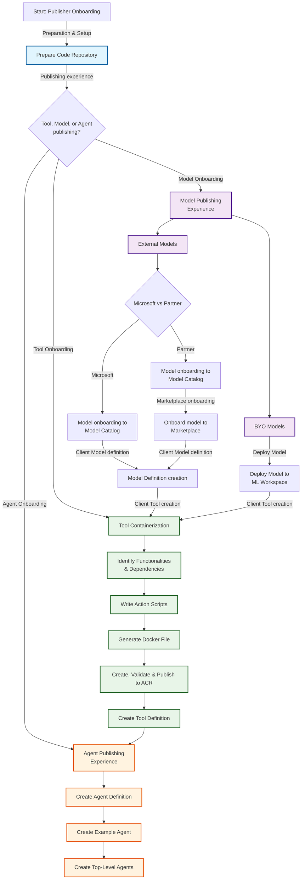

### User Flow

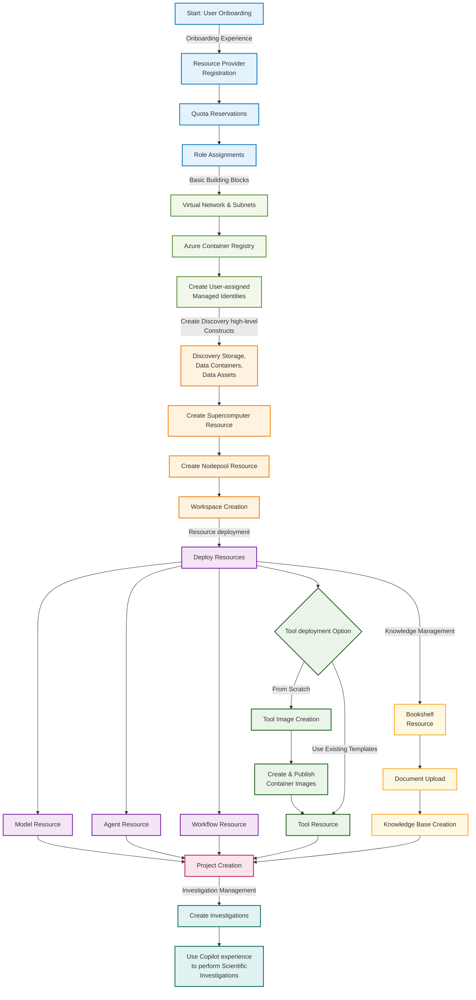

## Detailed Guide Sections

### For Publishers

#### 1. Preparation and Setup
Get your development environment ready and prepare your code repository for publishing.

- **Repository Setup**: Setting up Git repositories and structure best practices
- **Version Control**: Version control strategies and documentation requirements
- **Environment Configuration**: Development environment prerequisites

#### 2. Models Integration
Learn how to integrate and publish different types of models on the Microsoft Discovery platform.

- **Bring Your Own Models (BYO)**: Custom model integration, validation, and performance optimization
- **External Models**: Third-party model integration, API connections, and security practices
- **Tool Client Publishing**: Client library development and SDK integration

#### 3. Tools Development
Comprehensive guide to creating, containerizing, and publishing computational tools.

- **Planning**: Functionality analysis, requirements gathering, and dependency mapping
- **Development**: Script development, input/output handling, and error management
- **Containerization**: Docker strategies, multi-stage builds, and security considerations
- **Publishing**: Azure Container Registry integration and validation workflows
- **Configuration**: Tool metadata specification and interface definitions

#### 4. Agents Creation
Build intelligent agents that orchestrate complex workflows and integrate multiple tools.

- **Architecture**: Agent design, capability definitions, and integration patterns
- **Development**: Step-by-step agent creation, testing, and debugging
- **Orchestration**: Complex workflow management and multi-agent coordination

### For Users

#### 1. Onboarding Experience
Essential first steps to get started with Microsoft Discovery platform.

- **Resource Provider Registration**: Setting up Azure subscriptions and registering required resource providers
- **Quota Management**: Understanding and requesting appropriate compute quotas for your research needs
- **Security Setup**: Configuring role-based access control and permissions for team collaboration

#### 2. Basic Building Blocks
Core infrastructure components required for Microsoft Discovery platform operations.

- **Network Configuration**: Virtual network setup, subnet configuration, and network security considerations
- **Container Management**: Azure Container Registry setup for managing custom tool images
- **Identity Management**: Managed identity configuration for secure resource access and authentication

#### 3. Supercomputer & Storage Creation
High-performance computing infrastructure setup for intensive computational workloads.

- **Compute Resources**: Provisioning and configuring high-performance compute clusters
- **Storage Solutions**: Setting up scalable storage systems for data management and workflow persistence
- **Performance Optimization**: Best practices for compute and storage performance tuning

#### 4. Tool Image Creation
Development and deployment of custom computational tools.

- **Containerization**: Docker image creation, optimization, and security scanning
- **Registry Management**: Publishing and versioning container images in Azure Container Registry
- **Tool Integration**: Preparing tools for integration with Microsoft Discovery workflows

#### 5. Tools, Models & Agents Creation
Deployment and management of computational resources on the platform.

- **Model Integration**: Deploying machine learning models and AI services
- **Tool Orchestration**: Setting up computational tools and managing dependencies
- **Agent Configuration**: Creating intelligent agents for workflow automation
- **Resource Management**: Updating and maintaining deployed resources

#### 6. Project Creation
Organizing research initiatives and managing collaborative workspaces.

- **Project Structure**: Best practices for organizing research projects and data
- **Team Collaboration**: Setting up shared workspaces and access controls
- **Resource Allocation**: Assigning compute and storage resources to projects

#### 7. Creating and Running Investigations
Managing research workflows and computational experiments.

- **Investigation Design**: Planning and structuring research investigations
- **Workflow Execution**: Running complex computational workflows and managing dependencies
- **Results Management**: Collecting, analyzing, and sharing research outcomes

#### 8. Bookshelf & Knowledge Base Creation
Building and managing organizational knowledge repositories.

- **Document Management**: Organizing and indexing research documents and publications
- **Knowledge Discovery**: Creating searchable knowledge bases for research acceleration
- **Content Integration**: Connecting knowledge bases with active research workflows

## Getting Started

### For Publishers
1. Start with [Preparation and Setup](#broken-link-1-prep-work-) to configure your development environment
2. Choose your publishing path: [Models](#broken-link-6-tools-models-agents-models-publishing-), [Tools](#broken-link-6-tools-models-agents-tools-publishing-), or [Agents](#broken-link-6-tools-models-agents-agents-publishing-)
3. Follow the step-by-step guides for your chosen component type
4. Test and validate your components before publishing

### For Users
1. Begin with the [Onboarding Experience](#broken-link-2-onboarding-experience-) to set up your account and permissions
2. Configure [Basic Building Blocks](#broken-link-3-basic-building-blocks-) for your infrastructure
3. Set up [Supercomputer & Storage](#broken-link-4-supercomputers-storages-) for your computational needs
4. Create [Projects](#broken-link-7-projects-) and start [Investigations](#broken-link-8-investigations-)

## Important Notes

⚠️ **Private Preview**: This documentation is for Microsoft Discovery private preview participants only. Features and processes may change based on feedback.

🔒 **Security**: Always follow security best practices when developing, publishing, or managing research data and computational resources.

📊 **Performance**: Consider compute efficiency, resource optimization, and cost management in all developments and research workflows.

🔄 **Updates**: This guide is regularly updated. Check for the latest version before starting new projects or research initiatives.

💡 **Best Practices**: Follow established research data management, software development, and computational workflow best practices throughout your journey.

🤝 **Community**: Engage with the Microsoft Discovery community for support, feedback, and collaboration opportunities.

## Support and Resources

- **Documentation**: Comprehensive guides and API references
- **Community Forums**: Connect with other publishers and users
- **Technical Support**: Direct assistance for platform-specific issues
- **Best Practices**: Industry standards and Microsoft recommendations
- **Training Materials**: Workshops, tutorials, and certification programs

---

*This guide serves as your comprehensive resource for both contributing to and leveraging the Microsoft Discovery platform. Whether you're publishing innovative tools or conducting groundbreaking research, these resources will help you maximize the platform's potential.*

#4-how-to1-prep-worka-prepare-code-repomd

## 4-how-to/1-prep-work/a--prepare-code-repo.md
Source: 4-how-to/1-prep-work/a--prepare-code-repo.md (local)

# Preparing the Code Repository

This article is intended for ISVs, or customers preparing for Bring Your Own (BYO) scenarios on Microsoft Discovery platform.

The document outlines best practices for onboarding and maintaining repositories to enable easy discovery, versioning, and maintenance of your tool, model and agent templates.

As a publisher you may wish to leverage any of the approaches below:

## Approach-1. Create a New Git Repository

Set up a new repository to store your tools and model templates for streamlined discovery and collaboration.

**Steps:**

1. **Initialize a new repository** on your preferred Git hosting service (e.g., GitHub, Azure Repos, GitLab):

    ```bash
    # Create a new directory for your project
    mkdir discovery-templates
    cd discovery-templates

    # Initialize a new git repository
    git init

    # Add a remote (replace with your repository URL)
    git remote add origin https://github.com/your-org/discovery-templates.git
    ```

2. **Add a folder named `<tool-name>`** and organize your content within it:

    ```bash
    mkdir <tool-name>
    cd <tool-name>
    mkdir tools models agents
    # Add your files to the respective directories
    ```

3. **Stage, commit, and push your changes:**

    ```bash
    git add .
    git commit -m "Initial commit: add <tool-name> with tools, models, and agents"
    git push -u origin main
    ```

4. **Share the repository link** with your team or organization as needed.

## Approach-2. Fork Microsoft Discovery repo

If you want to build upon an existing Microsoft Discovery repository (<https://github.com/microsoft/discovery>):

**Steps:**

1. **Navigate to the repository page** (<https://github.com/microsoft/discovery>).

2. **Click the "Fork" button** to create your own copy.

3. **Clone your forked repository** to your local machine:

    ```bash
    git clone https://github.com/your-username/discovery.git
    cd discovery
    ```

4. **Add your tools and models** to the appropriate directories (`tools`, `models`, `agents`) within the `<tool-name>` folder.

    ```bash
    mkdir <tool-name>
    cd <tool-name>
    mkdir tools models agents
    # Add your files to the respective directories
    ```

5. **Stage, commit, and push your changes:**

    ```bash
    git add .
    git commit -m "Add custom tools, models and agents"
    git push
    ```

6. **Maintain your fork** for adding tools, models and agents, required for your organization.

> **Note:** If you are a Microsoft internal user, you may use Approach-2 to contribute tools, models, and agents that are suitable for customer use.

#4-how-to10-discovery-studio-preview-experiencea-preview-experiencemd

## 4-how-to/10-discovery-studio-preview-experience/a--preview-experience.md
Source: 4-how-to/10-discovery-studio-preview-experience/a--preview-experience.md (local)

# Microsoft Discovery Studio v2

## Overview

Microsoft Discovery Studio v2 introduces a modern, streamlined interface designed specifically for scientists and researchers. It brings richer reasoning capabilities, improved workflow transparency, and a more intuitive environment for advanced scientific discovery. This also allows users to explore a new way of interacting with the platform with added functionality and control.

> [!NOTE]
> **Private Preview Access Required**: Discovery Studio v2 is available to participants in the Microsoft Discovery private preview program who can already access the platform. Features and interfaces may change based on user feedback and ongoing development.

## What is Discovery Studio v2?

Discovery Studio v2 is a specialized environment that offers:

- **New UX**: Introducing a new way of interacting with the platform with the new VSCode based user experience providing tabbed views, multi-pane layout, separate agent logs from chat window, and many more.
- **Parity with existing UX**: The new user interface provides 1:1 parity with existing features in the current user experience.
- **Customizability**: VSCode based user interface provides the ultimate customizability in terms of the UI layout. Make it your own by dragging and moving tabs to suit your style. It also supports hiding or showing panes and tabs that matter to you.
- **Introducing Refinements**: Refinements are previously known as investigations but with additional context for Discovery Engine including artifacts and tasks.
- **Introducing Artifacts**: Data tab provides a view of all the data available in the project and data that are linked to a refinement. Artifacts are data assets linked to a refinement. You can link and unlink a data asset manually to a refinement to provide context to Discovery Engine. Please note that the consumption of linked data by Discovery Engine is currently being implemented and won't be fully functional in this iteration.
- **Introducing Discover mode**: Explore Discovery Engine with Discover mode to collaborate on tackling complex, long-term scientific and engineering problems. You can switch to Discover mode directly from the chat text box and Ask mode retains the current experience where you can interact with your workflows and agents directly.

### Experimental features and known issues
- Linking data to refinement: The UI allows users to link data assets to refinements, but it is not fully functional yet in the backend.
- Data visualization: Data visualization from output data assets currently is not functional due to a CORS issue and being fixed in the upcoming release.

## Prerequisites

Before accessing the Discovery Studio v2, ensure you have:

- An existing Workspace and a Project (including dependent resources)
- Access to [Microsoft Discovery Studio](https://studio.discovery.microsoft.com)

> [!TIP]
> If you haven't completed the basic setup, follow the [Quickstart Guide](#broken-link-..-..-2-getting-started-quickstart) before accessing the preview experience.

## Accessing Discovery Studio v2

Microsoft Discovery Studio v2 is now accessible directly via existing Studio experience in the projects list pages:

- Navigate to Microsoft Discovery Studio: `https://studio.discovery.microsoft.com`
- Select your Workspace or select Projects tab in the left navigation pane
- In the list of projects, select a project and the v2 experience will be opened in a new tab by default

If you want to open the v1 experience, you can still do it by following the steps below:

- In the list of projects, click on the "..." actions button on the right against the project of your choice
- Select "Open Classic Experience"
- The classic experience will load in a new tab

> [!IMPORTANT]
> The preview environment uses the same authentication as the standard Discovery Studio but first time users might need to "allow" an authentication pop-up.

## Preview Features Overview

### New Design

The preview experience includes a new and improved design that is:

- **Based on VSCode web experience**: VSCode based experience on the web where users can engage with the platform features under one roof.
- **Multi-pane and tabbed view**: Customize your experience by opening multiple panes and tabs at once according to your style or keep it clean with just what you want to focus on.
- **Enhanced chat window**: It's the chat window that you know and love but now with agent logs that appear separately from your conversation. Agent logs now live in the bottom in its own separate pane.

### Refinements

Refinements are your investigations, but with capabilities that include:

- **Artifacts**: Link data assets to your refinements to add data context for Discovery Engine. Note that while you can link data to a refinement now, the feature is not fully functional in the backend yet.
- **Tasks**: Tasks are consumed by Discovery Engine and can be assigned to an agent or human. In this iteration, tasks can only be manually created and assigned.
- **Switch between refinements**: You can work on multiple refinements at once by quickly switching between them using multiple tabs or dock them side-by-side to work on them parallely.

#### Interacting with refinements

- Refinements can be viewed in the left navigation pane by default.
- Create a refinement by clicking the "+" icon in the refinement pane next to the title bar
- Enter the name of the refinement and optionally a description and select the "check" button to create a refinement.
- Expand a refinement in the tree view to find artifacts and tasks created under it.


#### Chat window and agent logs

- When a refinement is open, you can send messages to your agents using the chat window and get a response.
- Agent logs can be found in the bottom pane by default separated by each message. Expand the entry to see the logs grouped by agents.
- Click on a log entry to open a detailed view in a separate tab.


### Data and artifacts

Artifacts are your existing data assets with the ability to link them to a refinement:

- **View project data**: View all your project data under one roof with the data tab in the left pane, including the linked data assets.
- **Linked data assets (experimental)**: Data assets can be linked to a refinement to add data context to Discovery Engine. In this iteration, data assets can be manually linked and unlinked by the user.

#### Add data to chat

- Select the "data" tab in the left navigation pane.
- The top section shows the linked data to the refinement tab that is open and the bottom section shows all the data within your current project's data container which you can expand to show all the data assets.
- You can reference data assets to your chat window in two ways:
  - Right click on any data asset in the data tab (bottom pane) and select "Reference in chat" and it'll be added to your chat text input area (or)
  - Click on the "+" icon in the chat text input area and select "Upload attachment" on top and select the data asset that you would like to add to your message.


#### Link data to refinement (Experimental)

- Select the "data" tab in the left navigation pane.
- The top section shows the linked data to the refinement tab that is open and the bottom section shows all the data within your current project's data container which you can expand to show all the data assets.
- You can link data assets to your refinement by:
  - Right click on any data asset in the data tab (bottom pane) and select "Link to Current Refinement". It will show up as a linked data in the top pane under the corresponding refinement.


#### Output data assets

Agent generated data assets are shown in the chat window like before and you can click on the data asset to open the visualizer for supported file types in the right pane.

### Tasks

Early access to Discovery Engine capabilities starting with manual task creation:

- **Tasks**: In this iteration, tasks can be created manually by a user and assign them to an agent or human for action.
- **Tasks view**: View all tasks for the refinements in your project under the tasks tab. Tasks can be started or stopped from this view, and click on a task to open the details in tabbed view.

#### Interacting with tasks

##### **Discover mode**

1. Once you open a refinement, in the chat input box, click on "Ask" button and select "Discover" in the dropdown to switch from Ask mode to Discover mode. 
1. Enter your prompt and you should see a task being created under the refinement and Discovery Engine will start automatically to execute the tasks in the queue.
1. Click the "Tasks" tab in the left navigation pane to view all your tasks grouped by the refinement name.
1. By default, you will see the tasks for the refinement that is open. However, you can select a different refinement from the dropdown menu.
1. Click on the task to view more details such as assignment, notes, and logs.
1. Once the task has been completed by the agent, you should be able to view the results in the chat and notes section of the task.


### Switch between projects

Once you open the preview experience, all your project assets are listed. You can switch to a different project within the same tab by:

- Click on the "..." option button next to the Project name in the refinements tab.
- Click on "Switch Project" andyou will be able to see a list of projects available in the workspace.
- Select a different project from the dropdown (top title bar).


## Common Gotchas and Troubleshooting

### Authentication and Access Issues

#### Issue: "Access Denied" when accessing preview environment

**Possible Causes:**

- Not authorized to access the project or workspace due to missing Azure role assignments

**Resolution:**

1. Check role assignments in Azure Portal (Access Control IAM)
2. Ensure you have at least **Microsoft Discovery Platform Contributor (Preview)** role on the Project that you are trying to access
3. Contact your administrator if access was recently requested

#### Issue: Features appear different or missing compared to documentation

**Possible Causes:**

- Preview features are enabled/disabled dynamically
- Documentation may reference features not yet deployed

**Resolution:**

1. Check relese notes / this documentation to make sure the features are deployed.
2. Refresh the browser and clear cache
3. Ensure there are no access issues
4. Report discrepancies through the feedback channels

### Data and Resource Access

#### Issue: Data containers or data assets not visible in preview environment

**Possible Causes:**

- Resource permissions not properly configured for the data resources
- Network connectivity issues to underlying Azure resources such as Azure Blob Storage

**Resolution:**

1. Verify resource exists and is properly provisioned in Azure Portal
2. Check permissions on all related resources and ensure access
3. Ensure network access and Storage Blob Data Contributor access is enabled for the underlying Azure Blob Storage account
4. Test access from standard Discovery Studio to make sure access is enabled

### Performance and Stability

#### Issue: Preview environment appears slower than standard environment

**Expected Behavior:**

- New features may not be fully optimized for performance and stability
- Allow a few seconds before the tab loads the data

**Mitigation:**

1. Use preview environment for testing and exploration, not production workloads
2. Report significant issues through feedback channels
3. Consider using standard environment for time-sensitive work

#### Issue: Preview features are intermittently unavailable

**Expected Behavior:**

- Preview features may be enabled/disabled during development cycles
- A/B testing may result in different users seeing different features due to caching behavior

**Mitigation:**

1. Try clearing browser cache and cookies and perform a full reload
1. If issue persists, contact engineering team via feedback channels

## Support and Resources

### Getting Help

- **Preview Documentation**: Check for preview-specific documentation and guides
- **Standard Documentation**: Reference main [Discovery documentation](#broken-link-..-..-README) for core platform concepts

### Troubleshooting

- Capture a browser trace to provide to the support teams wherever possible. You can follow the guidelines from the [documentation here](https://learn.microsoft.com/azure/azure-portal/capture-browser-trace).

## Next Steps

After successfully accessing the Discovery Studio Preview Experience:

1. **Explore New Features**: Systematically test each preview capability
2. **Compare with Standard Environment**: Understand differences and improvements
3. **Plan Integration**: Consider how new features fit into your research workflows
4. **Provide Feedback**: Share insights about feature usability and effectiveness

> [!TIP]
> Start with simple test cases in the preview environment before attempting complex research workflows. This approach helps identify potential issues early and builds confidence in new features.

---

*This guide is part of the Microsoft Discovery private preview documentation. Features and processes may change based on user feedback and ongoing development.*

#4-how-to11-debug-issuesreadmemd

## 4-how-to/11-debug-issues/README.md
Source: 4-how-to/11-debug-issues/README.md (local)

# Viewing Workspace, Supercomputer and Bookshelf Query Engine Data plane Logs

This guide walks you through accessing and querying data plane logs for your Microsoft Discovery resources by navigating to the Log Analytics workspace in the Managed Resource Group (MRG) against respective resource. These logs are essential for troubleshooting, monitoring data plane activities, and understanding system behavior.

>**Note:** Throughout this document, "Discovery Resource" refers to any of the following: Microsoft Discovery Workspace, Microsoft Discovery Supercomputer, or Microsoft Discovery Bookshelf.

## Workspace Logs

Microsoft Discovery Workspace logs provide detailed insights into:

- **Agent execution traces** - Track agent invocations, tool calls, and workflow steps
- **Error diagnostics** - Investigate failures and exceptions in investigations

All workspace logs for data plane activities are automatically collected and stored in a Log Analytics workspace that is provisioned within the workspace's Managed Resource Group (MRG).

## Supercomputer Logs

Microsoft Discovery Supercomputer logs provide detailed insights into:

- **Pod-level operations** - Monitor container health, restarts, and deployment status
- **Kubernetes events** - Investigate scheduling, resource allocation, and cluster-wide issues
- **Infrastructure health** - Track node readiness, resource pressure, and system component stability

All Supercomputer logs are automatically collected and stored in a Log Analytics workspace provisioned within the Supercomputer's Managed Resource Group (MRG). 

## Bookshelf Logs

Microsoft Discovery Bookshelf logs provide detailed insights into:

- **Query execution traces** - Track search operations, container lifecycles, and correlation flows
- **Performance metrics** - Monitor query latency and response times
- **Error diagnostics** - Investigate failures and exceptions in knowledge base interactions

All Bookshelf Query Engine logs are automatically collected and stored in a Log Analytics workspace provisioned within the Bookshelf's Managed Resource Group (MRG).

## Prerequisites

Before accessing logs, ensure you have:

- **A Microsoft Discovery resource** deployed in your Azure subscription
- **Appropriate permissions** reader role or higher on your subscription
- **Azure Portal access** with your Entra ID credentials

## Accessing Logs

### Step 1: Navigate to Your Discovery Resource 

1. **Sign in to the Azure Portal**
   - Navigate to [https://portal.azure.com](https://portal.azure.com)
   - Authenticate with your Entra ID credentials

2. **Open Your Discovery Resource**
   - In the Azure Portal search bar, type your resource name 
   - For example, to select your workspace, type **Microsoft Discovery Workspace** from the search results
   - The workspace Overview page will display

### Step 2: Locate the Managed Resource Group

On the Resource page, find the **Managed resource group** in the Essentials section:

1. **Identify the MRG Reference**
   - Look for the **"Managed resource group"** field in the Settings
   - The value will be in the format: 
      - `mrg-dwsp-<workspace name>-<unique id>` for Microsoft Discovery Workspace
      - `mrg-dscmp-<supercomputer-name>-<unique id>` for Microsoft Discovery Supercomputer
      - `mrg-dbksf-<bookshelf-name>-<unique id>` for Microsoft Discovery Bookshelf

2. **Navigate to the MRG**
   - Click on the managed resource group link or on top search bar look for that managed resource group name
   - This will open the resource group containing all infrastructure resources provisioned for your workspace

   **Example Discovery workspace overview page with Managed Resource Group details:**

    

### Step 3: Find the Log Analytics Workspace

Once you're in the Managed Resource Group view:

1. **Locate the Log Analytics Resource**
   - Scroll through the list of resources in the resource group
   - Look for a resource of type **"Log Analytics workspace"**
   - The name typically follows the pattern: `law-dwsp-customlogs-<uniqueId>` for Microsoft Discovery Workspace
   - You can use the **Type equals** filter and select "Log Analytics workspace" to filter the list

2. **Open the Log Analytics Workspace**
   - Click on the Log Analytics workspace resource name
   - This will open the Log Analytics workspace overview page

    **Example Microsoft Discovery Workspace Managed Resource Group:**

    

### Step 4: Access the Logs Query Interface

From the Log Analytics workspace:

1. **Navigate to Logs**
   - In the left navigation pane, click on **"Logs"**
   - A query editor window will open

2. **Close the Initial Pop-up**
   - If a "Queries" or "Get Started" pop-up appears, close it by clicking the **X** button
   - This will reveal the main query interface

    

>**Note:** You should be able to see similar Log Analytics workspace under Managed Resource Group associated to each Microsoft Discovery resource.

To dive deeper into the logs for Discovery resources, open respective Discovery resource page in the current directory.

## Additional Resources

- [Kusto Query Language (KQL) Reference](#broken-link-https:--learn.microsoft.com-azure-data-explorer-kusto-query-)
- [Azure Monitor Log Analytics Tutorial](https://learn.microsoft.com/azure/azure-monitor/logs/log-analytics-tutorial)
- [Creating Alerts from Log Queries](https://learn.microsoft.com/azure/azure-monitor/alerts/alerts-create-log-alert-rule)

#4-how-to11-debug-issuesa-workspace-logsmd

## 4-how-to/11-debug-issues/a-workspace-logs.md
Source: 4-how-to/11-debug-issues/a-workspace-logs.md (local)

# Viewing Workspace Logs in Managed Resource Group

This guide walks you through accessing and querying logs for your Microsoft Discovery workspace by navigating to the Log Analytics workspace in the Managed Resource Group (MRG). 

## What are Workspace Logs?

Microsoft Discovery workspace logs provide detailed insights into:

- **Agent execution traces** - Track agent invocations, tool calls, and workflow steps
- **Error diagnostics** - Investigate failures and exceptions in investigations

All workspace logs are automatically collected and stored in a Log Analytics workspace that is provisioned within the workspace's Managed Resource Group (MRG).

>**Note:** Before proceeding any further, ensure you have followed instruction as in README [here](#readmemd).

## Query Workspace Logs

1. **Open the Tables Panel**
   - In the left panel of the Logs interface, click on **"Tables"** tab
   - This displays all available log tables

2. **Locate Custom Logs**
   - Expand the **"Custom Logs"** section
   - Look for the table named **`DiscoveryLogs_CL`**
   - This table contains all Microsoft Discovery workspace logs

3. **Run the Default Query**
   - Click the **"Run"** button next to `DiscoveryLogs_CL`
   - This executes a basic query to retrieve recent log entries
   - Results will display in the results pane below

   

## Customizing Your Log Queries

After running the initial query, you can customize it to filter and analyze logs based on your specific needs.

### Basic Query Examples

#### View Recent Logs

```kql
DiscoveryLogs_CL
| take 100
```

#### Filter by Time Range

```kql
DiscoveryLogs_CL
| where TimeGenerated > ago(1h)
| order by TimeGenerated desc
```

#### Search for Specific Terms

```kql
DiscoveryLogs_CL
| where Message contains "error" or Message contains "exception"
| order by TimeGenerated desc
```

#### Filter by CorrelationId

```kql
DiscoveryLogs_CL
| where CorrelationId == "correlationId for your request"
| order by TimeGenerated desc
```

#### Filter by Message Id

```kql
DiscoveryLogs_CL
| where Message contains "message Id for your request"
| order by TimeGenerated desc
```

#### Analyze Error Patterns

```kql
DiscoveryLogs_CL
| where LogLevel == "Error"
| summarize ErrorCount = count() by ErrorType = tostring(split(Message, ":")[0])
| order by ErrorCount desc
```

### Querying Logs Using Correlation ID

When debugging specific requests or interactions in Discovery Studio, you can use the correlation ID to trace the complete request flow through the system. The correlation ID is a unique identifier that links all log entries related to a specific operation.

#### Step 1: Obtain the Correlation ID from Discovery Studio

To find the correlation ID for a specific request:

1. **Open Browser Developer Tools**
   - In Discovery Studio, open your browser's developer tools (typically F12)
   - Navigate to the **Network** tab

2. **Perform the Action**
   - Execute the action you want to debug (e.g. run an investigation)

3. **Locate the Messages API Call**
   - In the Network tab, look for API calls to the **messages** endpoint
   - Click on the request to view its details

4. **Extract the Correlation ID**
   - In the request details, look for the response headers
   - Find the **X-Ms-Correlation-Request-Id** header value
   - Copy this value for use in your log query

   

#### Step 2: Query Logs with the Correlation ID

Once you have the correlation ID, use it to filter logs in the Log Analytics workspace:

1. **Navigate to the Logs Query Interface**
   - Follow the steps in [Accessing Workspace Logs](#accessing-workspace-logs) to open the Log Analytics workspace

2. **Run the Correlation ID Query**
   - Enter the following KQL query, replacing the correlation ID with your value:

   ```kql
   DiscoveryLogs_CL
   | where CorrelationId == "962e6199-0315-4743-93bd-3e57f68b6217"
   | order by TimeGenerated desc
   ```

3. **Analyze the Results**
   - The query will return all log entries associated with that specific request
   - You can see the complete flow of the operation, including:
     - When the request started
     - Any errors that occurred during processing
     - Response details and completion status
   - Use the **TimeStamp** field to understand the chronological sequence of events

   

### Adjusting Time Range

To change the time range for your query:

1. **Use the Time Range Selector**
   - At the top of the query editor, find the time range dropdown
   - Select from preset ranges: Last 24 hours, Last 7 days, Last 30 days, etc.
   - Or choose **"Custom"** to specify exact start and end times

2. **Use KQL Time Filters**
   - Add `where TimeGenerated` clauses to your query:
     - `ago(1h)` - Last 1 hour
     - `ago(24h)` - Last 24 hours
     - `ago(7d)` - Last 7 days
     - `datetime(2025-11-01)` - Specific date

## Understanding Log Schema

The `DiscoveryLogs_CL` table contains the following common fields:

| Field Name | Description |
|------------|-------------|
| `TimeGenerated` | Timestamp when the log entry was ingested |
| `TimeStamp` | A more precise timestamp with millisecond precision and represents time when log entry was generated |
| `Message` | Primary log message content |
| `LogLevel` | Log level (Information, Warning, Error, etc.) |
| `CorrelationId` | Unique identifier for correlating requests  |

## Troubleshooting Common Issues

### No Data in DiscoveryLogs_CL Table

**Possible Causes:**
- Workspace is newly created and hasn't generated logs yet
- Time range is too narrow
- Logs are delayed (up to 5 seconds ingestion delay)

**Resolution:**
1. Expand time range to last 24 hours
2. Run a simple investigation to generate logs
3. Wait a few seconds and refresh the query

### Query Timeout or Performance Issues

**Possible Causes:**
- Query is too broad (large time range, no filters)
- Complex aggregations or joins

**Resolution:**
1. Reduce time range
2. Add filters to limit data volume
3. Use `take` or `limit` to restrict result set
4. Consider using summarization instead of raw data

## Related Documentation

- [Troubleshooting Guide](#broken-link-..-1-overview-5-troubleshooting)
- [Agent Deployment](#broken-link-..-6-tools-models-agents-c--agent-deployment)
- [Workspace Creation](#broken-link-..-4-discovery-infra-resources-d--workspace-creation)

#4-how-to11-debug-issuesb-supercomputer-logsmd

## 4-how-to/11-debug-issues/b-supercomputer-logs.md
Source: 4-how-to/11-debug-issues/b-supercomputer-logs.md (local)

# Viewing Supercomputer Logs in Managed Resource Group

This guide walks you through accessing and querying logs for your Microsoft Discovery Supercomputer by navigating to Log Analytics for Supercomputer in the Managed Resource Group (MRG).

## What are Supercomputer Logs?

The Microsoft Discovery Supercomputer logs capture Kubernetes events to help diagnose cluster-wide issues. All logs are automatically collected and stored in a dedicated Log Analytics workspace provisioned within the Supercomputer’s Managed Resource Group (MRG)

These tables are present in the Log Analytics workspace:

- **KubePodInventory_CL** - can be used to understand the creation and lifecycle of the pods

- **KubeEvents_CL** - helps identify scheduling failures that block pod placement, volume mount and attachment errors

>**Note:** Before proceeding any further, ensure you have followed instruction as in README [here](#readmemd).

## Query Supercomputer Logs

1. **Open the Tables Panel**
   - In the left panel of the Logs interface, click on **"Tables"** tab
   - This displays all available log tables

2. **Locate Custom Logs**
   - Expand the **"Custom Logs"** section
   - Look for the table names (e.g **`KubeEvents_CL`**)

3. **Run the Default Query**
   - Click the **"Run"** button next to the table name
   - This executes a basic query to retrieve recent log entries
   - Results will display in the results pane below

   

### Queries to View Table Schemas

```kql
KubePodInventory_CL
| getschema
```

Result


```kql
KubeEvents_CL
| getschema
```
Result


### Basic Query Examples

In the examples below replace `tableName` with the name of your table (e.g. KubePodInventory_CL)

#### View Recent Logs

```kql
tableName
| take 100
```

#### Filter by Time Range

```kql
tableName
| where TimeGenerated > ago(1h)
| order by TimeGenerated desc
```

#### Search for Errors or Failures

```kql
tableName
| where * has "error" or * has "fail"
| order by TimeGenerated desc
```

### KubeEvents_CL Query Examples

#### Recent Pod Events

```kql
KubeEvents_CL
| where TimeGenerated > ago(1h)
| where ObjectKind == "Pod"
```

#### Find Nodes with warnings

```kql
KubeEvents_CL
| where ObjectKind == "Node"
| where KubeEventType == "Warning"
```

#### Events for Lifecycle of container

```kql
KubeEvents_CL 
| where ObjectKind == "Pod"
| where Name == "sc-d615672c69be45c1-worker-0-0-8v77z"
```

Result


### KubePodInventory_CL Query Examples

#### Pods in crash loop

```kql
KubePodInventory_CL
| where ContainerStatus  == 'waiting'
| where ContainerStatusReason == 'CrashLoopBackOff' or ContainerStatusReason == 'Error'
```

#### Pods in pending state

Check Pods that cannot be started and its pending time

```kql
KubePodInventory_CL
| where PodStatus == 'Pending'
| project PodCreationTimeStamp, Namespace, PodStartTime, PodStatus, Name, ContainerStatus
| summarize Start = any(PodCreationTimeStamp), arg_max(PodStartTime, Namespace) by Name
| extend PodStartTime = iff(isnull(PodStartTime), now(), PodStartTime)
| extend PendingTime = PodStartTime - Start
| project Name, Namespace, PendingTime
```

#### Find OOMKilled Pods

```kql
KubePodInventory_CL
| where ContainerStatusReason == "OOMKilled"
| order by TimeGenerated desc
```

### Adjusting Time Range

To change the time range for your query:

1. **Use the Time Range Selector**
   - At the top of the query editor, find the time range dropdown
   - Select from preset ranges: Last 24 hours, Last 7 days, Last 30 days, etc.
   - Or choose **"Custom"** to specify exact start and end times

2. **Use KQL Time Filters**
   - Add `where TimeGenerated` clauses to your query:
     - `ago(1h)` - Last 1 hour
     - `ago(24h)` - Last 24 hours
     - `ago(7d)` - Last 7 days
     - `datetime(2025-11-01)` - Specific date

## Troubleshooting Common Issues

### No Data in Tables

**Possible Causes:**

- Supercomputer is newly created and hasn't generated logs yet
- Time range is too narrow
- Logs are delayed (up to 5 seconds ingestion delay)

**Resolution:**

1. Expand time range to last 24 hours
2. Run a simple investigation to generate logs
3. Wait a few seconds and refresh the query

### Query Timeout or Performance Issues

**Possible Causes:**

- Query is too broad (large time range, no filters)
- Complex aggregations or joins

**Resolution:**

1. Reduce time range
2. Add filters to limit data volume
3. Use `take` or `limit` to restrict result set
4. Consider using summarization instead of raw data

## Related Documentation

- [Supercomputer Creation](#broken-link-..-4-discovery-infra-resources-c--supercomputer)
- [AKS - KubePodInventory](https://learn.microsoft.com/en-us/azure/azure-monitor/reference/tables/kubepodinventory) / [sample queries](https://learn.microsoft.com/en-us/azure/azure-monitor/reference/queries/kubepodinventory)
- [AKS - KubeEvents](https://learn.microsoft.com/en-us/azure/azure-monitor/reference/tables/kubeevents) / [sample queries](https://learn.microsoft.com/en-us/azure/azure-monitor/reference/queries/kubeevents)

#4-how-to11-debug-issuesc-bookshelf-query-logsmd

## 4-how-to/11-debug-issues/c-bookshelf-query-logs.md
Source: 4-how-to/11-debug-issues/c-bookshelf-query-logs.md (local)

# Viewing Bookshelf Knowledgebase Query Logs in Managed Resource Group

This guide walks you through accessing and querying logs for your Microsoft Discovery bookshelf knowledgebase by navigating to the Log Analytics workspace in the Managed Resource Group (MRG). 

## What are Bookshelf Knowledgebase Query Logs?

Microsoft Discovery Bookshelf knowledgebase query logs provide detailed insights into:

- **Query execution traces** - Track query invocations and its execution.
- **Error diagnostics** - Investigate failures and exceptions in query execution from kb agent.

All knowledgebase query logs are automatically collected and stored in a Log Analytics workspace that is provisioned within the bookshelf's Managed Resource Group (MRG).

>**Note:** Before proceeding any further, ensure you have followed instruction as in README [here](#readmemd).

## Query Bookshelf Knowledgebase Query Logs

1. **Open the Tables Panel**
   - In the left panel of the Logs interface, click on **"Tables"** tab
   - This displays all available log tables

2. **Locate Custom Logs**
   - Expand the **"Custom Logs"** section
   - Look for the table named **`DiscoveryLogs_CL`**
   - This table contains all Microsoft Discovery knowledgebase query logs

3. **Run the Default Query**
   - Click the **"Run"** button next to `DiscoveryLogs_CL`
   - This executes a basic query to retrieve recent log entries
   - Results will display in the results pane below

   

## Customizing Your Log Queries

After running the initial query, you can customize it to filter and analyze logs based on your specific needs.

### Basic Query Examples

#### View Recent Logs

```kql
DiscoveryLogs_CL
| take 100
```

#### Filter by Time Range

```kql
DiscoveryLogs_CL
| where TimeGenerated > ago(1h)
| order by TimeGenerated desc
```

#### Search for Specific Terms

```kql
DiscoveryLogs_CL
| where Message contains "error" or Message contains "exception"
| order by TimeGenerated desc
```

#### Analyze Error Patterns

```kql
DiscoveryLogs_CL
| where LogLevel == "Error"
| summarize ErrorCount = count() by ErrorType = tostring(split(Message, ":")[0])
| order by ErrorCount desc
```

## Troubleshooting Common Issues

### No Data in DiscoveryLogs_CL Table

**Possible Causes:**
- KB query container is newly created and hasn't generated logs yet
- Time range is too narrow
- Logs are delayed (up to 5 seconds ingestion delay)

**Resolution:**
1. Expand time range to last 24 hours
2. Run a simple query in Discovery Studio to generate logs.
3. Wait a few seconds and refresh the query

### Query Timeout or Performance Issues

**Possible Causes:**
- Query is too broad (large time range, no filters)
- Complex aggregations or joins

**Resolution:**
1. Reduce time range
2. Add filters to limit data volume
3. Use `take` or `limit` to restrict result set
4. Consider using summarization instead of raw data

## Related Documentation

- [Bookshelf Deployment](#broken-link-..-9-bookshelves-knowledgebases-a--bookshelf-deployment)
- [KnowledgeBase Creation](#broken-link-..-9-bookshelves-knowledgebases-c--knowledgebase-creation)

#4-how-to2-onboarding-experiencea-rp-registrationmd

## 4-how-to/2-onboarding-experience/a--rp-registration.md
Source: 4-how-to/2-onboarding-experience/a--rp-registration.md (local)

# Microsoft Discovery Resource Provider Registration

This guide provides comprehensive instructions for registering the Microsoft Discovery Resource Provider (`Microsoft.Discovery`) in your Azure subscription. Resource provider registration is a prerequisite for using Microsoft Discovery services and creating Microsoft Discovery resources.

## What is a Resource Provider?

An Azure resource provider is a set of REST operations that support functionality for a specific Azure service. The Microsoft Discovery service consists of a resource provider named `Microsoft.Discovery`. This resource provider defines REST operations for managing Discovery workspaces, storages, supercomputers, and other Discovery resources.

The resource provider defines the Azure resources you can deploy to your account. Resource types in Microsoft Discovery follow the format: `Microsoft.Discovery/{resource-type}`, such as:

- `Microsoft.Discovery/workspaces`
- `Microsoft.Discovery/storages`
- `Microsoft.Discovery/supercomputers`
- `Microsoft.Discovery/bookshelves`

## Prerequisites

Before registering the Microsoft Discovery resource provider, ensure you have:

- An active [Azure subscription](#broken-link-https:--portal.azure.com-)
- The Azure subscription has been **enabled by the Microsoft Discovery team** to use the Microsoft.Discovery resource provider
- Sufficient permissions to register resource providers in your Azure subscription
- One of the following roles assigned to your account:
  - **Contributor** role (or higher) on the subscription
  - **Owner** role on the subscription
  - Custom role with `/register/action` operation permissions for resource providers

> **Important**: Registration configures your subscription to work with the Microsoft Discovery resource provider. Only register resource providers when you're ready to use them to maintain least privileges within your subscription.

## Registration Methods

You can register the Microsoft Discovery resource provider using any of the following methods:

### Method 1: Azure Portal

#### Step-by-step Instructions

1. **Sign in to the Azure Portal**
   - Navigate to [https://portal.azure.com](https://portal.azure.com)
   - Sign in with your Azure account credentials

2. **Navigate to Subscriptions**
   - In the Azure portal menu, search for "Subscriptions"
   - Select **Subscriptions** from the available options

3. **Select Your Subscription**
   - From the list of subscriptions, select the subscription where you want to register Microsoft Discovery
   - Ensure this is the subscription that has been enabled by the Microsoft Discovery team

4. **Access Resource Providers**
   - In the left-hand menu under **Settings**, select **Resource providers**

5. **Find Microsoft Discovery Resource Provider**
   - In the search box, type "Microsoft.Discovery"
   - Locate `Microsoft.Discovery` in the list of resource providers

6. **Register the Resource Provider**
   - Select the `Microsoft.Discovery` resource provider
   - Click the **Register** button
   - The registration status will change from "Not Registered" to "Registering" and then to "Registered"

> **Note**: Registration may take a few minutes to complete. The process is done individually for each supported region. You don't need to wait for all regions to complete before creating resources.

This process needs to be repeated for all these resource providers:

1. `Microsoft.Network`
1. `Microsoft.Compute`
1. `Microsoft.Storage`
1. `Microsoft.ManagedIdentity`
1. `Microsoft.AlertsManagement`
1. `Microsoft.Authorization`
1. `Microsoft.CognitiveServices`
1. `Microsoft.ContainerInstance`
1. `Microsoft.ContainerRegistry`
1. `Microsoft.ContainerService`
1. `Microsoft.DocumentDB`
1. `Microsoft.Features`
1. `Microsoft.KeyVault`
1. `Microsoft.MachineLearningServices`
1. `Microsoft.NetApp`
1. `Microsoft.OperationalInsights`
1. `Microsoft.ResourceGraph`
1. `Microsoft.Search`
1. `Microsoft.Web`
1. `Microsoft.insights`
1. `Microsoft.Resources`

#### Verification

- Refresh the resource providers page
- Confirm that `Microsoft.Discovery` shows a status of **Registered**

### Method 2: Azure CLI

If you prefer using the command line, you can register the resource provider using Azure CLI:

#### CLI Prerequisites

- Azure CLI installed ([Installation guide](https://learn.microsoft.com/cli/azure/install-azure-cli))
- Authenticated to Azure CLI (`az login`)

#### Command

```azurecli
az provider register --namespace Microsoft.Discovery
```

#### Verify Registration

```azurecli
az provider show --namespace Microsoft.Discovery --query "registrationState"
```

This command should return `"Registered"` once the registration is complete.

#### List All Resource Providers

To see all resource providers and their registration status:

```azurecli
az provider list --query "[].{Provider:namespace, Status:registrationState}" --out table
```

### Method 3: Azure PowerShell

You can also use Azure PowerShell to register the resource provider:

#### PowerShell Prerequisites

- Azure PowerShell module installed
- Authenticated to Azure PowerShell (`Connect-AzAccount`)

#### PowerShell Command

```powershell
Register-AzResourceProvider -ProviderNamespace Microsoft.Discovery
```

#### PowerShell Verify Registration

```powershell
Get-AzResourceProvider -ProviderNamespace Microsoft.Discovery
```

### Method 4: REST API

For programmatic registration, you can use the Azure REST API:

#### API Endpoint

```http
POST https://management.azure.com/subscriptions/{subscription-id}/providers/Microsoft.Discovery/register?api-version=2021-04-01
```

#### Headers

- `Authorization: Bearer {access-token}`
- `Content-Type: application/json`

## Post-Registration Steps

After successfully registering the Microsoft Discovery resource provider:

1. **Verify Registration Status**
   - Confirm the registration status shows as "Registered" in the Azure portal
   - Or use CLI/PowerShell commands to verify

2. **Check Available Resource Types**
   - Review the available Microsoft Discovery resource types in your subscription
   - Go to top "Search bar" and type "Microsoft Discovery", you should be able to see all Microsoft Discovery Resource types

3. **Proceed with Resource Creation**
   - You can now create Microsoft Discovery resources such as:
     - Microsoft Discovery Workspaces
     - Microsoft Discovery Projects
     - Microsoft Discovery Supercomputers
     - Microsoft Discovery Bookshelves
     - Microsoft Discovery Data Containers
     - Microsoft Discovery Storages
     - Microsoft Discovery Tools
     - Microsoft Discovery Models
     - Microsoft Discovery Agents
     - Microsoft Discovery Workflows

## Related Resources

- [Azure Resource Providers and Types](https://learn.microsoft.com/azure/azure-resource-manager/management/resource-providers-and-types)
- [Microsoft Discovery Quickstart Guide](#broken-link-..-..-2-getting-started-quickstart)

#4-how-to2-onboarding-experienceb-quota-reservationsmd

## 4-how-to/2-onboarding-experience/b--quota-reservations.md
Source: 4-how-to/2-onboarding-experience/b--quota-reservations.md (local)

# Quota Reservations for Microsoft Discovery

This guide provides comprehensive instructions for securing the necessary Azure quotas and capacity required for Microsoft Discovery deployments. Proper quota planning ensures optimal performance and prevents deployment failures during infrastructure setup.

## Overview

Microsoft Discovery requires specific quotas across multiple Azure services to function effectively. These quotas must be secured before attempting to deploy Microsoft Discovery infrastructure components. The primary quota categories include:

- **Virtual Machine SKUs** - For supercomputer node pools and computational workloads
- **Azure NetApp Files capacity** - For the Discovery storage resource
- **Azure Cosmos DB throughput (RU/s)** - For Discovery workspace and Discovery project resources
- **Chat Completion and Text Embedding Models** - For Azure OpenAI and Azure AI Foundry services

## Prerequisites

Before requesting quota increases, ensure you have:

- An active Azure subscription with Microsoft Discovery resource provider registered
- **Contributor** or **Owner** role on the Azure subscription
- Understanding of your planned Microsoft Discovery deployment scale and requirements
- Access to Azure Portal and Azure CLI (if using programmatic quota requests)
- Knowledge of your target Azure regions for deployment

## Virtual Machine SKU Quota Requirements

Standard VM SKUs are required for Microsoft Discovery infrastructure components including supercomputer node pools, storage systems, and management services.

### Required VM SKU Families

Microsoft Discovery supports various VM SKU families for different computational workloads. More details about VM SKUs is here [Azure VM SKU Families](https://learn.microsoft.com/en-us/azure/virtual-machines/sizes/overview?tabs=breakdownseries%2Cgeneralsizelist%2Ccomputesizelist%2Cmemorysizelist%2Cstoragesizelist%2Cgpusizelist%2Cfpgasizelist%2Chpcsizelist#general-purpose)

Below are the **sample VM SKU families** which are supported in PriviatePreview :

| VM SKU Family | Recommended SKUs | Use Case |
|---------------|------------------|-----------|
| **D-series v5/v6** | Standard_D4s_v5, Standard_D4s_v6 | Enterprise-grade applications, relational databases, in-memory caching, data analytics |
| **NC-family (GPU)** | Standard_NC4as_T4_v3, Standard_NC8as_T4_v3, Standard_NC16as_T4_v3, Standard_NC64as_T4_v3, Standard_NC24ads_A100_v4, Standard_NC48ads_A100_v4, Standard_NC96ads_A100_v4 | Compute-intensive AI/ML workloads, graphics-intensive applications, visualization, deep learning training |
| **NV-family (GPU)** | Standard_NV6ads_A10_v5, Standard_NV12ads_A10_v5, Standard_NV24ads_A10_v5, Standard_NV36ads_A10_v5, Standard_NV36adms_A10_v5, Standard_NV72ads_A10_v5 | Virtual desktop (VDI), single-precision compute, video encoding and rendering, remote visualization |
| **ND-family (GPU)** | Standard_ND40rs_v2 | Large memory compute-intensive workloads, large memory graphics-intensive applications, large memory visualization, distributed deep learning |

VM vCPU quota is reserved per subscription.
You can check the vCPU quota following the guidance [Check vCPU quotas](https://learn.microsoft.com/en-us/azure/virtual-machines/quotas?tabs=cli)

Depending on the resources you plan to create in your subscription, you can follow the guidance to allocate vCPU quotas. If you need GPU support for your tools, follow the same process to allocate the quota with the VM SKUs that includes GPU support. All the supported VM SKUs are listed in the table above.

[Increase VM-family vCPU quotas](https://learn.microsoft.com/en-us/azure/quotas/per-vm-quota-requests)


## Azure NetApp Files Capacity Quota (Discovery Storage)

Microsoft Discovery uses **Azure NetApp Files** for the [Discovery Storage resource](#broken-link-..-4-discovery-infra-resources-a--discovery-storage). Ensure that your target subscription and region have sufficient **Azure NetApp Files capacity quota** before deploying.

Each Discovery workspace requires its own dedicated Discovery Storage resource. The storage can be shared across all projects within that workspace.

### Required capacity

- Reserve **4 TiB** of Azure NetApp Files capacity per Discovery workspace in the region where you deploy Microsoft Discovery.

### Regional capacity limits

Azure NetApp Files capacity is constrained by **regional subscription limits**. The **standard capacity limit** for each subscription is **25 TiB, per region, across all service levels**.

### Requesting a limit increase

If your planned deployment (including other workloads in the same region) requires more capacity than your current regional limit, request an increase using a **Service and subscription limits (quotas)** support request:

- [Request limit increase](https://learn.microsoft.com/en-us/azure/azure-netapp-files/azure-netapp-files-resource-limits#request-limit-increase)
- [Learn more about Azure NetApp Files limits](https://learn.microsoft.com/en-us/azure/azure-netapp-files/azure-netapp-files-resource-limits)


## Azure Cosmos DB Throughput Quota (Discovery Workspace and Project)

Microsoft Discovery uses **Azure Cosmos DB**. Cosmos DB throughput is measured in **RU/s (Request Units per second)** and should be planned to ensure both successful resource creation and steady runtime performance.

To learn more about Request Units (RU), see [Request units in Azure Cosmos DB](https://learn.microsoft.com/en-us/azure/cosmos-db/request-units).

### Cosmos DB account quota behavior

- There is **no per-subscription quota limit on RU/s**.
- Throughput availability is managed **per Cosmos DB account**.
- The Cosmos DB used by the Discovery platform is **managed by the Discovery platform**, and the platform uses throughput within the **default assignment range**.
- If there is a quota issue due to **region-level restrictions** (for example, a high-demand region), [raise a support ticket](https://learn.microsoft.com/en-us/azure/cosmos-db/nosql/create-support-request-quota-increase) to request the appropriate extension.

For more details, see [Azure Cosmos DB service quotas](https://learn.microsoft.com/en-us/azure/cosmos-db/concepts-limits?source=recommendations).

### Required throughput

Both the **Discovery workspace** resource and each **Discovery project** resource require autoscale throughput to be available.

| Resource | Minimum RU/s required | Maximum RU/s (autoscale) | Notes |
|----------|------------------------|---------------------------|-------|
| **Discovery workspace** | 2,400 RU/s | 4,000 RU/s | Autoscale is triggered automatically by Cosmos DB |
| **Discovery project** | 400 RU/s | 4,000 RU/s | Autoscale is triggered automatically by Cosmos DB |

### Operational guidance

- If the **minimum RU/s** is not available, you may see **resource creation failures**.
- If the **maximum RU/s** cannot be fulfilled, the platform may experience **performance degradation** under load.

### Example sizing

For a workspace with **10 projects**:

- **Minimum**: 2,400 + (400 × 10) = **6,400 RU/s**
- **Maximum**: 4,000 + (4,000 × 10) = **44,000 RU/s**


## Chat Completion and Text Embedding Models Quota 

Azure OpenAI and Azure AI Foundry quotas are essential for Microsoft Discovery's AI-powered features including Copilot, agents, and natural language processing.

### Required Azure OpenAI Models

Microsoft Discovery Platform uses the following AOAI model configurations.

#### GPT Models for Copilot Service

| Model | Version | Default TPM | Recommended TPM | Purpose |
|-------|---------|-------------|-----------------|---------|
| **GPT-4o** | 2024-11-20 | 200,000 | 4,000,000 | Conversation model |
| **GPT-o3-mini** | 2025-01-31 | 1,000,000 | 2,000,000 | Model for better reasoning capability |
| **GPT-4.1** | 2025-04-14 | 500,000 | 4,000,000 | Advanced Conversation model |

**Note:** You need to ensure that for each **workspace** you have a minimum of "Default TPM". For better performance, ensure quota is set per "Recommended TPM".

##### GPT-4o Model
| Configuration | Value | Notes |
|---------------|-------|-------|
| **Version** | 2024-11-20 | Latest stable version |
| **Deployment Type** | Standard | Local data zone deployment |
| **Default TPM (Tokens Per Minute)** | 200,000 | Minimum required capacity per Workspace |
| **Recommended TPM (Tokens Per Minute)** | 4,000,000 | |
| **Default RPM (Requests Per Minute)** | 1,200 | TPM/(1000/6) |
| **Recommended RPM (Requests Per Minute)** | 24,000 | TPM/(1000/6) |

#### GPT Models for Bookshelf

**Note:** You need to ensure that for each **bookshelf** you have a minimum of "Default TPM". For better performance, ensure quota is set per "Recommended TPM".

##### GPT-4o Model
| Configuration | Value | Notes |
|---------------|-------|-------|
| **Version** | 2024-11-20 | Latest stable version |
| **Deployment Type** | Standard | Local data zone deployment |
| **Default TPM (Tokens Per Minute)** | 600,000 | Minimum required capacity per bookshelf |
| **Recommended TPM (Tokens Per Minute)** | 4,000,000 | |
| **Default RPM (Requests Per Minute)** | 3,600 | TPM/(1000/6) |
| **Recommended RPM (Requests Per Minute)** | 24,000 | TPM/(1000/6) |


##### Text-Embedding-3-Small Model

| Configuration | Value | Notes |
|---------------|-------|-------|
| **Version** | 1 | Consistent with Copilot service |
| **Dynamic Quota** | Enabled | Automatic scaling based on bandwidth availability |
| **Default TPM (Tokens Per Minute)** | 600,000 | Minimum required capacity per Bookshelf |
| **Recommended TPM (Tokens Per Minute)** | 5,000,000 | |
| **Default RPM (Requests Per Minute)** | 3,600 | TPM/(1000/6) |
| **Recommended RPM (Requests Per Minute)** | 30,000 | TPM/(1000/6) |

### Requesting Azure OpenAI Quota

#### Using Azure Portal for OpenAI Models

1. **Navigate to Azure AI Foundry**
   - Sign in to the [Azure AI Foundry Portal](https://ai.azure.com)
   - Click **"Create"** or navigate to an existing AI Foundry resource

2. **Access Quota Management**
   - In your AI Foundry Portal, select **"Management Center"** from the left navigation
   - Select **"Quota"** from the left navigation
   - Select the right **"subscription"** 
   - For each different model, Select the region where you plan to deploy Microsoft Discovery to view current allocations

3. **Request Model Quota**
   - Click **"Request quota"** for the desired model
   - Fill in the quota request form:
    - **Model**: Select from the required models (GPT-4o, GPT-o3-mini, GPT-4.1, text-embedding-3-small)
    - **Deployment type**: Choose "Standard" for most scenarios
    - **Tokens per minute (TPM)**: Use recommended values from the table above
    - **Business justification**: "Microsoft Discovery platform deployment for scientific research and AI-powered workflows"
    - **Model Deployment Quota or Fine Tuning Quota**: Select Model Deployment (PTU/RPM/TPM)

4. **Submit and Track Request**
   - Review request details and submit
   - Track request status in the Azure Portal under Support tickets

More information on quota requests is available here

[Request quota for AOAI Models](https://learn.microsoft.com/en-us/azure/ai-foundry/openai/quotas-limits?tabs=REST#how-to-request-quota-increases)

### Azure AI Foundry Quota Planning

**Note:** Quota requirements per workspace or bookshelf. Please refer to the sections above for more details.

#### Development Environment

- **GPT-4o**: 200,000-500,000 TPM
- **GPT-o3-mini**: 500,000-1,000,000 TPM
- **GPT-4.1**: 500,000-1,000,000 TPM
- **text-embedding-3-small**: 2,000,000-5,000,000 TPM

#### Production Environment (Small-Medium)

- **GPT-4o**: 1,000,000-2,000,000 TPM
- **GPT-o3-mini**: 1,000,000-2,000,000 TPM
- **GPT-4.1**: 1,000,000-2,000,000 TPM
- **text-embedding-3-small**: 7,000,000-10,000,000 TPM

#### Production Environment (Large Scale)

- **GPT-4o**: 4,000,000+ TPM
- **GPT-o3-mini**: 2,000,000+ TPM
- **GPT-4.1**: 4,000,000+ TPM
- **text-embedding-3-small**: 14,000,000+ TPM

## Regional Quota Considerations

### Recommended Azure Regions

Choose regions based on quota availability and proximity to your users and the locations where the platform is available.

#### Quota Availability Check

Before requesting quotas, verify regional availability:

```azurecli
# Check VM quota availability by region
az vm list-usage --location "eastus2" --query "[?contains(name.value, 'cores')]"

# Check Azure OpenAI model availability
az cognitiveservices model list --location "eastus2" --kind "OpenAI"
```

## Quota Request Best Practices

### Timing and Planning

- **Request quotas 2-4 weeks before deployment** to allow for processing time
- **Standard requests**: 1-3 business days processing
- **Large quota requests**: 5-10 business days processing
- **Plan for multiple regions** in case primary region quotas are unavailable

#### Set Up Quota Alerts

1. **Azure Monitor Alerts**
   - Configure alerts at 80% quota utilization
   - Set up notifications to platform administrators
   - Create automated quota increase workflows

2. **Cost Management Integration**
   - Link quota monitoring with cost management
   - Set up spending alerts for Azure OpenAI usage
   - Implement budget controls for quota-intensive resources

## Related Documentation

- [Azure AI Foundry Documentation](#broken-link-https:--docs.microsoft.com-azure-ai-services-openai-)
- [Azure OpenAI Service Quotas and Limits](https://learn.microsoft.com/en-us/azure/ai-services/openai/quotas-limits)
- [Manage Azure OpenAI Quotas](https://learn.microsoft.com/en-us/azure/ai-services/openai/how-to/quota)
- [Provisioned Throughput Units (PTU)](https://learn.microsoft.com/en-us/azure/ai-services/openai/concepts/provisioned-throughput)
- [Microsoft Discovery Platform Documentation](#broken-link-..-README)

#4-how-to2-onboarding-experiencec-role-assignmentsmd

## 4-how-to/2-onboarding-experience/c--role-assignments.md
Source: 4-how-to/2-onboarding-experience/c--role-assignments.md (local)

# Role Assignments in Microsoft Discovery

This guide helps Microsoft Discovery users understand role-based access control (RBAC) and how to work with role assignments within the Microsoft Discovery platform. Role assignments control who can access what resources and what actions they can perform.

## Understanding Azure Role Assignments

Role assignments are the fundamental building blocks of access control in Azure and Microsoft Discovery. When you grant access to resources, you create a role assignment, and when you revoke access, you remove a role assignment.

### Example Role Assignment

Here's what a typical role assignment looks like:

**Example:** "User Sarah Johnson has Microsoft Discovery Contributor access to the Microsoft Discovery workspace 'contoso-project-workspace' in the resource group 'contoso-discovery-rg'."

In this example:

- **Principal:** Sarah Johnson (user)
- **Role:** Microsoft Discovery Contributor
- **Scope:** 'contoso-discovery-rg'
- **Context:** Research project collaboration

For more information, please refer to the [Azure learn documentation](https://learn.microsoft.com/en-us/azure/role-based-access-control/role-assignments).

## Microsoft Discovery Roles and Permissions

Microsoft Discovery implements role-based access control through Azure RBAC, providing granular permissions for scientific research workflows. The platform includes Microsoft Discovery-specific roles designed around research personas and common use cases in scientific computing.

Microsoft Discovery provides three specialized roles designed for scientific research workflows, listed in order of decreasing permissions:

### Microsoft Discovery Platform Administrator (Preview)

**Target Persona:** Platform Admins (IT Administrators, DevOps Engineers)

**Description:** Platform Admins are typically found in most customer scenarios, especially among large enterprise customers. They are familiar with Azure and prioritize the security of their organization's assets, cost control, and governance. They seek efficiency, scalability, and reliability, and aim to automate as much as possible. They manage the infrastructure and are responsible to create resources which are required for users to work with Microsoft Discovery.

**Assignable scope:** Subscription or Resource Group

**Primary Interface:** Azure Portal, Microsoft Discovery Studio, REST APIs, CLIs, and SDKs

**Permissions:** Grants full access to manage all Microsoft Discovery resources including both control plane and data plane operations.

**Key Capabilities:**

- **Full administrative access** to all Microsoft Discovery resources
- **Infrastructure management:** Create, update, and delete workspaces, supercomputers, storages, and node pools
- **Project lifecycle management:** Complete control over project creation, management, and deletion
- **Research resource management:** Manage tools, models, agents, workflows, investigations, and bookshelves
- **Data management:** Full access to data containers and data assets
- **Platform governance:** Configure platform settings and manage access controls
- **User access management:** Manage user access to Microsoft Discovery resources via Role Based Access Control (RBAC)

| Permission | Reason |
| --- | --- |
| Microsoft.Discovery/locations/operationStatuses/read | To fetch status of ongoing API operations |
| Microsoft.Discovery/checkNameAvailability/action | To check name availability during workspace creation to make sure the name is unique globally |
| Microsoft.Discovery/* | To read, write and delete access to all Microsoft Discovery resource types including data resources such as investigations |
| Microsoft.Authorization/*/read | To check assigned permissions for each resource |
| Microsoft.Insights/alertRules/* | To read and modify alert rules on resources |
| Microsoft.Resources/deployments/* | To fetch deployment status of resources in the resource group |
| Microsoft.Resources/subscriptions/resourceGroups/read | To read resources within a resource group |
| Microsoft.Network/virtualNetworks/subnets/read | To read the configuration of subnets within a virtual network which is used to deploy Supercomputer node pools VMs |
| Microsoft.Network/virtualNetworks/read | To read the configuration of the virtual network during Supercomputer deployment (subnets are child resources of VNets) |
| Microsoft.Network/virtualNetworks/subnets/join/action | For linked access checks since Supercomputer resource references the subnet for node pool deployment |
| Microsoft.Support/* | To raise support tickets for the subscription in case of issues that require assistance |
| Microsoft.Authorization/roleAssignments/write | To assign access to platform users to resources created within the scope and to delegate access to managed identities |
| Microsoft.Authorization/roleAssignments/delete | To revoke access to any resources when there is a requirement |

> **⚠️ Note:** While Microsoft Discovery Platform Administrator (Preview) role also includes the permissions to assign other roles within the assigned scope so administrators don't explicitly need Owner or User Access Administrator roles assigned.

### Microsoft Discovery Platform Contributor (Preview)

**Target Persona:** Scientists and Researchers (Computational Scientists, Domain Experts, Research Teams)

**Description:** Contributors are end users of the platform, typically trained scientists/researchers working for large commercial enterprises. They are domain experts in specific science verticals (Chemistry, Physics, or Biology) and typically work on multiple early-stage R&D projects. They are highly aware of current research but may not be comfortable with coding or high-performance computing.

**Assignable scope:** Subscription or Resource Group

**Primary Interface:** Microsoft Discovery Studio

**Permissions:** Grants permissions to view and operate on most Discovery platform resources with full data plane access, but restricts creation/modification of core infrastructure resources.

**Key Capabilities:**

- **Research operations:** Full access to create, modify, and manage investigations, tools, models, agents, and workflows
- **Data management:** Complete control over data containers and data assets
- **Resource utilization:** Read access to workspaces, supercomputers, storages, bookshelves, and node pools
- **Collaboration:** Share and collaborate on research through conversations and shared investigations

**Key Limitations:**

- **Cannot create or modify infrastructure:** No permissions to create, update, or delete workspaces, supercomputers, storages, bookshelves, node pools, or projects
- **No administrative access:** Cannot manage platform configuration or assign roles to other users

| Permission | Reason |
| --- | --- |
| Microsoft.Discovery/locations/operationStatuses/read | To fetch status of ongoing API operations |
| Microsoft.Discovery/operations/read | To fetch operations and their details |
| Microsoft.Discovery/workspaces/read | To read workspace details, cannot write or delete the resource |
| Microsoft.Discovery/supercomputers/read | To read supercomputer details, cannot write or delete the resource |
| Microsoft.Discovery/storages/read | To read discovery storage details, cannot write or delete the resource |
| Microsoft.Discovery/agents/* | To read, write, and delete agents within the scope |
| Microsoft.Discovery/bookshelves/read | To read bookshelf, cannot write or delete the resource |
| Microsoft.Discovery/dataContainers/* | To read, write, and delete data container resources within the scope |
| Microsoft.Discovery/dataContainers/dataAssets/* | To read, write, and delete data container resources within data containers in the scope |
| Microsoft.Discovery/models/* | To read, write, and delete model resources within the scope |
| Microsoft.Discovery/supercomputers/nodePools/read | To read node pools within supercomputer resources in the scope |
| Microsoft.Discovery/tools/* | To read, write, and delete tool resources within the scope |
| Microsoft.Discovery/workflows/* | To read, write, and delete workflow resources within the scope |
| Microsoft.Discovery/workspaces/projects/read | To read details of projects, cannot write or delete the resource |
| Microsoft.Discovery/operations/read | To read operations for Microsoft Discovery resource types |
| Microsoft.Insights/AlertRules/* | To read and modify alert rules on resources |
| Microsoft.Authorization/*/read | To read role assignments for a resource |
| Microsoft.Resources/deployments/* | To fetch resource deployment details including status |
| Microsoft.Resources/subscriptions/resourceGroups/read | To read resource groups within the scope |
| Microsoft.Support/ | To create support tickets when assistance is required |

### Microsoft Discovery Platform Reader (Preview)

**Target Persona:** Observers and Reviewers (Guest Users, Internal Teams, Partners)

**Description:** Readers are end users of the platform with limited privileges to view and review information. They cannot create or update resources or interact with the platform for computational work.

**Assignable scope:** Subscription or Resource Group

**Primary Interface:** Microsoft Discovery Studio (Read-only access)

**Permissions:** Grants read-only access to all Microsoft Discovery resources for both control plane and data plane operations.

**Key Capabilities:**

- **View and review:** Read-only access to all resources including workspaces, projects, investigations, and research outputs
- **Monitor progress:** Observe research activities, workflow executions, and results
- **Knowledge access:** Read access to bookshelves, conversations, and shared research data
- **Resource inspection:** View tools, models, agents, and workflow configurations

**Key Limitations:**

- **No creation or modification rights:** Cannot create, update, or delete any resources
- **No execution permissions:** Cannot run workflows, start investigations, or perform computational work
- **No data uploads:** Cannot upload or modify data containers or data assets

| Permission | Reason |
| --- | --- |
| Microsoft.Discovery/*/read | To list and fetch details of all Microsoft Discovery resource types, but cannot write or delete any resource within the scope |
| Microsoft.Resources/deployments/* | To list and fetch deployments of resources within the scope |
| Microsoft.Resources/subscriptions/resourceGroups/read | To read resource group details within the scope |

## Role Assignment Prerequisites and Permissions

### Who Can Assign Microsoft Discovery Roles

To assign Microsoft Discovery roles (Administrator, Contributor, or Reader), you must have the appropriate Azure RBAC permissions at the desired scope level. The following Azure built-in roles have the necessary permissions to assign Microsoft Discovery roles:

**Owner:**

- Can assign any Microsoft Discovery role at subscription, resource group, or workspace level
- Has full access to all resources including the right to delegate access to others
- Recommended for initial platform setup and governance

**User Access Administrator:**

- Can assign any Microsoft Discovery role at subscription, resource group, or workspace level
- Specifically designed for managing user access without requiring full resource management permissions
- Ideal for dedicated identity and access management teams

### Understanding Assignment Scopes

Microsoft Discovery roles can be assigned at different scope levels to provide flexible access control:

**Subscription Level:**

- Grants access to all Microsoft Discovery resources within the subscription
- Ideal for platform administrators who need broad access
- Best practice: Use sparingly and only for trusted administrators

**Resource Group Level:**

- Grants access to all Microsoft Discovery resources within a specific resource group
- Perfect for team-based access where multiple workspaces exist in the same resource group
- Recommended: Assign roles after the resource group containing Discovery resources is created

## What other roles are required

Apart from the Microsoft Discovery roles mentioned above, the user might require a few other roles assigned depending on use-cases. You can find the list below:

| Role | Scenario | Scope |
| --- | --- | --- |
| Managed Identity Contributor | To create, read, update, and delete managed identity resources (UAMI) | Subscription, Resource Group |
| Managed Identity Operator | To assign roles to the managed identity resource | Subscription, Resource Group, Resource |
| Storage Account Contributor | To create, read, update, and delete Azure storage account resources including blob containers | Subscription, Resource Group |
| Storage Blob Data Contributor | To upload, manage, and delete files within Azure blob storage containers | Subscription, Resource Group, Resource |
| Network Contributor | To create, read, update, and delete Virtual Network resources | Subscription, Resource Group |
| AcrPush | To upload tool or model images to Azure Container Registry | Subscription, Resource Group, Resource |
| Reader | To read API operation status for deployments | Subscription |

> **💡 Best Practice:** Start with assigning least privilege roles and scope to users and expand as required.

## Roles required for the user persona

From the roles and permissions listed above, each user persona could be assigned a combination of some of the roles that can help the user achieve their goals based on their requirements. You can also assign additional roles as required. Note that the roles listed below can be assigned at Subscription or Resource Group scope.

| Platform/IT Administrator | Scientist/Researcher | Reader/Viewer |
| --- | --- | --- |
| Microsoft Discovery Platform Administrator (Preview) | Microsoft Discovery Platform Contributor (Preview) | Microsoft Discovery Platform Reader (Preview) |
| Managed Identity Contributor | Storage Account Contributor | Reader |
| Managed Identity Operator | Storage Blob Data Contributor | |
| Storage Account Contributor | AcrPush | |
| Storage Blob Data Contributor | Reader (Subscription level) | |
| Network Contributor | | |
| AcrPush | | |
| Reader | | |

## Finding Available Roles

To discover the specific Microsoft Discovery roles available in your environment:

### Discovering Available Roles via Azure Portal

The Azure portal provides a user-friendly interface for discovering role assignments:

1. Navigate to your Microsoft Discovery resource
2. Select **"Access control (IAM)"** from the left navigation
3. Click **"Add"** → **"Add role assignment"**
4. Browse the available roles in the **"Role"** tab
5. Look for roles with "Discovery" or "Microsoft.Discovery" in the name

### Discovering Available Roles via Azure CLI

For programmatic discovery and automation:

```bash
# List all roles available for Microsoft Discovery resources
az role definition list --custom-role-only false | grep -i discovery

# Get detailed information about a specific Discovery role
az role definition show --name "Microsoft.Discovery/[RoleName]"
```

### Discovering Available Roles via PowerShell

For Windows environments and automation scripts:

```powershell
# Find Microsoft Discovery roles
Get-AzRoleDefinition | Where-Object {$_.Name -like "*Discovery*"}

# Get detailed role permissions
Get-AzRoleDefinition -Name "Microsoft.Discovery/[RoleName]" | Format-List
```

## Role Assignment Methods

### Using Azure Portal

The Azure portal provides a user-friendly interface for managing role assignments:

1. Navigate to the appropriate scope level:
   - **For workspace-level assignments:** Go to the specific Microsoft Discovery workspace
   - **For resource group-level assignments:** Go to the resource group containing Discovery resources
   - **For subscription-level assignments:** Go to the subscription overview
2. Select "Access control (IAM)" from the left menu
3. Click "Add role assignment"
4. Select the appropriate Microsoft Discovery role (Contributor, Reader, or Administrator)
5. Choose the scope (inherited from step 1) and select the principal (user, group, or service principal)
6. Add a meaningful description explaining the business justification
7. Review and create the assignment

> **⚠️ Important:** Ensure that workspaces and resource groups are fully provisioned before assigning workspace or resource group-scoped roles to avoid access issues.

### Using Azure CLI

For programmatic access and automation:

```bash
# Assign Platform Contributor role to a user at WORKSPACE level
az role assignment create \
  --assignee user@contoso.com \
  --role "Microsoft Discovery Platform Contributor (Preview)" \
  --scope "/subscriptions/{subscription-id}/resourceGroups/{rg-name}/providers/Microsoft.Discovery/workspaces/{workspace-name}"

# Assign Platform Reader role to a group at RESOURCE GROUP level
az role assignment create \
  --assignee-object-id {group-object-id} \
  --role "Microsoft Discovery Platform Reader (Preview)" \
  --scope "/subscriptions/{subscription-id}/resourceGroups/{rg-name}"

# Assign Platform Administrator role to a user at SUBSCRIPTION level
az role assignment create \
  --assignee user@contoso.com \
  --role "Microsoft Discovery Platform Administrator (Preview)" \
  --scope "/subscriptions/{subscription-id}"
```

### Using PowerShell

For Windows environments and automation scripts:

```powershell
# Assign Platform Administrator role to a group at RESOURCE GROUP level
New-AzRoleAssignment -ObjectId {group-object-id} `
  -RoleDefinitionName "Microsoft Discovery Platform Administrator (Preview)" `
  -Scope "/subscriptions/{subscription-id}/resourceGroups/{rg-name}"

# Assign Platform Contributor role to a user at WORKSPACE level
New-AzRoleAssignment -SignInName user@contoso.com `
  -RoleDefinitionName "Microsoft Discovery Platform Contributor (Preview)" `
  -Scope "/subscriptions/{subscription-id}/resourceGroups/{rg-name}/providers/Microsoft.Discovery/workspaces/{workspace-name}"

# Assign Platform Reader role to a user at SUBSCRIPTION level
New-AzRoleAssignment -SignInName user@contoso.com `
  -RoleDefinitionName "Microsoft Discovery Platform Reader (Preview)" `
  -Scope "/subscriptions/{subscription-id}"
```

## Additional Resources

- [Azure RBAC Documentation](#broken-link-https:--learn.microsoft.com-en-us-azure-role-based-access-control-)

#4-how-to2-onboarding-experienced-resource-namingmd

## 4-how-to/2-onboarding-experience/d--resource-naming.md
Source: 4-how-to/2-onboarding-experience/d--resource-naming.md (local)

# Resource Naming Guidelines for Microsoft Discovery

## Introduction

Microsoft Discovery platform has various resource types and some of them have dependencies with resources in other resource providers. Understanding resource naming constraints is essential to foster clarity, prevent conflicts, enable easier automation, and support governance and security.

This document provides a detailed specification of the resource naming gudielines applicable to all resource types within the Microsoft Discovery so you can make an informed decision while naming your resources to avoid deployment errors.

---

## General Naming Guidelines and Best Practices

- **Uniqueness:** Resource names must be unique within their scope (subscription, or resource group).
- **Predictability:** Naming patterns should be consistent, facilitating automation and integration.
- **Character Set:** Names must only use alphanumerical characters and shouldn’t start with a number.
- **Case Sensitivity:** Unless otherwise stated, resource names are case-insensitive but must be entered and stored in lower case for consistency.
- **Length Constraints:** Each resource type defines its own minimum and maximum length; exceeding those constraints will result in errors.
- **No Spaces or Special Characters:** Resource names cannot include whitespaces and special characters except `-` (hyphen) unless stated otherwise.
- **No Consecutive Separators:** Multiple dashes, underscores, or other separators must not appear consecutively.

---

## Resource naming convention for Managed Resource Groups (MRGs)

When certain Discovery resources are created, corresponding Managed Resource Groups (MRGs) are automatically provisioned. These MRGs host the service components required to support the functionality of those resources. The following naming conventions apply to these Managed Resource Groups:

| Resource Type | Naming Convention | Example |
| --- | --- | --- |
| Microsoft Discovery Workspace | mrg-dwsp-<customer-provided-name>-<random-generated-sequence (6 chars)> | mrg-dwsp-testWorkspace-abcdef |
| Microsoft Discovery Storage | mrg-dstr-<customer-provided-name>-<random-generated-sequence (6 chars)> | mrg-dstr-testStorage-acegik |
| Microsoft Discovery Bookshelf | mrg-dbksf-<customer-provided-name>-<random-generated-sequence (6 chars)> | mrg-dbksp-testBookshelf-lmnopqr |
| Microsoft Discovery Supercomputer | mrg-dscmp-<customer-provided-name>-<random-generated-sequence (6 chars)> | mrg-dscmp-testSC-abcxyz |

---

## Resource Specific Limits

### Workspace (also used as workspace endpoint sub-domain name)
- Permitted Characters: Lowercase letters (a-z), digits (0-9), hyphens (-)
- Length Requirements: 3 to 24 characters
- Pattern: Must start with a letter, may include digits, hyphens, and underscores, and must conclude with a letter or digit
- Examples: `workspace01`, `workspace-main`

### Project
- Permitted Characters: Lowercase letters, digits, and hyphens
- Length Requirements: 3 to 12 characters
- Pattern: Must start with a letter; dashes can be applied as word separators
- Examples: `ai-project`, `adhesives01`

### Storage
- Permitted Characters: Lowercase letters (a-z), digits (0-9), hyphens (-)
- Length Requirements: 3 to 24 characters
- Pattern: Must begin with a letter, may contain digits, dashes, and must end with a letter or digit
- Examples: `storage01`, `contoso-storage`

### Supercomputer
- Permitted Characters: Lowercase letters, digits, and dashes
- Length Requirements: 3 to 24 characters
- Pattern: Must start with a letter; dashes are allowed as separators, must end with a letter or digit
- Examples: `quantum-supercomputer`, `supercomputer01`

### NodePool
- Permitted Characters: Lowercase letters (a-z), digits (0-9), dashes (-)
- Length Requirements: 3 to 12 characters
- Pattern: Must start with a letter, may incorporate digits, dashes, and underscores, and must finish with a letter or digit
- Examples: `nodepool01`, `gpu-nodepool`

### Tool
- Permitted Characters: Uppercase or Lowercase letters, digits, and dashes
- Length Requirements: 3 to 24 characters
- Pattern: Names must begin with a letter; dashes are utilized as separators, must end with a letter or digit
- Examples: `adft-tool`, `mol-toolkit`

### Model
- Permitted Characters: Uppercase or Lowercase letters (a-z), digits (0-9), and dashes (-)
- Length Requirements: 3 to 24 characters
- Pattern: Must start with a letter, allow for digits, dashes, and end with a letter or digit
- Examples: `retrochimera-v2`, `syntheseus-model`

### Agent
- Permitted Characters: Uppercase or Lowercase letters, digits, and dashes
- Length Requirements: 3 to 24 characters
- Pattern: Must start and end with a letter; dashes can separate words
- Examples: `search-agent`, `crawler-agent`

### Workflow
- Permitted Characters: Uppercase or Lowercase letters (a-z), digits (0-9), dashes (-)
- Length Requirements: 3 to 24 characters
- Pattern: Must begin with a letter, can include digits, dashes, and end with a letter or digit
- Examples: `chemistry-workflow`, `etlWorkflow`

### Data Container
- Permitted Characters: Lowercase letters, digits, and dashes
- Length Requirements: 3 to 24 characters
- Pattern: Start and end with a letter, using dashes as optional word dividers
- Examples: `contoso-datacontainer`, `archivecontainer`

### Data Asset
- Permitted Characters: Lowercase letters (a-z), digits (0-9), dashes (-)
- Length Requirements: 3 to 24 characters
- Pattern: Commence with a letter, may include digits, dashes, and must conclude with a letter or digit
- Examples: `input-molecules-01`, `outputData`

### Investigation
- Permitted Characters: Lowercase letters, digits, and dashes
- Length Requirements: 1 to 20 characters
- Pattern: Must start and end with a letter; dashes serve as word separators
- Examples: `chemistry-investigation`, `anomaly-investigation`

---

## Internationalization and Localization

Resource names should use English terms and ASCII characters for maximum compatibility across systems and global regions. If localization is necessary, use a mapping table or metadata field rather than encoding localized names directly in the resource name.

---

## Compliance and Validation

All resource names must pass validation before creation or modification. Validation is performed via:
- Syntax checking (length, allowed characters, no consecutive separators, etc.)
- Uniqueness checking within the appropriate scope

Resource creation in Azure Portal or Studio will return explicit error messages in real-time when naming constraints are violated, please correct the input according to the specification.

---

#4-how-to3-basic-building-blocksa-virtual-network-subnetsmd

## 4-how-to/3-basic-building-blocks/a--virtual-network-subnets.md
Source: 4-how-to/3-basic-building-blocks/a--virtual-network-subnets.md (local)

# Virtual Networks and Subnets for Microsoft Discovery

This guide explains how to create and configure virtual networks and subnets that are required for Microsoft Discovery infrastructure components including Storage, AKS, and Supercomputer nodepool resources.

## Overview

Virtual networks and subnets are fundamental networking components that provide secure communication between Microsoft Discovery resources. All Microsoft Discovery resources must be deployed within a properly configured virtual network to ensure:

- Secure communication between components
- Network isolation and segmentation
- Compliance with security requirements
- Optimal performance and connectivity

## Prerequisites

Before creating virtual networks and subnets, ensure you have:

- An active Azure subscription with Microsoft Discovery resource provider registered
- Sufficient permissions to create networking resources (Network Contributor role or higher)
- Understanding of your organization's network requirements and IP addressing scheme
- Familiarity with Azure networking concepts

## Virtual Network Requirements

Microsoft Discovery requires a virtual network with the following specifications:

### Address Space

- **Minimum CIDR**: `/24` (256 IP addresses)
- **Recommended CIDR**: `/16` or `/20` depending on scale requirements
- **Private IP ranges**: Use RFC 1918 private address spaces:
  - `10.0.0.0/8` (10.0.0.0 - 10.255.255.255)
  - `172.16.0.0/12` (172.16.0.0 - 172.31.255.255)
  - `192.168.0.0/16` (192.168.0.0 - 192.168.255.255)

### Required Subnets

You need to create separate subnets for different Microsoft Discovery components:

1. **Storage Subnet** - For Microsoft Discovery Storage resources
2. **Supercomputer Subnet** - For Supercomputer and node pools
3. **AKS Subnet** - For AKS cluster (optional, can share with supercomputer subnets)
4. **Workspace Subnet** - For Workspace resources to directly leverage data handling functions. You can use the subnet name `workspaceSubnet`

## Step-by-Step Guide

### Step 1: Create a Virtual Network

#### Using Azure Portal

1. Sign in to the [Azure Portal](https://portal.azure.com)
2. Search for "Virtual networks" and select it from the results
3. Click "Create" to start creating a new virtual network
4. Configure the basic settings:
   - **Subscription**: Select your subscription
   - **Resource Group**: Choose existing or create new (e.g., `contoso-discovery-rg`)
   - **Name**: Enter a descriptive name (e.g., `contoso-research-vnet-prod`)
   - **Region**: Choose the same region where you plan to deploy Microsoft Discovery resources

5. Configure IP addresses:
   - **IPv4 address space**: Enter your chosen CIDR block (e.g., `10.0.0.0/16`)
   - Add subnets as described in Step 2 below

6. Review and create the virtual network

#### Using Azure CLI

```azurecli
# Create resource group (if needed)
az group create --name contoso-discovery-rg --location eastus

# Create virtual network
az network vnet create \
  --resource-group contoso-discovery-rg \
  --name contoso-research-vnet-prod \
  --address-prefix 10.0.0.0/16 \
  --location eastus
```

### Step 2: Create Required Subnets

Create the following subnets within your virtual network:

#### Storage Subnet

This subnet will host Microsoft Discovery Storage resources.

**Using Azure Portal:**

1. Navigate to your virtual network in the Azure Portal
2. Select "Subnets" from the left menu
3. Click "Add subnet"
4. Configure:
   - **Name**: `contoso-research-subnet-storage`
   - **Subnet address range**: `10.0.1.0/24`
   - **Service endpoints**: Enable for `Microsoft.Storage` if using Azure Storage
   - **Subnet delegation**: Select `Microsoft.NetApp/volumes` if using Azure NetApp Files

**Using Azure CLI:**

```azurecli
az network vnet subnet create \
  --resource-group contoso-discovery-rg \
  --vnet-name contoso-research-vnet-prod \
  --name contoso-research-subnet-storage \
  --address-prefixes 10.0.1.0/24 \
  --delegations Microsoft.NetApp/volumes
  --service-endpoints Microsoft.Storage
```

#### Supercomputer Nodepools Subnet

This subnet will host Supercomputer and node pool resources.

**Using Azure Portal:**

1. Follow the same steps as above with these configurations:
   - **Name**: `contoso-research-subnet-supercomputer`
   - **Subnet address range**: `10.0.2.0/24`
   - **Service endpoints**: Enable for `Microsoft.Storage`, `Microsoft.KeyVault`

**Using Azure CLI:**

```azurecli
az network vnet subnet create \
  --resource-group contoso-discovery-rg \
  --vnet-name contoso-research-vnet-prod \
  --name contoso-research-subnet-supercomputer \
  --address-prefixes 10.0.2.0/24 \
  --service-endpoints Microsoft.Storage
```

#### AKS Subnet

Create a separate subnet for AKS resources.

**Using Azure Portal:**

- **Name**: `contoso-research-subnet-aks`
- **Subnet address range**: `10.0.3.0/24`

**Using Azure CLI:**

```azurecli
az network vnet subnet create \
  --resource-group contoso-discovery-rg \
  --vnet-name contoso-research-vnet-prod \
  --name contoso-research-subnet-aks \
  --address-prefixes 10.0.3.0/24
  --service-endpoints Microsoft.Storage
```

#### Workspace Subnet

This subnet will be used for Azure Functions used for handling data.

**Using Azure Portal:**

1. Navigate to your virtual network in the Azure Portal
2. Select "Subnets" from the left menu
3. Click "Add subnet"
4. Configure:
   - **Name**: `workspaceSubnet`
   - **Subnet address range**: `10.0.4.0/24`
   - **Service endpoints**: Enable for `Microsoft.Storage` if using Azure Storage
   - **Subnet delegation**: Select `Microsoft.App/environments` 

**Using Azure CLI:**

```azurecli
az network vnet subnet create \
  --resource-group contoso-discovery-rg \
  --vnet-name contoso-research-vnet-prod \
  --name workspaceSubnet \
  --address-prefixes 10.0.4.0/24 \
  --delegations Microsoft.App/environments
  --service-endpoints Microsoft.Storage
```

### Step 3: Configure Network Security Groups (NSGs)

Create and configure Network Security Groups to control traffic flow:

#### Create NSG for Storage Subnet

**Using Azure CLI:**

```azurecli
# Create NSG
az network nsg create \
  --resource-group contoso-discovery-rg \
  --name contoso-research-nsg-storage

# Add inbound rule for NFS (if using Azure NetApp Files)
az network nsg rule create \
  --resource-group contoso-discovery-rg \
  --nsg-name contoso-research-nsg-storage \
  --name AllowNFS \
  --protocol Tcp \
  --priority 100 \
  --source-address-prefixes 10.0.0.0/16 \
  --destination-port-ranges 2049 \
  --access Allow \
  --direction Inbound

# Associate NSG with subnet
az network vnet subnet update \
  --resource-group contoso-discovery-rg \
  --vnet-name contoso-research-vnet-prod \
  --name contoso-research-subnet-storage \
  --network-security-group contoso-research-nsg-storage
```

#### Create NSG for Supercomputer Subnet

```azurecli
# Create NSG
az network nsg create \
  --resource-group contoso-discovery-rg \
  --name contoso-research-nsg-supercomputer

# Add inbound rules for Kubernetes API server
az network nsg rule create \
  --resource-group contoso-discovery-rg \
  --nsg-name contoso-research-nsg-supercomputer \
  --name AllowKubernetesAPI \
  --protocol Tcp \
  --priority 100 \
  --source-address-prefixes 10.0.0.0/16 \
  --destination-port-ranges 443 6443 \
  --access Allow \
  --direction Inbound

# Associate NSG with subnet
az network vnet subnet update \
  --resource-group contoso-discovery-rg \
  --vnet-name contoso-research-vnet-prod \
  --name contoso-research-subnet-supercomputer \
  --network-security-group contoso-research-nsg-supercomputer
```

## Integration with Microsoft Discovery Resources

Once your virtual network and subnets are configured, you can use them when creating Microsoft Discovery resources:

### Storage Resource

- Select the **Storage subnet** during Microsoft Discovery Storage creation
- Ensure the subnet has appropriate delegation for your storage type

### Supercomputer Resource

- Select the **Supercomputer subnet** during Supercomputer creation
- Use the same subnet for associated node pools

### AKS Cluster

- Can use any subnet, but typically the **AKS subnet** or **Supercomputer subnet**

## Additional Resources

- [Azure Virtual Network Documentation](#broken-link-https:--learn.microsoft.com-azure-virtual-network-)
- [Azure Network Security Groups](https://learn.microsoft.com/azure/virtual-network/network-security-groups-overview)
- [Azure NetApp Files Network Planning](https://learn.microsoft.com/azure/azure-netapp-files/azure-netapp-files-network-topologies)

#4-how-to3-basic-building-blocksb-acr-creationmd

## 4-how-to/3-basic-building-blocks/b--acr-creation.md
Source: 4-how-to/3-basic-building-blocks/b--acr-creation.md (local)

# Azure Container Registry (ACR) Creation

Azure Container Registry (ACR) is a critical component in the Microsoft Discovery platform that serves as the repository for your containerized tools images. This guide covers the creation and configuration of ACR for use with Microsoft Discovery.

## Overview

Azure Container Registry provides a secure, private container registry service where you can store and manage your Docker container images. In the Microsoft Discovery context, ACR is used to:

- Store containerized scientific tools and computational packages
- Host custom agent images with specialized capabilities
- Manage model containers for AI/ML workloads
- Provide version control for your containerized components

## Important Note

> **Note**: If you are following the tool publishing workflow described in [Create, Validate, and Publish Tools to ACR](#broken-link-..-6-tools-models-agents-tools-publishing-d--create-validate-publish-tools-to-acr), the ACR creation steps may already be covered in that guide. You can skip this section if you have already created an ACR as part of the publishing process.

## Prerequisites

Before creating an Azure Container Registry, ensure you have:

### Required Access and Tools

1. **Azure Subscription**
   - Active Azure subscription with appropriate permissions
   - Contributor or Owner role on the target resource group
   - Sufficient quota for Container Registry resources

2. **Azure CLI** (recommended method)
   - Azure CLI installed and configured (`az --version`)
   - Logged into your Azure account (`az login`)

3. **Alternative Tools**
   - Azure Portal access (browser-based method)
   - Azure PowerShell (alternative CLI method)

### Required Permissions

Ensure your Azure account has the following minimum permissions:

- **Contributor** role on the target resource group
- **AcrPush** role for pushing images (can be assigned after creation)
- **AcrPull** role for pulling images (for service principals/managed identities)

## Method 1: Create ACR using Azure Portal

### Step 1: Navigate to Container Registry Service

1. Sign in to the [Azure Portal](https://portal.azure.com)
2. In the search bar, type "Container Registry" and select **Container registries**
3. Click **+ Create** to start the creation process

### Step 2: Configure Basic Settings

1. **Subscription**: Select your Azure subscription
2. **Resource Group**: Choose an existing resource group or create a new one
3. **Registry Name**: Enter a globally unique name (5-50 characters, alphanumeric only)
   - Example: `mydiscoveryacr2025`
4. **Location**: Select the same region where you are planning Microsoft Discovery workspace
5. **SKU**: Choose the appropriate tier:
   - **Basic**: For development and small-scale scenarios
   - **Standard**: Recommended for production workloads
   - **Premium**: For high-scale scenarios with geo-replication needs

### Step 3: Configure Networking

Proper network configuration is crucial for integrating ACR with Microsoft Discovery resources. You have several networking options:

#### Public Network Access

During ACR creation, you can choose:

1. **Enable public network access** (Default):
   - ACR is accessible from the internet with proper authentication
   - Suitable for development environments and when advanced networking isn't required initially

2. **Private access** (Premium SKU only):
   - ACR will only be accessible via private endpoints
   - Must configure private endpoints after creation for access
   - Most secure option but requires additional setup

### Step 4: Review and Create

1. Review all settings in the **Review + create** tab
2. Click **Create** to deploy the Container Registry
3. Wait for deployment to complete (typically 2-3 minutes)

### Step 5: Configure Advanced Networking (Post-Creation)

After ACR creation, you can configure advanced networking.

#### Virtual Network Integration

For true virtual network integration, you need to use **virtual network rules** or **private endpoints** (configured separately after ACR creation):

- **Virtual Network Rules**: Allow access from specific subnets (requires Standard or Premium SKU)
- **Service Endpoints**: Enable on subnets to allow secure access to ACR
- **Private Endpoints**: Create private IP address within your VNet (Premium SKU only)

#### Private Network Access

1. **Private endpoints**: Most secure option for production workloads
   - Creates a private IP address for ACR within your virtual network
   - Requires existing virtual network with appropriate subnets

**Note**: All advanced networking configurations (IP restrictions, virtual network rules, private endpoints) must be configured **after** ACR creation through the ACR resource's networking settings or using Azure CLI, as shown in the CLI examples below.

#### Configuration through Azure Portal

1. Navigate to your newly created ACR resource
2. In the left menu, select **Networking** under Settings
3. Here you can configure:
   - **Firewall and virtual networks**: Add IP ranges, virtual network rules
   - **Private endpoint connections**: Create private endpoints for VNet integration
   - **Public network access**: Modify the public access settings

## Method 2: Create ACR using Azure CLI

### Step 1: Set Variables

```bash
# Set your configuration variables
SUBSCRIPTION_ID="your-subscription-id"
RESOURCE_GROUP="your-resource-group"
ACR_NAME="your-unique-acr-name"
LOCATION="eastus"  # Use same region as your Discovery workspace
SKU="Standard"     # Basic, Standard, or Premium
```

### Step 2: Create Resource Group (if needed)

```bash
# Create resource group if it doesn't exist
az group create \
  --name $RESOURCE_GROUP \
  --location $LOCATION
```

### Step 3: Create Container Registry

```bash
# Create the Container Registry with public access (default)
az acr create \
  --resource-group $RESOURCE_GROUP \
  --name $ACR_NAME \
  --sku $SKU \
  --location $LOCATION \
  --admin-enabled true

# Create ACR with public access disabled (for private endpoint setup)
az acr create \
  --resource-group $RESOURCE_GROUP \
  --name $ACR_NAME \
  --sku Premium \
  --location $LOCATION \
  --admin-enabled true \
  --public-network-enabled false
```

### Step 3a: Configure Network Access (Optional)

If you want to restrict ACR access to your Microsoft Discovery virtual network:

First, get your virtual network and subnet information from [Virtual Networks and Subnets Guide](#broken-link-a--virtual-network-subnets)

- VNET_NAME="vnet-discovery-prod"
- SUBNET_NAME="subnet-discovery-supercomputer"
- VNET_RESOURCE_GROUP="rg-discovery-networking"

#### Option 1: Configure Virtual Network Rules

```bash
# Allow access from specific subnet (requires Standard or Premium SKU)
az acr network-rule add \
  --name $ACR_NAME \
  --vnet-name $VNET_NAME \
  --subnet $SUBNET_NAME \
  --resource-group $VNET_RESOURCE_GROUP

# Add additional subnets based on Virtual Networks and Subnets Guide
# AKS subnet (if using separate AKS deployment)
az acr network-rule add \
  --name $ACR_NAME \
  --vnet-name $VNET_NAME \
  --subnet "subnet-discovery-aks" \
  --resource-group $VNET_RESOURCE_GROUP

# Allow access from Supercomputer subnet (required for node pools to pull images)
az acr network-rule add \
  --name $ACR_NAME \
  --vnet-name $VNET_NAME \
  --subnet "subnet-discovery-supercomputer" \
  --resource-group $VNET_RESOURCE_GROUP
```

#### Option 2: Create Private Endpoint (Premium SKU only)

```bash
# Create private endpoint for ACR
az network private-endpoint create \
  --name "pe-acr-$ACR_NAME" \
  --resource-group $RESOURCE_GROUP \
  --vnet-name $VNET_NAME \
  --subnet $SUBNET_NAME \
  --private-connection-resource-id "/subscriptions/$SUBSCRIPTION_ID/resourceGroups/$RESOURCE_GROUP/providers/Microsoft.ContainerRegistry/registries/$ACR_NAME" \
  --group-id registry \
  --connection-name "conn-acr-$ACR_NAME" \
  --location $LOCATION

# Create private DNS zone for ACR
az network private-dns zone create \
  --resource-group $RESOURCE_GROUP \
  --name "privatelink.azurecr.io"

# Link DNS zone to virtual network
az network private-dns link vnet create \
  --resource-group $RESOURCE_GROUP \
  --zone-name "privatelink.azurecr.io" \
  --name "link-acr-$ACR_NAME" \
  --virtual-network $VNET_NAME \
  --registration-enabled false
```

### Step 4: Verify Creation

```bash
# Verify the registry was created successfully
az acr show --name $ACR_NAME --resource-group $RESOURCE_GROUP

# Get the login server URL
az acr show --name $ACR_NAME --query loginServer --output tsv
```

## Integration with Microsoft Discovery

### For integration with Supercomputer

You need to enable appropriate pull access permissions to Supercomputer to enable autonomous deployment of tools on your behalf. Follow the instruction for [Supercomputer access to ACR](./c--managed-identities.md#container-registry-permissions-if-using-custom-tools)

### For Tool Publishers

If you're developing and publishing tools for Microsoft Discovery, your ACR will store the containerized versions of your tools. This is covered in detail in the [tool publishing workflow](#broken-link-..-6-tools-models-agents-tools-publishing-d--create-validate-publish-tools-to-acr).

## Additional Resources

- [Virtual Networks and Subnets for Microsoft Discovery](#broken-link-a--virtual-network-subnets)
- [Azure Container Registry Documentation](#broken-link-https:--docs.microsoft.com-en-us-azure-container-registry-)
- [Azure Container Registry Network Rules](https://docs.microsoft.com/en-us/azure/container-registry/container-registry-access-selected-networks)
- [Azure Private Endpoints](https://docs.microsoft.com/en-us/azure/private-link/private-endpoint-overview)
- [Container Registry Best Practices](https://docs.microsoft.com/en-us/azure/container-registry/container-registry-best-practices)
- [Docker Documentation](#broken-link-https:--docs.docker.com-)

#4-how-to3-basic-building-blocksc-managed-identitiesmd

## 4-how-to/3-basic-building-blocks/c--managed-identities.md
Source: 4-how-to/3-basic-building-blocks/c--managed-identities.md (local)

# Managed Identities in Microsoft Discovery

This guide provides comprehensive information about creating and configuring User Assigned Managed Identities (UAMI) for Microsoft Discovery resources. Managed identities are essential for secure authentication and authorization within the Microsoft Discovery platform, enabling seamless access to Azure resources without storing credentials.

## Overview

User Assigned Managed Identities (UAMI) in Microsoft Discovery provide secure, credential-free authentication for various platform components. These identities are used by:

- **Supercomputers** - For accessing storage resources and executing computational workloads
- **Workspaces** - For platform-level resource access and coordination
- **Data Containers** - For reading and writing data to Azure Storage accounts
- **Tools** - For making secure API calls to external services

## Prerequisites

Before creating managed identities for Microsoft Discovery, ensure you have:

- An active Azure subscription with Microsoft Discovery resource provider registered
- Sufficient permissions to create and manage Azure resources
- **Contributor** or **Owner** role on the Azure subscription or resource group
- Understanding of your planned Microsoft Discovery infrastructure layout
- Virtual Network and Subnets already created for your Microsoft Discovery resources

> **Important**: You should create your User Assigned Managed Identities **before** creating your Microsoft Discovery infrastructure resources (Storage, Supercomputer, Workspace) as they will be required during the resource creation process.

## Creating User Assigned Managed Identities

### Step 1: Create the Managed Identity

You'll need to create a single User Assigned Managed Identity for your Microsoft Discovery deployment. For the private preview, you can use one identity across all Microsoft Discovery resources:

1. **Contoso Research Identity** - For all supercomputer, workspace, and data access operations

> **Note**: For simplicity in private preview, you can use the same UAMI for all Microsoft Discovery resources (supercomputer cluster identity, kubelet identity, workload identity, workspace identity, and data access identity). This simplifies management while maintaining security.

#### Using Azure Portal

1. Sign in to the [Azure Portal](https://portal.azure.com)
2. Search for "Managed Identities" and select the service
3. Click **"Create"**
4. Fill in the required details:
   - **Subscription**: Select your target subscription
   - **Resource Group**: Choose or create a resource group for identities (e.g., `contoso-discovery-rg`)
   - **Region**: Select the same region as your Microsoft Discovery resources
   - **Name**: Use a descriptive name (e.g., `contoso-research-identity`)
5. Click **"Review + Create"** and then **"Create"**

#### Using Azure CLI

```bash
# Create a resource group for managed identities (if needed)
az group create --name contoso-discovery-rg --location eastus2

# Create managed identity for all Microsoft Discovery resources
az identity create \
  --resource-group contoso-discovery-rg \
  --name contoso-research-identity \
  --location eastus2
```

#### Using PowerShell

```powershell
# Create managed identity for all Microsoft Discovery resources
New-AzUserAssignedIdentity `
  -ResourceGroupName "contoso-discovery-rg" `
  -Name "contoso-research-identity" `
  -Location "East US 2"
```

### Step 2: Record Identity Information

After creating the managed identity, record the following information for later use:

- **Client ID** (Application ID)
- **Principal ID** (Object ID)
- **Resource ID** (Full Azure Resource Manager ID)

You can find this information in the Azure Portal under the managed identity resource properties.

## Required Permissions and Role Assignments

To enable successful investigations in Microsoft Discovery, your managed identity requires specific permissions across various Azure resources. The following sections detail the minimum required permissions.

### Azure Storage Account Permissions

For data containers backed by Azure Storage accounts, assign these roles to your **contoso-research-identity**:

#### Storage Account Required Roles

| Role | Purpose | Scope |
|------|---------|-------|
| **Storage Blob Data Contributor** | Read/write access to blob containers and data | Storage Account or specific containers |

#### Storage Account Assignment Commands

```bash
# Get the managed identity principal ID
IDENTITY_PRINCIPAL_ID=$(az identity show \
  --resource-group contoso-discovery-rg \
  --name contoso-research-identity \
  --query principalId -o tsv)

# Get the storage account resource ID
STORAGE_ACCOUNT_ID=$(az storage account show \
  --name contosoresearchstorage \
  --resource-group contoso-discovery-rg \
  --query id -o tsv)

# Assign Storage Blob Data Contributor role
az role assignment create \
  --assignee $IDENTITY_PRINCIPAL_ID \
  --role "Storage Blob Data Contributor" \
  --scope $STORAGE_ACCOUNT_ID
```

### Container Registry Permissions (If Using Custom Tools)

For supercomputers to pull custom tool containers, assign these roles to your **contoso-research-identity**:

#### Container Registry Required Roles

| Role | Purpose | Scope |
|------|---------|-------|
| **AcrPull** | Pull container images from Azure Container Registry | Container Registry |

#### Container Registry Assignment Commands

```bash
# Get the managed identity principal ID
IDENTITY_PRINCIPAL_ID=$(az identity show \
  --resource-group contoso-discovery-rg \
  --name contoso-research-identity \
  --query principalId -o tsv)

# Get container registry resource ID
# Update registry name before you run the command below.

ACR_ID=$(az acr show \
  --name contosoresearchregistry \ 
  --query id -o tsv)

# Assign AcrPull role to managed identity
az role assignment create \
  --assignee $IDENTITY_PRINCIPAL_ID \
  --role "AcrPull" \
  --scope $ACR_ID
```

### Microsoft Discovery Resource Permissions

For workspace and platform operations, assign these roles to your **contoso-research-identity**:

#### Discovery Resource Required Roles

| Role | Purpose | Scope |
|------|---------|-------|
| **Microsoft Discovery Platform Contributor (Preview)** | Access to other Azure resources | Resource Group or Workspace |

#### Discovery Resource Assignment Commands

```bash
# Get the managed identity principal ID
IDENTITY_PRINCIPAL_ID=$(az identity show \
  --resource-group contoso-discovery-rg \
  --name contoso-research-identity \
  --query principalId -o tsv)

# Get the resource group scope
RESOURCE_GROUP_SCOPE="/subscriptions/$(az account show --query id -o tsv)/resourceGroups/contoso-discovery-rg"

# Assign TBD role
az role assignment create \
  --assignee $IDENTITY_PRINCIPAL_ID \
  --role "Microsoft Discovery Platform Contributor (Preview)" \
  --scope $RESOURCE_GROUP_SCOPE
```

## Configuring Managed Identities in Microsoft Discovery Resources

### Supercomputer Configuration

When creating a supercomputer, you need to assign managed identities for three different purposes:

1. **Cluster Identity** - Overall cluster management
2. **Kubelet Identity** - Node-level operations  
3. **Workload Identity** - Application workload authentication

**Best Practice**: For private preview, you can use the same UAMI (`contoso-research-identity`) for all three purposes to simplify management.

#### During Supercomputer Creation

1. In the Azure Portal, navigate to **Microsoft Discovery Supercomputers**
2. Click **"Create"** and fill in basic details
3. Navigate through the networking configuration
4. In the **"Identity"** section:
   - Select **"User Assigned"** for each identity type (cluster, kubelet, workload)
   - Choose your `contoso-research-identity` for all three
   - This identity will be used to access storage resources and execute computational workloads
5. Complete the creation process

> **Important**: Ensure your managed identity has the required role assignments (Network Contributor, Storage access, etc.) before creating the supercomputer.

### Workspace Configuration

The workspace requires a User Assigned Managed Identity to provide access to the workspace resource and enable platform-level operations.

#### During Workspace Creation

1. Navigate to **Microsoft Discovery Workspaces** in Azure Portal
2. Click **"Create"** and fill in basic details
3. Configure your Discovery Storages and Supercomputers
4. In the **"Workspace Identity"** tab:
   - Click **"Add"** under User Assigned Managed Identity (UAMI)
   - Select your `contoso-research-identity`
   - This identity provides access to the workspace resource and coordinates platform operations
5. Complete the workspace creation

> **Note**: The workspace identity should have the appropriate role assignments for Discovery Platform operations and monitoring access.

### Data Container Configuration

Data containers require managed identity authentication to access Azure Storage accounts securely.

#### During Data Container Creation

1. In Microsoft Discovery Studio, navigate to **Data Containers**
2. Click **"Create Data Container"**
3. Enter the container details (name, subscription, resource group, location)
4. Select **Azure Storage Blob** as the data store type and choose your storage account
5. In the authentication section:
   - Choose **"Managed Identity"** authentication  
   - Select your `contoso-research-identity`
   - This identity must have Storage Blob Data Contributor access to read/write files
6. Complete the container creation

> **Important**: Ensure your managed identity has the required storage permissions (Storage Blob Data Contributor, Reader) before creating data containers.

## Related Resources

- [Azure Managed Identities Documentation](#broken-link-https:--learn.microsoft.com-entra-identity-managed-identities-azure-resources-)
- [Azure RBAC Best Practices](https://learn.microsoft.com/azure/role-based-access-control/best-practices)

#4-how-to4-discovery-infra-resourcesa-discovery-storagemd

## 4-how-to/4-discovery-infra-resources/a--discovery-storage.md
Source: 4-how-to/4-discovery-infra-resources/a--discovery-storage.md (local)

# Create a Microsoft Discovery Storage Resource

Microsoft Discovery Storage provides high-performance, scalable storage infrastructure for scientific computing workloads. Storage resources enable data persistence, sharing, and management across tools, models, and compute resources within your Microsoft Discovery environment.

## Overview

Microsoft Discovery Storage resources serve as the foundation for data management in your scientific workflows. They provide:

- **High-performance storage** for large-scale scientific datasets and high performance computing.
- **Data persistence** across tool executions and compute sessions
- **Shared access** to data across multiple tools and users
- **Integration** with DataContainers and DataAssets for organized data management
- **Network security** through virtual network integration

## Prerequisites

Before creating a Microsoft Discovery Storage resource, ensure you have:

- An active Azure subscription with Microsoft Discovery resource provider registered
- Sufficient permissions to create resources in your Azure subscription (Contributor or Owner role)
- Microsoft Discovery Platform Administrator role
- A configured virtual network with appropriate subnets:
  - Storage subnet (e.g., `10.0.1.0/24`) with proper delegation for storage services

## Step 1: Create the Storage Resource

### 1. Sign in to the Azure Portal

1. Navigate to [Azure Portal](https://portal.azure.com)
2. Sign in with your Azure credentials that have the necessary permissions

### 2. Navigate to Microsoft Discovery Storage

1. In the Azure Portal search bar, type `Microsoft Discovery Storage`
2. Select **Microsoft Discovery Storage** from the search results
3. You'll see the Microsoft Discovery Storage resource list page

### 3. Initialize Storage Creation

1. Click **Create** to start the storage resource creation process
2. This will open the "Create Microsoft Discovery Storage" wizard

### 4. Configure Basic Details

In the **Basics** tab, configure the following settings:

- **Subscription**: Select your Azure subscription
- **Resource Group**: Choose an existing resource group or create a new one
  - Consider using the same resource group as your other Microsoft Discovery resources for easier management
- **Region**: Select the Azure region for your storage resource
  - Choose the same region as your Supercomputer resources for optimal performance
- **Storage Name**: Enter a unique name for your storage resource
  - Name must be globally unique and follow Azure naming conventions
  - Use descriptive names like `contoso-research-storage` or `team-hpc-storage`


Click **Next: Networking** to proceed.

### 5. Configure Networking

In the **Networking** tab, configure network access:

- **Virtual Network**: Select the virtual network created in your prerequisites
  - This should be the same virtual network used for your Supercomputer resources
- **Subnet**: Choose the storage subnet with appropriate delegation
  - Select a subnet specifically configured for storage services
  - Ensure the subnet has the required delegation (e.g., `Microsoft.NetApp/volumes`)


> **Important**: The virtual network and subnet must be properly configured to ensure connectivity between storage, compute, and other Microsoft Discovery resources.

Click **Next: Tags** to continue.

### 8. Add Tags (Optional)

In the **Tags** tab, add metadata tags for resource management:

- **Environment**: `Production`, `Development`, `Research`
- **Project**: Your project or team name
- **Owner**: Contact information for the resource owner

Tags help with resource organization, cost management, and governance.

Click **Next: Review + Create**.

### 9. Review and Create

In the **Review + Create** tab:

1. **Review Configuration**: Verify all settings are correct
    - Double-check the virtual network and subnet configuration
    - Confirm the UAMI and security settings
    - Validate the performance and redundancy choices
2. **Terms and Conditions**: Read and accept the terms
3. **Create Resource**: Click **Create** to deploy the storage resource

## Step 2: Monitor Deployment

### Deployment Progress

1. **Deployment Status**: Monitor the deployment progress in the Azure Portal
2. **Notifications**: Check the notification area for deployment updates
3. **Expected Time**: Storage deployment typically takes 5-15 minutes

### Verify Deployment

Once deployment completes:

1. **Navigate to Resource**: Click "Go to resource" from the deployment notification
2. **Check Status**: Verify the storage resource shows as "Running" or "Available"
3. **Review Configuration**: Confirm all settings were applied correctly

### Integration with Supercomputers

1. **Associate with Workspace**
   - When creating a Microsoft Discovery Workspace, select this storage resource
   - The storage will be available to all tools and compute resources in the workspace
2. **Verify Connectivity**
   - Ensure the storage subnet can communicate with supercomputer subnets

## Troubleshooting Common Issues

### Deployment Failures

**Network Configuration Issues**:
    - Verify virtual network and subnet settings
    - Check subnet delegation for storage services
    - Ensure network security group rules allow storage traffic

**Quota Limitations**:
    - Verify storage account quota in the selected region
    - Check subscription limits for storage resources

## Next Steps

After creating your Microsoft Discovery Storage resource:

1. **Create Data container & Data Asset Resources**: [Create Data Container & Data Asset Resources](#broken-link-b--data-containers-data-assets)
1. **Create Supercomputer Resources**: [Create a Supercomputer](#broken-link-c--supercomputer) that can access this storage
1. **Create a Workspace**: Create a Microsoft Discovery Workspace and associate your storage and compute resources
1. **Deploy Tools**: [Deploy scientific tools](#broken-link-..-6-tools-models-agents-) that can access your stored data
1. **Create Projects**: [Create research projects](#broken-link-..-7-projects-) within your workspace

## Additional Resources

- [Virtual Networks and Subnets for Microsoft Discovery](#broken-link-..-3-basic-building-blocks-a--virtual-network-subnets)

#4-how-to4-discovery-infra-resourcesb-data-containers-data-assetsmd

## 4-how-to/4-discovery-infra-resources/b--data-containers-data-assets.md
Source: 4-how-to/4-discovery-infra-resources/b--data-containers-data-assets.md (local)

# Create Data Containers and Data Assets

Data Containers and Data Assets are fundamental components of the Microsoft Discovery platform that enable efficient data management, organization, and access for scientific workloads. Data Containers serve as logical repositories that organize and manage data assets, while Data Assets represent the actual files or datasets stored within these containers.

## Overview

Data management in Microsoft Discovery follows a hierarchical structure designed to support scientific research workflows:

- **Data Containers**: Logical storage boundaries that organize and manage collections of data assets
- **Data Assets**: Individual files, datasets, or directories containing scientific data
- **Storage Integration**: Seamless integration with Azure storage services for secure and scalable data access

### Key Benefits

#### Organized Data Management

- Logical grouping of related datasets and files
- Hierarchical organization supporting complex research projects
- Version control and metadata management capabilities

#### Flexible Storage Options

- Support for multiple Azure storage types (Blob Storage, Files, NetApp)
- Integration with existing enterprise storage infrastructure
- Cost-effective storage tiering and lifecycle management

#### Secure Access Control

- Integration with Azure RBAC and managed identities
- Network-level security with virtual network integration
- Compliance with enterprise security policies

#### Seamless Integration

- Native integration with Microsoft Discovery Supercomputers
- Automatic mounting and access from compute resources
- Support for scientific tools and workflow orchestration

## Prerequisites

Before creating data containers and data assets, ensure you have:

- An active Azure subscription with Microsoft Discovery resource provider registered
- Sufficient permissions to create and manage storage resources (Contributor or Owner role)
- A configured virtual network with appropriate subnets
- User Assigned Managed Identity (UAMI) with required permissions
- Understanding of your data storage and access requirements

### Required Storage Resources

You'll need the following storage resources configured:

#### Azure Storage Blob Account

- NFSv3 enabled for mounting by Supercomputer instances
- Network access configured for your virtual network
- CORS settings enabled for Microsoft Discovery Studio
- Container named "discoveryoutputs" for output storage

#### Microsoft Discovery Storage (Optional)

- Azure NetApp Files or other supported storage types
- Shared storage for computational workloads
- High-performance storage for intensive operations

## Data Container Types

Microsoft Discovery supports three types of data containers, each serving different purposes:

### 1. Azure Storage Blob Containers

**Primary Use**: Input and output data storage for investigations and computational tasks

**Characteristics:**

- Cost-effective for large datasets
- Excellent for archival and backup scenarios
- Supports hierarchical namespace for folder-like organization
- Integrates with Azure Data Lake features

**Best For:**

- Raw experimental data
- Processed results and outputs
- Reference datasets and databases
- Backup and archival storage

### 2. Azure Storage Files Containers

**Primary Use**: Shared file storage accessible from multiple compute instances

**Characteristics:**

- SMB/CIFS protocol support
- Traditional file system semantics
- Multi-instance concurrent access
- Integration with on-premises environments

**Best For:**

- Configuration files and scripts
- Shared libraries and dependencies
- Collaborative workspaces
- Legacy application support

### 3. Microsoft Discovery Storage Containers

**Primary Use**: High-performance shared storage for computational workloads

**Characteristics:**

- Based on Azure NetApp Files or similar high-performance storage
- Low-latency access for compute-intensive tasks
- High throughput for parallel workloads
- Optimized for HPC scenarios

**Best For:**

- Active computational datasets
- Temporary working directories
- High-performance computing scratch space
- Real-time data processing

## Step-by-Step Guide: Creating Data Containers

### Step 1: Access Microsoft Discovery Studio

1. **Navigate to Microsoft Discovery Studio**
   - Open your web browser and go to [Microsoft Discovery Studio](https://studio.discovery.microsoft.com)
   - Sign in with your Azure AD credentials
   - Ensure you have access to the appropriate workspace

2. **Navigate to Data Containers**
   - In the left navigation pane, locate the **Resources** section
   - Click on **Data Containers** to view existing containers and create new ones

   

### Step 2: Create Azure Storage Blob Data Container

1. **Initialize Container Creation**
   - Click **Create Data Container** to start the creation process
   - This opens the data container creation wizard

2. **Configure Basic Settings**
   - **Name**: Enter a descriptive name for your data container (e.g., `experiment-outputs`, `reference-datasets`)
   - **Subscription**: Select your Azure subscription
   - **Resource Group**: Choose the resource group containing your storage resources
   - **Location**: Select the Azure region matching your other resources

3. **Select Data Store Type**
   - **Data Store Type**: Select **Azure Storage Blob**
   - **Storage Account**: Choose the Azure Storage Blob account created in prerequisites
   - Ensure the storage account has NFSv3 enabled and proper network configuration

   

4. **Configure Access and Security**
   - **Managed Identity**: Select the User Assigned Managed Identity (UAMI) for secure access
   > **Note:** Ensure the UAMI has "Storage Blob Data Contributor" access to the storage account

5. **Review and Create**
   - Review all configuration settings
   - Verify storage account compatibility and access permissions
   - Click **Create** to deploy the data container

### Step 3: Create Microsoft Discovery Storage Data Container

1. **Start New Container Creation**
   - From the Data Containers page, click **Create Data Container** again
   - Configure basic settings similar to the previous container

2. **Select Discovery Storage**
   - **Data Store Type**: Select **Discovery Storage**
   - **Discovery Storage Resource**: Choose the Microsoft Discovery Storage resource created earlier
   - This provides high-performance shared storage for computational workloads

3. **Configure Identity and Access**
   - **Managed Identity**: Select the same UAMI used for other resources
   - Ensure the identity has appropriate permissions for the Discovery Storage resource

4. **Complete Creation**
   - Review configuration settings
   - Click **Create** to deploy the Discovery Storage data container

### Step 4: Verify Data Container Deployment

1. **Check Container Status**
   - Return to the Data Containers page
   - Verify both containers appear in the list with "Running" or "Succeeded" status
   - Note the container names for use in project configuration

2. **Test Connectivity**
   - Verify the containers are accessible from your network
   - Check that managed identity permissions are properly configured
   - Confirm storage accounts are reachable from compute resources

## Managing Data Assets

### Understanding Data Assets

Data Assets are the actual files, datasets, or directories stored within Data Containers. They represent the scientific data that researchers work with during investigations and computational tasks.

**Data Asset Types:**

- **Files**: Individual documents, scripts, or data files
- **Datasets**: Collections of related files organized as a single unit
- **Directories**: Folder structures containing multiple files and subdirectories

### Creating and Organizing Data Assets

1. **Upload Data Through Studio**
   - Navigate to your data container in Microsoft Discovery Studio
   - Use the web interface to upload files and create folder structures
   - Add metadata and descriptions to improve discoverability

2. **Direct Storage Access**
   - Use Azure Storage Explorer or Azure CLI for bulk uploads
   - Mount storage accounts as network drives for large file transfers
   - Utilize Azure Data Factory for automated data ingestion

3. **Programmatic Access**
   - Use Azure SDKs and APIs for automated data management
   - Integrate with existing data pipelines and ETL processes
   - Implement custom data processing workflows

### Data Asset Metadata and Organization

**Naming Conventions:**

- Use descriptive, consistent naming patterns
- Include version information and timestamps
- Consider hierarchical folder structures for organization

**Metadata Management:**

- Add descriptions explaining data content and purpose
- Include provenance information (source, creation date, processing history)
- Tag assets with relevant keywords for search and discovery

**Version Control:**

- Implement versioning strategies for evolving datasets
- Use timestamp-based or semantic versioning schemes
- Maintain change logs for important datasets

## Integration with Projects

### Associating Data Containers with Projects

When creating Microsoft Discovery projects, you must associate data containers to provide data access:

1. **Project Creation Requirements**
   - One Azure Storage Blob data container (required)
   - One Microsoft Discovery Storage data container (required for computational workloads)
   - Additional containers as needed for specific use cases

2. **Container Selection During Project Setup**
   - Select containers during the project creation process
   - Ensure containers are in the same region as compute resources
   - Verify proper permissions and network connectivity

3. **Data Access Within Projects**
   - Data containers become available to all project resources
   - Compute instances can mount and access storage automatically
   - Tools and workflows can read/write data seamlessly

### Data Flow in Scientific Workflows

**Input Data Management:**

- Store reference datasets and experimental data in appropriate containers
- Organize input data with clear folder structures and metadata
- Ensure data quality and validation before use in computations

**Processing and Computation:**

- Use high-performance Discovery Storage for active computational data
- Implement data staging strategies for large datasets
- Monitor storage performance during intensive workloads

**Output and Results Management:**

- Automatically save results to designated output containers
- Implement data lifecycle policies for temporary vs. permanent data
- Archive completed experiments for future reference

## Best Practices

### Data Organization

**Hierarchical Structure:**

```text
/project-name/
├── inputs/
│   ├── reference-data/
│   ├── experimental-data/
│   └── configuration/
├── working/
│   ├── intermediate-results/
│   └── temporary-files/
└── outputs/
    ├── final-results/
    ├── visualizations/
    └── reports/
```

**Metadata Standards:**

- Use consistent metadata schemas across projects
- Include data lineage and processing history
- Implement data quality indicators and validation status

### Security and Compliance

**Access Control:**

- Use managed identities for service-to-service access
- Implement least-privilege access principles
- Regular review and audit of access permissions

**Data Protection:**

- Enable encryption at rest and in transit
- Implement data classification and handling policies
- Use Azure Policy for compliance enforcement

**Backup and Recovery:**

- Implement regular backup schedules for critical data
- Test recovery procedures periodically
- Use geo-redundant storage for important datasets

### Performance Optimization

**Storage Selection:**

- Use appropriate storage types for different data access patterns
- Consider performance vs. cost trade-offs
- Implement data tiering for lifecycle management

**Data Transfer:**

- Use high-bandwidth connections for large data transfers
- Implement parallel transfer strategies for bulk operations
- Consider data compression for network-intensive scenarios

**Monitoring and Optimization:**

- Monitor storage performance and utilization
- Implement alerting for capacity and performance thresholds
- Regular optimization of data organization and access patterns

## Troubleshooting Common Issues

### Container Creation Failures

**Permission Issues:**

- Verify managed identity has required storage permissions
- Check Azure RBAC role assignments
- Ensure service principal configurations are correct

**Network Connectivity:**

- Verify virtual network and subnet configurations
- Check Network Security Group rules
- Test connectivity from compute resources to storage

**Storage Account Configuration:**

- Confirm NFSv3 is enabled for Azure Blob Storage
- Verify CORS settings for Studio access
- Check firewall and network access rules

### Data Access Problems

**Mount Failures:**

- Verify storage account network accessibility
- Check managed identity permissions
- Test manual mounting from compute instances

**Performance Issues:**

- Monitor storage account metrics and limits
- Check network bandwidth and latency
- Consider storage type optimization

**Data Synchronization:**

- Implement proper data synchronization strategies
- Monitor for concurrent access conflicts
- Use appropriate locking mechanisms where needed

## Cost Management

### Storage Cost Optimization

**Tiering Strategies:**

- Use appropriate access tiers (Hot, Cool, Archive) based on usage patterns
- Implement automated lifecycle management policies
- Regular review and optimization of storage usage

**Monitoring and Budgeting:**

- Set up cost alerts and budgets for storage resources
- Monitor usage patterns and identify optimization opportunities
- Use Azure Cost Management for detailed cost analysis

**Data Retention Policies:**

- Implement clear data retention and deletion policies
- Automate cleanup of temporary and intermediate data
- Balance compliance requirements with cost optimization

## Next Steps

After successfully creating your data containers and understanding data asset management:

1. **Create Projects**: [Set up Microsoft Discovery projects](#broken-link-..-7-projects-) that utilize your data containers
2. **Data Ingestion**: Develop strategies for loading your scientific data into the containers
3. **Workflow Integration**: Configure tools and workflows to access and process your data
4. **Monitoring Setup**: Implement monitoring and alerting for data storage and access

## Additional Resources

- [Azure Storage Documentation](#broken-link-https:--learn.microsoft.com-azure-storage-)
- [Azure NetApp Files Documentation](#broken-link-https:--learn.microsoft.com-azure-azure-netapp-files-)
- [Microsoft Discovery Studio User Guide](#broken-link-..-)
- [Data Security and Compliance](#broken-link-..-..-7-security-and-governance-)

#4-how-to4-discovery-infra-resourcesc-supercomputermd

## 4-how-to/4-discovery-infra-resources/c--supercomputer.md
Source: 4-how-to/4-discovery-infra-resources/c--supercomputer.md (local)

# Create a Supercomputer Resource

Microsoft Discovery Supercomputers provide the computational infrastructure needed to deploy and run scientific tools, as well as index your data in Bookshelf as Knowledge Bases. Supercomputers and their associated node pools deliver appropriate compute resources on a specific virtual network within your customer subscription.

## Prerequisites

Before creating a supercomputer resource, ensure you have:

- An active Azure subscription with Microsoft Discovery resource provider registered
- Sufficient permissions to create resources in your Azure subscription (Contributor or Owner role)
- Microsoft Discovery Platform Administrator role
- A configured virtual network with appropriate subnets:
  - `supercomputer-nodepool-subnet` (e.g., `10.0.2.0/24`)
  - `aks-subnet` (e.g., `10.0.3.0/24`)
- A User Assigned Managed Identity (UAMI) with required permissions
- Sufficient VM SKU quota in your preferred region

## Step 1: Create the Supercomputer Resource

1. **Sign in to the Azure Portal**
   - Navigate to [Azure Portal](https://portal.azure.com)
   - Sign in with your Azure credentials

2. **Navigate to Microsoft Discovery Supercomputers**
   - In the search bar, type `Microsoft Discovery Supercomputers`
   - Select the service from the search results

3. **Initialize Resource Creation**
   - Click **Create** to start the creation process

4. **Configure Basic Details**
   - **Subscription**: Select your Azure subscription
   - **Resource Group**: Choose an existing resource group or create a new one
   - **Location**: Select the Azure region for your supercomputer
   - **Name**: Enter a unique name for your supercomputer resource
   - Click **Next** to proceed

   

5. **Configure Networking**
   - **Virtual Network**: Select the virtual network created in the prerequisites
   - **Subnet**: Choose the `aks-subnet`
   - Click **Next** to continue

6. **Configure Identity Management**
   - **User Assigned Managed Identity (UAMI)**: Add the UAMI created in the prerequisites
   - Configure the following identity roles:
     - **Cluster Identity**: Select your UAMI
     - **Kubelet Identity**: Select your UAMI
     - **Workload Identity**: Select your UAMI

   > **Note**: Supercomputer instances will use this user assigned managed identity to access data from your Azure resources.

   

7. **Tags**
   
    There may be instances when your subscription does not have sufficient quota for the default VM SKU Standard_DS4_v6, and you need to select an alternative VM SKU for your node pool. In such cases, use the following tags:

   - **Name**: discovery.systemsku
   - **Value**: Standard_D2s_v6 (or any other VM SKU that you want to use)

   

8. **Review and Create**
   - Review all configuration settings
   - Read and accept the Terms and Conditions
   - Click **Create** to deploy the supercomputer resource

   

## Step 2: Create Node Pools

After your supercomputer is successfully created, you need to create node pools to provide the actual compute resources.

1. **Navigate to Your Supercomputer Resource**
   - In the Azure Portal, navigate to your newly created supercomputer resource

2. **Access Node Pool Configuration**
   - In the left navigation pane, select **Nodepool** under the **Settings** section
   - Click **Create** to add a new node pool

   

3. **Configure Basic Node Pool Settings**
   - **Name**: Enter a descriptive name for the node pool
   - **Location**: Select the same location as your supercomputer
   - Click **Next** to continue

4. **Configure Node Pool Networking**
   - **Virtual Network**: Select the same virtual network used for the supercomputer
   - **Subnet**: Choose the appropriate subnet for the node pool
   - Click **Next** to proceed

   > **Important**: The virtual network must be the same as the one selected for the storage resource to ensure proper connectivity.

5. **Configure Virtual Machine Settings**
   - **Virtual Machine SKU**: Select the appropriate VM size for your workload requirements
   - Ensure the selected SKU has sufficient quota available in your region
   - Click **Next** to continue

   

6. **Configure Scaling Options**
   - **Maximum Node Count**: Set the maximum number of nodes your node pool can scale to
   - This determines the upper limit of compute resources available for your workloads

   

7. **Review and Create Node Pool**
   - Review all node pool configuration settings
   - Read and accept the Terms and Conditions
   - Click **Create** to deploy the node pool

## Post-Creation Configuration

After successfully creating your supercomputer and node pools:

1. **Verify Resource Status**
   - Check that both the supercomputer and node pools show as "Running" or "Succeeded" status
   - Monitor the deployment progress in the Azure Portal

2. **Associate with Workspace**
   - When creating a Microsoft Discovery Workspace, you can associate this supercomputer resource
   - Only one supercomputer can be associated with a workspace during private preview

3. **Configure Access Control**
   - Set up appropriate Role-Based Access Control (RBAC) for team members
   - Ensure users have the necessary permissions to deploy workloads to the supercomputer

## Troubleshooting Common Issues

### Deployment Failures

- **Insufficient Quota**: Ensure you have sufficient VM quota in the selected region
- **Network Configuration**: Verify virtual network and subnet configurations are correct
- **Identity Permissions**: Confirm the UAMI has the required permissions

### Performance Considerations

- **Node Pool Sizing**: Choose VM SKUs that match your computational requirements
- **Scaling Limits**: Set appropriate maximum node counts based on your workload patterns
- **Regional Availability**: Select regions with good availability for your chosen VM SKUs

## Next Steps

After creating your supercomputer resource:

1. Create a Microsoft Discovery Workspace and associate your supercomputer
2. [Create Projects](#broken-link-..-7-projects-) within your workspace
3. [Deploy Tools and Models](#broken-link-..-6-tools-models-agents-) to your supercomputer
4. [Index Data in Bookshelf](#broken-link-..-9-bookshelves-knowledgebases-) using supercomputer resources

## Security Considerations

- **Network Isolation**: Supercomputers operate within your virtual network boundaries
- **Identity Management**: Use managed identities for secure access to Azure resources
- **Access Control**: Implement least-privilege access principles for supercomputer resources
- **Monitoring**: Enable Azure Monitor and logging for operational insights

#4-how-to4-discovery-infra-resourcesd-workspace-creationmd

## 4-how-to/4-discovery-infra-resources/d--workspace-creation.md
Source: 4-how-to/4-discovery-infra-resources/d--workspace-creation.md (local)

# Microsoft Discovery Workspace Creation

This comprehensive guide walks you through creating a Microsoft Discovery workspace, which serves as the collaborative foundation for managing large-scale scientific initiatives. Workspaces enable research teams to organize experiments, analyze data, and leverage AI agents and tools within a shared, secure environment.

## What is a Microsoft Discovery Workspace?

A Microsoft Discovery workspace is a collaborative environment that provides:

- **Centralized resource management** for storage, supercomputers, and compute resources
- **Project organization** allowing multiple research projects under one workspace
- **Shared infrastructure** enabling cost-effective resource utilization across teams
- **Security boundaries** with role-based access control and managed identity integration
- **Data governance** through integrated data containers and asset management

Workspaces serve as the top-level organizational unit in Microsoft Discovery, containing projects that house your actual research investigations, experiments, and computational workflows.

## Prerequisites

Before creating a workspace, ensure you have completed the following foundational steps:

### 1. Resource Provider Registration

- Microsoft Discovery resource provider (`Microsoft.Discovery`) must be registered in your Azure subscription
- Your subscription must be enabled by the Microsoft Discovery team
- See [Resource Provider Registration Guide](#broken-link-..-2-onboarding-experience-a--rp-registration) for detailed instructions

### 2. Permissions and Roles

- **Azure roles**: Contributor or Owner role on the target Azure subscription or resource group
- **Microsoft Discovery roles**: Microsoft Discovery Platform Administrator or Contributor role for ongoing workspace management
- See [Role Assignments Guide](#broken-link-..-2-onboarding-experience-c--role-assignments) for comprehensive RBAC information

### 3. Infrastructure Prerequisites

The following infrastructure components must exist before workspace creation:

#### Networking Infrastructure

- **Virtual Network** with appropriate CIDR blocks (minimum /24, recommended /16 or /20)
- **Subnets** for storage, supercomputer, and other components
- See [Virtual Networks and Subnets Guide](#broken-link-..-3-basic-building-blocks-a--virtual-network-subnets)

#### Storage Infrastructure

- **Microsoft Discovery Storage** resource (Azure NetApp Files or similar)
- **Azure Storage Blob accounts** (NFSv3 enabled) for data containers
- Proper CORS settings and virtual network access configured

#### Compute Infrastructure

- **Supercomputer** resource with associated node pools
- **User Assigned Managed Identities** with appropriate role assignments
- See [Managed Identities Guide](#broken-link-..-3-basic-building-blocks-c--managed-identities)

### 4. Azure Quota and Capacity Planning

Ensure sufficient quota in your target region for:

- Azure NetApp Files capacity (if using Microsoft Discovery Storage)
- Virtual machine SKUs for supercomputer node pools
- Azure OpenAI or Azure AI Foundry quotas for AI models
- See [Quotas and Limits](#broken-link-..-..-5-management-resource-limits) for detailed requirements

## Creating a Microsoft Discovery Workspace

### Method 1: Azure Portal (Recommended)

#### Step 1: Navigate to Workspace Creation

1. **Sign in to the Azure Portal**
   - Navigate to [https://portal.azure.com](https://portal.azure.com)
   - Authenticate with your Entra ID credentials

2. **Access Microsoft Discovery Workspaces**
   - In the Azure Portal search bar, type "Microsoft Discovery Workspaces"
   - Select **Microsoft Discovery Workspaces** from the search results
   - Click **"Create"** to start the workspace creation process

#### Step 2: Configure Basic Settings

Configure the fundamental workspace properties:

- **Subscription**: Select the Azure subscription where the workspace will be created
- **Resource Group**: Choose an existing resource group or create a new one
  - Recommended naming: `{organization}-discovery-{environment}-rg` (e.g., `contoso-discovery-prod-rg`)
- **Workspace Name**: Enter a descriptive name following naming conventions
  - Recommended format: `{organization}-{purpose}-workspace-{environment}` (e.g., `contoso-chemistry-workspace-prod`)
- **Region**: Select the Azure region where your infrastructure components are deployed
  - **Important**: All associated resources (storage, supercomputer) must be in the same region

**Click "Next" to proceed to storage configuration.**

#### Step 3: Configure Discovery Storage

Associate your Microsoft Discovery Storage resources with the workspace:

1. **Add Discovery Storage**
   > **Note:** While the platform supports associating multiple Discovery Storage resources with a workspace, a known issue in the Private Preview release currently requires that only one Discovery Storage resource be associated per workspace.

   - Click **"Add Discovery Storage"**
   - **Subscription**: Select the subscription containing your storage resource
   - **Resource Group**: Choose the resource group containing your Microsoft Discovery Storage
   - **Storage Resource**: Select your pre-created Microsoft Discovery Storage resource

2. **Storage Validation**
   - Ensure the storage resource is in the same region as your workspace
   - Verify the storage is properly configured and accessible
   - Confirm virtual network connectivity between storage and planned supercomputer resources

**Click "Next" to proceed to supercomputer configuration.**

#### Step 4: Configure Supercomputer Resources

> **Note:** While the platform supports associating multiple Discovery Storage resources with a workspace, a known issue in the Private Preview release currently requires that only one Supercomputer resource be associated per workspace.

Associate supercomputer resources that will provide compute capacity for your workspace:

1. **Add Supercomputer**
   - Click **"Add Supercomputer"**
   - **Subscription**: Select the subscription containing your supercomputer
   - **Resource Group**: Choose the resource group with your supercomputer resource
   - **Supercomputer**: Select your pre-created supercomputer resource

2. **Supercomputer Requirements Verification**
   - Confirm the supercomputer has at least one configured node pool
   - Verify proper networking configuration (same virtual network as storage)
   - Ensure managed identities are properly configured with required permissions

**Click "Next" to proceed to identity configuration.**

#### Step 5: Configure Workspace Identity

> **Note:** While the platform supports associating System Assigned Managed Identity with a workspace, a known issue in the Private Preview release currently requires that you create and associate a single User Assigned Managed Identity with workspace.

Set up the managed identity that will be used by the workspace for resource access:

1. **Add User Assigned Managed Identity (UAMI)**
   - Click **"Add"** under User Assigned Managed Identity section
   - **Subscription**: Select the subscription containing your managed identity
   - **Resource Group**: Choose the resource group with your managed identity
   - **Managed Identity**: Select your pre-configured managed identity

2. **Identity Permissions Verification**
   Ensure your managed identity has the following role assignments:
   - **Storage permissions**: Storage Blob Data Contributor on associated storage accounts
   - **Compute permissions**: Appropriate access to supercomputer resources
   - **Networking permissions**: Access to virtual network resources

**Click "Next" to review and create.**

#### Step 6: Review and Create

1. **Review Configuration**
   - Verify all selected resources are correct
   - Confirm resource locations and networking alignment
   - Check managed identity permissions and role assignments

2. **Accept Terms and Conditions**
   - Review the Microsoft Discovery terms and conditions
   - Accept the agreement to proceed with workspace creation

3. **Create Workspace**
   - Click **"Create"** to initiate workspace deployment
   - Monitor the deployment progress in the Azure Portal
   - Workspace creation typically takes 5-15 minutes

### Method 2: Azure CLI

For automation and infrastructure-as-code scenarios, you can create workspaces using Azure CLI:

```azurecli
# Create workspace using Azure CLI
az discovery workspace create \
  --resource-group "contoso-discovery-prod-rg" \
  --name "contoso-chemistry-workspace-prod" \
  --location "eastus2" \
  --storage-resources '[{
    "id": "/subscriptions/{subscription-id}/resourceGroups/{rg-name}/providers/Microsoft.Discovery/storages/{storage-name}"
  }]' \
  --supercomputer-resources '[{
    "id": "/subscriptions/{subscription-id}/resourceGroups/{rg-name}/providers/Microsoft.Discovery/supercomputers/{supercomputer-name}"
  }]' \
  --managed-identity '{
    "userAssignedIdentities": {
      "/subscriptions/{subscription-id}/resourceGroups/{rg-name}/providers/Microsoft.ManagedIdentity/userAssignedIdentities/{identity-name}": {}
    }
  }'
```

## Post-Creation Configuration

### 1. Access Control Configuration

After workspace creation, configure role-based access control:

#### Assign Microsoft Discovery Roles

1. **Navigate to workspace IAM**
   - Open your newly created workspace in the Azure Portal
   - Select **"Access control (IAM)"** from the left navigation

2. **Add role assignments**
   - Click **"Add"** > **"Add role assignment"**
   - Select appropriate Microsoft Discovery roles:
     - **Microsoft Discovery Platform Contributor**: For researchers and scientists
     - **Microsoft Discovery Platform Reader**: For observers and reviewers

3. **Assign to users and groups**
   - Select users, groups, or service principals
   - Ensure assignments align with your organization's access policies

#### Role Assignment Examples

```azurecli
# Assign Contributor role to research team
az role assignment create \
  --role "Microsoft Discovery Platform Contributor" \
  --assignee-object-id "{user-object-id}" \
  --scope "/subscriptions/{subscription-id}/resourceGroups/{rg-name}/providers/Microsoft.Discovery/workspaces/{workspace-name}"

# Assign Reader role to stakeholders
az role assignment create \
  --role "Microsoft Discovery Platform Reader" \
  --assignee-object-id "{group-object-id}" \
  --scope "/subscriptions/{subscription-id}/resourceGroups/{rg-name}/providers/Microsoft.Discovery/workspaces/{workspace-name}"
```

### 2. Connect to Microsoft Discovery Studio

Once your workspace is created and validated:

1. **Access Studio**
   - Navigate to [Microsoft Discovery Studio](https://studio.discovery.microsoft.com)
   - Sign in with your Entra ID credentials

2. **Workspace Selection**
   - Your newly created workspace should appear in the workspace list
   - Select the workspace to begin using Microsoft Discovery

3. **Initial Configuration**
   - Configure data containers for your projects
   - Import any existing tools, models, or agents
   - Create your first project within the workspace

## Important Notes

### Workspace Updates and Stability

When updating an existing workspace resource, please be aware of the following considerations:

> **⚠️ Temporary Message Processing Impact**: Updating a workspace (re-PUT operation) may cause temporary disruptions to in-flight messages being processed. If you experience intermittent failures during or immediately after a workspace update, this is expected behavior that should resolve automatically.

**Best Practices for Workspace Updates:**

1. **Schedule updates during low-activity periods** - When possible, perform workspace updates during times when fewer investigations are actively running to minimize impact.

2. **Update related resources together** - If you encounter recurring errors after updating a workspace, we recommend updating the associated projects, agents, and workspaces as a group. This ensures maximum compatibility across all resources and helps prevent version mismatches.

3. **Monitor after updates** - After updating a workspace, monitor your investigations and workflows for a few minutes to ensure normal operations have resumed.

> **💡 Platform Improvement Note**: We are actively working on improving the workspace update experience by implementing versioning for workspace functions. This enhancement will provide smoother updates with zero impact on running workloads in future releases.

## Next Steps

After successfully creating your workspace:

1. **[Import Tools and Models](#broken-link-..-6-tools-models-agents-)** - Add computational capabilities
2. **[Create Projects](#broken-link-..-7-projects-a--creating-project)** - Organize your research initiatives
3. **[Create Investigations](#broken-link-..-8-investigations-)** - Start your research workflows

## Related Documentation

- [Supercomputer Creation Guide](#broken-link-b--supercomputer-creation)
- [Virtual Networks and Subnets](#broken-link-..-3-basic-building-blocks-a--virtual-network-subnets)
- [Managed Identities](#broken-link-..-3-basic-building-blocks-c--managed-identities)
- [Role Assignments](#broken-link-..-2-onboarding-experience-c--role-assignments)
- [Cost Management](#broken-link-..-..-5-management-cost-management)

#4-how-to4-discovery-infra-resourcese-tool-invocations-workloadsmd

## 4-how-to/4-discovery-infra-resources/e--tool-invocations-workloads.md
Source: 4-how-to/4-discovery-infra-resources/e--tool-invocations-workloads.md (local)

# Tool Invocations and Workload Types on Supercomputers

> **Note:** This guide explains how to invoke data-plane APIs directly, rather than using the Copilot experience. If you prefer to use Copilot for tool execution, you can skip this section.

Microsoft Discovery Supercomputers support a wide variety of scientific computing workloads through flexible tool invocation patterns and optimized node pool configurations. This guide covers the different types of workloads, recommended VM SKUs, and configuration patterns.

## Overview

Microsoft Discovery supports two primary workload categories, each optimized for different computational patterns and resource requirements:

- **Container Workloads (Batch Jobs)**: Containerized applications running on a scheduler
- **Tightly Coupled Workloads**: MPI and distributed HPC jobs requiring inter-node communication

Each workload type has specific VM SKU recommendations and configuration patterns to optimize performance, cost, and resource utilization.

## Workload Types and VM SKU Recommendations

### Container Workloads (Batch Jobs)

Container workloads are containerized applications that run as batch jobs on a scheduler. These workloads are ideal for scientific tools, data processing pipelines, and computational tasks that can be packaged in containers.

**Recommended VM SKUs:**

- `Standard_D4s_v5`, `Standard_D8s_v5`, `Standard_D16s_v5` (D-series) - General purpose
- `Standard_NC96ads_A100_v4`, `Standard_NC24ads_A100_v4` (NC-series) - GPU workloads
- `Standard_F16s_v2`, `Standard_F32s_v2` (F-series) - CPU-intensive
- `Standard_E64s_v5`, `Standard_M128s` (E/M-series) - Memory-intensive
- `Standard_L16s_v2`, `Standard_L32s_v2` (L-series) - Storage-intensive

**Characteristics:**

- Single containerized applications
- Run independently on individual nodes
- Suitable for most scientific computing tasks
- Can be optimized for CPU, GPU, memory, or storage depending on VM SKU choice

**Use Cases:**

- Scientific simulation tools
- Bioinformatics pipelines
- Molecular dynamics simulations

**Example Node Pool Configuration:**

```json
{
  "name": "container-workload-pool",
  "vmSize": "Standard_D8s_v5",
  "minNodes": 0,
  "maxNodes": 20,
  "subnetId": "/subscriptions/{subscription-id}/resourceGroups/{rg}/providers/Microsoft.Network/virtualNetworks/research-vnet/workload-subnet"
}
```

**Tool Definition Example:**

```yaml
name: scientific-analysis-tool
description: General scientific analysis tool for container workloads
infra:
  - name: analysis-worker
    infra_type: container
    image:
      acr: myregistry.azurecr.io/scientific-tool:latest
    compute:
      min_resources:
        cpu: 4
        ram: 8Gi
        storage: 50Gi
        gpu: 0
      max_resources:
        cpu: 8
        ram: 16Gi
        storage: 100Gi
        gpu: 0
      recommended_sku:
        - Standard_D8s_v5
        - Standard_D16s_v5
actions:
  - name: analyze_data
    description: Perform scientific data analysis
    infra_node: analysis-worker
    input_schema:
      type: object
      properties:
        analysis_type:
          type: string
          description: "Type of analysis to perform"
        input_directory:
          type: string
          description: "Directory containing input data"
        output_directory:
          type: string
          description: "Directory for output results"
      required:
        - analysis_type
        - input_directory
        - output_directory
```

**Data Plane API Example:**

```json
{
  "toolId": "/subscriptions/{subscription-id}/resourceGroups/{rg}/providers/Microsoft.Discovery/tools/scientific-analysis-tool",
  "command": "python /app/analyze.py --type molecular --input /mnt/input --output /mnt/output",
  "storageId": "/subscriptions/{subscription-id}/resourceGroups/{rg}/providers/Microsoft.Discovery/storages/research-storage",
  "inputData": [
    {
      "uri": "discovery://dataassets/subscriptions/{subscription-id}/resourceGroups/{rg}/providers/Microsoft.Discovery/datacontainers/research-data/dataAssets/input-dataset",
      "mountPath": "/mnt/input"
    }
  ],
  "outputData": [
    {
      "uri": "discovery://dataassets/subscriptions/{subscription-id}/resourceGroups/{rg}/providers/Microsoft.Discovery/datacontainers/research-data/dataAssets/analysis-results",
      "mountPath": "/mnt/output"
    }
  ],
  "nodePoolIds": [
    "/subscriptions/{subscription-id}/resourceGroups/{rg}/providers/Microsoft.Discovery/supercomputers/research-cluster/nodepools/container-workload-pool"
  ]
}
```

**How These Components Are Connected:**

1. **Node Pool → Tool Definition**: The tool definition's `recommended_sku` field is compatible with the node pool's `vmSize`.

2. **Tool Definition → Data Plane API**: The `toolId` references the deployed tool.

3. **Node Pool → Data Plane API**: The `nodePoolIds` array specifies which node pool will execute the workload, ensuring the job runs on appropriate VM SKUs.

**Data Flow and Storage Integration:**

4. **Input Data Mapping**: The tool definition's `input_directory` parameter maps to the `inputData` array in the Data Plane API call. The supercomputer mounts DataAssets to specified mount paths, making data accessible to the containerized tool.

5. **Output Data Mapping**: The tool definition's `output_directory` parameter maps to the `outputData` array. The supercomputer monitors the output directory and automatically copies results to persistent DataAsset storage.

6. **DataContainers** act as logical storage units that group related scientific data, while **DataAssets** are individual datasets within containers. The supercomputer handles the translation between container filesystem paths and persistent storage URIs, allowing tools to work with simple directory paths while benefiting from enterprise-grade data management.

### Tightly Coupled Workloads

Tightly coupled workloads require high-bandwidth, low-latency communication between nodes. These are typically MPI (Message Passing Interface) applications and distributed HPC simulations.

**Recommended VM SKUs:**

- `Standard_HB120rs_v3` (HB-series) - HPC CPU workloads with InfiniBand
- `Standard_HC44rs` (HC-series) - High-performance computing

**Characteristics:**

- Require inter-node communication (MPI)
- Need high-bandwidth, low-latency networking
- Scale across multiple nodes simultaneously
- Typically use specialized HPC VM SKUs with InfiniBand

**Use Cases:**

- Large-scale molecular dynamics simulations
- Distributed numerical computations
- Quantum chemistry calculations

**Example Node Pool Configuration:**

```json
{
  "name": "tightly-coupled-pool",
  "vmSize": "Standard_HB120rs_v3",
  "minNodes": 2,
  "maxNodes": 10,
  "subnetId": "/subscriptions/{subscription-id}/resourceGroups/{rg}/providers/Microsoft.Network/virtualNetworks/research-vnet/workload-subnet"
}
```

**Tool Definition Example:**

```yaml
name: mpi-mbrot
description: MPI-based Mandelbrot simulation tool
version: "1.0"
infra:
  - name: worker
    image:
      acr: internaltestingeus2.azurecr.io/mpi-mandelbrot:latest
    internal_ports:
      - destination: 22
        protocol: tcp
    mpi:
      follower_command: "/opt/Microsoft.Discovery/mpid"
    compute:
      pool_size: 3
      min_resources:
        cpu: "500m"
        ram: "1Gi"
        gpu: 0
      max_resources:
        cpu: "4"
        ram: "16Gi"
        gpu: 0
```

**Data Plane API Example:**

```json
{  "toolId": "/subscriptions/{subscription-id}/resourceGroups/{rg}/providers/Microsoft.Discovery/tools/mpi-mbrot",
  "command": "mpirun --allow-run-as-root --hostfile /var/run/Microsoft.Discovery/mpi-hosts -n 6 /root/mandelbrot --input /mnt/input --output /mnt/output",
  "storageId": "/subscriptions/{subscription-id}/resourceGroups/{rg}/providers/Microsoft.Discovery/storages/hpc-storage",
  "inputData": [
    {
      "uri": "discovery://dataassets/subscriptions/{subscription-id}/resourceGroups/{rg}/providers/Microsoft.Discovery/datacontainers/hpc-data/dataAssets/simulation-config",
      "mountPath": "/mnt/input"
    }
  ],
  "outputData": [
    {
      "uri": "discovery://dataassets/subscriptions/{subscription-id}/resourceGroups/{rg}/providers/Microsoft.Discovery/datacontainers/hpc-data/dataAssets/simulation-results",
      "mountPath": "/mnt/output"
    }
  ],
  "nodePoolIds": [
    "/subscriptions/{subscription-id}/resourceGroups/{rg}/providers/Microsoft.Discovery/supercomputers/research-cluster/nodepools/tightly-coupled-pool"
  ]
}
```

**How These Components Are Connected:**

1. **Node Pool → Tool Definition**: The tool definition specifies `pool_size: 3` to request 3 nodes for the MPI job. The platform allocates nodes from pools with appropriate networking for MPI communication.

2. **Tool Definition → Data Plane API**: The `toolId` references the deployed MPI tool.

3. **Node Pool → Data Plane API**: The `nodePoolIds` array specifies HPC node pools with specialized networking for inter-node communication. The MPI framework handles process coordination across nodes.

**Data Flow and Storage Integration:**

4. **Input Data Mapping**: The tool receives simulation configuration files and initial conditions through mounted DataAssets. The MPI framework automatically handles distribution of data across nodes.

5. **Output Data Mapping**: The tool writes distributed simulation results to the output mount path. The platform aggregates outputs from all MPI processes and stores them as unified DataAssets.

6. **DataContainers** like "hpc-data" organize large-scale simulations with DataAssets for simulation configurations and multi-node results. The MPI framework (`/opt/Microsoft.Discovery/mpid`) provides inter-process communication while the platform handles data mounting and result collection for distributed HPC workloads.

## Additional Resources

- [RDKit Tool Example](#broken-link-..-..-6-solutions-tools-and-models-rdkit-tool-) - Complete working tool implementation
- [Azure VM Sizes Documentation](https://learn.microsoft.com/azure/virtual-machines/sizes)
- [Azure HPC Documentation](https://learn.microsoft.com/azure/architecture/topics/high-performance-computing)

#4-how-to5-tool-imagea-create-and-publish-container-imagemd

## 4-how-to/5-tool-image/a--create-and-publish-container-image.md
Source: 4-how-to/5-tool-image/a--create-and-publish-container-image.md (local)

# Create and Publish Container Image

This section helps you understand when and how to create and publish tool container images to Azure Container Registry (ACR) for use with Microsoft Discovery platform.

## Overview

Before proceeding with scientific investigations on the Microsoft Discovery platform, you need access to containerized tools that can be deployed by the Supercomputer. This section covers two common scenarios for obtaining these tool images.

## Scenario Assessment

### Scenario 1: Tools Already Available per Microsoft Discovery Requirements

**If a publisher in your organization has already created and published tools to ACR**, you can skip the image creation process entirely. This means:

- Your organization's publisher has already followed the complete tool development workflow outlined in the [Publisher Guide - Tools Section](#broken-link-..-6-tools-models-agents-tools-publishing-)
- Tool images are already available in your organization's Azure Container Registry
- You can proceed directly to [tool deployment](#broken-link-..-6-tools-models-agents-b--tool-deployment)

**To verify if tools are already available:**

1. Check with your organization's Microsoft Discovery administrators
2. Review your ACR repositories for existing tool images:

   ```bash
   az acr repository list --name <your-acr-name> --output table
   ```

3. Confirm tool availability with your technical team

If tools are already published, **skip to [Tools, Models, and Agents Creation](#broken-link-..-6-tools-models-agents-)**.

### Scenario 2: Building Tools from Scratch or Samples

**If you are building tools from scratch,** follow the [tool publishing experience](#broken-link-..-6-tools-models-agents-tools-publishing-).

**If you need to build tool images from sample tools** provided by Microsoft Discovery or partners, you'll need to create and publish container images. This applies when:

- You're working with sample tools from the Microsoft Discovery repository
- You're adapting existing open-source tools for the platform
- You're starting fresh with new tool development

## Building and Publishing Tool Images

When you need to build tool images (Scenario 2), follow these steps:

### Prerequisites

Ensure you have the necessary setup:

- **Docker Environment**: Docker Desktop or Docker Engine running
- **Azure Access**: Azure CLI configured with appropriate permissions
- **Sample Tools**: Access to Microsoft Discovery sample tools or your custom tools

### Quick Start for Sample Tools

For the RDKit sample tool included in the Microsoft Discovery repository:

1. **Navigate to the sample tool directory:**

   ```bash
   cd 6-solutions/tools-and-models/rdkit-tool
   ```

2. **Build the container image:**

   ```bash
   docker build -t rdkit-tool:latest .
   ```

3. **Test the image locally** (recommended):

   ```bash
   # Test with sample data
   docker run --rm \
     -v "$(pwd)/input:/input" \
     -v "$(pwd)/output:/output" \
     rdkit-tool:latest \
     --name validate_smiles \
     --input /input/compounds.csv \
     --output /output/ \
     --params '{"column_name": "smiles"}'
   ```

4. **Tag and push to your ACR:**

   ```bash
   # Configure ACR details
   ACR_NAME="<your-acr-name>"
   ACR_LOGIN_SERVER=$(az acr show --name $ACR_NAME --query loginServer --output tsv)
   
   # Login to ACR
   az acr login --name $ACR_NAME
   
   # Tag and push
   docker tag rdkit-tool:latest $ACR_LOGIN_SERVER/rdkit-tool:latest
   docker push $ACR_LOGIN_SERVER/rdkit-tool:latest
   ```

### Detailed Image Creation Process

For comprehensive guidance on creating, validating, and publishing container images, refer to the complete documentation in the Publisher Guide:

**📖 [Complete Tool Publishing Guide](#broken-link-..-6-tools-models-agents-tools-publishing-d--create-validate-publish-tools-to-acr)**

This detailed guide covers:

- **Prerequisites and Environment Setup**
- **Building Docker Images from Dockerfiles**
- **Local Testing and Validation**
- **Azure Container Registry Configuration**
- **Image Tagging and Publishing**
- **Post-Publication Verification**
- **Troubleshooting Common Issues**

> **💡 Tip**: The Publisher Guide provides the complete technical details for image creation, while this User Guide focuses on when and why you need to perform these steps.

## Validation and Next Steps

### Verify Your Tool Image is Ready

After building and publishing (or confirming availability), ensure your tool image is accessible:

```bash
# Verify the image exists in ACR
az acr repository show --name <your-acr-name> --repository <tool-name>

# Test pull from ACR
docker pull <your-acr-login-server>/<tool-name>:latest
```

## Additional Resources

- **[Azure Container Registry Documentation](#broken-link-https:--docs.microsoft.com-en-us-azure-container-registry-)**
- **[Docker Best Practices](#broken-link-https:--docs.docker.com-develop-dev-best-practices-)**
- **[Microsoft Discovery Tool Development Guidelines](#broken-link-..-6-tools-models-agents-tools-publishing-)**

#4-how-to6-tools-models-agentsa-model-deploymentmd

## 4-how-to/6-tools-models-agents/a--model-deployment.md
Source: 4-how-to/6-tools-models-agents/a--model-deployment.md (local)

# Model Deployment Guide for Microsoft Discovery

This comprehensive guide walks you through deploying machine learning models in Microsoft Discovery, covering both Azure Portal experience and ARM template deployment approaches. Models in Microsoft Discovery serve as the foundation for creating intelligent tools and agents that power scientific research workflows.

## Model Deployment Overview

Microsoft Discovery models are AI/ML resources that provide inference capabilities for scientific workflows.

### Model Types Supported

Microsoft DIscovery just supports **MaaP (Model as a Platform)** based models in Private Preview which offers dedicated compute deployments.

**Assumption**:

This guide assumes your model is already published in Azure Foundry Model Catalog. If your model is not yet published, please follow the [Publisher Guide](#broken-link-models-publishing-) first.

## Prerequisites

Before deploying models in Microsoft Discovery, ensure you have the following:

### 1. Platform Prerequisites

- **Active Azure subscription** with Microsoft Discovery resource provider registered
- **Sufficient permissions** to create and manage Microsoft Discovery resources

### 2. Published Model Requirements

- **Published model** in Azure ML Model Catalog with format:

  ```text
  azureml://registries/azureml/models/{model-name}/versions/{version}
  ```

- **Model validation** completed and model ready for deployment
- **Appropriate licenses** and compliance for model usage

### 3. Resource Group Organization

Models and related resources can be organized in resource groups following these patterns:

- **Development**: `contoso-discovery-dev-rg`
- **Testing**: `contoso-discovery-test-rg`  
- **Production**: `contoso-discovery-prod-rg`

Each resource group should contain the complete set of related resources for that environment:

```text
contoso-discovery-prod-rg/
├── contoso-chemistry-workspace-prod
├── chemistry-model-v1-prod
├── chemistry-tool-client-prod
├── chemistry-agent-prod
└── supporting-infrastructure
```

### 4. Azure Quota Requirements

Ensure sufficient quota in your target region for:

- **Azure ML compute instances** (for MaaP deployments)
- **Azure OpenAI quota** (if using OpenAI models for agents)
- **VM SKUs** specified in model definitions
- See [Quotas and Limits](#broken-link-..-..-5-management-resource-limits) for detailed requirements

### 5. Model, Tool and Agent Defintions

User has already created Model, Tool and Agent definition YAML artifacts.

## Model Deployment via Azure Portal

### Step 1: Navigate to Model Creation

1. **Sign in to the Azure Portal**
   - Navigate to [Azure Portal](https://portal.azure.com)
   - Authenticate with your Azure credentials

2. **Access Microsoft Discovery Models**
   - In the Azure Portal search bar, type "Microsoft Discovery Models"
   - Select **Microsoft Discovery Models** from the search results
   - Click **"Create"** to start the model deployment process

### Step 2: Configure Basic Model Settings

Configure the fundamental model properties:

- **Subscription**: Select the Azure subscription containing your Discovery workspace
- **Resource Group**: Choose the resource group for organizing your model resources
  - **Recommended**: Use environment-specific resource groups (dev, test, prod)
- **Model Name**: Enter a descriptive name for your model resource
  - **Format**: `{purpose}-{model-type}-{version}` (e.g., `medimage-parse-v1`)
- **Region**: Select the Azure region where your workspace is deployed
  - **Important**: Must match your workspace region for optimal performance
- **Workspace Id**: Enter the resource id of workspace to which this model shall be associated

   ```text
   /subscriptions/{subscription-id}/resourceGroups/{rg-name}/providers/Microsoft.Discovery/workspaces/{workspace-name}
   ```

### Step 3: Upload Model Definition

1. **Prepare Model Definition File**
   - Create a YAML file defining your model configuration
   - **For MaaP models**, use this template:

      **Modeldefinition.yaml**

```yaml
name: model1
description: Description of Model.
version: "1.0.0"
category: Machine Learning model
license: MIT
infra:
  - name: worker
    infra_type: maap
    image:
      model_id: azureml://registries/azureml/models/model1/versions/1
    compute:
      vm_skus: Standard_NC40ads_H100_v5
      pool_type: static
      pool_size: 1
```

2. **Convert YAML to JSON**

    Use the utility for [definition content creator](#broken-link-..-..-utils-README) to generate a JSON file.

3. **Upload Definition**
   - **Definition Content File**: Upload your model definition YAML file
   - **Definition Content Version**: Enter `2025-05-15-preview`

### Step 4: Review and Create

1. **Review Configuration**
   - Verify all model settings are correct
   - Confirm workspace and region alignment
   - Check model asset ID format

2. **Create Model Resource**
   - Click **"Review + create"**
   - Review the terms and conditions
   - Click **"Create"** to deploy the model resource

The model deployment typically takes 10-20 minutes depending on the model size and compute requirements.

### Step 5: Create Associated Tool and Agent

After the model resource is created, you'll need to create the associated tool and agent resources to complete the deployment workflow.

#### Create Model Tool Client

Follow the instructions on [how to deploy a Tools resource](#broken-link-b--tool-deployment).

#### Create Model Agent

Follow the instructions on [how to deploy a Agents resource](#broken-link-c--agent-deployment).

## Model Deployment via ARM Templates

For automated deployments and infrastructure-as-code scenarios, you can create custom ARM templates or use the Azure CLI for scripted deployments.

### Automated Deployment Overview

When creating automated deployments, you should create three interconnected resources with proper dependencies.

The model deployment process creates three interconnected resources:

```text
1. Model Resource (Microsoft.Discovery/models)
   └── Defines the ML model configuration and workspace integration
   
2. Tool Resource (Microsoft.Discovery/tools)
   ├── Depends on: Model Resource
   ├── Environment Variables: MODEL_ENDPOINT → Model Resource ID
   └── Acts as client interface to the model
   
3. Agent Resource (Microsoft.Discovery/agents)
   ├── Depends on: Tool Resource
   ├── Tools Array: References Tool Resource
   └── Provides intelligent workflow orchestration
```

For deployment instructions, refer to the Microsoft Discovery documentation or use the Azure CLI for resource creation.

## Post-Deployment Configuration

### 1. Verify Resource Creation

After deployment, verify all resources are created successfully:

```bash
# List model resources
az resource list --resource-type "Microsoft.Discovery/models" --output table

# List tool resources
az resource list --resource-type "Microsoft.Discovery/tools" --output table

# List agent resources
az resource list --resource-type "Microsoft.Discovery/agents" --output table
```

## Next Steps

After successfully deploying your model:

1. **[Create Projects](#broken-link-..-7-projects-)** - Organize research using your deployed model
2. **[Run Investigations](#broken-link-..-8-investigations-)** - Test model functionality in research workflows  

## Related Documentation

- [Microsoft Discovery Models Overview](#broken-link-..-..-3-concepts-models)
- [Publisher Guide for Models](#broken-link-models-publishing-)

#4-how-to6-tools-models-agentsb-tool-deploymentmd

## 4-how-to/6-tools-models-agents/b--tool-deployment.md
Source: 4-how-to/6-tools-models-agents/b--tool-deployment.md (local)

# Tool Deployment Guide for Microsoft Discovery

This comprehensive guide walks you through deploying computational tools in Microsoft Discovery, covering both Azure Portal experience and ARM template deployment approaches. Tools in Microsoft Discovery serve as the building blocks for creating autonomous agents that can execute specific computational tasks, scientific workflows, and data processing operations.

## Tool Deployment Overview

Microsoft Discovery tools are computational resources that provide specific capabilities for scientific research workflows. Tools can be standalone executables, containerized applications, or integrations with external services that agents can utilize to perform complex tasks.

### Tool Types Supported

Microsoft Discovery supports several categories of tools:

- **Action-based Tools**: Perform specific computational actions with defined input/output schemas
- **Code Environment Tools**: Provide execution environments for custom code and scripts
- **Hybrid Tools**: Combine action-based and code environment capabilities

> **Assumption**: This guide assumes your tool definitions are already created following the [Publisher Guide for Tools](#broken-link-tools-publishing-). If your tool definitions are not yet created, please follow that guide first to understand tool specification requirements.

## Prerequisites

Before deploying tools in Microsoft Discovery, ensure you have the following:

### 1. Platform Prerequisites

- **Active Azure subscription** with Microsoft Discovery resource provider registered
- **Sufficient permissions** to create and manage Microsoft Discovery resources

### 2. Tool Definition Requirements

- **Tool definition file** created in YAML format following the specification schema
- **Container images** (if applicable) published to Azure Container Registry or accessible registries
- **Input/output schemas** properly defined for tool actions
- **Compute resource requirements** specified (CPU, memory, GPU, storage)

### 3. Agent Defintion

- **Agent definition file** created in YAML format following the specification schema

### 4. Infrastructure Prerequisites

- **Container Registry Access**: For tools using custom container images
- **Network Connectivity**: Appropriate network access for tool dependencies
- **Storage Mounts**: Access to required data sources and output locations
- **Compute Quotas**: Sufficient VM SKU quotas in your target region

### 5. Resource Group Organization

Tools and related resources can be organized in resource groups following these patterns:

- **Development**: `contoso-discovery-dev-rg`
- **Testing**: `contoso-discovery-test-rg`  
- **Production**: `contoso-discovery-prod-rg`

Each resource group should contain the complete set of related resources for that environment:

```text
contoso-discovery-prod-rg/
├── contoso-chemistry-workspace-prod
├── chemistry-model-v1-prod
├── chemistry-tool-client-prod
├── chemistry-agent-prod
└── supporting-infrastructure
```

### 6. Azure Quota Requirements

Ensure sufficient quota in your target region for:

- **VM SKUs** specified in tool definitions (Standard_D4_v4, Standard_NC series, etc.)
- **Container compute resources** for tool execution
- **Storage resources** for tool data and outputs
- See [Quotas and Limits](#broken-link-..-..-5-management-resource-limits) for detailed requirements

## Tool Deployment via Azure Portal

### Step 1: Navigate to Tool Creation

1. **Sign in to the Azure Portal**
   - Navigate to [Azure Portal](https://portal.azure.com)
   - Authenticate with your Azure credentials

2. **Access Microsoft Discovery Tools**
   - In the Azure Portal search bar, type "Microsoft Discovery Tools"
   - Select **Microsoft Discovery Tools** from the search results
   - Click **"Create"** to start the tool deployment process

### Step 2: Configure Basic Tool Settings

Configure the fundamental tool properties:

- **Subscription**: Select the Azure subscription containing your Discovery workspace
- **Resource Group**: Choose the resource group for organizing your tool resources
  - **Recommended**: Use environment-specific resource groups (dev, test, prod)
- **Tool Name**: Enter a descriptive name for your tool resource
  - **Format**: `{purpose}-{tool-type}-{version}` (e.g., `chemistry-analyzer-v1`)
- **Region**: Select the Azure region where your workspace is deployed
  - **Important**: Must match your workspace region for optimal performance

### Step 3: Upload Tool Definition

1. **Prepare Tool Definition File**
   - Create a YAML file defining your tool configuration
   - Refer to details on [how to create tool definition](#broken-link-tools-publishing-e--create-tool-definition)

2. **Convert YAML to JSON**

   Use the utility for [definition content creator](#broken-link-..-..-utils-README) to generate a JSON file from your YAML definition.

3. **Upload Definition**
   - **Definition Content File**: Upload your tool definition JSON file (converted from YAML)
   - **Definition Content Version**: Enter any valid string (Example: "1.0.0")

### Step 4: Configure Tool Settings

1. **Environment Variables** (Optional)
   - Add any environment variables required by your tool.
   - The environment content should be json formatted.
   - Common examples:
     - Configuration parameters
     - Model Endpoint - referring to the Model Resource ID
   - Sample JSON content:
     {
        "TEST_CAPTION": "this is a sample test caption",
        "ENDPOINT": "https://api.github.com"
     }

2. **Resource Configuration**
   - Verify compute resource allocation matches your tool requirements
   - Confirm VM SKU compatibility with your workspace supercomputer

### Step 5: Review and Create

1. **Review Configuration**
   - Verify all tool settings are correct
   - Confirm workspace and region alignment
   - Check container image accessibility and compute requirements

2. **Create Tool Resource**
   - Click **"Review + create"**
   - Review the terms and conditions
   - Click **"Create"** to deploy the tool resource

### Step 6: Create Associated Agent

After the tool resource is created, you'll typically want to create an associated agent resource that can utilize this tool in workflows.

#### Create Tool Agent

Follow the instructions on [how to deploy an Agent resource](#broken-link-c--agent-deployment) to create an agent that references your tool.

## Tool Deployment via ARM Templates

For automated deployments and infrastructure-as-code scenarios, use the Microsoft Discovery ARM templates.

### ARM Template Overview

The tools ARM template creates both tool and agent resources in a single deployment with proper dependencies.

The ARM template deployment process creates two interconnected resources:

```text
1. Tool Resource (Microsoft.Discovery/tools)
   └── Defines the computational tool configuration and capabilities
   
2. Agent Resource (Microsoft.Discovery/agents)
   ├── Depends on: Tool Resource
   ├── Tools Array: References Tool Resource
   └── Provides intelligent workflow orchestration using the tool
```

### Infrastructure Deployment

For comprehensive infrastructure deployment instructions, use the Azure CLI or create custom ARM templates based on your requirements.

This guide covers:

- Interactive deployment script usage with YAML to JSON conversion
- Manual deployment with custom parameters
- Template parameters and configuration options
- Prerequisites and dependency management
- Resource outputs and integration workflows

## Post-Deployment Configuration

### 1. Verify Resource Creation

After deployment, verify all resources are created successfully:

```bash
# List tool resources
az resource list --resource-type "Microsoft.Discovery/tools" --output table

# List agent resources (if created via ARM template)
az resource list --resource-type "Microsoft.Discovery/agents" --output table
```

## Next Steps

After successfully deploying your tool:

1. **[Create Projects](#broken-link-..-7-projects-)** - Organize research using your deployed tool
2. **[Run Investigations](#broken-link-..-8-investigations-)** - Test tool functionality in research workflows
3. **[Create Workflows](#broken-link-c--agent-deployment)** - Build complex multi-tool workflows using your deployed tools

## Related Documentation

- [Microsoft Discovery Tools Overview](#broken-link-..-..-3-concepts-tools)
- [Publisher Guide for Tools](#broken-link-tools-publishing-)

#4-how-to6-tools-models-agentsc-agent-deploymentmd

## 4-how-to/6-tools-models-agents/c--agent-deployment.md
Source: 4-how-to/6-tools-models-agents/c--agent-deployment.md (local)

# Agent Deployment Guide for Microsoft Discovery

This comprehensive guide walks you through deploying intelligent agents and workflows in Microsoft Discovery, covering both Azure Portal experience and ARM template deployment approaches. Agents in Microsoft Discovery are autonomous AI systems that leverage large language models to perform specific scientific research tasks, integrate with tools and models, and orchestrate complex multi-step workflows.

## Agent Deployment Overview

Microsoft Discovery agents are autonomous intelligent systems powered by large language models that can perform specific tasks, integrate with scientific tools and models, and collaborate with other agents to complete complex research workflows.

### Agent Types Supported

Microsoft Discovery supports several types of agents:

- **Specialized Research Agents**: Perform individual tasks and integrate with specific scientific tools or models (e.g., chemistry analysis, molecular dynamics)
- **Workflow Agents**: Orchestrate multiple agents to complete complex multi-step research processes
- **Other functional Agents**: handle the overall planning, resource allocation, and decision-making processes that determine which agents should be activated and in what sequence

### Agent vs Workflow Resources

- **Agents**: Individual AI entities that perform specific functions using tools and models. Both Scientific agents and other functional agents lie under this category
- **Workflows**: Special type of agents that orchestrate the execution of multiple agents to complete complex tasks, defined with state machines and actor coordination

> **Assumption**: This guide assumes your agent and workflow definitions are already created following the [Publisher Guide for Agents](#broken-link-agents-publishing-). If your definitions are not yet created, please follow that guide first to understand agent specification requirements.

## Prerequisites

Before deploying agents in Microsoft Discovery, ensure you have the following:

### 1. Platform Prerequisites

- **Active Azure subscription** with Microsoft Discovery resource provider registered
- **Sufficient permissions** to create and manage Microsoft Discovery resources

### 2. Agent Definition Requirements

- **Agent definition files** created in YAML format following the specification schema
- **Model access** configured for the AI models your agents will use (typically Azure OpenAI models)
- **Tool dependencies** identified and deployed (if agents reference specific tools)
- **Workflow orchestration** defined (for workflow agents with multi-agent coordination)

### 3. Model and Tool Dependencies

- **AI Models**: Access to appropriate language models (Azure OpenAI, Azure ML models)
- **Tools**: Pre-deployed tool resources that agents will utilize
- **Environment Variables**: Configuration for external service integrations
- **Compute Resources**: Sufficient quota for agent execution and tool utilization

### 4. Resource Group Organization

Agents and related resources can be organized in resource groups following these patterns:

- **Development**: `contoso-discovery-dev-rg`
- **Testing**: `contoso-discovery-test-rg`  
- **Production**: `contoso-discovery-prod-rg`

Each resource group should contain the complete set of related resources for that environment:

```text
contoso-discovery-prod-rg/
├── contoso-chemistry-workspace-prod
├── chemistry-model-v1-prod
├── chemistry-tool-client-prod
├── chemistry-agent-prod
├── chemistry-workflow-prod
└── supporting-infrastructure
```

### 5. Azure Quota Requirements

Ensure sufficient quota in your target region for:

- **Azure OpenAI quota** for language model inference
- **VM SKUs** for tool execution and compute requirements
- **Container compute resources** for agent runtime environments
- See [Quotas and Limits](#broken-link-..-..-5-management-resource-limits) for detailed requirements

## Agent Deployment via Azure Portal

### Step 1: Navigate to Agent Creation

1. **Sign in to the Azure Portal**
   - Navigate to [https://portal.azure.com](https://portal.azure.com)
   - Authenticate with your Azure credentials

2. **Access Microsoft Discovery Agents**
   - In the Azure Portal search bar, type "Microsoft Discovery Agents"
   - Select **Microsoft Discovery Agents** from the search results
   - Click **"Create"** to start the agent deployment process

### Step 2: Configure Basic Agent Settings

Configure the fundamental agent properties:

- **Subscription**: Select the Azure subscription containing your Discovery workspace
- **Resource Group**: Choose the resource group for organizing your agent resources
  - **Recommended**: Use environment-specific resource groups (dev, test, prod)
- **Agent Name**: Enter a descriptive name for your agent resource
  - **Format**: `{purpose}-{agent-type}-{version}` (e.g., `chemistry-analyzer-agent-v1`)
- **Region**: Select the Azure region where your workspace is deployed
  - **Important**: Must match your workspace region for optimal performance

### Step 3: Configure Model Settings

- **Model Name**: Specify the AI model for your agent
  `azureml://registries/azure-openai/models/gpt-4o/versions/2024-11-20`

### Step 4: Upload Agent Definition

1. **Prepare Agent Definition File**
   - Create a YAML file defining your agent configuration
   - **For Specialized Research Agents**, use this template structure:

   ```yaml
   agent:
     name: chemistry-analysis-agent
     description: Agent specialized in chemical analysis and molecular properties
     model: azureml://registries/azure-openai/models/gpt-4o/versions/2024-11-20
     instructions: |-
       You are an expert chemistry analysis agent with deep knowledge of molecular properties.
       
       Your capabilities include:
       - Molecular structure analysis
       - Chemical property calculations
       - Integration with RDKit and other chemistry tools
       
       When given a task:
       1. Analyze the chemical context and requirements
       2. Select appropriate computational tools
       3. Execute the analysis workflow
       4. Provide clear, scientific explanations of results
       
       Node pool context: 
       {{nodePoolContext}}
       
       Data handling context: 
       {{dataHandlingContext}}
     top_p: 0
     temperature: 0
   ```

   - **For Planning Agents**, use this template structure:

   ```yaml
   agent:
     name: science-planner-agent
     description: Agent that creates comprehensive research plans and coordinates workflows
     model: azureml://registries/azure-openai/models/gpt-4o/versions/2024-11-20
     instructions: |-
       You are a scientific planning agent responsible for breaking down complex research goals into actionable steps.
       
       Your responsibilities:
       - Analyze user research objectives
       - Create detailed experimental plans
       - Identify required tools and resources
       - Coordinate with specialist agents
       - Monitor progress and adapt plans
       
       Node pool context: 
       {{nodePoolContext}}
       
       Data handling context: 
       {{dataHandlingContext}}
     top_p: 0.1
     temperature: 0.2
   ```

2. **Convert YAML to JSON**

   Use the utility for [definition content creator](#broken-link-..-..-utils-README) to generate a JSON file from your YAML definition.

3. **Upload Definition**
   - **Definition Content File**: Upload your agent definition JSON file (converted from YAML)
   - **Definition Content Version**: Enter `2025-05-15-preview`

### Step 5: Configure Tool References (Optional)

If your agent references specific tools:

1. **Add Tool References**
   - In the References tab, add tool resources your agent will use
   - Click on Add tool, You can select the tool from a drop down list with 

2. **Configure Tool Integration**
   - Ensure your agent definition includes instructions for tool usage
   - Verify tool permissions and access configurations

### Step 6: Configure Knowledge Base References (Optional)

If your agent needs to access domain-specific knowledge bases:

1. **Add Knowledge Base References**
   - In the References tab, add knowledge base resources your agent will use
   - Click on **Add knowledge base** 

2. **Configure Knowledge Base Details**
   - **Knowledge Base ID**: Enter the knowledge base reference ID using the format:
     ```
     /bookshelves/{bookshelfName}/knowledgeBases/{knowledgeBaseName}/versions/{version}
     ```
     For example: `/bookshelves/chemistry-research/knowledgeBases/molecular-properties/versions/v1.0`
   
   - **Name**: Provide a descriptive name for the knowledge base reference
     For example: `chemistry-knowledge-base` or `molecular-properties-kb`

3. **Knowledge Base Integration Guidelines**
   - Ensure your agent definition includes instructions for knowledge base usage
   - Verify the knowledge base is deployed and accessible in your workspace
   - Test knowledge retrieval functionality during agent validation

> **Note**: Currently, knowledge base configuration requires manual entry of the reference ID and name. Dropdown-based selection from available knowledge bases will be provided in future releases.

### Step 7: Review and Create

1. **Review Configuration**
   - Verify all agent settings are correct
   - Confirm model access and tools selected
   - Check region and subscription alignment

2. **Create Agent Resource**
   - Click **"Review + create"**
   - Review the terms and conditions
   - Click **"Create"** to deploy the agent resource

The agent deployment typically takes 5-10 minutes depending on the complexity of the definition and tool dependencies.

## Workflow Deployment via Azure Portal

Workflows are special types of agents that orchestrate multiple agents to complete complex multi-step tasks.

### Step 1: Navigate to Workflow Creation

1. **Access Microsoft Discovery Workflows**
   - In the Azure Portal search bar, type "Microsoft Discovery Workflows"
   - Select **Microsoft Discovery Workflows** from the search results
   - Click **"Create"** to start the workflow deployment process

### Step 2: Configure Basic Workflow Settings

Configure the fundamental workflow properties:

- **Subscription**: Select the Azure subscription containing your Discovery workspace
- **Resource Group**: Choose the resource group for organizing your workflow resources
- **Workflow Name**: Enter a descriptive name for your workflow resource
  - **Format**: `{research-area}-{workflow-purpose}-{version}` (e.g., `bio-research-workflow-v1`)
- **Region**: Select the Azure region matching your workspace

### Step 3: Upload Workflow Definition

> **Note:** In private preview, the platform support workflows where states have a single actor, human in the loop mode is 'never', and streaming mode is false.

1. **Prepare Workflow Definition File**
   - Create a YAML file defining your workflow orchestration
   - **For Multi-Agent Workflows**, use this template structure:

   ```yaml
   name: BiologyResearchWorkflow
   states:
   - name: Planning
     actors:
       - agent: sciencePlannerAgent
     isFinal: false
   - name: AgentRouter
     actors:
       - agent: scienceRouterAgent
     isFinal: false
   - name: Execution
     actors:
       - agent: gromacsAgent
     isFinal: false
   - name: Summary
     actors:
       - agent: summarizerAgent
     isFinal: false
   - name: End
     actors: []
     isFinal: true

   transitions:
   - from: Planning
     to: AgentRouter
   - from: AgentRouter
     to: Execution
     event: RunExecution
   - from: AgentRouter
     to: Summary
     event: GenerateSummary
   - from: Execution
     to: AgentRouter
   - from: Summary
     to: End

   variables:
   - Type: thread
     name: MainThread
   - Type: userDefined
     name: userGoal
   - Type: userDefined
     name: nodePoolContext
   - Type: userDefined
     name: messageId
   - Type: userDefined
     name: dataHandlingContext
     value: |-
       In order to interact with data (inputs, outputs) you will utilize the following tools and guidelines for data lifecycle support.
   - Type: userDefined
     name: workflowContext
     value: "You are part of a team of AI agents working together to perform biological research computations using various tools and techniques."
   - Type: userDefined
     name: agentTeam
     value: |-
       Here are the list of agents and their descriptions:
       1. sciencePlannerAgent - Creates comprehensive research plans and coordinates workflows
       2. scienceRouterAgent - Makes intelligent routing decisions based on plan and current progress
       3. gromacsAgent - Performs molecular dynamics simulations and analyses
       4. summarizerAgent - Summarizes results and provides final reports

   startstate: Planning
   id: wf_biology_research_example
   ```

2. **Convert and Upload**
   - Convert YAML to JSON using the [definition content creator](#broken-link-..-..-utils-README)
   - Upload the JSON definition file
   - Set Definition Content version, e.g.`2025-05-15-preview`

### Step 4: Configure Agent Dependencies

1. **Reference Required Agents**
   - Ensure all agents referenced in the workflow are already deployed
   - Verify agent resource IDs and availability
   - Configure proper permissions for agent coordination

### Step 5: Review and Create Workflow

1. **Validate Workflow Configuration**
   - Review state transitions and actor configurations
   - Confirm agent dependencies are satisfied
   - Check workflow logic and execution paths

2. **Create Workflow Resource**
   - Click **"Review + create"**
   - Review the terms and conditions
   - Click **"Create"** to deploy the workflow resource

## Agent Deployment via ARM Templates

For automated deployments and infrastructure-as-code scenarios, use the Microsoft Discovery ARM templates.

### ARM Template Overview

The agents ARM template creates agent resources with proper model and tool dependencies.

The ARM template deployment process creates configured agent resources:

```text
1. Agent Resource (Microsoft.Discovery/agents)
   ├── Model Integration: References specified AI models
   ├── Tool Dependencies: Links to required tool resources
   └── Definition Content: Parsed agent behavior and instructions

2. Workflow Resource (Microsoft.Discovery/workflows)
   ├── Agent Orchestration: Coordinates execution of multiple agents
   ├── State Machine Logic: Defines workflow states, transitions, and actors
   └── Definition Content: Parsed workflow orchestration and logic
```

### Infrastructure Deployment

For comprehensive infrastructure deployment instructions, use the Azure CLI or create custom ARM templates based on your requirements.

This approach allows you to deploy both Agents and Workflow resources as needed.

## Post-Deployment Configuration

### 1. Verify Resource Creation

After deployment, verify all resources are created successfully:

```bash
# List agent resources
az resource list --resource-type "Microsoft.Discovery/agents" --output table

# List workflow resources
az resource list --resource-type "Microsoft.Discovery/workflows" --output table
```

## Next Steps

After successfully deploying your agents:

1. **[Create Projects](#broken-link-..-7-projects-)** - Organize research using your deployed agents
2. **[Run Investigations](#broken-link-..-8-investigations-)** - Test agent functionality in research workflows

## Related Documentation

- [Microsoft Discovery Agents Overview](#broken-link-..-..-3-concepts-agents)
- [Publisher Guide for Agents](#broken-link-agents-publishing-)

#4-how-to6-tools-models-agentsd-updating-tool-model-agent-resourcemd

## 4-how-to/6-tools-models-agents/d--updating-tool-model-agent-resource.md
Source: 4-how-to/6-tools-models-agents/d--updating-tool-model-agent-resource.md (local)

# Updating Tool, Model, and Agent Resources in Microsoft Discovery

This guide covers the updates allowed on Tools, Models, and Agents resources in Microsoft Discovery to modify their respective definitions. Understanding what can and cannot be updated helps you maintain and evolve your scientific computing resources efficiently while ensuring system stability.

## Update Overview

Microsoft Discovery allows selective updates to deployed resources to support iterative development and maintenance workflows. However, certain critical properties are immutable to ensure system stability and prevent breaking changes that could affect running workflows.

## Tool Resource Updates

This section explains how and what all updates can be made to Microsoft Discovery Tools control plane resources. These resources store configuration details that enable the deployment of containerized executables for investigations. Once deployed, these executables carry out targeted scientific or data-processing tasks. The documentation below outlines the supported update operations for Tool resources.

### Tool Updatable Properties

#### 1. Tool Definition File

User can update the content of tool definition by uploading new file when prompted on Tool update against Microsoft Discovery Tools control plane resource.

Here it the Azure portal experience to update the tools resource:

1. **Sign in to the Azure Portal**
   - Navigate to [https://portal.azure.com](https://portal.azure.com)
   - Authenticate with your Azure credentials

2. **Access Microsoft Discovery Tools**
   - In the Azure Portal search bar, type "Microsoft Discovery Tools"
   - Select **Microsoft Discovery Tools** from the search results
   - Select the specific Microsoft Discovery Tools resource you want to update

3. Click **Update** on the selected Tools pane.
   - A pane will appear on the right.
   - Click **Definition content file** and select the new file from your local computer to upload.
   - When finished, click the **Update Tool** button on the right pane to apply your changes.

#### 2. Environment Variables

Users can update the environment variables for a Tool resource by uploading a new JSON file.

To update environment variables using the Azure Portal, instead of step 3 in previous section:

1. Click **Update** on the selected Tools pane.
2. In the pane that appears on the right, select **Environment variables** and upload the new JSON file from your local computer.
3. When finished, click the **Update Tool** button to apply your changes.

**Sample Environment file content**
{
   "TEST_CAPTION": "this is a sample test caption",
   "ENDPOINT": "https://api.github.com"
}

#### 3. Tags

Users can add/update any tags on the control plane resources.

### Update Considerations for Tools

The udpates if any can be applied to any future deployment of tool container resource, which gets created during the investigation run.

1. **Container Image Updates**: When updating container images, ensure backward compatibility
2. **Compute Resource Changes**: Monitor impact on running workloads and costs
3. **Schema Modifications**: Changes to input/output schemas can break existing workflows
4. **Action Dependencies**: Consider impact on agents that rely on specific actions

## Model Resource Updates

Models are trained machine learning assets deployed from the Azure AI Model Catalog. When you deploy a Discovery Model control plane resource, the corresponding model is also deployed to your Azure Machine Learning workspace. To ensure a seamless and stable experience, updates to the Discovery Model control plane resource are restricted: only tags can be added or modified after initial deployment. All other properties are immutable.

### Model Updatable Properties

#### 1. Tags

Users can add/update any tags on the control plane resources.

#### 2. Model Definition Updates

1. **Sign in to the Azure Portal**
   - Navigate to [https://portal.azure.com](https://portal.azure.com)
   - Authenticate with your Azure credentials

2. **Access Microsoft Discovery Models**
   - In the Azure Portal search bar, type "Microsoft Discovery Models"
   - Select **Microsoft Discovery Models** from the search results
   - Select the specific Microsoft Discovery Models resource you want to update

3. Click **Definition content** in the selected Models pane.
   - A pane will appear on the right.
   - Select a new **Definition content file** and specify the new **Definition content version**.
   - When finished, click the **Update Model** button on the right pane to apply your changes.

## Agent Resource Updates

Agents are AI assistants that execute tasks using tools and models. They have the most flexible update capabilities.

### Agent Updatable Properties

This section describes the portal experience for users updating an Agent resource. It provides step-by-step guidance on how to modify existing Agent resources within the platform, ensuring users can efficiently manage and update their Agents as needed.

#### Navigate to Agent Resource to be updated

1. **Sign in to the Azure Portal**
   - Navigate to [https://portal.azure.com](https://portal.azure.com)
   - Authenticate with your Azure credentials

2. **Access Microsoft Discovery Agents**
   - In the Azure Portal search bar, type "Microsoft Discovery Agents"
   - Select **Microsoft Discovery Agents** from the search results
   - Select the specific Microsoft Discovery Agents resource you want to update

3. The sections below shows updates to each of the allowable components:

##### 1. Agent Definition content

a. Click on **Definition content** to see the pane on right which enables you to update:
    - Definition content file
    - Definition content version
b. Once the details are updated, press **Update Agent** button

Once done, the changes to Agents resource shall take into account.

> **Note:** This update will apply exclusively to newly created projects.

##### 2. Updating Tools

You can add or remove tools associated with an Agent resource using the following steps:

a. Click on **Tools** to open a new pane where you can manage the tools linked to the Agent resource.

b. To add a tool, select **+ Add**. A pane will appear on the right, allowing you to choose the Subscription, Resource Group, and the specific tool resource to associate with the Agent.

c. To remove a tool, select the tool(s) you wish to delete from the list, then click the **Remove** option at the top of the screen.

##### 3. Model

This section explains how to update the chat completion model for an Agent resource.
a. To change the model, select **Model Name** in the Agents window.

b. A pane will appear on the right, allowing you to enter the model asset ID for the new model you wish to associate with the Agent.

c. Once done, select **Update** button at the bottom of right pane.

> **Note:** With initial private preview release, its highly suggested to use **gpt-4o** model for your agents.

### Update Considerations for Agents

1. **Instruction Changes**: Can significantly alter agent behavior and capabilities
2. **Model Switching**: Different models may interpret instructions differently
3. **Tool Dependencies**: Ensure referenced tools and models are available and compatible
4. **Workflow Impact**: Changes may affect multi-agent workflows and collaborations

## Update Best Practices

This section explains the importance of reviewing all projects and investigations where a resource is utilized before making any updates. Modifying a resource may affect its functionality for other users or processes, so it is crucial to assess potential impacts prior to implementing changes.

### 1. Versioning Strategy

- **Note:** Updating definitions version is currently unavailable in the initial private preview release. This feature will be enabled in a future update, and the documentation will be revised accordingly once it becomes available.

Once the experience is enabled, its a suggestion to follow the versioning semantics as mentioned below.

```yaml
# Use semantic versioning for your definitions
version: 1.2.0 # MAJOR.MINOR.PATCH
# - MAJOR: Breaking changes
# - MINOR: New features, backward compatible
# - PATCH: Bug fixes, backward compatible
```

### 2. Testing Updates

- Test updates in a development environment first
- Validate that dependent resources still function correctly

### 3. Documentation and Change Management

- Document all changes with rationale
- Maintain changelog for each resource
- Communicate updates to dependent teams/workflows

### Update Verification

After completing updates, verify the changes through Portal.

## Next Steps

After successfully updating your resources:

- **Update Documentation**: Reflect changes in your team's documentation
- **Notify Stakeholders**: Inform users of any behavior changes
- **Plan Future Updates**: Schedule regular review cycles for resource optimization

#4-how-to6-tools-models-agentsagents-publishinga-create-agent-definitionmd

## 4-how-to/6-tools-models-agents/agents-publishing/a--create-agent-definition.md
Source: 4-how-to/6-tools-models-agents/agents-publishing/a--create-agent-definition.md (local)

# Agent Definition Guide

This comprehensive guide covers the complete agent definition specification for Microsoft Discovery. 

---

## Table of Contents

1. [Agent Definition Specification](#agent-definition)
   - [YAML Schema for Agent Definition](#yaml-schema-for-agent-definition)
   - [System Pre-Integrated Tools](#system-pre-integrated-tools)
   - [How Variables Work in Agent Definitions](#how-variables-work-in-agent-definitions)
   - [Available Variables Reference](#available-variables-reference)
   - [Variable Usage Examples](#variable-usage-examples)
   - [Agent Definition Examples](#agent-definition-examples)
2. [Workflow Agent Definition Specification](#workflow-agent-definition-specification)
   - [YAML Schema for Workflow Agent Definition](#yaml-schema-for-workflow-agent-definition)
   - [Workflow Agent Definition Examples](#workflow-agent-definition-examples)
3. [Variable Types in Workflow Agents](#variable-types-in-workflow-agents)
   - [Thread Variables](#thread-variables)
   - [Message Variables](#message-variables)
4. [Summary](#summary)

## Agent Definition

Microsoft Discovery supports two types of agents: **standard agents** and **workflow agents**. Standard agents perform individual tasks, while workflow agents orchestrate multiple agents to complete complex multi-step processes.

### YAML Schema for Agent Definition

Standard agents use the following YAML structure:

```yaml
agent:
  name: string                    # Name of the agent
  description: string             # Description of the agent's purpose
  model: string                   # The AI model to use (e.g., gpt-4o)
  instructions: string            # Natural language instructions defining the agent's behavior
                                  # IMPORTANT: Instructions must be less than 32,000 characters
                                  # Can include context variables:
                                  # {{nodePoolContext}} - Provides hints for supercomputer/node pool selection
                                  # {{dataHandlingContext}} - Provides data context handling hints
  top_p: number                   # Controls diversity of model responses, Range: 0 (least diversity) to 1 (maximum diversity)
  temperature: number             # Controls randomness of model responses (0-2), Range: 0 (least randomness more deterministic) to 2 (maximum randomness)
  response_format: string         # Response format (auto, json_object, etc.)

extension:
  events:                         # Events for workflow agents
    - name: string
      type: string                # Event type (llm, tool)
      condition: string           # When this event should be triggered
  inputs: []                      # Input parameters
  outputs: []                     # Output parameters  
  system_prompts: {}              # System prompt configurations

discovery_extensions:             # Discovery-specific extensions for enhanced agent behavior
  plan_confirmation: boolean      # Whether to require user confirmation before executing plans (true/false)
  tool_confirmations:             # List of tool resource IDs that require user confirmation before execution
    - <tool resource id>          # Tool resource ID (e.g., /subscriptions/1015baa8-b5cd-40de-96e5-xxxxxxxxxxxx/resourceGroups/discovery-rg-001/providers/Microsoft.Discovery/tools/molPredictorTool)
```

### System Pre-Integrated Tools

Microsoft Discovery provides agents with access to several pre-integrated system tools that enhance their data handling and workflow capabilities. These tools are automatically available to all agents without requiring explicit configuration.

#### Core Data Management Tools

**Get Data Context**
- **Purpose**: Allows agents to access data context attached to a message
- **Functionality**: Retrieves metadata and information about data assets linked to the current message
- **Scope**: Only accesses data assets that are specifically linked to the message, not all available data assets
- **Usage**: Essential for understanding what data is available for processing in the current workflow context

**Preview Data**
- **Purpose**: Enables agents to preview and inspect data assets
- **Functionality**: Runs simple preview commands (such as `cat`, `head`, or `ls`) on data assets to examine their content
- **Use Cases**: 
  - Validating data format and structure
  - Checking file contents before processing
  - Understanding data organization and layout
- **Benefits**: Allows agents to make informed decisions about data processing steps

**Promote to Outputs**
- **Purpose**: Converts system-created data assets into user-accessible data assets
- **Functionality**: Automatically generates appropriate names and metadata for data assets using Azure function logic
- **Automation**: Naming and organization are handled automatically by the platform

**Save file Tool**
- **Purpose**: Enables agents to save generated content directly as data assets without requiring custom tools
- **Functionality**: Saves text content, code, or any generated output as a data asset that can be accessed and managed
- **Use Cases**:
  - Saving generated code files (Python, scripts, etc.)
  - Storing analysis results or reports
  - Creating configuration files or documentation
  - Preserving intermediate workflow outputs
- **Benefits**: Simplifies data asset creation by eliminating the need for custom file-saving tools
- **Example Usage**: When asked "Write a simple Python code that implements the Fibonacci sequence using recursion and save the result", the agent can generate the code and directly save it as a data asset using the SaveFile tool.

**Disabling Data Handling Tools**

By default, all agents have access to system data handling tools. If your agent doesn't require these capabilities, you can disable them by adding the following configuration to the `discovery_extensions` section:

```yaml
discovery_extensions: 
  disable_data_handling_tools: true
```

When data handling tools are disabled:
- The agent will not have access to Get Data Context, Preview Data, Promote to Outputs, or Save File tools
- You should remove the `{{dataHandlingContext}}` variable from your agent instructions:

```yaml
instructions: |-
  You are an AI agent that performs specific tasks.
  
  # Remove this line when data handling tools are disabled:
  # Data handling context: {{dataHandlingContext}}
```

**When to Disable Data Handling Tools:**
- Agents that only perform text-based reasoning or Q&A
- Agents that don't interact with data assets
- Specialized agents with custom data handling tools


#### Best Practices for System Tools

- **Always preview data** before performing operations to ensure compatibility
- **Use Get Data Context** at the beginning of workflows to understand available data
- **Promote outputs strategically** - only final, validated results should be promoted to user-accessible assets
- **Leverage automatic naming** for consistency across workflows and users

These system tools are integrated into the `dataHandlingContext` variable and are referenced in agent instructions to guide proper data management workflows.

### How Variables Work in Agent Definitions

Variables in Microsoft Discovery agents serve to provide runtime context and information that enriches agent reasoning and decision-making. Understanding how variables work is crucial for creating effective agents.

#### Variable Acceptance in Standard Agents

In standard agent definitions, variables that can be accepted by agents are defined in the `inputs` section of the `extension` block:

```yaml
extension:
  inputs: 
    - name: userGoal
      type: llm
      description: The user request for which the plan needs to be generated
    - name: agentTeam
      type: llm
      description: The team of agents available in the workflow
  outputs: []
```

#### Automatically Available Variables

Three variables are automatically added to every agent by the Microsoft Discovery platform and do not need to be explicitly defined in the `inputs` section:

- **`dataHandlingContext`**: Provides comprehensive data handling guidelines and capabilities
- **`messageId`**: Unique identifier for tracking conversation context and debugging
- **`nodePoolContext`**: Information about computational resources and supercomputer node pools

These automatic variables are always available for use in agent instructions, regardless of whether they're explicitly listed in the inputs section.

#### Variable Usage in Instructions

Variables are used in agent instructions to enrich the context for agent reasoning. They are referenced using double curly brace syntax:

```yaml
instructions: |-
  You are an AI agent with access to the following context:
  
  User Goal: {{userGoal}}
  Agent Team: {{agentTeam}}
  Node Pool Context: {{nodePoolContext}}
  Data Handling Context: {{dataHandlingContext}}
  Message ID: {{messageId}}
  
  Use this context to make informed decisions and provide relevant responses.
```

#### Workflow Requirements for Variables

**Important**: When using agents in workflows, all variables used in agent instructions must be provided as inputs in the workflow definition, even the automatically available ones:

```yaml
# In workflow agent definition
actors:
  - agent: MyAgent
    inputs:
      # Automatic variables (must be mapped in workflows)
      dataHandlingContext: dataHandlingContext
      messageId: messageId
      nodePoolContext: nodePoolContext
      # User-defined variables (must be defined in workflow variables section)
      userGoal: userGoal
      agentTeam: agentTeam
      workflowContext: workflowContext
```

#### Variable Types and Sources

1. **Automatic Variables**: Provided by the platform, always available
   - `dataHandlingContext`, `messageId`, `nodePoolContext`

2. **User-Defined Variables**: Must be explicitly defined in workflow
   - `userGoal`, `agentTeam`, `workflowContext`, custom variables

3. **Thread Variables**: Special variables for conversation continuity
   - Defined with `Type: thread` in workflow variables

#### Available Variables Reference

**Automatic Variables** (provided by the platform):
- **`{{dataHandlingContext}}`**: Provides comprehensive data handling guidelines and capabilities
- **`{{messageId}}`**: Unique identifier for tracking conversation context and debugging
- **`{{nodePoolContext}}`**: Information about computational resources and supercomputer node pools

**Common User-Defined Variables**:
- **`{{agentTeam}}`**: Descriptions of all agents in the team for coordination and task delegation
- **`{{workflowContext}}`**: Workflow-specific context and guidance for multi-agent coordination
- **`{{userGoal}}`**: The original user request or goal that initiated the workflow

> **⚠️ Important Note**: The `{{userGoal}}` variable is **mandatory** for the entry agent (first agent) in a workflow. It must be:
> 1. Defined in the agent's `inputs` section in the agent definition
> 2. Included in the agent's `instructions` to ensure the entry agent understands the user's original request
> 3. Mapped in the workflow's actor inputs when the entry agent is used
> 
> This ensures the initial agent can properly understand and initiate the workflow execution based on the user's intent.

**Note**: Variables must be manually defined in workflows. Future updates will introduce automatic generation of agent team descriptions.

#### Variable Usage Examples

**Complete Context Usage Example:**
```yaml
instructions: |-
  You are a molecular dynamics simulation agent. Coordinate computational resources and data processing.
  
  Agent team:
  {{agentTeam}}

  Node pool context: 
  {{nodePoolContext}}
  
  Data handling context: 
  {{dataHandlingContext}}
  
  Workflow context:
  {{workflowContext}}
  
  User goal: {{userGoal}}
  Message ID: {{messageId}}
  
  Use all contexts to optimize resource allocation, workflow coordination, and data pipeline configuration.
```

### Agent Definition Examples

#### Example 1: Router Agent

```yaml
agent:
  name: RouterAgent
  description: You goal is to perform routing decision based on the plan and current progress.
  model: azureml://registries/azure-openai/models/gpt-4o/versions/2024-11-20
  instructions: |-
    You are an AI agent responsible for routing decisions in a molecular science task.
    Your primary goal is to analyze plan which is precomputed and based on the current progress of the conversation, 
    determine which specialized agent should be assigned next to assist with the task.
    You should not replan or perform any computations yourself. Instead, you will delegate the task to the appropriate agent 
    based on the user's request and the context of the conversation.

    Guidelines for making Routing Decisions:
    - You will consider the entire conversation history to ensure that the routing decision is appropriate and relevant to the user's needs.
    - You will not perform any actions or computations yourself, but rather delegate the task to the appropriate agent based on the user's request and the context of the conversation.
    - You are not expected to create any plan or perform any computations. Your role is solely to make routing decisions based on the user's request and the context of the conversation.

    Ensure you only output one response at a time in below json format:
    {
      "NextAgent": "<name of the next agent>", 
      "Response": "<your comments as reason to choice made. What to perform next>"
    }

    Agent team:
    {{agentTeam}}

    Node pool context: 
    {{nodePoolContext}}

    Data handling context: 
    {{dataHandlingContext}}
  top_p: 0
  temperature: 0
  response_format: auto

extension:
  events:
    - name: RunCorePythonTools
      type: llm
      condition: When step in the plan requires the corepython agent for tasks such as Python code execution with chemistry libraries or python code execution in general, converting SMILES to xyz, generating conformers, or analyzing molecular structures.
    - name: RunAdft
      type: llm
      condition: When step in the plan requires perform scientific computations that are apart of the ADFT agent and you have xyz properties for the molecule.
    - name: RunMolPredictor
      type: llm
      condition: When step in the plan requires molecular property prediction such as log_p, boiling_point, solubility, density, or critical_point calculations.
    - name: GenerateSummary
      type: llm
      condition: When NextAgent is Summarizer and you have all the information you need to summarize the final response for the user once the plan is executed.
  inputs:
    - name: agentTeam
      type: llm
      description: The team of agents available in the workflow
  outputs: []
  system_prompts: {}
```

#### Example 2: Planner Agent

```yaml
agent:
  name: PlannerAgent
  description: You are the coordinator agent which receives user requests and responds back with a high level plan to achieve the user goal
  model: azureml://registries/azure-openai/models/gpt-4o/versions/2024-11-20
  instructions: |-
    You are the coordinator agent which receives user requests and responds back with a high level plan to achieve the user goal.
    If the user goal is simply research, you may utilize any of the knowledge base tools available to you in order to achieve the user goal of collecting information.

    You will receive the user request and prepare just the plan for user goal based on tools and agents you have.
    Note: If the user goal is something to do with data handling, you can use the tools available to handle data, but you should not perform any computation by yourself.

    Note: You may have access to tools which allow you to interact with knowledge bases that have special domain expertise, so you can use it to retrieve information if needed.
    Do not use knowledge base tools unless their description is relevant to the user goal.

    The user goal is:
    {{userGoal}}

    Agent team:
    {{agentTeam}}

    Node pool context:
    {{nodePoolContext}}

    Data handling context:
    {{dataHandlingContext}}
  top_p: 0
  temperature: 0
  response_format: auto

extension:
  events: []
  inputs: 
    - name: userGoal
      type: llm
      description: The user request for which the plan needs to be generated.
  outputs: []
  system_prompts: {}
```

## Workflow Agent Definition Specification

Workflow agents are a specialized type of agent that orchestrate multiple agents to complete complex tasks. They use the standard agent structure with additional workflow-specific properties that define states, transitions, and variables for multi-agent coordination.

### YAML Schema for Workflow Agent Definition

Workflow agents extend the standard agent definition with workflow orchestration capabilities:

```yaml
name: string                      # Name of the workflow
states:                           # Workflow states
- name: string                  # State name
  actors:                       # Agents in this state
    - agent: string             # Reference to agent definition
      inputs: {}                # Input mappings for the agent
                                # Can include context variables:
                                # nodePoolContext: nodePoolContext
                                # dataHandlingContext: dataHandlingContext
                                # agentTeam: agentTeam
                                # workflowContext: workflowContext
      thread: string            # Thread to use
      humanInLoopMode: string   # Human intervention mode (never, always, onNoMessage, etc.)
                                # Note: Set to "onNoMessage" if you have single Agent in your workflow to allow the agent accessing the historical messages in the investigation. 
      streamOutput: boolean     # Whether to stream output, Propose to set it as true for the Final state in the workflow
      maxTurn: number           # Maximum turns for this actor (optional, default varies)
      maxTransientErrorRetries: number  # Maximum retries for transient errors (optional)
      maxRateLimitRetries: number       # Maximum retries for rate limit errors (optional)
  isFinal: boolean              # Whether this is a final state

transitions:                      # State transitions
- from: string                  # Source state
  to: string                    # Target state
  event: string                 # Event that triggers transition (optional)
  condition: string             # Optional condition, Transition can also be based on data condition of the message variables. Allowed data conditions on the message variable are IsEmpty(), IsNotEmpty(), Contains(), and NotContains(). 

variables:                        # Workflow variables
- Type: string                  # Variable type (thread, userDefined, etc.)
  name: string                  # Variable name
  value: string                 # Optional default value
                                # Common context variables:
                                # nodePoolContext, dataHandlingContext, agentTeam, workflowContext

startstate: string                # Initial state of the workflow
id: string                        # Optional workflow identifier
```

### Workflow Agent Definition Examples

The following examples demonstrate workflow agents that orchestrate multiple individual agents to complete complex tasks:

#### Example 1: Science Workflow Agent

```yaml
name: ScienceWorkflow
states:
- name: Planning
  actors:
    - agent: plannerAgent
      inputs:
        userGoal: userGoal
        dataHandlingContext: dataHandlingContext
        messageId: messageId
        nodePoolContext: nodePoolContext
        agentTeam: agentTeam
        workflowContext: workflowContext
      thread: MainThread
      humanInLoopMode: onNoMessage
      streamOutput: false
      maxTurn: 10
      maxTransientErrorRetries: 3
      maxRateLimitRetries: 3
  isFinal: false
- name: AgentRouter
  actors:
    - agent: routerAgent
      inputs:
        dataHandlingContext: dataHandlingContext
        messageId: messageId
        nodePoolContext: nodePoolContext
        agentTeam: agentTeam
        workflowContext: workflowContext
      thread: MainThread
      humanInLoopMode: never
      streamOutput: false
      maxTurn: 1
      maxTransientErrorRetries: 3
      maxRateLimitRetries: 3
  isFinal: false
- name: CorePython
  actors:
    - agent: pythonAgent
      inputs:
        nodePoolContext: nodePoolContext
        messageId: messageId
        dataHandlingContext: dataHandlingContext
        agentTeam: agentTeam
        workflowContext: workflowContext
      thread: MainThread
      humanInLoopMode: never
      streamOutput: false
      maxTurn: 10
      maxTransientErrorRetries: 3
      maxRateLimitRetries: 3
  isFinal: false
- name: Summary
  actors:
    - agent: summaryAgent
      inputs:
        messageId: messageId
        dataHandlingContext: dataHandlingContext
        nodePoolContext: nodePoolContext
        agentTeam: agentTeam
        workflowContext: workflowContext
        userGoal: userGoal
      thread: MainThread
      humanInLoopMode: never
      streamOutput: true
      maxTurn: 10
      maxTransientErrorRetries: 3
      maxRateLimitRetries: 3
  isFinal: false
- name: End
  actors: []
  isFinal: true

transitions:
- from: Planning
  to: AgentRouter
- from: AgentRouter
  to: CorePython
  event: RunCorePythonTools
- from: AgentRouter
  to: Summary
  event: GenerateSummary
- from: CorePython
  to: AgentRouter
- from: Summary
  to: End

variables:
- Type: thread
  name: MainThread
- Type: userDefined
  name: userGoal
- Type: userDefined
  name: agentTeam
- Type: userDefined
  name: workflowContext
  value: "You are apart of a team of AI agents working together to perform molecular computations using various tools and techniques. You will receive a plan that comes from the planner agent with steps to execute in order to achieve the user goal, you should look through the plan as well as the steps that have already been executed by other agents and decide what to do next based on the plan and the steps that have already been executed. IMPORTANT* You should only perform actions which have been assigned to you in the plan."
- Type: userDefined
  name: agentTeam
  value: |-
    Here are the list of agents and their description:
    1. plannerAgent - Agent for planning and orchestrating science workflows
    2. routerAgent - Agent for routing tasks to appropriate agents based on the plan
    3. pythonAgent - Agent for comprehensive computational tasks
    4. summaryAgent - Agent for summarizing the results of the workflow

startstate: Planning
id: science_workflow
```

## Available AI Models

Microsoft Discovery supports multiple AI models for agent creation. The following table shows the currently available models with their specifications:

| Model Name | Version | Model ID |
|------------|---------|----------|
| GPT-4o | 2024-11-20 | `azureml://registries/azure-openai/models/gpt-4o/versions/2024-11-20` |
| GPT-4.1 | 2025-04-14 | `azureml://registries/azure-openai/models/gpt-4.1/versions/2025-04-14` |

### Model Selection Guidelines

When choosing a model for your agent, consider the primary function your agent will perform:

#### **GPT-4o** (Recommended for Tool-Heavy Agents)
- **Best for:** Agents that execute tools extensively and frequently
- **Strengths:** Reliable and efficient tool execution, balanced performance across various tasks
- **Use Cases:** Agents that interact with computational tools, data processing tools, or APIs
- **Example:** Molecular property prediction agents, data analysis agents, simulation orchestration agents

#### **GPT-4.1** (Recommended for Reasoning and Content Generation)
- **Best for:** Agents focused on reasoning, analysis, and content creation
- **Strengths:** Enhanced reasoning capabilities, superior content generation, improved instruction following
- **Use Cases:** Planning agents, summarization agents, literature review agents, report generation agents
- **Example:** Workflow planners, research synthesizers, documentation generators

> **💡 Quick Selection Guide:**
> - Choose **GPT-4o** if your agent will primarily **use tools** to accomplish tasks
> - Choose **GPT-4.1** if your agent will primarily **reason and generate content**
> - For multi-agent workflows, you can use different models for different agents based on their specific roles

The model ID should be specified in the `model` field of your agent definition:

```yaml
agent:
  name: MyAgent
  model: azureml://registries/azure-openai/models/gpt-4o/versions/2024-11-20
  # ... rest of agent definition
```

## Variable Types in Workflow Agents

### Thread Variables
Used to determine which thread is used to activate an agent turn. Enables sharing threads between agents for message continuity.

```yaml
variables:
  - Type: thread
    name: sharedConversation
    value: "Shared thread for agent handoffs"
```

### Message Variables
Used to influence input prompts or capture agent responses. Passed by value between agents.

```yaml
variables:
  - Type: userDefined
    name: planningOutput
    value: "Planning results to pass to execution agent"
```


This comprehensive specification enables developers to create sophisticated multi-agent applications using Microsoft Discovery. Standard agents handle individual tasks, while workflow agents orchestrate multiple agents to complete complex processes with clear definitions, examples, and best practices for both types of agents.

## Summary

By following these best practices and guidelines, you can create a high-quality multi-agent system using the YAML schema tailored for scientific research or any complex domain. Ensure each section of the YAML is clearly defined and validated to provide a seamless experience for users and reliable interactions between agents.

**Key Takeaways**:
- **Agent Types**: Microsoft Discovery supports standard agents for individual tasks and workflow agents for orchestrating complex multi-agent processes.
- **Modular Design**: Break down the problem into multiple agents each with a focused role (this mimics scientific teams where different experts handle different facets of a project).
- **Clear Specification**: Use the YAML fields to clearly specify what each agent does, which model it uses, and how it proceeds with its tasks (for workflow agents, this includes the orchestration logic).
- **Leverage Planning**: Planning constructs allow agents to figure out sub-tasks – use this to your advantage in complex problem-solving scenarios like research.
- **Tool Integration**: Extend agent capabilities with tools for data retrieval or computation. This ensures the language model is supported by factual and domain-specific operations, improving performance and accuracy.
- **Iterative Refinement**: Use workflow agent logic for agents to refine their outputs (similar to how scientists iteratively refine hypotheses and experiments).
- **Testing and Tuning**: Multi-agent systems can be complex; invest time in testing scenarios and tuning directives or model choices for optimal results.

For hands-on learning and practical implementation, explore our step-by-step tutorials:

## 📚 **Related Tutorials**

**Getting Started with Agents** (recommended order):
- **[Tutorial 1: Single Agent - Response Generation (Q&A)](#broken-link-c--tutorial-01-single-agent-qa)** - Learn to create basic Q&A agents
- **[Tutorial 2: Single Agent with Knowledge Base](#broken-link-d--tutorial-02-single-agent-kb)** - Integrate knowledge bases for enhanced responses  
- **[Tutorial 3: Single Agent with Tools](#broken-link-e--tutorial-03-single-agent-tools)** - Use computational tools for complex tasks
- **[Tutorial 4: Multi-Agent Workflow](#broken-link-f--tutorial-04-multi-agent-workflow)** - Orchestrate multiple agents for complex scientific workflows

These tutorials provide practical examples based on the specifications outlined in this document.

#4-how-to6-tools-models-agentsagents-publishingb-model-selection-and-prompting-guidemd

## 4-how-to/6-tools-models-agents/agents-publishing/b--model-selection-and-prompting-guide.md
Source: 4-how-to/6-tools-models-agents/agents-publishing/b--model-selection-and-prompting-guide.md (local)

# Model Selection and Prompting Guide

## Table of Contents

1. [Model Selection and Prompt Tuning Guidance](#model-selection-and-prompt-tuning-guidance)
2. [Prompting Guide for Different Models](#prompting-guide-for-different-models) 
   - [GPT-4.1 Model Prompting Guide](#gpt-41-model-prompting-guide)
   - [GPT-o3/o4-mini Model Prompting Guide](#gpt-o3o4-mini-model-prompting-guide)

## Model Selection and Prompt Tuning Guidance

Modern LLMs used in these agents (such as GPT-4.1 family models and their mini versions) have certain behaviors and require prompting techniques:
- **GPT-4.1 vs earlier GPT-4o**: GPT-4.1 is noted to follow instructions more literally and precisely. When using such models, ensure your instructions and descriptions are unambiguous. A single sentence clarification can steer the model significantly.

> **💡 Model Selection for Agent Use Cases:**
> - **GPT-4o** is recommended for agents that **run tools extensively**. It has been observed to perform tool execution more reliably and efficiently.
> - **GPT-4.1** is recommended for agents focused on **reasoning and content generation**. It can perform better than GPT-4o in tasks requiring deep analysis, writing, and complex reasoning.
> 
> Consider your agent's primary function when selecting a model to optimize performance.

**Prompt Behavior in YAML**:
The YAML effectively sets up system prompts for the agent. For example, the `instructions` field is part of a system-level prompt about the agent's identity or role, and instruction fields become parts of user or system prompts during workflow execution. While you can't directly write the prompt, you influence it via these fields.

**Examples of Effective Prompt Tuning**:
- Use workflow instructions to induce chain-of-thought. For instance: *"List the steps and plan extensively before proceeding to actions."* This encourages the model to output a step-by-step plan.
- **Chain-of-Thought in Agent Instructions**: If you want an agent to explain its reasoning (which might be useful for traceability in research), you might include in the instructions: *"Explain the reasoning behind the conclusion in the report."* This nudges the model to not just give answers but also reasoning.
- **Avoiding Hallucinations**: For knowledge-critical tasks (like summarizing facts), it's often wise to use the tools (like retrieval functions) to provide the model with the raw info. Ensure the agent uses tools to fetch data and then the instructions say something like *"Based on the provided data, ..."* to anchor the model in reality. By doing so, you reduce the model's tendency to make up information.
- **End-of-Turn Reminders**: If an agent should not stray beyond a scope, you can remind it in `instruction` (which might act like a system instruction). For example, *"This agent only uses data from the provided tools and does not speculate beyond the given information."* Such a note can improve reliability.

**Testing Prompt Outcomes**:
After configuring, simulate a run:
- Provide sample inputs and walk through the workflow manually, predicting what the model will do at each agent interaction stage.
- If possible, run the agent in a staging environment with known tasks to see if it behaves as expected (e.g., does the `LiteratureReviewAgent` indeed list papers and summarize them? Does the `DataAnalysisAgent` correctly interpret the tool's output?).

## Prompting Guide for Different Models

### GPT-4.1 Model Prompting Guide

> **⚠️ Note:** While GPT-4.1 excels at reasoning and content generation tasks, **GPT-4o is recommended for agents that run tools extensively**. GPT-4.1 is best suited for agents focused on complex reasoning, analysis, and content creation.

The GPT-4.1 family of models introduces notable improvements over GPT-4o, particularly in coding, instruction following, and handling long contexts. To help developers maximize these capabilities, consider the following prompting strategies based on extensive internal testing:

- **Be Explicit and Specific**: GPT-4.1 follows instructions more literally than previous models. Clearly state your requirements and avoid ambiguity.
- **Provide Context and Examples**: Supplying relevant context or sample inputs/outputs helps the model understand your intent and produce more accurate results.
- **Induce Planning**: Encourage step-by-step reasoning by prompting the model to plan or outline its approach before generating a final answer.
- **Prompt Migration**: Some prompts effective for GPT-4o may need adjustment. If model behavior is not as expected, add a direct, unequivocal instruction—often a single clarifying sentence is enough to correct the course.
- **Leverage Steerability**: The model is highly responsive to well-specified prompts. Use this to guide tone, output structure, or reasoning style as needed.

#### System Prompt

##### Recommended Prompt Reminders for Agentic GPT-4.1 Workflows

To fully leverage the agentic capabilities of GPT-4.1, include the following three types of reminders in all agent prompts. These are optimized for agentic coding workflows but can be adapted for general agentic scenarios:

1. **Persistence Reminder**  
   Ensures the model understands it is in a multi-message turn and prevents premature termination:
   > You are an agent—please keep going until the user's query is completely resolved before ending your turn and yielding back to the user. Only terminate your turn when you are sure that the problem is solved.

2. **Tool-Calling Reminder**  
   Encourages the model to use available tools and avoid hallucination:
   > If you are not sure about file content or codebase structure pertaining to the user's request, use your tools to read files and gather the relevant information; do NOT guess or make up an answer.

3. **Planning Reminder** *(optional)*  
   Prompts the model to plan and reflect before and after tool calls:
   > You MUST plan extensively before each function call, and reflect extensively on the outcomes of previous function calls. DO NOT do this entire process by making function calls only, as this can impair your ability to solve the problem and think insightfully.

##### Prompting-Induced Planning & Chain-of-Thought 

Developers can optionally prompt agents built with GPT-4.1 to plan and reflect between tool calls, rather than executing tools in an unbroken sequence. While GPT-4.1 is not inherently a reasoning model—meaning it does not produce an internal chain of thought before answering—you can induce explicit, step-by-step planning by including a planning instruction in your prompt. This approach encourages the model to "think out loud," though it may result in higher cost and latency due to increased output tokens.

GPT-4.1 is trained to perform well at agentic reasoning and real-world problem solving, so extensive prompting is often unnecessary. However, to encourage chain-of-thought (CoT) reasoning, start with a basic instruction at the end of your prompt, such as:

> *First, think carefully step by step about what documents are needed to answer the query. Then, print out the TITLE and ID of each document. Then, format the IDs into a list.*

From there, refine your CoT prompt by auditing failures in your examples and evaluations. Address systematic planning and reasoning errors with more explicit instructions. In unconstrained CoT prompts, the model may try different strategies; if you observe a particularly effective approach, codify it in your prompt.

Common sources of error include misunderstanding user intent, insufficient context gathering or analysis, or inadequate step-by-step reasoning. Address these issues with more specific and opinionated instructions as needed.

Alternatively, you can switch to a reasoning model (e.g., o3-mini) and compare the differences in planning and reasoning performance.

##### Long Context

GPT-4.1 supports a highly performant 1M token input context window, making it well-suited for long-context tasks such as structured document parsing, re-ranking, extracting relevant information from large inputs, and multi-hop reasoning. This large context capacity allows you to provide more detailed descriptions and system prompts when configuring an agent that uses the GPT-4.1 model. However, if your agent's workflow involves multiple models, ensure that extended system prompts are only included in workflow steps where GPT-4.1 is active.

GPT-4.1 exhibits outstanding instruction-following performance, enabling developers to precisely shape and control outputs for their specific use cases. Developers frequently use detailed prompts to guide agentic reasoning steps, response tone and voice, tool usage, output formatting, and topics to avoid. However, because GPT-4.1 follows instructions more literally, it is important to explicitly specify both what the model should and should not do. Prompts optimized for other models may not work as intended with GPT-4.1, since implicit rules are less likely to be inferred and explicit instructions are required for optimal results.

##### General Advice

###### System prompt/instruction construction guide

- **Prompt Structure** 

For reference, here is a good starting point for structuring the instruction for your agent:

```
## Role and Objective
Define the role and objective of your agent, e.g. You are an AI agent specialized in molecular property prediction using MolPredictor.

## Instructions
Describe the main function supposed to be performanced by the agent. e.g. You can predict properties like log_p, boiling_point, solubility, density, and critical_point for chemical compounds represented as SMILES.

## Sub-categories for more detailed instructions 
You can further specify agent behavior by adding clear instructions about what the agent should and should not do. For example, you may include important operational hints, such as: "Do not use RDKit to compute molecular properties if a dedicated model-based tool for property computation is available." These targeted instructions help guide the agent's decision-making and ensure it follows best practices for tool selection and workflow execution.
# Reasoning Steps 
You can provide more sophisiticated guidance on the reasoning step. e.g. 
You need to follow the steps below on reasoning
1. Review all previous agent messages to detect any operational failures.
2. Determine the cause of any identified failure using information from knowledgebase xxxx.
3. If possible, identify a solution to address the problem.
4. If a failure is found, inform the user of the reason and suggest a recommended next step.
# Data assets access
You can provide guidance on data asset access, as it's essential for tools to enable agents to work with large volumes of data.
e.g. Important* You should never assume the structure of the contents of a data asset. You should ALWAYS check your data context for relevant data assets and preview them to learn their structure before using them in your scripts. NEVER assume the structure of the data asset.
# Output Format 
You can specifiy what's the expected output data format. e.g. 
Provide the response in Markdown format
# Final instructions and prompt to think step by step 
If a non reasoning model is used, you can guide the agent to apply CoT with prompt
e.g. First, think carefully step by step about what documents are needed to answer the query, then find .....
You can attach the variable to share the context across multiple agents within a workflow. 
Below are two examples. 
Node pool context: 
{{nodePoolContext}}

Data handling context: 
{{dataHandlingContext}}
```

- **Delimiters**

Here are some general guidelines for selecting the best delimiters for your prompt:

1. **Markdown**:  
   - Recommended as a starting point.
   - Use markdown titles for major sections and subsections (including deeper hierarchy, up to H4+).
   - Use inline backticks or code blocks to wrap code precisely.
   - Use standard numbered or bulleted lists as needed.

2. **XML**:  
   - Performs well, with improved adherence in this model.
   - Useful for precisely wrapping sections, adding metadata to tags, and enabling nesting.
   - Example of nesting examples in an `<examples>` section:
     ```xml
     <examples>
      <example1 type="Abbreviate">
       <input>San Francisco</input>
       <output>- SF</output>
      </example1>
     </examples>
     ```

3. **JSON**:  
   - Highly structured and well understood by the model, especially in coding contexts.
   - Can be more verbose and may require character escaping, adding overhead.

The model is trained to robustly understand structure in a variety of formats. Use your judgment to choose a format that provides clear information and stands out to the model. For example, if you're retrieving documents that already contain lots of XML, an XML-based delimiter may be less effective.

### GPT-o3/o4-mini Model Prompting Guide

> **⚠️ Note:** GPT-o3/o4-mini models are optimized for reasoning tasks. For agents that **run tools extensively, GPT-4o is recommended** over reasoning models for better tool execution performance.

GPT-o3/o4-mini are reasoning-optimized model that excels at tasks requiring deep analysis and step-by-step thinking. When using this model for agents:

- **Leverage Native Reasoning**: GPT-o3-mini has built-in reasoning capabilities, so you don't need to explicitly prompt for chain-of-thought as much as with other models.
- **Allow Processing Time**: This model takes longer to respond as it performs internal reasoning, so design your workflows to accommodate longer response times.
- **Focus on Complex Tasks**: Use GPT-o3-mini for agents that need sophisticated understanding, complex problem-solving, or detailed analysis.
- **Clear Problem Definition**: Provide clear, well-defined problems as the model excels when given specific objectives to reason through.

**Best Use Cases for GPT-o3/o4-mini Agents**:
- Scientific literature analysis
- Complex data interpretation
- Multi-step problem solving
- Research planning and methodology design

#4-how-to6-tools-models-agentsagents-publishingc-tutorial-01-single-agent-qamd

## 4-how-to/6-tools-models-agents/agents-publishing/c--tutorial-01-single-agent-qa.md
Source: 4-how-to/6-tools-models-agents/agents-publishing/c--tutorial-01-single-agent-qa.md (local)

# Tutorial 1: Single Agent - Response Generation (Q&A)

This tutorial demonstrates how to create a simple single agent that can respond to questions and generate answers using Microsoft Discovery.

## Overview

In this tutorial, you'll learn to:
- Create a basic agent definition for Q&A scenarios
- Configure agent parameters for optimal response generation
- Use context variables for enhanced responses
- Test and validate your agent

## Prerequisites

- Access to Microsoft Discovery platform
- Basic understanding of YAML syntax
- Familiarity with AI model concepts (temperature, top_p)

## Step 1: Basic Agent Structure

Let's start by creating a simple Q&A agent that can answer general questions about molecular science:

```yaml
agent:
  name: ScienceQAAgent
  description: A general Q&A agent for molecular science questions
  model: azureml://registries/azure-openai/models/gpt-4o/versions/2024-11-20
  instructions: |-
    You are an AI agent specialized in molecular science and chemistry.
    
    The user goal is: {{userGoal}}
    
    Your role is to provide accurate, helpful answers to questions about:
    - Molecular structures and properties
    - Chemical reactions and mechanisms
    - Computational chemistry concepts
    - Research methodologies in molecular science
    
    Guidelines:
    - Provide clear, concise answers
    - Use scientific terminology appropriately
    - When uncertain, acknowledge limitations
    - Structure your responses logically
    
    Agent team:
    {{agentTeam}}

    Node pool context: 
    {{nodePoolContext}}

    Data handling context: 
    {{dataHandlingContext}}
  top_p: 0.1
  temperature: 0.3
  response_format: auto


extension:
  events: []
  inputs: 
    - name: userGoal
      type: llm
      description: The user request for which the plan needs to be generated.
    - name: workflowContext
      type: llm
      description: The context of the molecular workflow.
    - name: agentTeam
      type: llm
      description: The team of agents that will be involved in the workflow.
  outputs: []
  system_prompts: {}
```

## Step 2: Understanding Key Parameters

### Model Selection
- **`model`**: We use GPT-4o for balanced performance and cost
- For more complex reasoning, consider GPT-o3-mini

### Response Control Parameters
- **`temperature: 0.3`**: Low temperature for more deterministic, factual responses
- **`top_p: 0.1`**: Low diversity to focus on most likely tokens for accuracy
- **`response_format: auto`**: Allows flexible response formatting

### Context Variables
- **`{{agentTeam}}`**: Provides information about other agents in multi-agent scenarios
- **`{{nodePoolContext}}`**: Computational resource hints
- **`{{dataHandlingContext}}`**: Data processing guidelines

## Step 3: Enhanced Instructions for Better Responses

For more sophisticated Q&A, enhance the instructions:

```yaml
instructions: |-
You are an AI agent specialized in science research.
Your role is to provide accurate, helpful answers to questions about science research relevant query.

The user goal is:
{{userGoal}}
Guidelines:
- Use your pre-trained data to address user's questions
- Try to be helpful and friendly in your response
- Try to breakdown user's question and answer them systemetially
- Provide clear, concise answers
- Use scientific terminology appropriately
- Structure your responses logically
  
  Agent team:
  {{agentTeam}}

  Node pool context: 
  {{nodePoolContext}}

  Data handling context: 
  {{dataHandlingContext}}
```

## Step 4: Creating a Simple Workflow Agent

Now that you have a working Q&A agent, let's create a simple workflow that uses this agent. A workflow agent orchestrates multiple agents to complete complex tasks. In this case, we'll create a minimal workflow with two states:

1. **Question Answering State**: Uses our Q&A agent to process user queries
2. **End State**: Terminates the workflow

### Simple Workflow Definition

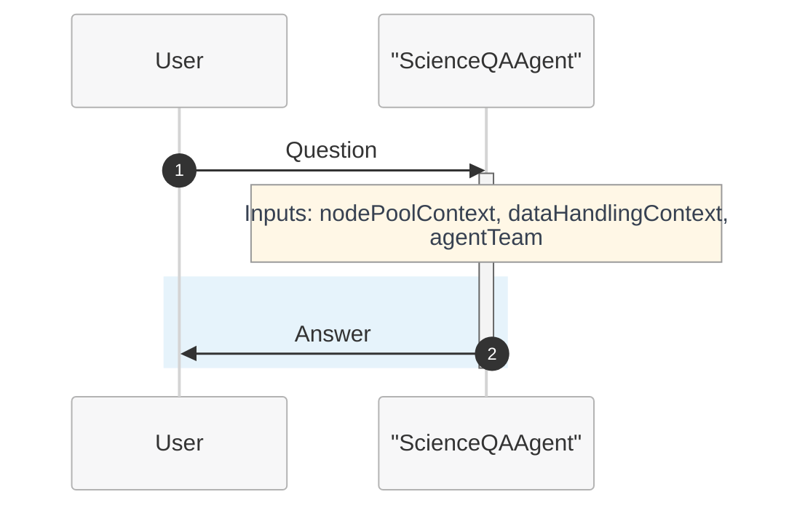

```yaml
name: ScienceQAWorkflow
states:
- name: QuestionAnswering
  actors:
    - agent: ScienceQAAgent
      inputs:
        userGoal: userGoal
        dataHandlingContext: dataHandlingContext
        messageId: messageId
        nodePoolContext: nodePoolContext
        agentTeam: agentTeam
        workflowContext: workflowContext
      thread: MainThread
      humanInLoopMode: onNoMessage
      streamOutput: true
      maxTurn: 50
      maxTransientErrorRetries: 3
      maxRateLimitRetries: 3
  isFinal: false
- name: End
  actors: []
  isFinal: true

transitions:
- from: QuestionAnswering
  to: End

variables:
- Type: thread
  name: MainThread
- Type: userDefined
  name: userGoal
- Type: userDefined
  name: nodePoolContext
- Type: userDefined
  name: messageId
- Type: userDefined
  name: workflowContext
  value: "
    # Workflow Context:
    You are a specialized Q&A agent focused on answering questions about molecular science and chemistry.
    Your primary role is to provide accurate, helpful responses to user queries using your knowledge and understanding.
    
    ## Workflow specific rules and guidelines
    - Provide clear, concise answers to user questions
    - Use scientific terminology appropriately
    - When uncertain, acknowledge limitations rather than guessing
    - Structure your responses logically with proper explanations
    - Focus on accuracy and educational value in your responses
    "
- Type: userDefined
  name: dataHandlingContext
  value: "
    GUIDELINES:
    
    **Definitions**
    - **Virtual path**: System-assigned absolute namespace for passing data between steps (e.g., `/step0/app/outputs`). Not the container’s real filesystem path.
    - **Container path**: Absolute path inside the tool container (e.g., `/app/outputs`). Used only in `outputMounts` and `inputMountPath`.
    - **Mapping**: Tool reads/writes container (mount) path → system maps to virtual path. Pass **virtual path** downstream, not container path.
    - **Implicit extension**: If `/step0/app/outputs` exists, `/step0/app/outputs/reports` is valid (assuming 'reports' exists in the data pointed to by `/step0/app/outputs`.  Make extension explicit by giving the implicit path a description.
    -**No shortening virtual paths**: Implied 'shortening' is disallowed (So if you had `/step0/app/outputs/reports` as the only item in the context, shortening it to just `/step0/app/outputs` would not be valid).
    ---
    
    **Global Rules**
    1. ALL paths must be ABSOLUTE. Never use relative paths.
    2. Retrieve current data context before any action.
    3. Preview data before updating descriptions.
    4. Update virtualPath description **before** promoting to data asset (or description won’t propagate).
    5. Remember to promote data asset after updating description.
    
    ---
    
    **Tool Mount Rules**
    - `outputMounts` = absolute container path where tool stores outputs.  Only directories are permitted.
    - `inputMounts` = array of `{ virtualPath: <virtual path>, inputMountPath: <absolute container path> }`. Files or directories are permitted. The mount path will be of the type (file/directory) that is keyed by the virtual path given.
    
      ---
      
      **Example Flow**
      1. Tool writes `molecule.txt` to `/app/outputs` (container path).
      2. System maps to virtual path `/step0/app/outputs`.
      3. Update description for `/step0/app/outputs`.
      4. Next tool mounts `/step0/app/outputs` as `virtualPath`; `inputMountPath = /app/inputs`.
      ```json
      inputMounts: [ { virtualPath: /step0/app/outputs, inputMountPath: /app/inputs } ]
      ```
      5. Tool produces `step1/app/outputs`
      6. Update description of `step1/app/outputs`
      7. Promote `step1/app/outputs` as data asset"
- Type: userDefined
  name: agentTeam
  value: |-
    Agent team composition:
    1. ScienceQAAgent - Specialized in answering molecular science and chemistry questions
       Capabilities: Provides accurate answers about molecular structures, chemical reactions, computational chemistry concepts, and research methodologies

startstate: QuestionAnswering
```

### Understanding Workflow Components

#### States:
- **QuestionAnswering**: The active state where the Q&A agent processes user queries
  - `actors`: Specifies which agent(s) to use in this state
  - `streamOutput: true`: Enables real-time response streaming
  - `maxTurn: 1`: Limits the agent to one response before transitioning
  - `isFinal: false`: Indicates this is not the terminal state

- **End**: The terminal state that concludes the workflow
  - `actors: []`: No agents needed in the end state
  - `isFinal: true`: Marks this as the final state

#### Transitions:
- Defines how the workflow moves between states
- In our simple case: QuestionAnswering → End (automatic transition after agent response)

#### Variables:
- **Thread Variables**: `MainThread` maintains conversation context
- **Context Variables**: Provide runtime information to agents
  - `nodePoolContext`: Computational resource hints
  - `dataHandlingContext`: Data processing guidelines  
  - `agentTeam`: Information about available agents

### Benefits of Workflow Agents:
- **Orchestration**: Coordinate multiple agents for complex tasks
- **State Management**: Track progress through multi-step processes
- **Context Sharing**: Pass information between different agents
- **Scalability**: Easy to add more states and agents as needs grow

## Step 5: Onboarding and Usage

1. **Save** your agent definition as `science-qa-agent.yaml`
2. **Convert YAML to JSON** using the definition content creator tool:
   ```bash
   python utils/definition-content-creator.py science-qa-agent.yaml --json --output science-qa-agent.json
   ```
   This tool converts your YAML definition to the JSON format required by the Microsoft Discovery platform.
3. **Create ARM resources** through Azure portal using the generated JSON file
4. **Onboard** the agent through Microsoft Discovery platform

### For Q&A Agents:
- Focus on clear, accurate responses
- Test with domain-specific questions
- Validate response consistency
- Monitor performance metrics

## Step 6: Testing Your Agent

> **📋 Project Setup Required**: Before testing your workflow agent, you'll need to create a project in Microsoft Discovery. Follow the [Creating a Project guide](#broken-link-..-..-7-projects-a--creating-project) for step-by-step instructions on setting up your project environment.

### Sample Questions to Test:

1. **Basic Concept**: "What is the difference between ionic and covalent bonds?"
2. **Applied Knowledge**: "How does molecular polarity affect solubility?"
3. **Research Methods**: "What computational methods are used for protein folding prediction?"
4. **Problem Solving**: "Why might a drug molecule have poor bioavailability?"

### Expected Response Characteristics:
- Clear, structured answers
- Scientific accuracy
- Appropriate depth for the question
- Professional tone

## Step 7: Best Practices

### For Q&A Agents:
- Use lower temperature (0.2-0.4) for factual accuracy
- Keep instructions focused and specific
- Include context variables for future extensibility
- Test with diverse question types

### Common Pitfalls to Avoid:
- Overly high temperature leading to inconsistent answers
- Vague instructions that don't guide the model effectively
- Missing context variables that limit future workflow integration

## Step 8: Next Steps

After mastering basic Q&A agents, consider:
- Adding knowledge base integration (Tutorial 2)
- Incorporating specialized tools (Tutorial 3)
- Creating multi-agent workflows for complex queries

## Step 9: Troubleshooting

**Problem**: Responses are too verbose
**Solution**: Add instruction "Keep responses concise and focused"

**Problem**: Responses lack scientific accuracy
**Solution**: Lower temperature and add domain-specific guidelines

**Problem**: Agent doesn't handle edge cases well
**Solution**: Add examples of edge cases in instructions

---

**Continue to [Tutorial 2: Single Agent with Knowledge Base](#broken-link-d--tutorial-02-single-agent-kb)**

#4-how-to6-tools-models-agentsagents-publishingd-tutorial-02-single-agent-kbmd

## 4-how-to/6-tools-models-agents/agents-publishing/d--tutorial-02-single-agent-kb.md
Source: 4-how-to/6-tools-models-agents/agents-publishing/d--tutorial-02-single-agent-kb.md (local)

# Tutorial 2: Single Agent with Knowledge Base - Response Generation

This tutorial demonstrates how to create a single agent that leverages knowledge bases to provide enhanced, domain-specific responses using Microsoft Discovery.

## Overview

In this tutorial, you'll learn to:
- Integrate knowledge base tools with your agent
- Configure agents to query and utilize external knowledge sources
- Handle knowledge base responses effectively
- Test and validate your knowledge base agent

## Prerequisites

- Completion of [Tutorial 1: Single Agent Q&A](#broken-link-c--tutorial-01-single-agent-qa)
- Access to Microsoft Discovery platform
- Basic understanding of YAML syntax
- Understanding of retrieval-augmented generation concepts

## Step 1: Knowledge Base Integration Architecture

### Understanding the Flow:
In Microsoft Discovery, each knowledge base is accessed through a tool that shares the same name as the knowledge base. The tool name IS the knowledge base name. Each tool has a description that explains what that specific knowledge base contains and what types of queries it handles.

1. User asks a question
2. Agent analyzes the query to determine what type of information is needed
3. Agent reviews available knowledge base tools (where tool names = knowledge base names)
4. Agent selects appropriate knowledge base tool(s) based on names and descriptions
5. Agent executes the selected tool to search that specific knowledge base
6. Agent retrieves pertinent information
7. Agent synthesizes response using retrieved knowledge
8. Agent provides enhanced, fact-based answer with proper knowledge base attribution

## Step 2: Creating Knowledge Base Prerequisites

Before creating an agent that uses knowledge bases, you need to set up the knowledge base infrastructure:

#### Prerequisites for Knowledge Base Integration:
1. **Create a Bookshelf**: Container for your indexed Knowledgebases
2. **Upload Documents**: Add proprietary documents to a Discovery DataAsset
3. **Create Knowledgebase**: Create Knowledgebase in the bookshelf in Studio portal

> **📖 For Complete Setup Instructions**: See the detailed [Bookshelf and Knowledgebase Deployment Guide](#broken-link-..-..-9-bookshelves-knowledgebases-a--bookshelf-deployment) for step-by-step instructions on creating storage accounts, bookshelves, indexing knowledgebases, and integrating them with agents.

## Step 3: Basic Agent with Knowledge Base

Here's an agent definition that integrates with molecular science knowledge bases:

```yaml
agent:
  name: ScienceKBAgent
  description: |-
    Molecular science agent with access to specialized knowledge bases for 
    enhanced research and analysis capabilities.
  model: azureml://registries/azure-openai/models/gpt-4o/versions/2024-11-20
  instructions: |-
    You are an AI agent specialized in molecular science with access to comprehensive knowledge bases.
    
    The user goal is: {{userGoal}}
    
    ## Your Capabilities:
    - Access to scientific literature knowledge bases
    - Research methodology knowledge bases
    - Experimental protocol repositories
    - Domain-specific research databases
    
    ## Research Process:
    1. **Query Analysis**: Understand what information is needed
    2. **Knowledge Retrieval**: Search relevant knowledge bases using available tools
    3. **Information Synthesis**: Combine retrieved information with your knowledge
    4. **Response Generation**: Provide comprehensive, evidence-based answers
    
    ## Guidelines:
    - Always search knowledge bases when handling specific research questions
    - Cite sources when using retrieved information
    - Combine multiple sources for comprehensive answers
    - Distinguish between your training knowledge and retrieved information
    
    ## Knowledge Base Tool Selection:
    - Each knowledge base is accessed through a tool that has the same name as the knowledge base
    - Tool names directly correspond to knowledge base names (e.g., "LiteratureSearchKB" tool accesses the "LiteratureSearchKB" knowledge base)
    - Read tool descriptions to understand what each knowledge base contains
    - Select tools based on both the tool/knowledge base name and description relevance
    - Use knowledge base tools only when their name and description match your information needs
    - Multiple different knowledge bases may be needed for comprehensive answers
    - Preview retrieved information before incorporating into responses
    
    Agent team:
    {{agentTeam}}

    Node pool context: 
    {{nodePoolContext}}

    Data handling context: 
    {{dataHandlingContext}}
  top_p: 0
  temperature: 0
  response_format: auto


extension:
  events: []
  inputs: 
    - name: userGoal
      type: llm
      description: The user request for which the plan needs to be generated.
    - name: workflowContext
      type: llm
      description: The context of the molecular workflow.
    - name: agentTeam
      type: llm
      description: The team of agents that will be involved in the workflow.
  outputs: []
  system_prompts: {}
```

## Step 4: Enhanced Instructions for Knowledge Base Integration

For more sophisticated knowledge base utilization:

```yaml
instructions: |-
  You are an expert molecular science researcher with access to specialized knowledge bases.
  
  ## Knowledge Base Tool Selection:
  
  ### Understanding Tool Names and Descriptions:
  Each knowledge base is accessed through a tool that shares the same name:
  - Tool name = Knowledge base name (direct correspondence)
  - Tool description explains what that specific knowledge base contains
  - Tool description covers what domain or subject area the knowledge base specializes in
  - Tool description indicates what kinds of queries the knowledge base is optimized for
  - Tool description specifies what format the information will be returned in
  
  ### Knowledge Base Selection Process:
  1. **Query Analysis**: Determine what type of information is needed
  2. **Name & Description Review**: Review available tool names and descriptions
  3. **Knowledge Base Selection**: Choose knowledge bases whose names and descriptions match your requirements
  4. **Multi-KB Strategy**: Use multiple knowledge bases when comprehensive coverage is needed
  
  ## Knowledge Base Strategy:
  
  ### When to Use Knowledge Bases:
  - Recent research findings or publications
  - Experimental procedures and protocols
  - Comparative analysis between research studies
  - Regulatory or safety information
  - Domain-specific technical documentation
  
  ### Knowledge Base Workflow:
  1. **Assess Query**: Determine if external knowledge is needed
  2. **Select Sources**: Choose appropriate knowledge bases
  3. **Retrieve Information**: Use tools to gather relevant data
  4. **Validate Results**: Check consistency and relevance
  5. **Synthesize Response**: Combine retrieved and existing knowledge
  
  ### Response Structure with KB Information:
  1. **Direct Answer**: Start with the key finding
  2. **Supporting Evidence**: Include retrieved information with sources
  3. **Context**: Provide background from your training knowledge
  4. **Limitations**: Note any gaps or uncertainties
  
  ## Quality Guidelines:
  - Always attribute information to specific sources
  - Distinguish between retrieved facts and analytical insights
  - Indicate confidence levels based on source quality
  - Suggest additional research directions when appropriate
  
  Agent team:
  {{agentTeam}}

  Node pool context: 
  {{nodePoolContext}}

  Data handling context: 
  {{dataHandlingContext}}
```

## Step 5: Example Knowledge Base Interaction Pattern

### Scenario: User asks about recent research findings

**User Query**: "What are the latest developments in renewable energy storage technologies?"

**Agent Process**:
1. Recognize this requires recent research and literature information
2. Review available knowledge base tools (where tool names = knowledge base names)
3. Identify knowledge base tool named something like "LiteratureSearchKB" or "RenewableEnergyResearchKB"
4. Execute the knowledge base tool to access that specific knowledge base
5. Retrieve recent research findings from the selected knowledge base
6. Synthesize response with context and knowledge base attribution

**Example Tool Selection**:
- **Query Type**: Recent research findings
- **Knowledge Base Selected**: Based on tool name (e.g., "LiteratureSearchKB") and description
- **Tool Executed**: The tool with the same name as the selected knowledge base
- **Alternative**: If multiple relevant knowledge bases exist, may use several for comprehensive coverage

**Expected Response Structure**:
```
## Recent Developments in Renewable Energy Storage

Based on literature research knowledge base:

### Battery Technologies:
- **Solid-state batteries**: Recent breakthroughs in lithium-metal anodes
- **Source**: Literature Search Knowledge Base - Journal Articles 2024

### Grid-scale Storage:
- **Flow batteries**: Improved vanadium redox systems
- **Compressed air**: Advanced adiabatic systems
- **Source**: Renewable Energy Research Knowledge Base

### Analysis:
The field is rapidly evolving with focus on safety, energy density, and cost reduction...

### Research Trends:
- Increased focus on sustainable materials
- Integration with smart grid technologies
- Economic viability studies
```

## Step 6: Knowledge Base Tool Examples

### Understanding Tool Names and Descriptions
The tool name is the knowledge base name. Here are examples of knowledge base tools you might encounter:

**Example Knowledge Base Tools (Tool Name = Knowledge Base Name):**
- **LiteratureSearchKB**: "Searches recent scientific publications and research papers across multiple scientific domains. Returns abstracts, citations, and key findings from peer-reviewed journals."
- **ProtocolRepositoryKB**: "Retrieves step-by-step experimental procedures and research methodologies. Contains validated protocols with detailed instructions and best practices."
- **SafetyDatabaseKB**: "Provides hazard data, handling protocols, and regulatory information for laboratory and research environments."
- **TechnicalStandardsKB**: "Accesses technical standards, specifications, and regulatory guidelines across various industries and research domains."

### Knowledge Base Selection Examples:
- **Query**: "Latest research on quantum computing applications" → Use **LiteratureSearchKB** knowledge base
- **Query**: "Standard protocols for cell culture" → Use **ProtocolRepositoryKB** knowledge base
- **Query**: "Safety guidelines for laboratory equipment" → Use **SafetyDatabaseKB** knowledge base
- **Query**: "IEEE standards for wireless communication" → Use **TechnicalStandardsKB** knowledge base

## Step 7: Advanced Knowledge Base Configuration

### Multiple Knowledge Base Access

```yaml
instructions: |-
  You have access to multiple specialized knowledge bases:
  
  ## Available Knowledge Sources:
  - **Literature Knowledge Base**: Recent publications and research papers
  - **Protocol Repository**: Step-by-step experimental procedures
  - **Safety Knowledge Base**: Hazard information and handling protocols
  - **Technical Standards DB**: Industry standards and specifications
  
  ## Selection Strategy:
  - **Literature KB**: For recent discoveries, review articles, methodology
  - **Protocol KB**: For experimental procedures, research methods
  - **Safety KB**: For handling, storage, disposal information
  - **Standards KB**: For technical specifications and regulatory guidelines
  
  ## Multi-Source Integration:
  1. Query relevant Knowledgebases based on question type
  2. Cross-reference information across sources
  3. Highlight agreements and discrepancies
  4. Provide comprehensive, multi-faceted responses
```

## Step 8: Creating a Workflow with Knowledge Base Agent

Now that you have a working knowledge base agent, let's create a simple workflow that orchestrates this agent. This workflow will have two states to handle knowledge base queries:

1. **Knowledge Research State**: Uses our KB agent to process queries requiring external knowledge
2. **End State**: Terminates the workflow

### Knowledge Base Workflow Definition

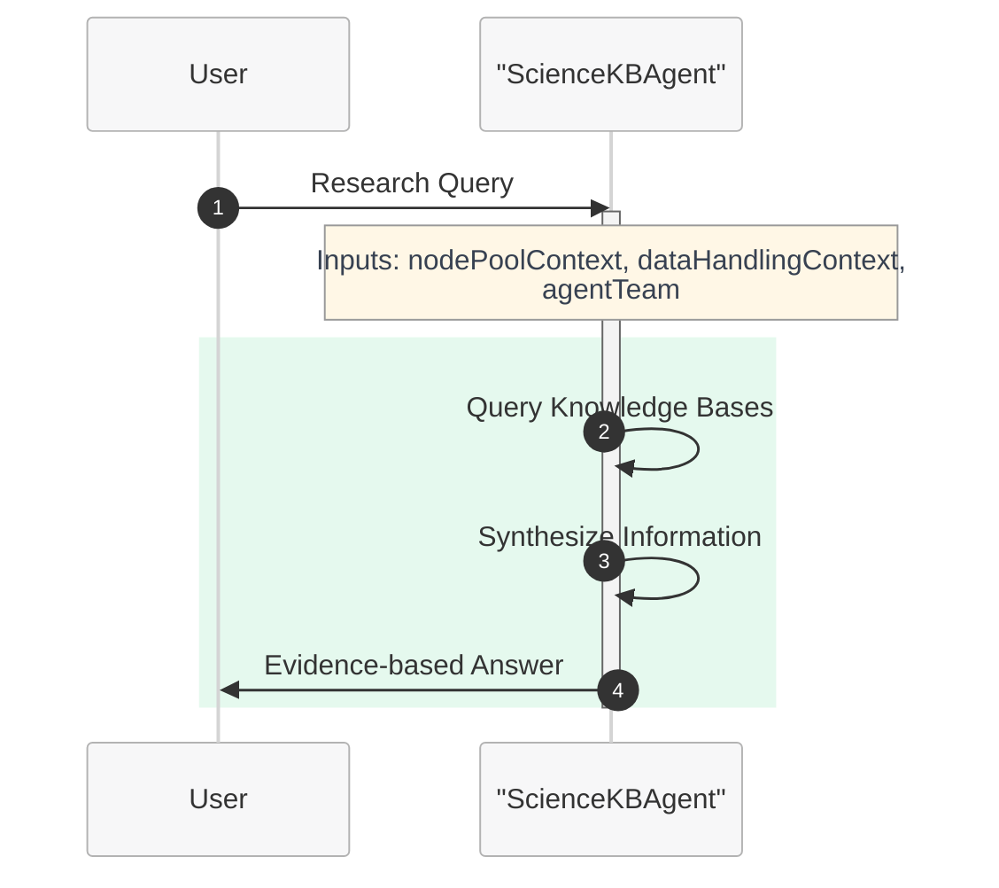

```yaml
name: ScienceKBWorkflow
states:
- name: KnowledgeResearch
  actors:
    - agent: ScienceKBAgent
      inputs:
        userGoal: userGoal
        dataHandlingContext: dataHandlingContext
        messageId: messageId
        nodePoolContext: nodePoolContext
        agentTeam: agentTeam
        workflowContext: workflowContext
      thread: MainThread
      humanInLoopMode: onNoMessage
      streamOutput: true
      maxTurn: 50
      maxTransientErrorRetries: 3
      maxRateLimitRetries: 3
  isFinal: false
- name: End
  actors: []
  isFinal: true

transitions:
- from: KnowledgeResearch
  to: End

variables:
- Type: thread
  name: MainThread
- Type: userDefined
  name: userGoal
- Type: userDefined
  name: nodePoolContext
- Type: userDefined
  name: messageId
- Type: userDefined
  name: workflowContext
  value: "
    # Workflow Context:
    You are apart of a team of AI agents working together
    
    ## Workflow specific rules and guidlines
    - *Important* You should only perform actions which have been assigned to you in the plan.
    - If there is a tool available that can accomplish your step, you should use it, making sure to follow the instructions to use it precisely.
    - It is ok to not know the answer, if you don't know the answer to something or you have no tools to accomplish the given task, you may respond accordingly.
    - *Important* you should never hallucinate any tool invocations.
    "
- Type: userDefined
  name: dataHandlingContext
  value: "
    GUIDELINES:
    
    **Definitions**
    - **Virtual path**: System-assigned absolute namespace for passing data between steps (e.g., `/step0/app/outputs`). Not the container’s real filesystem path.
    - **Container path**: Absolute path inside the tool container (e.g., `/app/outputs`). Used only in `outputMounts` and `inputMountPath`.
    - **Mapping**: Tool reads/writes container (mount) path → system maps to virtual path. Pass **virtual path** downstream, not container path.
    - **Implicit extension**: If `/step0/app/outputs` exists, `/step0/app/outputs/reports` is valid (assuming 'reports' exists in the data pointed to by `/step0/app/outputs`.  Make extension explicit by giving the implicit path a description.
    -**No shortening virtual paths**: Implied 'shortening' is disallowed (So if you had `/step0/app/outputs/reports` as the only item in the context, shortening it to just `/step0/app/outputs` would not be valid).
    ---
    
    **Global Rules**
    1. ALL paths must be ABSOLUTE. Never use relative paths.
    2. Retrieve current data context before any action.
    3. Preview data before updating descriptions.
    4. Update virtualPath description **before** promoting to data asset (or description won’t propagate).
    5. Promote only final outputs for end user; intermediate results don’t need promotion.
    
    ---
    
    **Tool Mount Rules**
    - `outputMounts` = absolute container path where tool stores outputs.  Only directories are permitted.
    - `inputMounts` = array of `{ virtualPath: <virtual path>, inputMountPath: <absolute container path> }`. Files or directories are permitted. The mount path will be of the type (file/directory) that is keyed by the virtual path given.
    
      ---
      
      **Example Flow**
      1. Tool writes `molecule.txt` to `/app/outputs` (container path).
      2. System maps to virtual path `/step0/app/outputs`.
      3. Update description for `/step0/app/outputs`.
      4. Next tool mounts `/step0/app/outputs` as `virtualPath`; `inputMountPath = /app/inputs`.
      ```json
      inputMounts: [ { virtualPath: /step0/app/outputs, inputMountPath: /app/inputs } ]
      ```
      5. Tool produces `step1/app/outputs`
      6. Update description of `step1/app/outputs`
      7. Promote `step1/app/outputs`"
- Type: userDefined
  name: agentTeam
  value: |-
    Agent team composition:
    1. ScienceKBAgent - Specialized in knowledge base research and literature analysis
       Capabilities: Accesses multiple knowledge bases including literature databases, protocol repositories, safety information, and technical standards. Provides evidence-based answers with proper source attribution.

startstate: KnowledgeResearch
```

### Workflow Benefits for Knowledge Base Agents:
- **Knowledge Orchestration**: Coordinate multiple knowledge base queries
- **Research Workflow**: Structure complex research processes
- **Source Integration**: Manage multiple knowledge sources systematically
- **Extensibility**: Easy to add validation or summarization states

## Step 9: Onboarding

To onboard your knowledge base-enhanced agent:

1. **Save** your agent definition as `science-kb-agent.yaml`
2. **Convert YAML to JSON** using the definition content creator tool:
   ```bash
   python utils/definition-content-creator.py science-kb-agent.yaml --json --output science-kb-agent.json
   ```
3. **Save** your workflow definition as `science-kb-workflow.yaml`
4. **Convert workflow YAML to JSON**:
   ```bash
   python utils/definition-content-creator.py science-kb-workflow.yaml --json --output science-kb-workflow.json
   ```
5. **Create ARM resources** through Azure portal for both agent and workflow using the generated JSON files
6. **Onboard** both agent and workflow through Microsoft Discovery platform

### Adding Knowledgebase to Your Agent

When creating an agent that needs to access proprietary documents or specialized knowledge bases, you can integrate indexed Knowledgebases from the Discovery Bookshelf service:

#### Adding Knowledgebase During Agent Creation:
- In the agent creation interface, you'll see an option to select indexed Knowledgebases
- Choose the relevant Knowledgebase(s) that contain the domain-specific information your agent needs
- The agent will automatically gain access to query this proprietary knowledge alongside other knowledge base tools

#### Benefits:
- **Proprietary Data Access**: Query your organization's specific documents and knowledge
- **Grounding Skills**: Agents can provide answers based on your indexed content
- **Contextual Responses**: Combine general knowledge with your specialized information

> **📖 For Complete Setup Instructions**: See the detailed [Bookshelf and Knowledgebase Deployment Guide](#broken-link-..-..-9-bookshelves-knowledgebases-a--bookshelf-deployment) for step-by-Step instructions on creating storage accounts, bookshelves, indexing knowledgebases, and integrating them with agents.

## Step 10: Testing Your Knowledge Base Agent

> **📋 Project Setup Required**: Before testing your workflow agent, you'll need to create a project in Microsoft Discovery. Follow the [Creating a Project guide](#broken-link-..-..-7-projects-a--creating-project) for step-by-step instructions on setting up your project environment.

### Test Scenarios:

1. **Literature Research**: "What are the latest developments in artificial intelligence ethics?"
2. **Methodology Question**: "What are the standard protocols for conducting user experience research?"
3. **Safety Information**: "What are the safety requirements for working with high-voltage equipment?"
4. **Technical Standards**: "What are the current IEEE standards for network security?"

### Validation Checklist:
- [ ] Agent searches appropriate knowledge bases
- [ ] Retrieved information is relevant and accurate
- [ ] Sources are properly cited
- [ ] Response combines retrieved and existing knowledge
- [ ] Limitations and uncertainties are acknowledged

## Step 11: Best Practices for KB-Enhanced Agents

### Knowledge Base Selection:
- Choose databases relevant to your domain
- Ensure knowledge bases are current and authoritative
- Consider multiple complementary sources

### Query Optimization:
- Use specific, targeted queries
- Iterate searches if initial results are insufficient
- Validate retrieved information quality

### Response Quality:
- Always cite sources for retrieved information
- Distinguish between factual data and interpretations
- Provide context for non-expert users

## Step 12: Common Challenges and Solutions

### Challenge: Information Overload
**Solution**: Implement filtering and ranking strategies in instructions

### Challenge: Conflicting Information
**Solution**: Acknowledge discrepancies and explain possible reasons

### Challenge: Outdated Information
**Solution**: Check publication dates and note when information might be superseded

## Step 13: Multi-Knowledge Base Integration

### Response Time:
- Use targeted queries to reduce search time
- Implement caching strategies where appropriate
- Balance comprehensiveness with efficiency

### Accuracy:
- Cross-reference multiple sources
- Include confidence indicators
- Provide source quality assessments

## Next Steps

After mastering knowledge base integration:
- Explore tool integration (Tutorial 3)
- Learn multi-agent orchestration
- Implement specialized domain workflows

## Troubleshooting

**Problem**: Agent doesn't use knowledge bases
**Solution**: Add explicit instructions to query knowledge bases for specific question types

**Problem**: Retrieved information is irrelevant
**Solution**: Refine search queries and add result validation steps

**Problem**: Response lacks source attribution
**Solution**: Emphasize citation requirements in instructions

---

**Continue to [Tutorial 3: Single Agent with Tools](#broken-link-e--tutorial-03-single-agent-tools)**

#4-how-to6-tools-models-agentsagents-publishinge-tutorial-03-single-agent-toolsmd

## 4-how-to/6-tools-models-agents/agents-publishing/e--tutorial-03-single-agent-tools.md
Source: 4-how-to/6-tools-models-agents/agents-publishing/e--tutorial-03-single-agent-tools.md (local)

# Tutorial 3: Single Agent with Tools

This tutorial demonstrates how to create a single agent that uses computational tools to perform complex tasks and analyses using Microsoft Discovery.

## Overview

In this tutorial, you'll learn to:
- Integrate computational tools with your agent
- Configure tool execution and data handling
- Implement tool-based workflows
- Handle tool outputs and error scenarios
- Create agents that can perform computational tasks

## Prerequisites

- Completion of [Tutorial 2: Single Agent with Knowledge Base](#broken-link-d--tutorial-02-single-agent-kb)
- Understanding of computational chemistry tools
- Basic knowledge of Python and RDKit (for chemistry examples)
- Access to Microsoft Discovery computational resources

## Step 1: Understanding Tool Integration

### Tool Categories:
1. **Computational Chemistry Tools**: RDKit, molecular dynamics simulators
2. **Data Processing Tools**: File manipulation, format conversion
3. **Analysis Tools**: Statistical analysis, visualization
4. **Custom Tools**: Domain-specific computational tools

### Tool Execution Flow:
1. Agent receives task requiring computation
2. Agent plans tool usage strategy
3. Agent executes tools with appropriate parameters
4. Agent processes tool outputs
5. Agent synthesizes results into user response

## Step 2: Tool Creation and Agent Integration

### Prerequisites: Create Required Tools

Before creating an agent that uses computational tools, you need to create and deploy the tools that your agent will use. The agent will reference these tools during creation.

> **📋 Tool Creation Required**: Tools must be created and deployed before they can be used by agents. Follow the comprehensive tool creation guide in [../tools-publishing/](#broken-link-..-tools-publishing-) which covers:
> 
> - **[Identify Tool Functionalities](#broken-link-..-tools-publishing-a--identify-tool-functionalities-and-dependencies)**: Define what your tool needs to accomplish
> - **[Writing Action Scripts](#broken-link-..-tools-publishing-b--writing-action-scripts)**: Create the executable scripts for your tool
> - **[Generate Docker File](#broken-link-..-tools-publishing-c--generate-docker-file)**: Containerize your tool for deployment
> - **[Create and Publish Tools](#broken-link-..-tools-publishing-d--create-validate-publish-tools-to-acr)**: Deploy tools to Azure Container Registry
> - **[Create Tool Definition](#broken-link-..-tools-publishing-e--create-tool-definition)**: Define the tool interface and configuration
>
> **Important**: When creating your agent in the Microsoft Discovery platform, you'll need to **select the tools** that your agent can use. Only pre-created and deployed tools will be available for selection during agent creation.

### Agent Definition with Tool Integration

Here's an agent that can use RDKit and other computational tools for molecular analysis:

```yaml
agent:
  name: AnalysisToolAgent
  description: |-
    Molecular analysis agent that uses computational tools for 
    cheminformatics tasks and molecular property calculations.
  model: azureml://registries/azure-openai/models/gpt-4o/versions/2024-11-20
  instructions: |-
    You are an AI agent specialized in molecular analysis using computational tools.
    
    The user goal is: {{userGoal}}
    
    ## Your Capabilities:
    - Execute Python code with RDKit for molecular manipulation
    - Generate 2D and 3D molecular conformers
    - Calculate molecular properties and descriptors
    - Perform molecular structure analysis
    - Convert between molecular formats (SMILES, SDF, XYZ)
    
    ## Workflow Process:
    1. **Task Analysis**: Understand the computational requirements
    2. **Tool Planning**: Determine which tools and methods to use
    3. **Execution**: Run computational tools with proper parameters
    4. **Result Processing**: Analyze and interpret tool outputs
    5. **Response Generation**: Provide clear results and insights
    
    ## Tool Usage Guidelines:
    - Always plan your approach before executing tools
    - Include error handling in your computational scripts
    - Use appropriate RDKit functions for molecular tasks
    - Print clear results and intermediate steps
    - Handle different molecular input formats gracefully
    
    ## Data Handling:
    - Check data context for available molecular data
    - Preview data assets before processing
    - Save important results to output directories
    - Update data descriptions for generated files
    
    Agent team:
    {{agentTeam}}

    Node pool context: 
    {{nodePoolContext}}

    Data handling context: 
    {{dataHandlingContext}}
  top_p: 0
  temperature: 0
  response_format: auto

extension:
  events: []
  inputs: []
  outputs: []
  system_prompts: {}
```

## Step 3: Advanced Tool Integration Instructions

For more sophisticated tool usage:

```yaml
instructions: |-
  You are an expert computational chemist with access to powerful molecular analysis tools.
  
  ## Tool Strategy Framework:
  
  ### Pre-Execution Planning:
  1. **Requirement Analysis**: What computational task is needed?
  2. **Tool Selection**: Which tools are most appropriate?
  3. **Parameter Planning**: What inputs and settings to use?
  4. **Output Planning**: What results to expect and how to process them?
  
  ### Execution Best Practices:
  
  #### For RDKit Operations:
  - Always validate SMILES strings before processing
  - Handle multiple conformers appropriately
  - Use try/except blocks for error handling
  - Clear print statements for result tracking
  
  #### For Molecular Property Calculations:
  - Calculate multiple descriptors when relevant
  - Compare results against known values when possible
  - Report units and conditions clearly
  - Note any limitations or assumptions
  
  #### For Structure Generation:
  - Generate appropriate numbers of conformers
  - Optimize geometries when needed
  - Export in requested formats (XYZ, SDF, etc.)
  - Validate generated structures
  
  ### Error Handling Strategy:
  1. **Input Validation**: Check inputs before tool execution
  2. **Graceful Failures**: Provide clear error messages
  3. **Alternative Approaches**: Try different methods if initial approach fails
  4. **Partial Results**: Report what succeeded even if some steps failed
  
  ### Result Interpretation:
  - Provide context for numerical results
  - Compare to literature values when appropriate
  - Explain significance of findings
  - Suggest follow-up analyses
  
  ## Code Quality Standards:
  ```python
  # Example structure for RDKit operations
  try:
      from rdkit import Chem
      from rdkit.Chem import Descriptors, AllChem
      
      # Input validation
      mol = Chem.MolFromSmiles(smiles)
      if mol is None:
          print(f"Error: Invalid SMILES string: {smiles}")
          return
      
      # Main computation
      # ... computational steps ...
      
      # Clear result reporting
      print(f"Molecular Weight: {mw:.2f} g/mol")
      print(f"LogP: {logp:.2f}")
      
  except Exception as e:
      print(f"Computation failed: {str(e)}")
  ```
  
  Agent team:
  {{agentTeam}}

  Node pool context: 
  {{nodePoolContext}}

  Data handling context: 
  {{dataHandlingContext}}
```

## Step 4: Creating a Workflow with Tool-Enabled Agent

Now that you have a working tool-enabled agent, let's create a workflow that orchestrates computational tasks. This workflow will manage tool execution and result processing:

1. **Computational Analysis State**: Uses our tool agent to perform computational tasks
2. **End State**: Terminates the workflow

### Tool-Based Workflow Definition

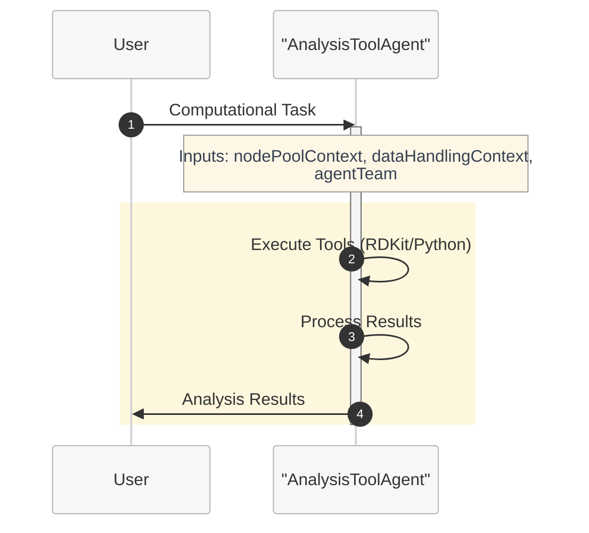

```yaml
name: AnalysisToolWorkflow
states:
- name: ComputationalAnalysis
  actors:
    - agent: AnalysisToolAgent
      inputs:
        userGoal: userGoal
        dataHandlingContext: dataHandlingContext
        messageId: messageId
        nodePoolContext: nodePoolContext
        agentTeam: agentTeam
        workflowContext: workflowContext
      thread: MainThread
      humanInLoopMode: onNoMessage
      streamOutput: true
      maxTurn: 50
      maxTransientErrorRetries: 3
      maxRateLimitRetries: 3
  isFinal: false
- name: End
  actors: []
  isFinal: true

transitions:
- from: ComputationalAnalysis
  to: End

variables:
- Type: thread
  name: MainThread
- Type: userDefined
  name: userGoal
- Type: userDefined
  name: nodePoolContext
- Type: userDefined
  name: messageId
- Type: userDefined
  name: workflowContext
  value: "
    # Workflow Context:
    You are apart of a team of AI agents working together
    ## Workflow specific rules and guidlines
    - *Important* You should only perform actions which have been assigned to you in the plan.
    - If there is a tool available that can accomplish your step, you should use it, making sure to follow the instructions to use it precisely.
    - It is ok to not know the answer, if you don't know the answer to something or you have no tools to accomplish the given task, you may respond accordingly.
    - *Important* you should never hallucinate any tool invocations.
    "
- Type: userDefined
  name: dataHandlingContext
  value: "
    GUIDELINES:
    
    **Definitions**
    - **Virtual path**: System-assigned absolute namespace for passing data between steps (e.g., `/step0/app/outputs`). Not the container’s real filesystem path.
    - **Container path**: Absolute path inside the tool container (e.g., `/app/outputs`). Used only in `outputMounts` and `inputMountPath`.
    - **Mapping**: Tool reads/writes container (mount) path → system maps to virtual path. Pass **virtual path** downstream, not container path.
    - **Implicit extension**: If `/step0/app/outputs` exists, `/step0/app/outputs/reports` is valid (assuming 'reports' exists in the data pointed to by `/step0/app/outputs`.  Make extension explicit by giving the implicit path a description.
    -**No shortening virtual paths**: Implied 'shortening' is disallowed (So if you had `/step0/app/outputs/reports` as the only item in the context, shortening it to just `/step0/app/outputs` would not be valid).
    ---
    
    **Global Rules**
    1. ALL paths must be ABSOLUTE. Never use relative paths.
    2. Retrieve current data context before any action.
    3. Preview data before updating descriptions.
    4. Update virtualPath description **before** promoting to data asset (or description won’t propagate).
    5. Promote only final outputs for end user; intermediate results don’t need promotion.
    
    ---
    
    **Tool Mount Rules**
    - `outputMounts` = absolute container path where tool stores outputs.  Only directories are permitted.
    - `inputMounts` = array of `{ virtualPath: <virtual path>, inputMountPath: <absolute container path> }`. Files or directories are permitted. The mount path will be of the type (file/directory) that is keyed by the virtual path given.
    
      ---
      
      **Example Flow**
      1. Tool writes `molecule.txt` to `/app/outputs` (container path).
      2. System maps to virtual path `/step0/app/outputs`.
      3. Update description for `/step0/app/outputs`.
      4. Next tool mounts `/step0/app/outputs` as `virtualPath`; `inputMountPath = /app/inputs`.
      ```json
      inputMounts: [ { virtualPath: /step0/app/outputs, inputMountPath: /app/inputs } ]
      ```
      5. Tool produces `step1/app/outputs`
      6. Update description of `step1/app/outputs`
      7. Promote `step1/app/outputs`"
- Type: userDefined
  name: agentTeam
  value: |-
    Agent team composition:
    1. AnalysisToolAgent - Specialized in computational molecular analysis
       Capabilities: Executes RDKit tools for molecular manipulation, generates 2D/3D conformers, calculates molecular properties, performs structure analysis, and handles molecular format conversions. Includes comprehensive error handling and result validation.

startstate: ComputationalAnalysis
```

### Workflow Benefits for Tool-Enabled Agents:
- **Computational Orchestration**: Manage complex tool execution sequences
- **Resource Management**: Coordinate computational resource usage
- **Error Recovery**: Handle tool failures and retry strategies
- **Result Processing**: Structure output handling and validation
- **Scalability**: Easy to add parallel processing or specialized tool states

## Step 5: Onboarding

To onboard your tool-enhanced agent:

1. **Save** your agent definition as `analysis-tool-agent.yaml`
2. **Convert YAML to JSON** using the definition content creator tool:
   ```bash
   python utils/definition-content-creator.py analysis-tool-agent.yaml --json --output analysis-tool-agent.json
   ```
3. **Save** your workflow definition as `analysis-tool-workflow.yaml`
4. **Convert workflow YAML to JSON**:
   ```bash
   python utils/definition-content-creator.py analysis-tool-workflow.yaml --json --output analysis-tool-workflow.json
   ```
5. **Create ARM resources** through Azure portal for both agent and workflow using the generated JSON files, remember to add the tool you created to the Agent when create the Agent resource.

## Step 6: Testing Your Tool-Enhanced Agent

> **📋 Project Setup Required**: Before testing your workflow agent, you'll need to create a project in Microsoft Discovery. Follow the [Creating a Project guide](#broken-link-..-..-7-projects-a--creating-project) for step-by-step instructions on setting up your project environment.

### Test Scenarios:

1. **Basic Calculation**: "Calculate the molecular weight of benzene"
2. **Structure Generation**: "Generate 5 conformers of glucose"
3. **Property Comparison**: "Compare LogP values of various drug molecules"
4. **Format Conversion**: "Convert this SMILES to XYZ coordinates"
5. **Complex Analysis**: "Analyze the drug-likeness of this compound library"

### Validation Checklist:
- [ ] Agent correctly interprets computational requests
- [ ] Appropriate tools are selected and executed
- [ ] Tool parameters are set correctly
- [ ] Results are processed and interpreted properly
- [ ] Errors are handled gracefully
- [ ] Output data is properly managed

## Step 7: Advanced Tool Integration Patterns

### Sequential Tool Usage:
```yaml
instructions: |-
  ## Multi-Step Computational Workflows:
  
  ### Pattern 1: Structure → Properties → Analysis
  1. Generate/optimize molecular structure
  2. Calculate molecular properties
  3. Analyze and interpret results
  
  ### Pattern 2: Data → Processing → Visualization
  1. Load molecular dataset
  2. Process with computational tools
  3. Generate analysis visualizations
  
  ### Pattern 3: Comparison Workflows
  1. Process multiple molecular inputs
  2. Calculate comparable properties
  3. Generate comparative analysis
```

### Tool Chaining Example:
```python
# Step 1: Structure optimization
optimized_mol = optimize_geometry(input_mol)

# Step 2: Property calculation
properties = calculate_properties(optimized_mol)

# Step 3: Analysis
analysis_results = analyze_druglikeness(properties)

# Step 4: Report generation
generate_report(analysis_results)
```

## Step 8: Performance Optimization

### Computational Efficiency:
- Use appropriate computational methods for task complexity
- Implement caching for repeated calculations
- Parallelize independent operations when possible
- Monitor resource usage

### Error Recovery:
- Implement fallback methods for failed calculations
- Provide partial results when full analysis fails
- Log errors for debugging

## Step 9: Best Practices Summary

### Tool Selection:
- Choose the most appropriate tool for each task
- Consider computational cost vs. accuracy trade-offs
- Use validated, well-established tools

### Code Quality:
- Include comprehensive error handling
- Use clear variable names and comments
- Validate inputs before processing
- Provide informative output messages

### Data Management:
- Follow proper data mounting procedures
- Maintain clear file organization
- Update data descriptions consistently
- Handle different input formats gracefully

## Troubleshooting

**Problem**: Tool execution fails
**Solution**: Check input validation, error handling, and tool availability

**Problem**: Results are inconsistent
**Solution**: Verify tool parameters and computational settings

**Problem**: Data handling errors
**Solution**: Review data mounting and path specifications

**Problem**: Performance issues
**Solution**: Optimize computational parameters and consider tool alternatives

## Next Steps

After mastering tool integration:
- Learn workflow orchestration with multiple agents
- Explore specialized computational domains
- Implement custom tool development
- Study advanced multi-agent coordination patterns

---

**Congratulations!** You've completed the single agent tutorial series. You're now ready for more advanced multi-agent workflows and specialized applications.

#4-how-to6-tools-models-agentsagents-publishingf-tutorial-04-multi-agent-workflowmd

## 4-how-to/6-tools-models-agents/agents-publishing/f--tutorial-04-multi-agent-workflow.md
Source: 4-how-to/6-tools-models-agents/agents-publishing/f--tutorial-04-multi-agent-workflow.md (local)

# Tutorial 4: Multi-Agent Workflow - Orchestrated Task Execution

This tutorial demonstrates how to create a sophisticated multi-agent workflow that coordinates multiple specialized agents to handle complex molecular science tasks using Microsoft Discovery.

## Overview

In this tutorial, you'll learn to:
- Design multi-agent workflows with specialized agent roles
- Implement a planner-router-executor-summarizer pattern
- Coordinate between knowledge base agents and tool agents
- Handle complex task decomposition and execution
- Manage state transitions and data flow between agents

## Prerequisites

- Completion of [Tutorial 3: Single Agent with Tools](#broken-link-e--tutorial-03-single-agent-tools)
- Understanding of workflow orchestration concepts
- Familiarity with multi-agent system design patterns
- Access to Microsoft Discovery computational and knowledge resources

## Step 1: Multi-Agent Architecture Overview

### Agent Roles in the Workflow:

1. **Planner Agent**: Analyzes user requests and creates comprehensive execution plans
2. **Router Agent**: Routes tasks to appropriate specialized agents based on the plan
3. **Knowledge Base Agent**: Retrieves information from domain-specific knowledge bases
4. **Tool Agents**: Execute computational tasks (Python/RDKit, molecular prediction, simulations)
5. **Summarizer Agent**: Synthesizes results and provides final responses to users

### Workflow Pattern:
```
User Request → Planner → Router ⟷ [Knowledge/Tool Agents] → Summarizer → User Response
                          ↑                ↓
                          └── Iterative ───┘
```

## Step 2: Planner Agent Definition

The planner agent analyzes user requests and creates structured execution plans:

```yaml
agent:
  name: ChemistryPlannerAgent
  description: Coordinator agent that receives user requests and generates comprehensive execution plans
  model: azureml://registries/azure-openai/models/gpt-4o/versions/2024-11-20
  instructions: |-
    You are the ChemistryPlannerAgent responsible for creating detailed execution plans for molecular science workflows.
    
    ## Your Role:
    - Analyze user requests to understand goals and requirements
    - Break down complex tasks into actionable, sequential steps
    - Assign appropriate agents to each step based on their capabilities
    - Define inputs and outputs for each step
    
    ## Planning Process:
    1. **Requirement Analysis**: Understand what the user wants to achieve
    2. **Task Decomposition**: Break the goal into logical, manageable steps
    3. **Agent Assignment**: Match steps to the most suitable agents
    4. **Data Flow Design**: Define how information flows between steps
    
    ## Available Agents:
    - **KnowledgeBaseAgent**: For literature research and domain knowledge
    - **CorePythonToolsAgent**: For RDKit operations and general Python computations
    - **MolPredictorAgent**: For molecular property predictions
    - **GromacsAgent**: For molecular dynamics simulations
    
    ## Plan Format:
    Generate plans in this markdown structure:
    
    ## Plan to achieve: [userGoal]
    
    ### Step 1
    - **Description:** [What this step accomplishes]
    - **Agent:** [Name of the agent to use]
    - **Inputs:** [Required information/data]
    - **Outputs:** [Expected results]
    
    ### Step 2
    - **Description:** [What this step accomplishes]
    - **Agent:** [Name of the agent to use]
    - **Inputs:** [Required information/data]
    - **Outputs:** [Expected results]
    
    [Continue with additional steps...]
    
    ## Guidelines:
    - Always start by checking data context for existing assets
    - Split complex tasks into easily understandable steps
    - Don't overload single steps with too much responsibility
    - Consider data dependencies between steps
    - Plan for error handling and validation
    
    The user goal is: {{userGoal}}
    
    Agent team: {{agentTeam}}
    Node pool context: {{nodePoolContext}}
    Data handling context: {{dataHandlingContext}}
  top_p: 0
  temperature: 0
  response_format: auto

extension:
  events: []
  inputs: 
    - name: userGoal
      type: llm
      description: The user request for which the plan needs to be generated
    - name: agentTeam
      type: llm
      description: The team of agents available in the workflow
  outputs: []
  system_prompts: {}
```

## Step 3: Router Agent Definition

The router agent manages task execution based on the plan:

```yaml
agent:
  name: ChemistryRouterAgent
  description: Router agent that coordinates task execution based on generated plans
  model: azureml://registries/azure-openai/models/gpt-4o/versions/2024-11-20
  instructions: |-
    You are the ChemistryRouterAgent responsible for orchestrating plan execution.
    
    ## Your Role:
    - Analyze the execution plan from the ChemistryPlannerAgent
    - Route tasks to appropriate specialized agents based on current progress
    - Monitor conversation history to track completed steps
    - Determine the next logical step in the plan
    
    ## Routing Guidelines:
    - Consider the entire conversation history for context
    - Route to only ONE agent at a time
    - Follow the plan sequence unless adaptation is needed
    - Do not perform computations yourself - delegate to specialists
    - Track progress to avoid repeating completed steps
    
    ## Available Events:
    - **RunCorePythonTools**: For Python/RDKit computational tasks
    - **RunMolPredictor**: For molecular property predictions
    - **RunKnowledgeBase**: For knowledge base queries
    - **RunGromacs**: For molecular dynamics simulations
    - **GenerateSummary**: Final step when all tasks are complete
    
    ## Response Format:
    Always respond in this JSON format:
    ```json
    {
      "NextAgent": "<name of the next agent>",
      "Response": "<explanation of routing decision and next action>"
    }
    ```
    
    ## Critical Rules:
    - Only call GenerateSummary when ALL plan steps are complete
    - Never skip steps in the plan without valid reasoning
    - If stuck in loops, route to GenerateSummary with explanation
    - Provide clear reasoning for each routing decision
    
    Agent team: {{agentTeam}}
    Node pool context: {{nodePoolContext}}
    Data handling context: {{dataHandlingContext}}
  top_p: 0
  temperature: 0
  response_format: auto

extension:
  events:
    - name: RunCorePythonTools
      type: llm
      condition: When the plan requires Python code execution, RDKit operations, or general computational chemistry tasks
    - name: RunMolPredictor
      type: llm
      condition: When the plan requires molecular property predictions (LogP, solubility, boiling point, etc.)
    - name: RunKnowledgeBase
      type: llm
      condition: When the plan requires retrieving information from knowledge bases
    - name: RunGromacs
      type: llm
      condition: When the plan requires molecular dynamics simulations
    - name: GenerateSummary
      type: llm
      condition: When all plan steps are complete and ready to provide final response to user
  inputs:
    - name: agentTeam
      type: llm
      description: The team of agents available in the workflow
  outputs: []
  system_prompts: {}
```

## Step 4: Knowledge Base Agent Definition

The knowledge base agent handles information retrieval:

```yaml
agent:
  name: KnowledgeBaseAgent
  description: Specialized agent for retrieving information from domain-specific knowledge bases
  model: azureml://registries/azure-openai/models/gpt-4o/versions/2024-11-20
  instructions: |-
    You are the KnowledgeBaseAgent specialized in retrieving information from various knowledge bases.
    
    ## Your Role:
    - Serve as the primary interface for knowledge retrieval in the workflow
    - Analyze queries to determine relevant knowledge base tools
    - Retrieve and synthesize information from multiple sources
    - Provide well-structured, cited responses
    
    ## Knowledge Retrieval Process:
    1. **Query Analysis**: Determine what type of information is needed
    2. **Source Selection**: Identify relevant knowledge base tools
    3. **Information Retrieval**: Query appropriate knowledge bases
    4. **Synthesis**: Combine information from multiple sources
    5. **Citation**: Properly attribute information to sources
    
    ## Guidelines:
    - Only use knowledge base tools relevant to the query
    - Query multiple sources for comprehensive coverage
    - Always cite which knowledge base provided specific information
    - Include knowledge base endpoint references (format: "kbname")
    - If no relevant knowledge base exists, clearly state this limitation
    - Focus on information retrieval - don't perform computations
    
    ## Response Structure:
    1. **Information Summary**: Key findings from knowledge bases
    2. **Source Attribution**: Clear citations for all information
    3. **Context**: Relevant background or limitations
    4. **Recommendations**: Suggestions for follow-up if appropriate
    
    Agent team: {{agentTeam}}
    Node pool context: {{nodePoolContext}}
    Data handling context: {{dataHandlingContext}}
  top_p: 0
  temperature: 0
  response_format: auto

extension:
  events: []
  inputs: 
    - name: agentTeam
      type: llm
      description: The team of agents available in the workflow
  outputs: []
  system_prompts: {}
```

## Step 5: Summarizer Agent Definition

The summarizer agent provides final responses to users:

```yaml
agent:
  name: SummarizerAgent
  description: Agent that reviews workflow execution and provides comprehensive final responses
  model: azureml://registries/azure-openai/models/gpt-4o/versions/2024-11-20
  instructions: |-
    You are the SummarizerAgent responsible for providing final responses to users.
    
    ## Your Role:
    - Review the complete workflow execution
    - Synthesize results from all agents and tools
    - Provide comprehensive, user-friendly responses
    - Highlight key findings and data assets created
    
    ## Summarization Process:
    1. **Context Review**: Understand the original user request
    2. **Execution Analysis**: Review all actions taken during workflow
    3. **Result Synthesis**: Combine findings from different agents
    4. **Asset Documentation**: List and describe created data assets
    5. **Final Response**: Provide comprehensive, conversational summary
    
    ## Response Guidelines:
    - Be friendly, conversational, and informative
    - Include key findings and insights from the workflow
    - Reference specific data assets created (not virtual paths)
    - Explain methodology and any limitations
    - Suggest follow-up actions if appropriate
    
    ## Data Asset Handling:
    - Always call GetDataContext before summarizing
    - Reference data assets by their proper names
    - Include descriptions of created assets
    - Highlight relevance to the original user query
    
    You are responding to this user query: {{userGoal}}
    
    Agent team: {{agentTeam}}
    Node pool context: {{nodePoolContext}}
    Data handling context: {{dataHandlingContext}}
  top_p: 0
  temperature: 0
  response_format: auto

extension:
  events: []
  inputs: 
    - name: agentTeam
      type: llm
      description: The team of agents available in the workflow
    - name: userGoal
      type: llm
      description: The original user request
  outputs: []
  system_prompts: {}
```

## Step 6: Multi-Agent Workflow Definition

Now let's create the workflow that orchestrates all these agents:

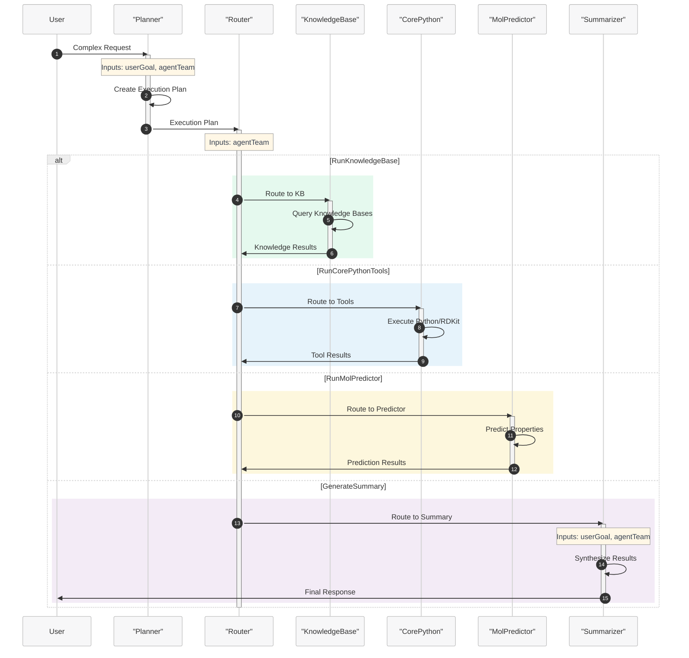

```yaml
name: MolecularScienceWorkflow
states:
- name: Planning
  actors:
    - agent: ChemistryPlannerAgent
      inputs:
        userGoal: userGoal
        dataHandlingContext: dataHandlingContext
        nodePoolContext: nodePoolContext
        agentTeam: agentTeam
      thread: MainThread
      humanInLoopMode: onNoMessage
      streamOutput: false
      maxTurn: 50
      maxTransientErrorRetries: 3
      maxRateLimitRetries: 3
  isFinal: false

- name: AgentRouter
  actors:
    - agent: ChemistryRouterAgent
      inputs:
        dataHandlingContext: dataHandlingContext
        nodePoolContext: nodePoolContext
        agentTeam: agentTeam
      thread: MainThread
      humanInLoopMode: never
      streamOutput: false
      maxTurn: 50
      maxTransientErrorRetries: 3
      maxRateLimitRetries: 3
  isFinal: false

- name: KnowledgeBase
  actors:
    - agent: KnowledgeBaseAgent
      inputs:
        nodePoolContext: nodePoolContext
        dataHandlingContext: dataHandlingContext
        agentTeam: agentTeam
      thread: MainThread
      maxTurn: 20
      humanInLoopMode: never
      streamOutput: false
      maxTransientErrorRetries: 3
      maxRateLimitRetries: 3
  isFinal: false

- name: CorePython
  actors:
    - agent: CorePythonToolsAgent
      inputs:
        nodePoolContext: nodePoolContext
        dataHandlingContext: dataHandlingContext
        agentTeam: agentTeam
      thread: MainThread
      maxTurn: 20
      humanInLoopMode: never
      streamOutput: false
      maxTransientErrorRetries: 3
      maxRateLimitRetries: 3
  isFinal: false

- name: MolPredictor
  actors:
    - agent: MolPredictorAgent
      inputs:
        nodePoolContext: nodePoolContext
        dataHandlingContext: dataHandlingContext
        agentTeam: agentTeam
      thread: MainThread
      maxTurn: 20
      humanInLoopMode: never
      streamOutput: false
      maxTransientErrorRetries: 3
      maxRateLimitRetries: 3
  isFinal: false

- name: Summary
  actors:
    - agent: SummarizerAgent
      inputs:
        dataHandlingContext: dataHandlingContext
        nodePoolContext: nodePoolContext
        agentTeam: agentTeam
        userGoal: userGoal
      thread: MainThread
      humanInLoopMode: never
      streamOutput: true
      maxTurn: 50
      maxTransientErrorRetries: 3
      maxRateLimitRetries: 3
  isFinal: false

- name: End
  actors: []
  isFinal: true

transitions:
- from: Planning
  to: AgentRouter
- from: AgentRouter
  to: CorePython
  event: RunCorePythonTools
- from: AgentRouter
  to: KnowledgeBase
  event: RunKnowledgeBase
- from: AgentRouter
  to: MolPredictor
  event: RunMolPredictor
- from: AgentRouter
  to: Summary
  event: GenerateSummary
- from: CorePython
  to: AgentRouter
- from: MolPredictor
  to: AgentRouter
- from: KnowledgeBase
  to: AgentRouter
- from: Summary
  to: End

variables:
- Type: thread
  name: MainThread
- Type: userDefined
  name: userGoal
- Type: userDefined
  name: nodePoolContext
- Type: userDefined
  name: messageId
- Type: userDefined
  name: workflowContext
  value: "
    # Workflow Context:
    You are apart of a team of AI agents working together to perform molecular computations using various tools and techniques.
    You will receive a plan that comes from the ChemistryPlannerAgent with steps to execute in order to achieve the user goal, you should look through the plan as well as 
    the steps that have already been executed by other agents and decide what to do next based on the plan and the steps that have already been executed.
    
    ## Workflow specific rules and guidlines
    - *Important* You should only perform actions which have been assigned to you in the plan.
    - If there is a tool available that can accomplish your step, you should use it, making sure to follow the instructions to use it precisely.
    - It is ok to not know the answer, if you don't know the answer to something or you have no tools to accomplish the given task, you may respond accordingly.
    - *Important* you should never hallucinate any tool invocations.
    "
- Type: userDefined
  name: dataHandlingContext
  value: "
    GUIDELINES:
    
    **Definitions**
    - **Virtual path**: System-assigned absolute namespace for passing data between steps (e.g., `/step0/app/outputs`). Not the container’s real filesystem path.
    - **Container path**: Absolute path inside the tool container (e.g., `/app/outputs`). Used only in `outputMounts` and `inputMountPath`.
    - **Mapping**: Tool reads/writes container (mount) path → system maps to virtual path. Pass **virtual path** downstream, not container path.
    - **Implicit extension**: If `/step0/app/outputs` exists, `/step0/app/outputs/reports` is valid (assuming 'reports' exists in the data pointed to by `/step0/app/outputs`.  Make extension explicit by giving the implicit path a description.
    -**No shortening virtual paths**: Implied 'shortening' is disallowed (So if you had `/step0/app/outputs/reports` as the only item in the context, shortening it to just `/step0/app/outputs` would not be valid).
    ---
    
    **Global Rules**
    1. ALL paths must be ABSOLUTE. Never use relative paths.
    2. Retrieve current data context before any action.
    3. Preview data before updating descriptions.
    4. Update virtualPath description **before** promoting to data asset (or description won’t propagate).
    5. Promote only final outputs for end user; intermediate results don’t need promotion.
    
    ---
    
    **Tool Mount Rules**
    - `outputMounts` = absolute container path where tool stores outputs.  Only directories are permitted.
    - `inputMounts` = array of `{ virtualPath: <virtual path>, inputMountPath: <absolute container path> }`. Files or directories are permitted. The mount path will be of the type (file/directory) that is keyed by the virtual path given.
    
      ---
      
      **Example Flow**
      1. Tool writes `molecule.txt` to `/app/outputs` (container path).
      2. System maps to virtual path `/step0/app/outputs`.
      3. Update description for `/step0/app/outputs`.
      4. Next tool mounts `/step0/app/outputs` as `virtualPath`; `inputMountPath = /app/inputs`.
      ```json
      inputMounts: [ { virtualPath: /step0/app/outputs, inputMountPath: /app/inputs } ]
      ```
      5. Tool produces `step1/app/outputs`
      6. Update description of `step1/app/outputs`
      7. Promote `step1/app/outputs`"
- Type: userDefined
  name: agentTeam
  value: |-
    Multi-agent team for molecular science workflows:
    
    1. ChemistryPlannerAgent - Strategic planning and task decomposition
       Capabilities: Analyzes user requests and creates comprehensive execution plans
       
    2. ChemistryRouterAgent - Task coordination and agent routing
       Capabilities: Routes tasks to appropriate agents based on plans and execution progress
       
    3. KnowledgeBaseAgent - Information retrieval from knowledge bases
       Capabilities: Queries domain-specific knowledge bases for research information
       
    4. CorePythonToolsAgent - Computational chemistry and RDKit operations
       Capabilities: Python code execution, molecular analysis, structure generation
       
    5. MolPredictorAgent - Molecular property prediction
       Capabilities: Predicts LogP, solubility, boiling point, and other molecular properties
       
    6. SummarizerAgent - Result synthesis and user communication
       Capabilities: Synthesizes workflow results and provides comprehensive responses

startstate: Planning
```

## Step 7: Example Multi-Agent Workflow Execution

### Scenario: Complex Molecular Analysis Request

**User Query**: "Analyze the drug-likeness of aspirin, compare its properties with ibuprofen, and find recent research on their therapeutic mechanisms"

### Expected Workflow Execution:

**Step 1 - Planning Phase**:
- ChemistryPlannerAgent creates a comprehensive plan:
  1. Check existing data context
  2. Generate molecular structures for aspirin and ibuprofen
  3. Calculate drug-likeness properties for both molecules
  4. Query knowledge bases for therapeutic mechanism research
  5. Compare properties and synthesize findings

**Step 2 - Router Coordination**:
- ChemistryRouterAgent routes first task to CorePython for structure generation
- Tracks progress and routes subsequent tasks based on plan completion

**Step 3 - Tool Execution**:
- CorePythonToolsAgent generates SMILES and molecular structures
- MolPredictorAgent calculates drug-likeness properties
- Data is properly handled and promoted between steps

**Step 4 - Knowledge Retrieval**:
- KnowledgeBaseAgent queries literature databases
- Retrieves recent research on aspirin and ibuprofen mechanisms
- Provides properly cited information

**Step 5 - Final Synthesis**:
- SummarizerAgent reviews all workflow outputs
- Synthesizes computational results with literature findings
- Provides comprehensive response with data asset references

## Step 8: Best Practices for Multi-Agent Workflows

### Planning Excellence:
- Create detailed, unambiguous execution plans
- Consider data dependencies between steps
- Plan for error handling and validation
- Break complex tasks into manageable components

### Router Efficiency:
- Track conversation history for context
- Avoid routing loops and redundant operations
- Provide clear reasoning for routing decisions
- Handle edge cases with graceful fallbacks

### Agent Coordination:
- Maintain clear separation of responsibilities
- Use consistent data asset naming conventions
- Pass relevant context between agents
- Implement proper error propagation

### Data Management:
- Follow absolute path requirements consistently
- Update descriptions before promoting assets
- Maintain clear data lineage
- Validate outputs before promotion

## Step 9: Onboarding

To onboard your multi-agent workflow system to Microsoft Discovery:

1. **Save** each agent definition as separate YAML files:
   - `planner-agent.yaml`
   - `router-agent.yaml` 
   - `kb-agent.yaml`
   - `core-python-agent.yaml`
   - `mol-predictor-agent.yaml`
   - `summarizer-agent.yaml`

2. **Convert agent YAML files to JSON** using the definition content creator tool:
   ```bash
   python utils/definition-content-creator.py planner-agent.yaml --json --output planner-agent.json
   python utils/definition-content-creator.py router-agent.yaml --json --output router-agent.json
   # ... (continue for all agents)
   ```

3. **Save** your workflow definition as `molecular-science-workflow.yaml`
4. **Convert workflow YAML to JSON**:
   ```bash
   python utils/definition-content-creator.py molecular-science-workflow.yaml --json --output molecular-science-workflow.json
   ```
5. **Create ARM resources** through Azure portal for all agents and workflow using the generated JSON files
6. **Onboard** all agents and workflow through Microsoft Discovery platform

## Step 10: Testing Your Multi-Agent Workflow

> **📋 Project Setup Required**: Before testing your workflow agent, you'll need to create a project in Microsoft Discovery. Follow the [Creating a Project guide](#broken-link-..-..-7-projects-a--creating-project) for step-by-step instructions on setting up your project environment.

### Test Scenarios:

1. **Complex Analysis**: "Design a molecular dynamics simulation for protein-drug interactions with caffeine"

2. **Research Integration**: "Calculate the solubility of various pain medications and find recent research on their bioavailability"

3. **Comparative Study**: "Compare the binding affinities of different ACE inhibitors and summarize current clinical research"

4. **Method Development**: "Develop a computational protocol for screening antiviral compounds"

### Validation Checklist:
- [ ] Planner creates logical, executable plans
- [ ] Router correctly interprets plans and routes tasks
- [ ] Each agent performs only its designated responsibilities
- [ ] Data flows correctly between agents
- [ ] Knowledge base queries are relevant and properly cited
- [ ] Tool executions produce valid results
- [ ] Summarizer provides comprehensive, user-friendly responses
- [ ] Workflow handles errors gracefully

## Step 11: Advanced Patterns

### Parallel Execution:
```yaml
# Example: Parallel property calculations
- Multiple tool agents working simultaneously
- Router coordinates parallel task completion
- Synchronization before summary generation
```

### Conditional Routing:
```yaml
# Example: Conditional knowledge base queries
transitions:
  - from: AgentRouter
    to: KnowledgeBase
    event: RunKnowledgeBase
    condition: "plan requires literature research"
```

### Error Recovery:
```yaml
# Example: Fallback routing for failed operations
- Primary tool execution fails
- Router detects failure and routes to alternative agent
- Workflow continues with adapted plan
```

## Troubleshooting

**Problem**: Router gets stuck in loops
**Solution**: Implement better progress tracking and plan state management

**Problem**: Data assets not properly transferred between agents
**Solution**: Verify absolute path usage and data promotion procedures

**Problem**: Knowledge base queries return irrelevant results
**Solution**: Improve query specificity and knowledge base tool selection

**Problem**: Workflow becomes too complex to debug
**Solution**: Implement intermediate validation steps and clearer logging

## Next Steps

After mastering multi-agent workflows:
- Explore domain-specific agent specializations
- Implement advanced coordination patterns
- Study workflow optimization techniques
- Develop custom agent capabilities for specific use cases

---

**Congratulations!** You've mastered the complete agent tutorial series, from simple Q&A agents to sophisticated multi-agent workflows. You're now ready to build complex, intelligent systems that can handle real-world molecular science challenges.

#4-how-to6-tools-models-agentsmodels-publishingbyo-modelsbring-your-own-modelmd

## 4-how-to/6-tools-models-agents/models-publishing/byo-models/bring-your-own-model.md
Source: 4-how-to/6-tools-models-agents/models-publishing/byo-models/bring-your-own-model.md (local)

# Bring Your Own (BYO) models to Microsoft Discovery

## Introduction and Purpose

The Microsoft Discovery platform empowers customers to integrate their own machine learning (ML) models into a secure environment for scientific investigations, research and engineering. This guide provides a step-by-step process for onboarding a custom model into Azure Machine Learning Studio and registering it with Microsoft Discovery.

By following this guide, customers can:

- Seamlessly register models deployed in Azure ML for use within Microsoft Discovery.
- Ensure their models remain private, secure, and accessible for deployment in investigative and engineering workflows.
- Leverage custom models to enhance the effectiveness and outcomes of scientific research and engineering.

## Process Overview

The high-level steps to bring your own model into the Microsoft Discovery platform service are listed below: 

1. Deploy the model in Azure ML by following the instructions [here](https://learn.microsoft.com/azure/machine-learning/how-to-deploy-online-endpoints?view=azureml-api-2&tabs=cli)
2. Create the model client tool (action-based tool) by following the steps in this documents in this [folder.](#broken-link-..-..-..-6-tools-models-agents-tools-publishing-) You can see a sample in this [folder.](#broken-link-..-..-..-..-6-solutions-tools-and-models-molPredictorTool-)

3. Create the [agent](#broken-link-..-agents-publishing-b--model-selection-and-prompting-guide) which makes use of the model by invoking the model client tool

## Conclusion

By following the steps outlined in this document, customers can integrate their machine learning models into the ***Microsoft Discovery Platform*** environment, ensuring that the models are accessible for use within the platform.

## Next steps

[Create the model client tool](#broken-link-..-..-..-6-tools-models-agents-tools-publishing-)

#4-how-to6-tools-models-agentsmodels-publishingexternal-models1a-microsoft-offereda-microsoft-model-onboarding-to-catalogmd

## 4-how-to/6-tools-models-agents/models-publishing/external-models/1a-microsoft-offered/a-microsoft-model-onboarding-to-catalog.md
Source: 4-how-to/6-tools-models-agents/models-publishing/external-models/1a-microsoft-offered/a-microsoft-model-onboarding-to-catalog.md (local)

# Publish an Internal Microsoft Model to Azure ML Catalog

## **Step-by-Step Guide Using the SDK**

This document will walk you through the steps to set up and use the model onboarding SDK to effectively publish a model to the Azure Machine Learning (ML) Calatog.

### **1**. Create a Registry

 [Create a registry](https://learn.microsoft.com/en-us/azure/machine-learning/how-to-manage-registries?view=azureml-api-2&tabs=studio#create-a-registry) in your tenant where you will upload the model weights you want to share with Microsoft for operations like baselining, validations and eventually Prod Deployment. Make sure you add the SkipAutoDeleteTill (YYYY-MM-DD) and owner tags.  
    **Registry must have a primary or additional region as `EastUS`**

### **2**. Provide Publisher Details

 Below is sample detail of a publisher. Change each of the fields corresponding to new Publisher details and share it with you Microsoft onboarding contact in an email for onboarding. Microsoft DRI will create the publisher details in the background and respond back when Publisher will be onboarded.

```json
{        
    "PublisherName": "<your publisher name>",
    "DisplayName": "<your display name>",
    "Description": "<your description>",
    "Website": "<Not mandatory>",
    "Publisherid": "<Not mandatory>",
    "Sellerid": "<Not mandatory>",
    "AuthorisedSecurityGroups": {
        "<your sg name@msft>": "<oid of the sg>"
        }
}
```

### **3**. Install the Azure ML Extension for CLI

Once the onboarding is successful, install the az ml extension for CLI using latest whl file. 
[Use the latest whl file from here.](https://microsoftapc.sharepoint.com/:u:/t/MaaSIDCDevs/EWqwbEp84w1OvtOWC2jLpeQBA6yDOl-754YOGPS3p1-O-w?e=zPmBl4)

- Azure CLI (ignore if already installed) -> [Install the Azure CLI for Windows | Microsoft Learn](https://learn.microsoft.com/en-us/cli/azure/install-azure-cli-windows?tabs=azure-cli)
- Remove existing extension `az extension remove -n ml`
- Download ML extension wheel file from the above link:

> Note:  az upgrade will replace this version as 0.x version is used so upgrade will pickup new version. For installing again please use this process remove and add extension again

- Install ml extension private preview `az extension add -s "Path to wheel file`"

check CLI running with `az ml modelpublisher show --help`

- if you get a Marshmallow dependency error then run this fix otherwise skip.
  - Run this python script to fix the marshmallow error [install-marshmellow.py](https://microsoftapc.sharepoint.com/:u:/t/MaaSIDCDevs/ETHvNAhvZbRPjl1YQ_tBt3gBn_b7vuTA7oKeMynOsgmh9g?e=dkzOwc)
   `python path/to/install-marshmellow.py`

- Ensure that you are logged in for next step `az login`

### **4**. View Publisher Details

To view the Publisher Details in CLI use the following command:

```azurecli
az ml modelpublisher show -p { } 
    
    Arguments
        --publisher -p [Required] : Name of the publisher
```

### **5**. Update Publisher Details

 To update the Publisher Details in CLI, use the following command:

```azurecli
az ml modelpublisher update -p { } -n { } -d {} -w { }
    
    Arguments
        --publisher -p [Required] : Name of the publisher
        --description -d          : Description of the publisher
        --name -n                 : Display name of publisher
        --website -w              : Website of the publisher
```

### **6**. Share Registry Details

Run the below command to share the source registry details with Microsoft

```azurecli
az ml modelpublisher registry set -p {} -f sample-registry.yaml
    
    Arguments
        --publisher -p [Required] : Name of the publisher
```

sample-registry.yaml

```yml
name: "<registryname>"
location: "eastus"             
subscriptionId: "4f26493f-21d2-4726-92ea-1ddd550b1d27"
```

Meanwhile, the Microsoft DRI will create the destination reg in the background and setup registry syndication. Check the status of registry setup via Publisher Details in Step 4.

### **7**. Onboard Model Details

Run the below CLI command to onboard Model Details to Self Serve

```azurecli
az ml modelpublisher model create -p {} -m {} -f sample-model.yaml
    
    Arguments
        --publisher -p [Required] : Name of the publisher
        --model     -m [Required] : Model name
```

sample-model.yaml

```yml
displayName: "VerboGenie"
description: "VerboGenie, the most powerful language model for its size to date."
taskType: "ChatCompletion"
```

### **8**. Update Model Details

Run the below CLI command to Update Model Details

```azurecli
az ml modelpublisher model update -p {} -m {} -f sample-update-model.yaml
    
    Arguments
        --publisher -p [Required] : Name of the publisher
        --model     -m [Required] : Model name
```

  sample-update-model.yaml

```yml
displayName: "VerboGenie"
description: "VerboGenie, the most powerful language model for its size to date."
```

### **9**. Upload the Model

[Upload the model in the registry](https://learn.microsoft.com/en-us/azure/machine-learning/how-to-manage-models?view=azureml-api-2&tabs=cli) you created in Step 1 along with the description.

### **10**. Create Release Candidate

Run the following command to provide the model asset reference of the model you just uploaded

```azurecli
az ml modelpublisher release-candidate create -p {} -m {} -f sample-model-version.yaml
    
    Arguments
        --publisher -p [Required] : Name of the publisher
        --model     -m [Required] : Model name
```
  
  Depending on the deployment type, create a YAML file with the appropriate content.  

 a. For deployment type "**MaaS**"

```yml
modelAssetReference: "azureml://registries/<registryname>/models/<ModelName>/versions/<version>"
deploymentTemplateReference: "azureml://registries/<registryname>/deploymenttemplates/<deploymenttemplatesName>/versions/<version>"
environmentReference: "<Not mandatory>"
isStreaming: "false"
```

b. For deployment type "**MaaP**"
  
```yaml
modelAssetReference: "azureml://registries/Phi-test/models/phi-4-reasoning-maap/versions/1"  
isStreaming: "false"  
deploymentType: "MaaP"  
sku: "Standard_NC24ads_A100_v4"  
inferencePayload: "{ \"input_data\": { \"input_string\": [\"Sample input string for testing.\"] } }"  
inferenceResponse: "{0: \"Sample response text for the input string.\"}"
```

**Note:** For Deployment Type MaaS please make sure DestinationRegistry is created and for deployment type MaaP make sure the NonIppDestinationRegistry is created for publisher.

### **11**. View Release Candidate Details

To view the release-candidate details of a model for a specific version, use the below command:

```azurecli
az ml modelpublisher release-candidate show -p {} -m {} -v {}
```

### **12**. List All Release Candidates

To view the list of all release-candidates' details, use the below command:

```azurecli
az ml modelpublisher release-candidate list -p {} -m {} -s {} --page {}
```

### **13**. Download Validation Results

Downloads validation results for the specified release candidate for a given validation id:

```azurecli
az ml modelpublisher release-candidate download-validation-result -p {} -m {} -v {} -vid {}
    
    Arguments:
    --publisher -p [Required] : Name of the publisher
    --model     -m [Required] : Model name
    --validation-id -vid [Required] : Id of the validation run.
    --version -v         [Required] : Version of the model.
```

Example -

```json
"validationResult": [
    {
      "createdTime": "2025-04-17T08:39:50Z",
      "id": "cd305034-3fb9-4d7b-8e51-cd27266fb81c",
      "message": "Validation run data captured successfully",
      "runId": "e4c823ae-e144-4a85-a33f-3b48a9b86e51",
      "sku": "Standard_NC24ads_A100_v4",
      "status": "Completed",
      "type": "API_VALIDATION",
      "updatedTime": "2025-04-17T09:22:55Z",
      "validationResultUrl": "https://selfservevalidation.blob.core.windows.net/azureml-validation-results/Fabrikam3/VerboGenie-embed-4/5/cd305034-3fb9-4d7b-8e51-cd27266fb81c/Commonbench-2025-04-17-09-21-00-753/api_validations/api_validation_result.csv"
    },
```

```azurecli
 az ml modelpublisher release-candidate download-validation-result -p Fabrikam3 -m VerboGenie-embed-4  --version 5 -vid cd305034-3fb9-4d7b-8e51-cd27266fb81c
```

### **14**. Troubleshooting Failed Validations

If your validation fails, the response will show a "**Failed**" status with an error message. 
For example:

```json
"validationResult": [
    {
        "createdTime": "2025-04-17T08:39:50Z",
        "id": "cd305034-3fb9-4d7b-8e51-cd27266fb81c",
        "message": "Deployment failed due to asset-related issue. Please check deployment failure logs",
        "sku": "Standard_NC24ads_A100_v4",
        "status": "Failed",
        "type": "API_VALIDATION",
        "updatedTime": "2025-04-17T09:22:55Z",
    }
]
```

When validation fails due to deployment issues, you can download the deployment logs to investigate the root cause:

```azurecli
az ml modelpublisher release-candidate download-deployment-logs -p {} -m {} -v {} -vid {}

    Arguments:
    --publisher -p       [Required] : Name of the publisher.
    --model     -m       [Required] : Model name.
    --validation-id -vid [Required] : Id of the validation run.
    --version -v         [Required] : Release candidate version.
```

Example command to download deployment logs:

```azurecli
az ml modelpublisher release-candidate download-deployment-logs -p Fabrikam3 -m VerboGenie-embed-4  --version 5 -vid cd305034-3fb9-4d7b-8e51-cd27266fb81c
```

This command will download the deployment logs locally, allowing you to examine the detailed error messages and identify what caused the validation failure.

### **15**. Promote to Production

Promote a specific release candidate of the model to production:

```azurecli
az ml modelpublisher release-candidate promote-to-prod -p {} -m {} -v {}

    Arguments:
    --publisher -p [Required] : Name of the publisher
    --model     -m [Required] : Model name
    --version -v   [Required] : Version of the model.
```

## Next Steps

[Onboard Model to Microsoft Discovery](#broken-link-b-microsoft-model-onboarding-to-discovery)

#4-how-to6-tools-models-agentsmodels-publishingexternal-models1a-microsoft-offeredb-microsoft-model-onboarding-to-discoverymd

## 4-how-to/6-tools-models-agents/models-publishing/external-models/1a-microsoft-offered/b-microsoft-model-onboarding-to-discovery.md
Source: 4-how-to/6-tools-models-agents/models-publishing/external-models/1a-microsoft-offered/b-microsoft-model-onboarding-to-discovery.md (local)

# Use Microsoft models in Microsoft Discovery

## Introduction and Purpose

The Microsoft Discovery platform empowers customers to integrate machine learning (ML) models that are available in the Azure ML catalog into a secure environment for scientific investigations and research. This guide provides a step-by-step process for registering a Microsoft AI/ML model available in the ML Catalog with Microsoft Discovery.

By following this guide, customers can:

* Seamlessly register models from the Azure ML Catalog for use within Microsoft Discovery.

* Leverage Microsoft models to enhance the effectiveness and outcomes of scientific research.

## Prerequisite

The AI/ML model must be available in the Azure ML/ Azure Foundry catalog. If the model in not available in the catalog, you can follow the instuctions in the [***Bring Your Own (BYO) models to Microsoft Discovery***](#broken-link-..-..-byo-models-bring-your-own-model) document to bring your own model to Microsoft Discovery


## Process Overview

The steps to bring Microsoft AI/ML model available in the ML Catalog into the Microsoft Discovery platform service are listed below: 

1. Create the following definition files

    **Modeldefinition.yaml**

```yaml
name: model1
description: Description of Model.
version: "1.0.0"
category: Machine Learning model
license: MIT
infra:
  - name: worker
    infra_type: maap
    image:
      model_id: azureml://registries/azureml/models/model1/versions/1
    compute:
      vm_skus: Standard_NC40ads_H100_v5
      pool_type: static
      pool_size: 1
```

2. **Convert YAML to JSON**

    Use the utility for [definition content creator](#broken-link-..-..-..-..-..-utils-README) to generate a JSON file. The converted file would be Modeldefinition.json

3. Create the model ARM resource using the JSON definition file by following the steps below:

    1. Login to the Azure Portal and search for ***Microsoft Discovery Models***
    2. Click ***Create***
    3. Enter the required information
    4. Select the *Definition content file* (Modeldefinition.json file you created in the previous step)

    5. Create ***Review + create*** and then ***create***

4. Once the model ARM resource is created, please create a Model Tool Client by following the steps in the link in the "Next steps" section.

## Conclusion

By following the steps outlined in this document, customers can integrate their machine learning models into the ***Microsoft Discovery Platform*** environment, ensuring that the models are accessible for use within the platform.

## Next steps

Create the model client tool (action-based tool) by following the steps in this documents in this [folder.](#broken-link-..-..-..-6-tools-models-agents-tools-publishing-) You can see a sample in this [folder.](#broken-link-..-..-..-..-6-solutions-tools-and-models-molPredictorTool-)

#4-how-to6-tools-models-agentsmodels-publishingexternal-models2-commonmodel-definitionmd

## 4-how-to/6-tools-models-agents/models-publishing/external-models/2-common/model-definition.md
Source: 4-how-to/6-tools-models-agents/models-publishing/external-models/2-common/model-definition.md (local)

**Sample Model definition YAML file**

```json
{
    "name": "model1",
    "version": 1,
    "description": "Description of Model.",
   "infra": [
     {
       "infraType": "maap",
       "image": {
      "modelId": "azureml://registries/azureml/models/model1/versions/1"
       },
       "compute": {
        "instanceType": "Standard_NC40ads_H100_v5",
        "poolType": "static",
        "poolSize": 1
       }
     }
   ]
}

#4-how-to6-tools-models-agentsmodels-publishingtool-client-publisha-tool-client-overviewmd

## 4-how-to/6-tools-models-agents/models-publishing/tool-client-publish/a--tool-client-overview.md
Source: 4-how-to/6-tools-models-agents/models-publishing/tool-client-publish/a--tool-client-overview.md (local)

# Overview

Before a model can be used in the Microsoft Discovery Platform, a **Model Client Tool (MCT)** must first be deployed. The MCT acts as the interface between the platform and the AI model’s inferencing endpoint, enabling automated interaction and data exchange.

At its core, the Model Client Tool is an **action-based component** designed to send REST API requests to the published model’s inferencing endpoint, retrieve prediction results, and store or forward those results as needed for downstream processing. It serves as the operational bridge that allows models hosted externally—such as in Azure ML or other environments—to be seamlessly accessed within the Discovery Platform ecosystem.

Developing and deploying a Model Client Tool involves several key stages to ensure it functions correctly and integrates smoothly with the platform. The process can be summarized in four main steps:

1. **Create the Action Script**
   Develop a script that defines how the tool interacts with the model endpoint. This script should handle request formatting, authentication, API calls, and result parsing. It effectively encapsulates the model’s inference logic in a reusable and platform-compatible form. You can find a sample [here](#broken-link-b--tool-client-script).
   
   Details for creating action scirpts can be found [here](#broken-link-..-..-tools-publishing-b--writing-action-scripts)

2. **Generate a Dockerfile**
   Containerize the action script by creating a Dockerfile. This defines the runtime environment, dependencies, and configuration required to run the MCT consistently across compute environments. Details for generating a Docker file can be found [here](#broken-link-..-..-tools-publishing-c--generate-docker-file)

3. **Publish the Docker Image to Azure Container Registry (ACR)**
   Build the Docker image locally or via CI/CD pipelines and publish it to your designated Azure Container Registry. This ensures that the Discovery Platform can pull the image securely and deploy it as needed. Details for publishing image to ACR can be found [here](#broken-link-..-..-tools-publishing-d--create-validate-publish-tools-to-acr)

4. **Create the Tool Definition**
   Register the client tool in the platform by creating a tool definition. This definition provides the metadata—such as input/output schemas, container image path, and execution parameters—needed for Discovery to recognize and execute the MCT as part of workflows or pipelines. Sample tool definition file can be found [here](#broken-link-..-..-models-publishing-external-models-2-common-model-definition)
   
   More details about tool definition files can be found [here](#broken-link-..-..-tools-publishing-e--create-tool-definition)

Once deployed, the Model Client Tool enables seamless integration of AI model inferencing into Discovery workflows, ensuring scalable, repeatable, and governed model usage across teams and environments by being available to [agents](#broken-link-..-..-..-6-tools-models-agents-c--agent-deployment) in Microsoft Discovery.

#4-how-to6-tools-models-agentsmodels-publishingtool-client-publishb-tool-client-scriptmd

## 4-how-to/6-tools-models-agents/models-publishing/tool-client-publish/b--tool-client-script.md
Source: 4-how-to/6-tools-models-agents/models-publishing/tool-client-publish/b--tool-client-script.md (local)

# Sample action script files

## client.py
```
#!/usr/bin/env python
"""
Linear Regression Model Inference Tool

This script allows for inferencing with a Linear Regression model using Azure ML Online Endpoints.

Usage:
    python lr_client.py --batch_size 2 --inputs '[0.7490802377, 0.5234518291]'
    python lr_client.py --inputs_file path/to/input_file.txt
    python lr_client.py --inputs '[0.7490802377, 0.5234518291, 0.9123476234]'

"""

import urllib.request
import argparse
import json
import os
import ssl
import re
import glob
import sys
from pathlib import Path
from typing import Dict, Any, List, Optional
import time
from urllib.error import HTTPError
from dotenv import load_dotenv
from azure.ai.ml import MLClient
from azure.identity import DefaultAzureCredential, ClientSecretCredential, InteractiveBrowserCredential
from io_utils import setup_session_logger, log_message, log_step, log_result, log_error, finalize_session_log

# Load environment variables from .env file
load_dotenv()

# Constants
ENDPOINT_RESOURCE_ID = os.environ.get('MODEL_ENDPOINT')
if not ENDPOINT_RESOURCE_ID:
    raise ValueError("Environment variable 'MODEL_ENDPOINT' is not set. Please set it in .env file.")

# Authentication configuration
AZURE_CLIENT_ID = os.environ.get('AZURE_CLIENT_ID')
AZURE_CLIENT_SECRET = os.environ.get('AZURE_CLIENT_SECRET')
AZURE_TENANT_ID = os.environ.get('AZURE_TENANT_ID')
AUTH_METHOD = os.environ.get('AUTH_METHOD', 'default')  # Options: 'service_principal', 'interactive', 'default'

def parse_inputs(inputs_str: str) -> List[float]:
    """Parse input string as JSON array and return list of floats."""
    try:
        inputs_list = json.loads(inputs_str)
        if not isinstance(inputs_list, list):
            raise ValueError("Inputs must be a JSON array")
        
        # Convert all inputs to float
        return [float(x) for x in inputs_list]
    except (json.JSONDecodeError, ValueError, TypeError) as e:
        raise ValueError(f"Invalid input format. Expected JSON array of numbers, got: {inputs_str}. Error: {e}")

def read_inputs_from_file(file_path: str) -> List[float]:
    """Read inputs from a text file (one number per line)."""
    try:
        inputs = []
        with open(file_path, 'r') as f:
            for line_num, line in enumerate(f, 1):
                line = line.strip()
                if line:  # Skip empty lines
                    try:
                        inputs.append(float(line))
                    except ValueError:
                        log_error(f"Invalid number on line {line_num}: {line}")
                        continue
        
        if not inputs:
            raise ValueError(f"No valid numbers found in file: {file_path}")
        
        log_message(f"Read {len(inputs)} inputs from file: {file_path}")
        return inputs
    except FileNotFoundError:
        raise ValueError(f"Input file not found: {file_path}")
    except Exception as e:
        raise ValueError(f"Error reading input file {file_path}: {e}")

def parse_args() -> argparse.Namespace:
    """Parse command line arguments."""
    parser = argparse.ArgumentParser(description="Linear Regression Inference Tool")
    parser.add_argument("--batch_size", type=int, default=0, help="Batch size for inference")
    
    # Input options - either direct inputs or file
    input_group = parser.add_mutually_exclusive_group(required=True)
    input_group.add_argument("--inputs", type=str, help="Input data as JSON array string, e.g., '[0.7490802377, 0.5234518291]'")
    input_group.add_argument("--inputs_file", type=str, help="Path to file containing input values (one per line)")

    return parser.parse_args()

def get_ml_client() -> MLClient:
    """Create and return an MLClient using the specified authentication method."""
    try:
        # Choose authentication method based on environment variable
        if AUTH_METHOD == 'service_principal':
            if not all([AZURE_CLIENT_ID, AZURE_CLIENT_SECRET, AZURE_TENANT_ID]):
                raise ValueError(
                    "For service principal authentication, you must set: "
                    "AZURE_CLIENT_ID, AZURE_CLIENT_SECRET, and AZURE_TENANT_ID in your .env file"
                )
            
            log_message("Using Service Principal authentication")
            credential = ClientSecretCredential(
                tenant_id=AZURE_TENANT_ID,
                client_id=AZURE_CLIENT_ID,
                client_secret=AZURE_CLIENT_SECRET
            )
        
        elif AUTH_METHOD == 'interactive':
            log_message("Using Interactive Browser authentication")
            credential = InteractiveBrowserCredential(
                tenant_id=AZURE_TENANT_ID if AZURE_TENANT_ID else None
            )
        
        elif AUTH_METHOD == 'default':
            log_message("Using Default Azure Credential (requires Azure CLI login or managed identity)")
            credential = DefaultAzureCredential()
        
        else:
            raise ValueError(f"Unknown AUTH_METHOD: {AUTH_METHOD}. Use 'service_principal', 'interactive', or 'default'")
        
        # Extract workspace information from the endpoint resource ID
        endpoint_parts = ENDPOINT_RESOURCE_ID.split('/')
        subscription_id = endpoint_parts[2]
        resource_group = endpoint_parts[4]
        workspace_name = endpoint_parts[8]
        
        log_message(f"Connecting to ML workspace: {workspace_name}")
        log_message(f"In resource group: {resource_group}")
        log_message(f"In subscription: {subscription_id}")
        
        # Create the ML client
        ml_client = MLClient(
            credential=credential,
            subscription_id=subscription_id,
            resource_group_name=resource_group,
            workspace_name=workspace_name
        )
        
        return ml_client
    
    except Exception as e:
        log_error(f"Error creating ML client", e)
        return None

def get_online_endpoint_info(ml_client: MLClient) -> Dict[str, str]:
    """Get the online endpoint's scoring URI and API key."""
    try:
        # Extract endpoint name from resource ID
        endpoint_name = ENDPOINT_RESOURCE_ID.split('/')[-1]

        # Get the endpoint
        endpoint = ml_client.online_endpoints.get(name=endpoint_name)
        
        # Get the scoring URI and key
        scoring_uri = endpoint.scoring_uri
        key = ml_client.online_endpoints.get_keys(name=endpoint_name).primary_key
        
        log_message(f"Successfully retrieved endpoint information for: {endpoint_name}")
        
        return {
            "scoring_uri": scoring_uri,
            "endpoint_name": endpoint_name,
            "key": key
        }
    
    except Exception as e:
        log_error(f"Error getting endpoint information", e)
        sys.exit(1)

def run_inference(endpoint_info: Dict[str, str], inputs: List[float]) -> Dict[str, Any]:
    """Run inference on the Linear Regression model."""
    try:
        # Validate inputs
        if not inputs or not isinstance(inputs, list):
            raise ValueError("Inputs must be a non-empty list of numbers")
        
        # Prepare the model input data in the required format
        # Each input value should be in its own row
        data = [[float(x)] for x in inputs]
        index = list(range(len(inputs)))
        
        input_data = {
            "columns": ["X"],
            "index": index,
            "data": data
        }
        
        # Format request data according to MLflow's expected schema
        request_data = {
            "input_data": input_data,
            "params": {}
        }

        log_message(f"Sending request to endpoint: {endpoint_info['endpoint_name']}")
        log_message(f"Input data shape: {len(data)} rows x {len(data[0]) if data else 0} columns")
        log_message(f"Request data: {json.dumps(request_data, indent=2)}", level="DEBUG")

        # Measure time for the inference
        start_time = time.time()
        
        # Prepare the request
        body = json.dumps(request_data).encode('utf-8')
        headers = {
            'Content-Type': 'application/json',
            'Authorization': f"Bearer {endpoint_info['key']}"
        }
        
        # Create SSL context that can handle self-signed certificates
        ssl_context = ssl.create_default_context()
        ssl_context.check_hostname = False
        ssl_context.verify_mode = ssl.CERT_NONE
        
        # Create and send the request
        req = urllib.request.Request(endpoint_info['scoring_uri'], body, headers)
        try:
            response = urllib.request.urlopen(req, context=ssl_context)
            result = json.loads(response.read())
        except HTTPError as error:
            error_content = error.read().decode('utf8', 'ignore')
            log_error(f"Request failed with status code: {error.code}")
            # Don't log headers as they might contain sensitive information
            log_error(f"Error content: {error_content}")
            raise RuntimeError(f"HTTP request failed with status code {error.code}: {error_content}")
        except json.JSONDecodeError as error:
            log_error(f"Failed to parse response as JSON", error)
            raise RuntimeError(f"Failed to parse response as JSON: {str(error)}")
        
        # Calculate execution time
        exec_time = time.time() - start_time
        log_result("Execution Time", f"{exec_time:.2f}s")
        
        return {
            "result": result,
            "execution_time_s": exec_time,
            "input_count": len(inputs)
        }
    
    except Exception as e:
        log_error(f"Error during inference", e)
        raise e

def save_results(results: List[Dict[str, Any]], output_file: str) -> bool:
    """Helper function to save results to a file.
    
    Args:
        results: List of results to save
        output_file: Path to the output file
        
    Returns:
        bool: True if the save was successful, False otherwise
    """
    try:
        # Create directory if it doesn't exist
        os.makedirs(os.path.dirname(os.path.abspath(output_file)), exist_ok=True)
        
        with open(output_file, 'w') as f:
            json.dump(results, f, indent=2)
        log_message(f"Results saved to: {output_file}")
        return True
    except Exception as e:
        log_error(f"Error saving results to file", e)
        return False

def main():
    """Main function."""
    # Set up logging session
    session_name = "lr_client"

    # Create output directory if it doesn't exist
    OUTPUT_DIR = "./outputs"
    os.makedirs(OUTPUT_DIR, exist_ok=True)

    logger = setup_session_logger(session_name, OUTPUT_DIR)
    log_step("Initialization", "Starting Linear Regression client")
    
    # Parse arguments
    args = parse_args()
    
    # Determine inputs from arguments
    inputs = []
    
    try:
        if args.inputs:
            # Parse inputs from command line argument
            inputs = parse_inputs(args.inputs)
            log_message(f"Parsed {len(inputs)} inputs from command line")
        elif args.inputs_file:
            # Read inputs from file
            inputs = read_inputs_from_file(args.inputs_file)
            log_message(f"Read {len(inputs)} inputs from file: {args.inputs_file}")
        else:
            log_error("No inputs provided. Use --inputs or --inputs_file")
            sys.exit(1)
    except ValueError as e:
        log_error(f"Input parsing error: {e}")
        sys.exit(1)
    
    if not inputs:
        log_error("No valid inputs found.")
        sys.exit(1)
    
    log_message(f"Processing {len(inputs)} total inputs")
    
    # Initialize ML client
    log_step("ML Client Initialization", "Connecting to Azure ML")
    ml_client = get_ml_client()
    if ml_client is None:
        log_error("Failed to initialize Azure ML client. Check your credentials and environment variables.")
        sys.exit(1)
    
    # Get endpoint information
    endpoint_info = get_online_endpoint_info(ml_client)
    log_message(f"Successfully connected to endpoint: {endpoint_info['endpoint_name']}")
    
    # Set up results storage
    results = []
    timestamp = time.strftime('%Y%m%d_%H%M%S')
    output_file = os.path.join(OUTPUT_DIR, f"lr_results_{timestamp}.json")

    log_message(f"Processing the data with batch size: {args.batch_size}")

    # Process inputs in batches
    if args.batch_size > 0:
        log_step("Batch Processing", f"Batch size: {args.batch_size}")
        
        for i in range(0, len(inputs), args.batch_size):
            batch_inputs = inputs[i:i+args.batch_size]
            batch_num = i // args.batch_size + 1
            total_batches = (len(inputs) + args.batch_size - 1) // args.batch_size
            
            log_message(f"Processing batch {batch_num} of {total_batches} (size: {len(batch_inputs)})")
            
            try:
                result = run_inference(
                    endpoint_info=endpoint_info,
                    inputs=batch_inputs
                )
                results.append(result)
                log_result("Batch Processing", "Success", f"Batch {batch_num}, Execution time: {result['execution_time_s']:.2f}s")
                
                # Save intermediate results
                save_results(results, output_file)
            except Exception as e:
                log_error(f"Error processing batch {batch_num}", e)
    else:
        # Process all inputs at once
        log_step("Single Processing", f"Processing all {len(inputs)} inputs")
        
        try:
            result = run_inference(
                endpoint_info=endpoint_info,
                inputs=inputs
            )
            results.append(result)
            log_result("Processing", "Success", f"Execution time: {result['execution_time_s']:.2f}s")
            
            # Save results
            save_results(results, output_file)
        except Exception as e:
            log_error(f"Error processing inputs", e)

    # Print final results summary
    log_step("Completion", "All processing complete")
    log_result("Total Batches Processed", len(results))
    log_result("Total Input Values", sum(r.get('input_count', 0) for r in results))
    log_result("Output File", output_file)
    
    # Finalize log session
    log_file_path = finalize_session_log(session_name)
    print(f"Log saved to: {log_file_path}")

if __name__ == "__main__":
    main()
```

## io_utils.py
```
import os
import json
import glob
import csv
import logging
from datetime import datetime
from typing import Optional

# Global logger configuration
_session_logger = None
_log_file_path = None

def setup_session_logger(session_name: str = "analysis", output_dir: str = "./output"):
    """
    Set up a global logger for analysis operations with timestamped log files.
    
    Creates a logger that outputs to both console and a timestamped file.
    The log file follows the format: {session_name}_{timestamp}.log
    
    Args:
        session_name: Name prefix for the log file (default: "analysis")
        output_dir: Directory to store log files (default: "./logs")
    
    Returns:
        logging.Logger: Configured logger instance
    """
    global _session_logger, _log_file_path
    
    if _session_logger is not None:
        return _session_logger
    
    # Create timestamp for log file
    timestamp = datetime.now().strftime("%Y%m%d_%H%M%S")
    _log_file_path = os.path.join(output_dir, f"{session_name}_{timestamp}.log")
    
    # Ensure output directory exists
    os.makedirs(output_dir, exist_ok=True)
    
    # Create logger
    _session_logger = logging.getLogger(f"{session_name}_session")
    _session_logger.setLevel(logging.DEBUG)
    
    # Clear any existing handlers
    _session_logger.handlers.clear()
    
    # Create formatters
    detailed_formatter = logging.Formatter(
        '%(asctime)s - %(levelname)s - %(message)s',
        datefmt='%Y-%m-%d %H:%M:%S'
    )
    
    console_formatter = logging.Formatter('%(message)s')
    
    # Console handler (for existing behavior)
    console_handler = logging.StreamHandler()
    console_handler.setLevel(logging.INFO)
    console_handler.setFormatter(console_formatter)
    _session_logger.addHandler(console_handler)
    
    # File handler (new persistent logging)
    file_handler = logging.FileHandler(_log_file_path, mode='w', encoding='utf-8')
    file_handler.setLevel(logging.DEBUG)
    file_handler.setFormatter(detailed_formatter)
    _session_logger.addHandler(file_handler)
    
    # Log the initialization
    _session_logger.info("=" * 60)
    _session_logger.info(f"{session_name.upper()} SESSION STARTED")
    _session_logger.info(f"Log file: {_log_file_path}")
    _session_logger.info("=" * 60)
    
    return _session_logger


def log_message(message: str, level: str = "INFO", session_name: str = "analysis"):
    """
    Log a message to both console and file with appropriate formatting.
    
    Args:
        message: Message to log
        level: Log level (DEBUG, INFO, WARNING, ERROR)
        session_name: Session name for the logger
    """
    logger = setup_session_logger(session_name)
    
    # Map string levels to logging levels
    level_map = {
        "DEBUG": logging.DEBUG,
        "INFO": logging.INFO, 
        "WARNING": logging.WARNING,
        "ERROR": logging.ERROR
    }
    
    log_level = level_map.get(level.upper(), logging.INFO)
    logger.log(log_level, message)


def log_step(step_name: str, details: str = "", session_name: str = "analysis"):
    """
    Log a major workflow step with consistent formatting.
    
    Args:
        step_name: Name of the step (e.g., "Data Processing")
        details: Additional details about the step
        session_name: Session name for the logger
    """
    logger = setup_session_logger(session_name)
    
    separator = "-" * 40
    logger.info(separator)
    if details:
        logger.info(f"STEP: {step_name} - {details}")
    else:
        logger.info(f"STEP: {step_name}")
    logger.info(separator)


def log_result(result_name: str, value, details: str = "", session_name: str = "analysis"):
    """
    Log an important result or calculation outcome.
    
    Args:
        result_name: Name of the result
        value: The result value
        details: Additional context
        session_name: Session name for the logger
    """
    logger = setup_session_logger(session_name)
    
    if details:
        logger.info(f"RESULT: {result_name} = {value} ({details})")
    else:
        logger.info(f"RESULT: {result_name} = {value}")


def log_error(error_message: str, exception: Optional[Exception] = None, session_name: str = "analysis"):
    """
    Log an error with full context.
    
    Args:
        error_message: Description of the error
        exception: Optional exception object for stack trace
        session_name: Session name for the logger
    """
    logger = setup_session_logger(session_name)
    
    logger.error(f"ERROR: {error_message}")
    if exception:
        logger.error(f"Exception details: {str(exception)}")


def finalize_session_log(session_name: str = "analysis"):
    """
    Finalize the analysis log session.
    
    Args:
        session_name: Session name for the logger
    
    Returns:
        str: Path to the log file that was created
    """
    global _log_file_path
    logger = setup_session_logger(session_name)
    
    logger.info("=" * 60)
    logger.info(f"{session_name.upper()} SESSION COMPLETED")
    logger.info(f"Log saved to: {_log_file_path}")
    logger.info("=" * 60)    
    return _log_file_path

#4-how-to6-tools-models-agentsmodels-publishingtool-client-publishc-tool-client-publishmd

## 4-how-to/6-tools-models-agents/models-publishing/tool-client-publish/c--tool-client-publish.md
Source: 4-how-to/6-tools-models-agents/models-publishing/tool-client-publish/c--tool-client-publish.md (local)


#4-how-to6-tools-models-agentstools-publishinga-identify-tool-functionalities-and-dependenciesmd

## 4-how-to/6-tools-models-agents/tools-publishing/a--identify-tool-functionalities-and-dependencies.md
Source: 4-how-to/6-tools-models-agents/tools-publishing/a--identify-tool-functionalities-and-dependencies.md (local)

# Identify Tool Functionalities and Dependencies

This guide outlines the essential steps for identifying tool functionalities and dependencies before containerizing and publishing tools to the Microsoft Discovery platform. This process ensures that tools are properly configured, efficient, and ready for deployment.

## Overview

Tool onboarding requires careful analysis of functionality requirements, compute needs, and dependencies. This systematic approach helps ensure that tools are properly containerized and can effectively serve end users in the Discovery environment.

## Phase 1: Identify Key Functionalities

The first and foremost step is to understand the tool that needs to be containerized and collect the necessary requirements for such a tool. Given that a tool can have numerous functions, it's important to determine which actions should be enabled. You might choose to expose only a subset or all the actions. Additionally, it's crucial to identify the key compute requirements for the tool during this stage.

### Functionality Analysis

When analyzing your tool, consider the following:

- **Core Capabilities**: Identify the primary functions your tool performs
- **User Workflows**: Understand how end users will interact with your tool
- **Input/Output Requirements**: Define what data formats your tool accepts and produces
- **Action Granularity**: Determine the appropriate level of granularity for exposed actions

### Gather Other Requirements

Record the resource needs including CPU, memory, storage, GPU, and network requirements. Understand the compute requirements range to support the tool, noting both minimum and maximum compute needs.

**Key Requirements to Document:**

- **Workload type**: Standard workload, intrinsicaslly parallel workload or tighly coupled
- **CPU Requirements**: Number of cores, code environment used
- **Memory Needs**: RAM requirements for typical and peak workloads
- **Storage**: Temporary and persistent storage requirements
- **GPU Requirements**: If applicable, specify GPU memory and compute capabilities
- **Network**: infiniband requirements, ports exposed on container
- **Scalability**: Static vs elastic, where you may want to specify the number of container nodes deployed for processing

Identify and document the necessary actions for the tool. These are the actions that the tool must expose. Tool owner will be responsible for determining and including the correct scripts/endpoints in the tool image to enable such actions on container.

## Phase 2: Tool Type Selection

Based on the tool needs, the tool publisher needs to select one of the possible tool types.

### Available Tool Types

The Discovery platform supports several tool types, each optimized for different use cases:

1. **Action-Based Tools**: Tools that expose specific, well-defined actions
2. **Code Environment Tools**: Tools that provide runtime environments for custom code
3. **Hybrid Tools**: Tools that combine both action-based and code environment capabilities

Please visit [tool type determination guide](../../../3-concepts/tools.md#tool-types) here for more detailed information.

## Phase 3: Writing Action Scripts

For action-based tools, and prior to creating container images for the tool, tool publishers need to ensure that the actions determined in Phase-1 can be exposed to end users and these scripts can accept suitable customer inputs. The tool publisher needs to ensure they have scripts written for each action that is exposed explicitly as a part of tool onboarding.

### Script Development Guidelines

**Input Processing:**

- Scripts should accept standardized input formats
- Implement robust input validation and error handling
- Support batch processing for efficiency

**Example Implementation:**
For example, with ADFT, generating spe (single point energy) might be one of the permissible actions. Tool owners need to implement a suitable script that takes user inputs, generates spe, and provides the expected output.

**Batch Processing:**
The scripts embedded into the tool container image should ensure they can help perform the specified actions, ensures that they are able to process the operations on batch inputs, and process them in chunks that the tools or open API endpoints can consume.

### File System Considerations

For inputs and output processing, tool publishers should assume that the files are mounted to file system within the container while writing these scripts. Design your scripts with the following assumptions:

- Input files will be available at predictable mount points
- Output files should be written to designated output directories

An example script implementation can be found in the sample tools repository.

## Phase 4: Identification of Tool Binaries and Dependencies

To ensure portability, consistency, scalability, and efficiency, images should be self-contained. This means that a tool publisher should carefully identify and include the essential components, such as the base OS image, runtime dependencies, SDKs, application code (scripts), and entrypoint script—if required for tool execution.

### Base Image Requirements

This includes determining base image requirements for this tool. The base image requirements may vary based on requirement for MPI, CUDA drivers etc.

**Common Base Image Considerations:**

- **Operating System**: Choose appropriate Linux distribution
- **Runtime Dependencies**: Python, Node.js, Java, or other language runtimes
- **System Libraries**: Mathematical libraries, image processing, etc.
- **Specialized Requirements**: MPI for parallel computing, CUDA for GPU acceleration

### Code Environment Tools

For code environment-based tools, the images should contain the appropriate runtime and dependencies. However, tool publishers should still account for handling large input datasets efficiently while providing appropriate agent instructions.

### Batch Processing Logic

Implement intelligent batch processing within your container:

For instance, if a tool can process a maximum of 1,000 SMILES strings at a time, either the container image should include logic to split the input file into manageable sets of 1,000 molecules, execute the desired actions on each batch, and then continue processing the next set in sequence or you can leverage agents to generate all in code that handles batching too.

If you intend to manage batch processing within the container image, consider adding a dedicated script responsible for handling this logic. Ensure that all tool execution requests are routed through this script to maintain consistency and efficiency.

**Implementation Strategy:**

- Detect input size and automatically determine optimal batch sizes
- Implement progress tracking and resumption capabilities
- Handle memory management efficiently across batches
- Provide meaningful progress feedback to users

### Dependency Management

**Essential Components Checklist:**

- [ ] Base operating system image
- [ ] Runtime environments (Python, R, Java, etc.)
- [ ] System dependencies and libraries
- [ ] Application-specific dependencies
- [ ] Configuration files and settings
- [ ] Entry point scripts
- [ ] Health check mechanisms

## Security Best Practices

- Use minimal base images when possible
- Keep dependencies up to date
- Implement proper access controls

#4-how-to6-tools-models-agentstools-publishingb-writing-action-scriptsmd

## 4-how-to/6-tools-models-agents/tools-publishing/b--writing-action-scripts.md
Source: 4-how-to/6-tools-models-agents/tools-publishing/b--writing-action-scripts.md (local)

# Writing Action Scripts

Action scripts are predefined actions that enable the tool publisher to deliver consistent, deterministic behavior, especially for proprietary tools or when strict reproducibility is required. As outlined in [a--identify-action-scenarios.md](#broken-link-..-1-identify-scenarios-a--identify-action-scenarios), the process begins by identifying the required action, then implementing the corresponding scripts, and finally integrating them into the Docker image.

This section uses the `rdkit-tool` as a reference implementation. The `rdkit-tool` is a hybrid template that supports both predefined actions and custom script execution. It demonstrates essential features such as batch processing, action handling, script execution, and extensibility. You can use `rdkit-tool` as a boilerplate for building other tools, as it covers key elements like input format flexibility, robust batch operations, and a clear separation between action-based and script-based workflows.

## rdkit-tool

The reference implementation for this tool can be found in the following directory:
[6-solutions/tools-and-models/rdkit-tool/](#broken-link-..-..-..-6-solutions-tools-and-models-rdkit-tool-)

This directory contains all the necessary files and scripts for the `rdkit-tool`, including the Dockerfile, dependencies, and core implementation scripts.

```text
6-solutions/tools-and-models/rdkit-tool/
    ├── Dockerfile          # Container definition
    ├── README.md           # Documentation
    ├── requirements.txt    # Python dependencies
    ├── custom_scripts/     # Custom implementation scripts
    │   ├── descriptor_analysis.py    # Script for descriptor analysis
    │   ├── similarity_analysis.py    # Script for similarity analysis
    │   └── substructure_search.py    # Script for substructure searching
    ├── input/              # Input data files
    │   ├── compunds.csv    # CSV input with molecule data
    │   ├── molecules.json  # JSON input with molecule data
    │   └── molecules.smi   # SMILES format input
    ├── output/             # Directory for results output
    └── scripts/            # Core implementation scripts
        ├── entrypoint.py       # Main entry point for all operations
        ├── io_utils.py         # Utilities for I/O operations and logging
        ├── batch_processing.py # Utilities for processing inputs in batches
        └── rdkit_utils.py      # RDKit-specific utility functions
```

### Directory Structure Explained

The directory structure represents a template for containerized tool development. The core components are the script files, Dockerfile, and requirements.txt file, which define the tool's functionality and dependencies.

In this example:

- The **input/** folder contains sample input files for testing purposes
- The **output/** folder is where results and log files are generated
- The **custom_scripts/** folder includes example scripts that demonstrate custom functionality

When deploying this tool on the Microsoft Discovery platform, these folders represent mount points to the Docker container:

- Input and output directories are mounted to provide data and collect results
- Custom scripts can be dynamically generated by an Agent and mounted to the `/scripts` path within the container

This approach allows for flexible tool execution while maintaining a consistent interface for the Discovery platform.

## Setting Up the Test Environment (locally)

Before using the tool, ensure you have the necessary dependencies installed:

### Installing RDKit

RDKit is a collection of cheminformatics and machine-learning software written in C++ and Python. There are several ways to install it:

#### Using conda (recommended)

```bash
# Create a new conda environment with RDKit
conda create -c conda-forge -n rdkit-env rdkit

# Activate the environment
conda activate rdkit-env

# Install additional dependencies
pip install numpy pandas scikit-learn matplotlib
```

#### Using pip

```bash
# Install RDKit from PyPI (may not include all features)
pip install rdkit
```

## Input Formats

The tool supports several input file formats. The actual input files are provided in the `6-solutions/tools-and-models/rdkit-tool/input/` directory, so you can use them directly without having to create them:

### 1. SMILES File (`input/molecules.smi`)

A simple text file with one SMILES string per line:

```text
# File: 6-solutions/tools-and-models/rdkit-tool/input/molecules.smi
CCO
CC(=O)O
c1ccccc1
CN1C=NC2=C1C(=O)N(C(=O)N2C)C
```

### 2. CSV File (`input/compunds.csv`)

A comma-separated file with headers (note the actual file has a typo in the name "compunds.csv"):

```csv
# File: 6-solutions/tools-and-models/rdkit-tool/input/compunds.csv
smiles,name,property
CCO,ethanol,solvent
CC(=O)O,acetic acid,acid
c1ccccc1,benzene,aromatic
CN1C=NC2=C1C(=O)N(C(=O)N2C)C,caffeine,stimulant
```

### 3. JSON File (`input/molecules.json`)

A JSON file with molecules:

```json
# File: 6-solutions/tools-and-models/rdkit-tool/input/molecules.json
[
    {"smiles": "CCO", "name": "ethanol"},
    {"smiles": "CC(=O)O", "name": "acetic acid"},
    {"smiles": "c1ccccc1", "name": "benzene"},
    {"smiles": "CN1C=NC2=C1C(=O)N(C(=O)N2C)C", "name": "caffeine"}
]
```

## Running the Tool

The tool automatically detects which mode to run in based on the arguments provided:

- **Action Mode**: When using `--name` to run a predefined RDKit action on a single file or directory (automatically handles batch processing for directories)
- **Script Mode**: When using `--path` pointing to a Python script file with an extension (like `.py`)

You do not need to explicitly specify "action" or "script" mode. The tool will auto-detect the mode based on the presence of `--name` or `--path` arguments. When using script mode, all arguments after `--path` are passed directly to the custom script.

### Running Predefined Actions

You can run predefined RDKit actions directly using the input files already provided in the `6-solutions/tools-and-models/rdkit-tool/input/` directory:

#### 1. Validate SMILES strings

Using SMILES file:

```bash
# Navigate to the rdkit-tool directory
cd 6-solutions/tools-and-models/rdkit-tool

python scripts/entrypoint.py --name validate_smiles \
  --input input/molecules.smi \
  --output output/
```

Using CSV file (specifying the column containing SMILES):

```bash
python scripts/entrypoint.py --name validate_smiles \
  --input input/compunds.csv \
  --output output/ \
  --params '{"column_name": "smiles"}'
```

#### 2. Calculate molecular descriptors

Using SMILES file:

```bash
python scripts/entrypoint.py --name calculate_descriptors \
  --input input/molecules.smi \
  --output output/ \
  --params '{"descriptors_to_compute": ["MolWt", "LogP", "NumHDonors", "NumHAcceptors"]}'
```

Using CSV file:

```bash
python scripts/entrypoint.py --name calculate_descriptors \
  --input input/compunds.csv \
  --output output/ \
  --params '{"column_name": "smiles", "descriptors_to_compute": ["MolWt", "LogP", "NumHDonors", "NumHAcceptors"]}'
```

#### 3. Generate fingerprints

Using SMILES file:

```bash
python scripts/entrypoint.py --name generate_fingerprints \
  --input input/molecules.smi \
  --output output/ \
  --params '{"fp_type": "morgan", "radius": 2, "n_bits": 1024}'
```

Using CSV file:

```bash
python scripts/entrypoint.py --name generate_fingerprints \
  --input input/compunds.csv \
  --output output/ \
  --params '{"column_name": "smiles", "fp_type": "morgan", "radius": 2, "n_bits": 1024}'
```

#### 4. Convert between molecular formats

Using SMILES file:

```bash
python scripts/entrypoint.py --name convert_format \
  --input input/molecules.smi \
  --output output/ \
  --params '{"input_format": "smiles", "output_format": "inchikey"}'
```

Using CSV file:

```bash
python scripts/entrypoint.py --name convert_format \
  --input input/compunds.csv \
  --output output/ \
  --params '{"column_name": "smiles", "input_format": "smiles", "output_format": "inchikey"}'
```

### Running Actions on Directories of Files

The tool automatically handles batch processing when given a directory as input. This built-in batching capability efficiently processes multiple files in a single command:

#### 1. Process all supported files in a directory

```bash
python scripts/entrypoint.py --name validate_smiles \
  --input input \
  --output output/
```

#### 2. Process only specific file types in a directory

```bash
python scripts/entrypoint.py --name calculate_descriptors \
  --input input \
  --output output/ \
  --extensions .smi .json \
  --params '{"descriptors_to_compute": ["MolWt", "LogP", "NumHDonors", "NumHAcceptors"]}'
```

### Results Format

When processing files or directories, all results are automatically consolidated into a single `results.json` file in the output directory. The tool handles batching internally for all operations:

```text
output_directory/
  └── results.json
```

The `results.json` file contains a mapping of each input file to its results, along with summary statistics. This batching happens automatically whether you're processing a single file or an entire directory.

### Running with Custom Python Scripts

You can also execute custom Python scripts, which are automatically detected by the file extension. Here are some sample scripts that you can save in your project and execute. You can create a `custom_scripts` directory in the rdkit-tool folder for these scripts:

```bash
# Create a directory for custom scripts
mkdir -p custom_scripts

# Save your script to the custom_scripts directory
# Then run it with:
python scripts/entrypoint.py \
  --path custom_scripts/similarity_analysis.py \
  --input input/molecules.smi --output output/similarity_results.json
```

#### Sample Script 1: Similarity Analysis

For similarity analysis, the script is saved as `similarity_analysis.py` under `custom_scripts` folder.

To run this script:

```bash
# Calculate similarity to a reference compound
python scripts/entrypoint.py \
  --path custom_scripts/similarity_analysis.py \
  --input input/molecules.smi --output output/similarity_results.json --reference CCO --threshold 0.5

# Calculate pairwise similarity matrix
python scripts/entrypoint.py \
  --path custom_scripts/similarity_analysis.py \
  --input input/molecules.smi --output output/pairwise_similarity.json --threshold 0.7
```

#### Sample Script 2: Descriptor Analysis

For Descriptor analysis, the script is saved as `descriptor_analysis.py` under `custom_scripts` folder.

To run this script:

```bash
# Analyze descriptors without plots
python scripts/entrypoint.py \
  --path custom_scripts/descriptor_analysis.py \
  --input input/molecules.smi --output output/

# Analyze descriptors with distribution plots
python scripts/entrypoint.py \
  --path custom_scripts/descriptor_analysis.py \
  --input input/molecules.smi --output output/ --plot
```

> **Note**: All arguments after `--path` are passed directly to the custom script. The tool automatically detects that you're running in script mode when a file path with an extension (like `.py`) is specified with `--path`.

#### Sample Script 3: Substructure Search

For Substructure search, the script is saved as `substructure_search.py` under `custom_scripts` folder.

To run this script:

```bash
# Search for benzene rings
python scripts/entrypoint.py \
  --path custom_scripts/substructure_search.py \
  --input input/molecules.smi --output output/benzene_search.json --smarts "c1ccccc1" --name benzene

# Search for carboxylic acid groups
python scripts/entrypoint.py \
  --path custom_scripts/substructure_search.py \
  --input input/molecules.smi --output output/acid_search.json --smarts "C(=O)[OH]" --name carboxylic_acid
```

## Conclusion

This tool provides a flexible foundation for molecular analysis tasks using RDKit. You can extend it with custom functionality by adding new action functions to `scripts/rdkit_utils.py` and registering them in the `AVAILABLE_ACTIONS` dictionary in `scripts/entrypoint.py`. The sample input files provided in the `input/` directory allow you to immediately test and explore the tool's capabilities without having to create your own test data.

#4-how-to6-tools-models-agentstools-publishingc-generate-docker-filemd

## 4-how-to/6-tools-models-agents/tools-publishing/c--generate-docker-file.md
Source: 4-how-to/6-tools-models-agents/tools-publishing/c--generate-docker-file.md (local)

# Generate Dockerfile

Once you have identified your tool’s functionalities and dependencies, and created sample tool action scripts, the next step is to containerize your tool using Docker. Containerization provides portability, consistency, and scalability, making it easier to run your tool reliably across different nodepools within the Microsoft Discovery platform.

## Prerequisites

Before creating Docker container images, ensure your local development environment has the following components installed and configured:

### Required Software

1. **Docker Desktop** (Recommended) or Docker Engine
   - Version 20.10.0 or later
   - Download from [Docker Official Website](#broken-link-https:--www.docker.com-products-docker-desktop-)
   - Ensure Docker daemon is running

2. **Docker CLI Tools**
   - Verify installation: `docker --version`
   - Verify Docker daemon: `docker info`

3. **Text Editor or IDE**
   - VS Code (recommended with Docker extension)
   - Any editor capable of editing Dockerfile syntax

4. **Azure CLI** (if pushing to Azure Container Registry)
   - Version 2.0.80 or later
   - Login configured: `az login`

## Directory Structure

Before creating the Dockerfile, organize your project structure as follows:

```text
6-solutions/tools-and-models/rdkit-tool/
    ├── Dockerfile          # Container definition
    ├── README.md           # Documentation
    ├── requirements.txt    # Python dependencies
    └── scripts/            # Core implementation scripts
        ├── entrypoint.py       # Main entry point for all operations
        ├── io_utils.py         # Utilities for I/O operations and logging
        ├── batch_processing.py # Utilities for processing inputs in batches
        └── rdkit_utils.py      # RDKit-specific utility functions
```

The directory structure represents a template for containerized tool development. The core components are the script files, Dockerfile, and requirements.txt file, which define the tool's functionality and dependencies.

In this example:

- The **input/** folder contains sample input files for testing purposes
- The **output/** folder is where results and log files are generated
- The **custom_scripts/** folder includes example scripts that demonstrate custom functionality

When deploying this tool on the Microsoft Discovery platform, these folders represent mount points to the Docker container:

- Input and output directories are mounted to provide data and collect results
- Custom scripts can be dynamically generated by an Agent and mounted to the `/scripts` path within the container

This approach allows for flexible tool execution while maintaining a consistent interface for the Discovery platform.

## Step-by-Step Docker Image Creation

While the `rdkit-tool` sample already includes a pre-configured Dockerfile in its directory, this section explains how to create one from scratch for your own tools. This provides insight into the containerization process and best practices for Microsoft Discovery platform tools.

### Step 1: Navigate to Tool Directory

Start by changing to your tool's working directory:

```bash
cd <tool-name>
```

This directory should contain all the components identified in the dependency analysis phase, similar to the structure shown in the Directory Structure section above.

### Step 2: Create the Dockerfile

Create a new `Dockerfile` (no file extension) in the `<tool-name>` directory if one doesn't already exist. The structure will vary based on your tool type and dependencies. Below is a template you can customize:

#### Sample Dockerfile for RDKit (Python based Tool)

```dockerfile
FROM condaforge/mambaforge:23.3.1-1

LABEL description="Docker image for RDKit tool in Microsoft Discovery"
LABEL version="1.0.0"

# Set environment variables
ENV PYTHONDONTWRITEBYTECODE=1 \
    PYTHONUNBUFFERED=1 \
    DEBIAN_FRONTEND=noninteractive \
    LANG=C.UTF-8 \
    LC_ALL=C.UTF-8

# Install system dependencies
RUN apt-get update && apt-get upgrade -y && apt-get install -y --no-install-recommends \
    build-essential \
    ca-certificates \
    curl=7.68.0-1ubuntu2.25 \
    libkrb5-3=1.17-6ubuntu4.11 \
    libtasn1-6=4.16.0-2ubuntu0.1 \
    openssl=1.1.1f-1ubuntu2.24 \
    wget \
    libxrender1 \
    libfontconfig1 \
    libxext6 \
    && apt-get clean \
    && rm -rf /var/lib/apt/lists/*

# Create a conda environment with just Python and RDKit
# RDKit is installed via conda because it's more reliable than the pip version
RUN conda config --add channels conda-forge && \
    conda config --set channel_priority strict

# Create conda environment with minimal packages
# RDKit is installed via conda because it's typically more reliable than the pip version
RUN mamba create -n rdkit-env -c conda-forge \
    rdkit \
    python=3.10 \
    "numpy<2.0" \
    pandas \
    -y

# Make RUN commands use the conda environment
SHELL ["conda", "run", "-n", "rdkit-env", "/bin/bash", "-c"]

# Create working directory
WORKDIR /app

# Copy requirements and install all dependencies from requirements.txt
COPY requirements.txt /app/
RUN pip install --no-cache-dir -r requirements.txt && \
    pip install --no-cache-dir pytest pytest-cov

# Copy application code
COPY ./scripts/ /app/scripts/

# Set up entrypoint
RUN cd /app/scripts && \
    chmod +x entrypoint.py && \
    echo '#!/bin/bash' > /app/start.sh && \
    echo 'source activate rdkit-env' >> /app/start.sh && \
    echo 'cd /app/scripts' >> /app/start.sh && \
    echo 'python entrypoint.py "$@"' >> /app/start.sh && \
    chmod +x /app/start.sh

# Create a non-root user and group
RUN groupadd -r rdkituser && \
    useradd -r -g rdkituser -d /app -s /sbin/nologin rdkituser && \
    chown -R rdkituser:rdkituser /app ${TOOL_INPUT_DIR} ${TOOL_OUTPUT_DIR}

# Switch to non-root user
USER rdkituser

# Set entrypoint
ENTRYPOINT ["/app/start.sh"]

# Default command - show help
CMD ["--help"]
```

#### Explanation of the Sample Dockerfile

The sample Dockerfile provided above is designed to containerize a Python-based tool that uses RDKit. Here's a comprehensive breakdown of its key sections:

- **Base Image**:  
    Uses `condaforge/mambaforge:23.3.1-1` as the base, which is a lightweight and fast Conda distribution with a specific version tag to ensure reproducibility.

- **Labels**:  
    Adds metadata to the image for description and versioning, which helps with documentation and tracking.

- **Environment Variables**:  
    Sets essential environment variables to ensure consistent behavior:

  - `PYTHONDONTWRITEBYTECODE=1`: Prevents Python from creating `.pyc` files
  - `PYTHONUNBUFFERED=1`: Ensures Python output is sent straight to terminal without buffering
  - `DEBIAN_FRONTEND=noninteractive`: Prevents interactive prompts during package installation
  - `LANG=C.UTF-8` and `LC_ALL=C.UTF-8`: Sets consistent locale for text processing

- **System Dependencies**:  
    Installs essential system packages with specific versions (e.g., curl=7.68.0-1ubuntu2.25) required for RDKit and general Python development. The command follows best practices by:

  - Combining update, upgrade, and install commands in a single RUN instruction
  - Using `--no-install-recommends` to reduce image size
  - Cleaning apt cache to minimize container size
  - Including security-sensitive packages with verified versions (openssl, libkrb5-3, etc.)

- **Conda Environment Setup**:  
    Configures Conda to use the `conda-forge` channel with strict priority and creates a dedicated environment (`rdkit-env`) with specific versions:

  - Python 3.10: Stable, widely-supported version
  - RDKit: Installed via conda-forge for optimal reliability
  - NumPy: Version constrained to be compatible ("numpy<2.0")
  - Pandas: For data manipulation and analysis
  - Uses mamba for faster dependency resolution than standard conda

- **Shell Configuration**:  
    Uses the `SHELL` instruction to ensure all subsequent RUN commands execute within the conda environment, maintaining consistency throughout the build process.

- **Working Directory**:  
    Sets `/app` as the working directory inside the container, providing a consistent path for all operations and files.

- **Python Dependencies**:  
    Copies `requirements.txt` and installs Python dependencies using pip:

  - Uses `--no-cache-dir` flag to reduce container size
  - Adds development and testing tools like pytest for quality assurance
  - Keeps core dependencies separate from conda-managed packages

- **Application Code**:  
    Copies the tool's scripts into the container at the `/app/scripts/` directory, which serves as the main location for the tool's functionality.

- **Entrypoint Script Setup**:  
    Creates a shell script (`start.sh`) that:

  - Activates the conda environment
  - Sets the working directory
  - Executes the main Python entrypoint with any arguments passed to the container
  - Has appropriate executable permissions

- **Security Configuration**:  
    Follows container security best practices by:

  - Creating a non-root user and group (`rdkituser`)
  - Setting correct ownership for application directories
  - Switching to the non-root user before execution
  - Using a restricted shell (`/sbin/nologin`) for the service account

- **Entrypoint & Default Command**:  
  - Sets the container's entrypoint to the start script, ensuring all commands run in the proper environment
  - Provides a default `--help` command when no arguments are specified, improving usability

When adapting this template for your own tools, ensure you modify the base image, dependencies, and configuration to match your specific requirements while maintaining these best practices.

> **Note:** This Dockerfile is provided as a sample and is **not production-grade**. It is intended for demonstration purposes only. Before using any container image in production, you should thoroughly review and harden the Dockerfile, and ensure the resulting image is free of security vulnerabilities.

#4-how-to6-tools-models-agentstools-publishingd-create-validate-publish-tools-to-acrmd

## 4-how-to/6-tools-models-agents/tools-publishing/d--create-validate-publish-tools-to-acr.md
Source: 4-how-to/6-tools-models-agents/tools-publishing/d--create-validate-publish-tools-to-acr.md (local)

# Create, Validate, and Publish Tools to Azure Container Registry

This section covers the complete process of building, validating, and publishing your tool container images to Azure Container Registry (ACR) after you have created the Dockerfile following the [Docker file generation guide](#broken-link-c--generate-docker-file).

## Overview

Once your Dockerfile and supporting scripts are ready, you need to build the container image, perform thorough validation testing, and publish it to Azure Container Registry for use in the Microsoft Discovery platform.

## Prerequisites

Before proceeding with container image creation and publishing, ensure you have:

### Required Tools and Access

1. **Docker Environment**
   - Docker Desktop or Docker Engine running
   - Sufficient disk space (minimum 10GB free)
   - Network access for downloading base images

2. **Azure Access**
   - Azure CLI installed and configured (`az --version`)
   - Active Azure subscription with appropriate permissions
   - Access to an Azure Container Registry instance

3. **Authentication Setup**
   - Logged into Azure CLI: `az login`
   - ACR login configured: `az acr login --name <registry-name>`

### Required Permissions

Ensure your Azure account has the following permissions:

- **AcrPush** role on the target Azure Container Registry
- **Contributor** role on the resource group (if creating new ACR)
- **Reader** role on the subscription for resource discovery

## Building the Docker Image

Once you've created your Dockerfile (or if you're using the existing one in the rdkit-tool directory), you can build and test your Docker image locally. This ensures that your containerized tool works as expected before publishing it to a container registry.

Navigate to the directory containing your Dockerfile and run:

```bash
# Build the image with a tag
docker build -t rdkit-tool:latest .
```

## Testing the Docker Image Locally

To test your Docker image locally, you'll need to:

1. Use the existing input and output directories in the tool folder
2. Run the container with mounted volumes
3. Validate the output

The `rdkit-tool` directory already contains the necessary folders:

- `input/` - Contains sample input files (molecules.smi, compounds.csv, etc.)
- `output/` - Directory where results will be stored
- `custom_scripts/` - Contains sample custom scripts for extended functionality

### Running with pre-defined actions

```bash
# Navigate to the rdkit-tool directory if you're not already there
cd 6-solutions/tools-and-models/rdkit-tool

# Example 1: Calculate molecular descriptors using existing input files
docker run --rm \
  -v "$(pwd)/input:/input" \
  -v "$(pwd)/output:/output" \
  rdkit-tool:latest \
  --name calculate_descriptors \
  --input /input/molecules.smi \
  --output /output/ \
  --params '{"descriptors_to_compute": ["MolWt", "LogP", "NumHDonors", "NumHAcceptors"]}'

# Verify the output
cat output/results.json

# Example 2: Validate SMILES strings using CSV file
docker run --rm \
  -v "$(pwd)/input:/input" \
  -v "$(pwd)/output:/output" \
  rdkit-tool:latest \
  --name validate_smiles \
  --input /input/compunds.csv \
  --output /output/ \
  --params '{"column_name": "smiles"}'

# Verify the output
cat output/results.json

# Example 3: Generate fingerprints
docker run --rm \
  -v "$(pwd)/input:/input" \
  -v "$(pwd)/output:/output" \
  rdkit-tool:latest \
  --name generate_fingerprints \
  --input /input/molecules.smi \
  --output /output/ \
  --params '{"fp_type": "morgan", "radius": 2, "n_bits": 1024}'

# Verify the output
cat output/results.json

# Example 4: Convert between molecular formats
docker run --rm \
  -v "$(pwd)/input:/input" \
  -v "$(pwd)/output:/output" \
  rdkit-tool:latest \
  --name convert_format \
  --input /input/molecules.smi \
  --output /output/ \
  --params '{"input_format": "smiles", "output_format": "inchikey"}'

# Verify the output
cat output/results.json
```

### Running with Custom Python Scripts

You can also test running the tool with custom Python scripts, which are automatically detected based on the file extension:

```bash
# Example 1: Run similarity analysis with a reference compound
docker run --rm \
  -v "$(pwd)/input:/input" \
  -v "$(pwd)/output:/output" \
  -v "$(pwd)/custom_scripts:/scripts" \
  rdkit-tool:latest \
  --path /scripts/similarity_analysis.py \
  --input /input/molecules.smi --output /output/similarity_results.json --reference CCO --threshold 0.5

# Example 2: Run descriptor analysis 
docker run --rm \
  -v "$(pwd)/input:/input" \
  -v "$(pwd)/output:/output" \
  -v "$(pwd)/custom_scripts:/scripts" \
  rdkit-tool:latest \
  --path /scripts/descriptor_analysis.py \
  --input /input/molecules.smi --output /output/descriptor_results.json

# Example 3: Run substructure search for benzene rings
docker run --rm \
  -v "$(pwd)/input:/input" \
  -v "$(pwd)/output:/output" \
  -v "$(pwd)/custom_scripts:/scripts" \
  rdkit-tool:latest \
  --path /scripts/substructure_search.py \
  --input /input/molecules.smi --output /output/benzene_search.json --smarts "c1ccccc1" --name benzene
```

## Prepare for Azure Container Registry Publishing

### Configure Azure Container Registry

```bash
# Set registry variables
ACR_NAME="<your-acr-name>"
RESOURCE_GROUP="<your-resource-group>"
LOCATION="<your-location>"

# Create ACR if it doesn't exist
az acr create \
  --resource-group $RESOURCE_GROUP \
  --name $ACR_NAME \
  --sku Standard \
  --location $LOCATION \
  --admin-enabled true

# Get ACR login server
ACR_LOGIN_SERVER=$(az acr show --name $ACR_NAME --query loginServer --output tsv)
echo "ACR Login Server: $ACR_LOGIN_SERVER"
```

### Authenticate with ACR

```bash
# Using Azure CLI (recommended)
az acr login --name $ACR_NAME

# Verify authentication
az acr repository list --name $ACR_NAME --output table
```

## Tag and Push Images to ACR

### Tag Images for ACR

```bash
# Tag the image for ACR
docker tag <tool-name>:latest $ACR_LOGIN_SERVER/<tool-name>:latest
docker tag <tool-name>:latest $ACR_LOGIN_SERVER/<tool-name>:v1.0.0

# Verify tags
docker images | grep $ACR_LOGIN_SERVER
```

### Push Images to ACR

```bash
# Push latest tag
echo "Pushing latest tag..."
docker push $ACR_LOGIN_SERVER/<tool-name>:latest

# Push version tag
echo "Pushing version tag..."
docker push $ACR_LOGIN_SERVER/<tool-name>:v1.0.0

# Verify push success
az acr repository show --name $ACR_NAME --repository <tool-name>
az acr repository show-tags --name $ACR_NAME --repository <tool-name> --output table
```

## Post-Publication Validation

### Verify ACR Repository

```bash
# List repositories in ACR
az acr repository list --name $ACR_NAME --output table

# Show repository details
az acr repository show --name $ACR_NAME --repository <tool-name>

# List all tags
az acr repository show-tags --name $ACR_NAME --repository <tool-name> --output table

# Show manifest details
az acr repository show-manifests --name $ACR_NAME --repository <tool-name> --output table
```

### Test Pull and Run from ACR

```bash
# Remove local images to test ACR pull
docker rmi <tool-name>:latest $ACR_LOGIN_SERVER/<tool-name>:latest

# Pull from ACR
docker pull $ACR_LOGIN_SERVER/<tool-name>:latest

# Test with sample data on RDKit image
cd 6-solutions/tools-and-models/rdkit-tool 

docker run --rm \
  -v "$(pwd)/input:/input" \
  -v "$(pwd)/output:/output" \
  $ACR_LOGIN_SERVER/<tool-name>:latest \
  --name validate_smiles \
  --input /input/compunds.csv \
  --output /output/ \
  --params '{"column_name": "smiles"}'
```

## Next Steps

After successfully publishing your tool to ACR:

1. Proceed to [Tool Definition Creation](#broken-link-e--create-tool-definition)
2. Review [Agent Definition Creation](#broken-link-..-agents-publishing-a--create-agent-definition)

## Additional Resources

- [Azure Container Registry Documentation](#broken-link-https:--docs.microsoft.com-en-us-azure-container-registry-)
- [Docker Best Practices](#broken-link-https:--docs.docker.com-develop-dev-best-practices-)
- [Container Security Best Practices](https://docs.microsoft.com/en-us/azure/container-registry/container-registry-best-practices)

#4-how-to6-tools-models-agentstools-publishinge-create-tool-definitionmd

## 4-how-to/6-tools-models-agents/tools-publishing/e--create-tool-definition.md
Source: 4-how-to/6-tools-models-agents/tools-publishing/e--create-tool-definition.md (local)

# Tool Definition

After successfully creating and containerizing your tool with Docker, the next crucial step is to define a Tool Definition.

## Introduction

A Tool Definition is a structured YAML document that describes how Microsoft Discovery can deploy, execute, and interact with your containerized tool. It serves as the integration point, outlining the tool’s metadata, configuration options, input and output formats, and resource requirements. By clearly specifying these details, the Tool Definition ensures that your tool can be reliably orchestrated within investigations and workflows.

In essence, the Tool Definition acts as a contract between your tool and the Microsoft Discovery platform. It communicates what your tool does, how it should be invoked, and what is needed for successful operation—enabling seamless integration and consistent behavior across different scenarios.

## Tool Definition Guide

A Tool Definition YAML file consists of several key sections that together define how your tool integrates with the Microsoft Discovery platform.

### 1. Definition Templates

#### 1. Action-based Tool Definition

```yaml
name: retroChimera-with-syntheseus-client # Name of the tool, used to identify the tool in the system
description: Tool client that makes RetroChimera model calls to perform chemical retrosynthesis. # Description of the tool, providing context and purpose
version: 1.0.0 # Version of the tool definition, useful for versioning and updates
category: Machine learning model # Category of the tool, useful for organizing tools in a catalog
license: MIT # License for the tool definition
infra: # Infrastructure definition for the tool
  - name: worker # Name of the infrastructure node
    infra_type: container # Type of infrastructure node, here it is a container
    image: # Container image for Tool
      acr: test.azurecr.io/retrochimera-client-image:latest # Container image for GROMACS with MPI support; Absent in case of Marketplace images
    compute: # Compute resources for the container
      min_resources: # Minimum resources for the container, equates to requests in Kubernetes
        cpu: 4 # Could be 4 cores or 4000m
        ram: 16Gi # GiB is the unit for memory
        storage: 64Gi # GiB is the unit for storage
        gpu: 0 # Always integer, 0 means no GPU
      max_resources: # Maximum resources for the container, equates to limits in Kubernetes; Optional
        cpu: 5700m # 5700m is equivalent to 5.7 cores
        ram: 32Gi # GiB is the unit for memory
        storage: 128Gi  # GiB is the unit for storage
        gpu: 0  # Always integer, 0 means no GPU
      infiniband: false # Indicates if Infiniband is required; Optional, default to false
      recommended_sku: # Recommended VM SKUs for this infra node
        - Standard_D4_v4
        - Standard_D8_v4 
      pool_type: static # support for elastic post M2
      pool_size: 1 # Number of containers in the pool
actions: # Actions available for the tool
  - name: chimera_syntheseus # Name of the action, used to identify the action in the system
    description: This action executes the RetroChimera model to predict the reactants give the smiles string. # Description of the action, providing context and purpose
    infra_node: worker # Infrastructure node where this action is available
    input_schema: # Input schema for the action, defining the expected input parameters
      type: object # Type of the input schema, here it is an object
      properties: # Properties of the input schema, defining the expected input parameters; List all the parameters that the action accepts, with their types and descriptions. Provide default values in description if applicable
        workflow: 
          type: string 
          description: "Type of workflow to be executed. Use single_step for straightforward, individual reactions where a single transformation is needed and multi_step for complex synthesis requiring multiple sequential reactions to achieve the final product." 
        inputs: 
          type: array 
          items: 
            type: string 
          description: "List of SMILES strings." 
        num_results:
          type: number 
          description: "Number of reactions. Applicable just for the single_step workflow. Should be set to 5." # Description of the num_results parameter
        time_limit_s: 
          type: number 
          description: "Seconds to pre-empt this call. This is applicable just for the multi_step workflow. Should be set by default to 45."  # Description of the time_limit_s parameter
        output_directory: 
            type: string 
            description: "Directory to write output of model in JSON format." 
      required: # Required parameters for the action, these parameters must be provided when invoking the action
        - workflow 
        - inputs
        - output_directory
    command: "python3 chimera_client.py --workflow {{ workflow }} --inputs {{ inputs }} {{#if num_results}} --num_results {{ num_results }}{{/if}} {{#if time_limit_s}} --time_limit_s {{ time_limit_s }}{{/if}}" # Command to execute the action, using the provided input parameters; To be leveraged by Agent to invoke the action
    environment_variables: # Environment variables for the action, these variables shall be exposed in the container environment
      - name: OUTPUT_DIRECTORY_PATH
        value: "{{ output_directory }}"
```

#### 2. Code-environment Tool Definition

```yaml
name: gromacs # Name of the tool, used to identify the tool in the system
description: Gromacs is a widely used molecular dynamics software package that simulates the Newtonian equations of motion for systems with hundreds to millions of particles. This agent automates complex Gromacs workflows, handling everything from structure preparation to analysis of simulation results. # Description of the tool, providing context and purpose
version: 1.0.0 # Version of the tool definition, useful for versioning and updates
category: Physics-Based Simulations # Category of the tool, useful for organizing tools in a catalog
license: MIT # License for the tool definition
infra: # Infrastructure definition for the tool
  - name: worker # Name of the infrastructure node
    infra_type: container # Type of infrastructure node, here it is a container
    image: # Container image for Tool
      acr: test.azurecr.io/gromacs-image:latest # Container image for GROMACS with MPI support
    compute: # Compute resources for the container
      min_resources: # Minimum resources for the container, equates to requests in Kubernetes
        cpu: 4.0 # Could be 4 cores or 4000m
        ram: 16Gi # GiB is the unit for memory
        storage: 64Gi # GiB is the unit for storage
        gpu: 0 # Always integer, 0 means no GPU
      max_resources: # Maximum resources for the container, equates to limits in Kubernetes; Optional
        cpu: 5700m # 5700m is equivalent to 5.7 cores
        ram: 32Gi # GiB is the unit for memory
        storage: 128Gi  # GiB is the unit for storage
        gpu: 0  # Always integer, 0 means no GPU
      infiniband: true # Indicates if Infiniband is required; Optional, default to false
      recommended_sku: # Recommended VM SKUs for this infra node
        - Standard_D4_v4
        - Standard_D8_v4 
      pool_type: static # support for elastic post M2
      pool_size: 4 # Number of containers in the pool
      mpi: # MPI configuration for parallel execution; Required if parallel execution is needed
        follower_command: "/usr/bin/mpid" # Run on all bar one of the containers - remaining container
      internal_ports: # NEW ports exposed by these containers - an array of u16, default to []; 
        - destination: 22 # SSH port for internal communication
          protocol: tcp # Default tcp
code_environments: # Code environments available for the tool
  - language: python # Programming language for the code environment
    command: "python {{script}} {{args}}" # Command to run Python scripts in the container
    description: "Python code environment on Gromacs container image." # Description of the code environment
    infra_node: worker # Infrastructure node where this code environment is available
```

#### 3. Hybrid (Code-environemnt and Action based) Tool Definition

```yaml
name: moltoolkit # Name of the tool, used to identify the tool in the system
description: Comprehensive Cheminformatics Toolbox.. # Description of the tool, providing context and purpose
version: 1.0.0 # Version of the tool definition, useful for versioning and updates
category: Physics-Based Simulations # Category of the tool, useful for organizing tools in a catalog
license: MIT # License for the tool definition
infra: # Infrastructure definition for the tool
  - name: worker # Name of the infrastructure node
    infra_type: container # Type of infrastructure node, here it is a container
    image: # Container image for Tool
      acr: test.azurecr.io/moltoolkit-image:latest # Container image for MolToolkit with MPI support
    compute: # Compute resources for the container
      min_resources: # Minimum resources for the container, equates to requests in Kubernetes
        cpu: 2 # Could be 4 cores or 4000m
        ram: 16Gi # GiB is the unit for memory
        storage: 64Gi # GiB is the unit for storage
        gpu: 0 # Always integer, 0 means no GPU
      max_resources: # Maximum resources for the container, equates to limits in Kubernetes; Optional
        cpu: 3500m # 5700m is equivalent to 5.7 cores
        ram: 32Gi # GiB is the unit for memory
        storage: 128Gi  # GiB is the unit for storage
        gpu: 0  # Always integer, 0 means no GPU
      recommended_sku: # Recommended VM SKUs for this infra node
        - Standard_D4_v4
        - Standard_D8_v4 
      pool_type: static # support for elastic post M2
      pool_size: 1 # Number of containers in the pool
actions: # Actions available for the tool
  - name: molecular_analysis # Name of the action, used to identify the action in the system
    description: | # Description of the action, providing context and purpose
      Comprehensive molecular analysis tool that provides access to a wide range of cheminformatics functions through direct Python imports. Available modules: molecular_utils, get_low_energy_conformer.
      Use direct imports such as: from molecular_utils import calculate_descriptors, from get_low_energy_conformer import get_low_energy_conformer, etc.
      For file I/O, use standard Python libraries (csv, json, open). 
    infra_node: worker # Infrastructure node where this action is available
    input_schema: # Input schema for the action, defining the expected input parameters
      type: object # Type of the input schema, here it is an object
      properties: # Properties of the input schema, defining the expected input parameters; List all the parameters that the action accepts, with their types and descriptions. Provide default values in description if applicable
        input_dir:
          type: string
          description: "Directory containing input files (CSV, SMILES, SDF, PDB, MOL2, CIF, etc.)."
        output_dir:
          type: string
          description: "Directory where output files and analysis results will be saved."
      required:
        - input_dir
        - output_dir
    command: "cd /app && python {{script}}"
    environment_variables:
      - name: TOOL_INPUT
        value: "{{ input_dir }}"
      - name: TOOL_OUTPUT
        value: "{{ output_dir }}"
code_environments: # Code environments available for the tool
  - language: python # Programming language for the code environment
    command: "python {{script}}" # Command to run Python scripts in the container
    description: "Python code environment on MolToolkit container image." # Description of the code environment
    infra_node: worker # Infrastructure node where this code environment is available
```

### 2. Sample Tool Definition

In this section, we'll explore the RDKit tool definition as a comprehensive example to explain each section. This tool has been showcased as Hybrid tool here.

#### 1. Metadata and Basic Information

The top section of the Tool Definition contains essential metadata about your tool:

```yaml
name: rdkit-tool
description: A comprehensive tool for molecular analysis and cheminformatics using RDKit...
version: 1.0.0 
category: Physics-Based Simulations 
license: MIT 
```

- **name**: A unique identifier for your tool. Add version as well to name in case you want to maintain multiple versions of a specific tool
- **description**: A detailed explanation of your tool's capabilities and purpose
- **version**: The semantic version of your tool
- **category**: The scientific or technical domain your tool belongs to
- **license**: The license under which your tool is distributed

#### 2. Infrastructure Requirements

This section defines the computational resources your tool needs:

```yaml
infra: 
  - name: worker 
    infra_type: container 
    image: 
      acr: mycontainerregistry.azurecr.io/rdkit-tool
    compute: 
      min_resources: 
        cpu: 4 
        ram: 16Gi 
        storage: 64Gi 
        gpu: 0 
      max_resources: 
        cpu: 8 
        ram: 32Gi 
        storage: 128Gi  
        gpu: 0  
      recommended_sku: 
        - Standard_D4_v4
        - Standard_D8_v4 
      pool_type: static 
      pool_size: 1 
```

- **name**: Identifier for this infrastructure node
- **infra_type**: The infrastructure type (usually "container" for containerized tools)
- **image**: The container image URL or reference
- **compute**: Resource requirements and recommendations:
  - **min_resources**: Minimum computational requirements. This must be less than the resource available on nodes running this tool, accounting for 1 vcpu and 2.5GiB memory reserved for platform operations.
  - **max_resources**: Maximum computational requirements. If the memory limit is exceeded, the tool may be forcefully stopped.
  - **recommended_sku**: Suggested Azure VM SKUs
  - **pool_type**: How to manage the compute resources. The only supported pool_type is "static" during private preview
  - **pool_size**: Number of instances of this container
 
**NB**: Dynamic GPU sharing is not currently supported. When executing a tool definition with GPUs on a Discovery Supercomputer, the *minimum* GPU requirement will be used.

#### 3. Actions

Actions define the specific operations your tool can perform:

```yaml
actions: 
  - name: validate_smiles 
    description: Validates the chemical correctness of SMILES strings...
    infra_node: worker 
    input_schema: 
      type: object 
      properties: 
        input_directory:
          type: string
          description: "Directory containing input files..."
        # Additional parameters...
      required:
        - input_directory
        - output_directory
        - column_name
    command: "--name validate_smiles --input {{input_directory}} --output {{output_directory}} --params '{\"column_name\": {{column_name}} {{#if batch_size}}, \"batch_size\": {{batch_size}} {{/if}}}' {{#if file_pattern}} --file-pattern {{file_pattern}}{{/if}}"
    environment_variables: 
      - name: TOOL_INPUT_DIR
        value: "{{ input_directory }}"
      - name: TOOL_OUTPUT_DIR
        value: "{{ output_directory }}"
```

For each action, define:

- **name**: Unique identifier for the action
- **description**: Detailed explanation of what the action does
- **infra_node**: Which infrastructure node should execute this action
- **input_schema**: JSON Schema defining the input parameters:
  - **properties**: All possible parameters, each with type and description
  - **required**: List of mandatory parameters
- **command**: Template for constructing the command to execute the action
  - Uses Handlebars syntax (`{{parameter}}`) to insert parameter values
  - Supports conditional sections with `{{#if parameter}}...{{/if}}`
- **environment_variables**: Environment variables to set when executing the action

#### 4. Code Environments

Code environments allow users to execute custom code with your tool:

```yaml
code_environments: 
  - language: python 
    command: "--path {{script}} {{args}}" 
    description: "Python code environment on RDKit container image..."
    infra_node: worker 
```

- **language**: The programming language supported
- **command**: Template for executing custom scripts
- **description**: Details about the code environment capabilities
- **infra_node**: Which infrastructure node provides this environment

### 3. Best Practices

When creating your Tool Definition:

1. **Be descriptive**: Provide detailed descriptions for your tool, actions, and parameters
2. **Set appropriate resource requirements**: Specify realistic min/max resources based on tool usage patterns
3. **Design flexible actions**: Support optional parameters and batch processing where applicable
4. **Validate input parameters**: Define required parameters and use appropriate JSON Schema types
5. **Document environment variables**: Clearly document any environment variables your tool expects

## Creating Your Tool Definition

Follow these steps to create a Tool Definition for your containerized tool:

1. **Start with a template**: Use the RDKit Tool Definition file as a reference and starting point.

2. **Define metadata**:
   - Choose a clear, descriptive name for your tool
   - Write a comprehensive description that explains your tool's capabilities
   - Set the appropriate version, category, and license

3. **Specify infrastructure requirements**:
   - Define the container image location
   - Determine minimum and maximum resource requirements based on benchmarking
   - Recommend appropriate SKUs for optimal performance

4. **Define actions**: (if applicable):
   - Identify distinct operations your tool can perform
   - For each action:
     - Create a descriptive name and detailed explanation
     - Define input parameters using JSON Schema
     - Create a command template that maps parameters to the container entrypoint
     - Set environment variables needed by the action

5. **Add code environments** (if applicable):
   - Specify supported programming languages
   - Define how custom scripts should be executed
   - Document available libraries and capabilities

6. **Validate your definition**:
   - Ensure all required fields are present
   - Verify that command templates are correctly formatted
   - Check that parameter references use the correct syntax

7. **Test with sample inputs**:
   - Manually expand command templates with sample values
   - Verify that the resulting commands match what your container expects

## Next Steps

After creating your Tool Definition:

1. **Validate the Tool Definition**: Use a YAML validator to check for syntax errors.

2. **Test locally**: Before publishing, test commands in your Tool Definition with your container image locally to ensure they work together correctly.

3. **Create documentation**: Develop comprehensive documentation for your tool, including:
   - Usage examples
   - Parameter explanations
   - Common workflows
   - Troubleshooting tips

4. **Add an Agent**: Next step is to add appropriate ARM templates for tools resource and ensure you have agent that can use this tool resource.

5. **Create project & investigation and Test Agents/tool in investigations**: Run test investigations using your published agent & tool to validate its integration with the platform.

6. **Gather feedback**: Once users begin working with your tool, collect feedback to inform future improvements and updates.

For detailed guidance on publishing your tool to Microsoft Discovery, refer to the next document in this series.

#4-how-to6-tools-models-agentstools-publishingf-inline-files-support-for-action-based-toolsmd

## 4-how-to/6-tools-models-agents/tools-publishing/f--inline-files-support-for-action-based-tools.md
Source: 4-how-to/6-tools-models-agents/tools-publishing/f--inline-files-support-for-action-based-tools.md (local)

# Inline Files Support for Action-Based Tools

This guide describes the inline files feature in Microsoft Discovery, which allows you to embed file content directly in your tool definitions, enabling dynamic file generation and simplified deployment.

## Overview

The inline files feature provides a powerful mechanism to include configuration files, scripts, and other content directly within your tool definition. This capability eliminates the need to manage external file dependencies while supporting dynamic content generation through templating. Files are automatically encoded, mounted at runtime, and made available to your tool containers during execution.

## Key Benefits

### Dynamic Content Generation
- **Handlebars Templating**: Use template placeholders to customize files at runtime
- **Parameter Injection**: Automatically populate file content with invocation parameters
- **Flexible Configuration**: Generate different file variations based on execution context

### Secure and Reliable
- **Automatic Encoding**: Files are Base64-encoded for secure transmission
- **Runtime Mounting**: Files are created only during execution in the container environment
- **Isolated Execution**: Each tool invocation receives its own file instances

## How It Works

The inline files feature follows a systematic process:

1. **Definition**: Include inline files in your tool definition YAML with mount paths and content
2. **Template Rendering**: When the tool is invoked, Handlebars templates are rendered with provided parameters
3. **Encoding**: File content is encoded in Base64 format for secure handling
4. **Mounting**: Files are mounted at specified paths within the container during execution
5. **Access**: Your tool scripts can read and use the mounted files like any filesystem resource

## Inline File Configuration

### Basic Structure

Each inline file requires two essential properties:

```yaml
inline_files:
  - mount_path: "/path/in/container/filename.ext"
    content: "file content or template"
```

| Property | Type | Required | Description |
|----------|------|----------|-------------|
| `mount_path` | string | Yes | Absolute path where the file will be mounted in the container |
| `content` | string | Yes | File content (supports Handlebars templating for dynamic generation) |

### Template Syntax

Inline file content supports Handlebars templating for dynamic content generation:

- **Variable Substitution**: `{{variable_name}}` - Insert parameter values generated by Agents
- **Conditional Blocks**: `{{#if condition}}...{{/if}}` - Include content conditionally
- **Iteration**: `{{#each array}}...{{/each}}` - Loop over array values
- **String Literals**: `"{{string_value}}"` - Quote string parameters appropriately

## Implementation Examples

### Example 1: Agent-generated inputs

Agent generated inputs are fed to tool as a txt file:

```yaml
actions:
  - name: test_inline_and_output
    description: Test action to validate inline file input and output mount functionality.
    input_schema:
      type: object
      properties:
        test_inline_file:
          type: string
          description: "This is a test inline file, you should provide some dummy text"
      required:
        - test_inline_file
    command: "python test_io_script.py"
    inline_files:
      - mount_path: "/app/input/test_file.txt"
        content: "{{{ test_inline_file }}}"
```

> **NOTE**: Use triple braces {{{ }}} for raw content to avoid HTML escaping, but use this with caution as escaping can help prevent against injection attacks.

### Example 2: Dynamic Configuration File

Create a configuration file with runtime parameters for data analysis. These runtime variables are auto-generated by Agent based on action variables description:

```yaml
actions:
  - name: run_analysis
    description: "Performs data analysis with customizable parameters"
    input_schema:
      type: object
      properties:
        threshold:
          type: number
          description: "Analysis threshold value (default: 0.75)"
        mode:
          type: string
          description: "Processing mode: fast, balanced, or thorough"
        enable_validation:
          type: boolean
          description: "Enable input validation (default: true)"
        output_dir:
          type: string
          description: "Directory for output files"
      required:
        - threshold
        - mode
        - output_dir
    command: "python /app/analysis.py --config /analysis/config.json"
    inline_files:
      - mount_path: "/analysis/config.json"
        content: |
          {
            "threshold": {{threshold}},
            "mode": "{{mode}}",
            "enable_validation": {{#if enable_validation}}true{{else}}false{{/if}},
            "output_directory": "{{output_dir}}",
            "timestamp": "{{timestamp}}"
          }
```

**Usage Example:**

When invoked with these parameters:
```json
{
  "threshold": 0.85,
  "mode": "thorough",
  "enable_validation": true,
  "output_dir": "/outputs/results"
}
```

The system generates `/analysis/config.json` with:
```json
{
  "threshold": 0.85,
  "mode": "thorough",
  "enable_validation": true,
  "output_directory": "/outputs/results",
  "timestamp": "2024-10-28T10:30:00Z"
}
```

### Example 3: Multi-File Configuration

Deploy multiple configuration files for complex tool setups:

```yaml
actions:
  - name: molecular_simulation
    description: "Runs molecular dynamics simulation with multiple config files"
    input_schema:
      type: object
      properties:
        temperature:
          type: number
          description: "Simulation temperature in Kelvin"
        pressure:
          type: number
          description: "Simulation pressure in bar"
        timestep:
          type: number
          description: "Integration timestep in femtoseconds"
        num_steps:
          type: number
          description: "Total number of simulation steps"
        output_freq:
          type: number
          description: "Output frequency in steps"
      required:
        - temperature
        - pressure
        - timestep
        - num_steps
    command: "python /app/run_simulation.py"
    inline_files:
      # Main simulation parameters
      - mount_path: "/config/simulation.conf"
        content: |
          temperature = {{temperature}}
          pressure = {{pressure}}
          timestep = {{timestep}}
          num_steps = {{num_steps}}
          {{#if output_freq}}
          output_frequency = {{output_freq}}
          {{else}}
          output_frequency = 1000
          {{/if}}
      # Logging configuration
      - mount_path: "/config/logging.conf"
        content: |
          [logging]
          level = INFO
          log_file = /outputs/simulation.log
          log_format = %(asctime)s - %(levelname)s - %(message)s
      # Analysis settings
      - mount_path: "/config/analysis.yaml"
        content: |
          analysis:
            enabled: true
            metrics:
              - energy
              - temperature
              - pressure
            output_dir: /outputs/analysis
```

### Example 4: Conditional File Content

Create files with conditional content based on execution parameters:

```yaml
actions:
  - name: data_processing
    description: "Process data with different strategies"
    input_schema:
      type: object
      properties:
        strategy:
          type: string
          description: "Processing strategy: standard, advanced, or experimental"
        enable_parallel:
          type: boolean
          description: "Enable parallel processing"
        num_workers:
          type: number
          description: "Number of worker processes (required if enable_parallel is true)"
      required:
        - strategy
    command: "python /app/processor.py --config /config/processing.yaml"
    inline_files:
      - mount_path: "/config/processing.yaml"
        content: |
          strategy: {{strategy}}
          
          {{#if enable_parallel}}
          parallel_processing:
            enabled: true
            num_workers: {{num_workers}}
            batch_size: 100
          {{else}}
          parallel_processing:
            enabled: false
          {{/if}}
          
          {{#if (eq strategy "experimental")}}
          experimental_features:
            - feature_a
            - feature_b
          risk_tolerance: high
          {{/if}}
          
          {{#if (eq strategy "standard")}}
          optimization: balanced
          {{else}}
          optimization: aggressive
          {{/if}}
```

## Best Practices

### 1. File Path Management

**Use Absolute Paths**: Always specify absolute paths for `mount_path` to avoid ambiguity
```yaml
# Good
mount_path: "/app/config/settings.json"

# Avoid
mount_path: "config/settings.json"
```

**Unique Paths**: Ensure each inline file has a unique mount path
```yaml
# Good
inline_files:
  - mount_path: "/config/main.conf"
    content: "..."
  - mount_path: "/config/logging.conf"
    content: "..."

# Avoid - duplicate paths
inline_files:
  - mount_path: "/config/settings.conf"
    content: "..."
  - mount_path: "/config/settings.conf"  # Conflict!
    content: "..."
```

### 2. Content Management

**Keep Files Focused**: Use inline files for configuration and scripts, not large data files
```yaml
# Good - configuration file
inline_files:
  - mount_path: "/config/app.conf"
    content: |
      param1 = {{value1}}
      param2 = {{value2}}

# Avoid - large data payload
inline_files:
  - mount_path: "/data/large_dataset.csv"
    content: |
      # Thousands of lines of data...
```

**Proper Formatting**: Use YAML literal block scalars (`|`) for multi-line content
```yaml
# Good
content: |
  #!/bin/bash
  echo "Line 1"
  echo "Line 2"

# Works but less readable
content: "#!/bin/bash\necho \"Line 1\"\necho \"Line 2\""
```

### 3. Template Usage

**Validate Parameters**: Ensure all template variables have corresponding input parameters
```yaml
input_schema:
  properties:
    threshold: 
      type: number
# ...
inline_files:
  - mount_path: "/config/settings.json"
    content: |
      {"threshold": {{threshold}}}  # threshold must be in input_schema
```

**Handle Optional Parameters**: Use conditional blocks for optional values
```yaml
content: |
  required_param: {{required_param}}
  {{#if optional_param}}
  optional_param: {{optional_param}}
  {{/if}}
```

**Quote String Values**: Wrap string substitutions in quotes for JSON/YAML formats
```yaml
content: |
  {
    "mode": "{{mode}}",           # Quoted for strings
    "count": {{count}},            # Unquoted for numbers
    "enabled": {{enabled}}         # Unquoted for booleans
  }
```

### 4. Security Considerations

**Avoid Sensitive Data**: Don't hardcode sensitive information in inline files
```yaml
# Avoid
content: |
  api_key: "hardcoded-secret-key"
  password: "hardcoded-password"

# Better - use environment variables or secrets management
content: |
  api_key: "{{api_key}}"  # Passed as parameter
```

**Validate Input**: Be cautious with user-provided content that becomes file content
```yaml
# Consider validation for parameters used in inline files
input_schema:
  properties:
    config_value:
      type: string
      pattern: "^[a-zA-Z0-9_-]+$"  # Restrict allowed characters
```

## Troubleshooting

### File Not Accessible

**Symptom**: Tool reports that configuration file doesn't exist

**Solutions**:
1. Verify `mount_path` is an absolute path
2. Check that `mount_path` matches the path referenced in your command
3. Ensure the parent directory exists or your tool creates it

### Template Rendering Errors

**Symptom**: File content contains `{{parameter}}` instead of actual values

**Solutions**:
1. Verify all template variables are included in `input_schema` properties
2. Check that parameter names match exactly (case-sensitive)
3. Ensure parameters are provided during tool invocation
4. Also ensure that the mandatory fields (ones used without #if case) are specified in `required` field under `input_schema`

### Invalid File Content

**Symptom**: Tool fails to parse the generated file

**Solutions**:
1. Validate template output format (JSON, YAML, etc.)
2. Check string quoting for text values: `"{{string_value}}"`
3. Verify numeric and boolean values are not quoted: `{{number_value}}`
4. Test template rendering with sample parameters

### Encoding Issues

**Symptom**: Special characters or newlines appear incorrectly

**Solutions**:
1. Use YAML literal block scalars (`|`) for multi-line content
2. Escape special characters in content if necessary
3. Verify file encoding expectations match generated output

## Limitations

- **File Size**: Inline files should be kept reasonably small
- **Binary Content**: Best suited for text-based files; avoid large binary files
- **Runtime Only**: Files are created at execution time, not available for build-time operations
- **No File Modification**: Generated files are read-only from the tool's perspective

## Use Cases

### Common Applications

1. **Configuration Management**: Dynamic generation of application configuration files
2. **Script Customization**: Creating execution scripts with runtime parameters
3. **Environment Setup**: Generating environment-specific setup files
4. **Parameter Files**: Creating input parameter files for scientific applications
5. **Logging Configuration**: Setting up logging with execution-specific settings

For additional guidance on tool definition, refer to:
- [Create Tool Definition Guide](#broken-link-e--create-tool-definition)
- [Default File Saver Functionality](#broken-link-g--output-mount-configuration)

#4-how-to6-tools-models-agentstools-publishingg-output_mount_configurationmd

## 4-how-to/6-tools-models-agents/tools-publishing/g--output_mount_configuration.md
Source: 4-how-to/6-tools-models-agents/tools-publishing/g--output_mount_configuration.md (local)

# Promote tools generated results (Output Mount configurations)

This guide describes the mechanics that Microsoft Discovery exposes to promote the results from Action-based tools. This feature simplifies the process of persisting output files generated during tool execution.

## Overview

The usage of output mount configuration in tools let end users address a key customer requirement: the ability to specify hardcoded output mounts that are always collected as part of a tool run, with configurable automatic promotion to data assets. This capability is particularly valuable for tools that generate significant output data, simulation results, processed datasets, or any other files that need to be preserved and made accessible to users and downstream processes.

## Key Features

### Deterministic Data Handling
The above mentioned functionality addresses a critical customer requirement for more determinism in data handling by providing:

- **Predictable Output Collection**: Hardcoded output mounts ensure specific paths are always collected
- **Consistent Asset Creation**: Automatic data assets creation provides reliable data cataloging
- **Configurable Promotion**: Customers control when outputs become discoverable assets
- **Reliable Storage**: Direct uploads to data containers eliminate intermediate storage steps

### Robust Validation
- **Filename Standards**: Enforces strict naming conventions to ensure compatibility and security
- **Size Limitations**: Implements reasonable constraints to prevent storage abuse
- **Format Validation**: Validates file formats and content types as appropriate

### Centralized Storage
- **Data Container Storage**: All saved files are stored in the dedicated data container storage account
- **Automatic Asset Linking**: Data assets automatically point to the stored content location
- **Easy Retrieval**: Files are accessible through standard Discovery interfaces and APIs
- **Persistent Storage**: Files remain available for future reference and downstream processing

## How does tools output promotion works?

### 1. Hardcoded Output Mounts Integration

The platform supports hardcoded output mounts that customers can specify in their tool definitions. These mounts are always collected as part of a tool run, regardless of the specific execution parameters. This provides deterministic behavior that customers can rely on:

```yaml
# Example tool definition with output mount configuration
actions:
  - name: data_analysis
    description: "Performs comprehensive data analysis and generates reports"
    output_mount_configurations:
      - mount_path: "/app/outputs/"
        auto_promote: true
        output_name: "AnalysisResults"
        output_description: "Data analysis reports and visualizations"
```

> **Note**: The `output_name` and `output_description` parameters serve dual purposes: they provide metadata for agent interactions and, when `auto_promote` is set to `true`, they become the name and description of the automatically created data assets.

### 2. File Processing Pipeline

The default functionality follows a systematic pipeline:

1. **Detection**: Monitors output directories for newly created files
2. **Validation**: Applies filename and content validation rules
3. **Direct Upload**: Uploads content directly to Azure Blob Storage data containers
4. **Data Asset Creation**: Automatically creates data assets that point to the stored content
5. **Auto-Promotion**: Conditionally promotes outputs based on configuration settings
6. **Notification**: Provides feedback on successful storage or any errors

### 3. Output Mount Configuration

The `output_mount_configurations` section in tool definitions controls how the functionality handles outputs:

```yaml
output_mount_configurations:
  - mount_path: "/app/results/"           # Container path for output files
    auto_promote: true                    # Enable automatic file promotion
    output_name: "SimulationData"         # User-friendly name for the output (suffix shall be appended to it)
    output_description: "Molecular dynamics simulation results in CSV format" # Description of data asset as seen by the agents
```

## Configuration Parameters

### Hardcoded Output Mount Configuration

Hardcoded output mounts allow customers to specify predetermined output paths that are always collected during tool execution, providing deterministic data handling behavior.

| Property | Type | Required | Description |
|----------|------|----------|-------------|
| `mount_path` | string | Yes | Absolute path within the container where output files are generated (hardcoded and always collected) |
| `auto_promote` | boolean | No | If `true`, files are automatically promoted as data assets (default: `false`) |
| `output_name` | string | No | Human-readable name for the output collection |
| `output_description` | string | No | Detailed description of the output contents and format |

## Implementation Guide

### 1. Tool Definition Example

Configure your tool definition to use the functionality by adding output mount configurations:

```yaml
name: molecular-simulator
description: "Advanced molecular simulation tool with deterministic output handling"
version: 1.0.0
category: Physics-Based Simulations
license: MIT

actions:
  - name: run_simulation
    description: "Executes molecular dynamics simulation with hardcoded output collection"
    input_schema:
      type: object
      properties:
        input_file:
          type: string
          description: "Path to input molecular structure file"
        simulation_parameters:
          type: string
          description: "JSON string containing simulation parameters"
      required:
        - input_file
        - simulation_parameters
    
    command: "python simulate.py --input {{ input_file }} --params '{{ simulation_parameters }}'"
    
    # Hardcoded output mounts - these paths are ALWAYS collected regardless of execution parameters
    output_mount_configurations:
      - mount_path: "/app/simulation_results/"  # Always collected - deterministic behavior
        auto_promote: true                      # Automatically create data assets
        output_name: "SimulationResults"
        output_description: "Complete molecular dynamics simulation outputs including trajectories, energies, and analysis files"
      
      - mount_path: "/app/logs/"               # Always collected for debugging
        auto_promote: false                    # Store but don't auto-promote
        output_name: "SimulationLogs"
        output_description: "Detailed simulation execution logs and debug information"
      
      - mount_path: "/app/intermediate/"       # Always collected for workflow chaining
        auto_promote: false                    # Internal use only
        output_name: "IntermediateData"
        output_description: "Intermediate calculation data for downstream processing"
    
    environment_variables:
      - name: RESULTS_PATH
        value: "/app/simulation_results/"      # Hardcoded path reference
      - name: LOG_PATH
        value: "/app/logs/"                    # Hardcoded path reference
```

### 2. Container Script Implementation

Design your container scripts to generate files in the specified output directories:

```python
#!/usr/bin/env python3
import os
import json
import csv
from pathlib import Path

def run_simulation(input_file, output_directory):
    """Execute simulation and save results to output directory"""
    
    # Ensure output directory exists
    output_path = Path(output_directory)
    output_path.mkdir(parents=True, exist_ok=True)
    
    # Run simulation logic here
    simulation_data = perform_simulation(input_file)
    
    # Save results with valid filenames
    results_file = output_path / "simulation_results.json"
    with open(results_file, 'w') as f:
        json.dump(simulation_data, f, indent=2)
    
    # Save summary CSV
    summary_file = output_path / "energy_summary.csv"
    with open(summary_file, 'w', newline='') as f:
        writer = csv.writer(f)
        writer.writerow(['Step', 'Energy', 'Temperature'])
        for step, energy, temp in simulation_data['trajectory']:
            writer.writerow([step, energy, temp])
    
    # Generate analysis plots
    plot_file = output_path / "energy_plot.png"
    create_energy_plot(simulation_data, plot_file)
    
    print(f"Simulation completed. Results saved to {output_directory}")

if __name__ == "__main__":
    import argparse
    parser = argparse.ArgumentParser()
    parser.add_argument('--input', required=True)
    parser.add_argument('--output', required=True)
    args = parser.parse_args()
    
    run_simulation(args.input, args.output)
```

### 3. Multiple Output Types

Handle different types of outputs with separate mount configurations:

```yaml
output_mount_configurations:
  # Primary results - automatically promoted
  - mount_path: "/app/primary_results/"
    auto_promote: true
    output_name: "PrimaryResults"
    output_description: "Main analysis results including processed data and summary statistics"
  
  # Intermediate files - not automatically promoted
  - mount_path: "/app/intermediate/"
    auto_promote: false
    output_name: "IntermediateFiles"
    output_description: "Intermediate processing files and temporary data"
  
  # Visualization outputs
  - mount_path: "/app/visualizations/"
    auto_promote: true
    output_name: "Visualizations"
    output_description: "Generated plots, charts, and graphical representations"
```

For additional guidance on tool definition, refer to the other documents in this series, particularly the [Tool Definition Guide](#broken-link-e--create-tool-definition).

#4-how-to7-projectsa-creating-projectmd

## 4-how-to/7-projects/a--creating-project.md
Source: 4-how-to/7-projects/a--creating-project.md (local)

# Project Creation Guide for Microsoft Discovery

This comprehensive guide walks you through creating a project in Microsoft Discovery, which helps you organize and manage scientific investigations within a workspace.

## What is a Microsoft Discovery Project?

A Microsoft Discovery project enables you to:

- Organize and manage scientific investigations
- Run scientific experiments, analyze data, apply AI models, and track progress, all in a collaborative environment designed for scientific discovery
- Serves as a functional boundary for your agents, data containers, tools, and models.

## Prerequisites

Before creating a project, ensure you have completed the following steps:

- Create a Microsoft Discovery workspace
- Create agents and workflows
- Create data containers
- You need to have Microsoft Discovery Platform Administrator role or Contributor on the subscription or resource group where you are trying to create the project

## Creating a Microsoft Discovery Project

### Step 1: Navigate to Microsoft Discovery Studio

1. Log in to Studio
   - Navigate to [Microsoft Discovery Studio](https://studio.discovery.microsoft.com)
   - Authenticate with your Entra ID credentials

2. Access Microsoft Discovery Projects
   - In the left navigation pane, select the Projects tab. This will list all the existing projects across your Azure subscriptions and resource groups.
   - Click "Create Project" to start the project creation process

### Step 2: Configure Basic Settings

Enter the basic details:

- Name: Enter a name for the project
- Select workspace: Select an existing workspace under which the project will be created


Click "Next" to proceed to agent selection.

### Step 3: Select agents

- Select the agent of type workflow to be added. Studio auto-selects the agents which are part of the workflow.
- Verify if all the agents which are part of the workflow are selected, if not, manually select the agents
- Select the workflow as "Entry Agent"

> **Note:** You must select one agent as the entry agent and also select its dependent agents. Entry agent must be of type workflow. For example, if you select the ChemistryAgent and ChemistryWorkflow, select the ChemistryWorkflow as the entry agent.


Click "Next" to proceed to data container selection.

### Step 4: Select data container

1. Select the data container of type Azure Blob Storage to be added to the project.
1. Click Create.

> **Note:** Only one data container of type Azure Storage Blob must be added to a project.

### Step 4: Create the project

1. Click **Create** to start project creation.
1. Once your project is created, it will show up in the project list page.

#4-how-to7-projectsb-updating-projectmd

## 4-how-to/7-projects/b--updating-project.md
Source: 4-how-to/7-projects/b--updating-project.md (local)

# Manual Project Update Guide

## Overview

When users make updates to tools and agents, they need to manually apply those changes to the linked projects through the Azure portal. This document provides step-by-step guidance for this process.

## Prerequisites

- Access to Azure Portal
- Appropriate permissions for the control plane resources [Role Assignment](../../2-getting-started/quickstart.md#1f-assign-roles-to-microsoft-discovery-service)
- Knowledge of your agent/tool and project resource locations

## Update Procedures

### Step 1: Update the Agent/Tools Control Plane Resource

#### 1.1 Navigate to the Control Plane Resource

1. Go to the Azure Portal
2. Locate the control plane resource for your agent/tool


#### 1.2 Initiate the Update Process

1. Click on the **Update** button in the Azure portal


#### 1.3 Configure the Updates

You have two options for updating:
- Update tool/models for the agent
- Update the definition content directly

**Example:** In the screenshot below, the model version was updated to GPT-4.1


#### 1.4 Apply Changes

Click the **Update** button to apply the changes to the agent/tool.

### Step 2: Apply Changes to the Discovery Project

#### 2.1 Navigate to the Project Control Plane Resource

After updating the agent/tool, navigate to your control plane resource created for the discovery project in the Azure portal.


#### 2.2 Access Project Update Options

Click on the **Update** button in the Azure portal.


#### 2.3 Configure Project Updates

From this interface, you can:
- Add or remove agents
- Update workflow configurations for the project
- Apply changed agents/tools to the running project

Simply click the **Update** button to apply the modified agent/tool to your running project.

#### 2.4 Verify Successful Update

You should see confirmation that the project resource was updated successfully in the event log.


## Summary

This manual update process ensures that changes made to agents and tools are properly propagated to their associated projects. The two-step process involves:

1. **Updating the agent/tool control plane resource** with new configurations or models
2. **Applying those changes to the discovery project** through the project's control plane resource

### Important Note on Change Application Timing

Changes have different application timings depending on their type:

**Changes Applied When Project is Updated:**
- Changes applied to AI agents or workflow configurations will only take effect when the user updates the project (Step 2)

**Changes Applied Immediately:**
- Other changes that are not applied to agents will be applied immediately after the user applies the change to tools/agents (Step 1)

**Examples of Immediate Changes:**
- **Tool Definition Changes:**
  - Computer resource configurations
  - Infrastructure type settings
  - Image ACR configurations
  - Pool size adjustments
  - Code environment settings

- **Agent Definition Changes:**
  - Any configuration under `discovery_extensions` will be applied immediately, such as:
    - `plan_confirmation` 
    - `tool_confirmation` 

## Best Practices

- Always verify updates in the event log after completion
- Ensure you have the necessary permissions before starting the update process

#4-how-to8-investigationsa-creating-investigationmd

## 4-how-to/8-investigations/a--creating-investigation.md
Source: 4-how-to/8-investigations/a--creating-investigation.md (local)

# Create and Run an Investigation

This guide describes how to create an investigation in Microsoft Discovery and run experiments using Copilot, agents, workflows, and data containers. It assumes a project has already been created following the Project Creation guide ([Project creation](#broken-link-..-7-projects-a--creating-project)).

## Prerequisites

Before creating an investigation, ensure the following are complete:

- You have a provisioned Microsoft Discovery Workspace.
- You have created at least one Project in the workspace (see [Project creation](#broken-link-..-7-projects-a--creating-project)).
- The Project includes an entry workflow agent and any dependent agents required to run investigations.
- One Azure Blob Storage data container (added to the project) exists and is accessible by the project.
- Your user account has the necessary role assignments (Contributor or Project-level access) to create and run investigations.

**Important:** Naming conventions are available [here](#broken-link-..-2-onboarding-experience-d--resource-naming)

## Create an Investigation

1. Sign in to Microsoft Discovery Studio: https://studio.discovery.microsoft.com
2. In the left navigation pane, select Projects and open the Project where you want to create the investigation.
3. Click "Create investigation".
4. Enter a Name and optional Description.
5. Click Create.

Once created, the investigation will appear in the Project's investigations list.

> Note: A new investigation inherits the project's agents, workflow entry point, and data container selection. If you need to change agents or data containers, update the Project first.

## Start a Chat with Copilot

1. Open the Project and select the investigation you created.
2. Start a new Copilot chat session from the investigation UI.
3. Provide a prompt describing your scientific goal, desired outputs, or tasks you want the agents to perform. Examples:
   - "Estimate the solubility and logP for molecule SMILES: C1=CC=CC=C1"
   - "Run a conformer generation workflow for the attached XYZ file and summarize results"
4. Copilot will use the project's workflow and agents to propose a plan or execute tasks depending on your selection and the workflow configuration.

## Run a Computational Analysis (Investigations with Workflows and Tools)

If your investigation requires executing tools or workflows, follow these steps:

1. From the Copilot chat, request the analysis or trigger a tool execution with a prompt.
2. Confirm any prompts if the project is configured to require plan confirmation.
3. Monitor the run status in the investigation UI. The run will typically progress through workflow states (Planning → Execution → Summary).
4. View logs and intermediate outputs from the investigation run in the Studio UI.

## Data Handling and Outputs

- Output files from tools and workflows will be stored in the project's configured data container (the container added during Project creation).
- Promoted outputs are visible to end users in the investigation outputs section as data assets. Only validated and promoted files should appear there.

Best practices:
- Preview outputs before promoting them to final assets.
- Keep descriptive metadata for promoted outputs so users can identify results easily.
- Ensure all data paths for tools are absolute paths as required by the data handling guidelines.
- If multiple data assets are attached to a message, clearly prompt Copilot and describe the purpose of each data asset so agents and tools can select and use the correct asset.


## Monitoring and Troubleshooting

- Use the investigation UI to view run status, agent logs.
- If a run fails, check the agent messages and tool error logs to determine whether the failure is due to model input, tool configuration, or resource limits.
- Verify that the project's data container has correct access and CORS settings if you cannot access outputs from Studio. See the Quickstart section "1e. Create an Azure Blob Storage Account" for details: [Create an Azure Blob Storage Account](../../2-getting-started/quickstart.md#1e-create-an-azure-blob-storage-account)
- Confirm the UAMI and service principals have required role assignments (Storage Blob Data Contributor, etc.) when storage access issues occur.


## Related topics

- [Quickstart](#broken-link-..-..-2-getting-started-quickstart)
- [Project creation](#broken-link-..-7-projects-a--creating-project)
- [Data containers](../../2-getting-started/quickstart.md#7-create-your-data-containers)
- [Agents and workflows](../../2-getting-started/quickstart.md#5-create-an-agent-and-a-workflow)

#4-how-to8-investigationsb-running-a-sample-scenariomd

## 4-how-to/8-investigations/b--running-a-sample-scenario.md
Source: 4-how-to/8-investigations/b--running-a-sample-scenario.md (local)

# b: running a sample scenario

> **Note**: This documentation is under development and will be available in a future release.

Please check back later or contact your administrator for more information about this feature.

## Coming Soon

This guide will cover:
- Setup and configuration
- Step-by-step procedures
- Best practices and troubleshooting
- Examples and use cases

---

*This page is part of the Microsoft Discovery private preview documentation.*

#4-how-to9-bookshelves-knowledgebasesa-bookshelf-deploymentmd

## 4-how-to/9-bookshelves-knowledgebases/a--bookshelf-deployment.md
Source: 4-how-to/9-bookshelves-knowledgebases/a--bookshelf-deployment.md (local)

# Bookshelf and Knowledgebase deployment guide

Discovery Bookshelf service enables graph-based knowledge search of your proprietary documents, such as text files, PDFs, and other formats. The key components of the Bookshelf service are the Bookshelf resource and one or more Knowledgebases within each Bookshelf. A Knowledgebase contains your proprietary data. Once the artifacts in the Knowledgebase are indexed, the Bookshelf service creates a vector database and a knowledge graph. The indexed Knowledgebase can then be used with a Discovery agent as a grounding skill for various scenarios, including question answering, summarization, and reasoning.  

This document provides a step-by-step guide to create a Knowledgebase that can be used as a grounding skill for Discovery agents:

1. **Set Up a Storage Account**: Upload the proprietary documents you want to index in this storage account.
1. **Create a Discovery Storage, Discovery Supercomputer and Nodepool**: Select an appropriate VM size for the nodepool, which will handle the indexing operation of the Knowledgebase.
1. **Create a Discovery Workspace**: Associate the discovery storage, supercomputer and nodepool with the workspace.
1. **Create a Discovery Bookshelf Resource**: This will serve as the container for your Knowledgebases.
1. **Create a Discovery Datacontainer Resource**: Use the storage account to create a data container, which serves as a logical abstraction for different data storage types.
1. **Add a Discovery Data asset Resource**: Create a discovery data asset of type "Folder" within the data container, designating it as the location for uploading proprietary documents to be indexed. Upload all documents for indexing into this data asset folder.
1. **Add a Discovery Knowledgebase Resource**: Include a data asset in the Knowledgebase that contains the documents to be indexed
1. **Create a Discovery Project Resource**: A Discovery project is required to perform the indexing operation on the supercomputer.
1. **Index the Knowledgebase**: Generate a knowledge graph and vector database to enable grounding data for Discovery agents.

> [!NOTE]
> Encrypted or sensitivity-labeled files are not supported for indexing.
>

## Prerequisites

Before creating a knowledgebase with Bookshelf service, ensure you have completed the following:

### 1. Prerequisites

Ensure that you have completed steps **1a** to **1d** in the [Quickstart: Get started with Microsoft Discovery](#broken-link-..-..-2-getting-started-quickstart) before starting with the Bookshelf service.


### 2. Azure Quota Requirements

Ensure sufficient quota in your target region for:

- **Azure OpenAI Instance** The Bookshelf service uses the following Azure OpenAI (AOAI) model configurations for indexing. Ensure that the required quota is allocated **per Bookshelf** instance

  #### **GPT-4o**

    | Configuration               | Value      | Notes                              |
    |-----------------------------|------------|------------------------------------|
    | **Version**                 | 2024-07-18 | Optimized for document processing |
    | **Deployment Type**         | Standard   | Local data zone deployment        |
    | **Default TPM (Tokens Per Minute)** | 600,000 | Minimum required capacity per Bookshelf |
    | **Recommended TPM (Tokens Per Minute)** | 2,000,000 |                                    |
    | **Default RPM (Requests Per Minute)** | 6,000     | TPM/(1000/6)                     |
    | **Recommended RPM (Requests Per Minute)** | 12,000    | TPM/(1000/6)                     |

  #### **Text-Embedding-3-Small Model**

    | Configuration               | Value      | Notes                              |
    |-----------------------------|------------|------------------------------------|
    | **Version**                 | 1          | Consistent with Copilot service   |
    | **Dynamic Quota**           | Enabled    | Automatic scaling based on bandwidth availability |
    | **Default TPM (Tokens Per Minute)** | 600,000 | Minimum required capacity per Bookshelf |
    | **Recommended TPM (Tokens Per Minute)** | 7,000,000 |                                    |
    | **Default RPM (Requests Per Minute)** | 30,000    | TPM/(1000/6)                     |
    | **Recommended RPM (Requests Per Minute)** | 42,000    | TPM/(1000/6)                     |


- **VM SKU** specified in node pool configuration (ex: Standard_D4s_v6)
- **Azure Storage** for uploading proprietary data used with Discovery data containers
- **Azure SQL Database** used by Bookshelf service to store Knowledgebase index

## Create a Knowledgebase using Azure Portal and Discovery Studio

### Step 1: Setup an Azure Storage Account to upload proprietary data
To create an azure storage account that will be used to upload the proprietary data follow the steps [Create an Azure Blob Storage Account](../../2-getting-started/quickstart.md#1e-create-an-azure-blob-storage-account) and [Assign roles to Microsoft Discovery service](../../2-getting-started/quickstart.md#1f-assign-roles-to-microsoft-discovery-service)

### Step 2: Create a Discovery Storage, Discovery Supercomputer and Nodepool
To create a discovery supercomputer and nodepool that will be used to perform the knowledgebase indexing follow the steps [Create a shared storage](../../2-getting-started/quickstart.md#2-create-a-shared-storage), [Create a supercomputer](../../2-getting-started/quickstart.md#3-create-a-supercomputer) and [Create node pools](../../2-getting-started/quickstart.md#3a-create-node-pools)

### Step 3: Create a Discovery Workspace
To create a discovery workspace that will be used to perform the knowledgebase indexing follow the steps [Create a workspace](../../2-getting-started/quickstart.md#4-create-a-workspace)

### Step 4: Create a Discovery Bookshelf
A Bookshelf is a collection of indexed Knowledgebases. You can select one or more indexed knowledgebases as grounding data for Discovery agents.

> **Note:** The Azure OpenAI instance quota described in [Azure Quota Requirements](#2-azure-quota-requirements) applies to each Bookshelf resource individually. If the required quota is not available in the region where you are creating the Bookshelf, the deployment will fail.

To create a Bookshelf, follow the steps below:

1. Sign in to the [Azure Portal](https://portal.azure.com)
1. Search for `Microsoft Discovery Bookshelves`
1. Select "Create" and enter essential details such as Subscription, Resource Group, Name, Region and click next

1. Review the Terms and Conditions and click Create


### Step 5: Create a Discovery DataContainer resource
To create a discovery data container resource using the storage account created in [Step 1](#step-1-setup-an-azure-storage-account-to-upload-proprietary-data), follow the steps [Log in to Microsoft Discovery Studio](../../2-getting-started/quickstart.md#6-log-in-to-microsoft-discovery-studio) and [Create your data containers](../../2-getting-started/quickstart.md#7-create-your-data-containers)

### Step 6: Add a Discovery Data asset resource and upload your proprietary data
Create a discovery data asset of type "Folder" within the data container, designating it as the location for uploading proprietary documents to be indexed. Upload all documents for indexing into this data asset folder


After the data asset is created, you can upload the proprietary data to the data asset.


### Step 7: Create a Knowledgebase 
1. Create a Knowledgebase by selecting the Bookshelf created in [step 3](#step-3-create-a-discovery-bookshelf). Provide a detailed description for the copilot instruction and the description for the knowledgebase.


2. Use the data container created in [step 4.](#step-4-create-a-discovery-datacontainer-resource) and the data asset created in [step5.](#step-5-add-a-discovery-dataasset-resource-and-upload-your-proprietary-data) to create the knowledgebase. You are now ready to index the knowledgebase. 


### Step 8: Create a Discovery Project 
Before you index a knowledgebase on the supercomputer you will need a **Discovery Project**. To create a project follow the steps in [Create a project](../../2-getting-started/quickstart.md#8-create-a-project)

### Step 9: Index a Knowledgebase
1. To Index a knowledgebase, select the **Bookshelf** -> select the **Knowledgebase** to be indexed with the status **NotStarted** 


2. Click the **Index** button


3. Select the **storage account** created in [Step1](#step-1-setup-an-azure-storage-account-to-upload-proprietary-data), the discovery nodepool created in [Step2](#step-2-create-a-discovery-supercomputer-and-nodepool) and the **project** created in [Step 8](#step-1-setup-an-azure-storage-account-to-upload-proprietary-data), click the start indexing button.


4. The time required for indexing will vary based on the availability of supercomputer and Azure OpenAI resources.
Once the indexing has started, you will see the status of the knowledgebase changes to **Running**. After the indexing operation is complete you will see the Knowledgebase status changes to **Succeeded**.


## Use the indexed Knowledgebase in a project
1. You can now add the indexed knowledge base to an Agent and use it as a grounding skill for the agent. For detailed instructions on creating an Agent, see the guide here: [Create Agent](#broken-link-..-6-tools-models-agents-c--agent-deployment)


2. After creating a project with the new agent, you can query the knowledgebase. To confirm the knowledgebase got queried, the log below should be visible in agent log.


## Restrictions and Workarounds

### Workaround Steps for "queue_access_forbidden" Issue

If you encounter a "queue_access_forbidden" error when accessing the knowledge base from a different project than the one used for creation and indexing, follow these steps:
Below is an example of the error you will see in Discovery Studio:


1. **Identify the Correct Storage Account**: Go to the resource group (MRG) containing your bookshelf's storage account (e.g., uk005books bookshelf storage).

2. **Assign Storage Queue Data Contributor Role**: In the storage account, navigate to IAM and add a role assignment for "Storage Queue Data Contributor".

3. **Select the Correct Managed Identity**: When assigning the role, ensure you select the managed identity associated with your AI Foundry project (not your personal UAMI). This is typically the system-assigned identity for the specific AI Foundry project (e.g., uk005proj01).


4. **Confirm Role Assignment**: Assign the role and wait a few minutes for permissions to propagate.

5. **Retry the Operation**: After the role is assigned, retry your query or operation to confirm the issue is resolved.


#### Key Notes

- This step must be repeated for each new project that needs access to the bookshelf.
- It's applied on bookshelf level, means if you have multiple Knowledgebases to access in the same bookshelf, you just need to apply it once.
- If you created the bookshelf and indexed the knowledge base using the same project, this extra step is not necessary.

#4-how-to9-bookshelves-knowledgebasesb-document-uploadmd

## 4-how-to/9-bookshelves-knowledgebases/b--document-upload.md
Source: 4-how-to/9-bookshelves-knowledgebases/b--document-upload.md (local)

# b: document upload

> **Note**: This documentation is under development and will be available in a future release.

Please check back later or contact your administrator for more information about this feature.

## Coming Soon

This guide will cover:
- Setup and configuration
- Step-by-step procedures
- Best practices and troubleshooting
- Examples and use cases

---

*This page is part of the Microsoft Discovery private preview documentation.*

#4-how-to9-bookshelves-knowledgebasesc-knowledgebase-creationmd

## 4-how-to/9-bookshelves-knowledgebases/c--knowledgebase-creation.md
Source: 4-how-to/9-bookshelves-knowledgebases/c--knowledgebase-creation.md (local)

# c: knowledgebase creation

> **Note**: This documentation is under development and will be available in a future release.

Please check back later or contact your administrator for more information about this feature.

## Coming Soon

This guide will cover:
- Setup and configuration
- Step-by-step procedures
- Best practices and troubleshooting
- Examples and use cases

---

*This page is part of the Microsoft Discovery private preview documentation.*

#5-managementbillingmd

## 5-management/billing.md
Source: 5-management/billing.md (local)

# Microsoft Discovery — How Billing Works

Microsoft Discovery uses pricing model and billing patterns similar to other Azure services:

- **Usage-based** billing for compute (nodes, functions, etc.) and storage resources associated to your workspace and projects.
- **Message-based** billing for agent-based discussions with Microsoft Discovery.

This model helps you to:

- Pay only for what you use.
- Track usage and costs with precision.


## 1) What is a “User Message”?

A **User Message** is incremented for each billable operation in Discovery. It represents an action that changes or runs something—such as **create, update, delete, run, submit, or cancel**. Discovery totals these by the hour.

You’re **not** charged for **read-only** calls such as **GET/list/status/logs**.

Billing covers **runtime (dataplane) usage** only; not resource management (controlplane).

## 2) What you pay for

You’re charged for each **User Message**. Each message is billed $0.20 (adjusted to your local currency).

Note: For billing calculations, treat each message as equivalent to 10 backend operations. Use this conversion when estimating usage or reconciling message-based charges with operation-based meters.

**Example:**

- 1 message = 10 backend operations
- 100 messages = 1,000 operations
- At $0.20 per message, 100 messages = $20.00

| You do this… | Billable? |
|--------------|-----------|
| Creating/updating/deleting investigations<br>PUT / PATCH / DELETE /projects/{projectName}/investigations/{investigationName} | Yes |
| Create a conversation (POST /conversations) | Yes |
| Update a conversation (PATCH /conversations/{name}) | Yes |
| Send a message (POST /conversations/{name}/messages) | Yes |
| Submit user input (.../messages/{name}:submitUserInput) | Yes |
| Cancel an operation (...:cancel) | Yes |
| Submitting a job (POST /tools/projects/{projectName}:run) | Yes |
| Cancelling a job (POST /tools/projects/{projectName}/operations/{operationId}:cancel) | Yes |
| List conversations/messages (GET ...) | **No** |
| Check operation status or logs (GET .../operations/{id}, GET .../logs) | **No** |

The same pattern applies across features like **Knowledge Bases**: **create/update/delete/run** = billable; **get/list/status** = not billable.

For jobs running on Microsoft Discovery Supercomputer, you’re billed for the act of running the job, not for the duration or compute consumed (which is billed separately for the standard compute and storage usage).

### Example of conversation flow, and its billing events

| Prompt | Backend API(s) (typical) | Billable | Msg |
|--------|--------------------------|----------|-----|
| “Create a new investigation ‘tumorclassifierv2’ in project ‘genomicspilot’.” | PUT /projects/{projectName}/investigations/{investigationName} | Yes | 0.1 |
| “Start a conversation for this investigation called ‘featuresearch’.” | POST /conversations | Yes | 0.1 |
| “Run feature selection on Cohort A for the top 50 genes.” | POST /conversations/{conversationName}/messages **and** POST /tools/projects/{projectName}:run | Yes | 0.2 |
| “What’s the status?” | GET /tools/projects/{projectName}/operations/{operationId} | No | 0 |
| “Cancel that run.” | POST /tools/projects/{projectName}/operations/{operationId}:cancel | Yes | 0.1 |
| “Use LASSO with alpha 0.1 instead; go ahead.” | POST /conversations/{conversationName}/messages/{messageName}:submitUserInput | Yes | 0.1 |
| “Show me the logs for the latest message.” | GET /conversations/{conversationName}/messages/{messageName}/logs | No | 0 |
| “Update the investigation description to ‘CohortA FS with LASSO alpha 0.1’.” | PATCH /projects/{projectName}/investigations/{investigationName} | Yes | 0.1 |
| “List my investigations.” | GET /projects/{projectName}/investigations | No | 0 |
| “Delete the ‘tumorclassifierv2’ investigation.” | DELETE /projects/{projectName}/investigations/{investigationName} | Yes | 0.1 |

**Totals:**
- **8 billable events** (0.8 User Messages: steps 1, 2, 3×2, 5, 6, 8, 10)
- **3 nonbillable reads events** (steps 4, 7, 9)

## 3) How charges show up on your bill

Each billable action is tied to the **Azure resource** you’re working with (for example, your Discovery project or Bookshelf). That resource’s **subscription** sees the charge.

The unit is **“Microsoft Discovery — User Messages”**. Pricing is set per **region**.

**Back of napkin estimate:**  
Estimated cost ≈ (number of billable actions) × (price per User Message in your region).

To see your actual spend, an Azure subscription owner can open **Cost Management + Billing** in the Azure portal and filter to your Discovery resource.

## 4) Common questions

- **Do GET requests ever incur charges?**  
  No. Reads/lists/status/logs are not billed.

- **Do failed actions get billed?**  
  The goal is to bill **succeeded** actions. Services check resource state before sending usage.

- **Are platform resources in my tenant billed separately?**  
  Yes, your underlying Azure resources (like compute/storage you deploy) are billed by Azure as usual. Discovery billing only covers **API usage** (“User Messages”).

## 5) Tips to manage usage

- Automate thoughtfully: only **submit or run** when you intend to change or execute something.
- Combine steps where possible; fewer **create/update/run** calls = fewer billable messages.
- Use readonly calls (GET) to browse or check status; they’re not billed.

## 6) Glossary

- **Billable action:** Any call that **creates, updates, deletes, runs, submits, or cancels** work. Counts as **0.1 User Message**.
- **Readonly call:** A **GET** that lists, fetches, or checks status/logs. **Not billed.**
- **Resource:** The Discovery item you operate on (project, knowledge base, etc.). It decides **where** the charge appears.
- **Region:** The Azure geography where your resource runs; pricing is region based.

<br>

---

## Compute and storage-based pricing (references to Azure pricing info)

| Service | Pricing Page |
|--------|--------------|
| **Azure Storage** | [Azure Blob Storage Pricing](#broken-link-https:--azure.microsoft.com-en-us-pricing-details-storage-blobs-) |
| **Azure Compute** | [Azure Virtual Machines Pricing](#broken-link-https:--azure.microsoft.com-en-us-pricing-details-virtual-machines-windows-) |
| **Azure AI Foundry** | [Azure AI Foundry Pricing](#broken-link-https:--azure.microsoft.com-en-us-pricing-details-ai-foundry-)|

#5-managementcost-managementmd

## 5-management/cost-management.md
Source: 5-management/cost-management.md (local)

You can also use the [Azure Pricing Calculator](#broken-link-https:--azure.microsoft.com-en-us-pricing-calculator-) to estimate costs across these services based on your specific usage scenarios.


## Track and Analyze Costs

1. **Access Azure Cost Management**
   - Go to [Azure Portal](https://portal.azure.com), search for **Cost Management + Billing**.
   - Select your subscription or billing scope.

2. **Use Cost Analysis**
   - Navigate to **Cost Analysis** to view usage trends.
   - Filter by service name (e.g., “Microsoft Discovery”) or meter (e.g., “User Messages”).

3. **Set Budgets and Alerts**
   - In **Budgets**, create thresholds to monitor spending.
   - Configure **alerts** to notify you when usage exceeds expected levels.

4. **Export Detailed Usage**
   - Use **Exports** to schedule delivery of detailed usage and cost data to a storage account.
   - Analyze costs by resource, tag, or department.

5. **Use Tags for Granular Tracking**
   - Apply tags (e.g., `Project=Discovery`, `Environment=Prod`) to resources.
   - Filter cost views by tags to isolate specific workloads.

6. **Forecast Future Costs**
   - Use built-in forecasting tools to estimate future spend based on current trends.

---

# Read More

- [Microsoft Cost Management Overview](#broken-link-https:--azure.microsoft.com-products-cost-management-) 
- [Cost Management + Billing documentation](#broken-link-https:--learn.microsoft.com-azure-cost-management-billing-)
- [Quickstart: Start using Cost analysis](https://learn.microsoft.com/azure/cost-management-billing/costs/quick-acm-cost-analysis)

#5-managementresource-limitsmd

## 5-management/resource-limits.md
Source: 5-management/resource-limits.md (local)

# Microsoft Discovery Platform - Resource Limits Guide

## Overview

This guide provides comprehensive information about resource limits in the Microsoft Discovery platform for PrivatePreview customers. **Understanding these Microsoft Discovery platform limits is essential for proper capacity planning and optimal performance of your Discovery workloads.**

## Table of Contents

- [Microsoft Discovery Platform Resource Limits](#microsoft-discovery-platform-resource-limits)
- [Performance Considerations](#performance-considerations)
  - [Best Practices](#best-practices)
  - [Capacity Planning](#capacity-planning)
- [Additional Resources](#additional-resources)

## Microsoft Discovery Platform Resource Limits
The table below summarizes the capacity and performance limits for PrivatePreview customers in the Microsoft Discovery platform. You can monitor your resource usage in the Microsoft Discovery Studio portal. While resource quantity limits are not enforced during PrivatePreview, it is recommended to stay within the designed capacities to maintain optimal performance.

| Resource | Capacity | Notes |
|----------|----------|-------|
| **Projects per workspace** | 5 | Maximum projects per workspace |
| **Investigations per project** | 20 | Maximum investigations per project |
| **Investigation versions per investigation** | 200 | Version history limit |
| **Users per project** | 1500 | There is restriction on Microsoft Entra and directory service, more information is availble here [directory service limits and restrictions](https://learn.microsoft.com/en-us/entra/identity/users/directory-service-limits-restrictions) |
| **Chat length per project** | 1GB | Shared storage across all chats in project |
| **Users per workspace** | 100 | Maximum concurrent workspace users |
| **Parallel queries per workspace** | 5 | Per-workspace parallel query limit |
| **Maximum number of Knowledge Bases per project** | 100 | Knowledge base limit per project |

> **Note:** The limits listed in the table above may be updated in future releases.

## Performance Considerations

### Best Practices

1. **Monitor Resource Usage**: Track actual resource consumption across workspaces and projects through the Microsoft Discovery Studio portal
2. **Plan for Peak Load**: Consider maximum concurrent user scenarios and parallel query limits when designing your workloads
3. **Optimize Project Structure**: Organize projects efficiently within workspace limits to maximize resource utilization
4. **Manage Investigation Lifecycle**: Utilize version control effectively and archive completed investigations when appropriate
5. **Balance User Distribution**: Distribute users evenly across workspaces to avoid hitting concurrent user limits

### Capacity Planning

When planning your Microsoft Discovery deployment, consider the following factors:

- **Workspace Organization**: Plan workspace distribution based on team structure and project requirements
- **Project Allocation**: Structure projects within the 5-project limit per workspace for optimal organization
- **Investigation Management**: Plan investigation workflows considering the 20-investigation limit per project
- **Storage Planning**: Monitor chat storage usage across projects (1GB shared limit per project)
- **File Upload Strategy**: Organize file uploads efficiently within the 25-file limit per investigation
- **User Access**: Plan user distribution considering the 100-user limit per workspace
- **Parallel Processing**: Design query strategies within the 5 parallel query limit per workspace

## Additional Resources

- [Azure OpenAI Quota Configuration Guide](#broken-link-..-4-how-to-2-onboarding-experience-b--quota-reservations)
- [Microsoft Discovery Studio User Guide](#broken-link-..-4-how-to-)

#7-security-and-governancemicrosoft-discovery-security-best-practicesmd

## 7-security-and-governance/microsoft-discovery-security-best-practices.md
Source: 7-security-and-governance/microsoft-discovery-security-best-practices.md (local)


# Security Best Practices for Microsoft Discovery Setup

This guide provides recommended security practices for designing and operating Microsoft Discovery environments. It covers access control, identity management, network configuration, storage security, service permissions, and data governance, with prescriptive examples. Following these principles helps ensure least privilege, defense in depth, and regulatory compliance.

## 1. Role-Based Access Control (RBAC)

**Best Practice:** Enforce *least privilege* by granting only the roles necessary for each persona, workload, or service principal. Avoid assigning broad roles (e.g., Owner or User Access Administrator) except for initial setup or emergency recovery.

**Avoid:**

- Owner or User Access Administrator (UAA) roles unless absolutely necessary.
- Broad Contributor assignments at subscription scope; instead, prefer fine-grained roles scoped to a resource group or resource.

**Example:**\
If a data engineer needs to upload data into Blob Storage, assign Storage Blob Data Contributor scoped to the target container. Do not assign Storage Account Contributor or Owner, which would allow them to change configurations or reassign access.

## 2. Managed Identity Usage

**Best Practice:** Use User-Assigned Managed Identities (UAMI) for workloads requiring access to Azure resources. This eliminates credential sprawl and enforces lifecycle separation between workloads and identities.

**Recommendations:**

- Prefer UAMIs over System-Assigned MIs for long-lived workloads.
- Assign only scoped roles needed for the workload.
- Rotate and review role assignments quarterly.

**Example:**\
Instead of embedding secrets in a script that writes simulation outputs to Blob Storage, create a UAMI and assign it:

- Storage Blob Data Contributor -- scoped only to the target storage account.
- ACRPull -- read-only access to container images in an ACR

This ensures secure, auditable, and revocable access.

## 3. Network Isolation

**Best Practice:** Segregate resources into dedicated subnets and VNets, and apply NSGs and private endpoints for isolation.

**Recommendations:**

- Place compute, storage in separate subnets.
- Use Azure Private Link or Service Endpoints to connect to PaaS services securely.
- Enforce inbound/outbound traffic restrictions via NSGs and Azure Firewall.

**Example Subnet Layout:**

- StorageSubnet → Discovery Storage access that allows access to ComputeSubnet.
- NodepoolSubnet → Supercomputer node pools restricted to HPC workloads.
- AKSSubnet → used by Supercomputer service, secured with network policies.

Delegate StorageSubnet to Microsoft.NetApp/volumes to ensure optimized I/O paths and prevent cross-service interference.

## 4. Storage Access Controls

**Best Practice:** Restrict access to Blob Storage through network rules, role assignments, and CORS.

**Recommendations:**

- Use Storage Firewall to allow only trusted VNets or IP ranges.
- Require Azure AD authentication instead of shared keys.
- Configure CORS policies with explicit origins and allowed methods.

**Example:**

- Permit access only from an IP range and DiscoveryVNet.
- CORS: allow GET and PUT only, from origin https://discovery.portal.microsoft.com

This enforces precise control and reduces the attack surface.

## 5. Data Lifecycle Governance

**Best Practice:** Implement strict data classification, promotion, and
retirement processes across Discovery datasets.

**Recommendations:**

- Use PreviewData to validate datasets before publishing.
- Require PromoteOutputsToDataAssets to move validated results into production datasets.
- Use UpdateDataDescription to enforce consistent metadata tagging.
- Enforce absolute storage paths (/mnt/data/validated/) to prevent path traversal or accidental overwrite.
- Apply metadata labels such as classification: confidential, retention:
  3 years, or regulatory: HIPAA where applicable.

**Example Workflow:**

1. Simulation outputs land in /mnt/data/staging/.
2. Analysts validate using PreviewData.
3. Approved results are promoted to /mnt/data/validated/ with metadata tags.
4. Expired data is automatically deleted by lifecycle policies, reducing compliance risk.

#7-security-and-governancemicrosoft_discovery_faqmd

## 7-security-and-governance/Microsoft_Discovery_FAQ.md
Source: 7-security-and-governance/Microsoft_Discovery_FAQ.md (local)

# FAQ: The Microsoft Discovery Preview Agreement

## Setting the Stage: How the Preview Agreement Relates to Foundational Microsoft Terms

The Microsoft Discovery Preview Agreement is designed to enable customers to evaluate pre-release Microsoft Discovery technologies and features. Rather than restating all the legal concepts and commitments around intellectual property (IP), Customer Data, Input, and Output Content, the Preview Agreement incorporates by reference several foundational Microsoft agreements and policies—including the Microsoft Product Terms, Universal License Terms for Online Services, Generative AI Services Terms, Data Protection Addendum (DPA), and Azure Supplemental Terms for Previews.

**Why is this important?**

Foundational Coverage: These foundational agreements contain Microsoft’s core commitments and definitions regarding IP ownership, data protection, privacy, acceptable use, and more.

Preview Agreement Focus: The Preview Agreement is generally limited to areas where Microsoft needs to clarify, supplement, or deviate from those foundational terms—such as evaluation-only use, confidentiality, or highlight specific restrictions for preview features.

Efficiency and Consistency: This approach avoids duplication and ensures that all participants in the Preview are subject to the same robust protections and obligations as in Microsoft’s commercial offerings, except where the Preview Agreement explicitly states otherwise.

In summary:
If a concept (like IP ownership, Customer Data, or Output Content) is not explicitly covered in the Preview Agreement, it is because it is already addressed in the foundational agreements. The Preview Agreement primarily adds, clarifies, or modifies terms where necessary for the preview context.

## Key Concepts and Definitions

**Customer Data & Input**

Customer Data means all data, including all text, sound, video, or image files, and software, that are provided to Microsoft by, or on behalf of, Customer through use of a Microsoft Online Service, including the Microsoft Discovery Preview.

Input is a subset of Customer Data—specifically, it is all Customer Data that a customer provides, designates, selects, or inputs for use by a generative artificial intelligence technology to generate or Customize an Output. Every prompt, file, or data element submitted is considered both Input and Customer Data.

**Output Content**

Output Content means any data, text, sound, video, image, code, or other content generated by a Microsoft Generative AI Service in response to Input. Output Content is considered Customer Data, and Microsoft does not claim ownership of Output Content.

**Ownership and Use**

Customer Data and Input Ownership: Remains with the customer. Microsoft’s rights are limited to those necessary to provide and support the Preview.

Output Content Ownership: Output Content is Customer Data. Microsoft does not claim ownership. Customers must determine their own IP rights in Output Content, which may be limited by local laws or regulations regarding AI-generated works.

**How Customer Data (Input) and Output Content Are Used**

No Model Training Without Consent: Microsoft Generative AI Services, including the Microsoft Discovery Preview, will not use Customer Data (including Input and Output) to train any generative AI foundation model except as allowed by the customer.

Monitoring and Abuse Prevention: Microsoft may temporarily store Inputs and Output Content solely to monitor for and prevent abusive or harmful uses or outputs. Authorized Microsoft employees may review such data if triggered by automated systems.

Data Residency & Transfers: Data may be stored and processed outside the customer’s geographic region unless otherwise specified. The DPA and Privacy & Security Terms govern data location and exceptions/disclaimers applicable to “Previews” apply to Microsoft Discovery.

**Customer Copyright Commitment**

No Copyright Commitment for Previews: The Microsoft Discovery Preview is not a “Covered Product” for purposes of the Customer Copyright Commitment. Output Content from the Preview is not covered by Microsoft’s standard copyright indemnification for production services.

**Use Restrictions and Confidentiality**

Evaluation-Only Use: The Microsoft Discovery Preview is for evaluation and testing purposes only. It is not intended for production use.

Confidential Use: Use of the Preview is confidential and subject to your NDA with Microsoft, or, if none exists, the confidentiality terms in your services agreement.

Acceptable Use and Additional Restrictions:
In addition to Microsoft’s Acceptable Use Policy and the AI Code of Conduct, the Microsoft Discovery Preview Terms include additional restrictions for the AI for scientific discovery context. In summary, customers are prohibited from:

Using the Preview to support, promote, facilitate, or encourage violence, terrorism, or serious harm, including physical or environmental damage.

Using the Preview to design, develop, or interact with chemical, biological, radiological, or nuclear weapons.

Using the Preview as a medical device or as a substitute for professional medical advice, diagnosis, treatment, or judgment.

Providing, sharing, publishing, or otherwise making the Preview available to any third party (excluding customer’s vendors), or using the Preview on behalf of any third party, without Microsoft’s express prior written approval.

Confidential Use: Use of the Preview is confidential and subject to your NDA with Microsoft, or, if none exists, the confidentiality terms in your services agreement.

**Termination and Commercialization**

No Guarantee of Commercialization: Microsoft may change or discontinue Previews at any time and may choose not to release technology designated as “Preview” into general availability.

Upon termination or expiration: The customer must cease all use of the Preview, and Microsoft will deactivate and remove access to the Preview and any data contained within it.

**Where to Find More Details**

https://www.microsoft.com/licensing/terms/welcome/welcomepage

https://www.microsoft.com/licensing/docs/view/Microsoft-Products-and-Services-Data-Protection-Addendum-DPA

https://learn.microsoft.com/en-us/legal/ai-code-of-conduct

[Azure Service Agreement](#broken-link-https:--azure.microsoft.com-en-us-support-legal-)

[Azure Supplemental Terms for Previews](#broken-link-https:--azure.microsoft.com-en-us-support-legal-preview-supplemental-terms-)

#7-security-and-governancesecurity-policiesreadmemd

## 7-security-and-governance/security-policies/README.md
Source: 7-security-and-governance/security-policies/README.md (local)


# Security Context


All MSFT service teams are required to protect access to critical data by restricting public exposure to their PaaS resources like Storage Accounts, Key Vaults, SQL DB servers and Cosmos DB accounts, preventing the use of stolen or leaked credentials from untrusted network locations to meet **SFI Protect Networks - NS2.2.1 Secure PaaS Resources** requirements.

To achieve the end goal, KPI is formulated into multiple phases to facilitate incremental progress in different waves. Starting with Wave 3, services will migrate resources from unrestricted configurations into standard controls maintaining existing connectivity preventing accidental outages, primarily using Network Security Perimeter (NSP) in transition mode (formerly learning mode).

Network Security Perimeters are an Azure security feature that provides network-level isolation and access control for PaaS services. The script sets up a centralized security boundary and brings multiple resources under this protection, operating in "Learning" mode initially to understand traffic patterns before enforcing stricter policies.

## Purpose
This script automates the setup of Azure Network Security Perimeters (NSP) and associates various Azure resources with them for enhanced security.

It also ensures that newly created PaaS resources are compliant by assigning Azure Policy to enforce NSP association automatically.

> [!NOTE]
> The script is currently for use only by Microsoft service teams and should not be used by external customers or partners.

## Main Functions

The *CreateNSPPoliciesAndRemediate.ps1* script performs the following functions:

### 1. Initialization
* The script automatically connects to Azure and prompts you to select the appropriate subscription ID
* Installs and imports required Azure PowerShell modules (Az.Accounts, Az.Storage, Az.Resources, Az.ManagedServiceIdentity etc.)

### 1. NSP Infrastructure Creation

* Creates a dedicated resource group called discovery-nsp-rg if it doesn't exist
* Creates a Network Security Perimeter named discovery-nsp
* Creates an NSP profile named discovery-nsp-profile
* Creates a User Assigned Managed Identity (nsp-MI) with Contributor permissions

### 2. Policy Management
Creates and assigns four Azure Policy definitions that automatically associate resources with the NSP:

* Key Vault Policy - Associates Key Vaults with NSP
* SQL Server Policy - Associates SQL Servers with NSP
* Storage Account Policy - Associates Storage Accounts with NSP
* Cosmos DB Policy - Associates Cosmos DB accounts with NSP
### 3. Resource Discovery

* Scans the specified resource groups for the following Azure services:
  * Cosmos DB accounts
  * SQL Servers
  * Key Vaults
  * Storage Accounts

### 4. Resource Association

* Associates all discovered resources with the NSP profile
* Creates associations with names like sql-[servername]-assoc, cdb-[accountname]-assoc, etc.
* Sets the access mode to "Learning" for each association

## Usage

You need to be an **Owner** of the subscription and need **PowerShell 7** or higher. You can get it [here ]( https://learn.microsoft.com/en-us/powershell/scripting/install/installing-powershell-on-windows?view=powershell-7.5). Also, ensure that the **"policy-definitions"** sub-folder is also present.

* Clone the [Discovery](https://github.com/discovery) repository to you computer or just download the [security-policies](#broken-link-..-security-policies-) folder.
* Connects to Azure and select the appropriate subscription ID
  * Connect-AzAccount
* Switch to the **discovery/security** folder (e.g. C:\github\discovery\security>)
You need **PowerShell 7** or higher. The script can be run in two modes.

The script can be run in two modes:

#### 1. Subscription Level: To create and assign NSP at the subscription level to prevent any new resources from being out of compliance.

SubscriptionId: Your Azure subscription ID

Example:
```powershell
PowerShell -ExecutionPolicy Bypass -File .\CreateNSPPoliciesAndRemediate.ps1 -SubscriptionId "11111111-2222-3333-4444-555555555555"
```

#### 2. Resouce Group Level: To mitigate existing resources and to assign NSP at the subscription level to prevent any new resources from being out of compliance.

SubscriptionId: Your Azure subscription ID
ResourceGroups: Array of resource group names to scan

Example:
```powershell
.\CreateNSPPoliciesAndRemediate.ps1 -SubscriptionId "11111111-2222-3333-4444-555555555555" -ResourceGroups "rg-app1","rg-app2","rg-data"
```

## Verification (Optional)

You can login to the [Azure Portal](#broken-link-https:--portal.azure.com-) and navigate to the **discovery-nsp-rg** Resource Group in the appropriate subscription and look for the **discovery-nsp** Network Security Perimeter. Look for *Associated resources* under *Settings* to verify that the NSP got created and associated to resources.


#8-release-notes25113-release-notesmd

## 8-release-notes/2511.3 Release Notes.md
Source: 8-release-notes/2511.3 Release Notes.md (local)


#  Microsoft Discovery Release Updates 2511.3

###  Release Date
Dec 08 2025

##  Summary
 **Release 2511.3** emphasizes Discovery Engine readiness, enhancements in Discovery Studio Preview Experience, error handling, enhanced input validation, with a strong focus on fundamentals.

##  What's New (Key Product Features)

**Improved error handling and Input validation**  
Implements real-time validation for deployment menus, enforcing naming conventions and configuration checks. 


**Discovery Studio Preview Experience (UXv2): Customer Readiness**  
This release brings significant improvements to user experience v2 stability, performance, and polish.

* Refined preview experience features for better consistency and visual polish, including bugs and performance fixes

* Learn more about Preview experience [here](#broken-link-https:--github.com-microsoft-discovery-blob-main-4-how-to-10-discovery-studio-preview-experience-a--preview-experience)

##  Known Issues
* None known at the time of posting

##  Breaking Changes
* None known at the time of posting

#includescreate-model-definitionmd

## includes/create-model-definition.md
Source: includes/create-model-definition.md (local)

# Model definition YAML goes here

